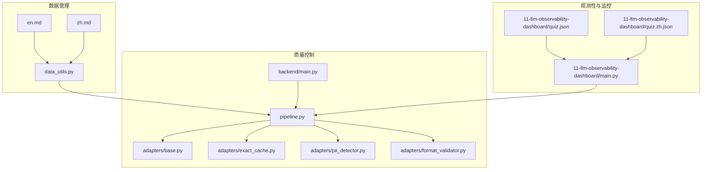
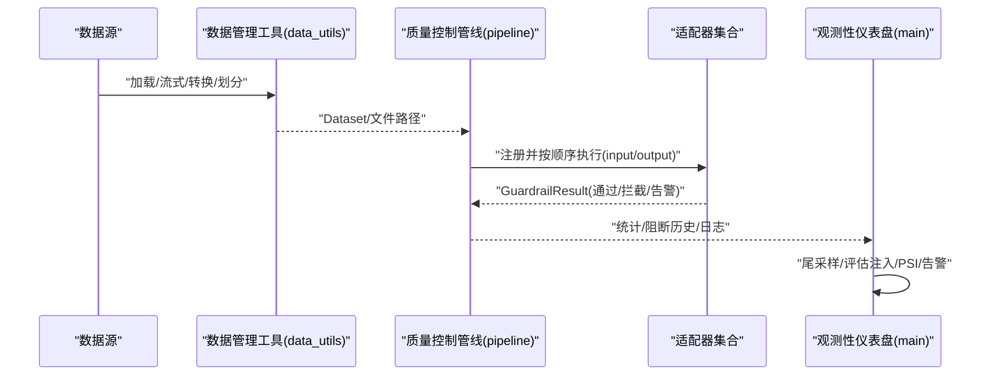
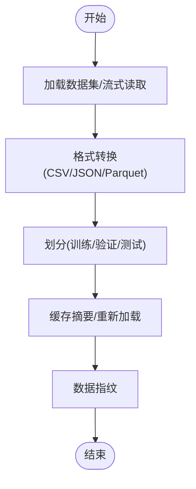
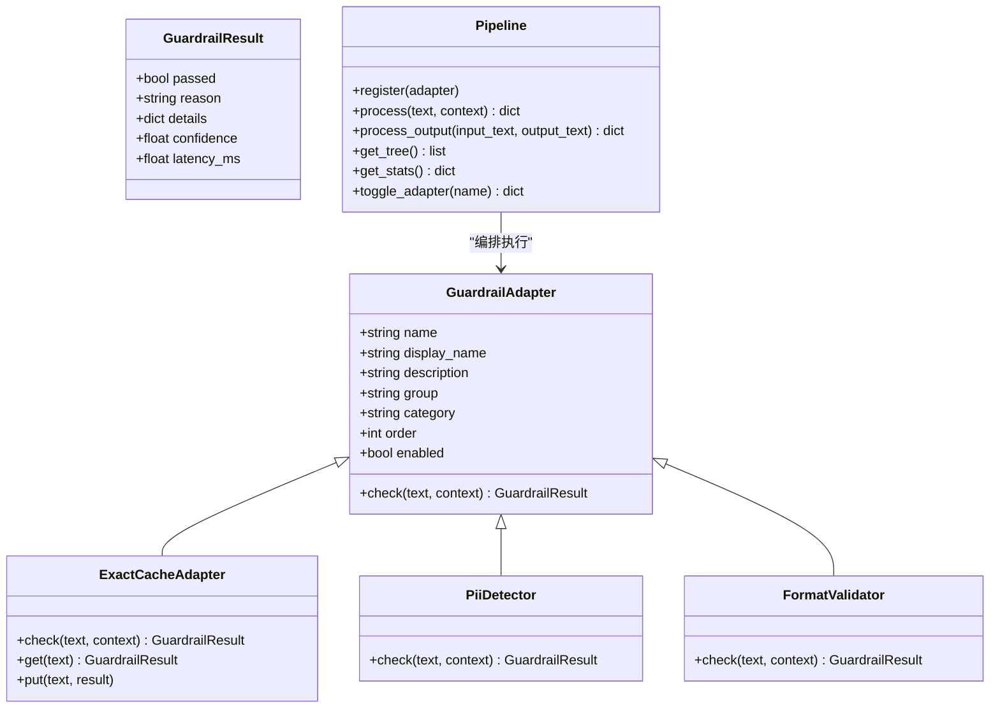
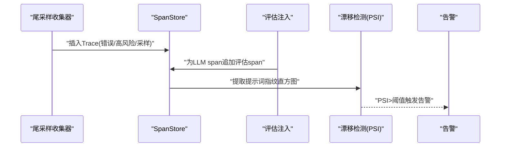
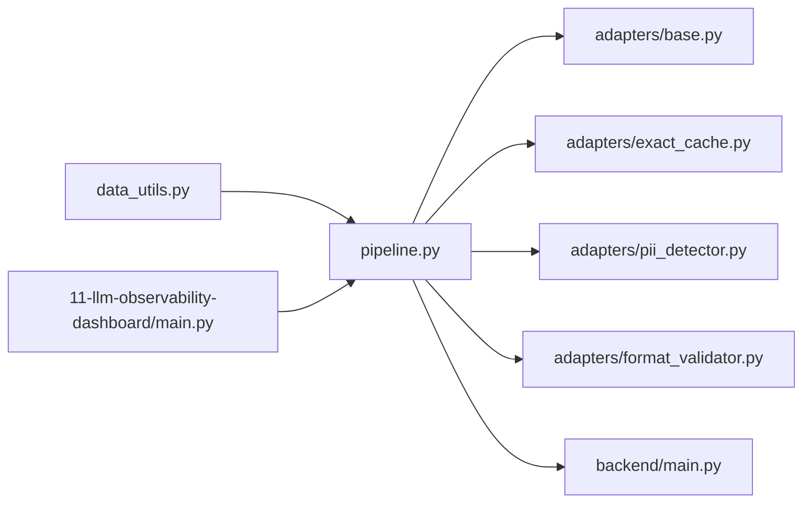

# 数据管道与质量控制

<cite>
**本文引用的文件**
- [pipeline.py](file://guardrails-sandbox/backend/pipeline.py)
- [base.py](file://guardrails-sandbox/backend/adapters/base.py)
- [exact_cache.py](file://guardrails-sandbox/backend/adapters/exact_cache.py)
- [pii_detector.py](file://guardrails-sandbox/backend/adapters/pii_detector.py)
- [format_validator.py](file://guardrails-sandbox/backend/adapters/format_validator.py)
- [main.py](file://guardrails-sandbox/backend/main.py)
- [data_utils.py](file://phases/00-setup-and-tooling/09-data-management/code/data_utils.py)
- [en.md](file://phases/00-setup-and-tooling/09-data-management/docs/en.md)
- [zh.md](file://phases/00-setup-and-tooling/09-data-management/docs/zh.md)
- [main.py](file://phases/19-capstone-projects/11-llm-observability-dashboard/code/main.py)
- [quiz.json](file://phases/19-capstone-projects/11-llm-observability-dashboard/quiz.json)
- [quiz.zh.json](file://phases/19-capstone-projects/11-llm-observability-dashboard/quiz.zh.json)
</cite>

## 目录
1. [简介](#简介)
2. [项目结构](#项目结构)
3. [核心组件](#核心组件)
4. [架构总览](#架构总览)
5. [详细组件分析](#详细组件分析)
6. [依赖分析](#依赖分析)
7. [性能考虑](#性能考虑)
8. [故障排查指南](#故障排查指南)
9. [结论](#结论)
10. [附录](#附录)

## 简介
本文件围绕“数据管道与质量控制”主题，系统梳理仓库中与数据采集、清洗、标注、组织、质量评估与监控相关的能力与实践，重点覆盖以下方面：
- 数据管道：数据源接入、格式转换、采样策略、数据增强（概念性说明）、组织与版本管理
- 质量控制：重复率、噪声检测、分布偏差分析（PSI）等指标与实现思路
- 性能优化：并行处理、内存管理、缓存机制
- 预处理流水线：从数据加载到格式落盘、划分与指纹校验
- 质量监控：观测性仪表盘、告警触发、漂移检测

## 项目结构
本仓库包含三类与数据管道密切相关的模块：
- 数据管理工具：提供数据加载、流式传输、格式转换、划分与缓存摘要等能力
- 质量控制管线：以 Guardrails 适配器为核心，串联输入/输出检查、拦截与统计
- 观测性与监控：尾采样收集、评估指标注入、漂移检测（PSI）与告警

图表来源
- [data_utils.py:1-191](file://phases/00-setup-and-tooling/09-data-management/code/data_utils.py#L1-L191)
- [en.md:55-255](file://phases/00-setup-and-tooling/09-data-management/docs/en.md#L55-L255)
- [zh.md:1-99](file://phases/00-setup-and-tooling/09-data-management/docs/zh.md#L1-L99)
- [pipeline.py:1-285](file://guardrails-sandbox/backend/pipeline.py#L1-L285)
- [base.py:1-34](file://guardrails-sandbox/backend/adapters/base.py#L1-L34)
- [exact_cache.py:1-69](file://guardrails-sandbox/backend/adapters/exact_cache.py#L1-L69)
- [pii_detector.py:1-54](file://guardrails-sandbox/backend/adapters/pii_detector.py#L1-L54)
- [format_validator.py:1-86](file://guardrails-sandbox/backend/adapters/format_validator.py#L1-L86)
- [main.py:24-58](file://guardrails-sandbox/backend/main.py#L24-L58)
- [main.py:1-258](file://phases/19-capstone-projects/11-llm-observability-dashboard/code/main.py#L1-L258)

章节来源
- [data_utils.py:1-191](file://phases/00-setup-and-tooling/09-data-management/code/data_utils.py#L1-L191)
- [en.md:55-255](file://phases/00-setup-and-tooling/09-data-management/docs/en.md#L55-L255)
- [zh.md:1-99](file://phases/00-setup-and-tooling/09-data-management/docs/zh.md#L1-L99)
- [pipeline.py:1-285](file://guardrails-sandbox/backend/pipeline.py#L1-L285)
- [base.py:1-34](file://guardrails-sandbox/backend/adapters/base.py#L1-L34)
- [exact_cache.py:1-69](file://guardrails-sandbox/backend/adapters/exact_cache.py#L1-L69)
- [pii_detector.py:1-54](file://guardrails-sandbox/backend/adapters/pii_detector.py#L1-L54)
- [format_validator.py:1-86](file://guardrails-sandbox/backend/adapters/format_validator.py#L1-L86)
- [main.py:24-58](file://guardrails-sandbox/backend/main.py#L24-L58)
- [main.py:1-258](file://phases/19-capstone-projects/11-llm-observability-dashboard/code/main.py#L1-L258)

## 核心组件
- 数据管理工具链
  - 加载与检查：支持指定数据集路径、配置与切分，打印列名、特征与首行示例
  - 流式加载：针对超大数据集，按行迭代，常数级内存占用
  - 格式转换：CSV/JSON/Parquet/Apache Arrow 互转，对比存储体积与读取速度
  - 划分策略：固定随机种子的三集划分（训练/验证/测试），保证可复现
  - 缓存摘要：统计 Hugging Face 缓存目录文件数与总大小
  - 重新加载：从 Parquet/CSV/JSON 重建 Dataset
  - 数据指纹：对前 N 行采样进行哈希，便于快速比对数据一致性
- 质量控制管线
  - 管线编排：注册适配器、按类别与顺序执行、短路拦截、统计与阻断历史
  - 适配器基类：统一结果结构与元信息字段，定义执行顺序与启用状态
  - 精确缓存：对相同输入进行结果缓存，减少重复检测开销
  - PII 检测：基于正则识别敏感信息，区分拦截与警告级别
  - 格式校验：对结构化输出（JSON/代码块/空输出）进行严格校验
- 观测性与监控
  - 尾采样收集：优先保留错误与高风险事件，降低存储与分析成本
  - 评估注入：在 LLM 调用后追加评估 span（真实性、毒性、PII 风险）
  - 漂移检测：基于提示词指纹的 PSI 计算，识别输入分布变化
  - 告警触发：阈值驱动的告警汇总，支持 MTTR 目标

章节来源
- [data_utils.py:22-153](file://phases/00-setup-and-tooling/09-data-management/code/data_utils.py#L22-L153)
- [en.md:55-255](file://phases/00-setup-and-tooling/09-data-management/docs/en.md#L55-L255)
- [zh.md:55-99](file://phases/00-setup-and-tooling/09-data-management/docs/zh.md#L55-L99)
- [pipeline.py:12-285](file://guardrails-sandbox/backend/pipeline.py#L12-L285)
- [base.py:5-34](file://guardrails-sandbox/backend/adapters/base.py#L5-L34)
- [exact_cache.py:12-69](file://guardrails-sandbox/backend/adapters/exact_cache.py#L12-L69)
- [pii_detector.py:19-54](file://guardrails-sandbox/backend/adapters/pii_detector.py#L19-L54)
- [format_validator.py:13-86](file://guardrails-sandbox/backend/adapters/format_validator.py#L13-L86)
- [main.py:46-258](file://phases/19-capstone-projects/11-llm-observability-dashboard/code/main.py#L46-L258)

## 架构总览
下图展示从数据加载到质量控制与观测性的端到端流程。

图表来源
- [data_utils.py:22-153](file://phases/00-setup-and-tooling/09-data-management/code/data_utils.py#L22-L153)
- [pipeline.py:31-127](file://guardrails-sandbox/backend/pipeline.py#L31-L127)
- [main.py:46-258](file://phases/19-capstone-projects/11-llm-observability-dashboard/code/main.py#L46-L258)

## 详细组件分析

### 数据管理工具链（数据管道基础）
- 加载与检查
  - 支持指定数据集路径、配置与切分，打印列名、特征与首行示例，便于快速洞察
- 流式加载
  - 对于超大数据集，采用流式迭代，逐行处理，内存占用与数据规模无关
- 格式转换
  - 提供 CSV/JSON/Parquet/Apache Arrow 互转，对比存储体积与读取速度，指导落盘策略
- 划分策略
  - 固定随机种子的三集划分，保证实验可复现；训练/验证/测试比例可调
- 缓存摘要与重新加载
  - 统计本地缓存目录文件数与总大小；从 Parquet/CSV/JSON 重建 Dataset
- 数据指纹
  - 对前 N 行采样进行哈希，便于快速比对数据一致性，辅助回归检测

图表来源
- [data_utils.py:22-153](file://phases/00-setup-and-tooling/09-data-management/code/data_utils.py#L22-L153)
- [en.md:55-255](file://phases/00-setup-and-tooling/09-data-management/docs/en.md#L55-L255)
- [zh.md:55-99](file://phases/00-setup-and-tooling/09-data-management/docs/zh.md#L55-L99)

章节来源
- [data_utils.py:22-153](file://phases/00-setup-and-tooling/09-data-management/code/data_utils.py#L22-L153)
- [en.md:55-255](file://phases/00-setup-and-tooling/09-data-management/docs/en.md#L55-L255)
- [zh.md:55-99](file://phases/00-setup-and-tooling/09-data-management/docs/zh.md#L55-L99)

### 质量控制管线（Guardrails）
- 管线编排
  - 注册适配器并按 order 排序；分别执行 input/output 检查；短路拦截；统计阻断率与各层通过情况
- 适配器基类
  - 统一结果结构（通过/原因/置信度/耗时/详情）；定义分组、类别、顺序与启用状态
- 精确缓存
  - 对相同输入进行结果缓存，命中则直接返回；支持 TTL 与容量上限；benchmark 模式下禁用
- PII 检测
  - 基于正则识别手机号、邮箱、身份证、信用卡、IP 地址；区分拦截与警告级别
- 格式校验
  - 校验 JSON 合法性、Markdown 代码块闭合、输入要求与空输出；错误优先级更高

图表来源
- [base.py:5-34](file://guardrails-sandbox/backend/adapters/base.py#L5-L34)
- [pipeline.py:12-285](file://guardrails-sandbox/backend/pipeline.py#L12-L285)
- [exact_cache.py:12-69](file://guardrails-sandbox/backend/adapters/exact_cache.py#L12-L69)
- [pii_detector.py:19-54](file://guardrails-sandbox/backend/adapters/pii_detector.py#L19-L54)
- [format_validator.py:13-86](file://guardrails-sandbox/backend/adapters/format_validator.py#L13-L86)

章节来源
- [pipeline.py:12-285](file://guardrails-sandbox/backend/pipeline.py#L12-L285)
- [base.py:5-34](file://guardrails-sandbox/backend/adapters/base.py#L5-L34)
- [exact_cache.py:12-69](file://guardrails-sandbox/backend/adapters/exact_cache.py#L12-L69)
- [pii_detector.py:19-54](file://guardrails-sandbox/backend/adapters/pii_detector.py#L19-L54)
- [format_validator.py:13-86](file://guardrails-sandbox/backend/adapters/format_validator.py#L13-L86)
- [main.py:24-58](file://guardrails-sandbox/backend/main.py#L24-L58)

### 观测性与监控（仪表盘）
- 尾采样收集
  - 优先保留错误与高风险事件；对成功事件按采样率抽样，降低存储与分析成本
- 评估注入
  - 在 LLM 调用后追加评估 span，包含真实性、毒性、PII 泄露等指标
- 漂移检测（PSI）
  - 基于提示词指纹直方图计算 PSI，识别输入分布变化
- 告警触发
  - 阈值驱动的告警汇总，支持 MTTR 目标（例如从注入到 Slack 告警在 5 分钟内）

图表来源
- [main.py:46-258](file://phases/19-capstone-projects/11-llm-observability-dashboard/code/main.py#L46-L258)
- [quiz.json:36-90](file://phases/19-capstone-projects/11-llm-observability-dashboard/quiz.json#L36-L90)
- [quiz.zh.json:36-90](file://phases/19-capstone-projects/11-llm-observability-dashboard/quiz.zh.json#L36-L90)

章节来源
- [main.py:46-258](file://phases/19-capstone-projects/11-llm-observability-dashboard/code/main.py#L46-L258)
- [quiz.json:36-90](file://phases/19-capstone-projects/11-llm-observability-dashboard/quiz.json#L36-L90)
- [quiz.zh.json:36-90](file://phases/19-capstone-projects/11-llm-observability-dashboard/quiz.zh.json#L36-L90)

## 依赖分析
- 组件耦合
  - 数据管理工具链与质量控制管线解耦：前者负责数据准备，后者负责质量控制
  - 观测性模块与质量控制模块通过日志与统计进行弱耦合
- 外部依赖
  - Hugging Face datasets 与缓存目录
  - Python 标准库（hashlib、math、random、time 等）

图表来源
- [data_utils.py:1-191](file://phases/00-setup-and-tooling/09-data-management/code/data_utils.py#L1-L191)
- [pipeline.py:1-285](file://guardrails-sandbox/backend/pipeline.py#L1-L285)
- [base.py:1-34](file://guardrails-sandbox/backend/adapters/base.py#L1-L34)
- [exact_cache.py:1-69](file://guardrails-sandbox/backend/adapters/exact_cache.py#L1-L69)
- [pii_detector.py:1-54](file://guardrails-sandbox/backend/adapters/pii_detector.py#L1-L54)
- [format_validator.py:1-86](file://guardrails-sandbox/backend/adapters/format_validator.py#L1-L86)
- [main.py:24-58](file://guardrails-sandbox/backend/main.py#L24-L58)
- [main.py:1-258](file://phases/19-capstone-projects/11-llm-observability-dashboard/code/main.py#L1-L258)

章节来源
- [data_utils.py:1-191](file://phases/00-setup-and-tooling/09-data-management/code/data_utils.py#L1-L191)
- [pipeline.py:1-285](file://guardrails-sandbox/backend/pipeline.py#L1-L285)
- [base.py:1-34](file://guardrails-sandbox/backend/adapters/base.py#L1-L34)
- [exact_cache.py:1-69](file://guardrails-sandbox/backend/adapters/exact_cache.py#L1-L69)
- [pii_detector.py:1-54](file://guardrails-sandbox/backend/adapters/pii_detector.py#L1-L54)
- [format_validator.py:1-86](file://guardrails-sandbox/backend/adapters/format_validator.py#L1-L86)
- [main.py:24-58](file://guardrails-sandbox/backend/main.py#L24-L58)
- [main.py:1-258](file://phases/19-capstone-projects/11-llm-observability-dashboard/code/main.py#L1-L258)

## 性能考虑
- 并行处理
  - 数据加载与格式转换建议结合多进程/多线程策略（如分片写入 Parquet），避免单点瓶颈
- 内存管理
  - 流式加载与分批处理可显著降低峰值内存；缓存大小与 TTL 需结合吞吐与命中率调优
- 缓存机制
  - 精确缓存适用于高重复输入场景；benchmark 模式禁用可避免干扰基准测试
- I/O 优化
  - 优先使用列式存储（Parquet）以提升查询与分析效率；批量写入减少元数据开销

## 故障排查指南
- 数据加载异常
  - 检查数据集路径与配置；确认缓存目录权限与空间；必要时清理缓存后重试
- 格式转换异常
  - 确认目标格式支持的字段类型；检查嵌套结构与编码问题
- 划分不一致
  - 核对随机种子与比例；确保多次运行得到相同划分
- 管线拦截频繁
  - 查看阻断历史与适配器统计；定位高频拦截项（如 PII/格式错误）
- 观测性告警
  - 关注 PSI 变化与阈值；结合尾采样保留的错误与高风险事件进行根因分析

章节来源
- [data_utils.py:111-127](file://phases/00-setup-and-tooling/09-data-management/code/data_utils.py#L111-L127)
- [pipeline.py:264-285](file://guardrails-sandbox/backend/pipeline.py#L264-L285)
- [main.py:201-212](file://phases/19-capstone-projects/11-llm-observability-dashboard/code/main.py#L201-L212)

## 结论
本仓库提供了从数据准备到质量控制与观测性的完整实践路径：以数据管理工具链为基础，以 Guardrails 管线为质量控制中枢，以观测性仪表盘为运营保障。通过 PSI 等指标与尾采样策略，可在保证性能的同时持续监控输入分布与输出质量，从而提升模型在真实场景中的鲁棒性与可靠性。

## 附录
- 数据质量评估指标建议
  - 重复率：基于指纹或哈希的去重统计
  - 噪声检测：正则/规则/分类器识别异常模式
  - 分布偏差：PSI/KL 散度/卡方检验等
- 数据增强（概念性）
  - 同义替换、回译、构造对抗样本等，需与质量控制策略协同设计
- 数据验证与监控方案
  - 建立数据指纹与版本化管理；在流水线上加入格式/长度/分布校验；结合观测性仪表盘进行持续告警