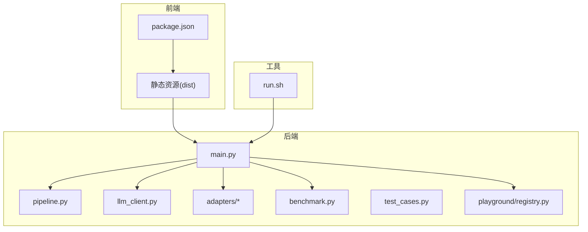
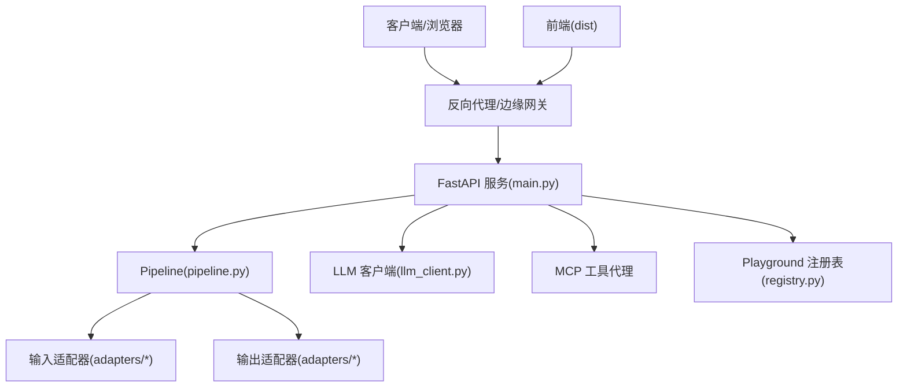
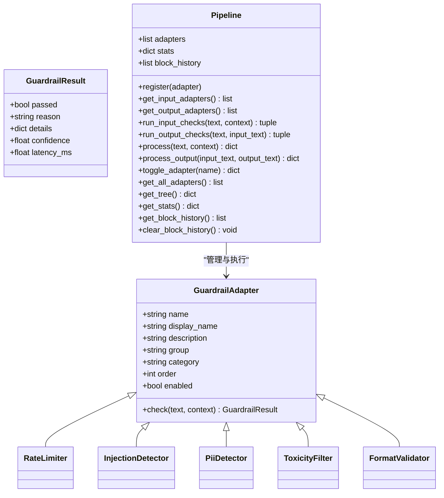
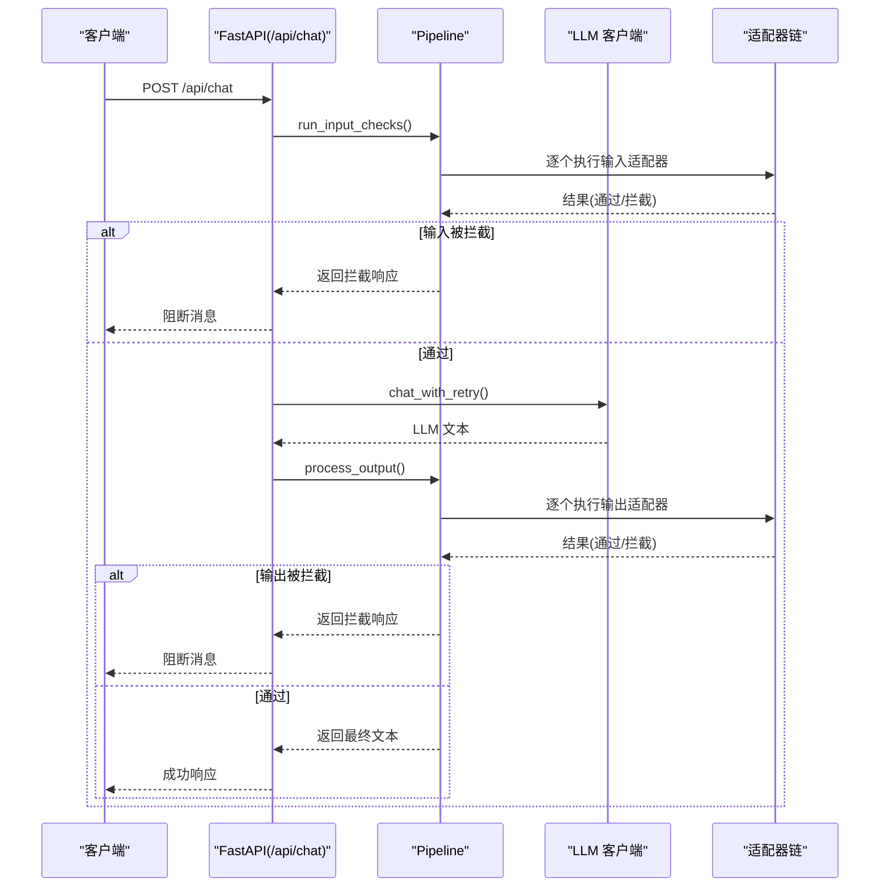
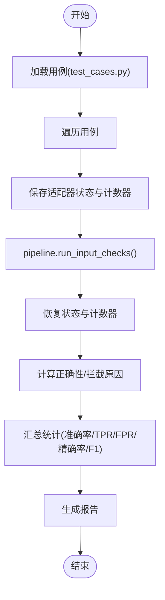
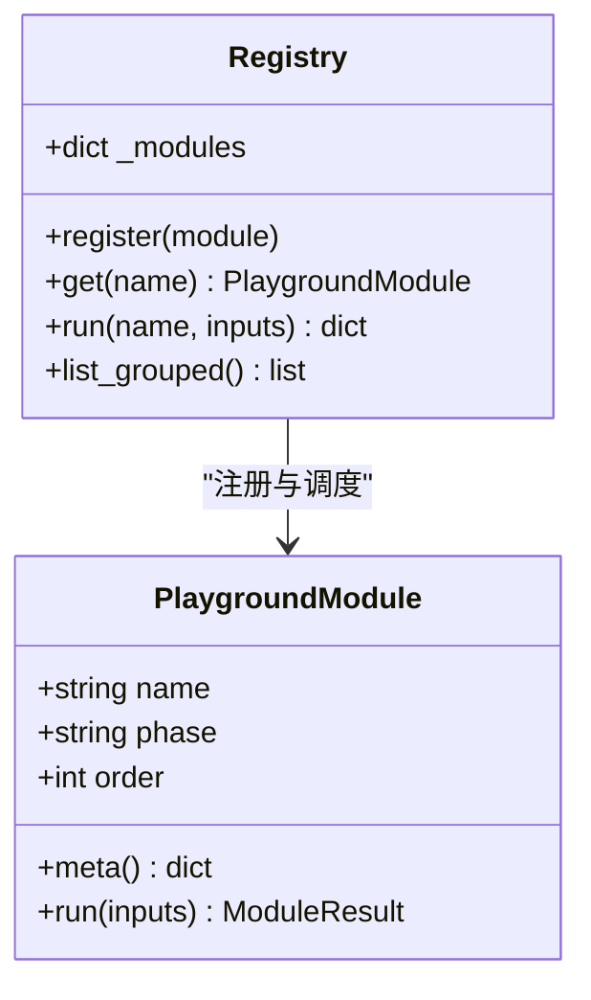
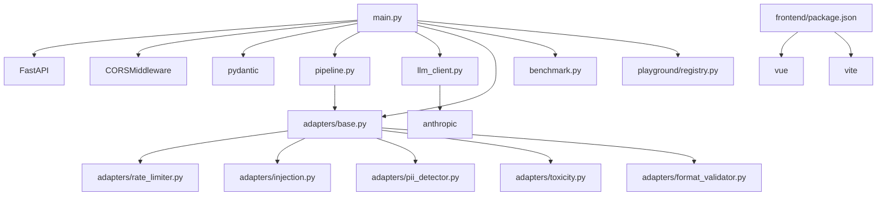

# 完整LLM管道构建

<cite>
**本文引用的文件**
- [main.py](file://guardrails-sandbox/backend/main.py)
- [pipeline.py](file://guardrails-sandbox/backend/pipeline.py)
- [llm_client.py](file://guardrails-sandbox/backend/llm_client.py)
- [benchmark.py](file://guardrails-sandbox/backend/benchmark.py)
- [run.sh](file://guardrails-sandbox/run.sh)
- [test_cases.py](file://guardrails-sandbox/backend/test_cases.py)
- [base.py](file://guardrails-sandbox/backend/adapters/base.py)
- [injection.py](file://guardrails-sandbox/backend/adapters/injection.py)
- [pii_detector.py](file://guardrails-sandbox/backend/adapters/pii_detector.py)
- [toxicity.py](file://guardrails-sandbox/backend/adapters/toxicity.py)
- [rate_limiter.py](file://guardrails-sandbox/backend/adapters/rate_limiter.py)
- [format_validator.py](file://guardrails-sandbox/backend/adapters/format_validator.py)
- [registry.py](file://guardrails-sandbox/backend/playground/registry.py)
- [package.json](file://guardrails-sandbox/frontend/package.json)
- [README.md](file://README.md)
</cite>

## 目录
1. [简介](#简介)
2. [项目结构](#项目结构)
3. [核心组件](#核心组件)
4. [架构总览](#架构总览)
5. [详细组件分析](#详细组件分析)
6. [依赖关系分析](#依赖关系分析)
7. [性能考量](#性能考量)
8. [故障排查指南](#故障排查指南)
9. [结论](#结论)
10. [附录](#附录)

## 简介
本工程文档围绕“完整LLM管道构建”目标，系统梳理并阐述该项目在服务架构、API设计、生产部署、监控告警、可观测性与安全防护等方面的工程实践。项目以FastAPI为核心，提供Guardrails沙箱、LLM调用、基准测试、实验台（Playground）与前端可视化，形成从开发到生产的闭环。

## 项目结构
项目采用前后端分离与功能模块化组织方式：
- 后端（Python/FastAPI）：主服务入口、Pipeline编排、LLM客户端、适配器集合、基准测试与Playground注册表
- 前端（Vue/Vite）：实验台与沙箱界面，静态资源托管
- 运维脚本：一键启动后端与前端服务

**图表来源**
- [main.py:1-421](file://guardrails-sandbox/backend/main.py#L1-L421)
- [pipeline.py:1-285](file://guardrails-sandbox/backend/pipeline.py#L1-L285)
- [llm_client.py:1-51](file://guardrails-sandbox/backend/llm_client.py#L1-L51)
- [benchmark.py:1-169](file://guardrails-sandbox/backend/benchmark.py#L1-L169)
- [test_cases.py:1-155](file://guardrails-sandbox/backend/test_cases.py#L1-L155)
- [registry.py:1-118](file://guardrails-sandbox/backend/playground/registry.py#L1-L118)
- [run.sh:1-35](file://guardrails-sandbox/run.sh#L1-L35)
- [package.json:1-21](file://guardrails-sandbox/frontend/package.json#L1-L21)

**章节来源**
- [main.py:1-421](file://guardrails-sandbox/backend/main.py#L1-L421)
- [run.sh:1-35](file://guardrails-sandbox/run.sh#L1-L35)
- [package.json:1-21](file://guardrails-sandbox/frontend/package.json#L1-L21)

## 核心组件
- 服务入口与路由：FastAPI应用、CORS中间件、静态文件挂载、聊天接口、对比模式、基准测试、MCP工具代理、Playground模块运行
- Pipeline编排：注册适配器、按类别与顺序执行、统计与拦截历史、开关控制
- LLM客户端：统一的LLM调用封装与重试策略
- Guardrails适配器：速率限制、注入检测、PII检测、毒性过滤、格式校验等
- 基准测试：用例集、运行器、指标统计
- Playground注册表：模块化实验台，按阶段分组与动态注册

**章节来源**
- [main.py:118-281](file://guardrails-sandbox/backend/main.py#L118-L281)
- [pipeline.py:12-285](file://guardrails-sandbox/backend/pipeline.py#L12-L285)
- [llm_client.py:1-51](file://guardrails-sandbox/backend/llm_client.py#L1-L51)
- [benchmark.py:10-169](file://guardrails-sandbox/backend/benchmark.py#L10-L169)
- [registry.py:48-118](file://guardrails-sandbox/backend/playground/registry.py#L48-L118)

## 架构总览
整体架构分为三层：接入层（FastAPI）、业务层（Pipeline与适配器）、数据/外部服务层（LLM）。系统支持：
- 微服务拆分：后端服务独立，前端静态资源托管，MCP工具通过进程通信对接
- API网关：当前为单一FastAPI实例，可通过反向代理或边缘网关扩展
- 负载均衡：通过多实例部署与反向代理实现
- 服务发现：可借助Kubernetes或服务网格实现
- 安全与可观测性：适配器链路、日志与指标采集、基准测试与拦截历史

**图表来源**
- [main.py:79-85](file://guardrails-sandbox/backend/main.py#L79-L85)
- [main.py:155-221](file://guardrails-sandbox/backend/main.py#L155-L221)
- [pipeline.py:31-127](file://guardrails-sandbox/backend/pipeline.py#L31-L127)
- [llm_client.py:15-31](file://guardrails-sandbox/backend/llm_client.py#L15-L31)
- [registry.py:58-84](file://guardrails-sandbox/backend/playground/registry.py#L58-L84)

## 详细组件分析

### 组件A：Pipeline编排与适配器链
Pipeline负责注册、排序与执行Guardrails适配器，支持输入/输出两类检查，并记录统计与拦截历史。适配器遵循统一基类，定义名称、显示名、分组、类别、顺序与启用状态。

**图表来源**
- [base.py:5-34](file://guardrails-sandbox/backend/adapters/base.py#L5-L34)
- [pipeline.py:12-285](file://guardrails-sandbox/backend/pipeline.py#L12-L285)
- [rate_limiter.py:7-56](file://guardrails-sandbox/backend/adapters/rate_limiter.py#L7-L56)
- [injection.py:44-88](file://guardrails-sandbox/backend/adapters/injection.py#L44-L88)
- [pii_detector.py:19-54](file://guardrails-sandbox/backend/adapters/pii_detector.py#L19-L54)
- [toxicity.py:22-64](file://guardrails-sandbox/backend/adapters/toxicity.py#L22-L64)
- [format_validator.py:13-86](file://guardrails-sandbox/backend/adapters/format_validator.py#L13-L86)

**章节来源**
- [pipeline.py:12-285](file://guardrails-sandbox/backend/pipeline.py#L12-L285)
- [base.py:14-34](file://guardrails-sandbox/backend/adapters/base.py#L14-L34)

### 组件B：聊天API与LLM调用流程
聊天接口包含输入检查、LLM调用与输出检查三段式流程；支持对比模式（有/无Guardrails）与基准测试。

**图表来源**
- [main.py:155-221](file://guardrails-sandbox/backend/main.py#L155-L221)
- [pipeline.py:31-161](file://guardrails-sandbox/backend/pipeline.py#L31-L161)
- [llm_client.py:33-44](file://guardrails-sandbox/backend/llm_client.py#L33-L44)

**章节来源**
- [main.py:155-221](file://guardrails-sandbox/backend/main.py#L155-L221)
- [pipeline.py:86-161](file://guardrails-sandbox/backend/pipeline.py#L86-L161)
- [llm_client.py:15-44](file://guardrails-sandbox/backend/llm_client.py#L15-L44)

### 组件C：基准测试与指标
基准测试引擎对用例逐一执行输入检查，对比预期与实际，统计准确率、TPR/FPR、精确率与F1分数，并按类别与拦截层汇总。

**图表来源**
- [benchmark.py:14-169](file://guardrails-sandbox/backend/benchmark.py#L14-L169)
- [test_cases.py:10-155](file://guardrails-sandbox/backend/test_cases.py#L10-L155)

**章节来源**
- [benchmark.py:10-169](file://guardrails-sandbox/backend/benchmark.py#L10-L169)
- [test_cases.py:1-155](file://guardrails-sandbox/backend/test_cases.py#L1-L155)

### 组件D：Playground实验台
Playground注册表集中管理实验模块，按阶段分组并在前端渲染导航树，支持动态注册与运行。

**图表来源**
- [registry.py:48-118](file://guardrails-sandbox/backend/playground/registry.py#L48-L118)

**章节来源**
- [registry.py:48-118](file://guardrails-sandbox/backend/playground/registry.py#L48-L118)

## 依赖关系分析
- 后端依赖：FastAPI、CORS、pydantic、anthropic（LLM）、sentence-transformers（离线模型预热）
- 适配器依赖：正则表达式、collections.deque（滑动窗口）、json（格式校验）
- 前端依赖：Vue、Vite、TypeScript

**图表来源**
- [main.py:10-18](file://guardrails-sandbox/backend/main.py#L10-L18)
- [llm_client.py:5-12](file://guardrails-sandbox/backend/llm_client.py#L5-L12)
- [package.json:11-20](file://guardrails-sandbox/frontend/package.json#L11-L20)

**章节来源**
- [main.py:10-18](file://guardrails-sandbox/backend/main.py#L10-L18)
- [llm_client.py:5-12](file://guardrails-sandbox/backend/llm_client.py#L5-L12)
- [package.json:11-20](file://guardrails-sandbox/frontend/package.json#L11-L20)

## 性能考量
- 预热与连接稳定性：在启动前预加载SentenceTransformer模型，避免异步环境下的HTTP连接问题
- LLM调用重试：指数退避重试，提升调用稳定性
- 适配器顺序：通过order字段控制执行顺序，短路拦截减少无效LLM调用
- 统计与延迟：记录各适配器耗时，便于定位瓶颈
- 前后端分离：前端静态资源由静态文件服务提供，降低后端压力

**章节来源**
- [main.py:62-77](file://guardrails-sandbox/backend/main.py#L62-L77)
- [llm_client.py:33-44](file://guardrails-sandbox/backend/llm_client.py#L33-L44)
- [pipeline.py:22-23](file://guardrails-sandbox/backend/pipeline.py#L22-L23)
- [pipeline.py:42-44](file://guardrails-sandbox/backend/pipeline.py#L42-L44)

## 故障排查指南
- 拦截历史：Pipeline维护拦截历史，最多保留50条，包含时间戳、输入片段、适配器名、阶段、原因与置信度
- 对比模式：对比“无Guardrails”与“有Guardrails”的输出，快速定位适配器影响
- 基准测试：通过用例集评估各适配器的拦截效果与误报率
- MCP工具代理：通过标准IO与MCP服务器通信，异常时返回错误信息
- 前端联调：run.sh脚本同时启动后端与前端，自动代理/api到后端

**章节来源**
- [pipeline.py:264-285](file://guardrails-sandbox/backend/pipeline.py#L264-L285)
- [main.py:223-257](file://guardrails-sandbox/backend/main.py#L223-L257)
- [benchmark.py:29-81](file://guardrails-sandbox/backend/benchmark.py#L29-L81)
- [main.py:305-357](file://guardrails-sandbox/backend/main.py#L305-L357)
- [run.sh:12-35](file://guardrails-sandbox/run.sh#L12-L35)

## 结论
本项目以Pipeline为中心，将Guardrails适配器以链式方式串联，形成可插拔、可配置、可观测的安全与质量保障体系。配合LLM客户端、基准测试与Playground实验台，既满足教学演示，也为生产级部署提供了清晰的工程路径。建议在生产环境中进一步完善：服务网格与服务发现、API网关与限流、分布式追踪与指标采集、自动化部署与弹性伸缩、安全审计与合规检查。

## 附录
- 一键启动：run.sh脚本同时启动后端与前端，自动代理/api到后端
- 前端依赖：Vue、Vite、TypeScript
- 项目总览：README.md提供课程与阶段概览

**章节来源**
- [run.sh:1-35](file://guardrails-sandbox/run.sh#L1-L35)
- [package.json:1-21](file://guardrails-sandbox/frontend/package.json#L1-L21)
- [README.md:1-800](file://README.md#L1-L800)