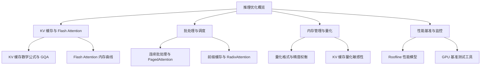
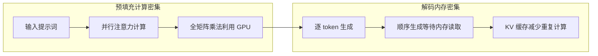
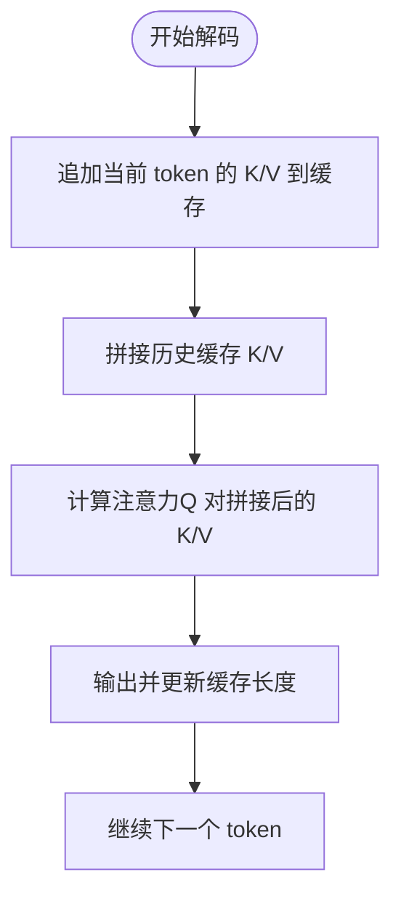
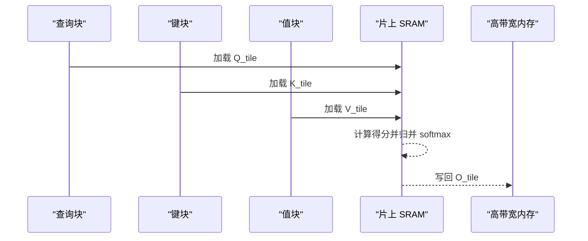
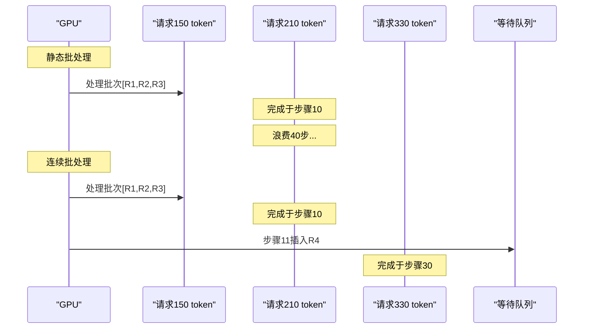
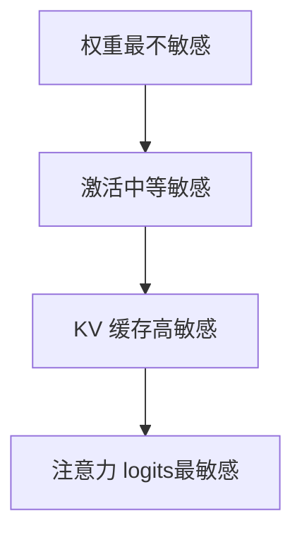
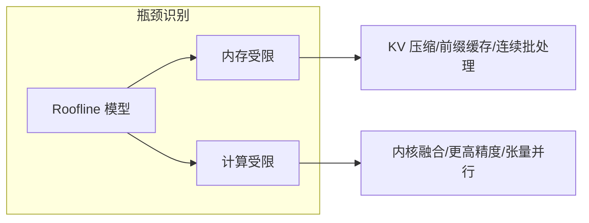

# 推理优化策略

<cite>
**本文档引用的文件**
- [推理优化](file://phases/10-llms-from-scratch/12-inference-optimization/docs/en.md)
- [KV 缓存、Flash Attention 与推理优化](file://phases/07-transformers-deep-dive/12-kv-cache-flash-attention/docs/en.md)
- [量化：让模型适配](file://phases/10-llms-from-scratch/11-quantization/docs/en.md)
- [lesson-figures.js](file://site/lesson-figures.js)
- [figures-transformers.js](file://site/figures-transformers.js)
- [roofline 性能模型](file://site/figures-infra.js)
- [GPU 设置与云平台测验](file://phases/00-setup-and-tooling/03-gpu-setup-and-cloud/quiz.json)
</cite>

## 目录
1. [引言](#引言)
2. [项目结构](#项目结构)
3. [核心组件](#核心组件)
4. [架构总览](#架构总览)
5. [详细组件分析](#详细组件分析)
6. [依赖关系分析](#依赖关系分析)
7. [性能考量](#性能考量)
8. [故障排查指南](#故障排查指南)
9. [结论](#结论)
10. [附录](#附录)

## 引言
本技术文档围绕推理优化策略进行系统化梳理，重点覆盖以下主题：
- KV 缓存机制：原理、实现、内存优化与查询效率提升
- 批处理优化：静态批处理、连续批处理、分页注意力（PagedAttention）
- 内存管理优化：显存分配、碎片化治理、前缀缓存与 KV 压缩
- 推理加速技术：Flash Attention、分组查询注意力（GQA）、前缀缓存
- 性能基准测试：延迟测量、吞吐量分析、资源利用率监控
- 实战应用：在不同硬件与部署场景下的优化建议与最佳实践

## 项目结构
该仓库提供了从基础概念到工程实践的完整路径，推理优化相关内容主要分布在“LLMs From Scratch”与“Transformers Deep Dive”两个阶段中，并辅以交互式可视化工具帮助理解关键指标。

图示来源
- [推理优化:27-61](file://phases/10-llms-from-scratch/12-inference-optimization/docs/en.md#L27-L61)
- [KV 缓存、Flash Attention 与推理优化:10-22](file://phases/07-transformers-deep-dive/12-kv-cache-flash-attention/docs/en.md#L10-L22)
- [量化：让模型适配:10-26](file://phases/10-llms-from-scratch/11-quantization/docs/en.md#L10-L26)

章节来源
- [推理优化:1-784](file://phases/10-llms-from-scratch/12-inference-optimization/docs/en.md#L1-L784)
- [KV 缓存、Flash Attention 与推理优化:1-239](file://phases/07-transformers-deep-dive/12-kv-cache-flash-attention/docs/en.md#L1-L239)
- [量化：让模型适配:1-800](file://phases/10-llms-from-scratch/11-quantization/docs/en.md#L1-L800)

## 核心组件
- KV 缓存：存储历史键值向量，避免重复计算，将解码复杂度从 O(N^2) 降至 O(N)
- 连续批处理：动态插入新请求，最大化 GPU 利用率
- 分页注意力（PagedAttention）：虚拟内存管理，消除碎片化，支持共享前缀
- 前缀缓存：跨请求复用公共前缀的 KV，显著减少预填充开销
- 量化：通过降低权重与激活精度压缩显存与提升吞吐
- Flash Attention：按块计算注意力，避免 N×N 分数矩阵上 HBM，内存复杂度从 O(N^2) 降为 O(N)

章节来源
- [推理优化:62-156](file://phases/10-llms-from-scratch/12-inference-optimization/docs/en.md#L62-L156)
- [KV 缓存、Flash Attention 与推理优化:27-124](file://phases/07-transformers-deep-dive/12-kv-cache-flash-attention/docs/en.md#L27-L124)
- [量化：让模型适配:83-141](file://phases/10-llms-from-scratch/11-quantization/docs/en.md#L83-L141)

## 架构总览
下图展示了推理优化的关键路径：预填充（计算密集）与解码（内存密集）阶段的差异，以及各优化技术如何作用于这两个阶段。

图示来源
- [推理优化:29-61](file://phases/10-llms-from-scratch/12-inference-optimization/docs/en.md#L29-L61)

章节来源
- [推理优化:27-61](file://phases/10-llms-from-scratch/12-inference-optimization/docs/en.md#L27-L61)

## 详细组件分析

### KV 缓存机制
- 数学公式与规模估算：每 token 每层的字节数为 2 × num_layers × num_kv_heads × head_dim × dtype_bytes；总 KV 缓存随上下文长度与批量线性增长
- GQA（分组查询注意力）：多个查询头共享一个 KV 头，显著缩小 KV 缓存体积，同时保持质量
- 实现要点：在多头注意力中维护 per-layer、per-head 的 K/V 序列，生成新 token 时仅追加当前 token 的 K/V，并拼接历史缓存

图示来源
- [KV 缓存、Flash Attention 与推理优化:133-150](file://phases/07-transformers-deep-dive/12-kv-cache-flash-attention/docs/en.md#L133-L150)
- [推理优化:252-294](file://phases/10-llms-from-scratch/12-inference-optimization/docs/en.md#L252-L294)

章节来源
- [KV 缓存、Flash Attention 与推理优化:27-98](file://phases/07-transformers-deep-dive/12-kv-cache-flash-attention/docs/en.md#L27-L98)
- [推理优化:252-294](file://phases/10-llms-from-scratch/12-inference-optimization/docs/en.md#L252-L294)

### Flash Attention（分块注意力）
- 核心思想：按块（tile）计算注意力，避免将完整的 N×N 分数矩阵写入 HBM，内存复杂度从 O(N^2) 降为 O(N)
- 性能收益：在 A100 上可获得 2× 速度提升，在 H100 上使用 FP8 可达 5–10×
- 可视化：交互式图展示了标准注意力与 Flash Attention 的内存曲线对比

图示来源
- [KV 缓存、Flash Attention 与推理优化:74-87](file://phases/07-transformers-deep-dive/12-kv-cache-flash-attention/docs/en.md#L74-L87)
- [figures-transformers.js:406-445](file://site/figures-transformers.js#L406-L445)

章节来源
- [KV 缓存、Flash Attention 与推理优化:62-101](file://phases/07-transformers-deep-dive/12-kv-cache-flash-attention/docs/en.md#L62-L101)
- [figures-transformers.js:406-445](file://site/figures-transformers.js#L406-L445)

### 批处理优化：连续批处理与分页注意力
- 连续批处理：当任意请求完成时立即替换为新请求，避免空槽，显著提升吞吐
- 分页注意力（PagedAttention）：将 KV 缓存按固定大小页面分配，通过页表映射逻辑位置到物理块，消除碎片化，支持共享前缀的写时复制（COW）

图示来源
- [推理优化:105-128](file://phases/10-llms-from-scratch/12-inference-optimization/docs/en.md#L105-L128)

章节来源
- [推理优化:99-156](file://phases/10-llms-from-scratch/12-inference-optimization/docs/en.md#L99-L156)

### 前缀缓存与 RadixAttention
- 前缀缓存：对公共前缀（如系统提示词、检索到的上下文）计算并缓存 KV，后续请求直接复用，大幅减少预填充时间
- RadixAttention：基于基数树（前缀树）索引前缀，支持部分匹配，实现跨请求的 KV 共享

章节来源
- [推理优化:188-197](file://phases/10-llms-from-scratch/12-inference-optimization/docs/en.md#L188-L197)

### 内存管理与量化
- 量化格式与收益：FP16→FP8 减半显存，FP16→INT4 压缩至四分之一；H100 上 FP8 推理通常 30–50% 更快且质量损失极小
- 敏感性层次：权重最不敏感，激活次之，KV 缓存再次之，注意力 logits 最敏感（需保持较高精度）
- 方法对比：PTQ（训练后量化）快速但 INT4 质量有限；QAT（量化感知训练）质量更高但需要再训练
- GPTQ/AWQ：通过校准数据最小化量化误差，AWQ 更强调“重要权重”的保护

图示来源
- [量化：让模型适配:110-141](file://phases/10-llms-from-scratch/11-quantization/docs/en.md#L110-L141)

章节来源
- [量化：让模型适配:10-26](file://phases/10-llms-from-scratch/11-quantization/docs/en.md#L10-L26)
- [量化：让模型适配:110-141](file://phases/10-llms-from-scratch/11-quantization/docs/en.md#L110-L141)

### KV 缓存内存计算器与交互式可视化
- 提供 KV 缓存大小估算工具，支持调整层数、KV 头数、头维度、序列长度与数据类型，直观展示缓存占比与超限风险
- 支持不同位宽（FP16/FP8/INT8）对比，辅助容量规划

章节来源
- [lesson-figures.js:96-144](file://site/lesson-figures.js#L96-L144)

## 依赖关系分析
- 预填充阶段：关注计算吞吐（FLOPS），优化方向为内核融合、更高精度或更大批
- 解码阶段：关注内存带宽与缓存命中，优化方向为 KV 压缩、连续批处理、分页注意力与前缀缓存
- 工具链：Roofline 模型用于判断当前瓶颈（计算/内存），nvidia-smi 用于监控 GPU 使用情况

图示来源
- [roofline 性能模型:391-428](file://site/figures-infra.js#L391-L428)
- [推理优化:223-244](file://phases/10-llms-from-scratch/12-inference-optimization/docs/en.md#L223-L244)

章节来源
- [roofline 性能模型:391-428](file://site/figures-infra.js#L391-L428)
- [推理优化:223-244](file://phases/10-llms-from-scratch/12-inference-optimization/docs/en.md#L223-L244)

## 性能考量
- 延迟测量：使用同步计时（如 CUDA 同步）避免异步执行导致的低估；关注 TTFT（首 token 延迟）与平均生成延迟
- 吞吐量分析：TPS（每秒令牌数）、每请求吞吐、并发用户下的总体吞吐
- 资源利用率监控：GPU 利用率、显存占用、内存带宽使用率、核函数耗时分布
- 基准测试建议：使用稳定负载（不同序列长度、批大小、并发度）进行多轮采样，剔除冷启动与首次热身的影响

章节来源
- [GPU 设置与云平台测验:24-39](file://phases/00-setup-and-tooling/03-gpu-setup-and-cloud/quiz.json#L24-L39)

## 故障排查指南
- GPU 可见性与状态：使用 nvidia-smi 检查设备状态、显存占用与温度
- 计时准确性：在 GPU 计时前调用同步 API，确保所有异步操作完成
- 显存不足：优先启用 KV 压缩（FP8/INT8）、前缀缓存、分页注意力；评估模型量化（INT4/INT2）对任务质量的影响
- 吞吐下降：检查是否仍处于静态批处理模式；切换为连续批处理；增大批大小以摊薄固定开销

章节来源
- [GPU 设置与云平台测验:24-39](file://phases/00-setup-and-tooling/03-gpu-setup-and-cloud/quiz.json#L24-L39)
- [推理优化:99-156](file://phases/10-llms-from-scratch/12-inference-optimization/docs/en.md#L99-L156)

## 结论
推理优化的核心在于“以内存换计算”与“以空间换时间”。KV 缓存与 Flash Attention 将解码复杂度从二次方降至线性，连续批处理与分页注意力最大化硬件利用率，前缀缓存与量化进一步降低显存压力与计算成本。结合 Roofline 模型与系统监控，可以精准定位瓶颈并制定针对性优化策略。

## 附录
- 关键术语速查：KV 缓存、连续批处理、PagedAttention、前缀缓存、Roofline、TTFT、TPS
- 实战清单：
  - 部署前先做容量规划（KV 缓存计算器）
  - 启用 KV 压缩与前缀缓存
  - 切换到连续批处理与分页注意力
  - 评估量化（FP8/INT4）对任务质量与吞吐的影响
  - 使用 Roofline 模型指导优化方向
  - 建立端到端的延迟与吞吐监控