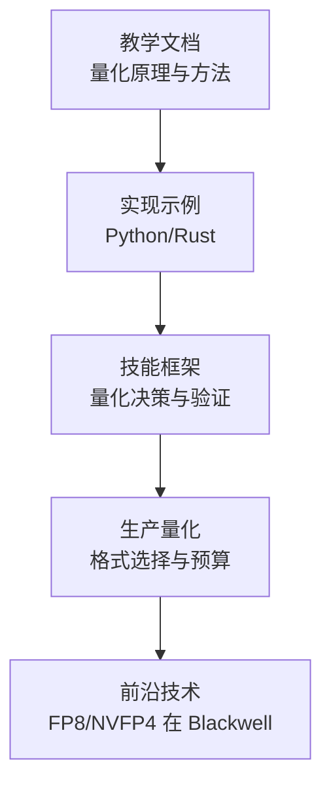
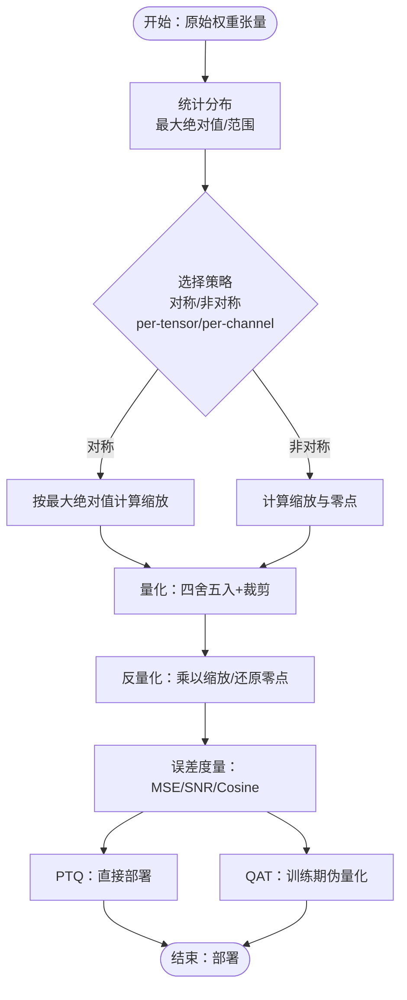
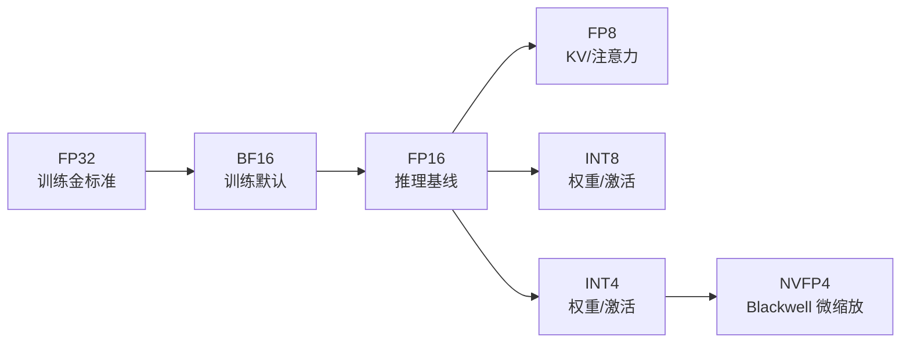
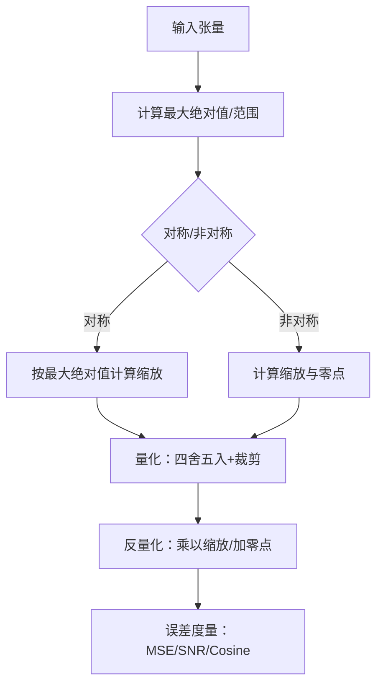
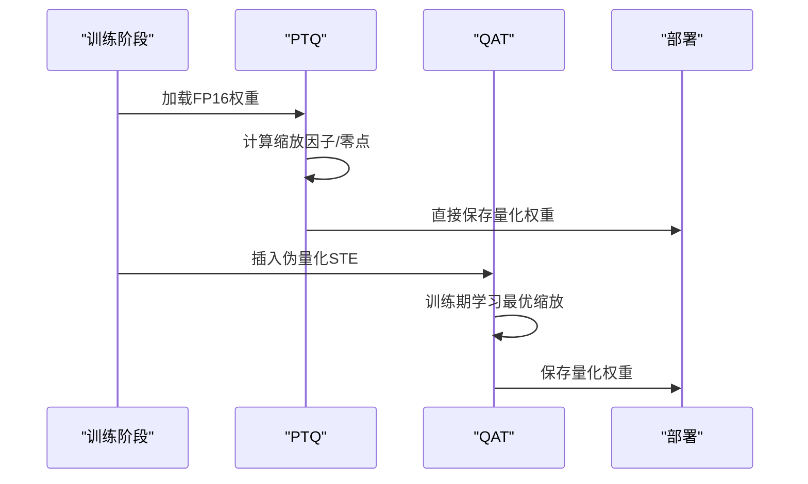
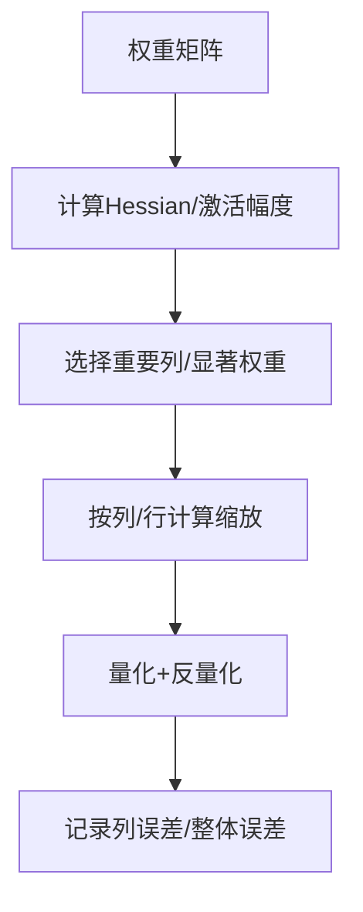
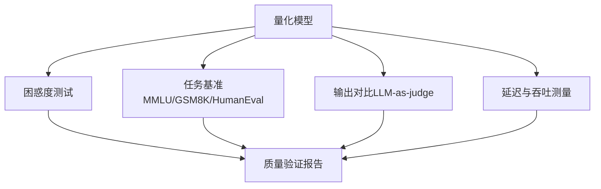
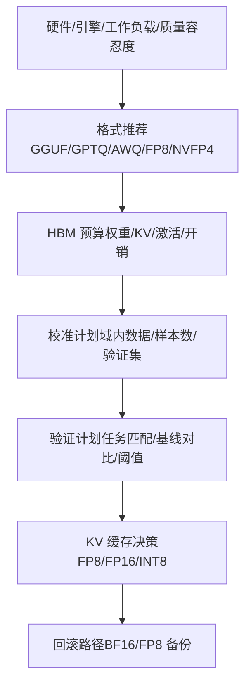
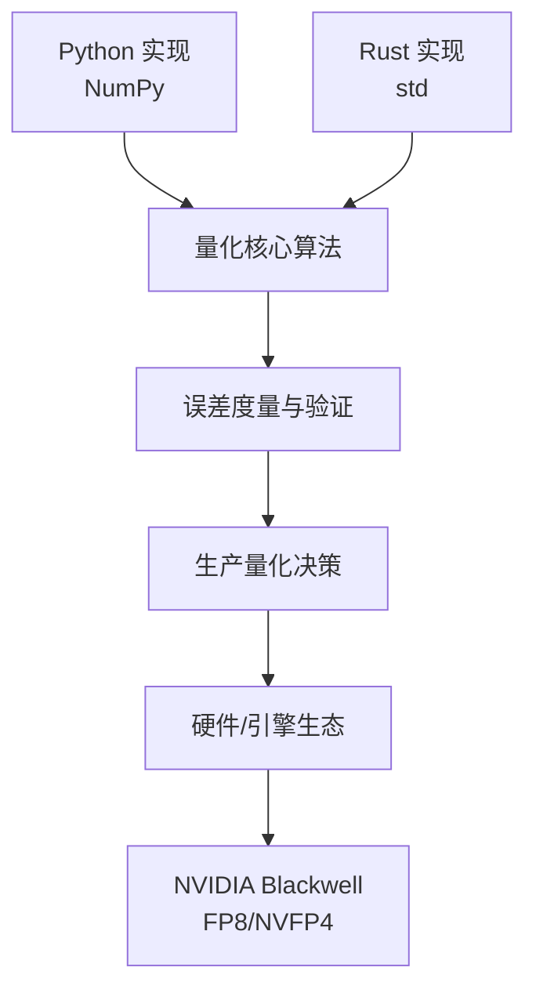

# 模型量化技术

<cite>
**本文引用的文件**
- [量化构建文档](file://phases/10-llms-from-scratch/11-quantization/docs/en.md)
- [量化实现（Python）](file://phases/10-llms-from-scratch/11-quantization/code/main.py)
- [量化实现（Rust）](file://phases/10-llms-from-scratch/11-quantization/code/main.rs)
- [量化技能框架](file://phases/10-llms-from-scratch/11-quantization/outputs/skill-quantization.md)
- [生产量化选择器](file://phases/17-infrastructure-and-production/09-production-quantization/outputs/skill-quantization-picker.md)
- [Blackwell上的FP8与NVFP4](file://phases/17-infrastructure-and-production/07-tensorrt-llm-blackwell/docs/en.md)
- [术语表（量化）](file://glossary/terms.md)
</cite>

## 目录
1. [引言](#引言)
2. [项目结构](#项目结构)
3. [核心组件](#核心组件)
4. [架构总览](#架构总览)
5. [详细组件分析](#详细组件分析)
6. [依赖关系分析](#依赖关系分析)
7. [性能考量](#性能考量)
8. [故障排查指南](#故障排查指南)
9. [结论](#结论)
10. [附录](#附录)

## 引言
本技术文档系统梳理模型量化技术，覆盖从基础原理到工程实践的关键环节，重点包括：
- 各类量化格式与方法：INT8、INT4、FP4/NVFP4、FP8、GPTQ、AWQ、GGUF 的区别与适用场景
- 两类主流流程：后训练量化（PTQ）与量化感知训练（QAT）的技术差异与权衡
- 量化策略选择：per-channel 与 per-tensor 的权衡、权重分布特性与精度损失控制
- 关键实现步骤：权重校准、量化参数计算、反量化恢复、端到端质量评估
- 实战案例：量化前后的性能对比（内存占用、吞吐、延迟）

## 项目结构
本仓库围绕“量化”主题提供了多层级材料：
- 教学文档：系统讲解量化原理、方法与工程实践
- 可运行示例：Python/Rust 实现，涵盖对称/非对称量化、GPTQ/AWQ 模拟、误差度量与位宽扫描
- 技能框架：面向生产的量化决策与验证流程
- 生产量化：针对不同硬件/引擎/工作负载的量化格式选择与预算估算
- 前沿技术：Blackwell 上的 FP8 与 NVFP4 混合精度栈

**章节来源**
- [量化构建文档:1-80](file://phases/10-llms-from-scratch/11-quantization/docs/en.md#L1-L80)
- [量化实现（Python）:1-505](file://phases/10-llms-from-scratch/11-quantization/code/main.py#L1-L505)
- [量化实现（Rust）:1-183](file://phases/10-llms-from-scratch/11-quantization/code/main.rs#L1-L183)
- [量化技能框架:1-140](file://phases/10-llms-from-scratch/11-quantization/outputs/skill-quantization.md#L1-L140)
- [生产量化选择器:1-33](file://phases/17-infrastructure-and-production/09-production-quantization/outputs/skill-quantization-picker.md#L1-L33)
- [Blackwell上的FP8与NVFP4:1-115](file://phases/17-infrastructure-and-production/07-tensorrt-llm-blackwell/docs/en.md#L1-L115)

## 核心组件
- 数字格式与位宽：理解 FP32/FP16/BF16/FP8/INT8/INT4 的组成与动态范围，明确每比特的作用
- 对称/非对称量化：对称量化以最大绝对值确定缩放；非对称量化引入零点偏移，适配非零中心分布
- per-tensor 与 per-channel：前者简单但易受异常值影响；后者按通道独立缩放，显著提升质量
- PTQ 与 QAT：PTQ 快速部署但受限于 INT4；QAT 通过训练期注入伪量化提升 INT4 质量
- GPTQ/AWQ/GGUF：GPTQ/AWQ 针对权重进行 Hessian/激活感知的优化；GGUF 是面向 CPU/Metal 的混合精度文件格式
- 误差度量：MSE、SNR、余弦相似度、困惑度（Perplexity）、任务基准（MMLU、GSM8K、HumanEval）
- 内存与吞吐：位宽与压缩比、KV 缓存与注意力动态范围、激活与权重的敏感性层次

**章节来源**
- [量化构建文档:29-140](file://phases/10-llms-from-scratch/11-quantization/docs/en.md#L29-L140)
- [量化实现（Python）:82-135](file://phases/10-llms-from-scratch/11-quantization/code/main.py#L82-L135)
- [量化实现（Rust）:38-98](file://phases/10-llms-from-scratch/11-quantization/code/main.rs#L38-L98)
- [量化技能框架:49-95](file://phases/10-llms-from-scratch/11-quantization/outputs/skill-quantization.md#L49-L95)

## 架构总览
下图展示了从权重分布到量化参数、再到反量化与误差评估的完整流程，并标注了 PTQ/QAT 的差异位置。

**图表来源**
- [量化实现（Python）:82-135](file://phases/10-llms-from-scratch/11-quantization/code/main.py#L82-L135)
- [量化实现（Python）:137-178](file://phases/10-llms-from-scratch/11-quantization/code/main.py#L137-L178)
- [量化构建文档:142-156](file://phases/10-llms-from-scratch/11-quantization/docs/en.md#L142-L156)

**章节来源**
- [量化实现（Python）:82-178](file://phases/10-llms-from-scratch/11-quantization/code/main.py#L82-L178)
- [量化构建文档:142-156](file://phases/10-llms-from-scratch/11-quantization/docs/en.md#L142-L156)

## 详细组件分析

### 组件A：数字格式与位宽
- FP32/FP16/BF16/FP8：分别用于训练、推理、KV 缓存与注意力等场景
- INT8/INT4：权重与激活的常见选择，INT4 需要更精细的策略
- FP4/NVFP4：NVIDIA Blackwell 上的微缩放 4-bit 浮点，适合权重与激活，但 KV 缓存仍需 FP8

**图表来源**
- [量化构建文档:31-56](file://phases/10-llms-from-scratch/11-quantization/docs/en.md#L31-L56)
- [Blackwell上的FP8与NVFP4:27-46](file://phases/17-infrastructure-and-production/07-tensorrt-llm-blackwell/docs/en.md#L27-L46)

**章节来源**
- [量化构建文档:31-56](file://phases/10-llms-from-scratch/11-quantization/docs/en.md#L31-L56)
- [Blackwell上的FP8与NVFP4:27-46](file://phases/17-infrastructure-and-production/07-tensorrt-llm-blackwell/docs/en.md#L27-L46)

### 组件B：对称/非对称量化与误差度量
- 对称量化：以最大绝对值为基准，计算缩放并四舍五入裁剪
- 非对称量化：引入零点偏移，更好地适配非零中心分布
- 误差度量：MSE、RMSE、最大误差、SNR、余弦相似度，用于比较不同方法的质量

**图表来源**
- [量化实现（Python）:82-135](file://phases/10-llms-from-scratch/11-quantization/code/main.py#L82-L135)
- [量化实现（Python）:137-178](file://phases/10-llms-from-scratch/11-quantization/code/main.py#L137-L178)

**章节来源**
- [量化实现（Python）:82-178](file://phases/10-llms-from-scratch/11-quantization/code/main.py#L82-L178)

### 组件C：PTQ 与 QAT 差异
- PTQ：无需重训，直接对已训练模型进行量化，适合 INT8/FP8；INT4 需要 GPTQ/AWQ
- QAT：在训练期插入伪量化，利用直通估计（STE）保持梯度连续性，适合追求更高精度的 INT4/INT2

**图表来源**
- [量化构建文档:142-156](file://phases/10-llms-from-scratch/11-quantization/docs/en.md#L142-L156)

**章节来源**
- [量化构建文档:142-156](file://phases/10-llms-from-scratch/11-quantization/docs/en.md#L142-L156)

### 组件D：GPTQ 与 AWQ 模拟
- GPTQ：逐列量化，利用 Hessian 信息衡量权重重要性，优先保护重要列
- AWQ：观测激活幅度，识别“显著权重”，先放大这些权重再量化，随后缩小对应激活

**图表来源**
- [量化实现（Python）:275-327](file://phases/10-llms-from-scratch/11-quantization/code/main.py#L275-L327)
- [量化实现（Python）:330-364](file://phases/10-llms-from-scratch/11-quantization/code/main.py#L330-L364)

**章节来源**
- [量化实现（Python）:275-364](file://phases/10-llms-from-scratch/11-quantization/code/main.py#L275-L364)

### 组件E：端到端质量评估与内存预算
- 误差评估：使用困惑度（WikiText-2）、任务基准（MMLU、GSM8K、HumanEval）、输出一致性（LLM-as-judge）
- 内存预算：权重内存、KV 缓存（FP8/FP16）、激活内存、开销（10%-20%），并考虑长上下文下的 KV 压力
- 性能指标：吞吐（tokens/秒）、首 token 时间、延迟

**图表来源**
- [量化技能框架:82-95](file://phases/10-llms-from-scratch/11-quantization/outputs/skill-quantization.md#L82-L95)
- [量化技能框架:96-111](file://phases/10-llms-from-scratch/11-quantization/outputs/skill-quantization.md#L96-L111)

**章节来源**
- [量化技能框架:82-111](file://phases/10-llms-from-scratch/11-quantization/outputs/skill-quantization.md#L82-L111)

### 组件F：生产量化选择与预算
- 格式推荐：根据硬件（GPU/CPU/Apple Silicon）、引擎（vLLM/llama.cpp/TRT-LLM）、工作负载（聊天/推理/代码/多 LoRA）与质量容忍度
- 预算估算：权重内存、KV 缓存（FP8/FP16）、激活内存、并发与上下文长度
- 校准与验证：域内数据集、校准样本数量、验证集划分、回滚路径

**图表来源**
- [生产量化选择器:10-25](file://phases/17-infrastructure-and-production/09-production-quantization/outputs/skill-quantization-picker.md#L10-L25)
- [量化技能框架:96-111](file://phases/10-llms-from-scratch/11-quantization/outputs/skill-quantization.md#L96-L111)

**章节来源**
- [生产量化选择器:10-25](file://phases/17-infrastructure-and-production/09-production-quantization/outputs/skill-quantization-picker.md#L10-L25)
- [量化技能框架:96-111](file://phases/10-llms-from-scratch/11-quantization/outputs/skill-quantization.md#L96-L111)

## 依赖关系分析
- Python 实现依赖 NumPy 进行张量运算与统计
- Rust 实现纯标准库，演示对称量化与误差度量
- 技能框架与生产量化依赖工程经验与硬件/引擎生态
- 前沿技术（NVFP4）依赖 NVIDIA Blackwell 硬件与 TRT-LLM 引擎

**图表来源**
- [量化实现（Python）:1-505](file://phases/10-llms-from-scratch/11-quantization/code/main.py#L1-L505)
- [量化实现（Rust）:1-183](file://phases/10-llms-from-scratch/11-quantization/code/main.rs#L1-L183)
- [量化技能框架:1-140](file://phases/10-llms-from-scratch/11-quantization/outputs/skill-quantization.md#L1-L140)
- [Blackwell上的FP8与NVFP4:1-115](file://phases/17-infrastructure-and-production/07-tensorrt-llm-blackwell/docs/en.md#L1-L115)

**章节来源**
- [量化实现（Python）:1-505](file://phases/10-llms-from-scratch/11-quantization/code/main.py#L1-L505)
- [量化实现（Rust）:1-183](file://phases/10-llms-from-scratch/11-quantization/code/main.rs#L1-L183)
- [量化技能框架:1-140](file://phases/10-llms-from-scratch/11-quantization/outputs/skill-quantization.md#L1-L140)
- [Blackwell上的FP8与NVFP4:1-115](file://phases/17-infrastructure-and-production/07-tensorrt-llm-blackwell/docs/en.md#L1-L115)

## 性能考量
- 内存与吞吐：每降低一位宽，内存占用与带宽压力下降，理论吞吐提升；但精度损失随位宽降低而增大
- KV 缓存与注意力：KV 缓存与注意力 logits 对精度最敏感，应优先采用 FP8 或更高精度
- 端到端延迟：量化带来的吞吐提升需结合实际批大小、上下文长度与引擎内核（如 Marlin-AWQ vs 朴素 AWQ）综合评估
- 前沿堆栈：Blackwell + TRT-LLM + NVFP4/FP8 + MTP + 分布式预填充/解码可带来显著成本与吞吐优势，但需权衡平台锁定

[本节为通用指导，不直接分析特定文件]

## 故障排查指南
- 常见错误与修复
  - 将嵌入层量化至 INT4：嵌入层误差会放大，建议保留 FP16 或 INT8
  - 使用 per-tensor 缩放做 INT4：单个异常值会破坏整列精度，应使用 per-channel 或组粒度缩放
  - 未校准 GPTQ/AWQ：缺少代表性数据导致缩放错误，应使用 128 个样本的域内数据
  - 全部层相同位宽：首尾层更敏感，应采用混合精度
  - 长上下文 KV 缓存量化：误差随序列长度平方增长，建议 FP8
  - 跳过质量验证：某些边界条件下量化效果差，必须进行困惑度与任务评测
- 回滚路径：保留 BF16/FP8 权重，出现质量退化时快速切回

**章节来源**
- [量化技能框架:112-122](file://phases/10-llms-from-scratch/11-quantization/outputs/skill-quantization.md#L112-L122)

## 结论
- 量化是大规模模型部署的必由之路。INT8/FP8 已成为常规，INT4/FP4 则在高性价比与质量之间寻求平衡
- 选择合适的量化方法与策略至关重要：PTQ 快速部署，QAT 更适合 INT4/INT2；per-channel 缩放显著提升质量
- 质量验证与预算估算不可省略：困惑度、任务基准、输出一致性、延迟与吞吐、KV 压力
- 前沿技术（NVFP4/FP8 混合）在 Blackwell 上具备巨大潜力，但需严格验证任务质量并评估平台锁定成本

[本节为总结，不直接分析特定文件]

## 附录

### A. 代码实现要点（路径索引）
- 数字格式与位宽表示
  - [Python：FP32/FP16/BF16/FP8 表示与比较:4-80](file://phases/10-llms-from-scratch/11-quantization/code/main.py#L4-L80)
  - [Rust：对称量化与误差度量:38-98](file://phases/10-llms-from-scratch/11-quantization/code/main.rs#L38-L98)
- 对称/非对称量化与误差度量
  - [Python：对称/非对称量化与误差度量:82-178](file://phases/10-llms-from-scratch/11-quantization/code/main.py#L82-L178)
- 位宽扫描与敏感性实验
  - [Python：位宽扫描与敏感性实验:181-272](file://phases/10-llms-from-scratch/11-quantization/code/main.py#L181-L272)
- GPTQ/AWQ 模拟
  - [Python：GPTQ 模拟:275-327](file://phases/10-llms-from-scratch/11-quantization/code/main.py#L275-L327)
  - [Python：AWQ 模拟:330-364](file://phases/10-llms-from-scratch/11-quantization/code/main.py#L330-L364)
- 端到端比较与内存预算
  - [Python：全量比较与内存表:367-438](file://phases/10-llms-from-scratch/11-quantization/code/main.py#L367-L438)
  - [Rust：内存与位宽扫描:118-175](file://phases/10-llms-from-scratch/11-quantization/code/main.rs#L118-L175)

**章节来源**
- [量化实现（Python）:4-438](file://phases/10-llms-from-scratch/11-quantization/code/main.py#L4-L438)
- [量化实现（Rust）:38-175](file://phases/10-llms-from-scratch/11-quantization/code/main.rs#L38-L175)

### B. 术语与概念
- 量化：将浮点权重降至更低精度以节省内存与提升吞吐
- PTQ：后训练量化，无需重训
- QAT：量化感知训练，在训练期注入伪量化
- GPTQ/AWQ：针对权重的 PTQ 方法，GPTQ 基于 Hessian，AWQ 基于激活感知
- GGUF：面向 CPU/Metal 的混合精度文件格式
- FP8/NVFP4：FP8 用于 KV/注意力，NVFP4 为 Blackwell 的微缩放 4-bit 浮点

**章节来源**
- [术语表（量化）:291-297](file://glossary/terms.md#L291-L297)
- [Blackwell上的FP8与NVFP4:97-106](file://phases/17-infrastructure-and-production/07-tensorrt-llm-blackwell/docs/en.md#L97-L106)