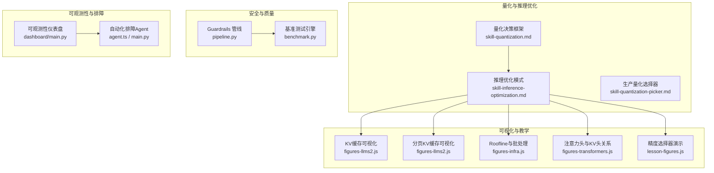
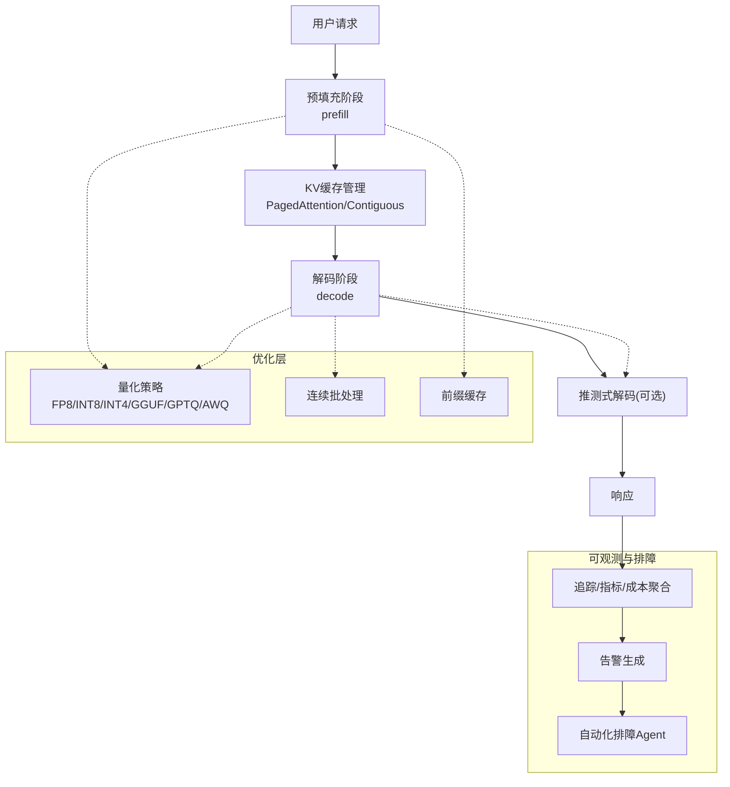
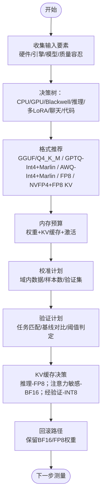
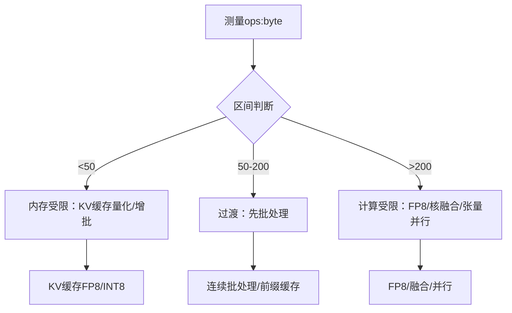
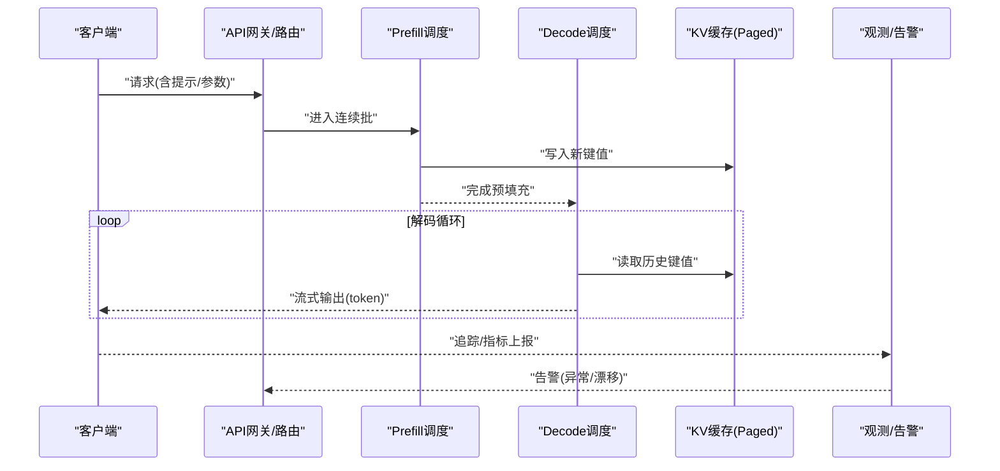
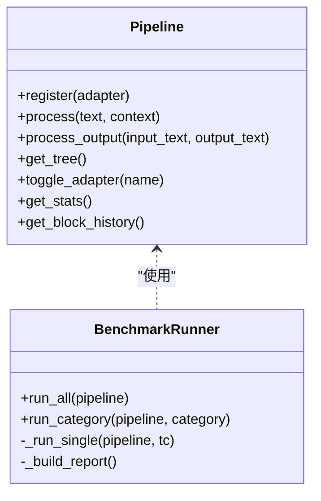
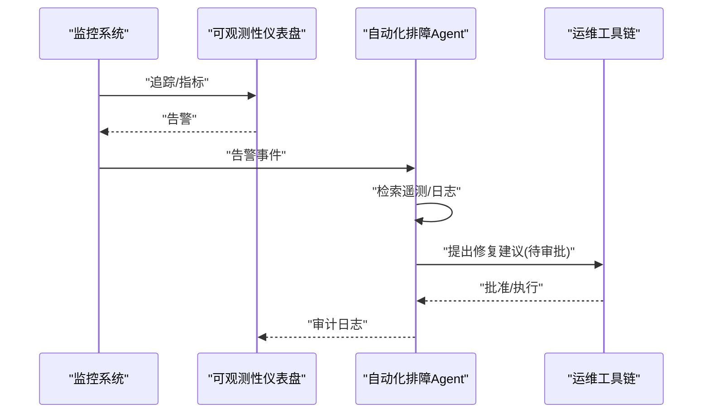
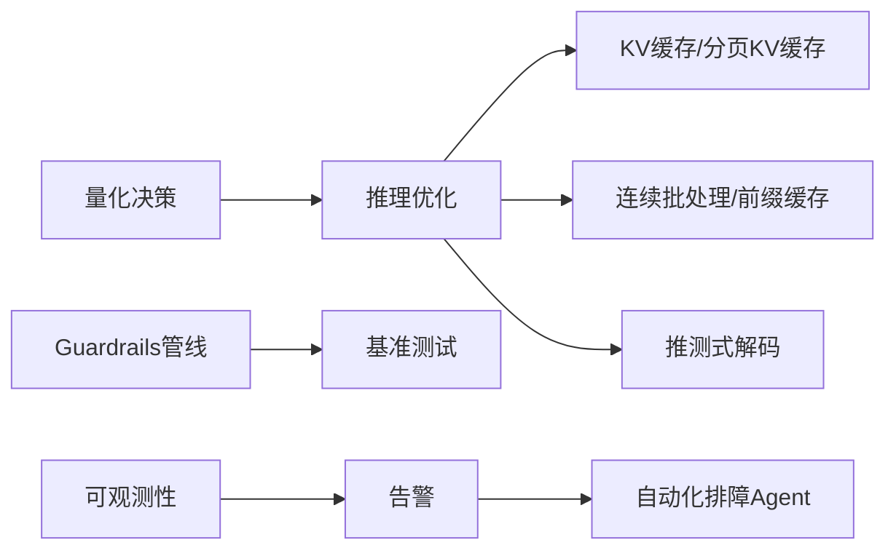

# 生产环境优化

<cite>
**本文引用的文件**
- [phases/10-llms-from-scratch/11-quantization/outputs/skill-quantization.md](file://phases/10-llms-from-scratch/11-quantization/outputs/skill-quantization.md)
- [phases/10-llms-from-scratch/12-inference-optimization/outputs/skill-inference-optimization.md](file://phases/10-llms-from-scratch/12-inference-optimization/outputs/skill-inference-optimization.md)
- [phases/17-infrastructure-and-production/09-production-quantization/outputs/skill-quantization-picker.md](file://phases/17-infrastructure-and-production/09-production-quantization/outputs/skill-quantization-picker.md)
- [site/figures-llms2.js](file://site/figures-llms2.js)
- [site/figures-infra.js](file://site/figures-infra.js)
- [site/figures-transformers.js](file://site/figures-transformers.js)
- [site/lesson-figures.js](file://site/lesson-figures.js)
- [guardrails-sandbox/backend/pipeline.py](file://guardrails-sandbox/backend/pipeline.py)
- [guardrails-sandbox/backend/benchmark.py](file://guardrails-sandbox/backend/benchmark.py)
- [phases/19-capstone-projects/11-llm-observability-dashboard/code/main.py](file://phases/19-capstone-projects/11-llm-observability-dashboard/code/main.py)
- [phases/19-capstone-projects/06-devops-troubleshooting-agent/code/main.py](file://phases/19-capstone-projects/06-devops-troubleshooting-agent/code/main.py)
- [phases/19-capstone-projects/06-devops-troubleshooting-agent/code/ts/src/agent.ts](file://phases/19-capstone-projects/06-devops-troubleshooting-agent/code/ts/src/agent.ts)
- [glossary/terms.md](file://glossary/terms.md)
</cite>

## 目录
1. [引言](#引言)
2. [项目结构](#项目结构)
3. [核心组件](#核心组件)
4. [架构总览](#架构总览)
5. [详细组件分析](#详细组件分析)
6. [依赖分析](#依赖分析)
7. [性能考量](#性能考量)
8. [故障排查指南](#故障排查指南)
9. [结论](#结论)
10. [附录](#附录)

## 引言
本文件面向生产环境的LLM系统优化，围绕“模型量化”“推理优化”“完整LLM管道”“性能基准与调优”“可靠性与可观测性”五大主题展开。内容基于仓库中量化决策框架、推理优化模式、KV缓存可视化、批处理与 Roofline 分析、Guardrails 管线与基准测试、以及可观测性与自动化排障等材料整理而成，旨在帮助读者在真实场景中稳定、高效地部署与运营大模型服务。

## 项目结构
本仓库包含多阶段课程与实践项目，其中与生产优化直接相关的内容主要分布在以下路径：
- 量化与推理优化：phases/10-llms-from-scratch/11-quantization 与 12-inference-optimization 的输出文档
- 生产量化选择器：phases/17-infrastructure-and-production/09-production-quantization 的输出文档
- 可视化与教学素材：site 下的 figures-* 脚本（KV缓存、分页KV缓存、Roofline、批处理等）
- Guardrails 管线与基准：guardrails-sandbox/backend 下的 pipeline 与 benchmark
- 可观测性与自动化排障：phases/19-capstone-projects 下的 dashboard 与 troubleshooting-agent
- 术语与概念：glossary/terms.md 中关于量化、QLoRA 等术语解释

**图表来源**
- [phases/10-llms-from-scratch/11-quantization/outputs/skill-quantization.md:1-140](file://phases/10-llms-from-scratch/11-quantization/outputs/skill-quantization.md#L1-L140)
- [phases/10-llms-from-scratch/12-inference-optimization/outputs/skill-inference-optimization.md:1-90](file://phases/10-llms-from-scratch/12-inference-optimization/outputs/skill-inference-optimization.md#L1-L90)
- [site/figures-llms2.js:217-279](file://site/figures-llms2.js#L217-L279)
- [site/figures-infra.js:267-428](file://site/figures-infra.js#L267-L428)
- [site/figures-transformers.js:333-349](file://site/figures-transformers.js#L333-L349)
- [site/lesson-figures.js:442-457](file://site/lesson-figures.js#L442-L457)
- [guardrails-sandbox/backend/pipeline.py:1-285](file://guardrails-sandbox/backend/pipeline.py#L1-L285)
- [guardrails-sandbox/backend/benchmark.py:1-169](file://guardrails-sandbox/backend/benchmark.py#L1-L169)
- [phases/19-capstone-projects/11-llm-observability-dashboard/code/main.py:238-257](file://phases/19-capstone-projects/11-llm-observability-dashboard/code/main.py#L238-L257)
- [phases/19-capstone-projects/06-devops-troubleshooting-agent/code/main.py:190-229](file://phases/19-capstone-projects/06-devops-troubleshooting-agent/code/main.py#L190-L229)
- [phases/19-capstone-projects/06-devops-troubleshooting-agent/code/ts/src/agent.ts:1-59](file://phases/19-capstone-projects/06-devops-troubleshooting-agent/code/ts/src/agent.ts#L1-L59)

**章节来源**
- [phases/10-llms-from-scratch/11-quantization/outputs/skill-quantization.md:1-140](file://phases/10-llms-from-scratch/11-quantization/outputs/skill-quantization.md#L1-L140)
- [phases/10-llms-from-scratch/12-inference-optimization/outputs/skill-inference-optimization.md:1-90](file://phases/10-llms-from-scratch/12-inference-optimization/outputs/skill-inference-optimization.md#L1-L90)
- [site/figures-llms2.js:217-279](file://site/figures-llms2.js#L217-L279)
- [site/figures-infra.js:267-428](file://site/figures-infra.js#L267-L428)
- [site/figures-transformers.js:333-349](file://site/figures-transformers.js#L333-L349)
- [site/lesson-figures.js:442-457](file://site/lesson-figures.js#L442-L457)
- [guardrails-sandbox/backend/pipeline.py:1-285](file://guardrails-sandbox/backend/pipeline.py#L1-L285)
- [guardrails-sandbox/backend/benchmark.py:1-169](file://guardrails-sandbox/backend/benchmark.py#L1-L169)
- [phases/19-capstone-projects/11-llm-observability-dashboard/code/main.py:238-257](file://phases/19-capstone-projects/11-llm-observability-dashboard/code/main.py#L238-L257)
- [phases/19-capstone-projects/06-devops-troubleshooting-agent/code/main.py:190-229](file://phases/19-capstone-projects/06-devops-troubleshooting-agent/code/main.py#L190-L229)
- [phases/19-capstone-projects/06-devops-troubleshooting-agent/code/ts/src/agent.ts:1-59](file://phases/19-capstone-projects/06-devops-troubleshooting-agent/code/ts/src/agent.ts#L1-L59)

## 核心组件
- 量化决策与方法论
  - 提供硬件/质量/延迟约束下的格式与方法选择矩阵，覆盖 FP8、INT8、INT4、GGUF、GPTQ、AWQ、SmoothQuant 等，并给出精度分配建议与验证流程。
- 推理优化模式
  - 明确预填充（prefill，计算密集）与解码（decode，内存密集）两阶段的瓶颈识别与优化路径；强调KV缓存、连续批处理、前缀缓存、量化、推测式解码、张量并行等。
- KV缓存与分页缓存
  - 通过可视化脚本展示KV缓存大小估算、分页KV缓存的内部浪费与优势，指导在长上下文与高并发下的内存规划。
- 批处理与 Roofline 分析
  - 展示吞吐与延迟随批量变化的关系曲线，以及基于算术强度区分内存/计算受限场景的 Roofline 图，辅助确定优化优先级。
- Guardrails 管线与基准
  - 提供输入/输出双通道的 Guardrails 编排与统计，支持拦截历史、分层统计与分类基准评估，便于在生产中进行质量与安全治理。
- 可观测性与自动化排障
  - 仪表盘对追踪数据进行聚合与告警；自动化Agent根据告警信号提出根因假设与修复建议，支撑SRE闭环。

**章节来源**
- [phases/10-llms-from-scratch/11-quantization/outputs/skill-quantization.md:10-140](file://phases/10-llms-from-scratch/11-quantization/outputs/skill-quantization.md#L10-L140)
- [phases/10-llms-from-scratch/12-inference-optimization/outputs/skill-inference-optimization.md:10-90](file://phases/10-llms-from-scratch/12-inference-optimization/outputs/skill-inference-optimization.md#L10-L90)
- [site/figures-llms2.js:217-279](file://site/figures-llms2.js#L217-L279)
- [site/figures-infra.js:267-428](file://site/figures-infra.js#L267-L428)
- [guardrails-sandbox/backend/pipeline.py:12-285](file://guardrails-sandbox/backend/pipeline.py#L12-L285)
- [guardrails-sandbox/backend/benchmark.py:10-169](file://guardrails-sandbox/backend/benchmark.py#L10-L169)
- [phases/19-capstone-projects/11-llm-observability-dashboard/code/main.py:238-257](file://phases/19-capstone-projects/11-llm-observability-dashboard/code/main.py#L238-L257)
- [phases/19-capstone-projects/06-devops-troubleshooting-agent/code/main.py:190-229](file://phases/19-capstone-projects/06-devops-troubleshooting-agent/code/main.py#L190-L229)
- [phases/19-capstone-projects/06-devops-troubleshooting-agent/code/ts/src/agent.ts:1-59](file://phases/19-capstone-projects/06-devops-troubleshooting-agent/code/ts/src/agent.ts#L1-L59)

## 架构总览
下图展示了从请求到响应的关键路径，以及与量化、KV缓存、批处理、推测式解码、观测与排障的交互关系。

**图表来源**
- [phases/10-llms-from-scratch/12-inference-optimization/outputs/skill-inference-optimization.md:10-90](file://phases/10-llms-from-scratch/12-inference-optimization/outputs/skill-inference-optimization.md#L10-L90)
- [site/figures-llms2.js:217-279](file://site/figures-llms2.js#L217-L279)
- [site/figures-infra.js:267-428](file://site/figures-infra.js#L267-L428)
- [phases/19-capstone-projects/11-llm-observability-dashboard/code/main.py:238-257](file://phases/19-capstone-projects/11-llm-observability-dashboard/code/main.py#L238-L257)
- [phases/19-capstone-projects/06-devops-troubleshooting-agent/code/main.py:190-229](file://phases/19-capstone-projects/06-devops-troubleshooting-agent/code/main.py#L190-L229)
- [phases/19-capstone-projects/06-devops-troubleshooting-agent/code/ts/src/agent.ts:1-59](file://phases/19-capstone-projects/06-devops-troubleshooting-agent/code/ts/src/agent.ts#L1-L59)

## 详细组件分析

### 量化技术与实现
- 决策框架
  - 输入要素：模型规模、目标硬件、延迟目标、质量底线、服务模式（批大小、最大上下文、并发数）
  - 快速选择：不同硬件与任务类型下的格式与方法推荐，如H100优先FP8、A100/24GB GPU上INT8/INT4、Apple Silicon上GGUF Q4_K_M等
  - 组件级精度：FFN权重INT4（AWQ/GPTQ）、注意力INT8/FP8、嵌入层保持FP16/INT8、KV缓存FP8/INT8、注意力logits FP16/BF16
  - 方法对比：GPTQ（HF兼容、校准数据约128×2048）、AWQ（更快、更好质量、vLLM集成）、GGUF（CPU/Metal友好、生态丰富）、SmoothQuant（W8A8）
  - 验证协议：困惑度、基准扫描（MMLU/GSM8K/HumanEval）、输出对比（LLM-as-judge）、延迟测量、长上下文测试
  - 常见误区：嵌入层INT4、全层相同位宽、未校准、KV缓存长上下文量化不当、跳过验证
- 生产量化选择器
  - 给定硬件、引擎、模型与质量容忍度，输出格式推荐、内存预算、校准与验证计划、KV缓存决策、回滚路径与后续测量重点

**图表来源**
- [phases/17-infrastructure-and-production/09-production-quantization/outputs/skill-quantization-picker.md:10-33](file://phases/17-infrastructure-and-production/09-production-quantization/outputs/skill-quantization-picker.md#L10-L33)
- [phases/10-llms-from-scratch/11-quantization/outputs/skill-quantization.md:14-140](file://phases/10-llms-from-scratch/11-quantization/outputs/skill-quantization.md#L14-L140)

**章节来源**
- [phases/10-llms-from-scratch/11-quantization/outputs/skill-quantization.md:10-140](file://phases/10-llms-from-scratch/11-quantization/outputs/skill-quantization.md#L10-L140)
- [phases/17-infrastructure-and-production/09-production-quantization/outputs/skill-quantization-picker.md:10-33](file://phases/17-infrastructure-and-production/09-production-quantization/outputs/skill-quantization-picker.md#L10-L33)
- [glossary/terms.md:291-297](file://glossary/terms.md#L291-L297)

### 推理优化策略
- 两阶段瓶颈识别
  - Prefill（计算密集）：核融合、前缀缓存、批处理
  - Decode（内存密集）：KV缓存量化（FP8/INT8）、连续批处理、推测式解码
- 优化优先级
  - 依据算术强度（ops:byte）判断：低（内存受限）→ KV缓存量化、增大批；高（计算受限）→ FP8、核融合、张量并行；中→先批处理
- 关键技术要点
  - KV缓存：估算公式、分页KV缓存降低内部浪费、GQA减少KV头数量
  - 批处理：吞吐与延迟随批量变化的曲线，寻找“膝点”
  - 推测式解码：草稿模型尺寸、接受率门槛、适用场景与温度影响
  - 连续批处理与前缀缓存：默认开启，显著提升资源利用率

**图表来源**
- [phases/10-llms-from-scratch/12-inference-optimization/outputs/skill-inference-optimization.md:25-49](file://phases/10-llms-from-scratch/12-inference-optimization/outputs/skill-inference-optimization.md#L25-L49)
- [site/figures-infra.js:267-428](file://site/figures-infra.js#L267-L428)

**章节来源**
- [phases/10-llms-from-scratch/12-inference-optimization/outputs/skill-inference-optimization.md:10-90](file://phases/10-llms-from-scratch/12-inference-optimization/outputs/skill-inference-optimization.md#L10-L90)
- [site/figures-llms2.js:217-279](file://site/figures-llms2.js#L217-L279)
- [site/figures-transformers.js:333-349](file://site/figures-transformers.js#L333-L349)
- [site/figures-infra.js:267-428](file://site/figures-infra.js#L267-L428)

### 完整LLM管道构建
- 服务架构
  - 预填充与解码分离、KV缓存驻留HBM、分页KV缓存降低浪费、连续批处理与前缀缓存提升吞吐
  - 引擎选择：vLLM（广泛模型支持、OpenAI兼容）、SGLang（RadixAttention、约束解码）、TensorRT-LLM（H100核融合FP8）
- API设计
  - 以OpenAI兼容API为例，结合前缀缓存与流式输出，满足多轮对话与结构化输出需求
- 负载均衡与弹性
  - 基于QPS的副本伸缩，维持目标延迟；批大小在“膝点”附近取得吞吐与延迟平衡
- 监控与告警
  - 关键指标：TTFT、ITL、吞吐、KV缓存利用率、批利用率、队列深度；仪表盘聚合追踪、成本与漂移检测

**图表来源**
- [phases/10-llms-from-scratch/12-inference-optimization/outputs/skill-inference-optimization.md:10-90](file://phases/10-llms-from-scratch/12-inference-optimization/outputs/skill-inference-optimization.md#L10-L90)
- [site/figures-llms2.js:217-279](file://site/figures-llms2.js#L217-L279)
- [site/figures-infra.js:310-334](file://site/figures-infra.js#L310-L334)
- [phases/19-capstone-projects/11-llm-observability-dashboard/code/main.py:238-257](file://phases/19-capstone-projects/11-llm-observability-dashboard/code/main.py#L238-L257)

**章节来源**
- [phases/10-llms-from-scratch/12-inference-optimization/outputs/skill-inference-optimization.md:10-90](file://phases/10-llms-from-scratch/12-inference-optimization/outputs/skill-inference-optimization.md#L10-L90)
- [site/figures-infra.js:310-334](file://site/figures-infra.js#L310-L334)
- [phases/19-capstone-projects/11-llm-observability-dashboard/code/main.py:238-257](file://phases/19-capstone-projects/11-llm-observability-dashboard/code/main.py#L238-L257)

### Guardrails 管线与质量保障
- 管线职责
  - 输入/输出双通道检查、短路拦截、统计与拦截历史、启用/禁用控制
- 基准测试
  - 对测试用例运行输入检查，计算TPR/FPR/准确率等指标，支持按类别与拦截层统计

**图表来源**
- [guardrails-sandbox/backend/pipeline.py:12-285](file://guardrails-sandbox/backend/pipeline.py#L12-L285)
- [guardrails-sandbox/backend/benchmark.py:10-169](file://guardrails-sandbox/backend/benchmark.py#L10-L169)

**章节来源**
- [guardrails-sandbox/backend/pipeline.py:12-285](file://guardrails-sandbox/backend/pipeline.py#L12-L285)
- [guardrails-sandbox/backend/benchmark.py:10-169](file://guardrails-sandbox/backend/benchmark.py#L10-L169)

### 自动化排障与可观测性
- 仪表盘
  - 聚合追踪、按模型/用户统计成本，生成告警（如漂移）
- 自动化Agent
  - 根据告警信号检索遥测、生成根因假设与修复建议，支持审批与执行审计

**图表来源**
- [phases/19-capstone-projects/11-llm-observability-dashboard/code/main.py:238-257](file://phases/19-capstone-projects/11-llm-observability-dashboard/code/main.py#L238-L257)
- [phases/19-capstone-projects/06-devops-troubleshooting-agent/code/main.py:190-229](file://phases/19-capstone-projects/06-devops-troubleshooting-agent/code/main.py#L190-L229)
- [phases/19-capstone-projects/06-devops-troubleshooting-agent/code/ts/src/agent.ts:1-59](file://phases/19-capstone-projects/06-devops-troubleshooting-agent/code/ts/src/agent.ts#L1-L59)

**章节来源**
- [phases/19-capstone-projects/11-llm-observability-dashboard/code/main.py:238-257](file://phases/19-capstone-projects/11-llm-observability-dashboard/code/main.py#L238-L257)
- [phases/19-capstone-projects/06-devops-troubleshooting-agent/code/main.py:190-229](file://phases/19-capstone-projects/06-devops-troubleshooting-agent/code/main.py#L190-L229)
- [phases/19-capstone-projects/06-devops-troubleshooting-agent/code/ts/src/agent.ts:1-59](file://phases/19-capstone-projects/06-devops-troubleshooting-agent/code/ts/src/agent.ts#L1-L59)

## 依赖分析
- 组件耦合
  - 量化与推理优化紧密耦合：量化方案直接影响KV缓存与批处理策略；推理优化反过来影响量化收益与稳定性
  - Guardrails 管线与基准测试相互依赖：基准驱动管线配置与拦截策略调整
  - 观测与排障形成闭环：仪表盘触发告警，Agent 提出修复，再反馈到观测
- 外部依赖
  - 引擎生态：vLLM、SGLang、TensorRT-LLM、llama.cpp、TRT-LLM
  - 数据与校准：域内校准数据、验证集、基准数据集（MMLU/GSM8K/HumanEval）

**图表来源**
- [phases/10-llms-from-scratch/11-quantization/outputs/skill-quantization.md:10-140](file://phases/10-llms-from-scratch/11-quantization/outputs/skill-quantization.md#L10-L140)
- [phases/10-llms-from-scratch/12-inference-optimization/outputs/skill-inference-optimization.md:10-90](file://phases/10-llms-from-scratch/12-inference-optimization/outputs/skill-inference-optimization.md#L10-L90)
- [guardrails-sandbox/backend/pipeline.py:12-285](file://guardrails-sandbox/backend/pipeline.py#L12-L285)
- [guardrails-sandbox/backend/benchmark.py:10-169](file://guardrails-sandbox/backend/benchmark.py#L10-L169)
- [phases/19-capstone-projects/11-llm-observability-dashboard/code/main.py:238-257](file://phases/19-capstone-projects/11-llm-observability-dashboard/code/main.py#L238-L257)
- [phases/19-capstone-projects/06-devops-troubleshooting-agent/code/main.py:190-229](file://phases/19-capstone-projects/06-devops-troubleshooting-agent/code/main.py#L190-L229)

**章节来源**
- [phases/10-llms-from-scratch/11-quantization/outputs/skill-quantization.md:10-140](file://phases/10-llms-from-scratch/11-quantization/outputs/skill-quantization.md#L10-L140)
- [phases/10-llms-from-scratch/12-inference-optimization/outputs/skill-inference-optimization.md:10-90](file://phases/10-llms-from-scratch/12-inference-optimization/outputs/skill-inference-optimization.md#L10-L90)
- [guardrails-sandbox/backend/pipeline.py:12-285](file://guardrails-sandbox/backend/pipeline.py#L12-L285)
- [guardrails-sandbox/backend/benchmark.py:10-169](file://guardrails-sandbox/backend/benchmark.py#L10-L169)
- [phases/19-capstone-projects/11-llm-observability-dashboard/code/main.py:238-257](file://phases/19-capstone-projects/11-llm-observability-dashboard/code/main.py#L238-L257)
- [phases/19-capstone-projects/06-devops-troubleshooting-agent/code/main.py:190-229](file://phases/19-capstone-projects/06-devops-troubleshooting-agent/code/main.py#L190-L229)

## 性能考量
- 延迟优化
  - TTFT（首Token时间）：预填充阶段优化（核融合、前缀缓存、连续批）
  - ITL（单Token时间）：KV缓存量化（FP8/INT8）、连续批、推测式解码
- 吞吐量提升
  - 批量在“膝点”附近取得最佳平衡；连续批处理与前缀缓存提升资源利用率
- 资源利用率优化
  - 分页KV缓存降低内部浪费；算术强度分析指导是否转向FP8或核融合
- 质量与成本
  - 量化前后基准对比（困惑度、任务评测、LLM-as-judge）；成本按模型/用户聚合；漂移检测触发告警

**章节来源**
- [site/figures-infra.js:267-428](file://site/figures-infra.js#L267-L428)
- [site/figures-llms2.js:217-279](file://site/figures-llms2.js#L217-L279)
- [phases/19-capstone-projects/11-llm-observability-dashboard/code/main.py:238-257](file://phases/19-capstone-projects/11-llm-observability-dashboard/code/main.py#L238-L257)

## 故障排查指南
- 常见问题定位
  - OOM/内存不足：检查KV缓存预算、批大小、是否使用分页KV缓存
  - CrashLoopBackOff/探针失败：检查健康检查路径一致性
- 自动化排障流程
  - 告警触发 → Agent检索遥测/日志 → 生成根因假设与证据 → 提出修复建议（需审批）→ 执行并审计
- Guardrails 调优
  - 基于基准测试报告（TPR/FPR/准确率）调整拦截策略与适配器开关

**章节来源**
- [phases/19-capstone-projects/06-devops-troubleshooting-agent/code/ts/src/agent.ts:1-59](file://phases/19-capstone-projects/06-devops-troubleshooting-agent/code/ts/src/agent.ts#L1-L59)
- [phases/19-capstone-projects/06-devops-troubleshooting-agent/code/main.py:190-229](file://phases/19-capstone-projects/06-devops-troubleshooting-agent/code/main.py#L190-L229)
- [guardrails-sandbox/backend/benchmark.py:124-169](file://guardrails-sandbox/backend/benchmark.py#L124-L169)

## 结论
通过将量化决策与推理优化有机结合，配合KV缓存与批处理策略、推测式解码与弹性伸缩，可在生产环境中实现低延迟、高吞吐与高资源利用率。同时，以Guardrails 管线与基准测试保障质量与安全，以可观测性与自动化排障实现闭环运维，最终达成稳定、可扩展且可观测的大模型服务。

## 附录
- 术语参考
  - 量化、QLoRA、KV缓存、Roofline、分页KV缓存、注意力头与KV头关系、精度选择器演示等

**章节来源**
- [glossary/terms.md:274-297](file://glossary/terms.md#L274-L297)
- [site/lesson-figures.js:442-457](file://site/lesson-figures.js#L442-L457)
- [site/figures-transformers.js:333-349](file://site/figures-transformers.js#L333-L349)
- [site/figures-llms2.js:217-279](file://site/figures-llms2.js#L217-L279)
- [site/figures-infra.js:391-428](file://site/figures-infra.js#L391-L428)