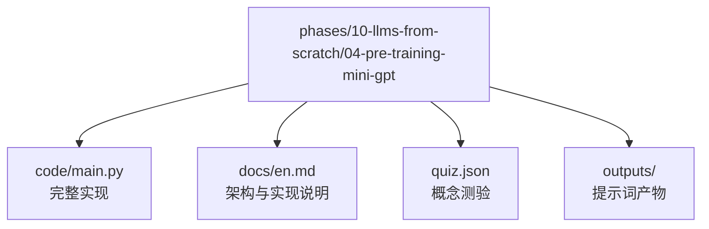
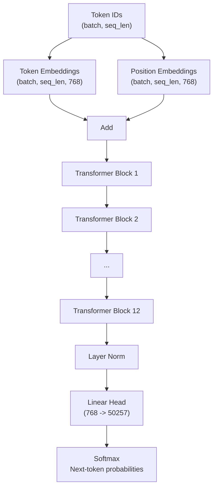
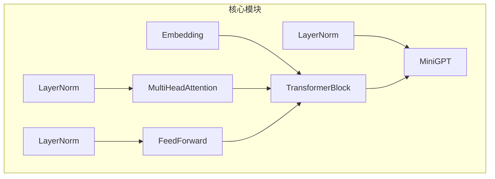

# MiniGPT模型实现

<cite>
**本文档引用的文件**
- [main.py](file://phases/10-llms-from-scratch/04-pre-training-mini-gpt/code/main.py)
- [en.md](file://phases/10-llms-from-scratch/04-pre-training-mini-gpt/docs/en.md)
- [quiz.json](file://phases/10-llms-from-scratch/04-pre-training-mini-gpt/quiz.json)
- [figures-transformers.js](file://site/figures-transformers.js)
- [figures-llms2.js](file://site/figures-llms2.js)
</cite>

## 目录
1. [简介](#简介)
2. [项目结构](#项目结构)
3. [核心组件](#核心组件)
4. [架构总览](#架构总览)
5. [详细组件分析](#详细组件分析)
6. [依赖关系分析](#依赖关系分析)
7. [性能考虑](#性能考虑)
8. [故障排除指南](#故障排除指南)
9. [结论](#结论)
10. [附录](#附录)

## 简介
本文件面向希望从零实现MiniGPT（GPT-2 Small规模）的大语言模型工程师，系统性解析完整的Transformer架构实现，包括嵌入层、多头注意力机制、前馈网络、层归一化等核心组件的设计与实现细节。文档覆盖前向传播过程中的位置编码、因果掩码、残差连接等关键机制，并提供参数初始化、权重共享（权重绑定）、内存估算等技术要点。同时包含模型参数统计、内存估算、性能基准测试内容，以及实际的训练示例和文本生成演示，帮助开发者理解从零实现大语言模型的关键技术要点。

## 项目结构
MiniGPT实现位于`phases/10-llms-from-scratch/04-pre-training-mini-gpt`目录中，采用纯Python + NumPy实现，便于教学和理解底层机制。核心文件包括：
- `code/main.py`: 完整的MiniGPT实现，包含所有核心组件与训练/推理流程
- `docs/en.md`: 详细的架构说明、数学推导与实现步骤
- `quiz.json`: 相关概念测验题，巩固学习效果

**图表来源**
- [main.py](file://phases/10-llms-from-scratch/04-pre-training-mini-gpt/code/main.py)
- [en.md](file://phases/10-llms-from-scratch/04-pre-training-mini-gpt/docs/en.md)

**章节来源**
- [main.py](file://phases/10-llms-from-scratch/04-pre-training-mini-gpt/code/main.py)
- [en.md](file://phases/10-llms-from-scratch/04-pre-training-mini-gpt/docs/en.md)

## 核心组件
本节概述MiniGPT的核心组件及其职责：
- 嵌入层（Embedding）：负责token嵌入与位置嵌入的加法组合
- 多头注意力（MultiHeadAttention）：实现自注意力机制，支持因果掩码
- 前馈网络（FeedForward）：两层线性变换+激活函数
- 层归一化（LayerNorm）：对特征维度进行标准化
- Transformer块（TransformerBlock）：按预归一化顺序组合上述子层
- MiniGPT主模型（MiniGPT）：堆叠多个Transformer块并添加最终归一化与输出投影

这些组件共同构成GPT-2 Small的完整架构，参数规模约1.24亿，适合在单GPU上进行训练与推理演示。

**章节来源**
- [main.py](file://phases/10-llms-from-scratch/04-pre-training-mini-gpt/code/main.py)
- [en.md](file://phases/10-llms-from-scratch/04-pre-training-mini-gpt/docs/en.md)

## 架构总览
MiniGPT的计算图从token ID输入开始，经过嵌入、多层Transformer块、最终归一化，最后通过输出投影得到每个位置的词汇表logits，再经softmax得到下一个token的概率分布。

**图表来源**
- [en.md](file://phases/10-llms-from-scratch/04-pre-training-mini-gpt/docs/en.md)

**章节来源**
- [en.md](file://phases/10-llms-from-scratch/04-pre-training-mini-gpt/docs/en.md)

## 详细组件分析

### 嵌入层（Embedding）
- 功能：将离散的token ID映射为768维的向量表示，并加上对应位置的嵌入向量
- 初始化：使用标准差为0.02的高斯随机初始化，避免过大或过小导致训练不稳定
- 前向传播：根据输入序列长度截取相应的位置嵌入，然后与token嵌入相加

实现要点：
- 位置嵌入最大长度限制为1024，超出时需截断或滑动窗口处理
- 权重共享：输出投影直接复用token嵌入矩阵的转置，减少参数并提升性能

**章节来源**
- [main.py](file://phases/10-llms-from-scratch/04-pre-training-mini-gpt/code/main.py)

### 多头注意力（MultiHeadAttention）
- 功能：实现自注意力机制，支持因果掩码以保证生成时的自回归性质
- 数学公式：
  - 计算Q/K/V：Q = X·Wq，K = X·Wk，V = X·Wv
  - 注意力分数：scores = Q·K^T / sqrt(dk)
  - 应用掩码：scores = scores + mask（未来位置设为负无穷）
  - 权重归一化：weights = softmax(scores)
  - 输出：out = weights·V
  - 投影：out = out·Wout
- 多头设计：将768维拆分为12个64维头，分别计算注意力后拼接并投影回768维

实现要点：
- 使用上三角掩码（k=1）确保每个位置只能关注到自身及之前的位置
- softmax前减去最大值以提高数值稳定性
- 头维数必须能被嵌入维度整除（768/12=64）

**章节来源**
- [main.py](file://phases/10-llms-from-scratch/04-pre-training-mini-gpt/code/main.py)

### 前馈网络（FeedForward）
- 结构：两层线性变换，中间使用ReLU激活（简化版GELU）
- 扩张-收缩模式：先扩展到4倍（768->3072），再收缩回768维
- 参数量：每层权重矩阵大小为(768, 3072)与(3072, 768)，外加偏置项

实现要点：
- ReLU近似GELU，便于教学理解
- 每个Transformer块内独立存在，与注意力并行

**章节来源**
- [main.py](file://phases/10-llms-from-scratch/04-pre-training-mini-gpt/code/main.py)

### 层归一化（LayerNorm）
- 功能：对特征维度进行标准化，使训练更加稳定
- 公式：y = γ·(x - μ)/(√(σ^2 + ε)) + β
- 可学习参数：γ（缩放）与β（平移），均初始化为0或1

实现要点：
- 在每个子层之前执行（预归一化），有助于深层网络的梯度流动
- epsilon防止除零

**章节来源**
- [main.py](file://phases/10-llms-from-scratch/04-pre-training-mini-gpt/code/main.py)

### Transformer块（TransformerBlock）
- 结构：LN -> Multi-Head Attention（残差）-> LN -> FeedForward（残差）
- 残差连接：每个子层输出与输入相加，缓解梯度消失问题
- 预归一化：先做归一化再做变换，相比后归一化更稳定

实现要点：
- 注意力与前馈网络分别在各自的归一化之后进行
- 残差路径贯穿整个块，确保信息不丢失

**章节来源**
- [main.py](file://phases/10-llms-from-scratch/04-pre-training-mini-gpt/code/main.py)

### MiniGPT主模型（MiniGPT）
- 结构：嵌入层 + 12个Transformer块 + 最终LayerNorm + 输出投影
- 输出投影：使用权重绑定，直接复用token嵌入矩阵的转置
- 前向传播：构建因果掩码，依次通过各块，最后归一化并投影

实现要点：
- 参数统计方法：累加嵌入、注意力、前馈网络、归一化与最终归一化的参数
- 权重绑定：减少约3800万参数，提升性能

**章节来源**
- [main.py](file://phases/10-llms-from-scratch/04-pre-training-mini-gpt/code/main.py)

### 前向传播与训练流程
- 前向传播：嵌入 -> 12个Transformer块 -> 归一化 -> 输出投影 -> softmax
- 损失函数：交叉熵损失，目标为下一个token
- 训练循环：随机采样固定长度的连续片段，前向计算损失，反向传播更新参数

实现要点：
- 掩码构建：np.triu全为负无穷，k=1，确保未来位置不可见
- 梯度计算：逐层反向传播，注意残差路径的梯度累加
- 学习率调度：可扩展为warmup+余弦退火（当前示例使用固定学习率）

**章节来源**
- [main.py](file://phases/10-llms-from-scratch/04-pre-training-mini-gpt/code/main.py)

### 文本生成与采样
- 生成策略：给定提示，逐步预测下一个token，重复max_new_tokens次
- 采样方式：温度缩放后softmax，按概率采样；也可使用贪心（argmax）
- 上下文窗口：仅保留最近的max_seq_len个token，超出则丢弃最旧的

实现要点：
- 温度控制：0.5更确定，1.0为原分布，1.5更随机
- KV缓存：可选实现（见练习），用于加速解码阶段

**章节来源**
- [main.py](file://phases/10-llms-from-scratch/04-pre-training-mini-gpt/code/main.py)

## 依赖关系分析
MiniGPT实现采用纯Python + NumPy，无外部深度学习框架依赖，便于教学与理解。核心模块之间的依赖关系如下：

**图表来源**
- [main.py](file://phases/10-llms-from-scratch/04-pre-training-mini-gpt/code/main.py)

**章节来源**
- [main.py](file://phases/10-llms-from-scratch/04-pre-training-mini-gpt/code/main.py)

## 性能考虑
- 参数规模与内存占用
  - GPT-2 Small（124M）：约12400万参数，权重占用约248MB（FP16）
  - KV缓存：每token存储K/V，GPT-2 12层×12头×64维×2，1024序列约75MB（FP32）
- 计算复杂度
  - 训练阶段：O(N^2)每层（N为序列长度），整体约O(L·N^2·D)，L为层数，D为维度
  - 推理阶段：预填充（prefill）并行计算，解码（decode）逐token，KV缓存显著降低重复计算
- 内存优化
  - 权重绑定减少参数与内存
  - KV缓存按需存储，避免重复计算
  - 梯度累积与混合精度（可选扩展）

**章节来源**
- [main.py](file://phases/10-llms-from-scratch/04-pre-training-mini-gpt/code/main.py)
- [en.md](file://phases/10-llms-from-scratch/04-pre-training-mini-gpt/docs/en.md)

## 故障排除指南
- 训练发散或损失不下降
  - 检查学习率是否过高；建议使用warmup+余弦退火
  - 确认因果掩码正确应用，避免未来信息泄漏
  - 检查softmax数值稳定性（已内置减最大值）
- 生成质量差
  - 适当调整温度；过低导致重复，过高导致漂移
  - 增加训练数据规模与步数；当前示例使用小模型与小语料
- 内存不足
  - 减少序列长度或批大小
  - 启用KV缓存（解码阶段）
  - 使用混合精度（扩展实现）

**章节来源**
- [main.py](file://phases/10-llms-from-scratch/04-pre-training-mini-gpt/code/main.py)
- [en.md](file://phases/10-llms-from-scratch/04-pre-training-mini-gpt/docs/en.md)

## 结论
MiniGPT实现以纯Python + NumPy展示了GPT-2 Small的完整架构，涵盖嵌入、多头注意力、前馈网络、层归一化与残差连接等关键组件。通过从零实现前向传播、损失计算与反向传播，开发者可以深入理解Transformer的工作原理与训练机制。结合参数统计、内存估算与生成演示，该实现为构建更大规模的语言模型提供了坚实基础。

## 附录

### 模型参数统计
- GPT-2 Small（124M）参数分解
  - 词嵌入：50257×768≈3860万
  - 位置嵌入：1024×768≈78.6万
  - 每块注意力：4×(768×768)=235.9万
  - 每块前馈网络：(768×3072)+(3072×768)+768+3072≈471.9万
  - 每块归一化：2×768×2=3.1万
  - 最终归一化：768×2=1.5万
  - 总计：约12444万（与文档一致）

**章节来源**
- [main.py](file://phases/10-llms-from-scratch/04-pre-training-mini-gpt/code/main.py)
- [en.md](file://phases/10-llms-from-scratch/04-pre-training-mini-gpt/docs/en.md)

### 训练与生成示例
- 训练流程
  - 使用小模型（4层、4头、128维）与小语料进行演示
  - 固定学习率，随机采样连续片段，前向计算交叉熵损失
  - 每20步打印损失，观察收敛趋势
- 文本生成
  - 给定提示，逐步采样下一个token，重复max_new_tokens次
  - 支持温度采样，超出上下文长度时滑动窗口

**章节来源**
- [main.py](file://phases/10-llms-from-scratch/04-pre-training-mini-gpt/code/main.py)

### 相关概念测验
- 训练目标：GPT使用next-token预测作为预训练目标
- GPT-2 Small配置：12层、12头、768维
- 因果掩码作用：禁止未来位置参与注意力
- 采样温度：控制输出随机性
- 预训练与微调：预训练需要海量数据与计算，微调只需少量任务数据

**章节来源**
- [quiz.json](file://phases/10-llms-from-scratch/04-pre-training-mini-gpt/quiz.json)