# 分布式训练技术

<cite>
**本文档引用的文件**
- [main.py](file://phases/10-llms-from-scratch/05-scaling-distributed/code/main.py)
- [main.py](file://phases/19-capstone-projects/48-distributed-fsdp-ddp/code/main.py)
- [main.py](file://phases/19-capstone-projects/77-data-parallel-ddp/code/main.py)
- [main.py](file://phases/19-capstone-projects/78-zero-parameter-sharding/code/main.py)
- [main.py](file://phases/19-capstone-projects/79-pipeline-parallel/code/main.py)
- [main.py](file://phases/19-capstone-projects/80-checkpoint-sharded-resume/code/main.py)
- [main.py](file://phases/19-capstone-projects/81-end-to-end-distributed-train/code/main.py)
- [figures-infra.js](file://site/figures-infra.js)
- [data.js](file://site/data.js)
</cite>

## 目录
1. [引言](#引言)
2. [项目结构](#项目结构)
3. [核心组件](#核心组件)
4. [架构总览](#架构总览)
5. [详细组件分析](#详细组件分析)
6. [依赖关系分析](#依赖关系分析)
7. [性能考量](#性能考量)
8. [故障排查指南](#故障排查指南)
9. [结论](#结论)
10. [附录](#附录)

## 引言
本技术文档围绕大规模语言模型训练中的分布式策略展开，系统梳理数据并行（Data Parallelism）、张量并行（Tensor Parallelism）、流水线并行（Pipeline Parallelism）等核心概念，并深入解析 PyTorch FSDP（Fully Sharded Data Parallel）的实现原理与使用方法，覆盖参数分片、梯度同步、内存优化等关键点。文档提供从仿真到端到端集成的完整实践路径，包括环境配置、进程启动、通信优化、检查点与恢复、以及常见问题的诊断与解决建议。

## 项目结构
该仓库以“阶段-课程-项目”的层级组织分布式训练相关内容，重点分布在以下路径：
- phases/10-llms-from-scratch/05-scaling-distributed：分布式训练概览与仿真工具
- phases/19-capstone-projects/77 至 81：从 DDP 到 FSDP、ZeRO、流水线并行、检查点与端到端训练的系列实战
- site/figures-infra.js：分布式训练可视化图示（数据并行、张量并行、ZeRO 等）
- site/data.js：课程与项目索引，标注分布式训练相关主题

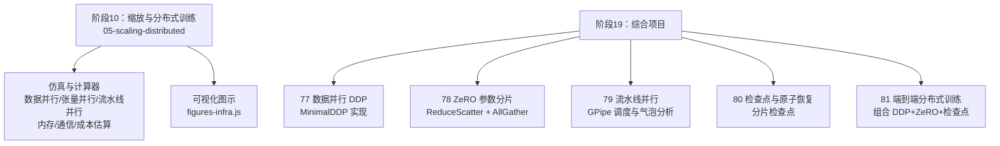

**图表来源**
- [main.py:246-348](file://phases/10-llms-from-scratch/05-scaling-distributed/code/main.py#L246-L348)
- [figures-infra.js:13-210](file://site/figures-infra.js#L13-L210)
- [data.js:1762-10764](file://site/data.js#L1762-L10764)

**章节来源**
- [main.py:246-348](file://phases/10-llms-from-scratch/05-scaling-distributed/code/main.py#L246-L348)
- [figures-infra.js:13-210](file://site/figures-infra.js#L13-L210)
- [data.js:1762-10764](file://site/data.js#L1762-L10764)

## 核心组件
- 分布式训练仿真器：提供数据并行、张量并行、流水线并行的数学仿真与可视化，便于理解通信与内存开销。
- DDP 最小实现：展示参数广播、梯度 all-reduce 与均值化的正确性验证。
- ZeRO 阶段1：参数与优化器状态分片，使用 reduce-scatter 与 all-gather 的端到端演示。
- 流水线并行：GPipe 调度与气泡分析，结合真实两阶段管道通信。
- 分片检查点：原子写入、清单校验与恢复一致性验证。
- 端到端分布式训练：将上述组件整合，完成从初始化、训练到检查点与恢复的闭环。

**章节来源**
- [main.py:5-82](file://phases/10-llms-from-scratch/05-scaling-distributed/code/main.py#L5-L82)
- [main.py:103-130](file://phases/19-capstone-projects/48-distributed-fsdp-ddp/code/main.py#L103-L130)
- [main.py:98-160](file://phases/19-capstone-projects/78-zero-parameter-sharding/code/main.py#L98-L160)
- [main.py:50-97](file://phases/19-capstone-projects/79-pipeline-parallel/code/main.py#L50-L97)
- [main.py:105-156](file://phases/19-capstone-projects/80-checkpoint-sharded-resume/code/main.py#L105-L156)
- [main.py:315-357](file://phases/19-capstone-projects/81-end-to-end-distributed-train/code/main.py#L315-L357)

## 架构总览
下图展示了从仿真到端到端训练的整体架构，强调各组件之间的职责边界与交互顺序。

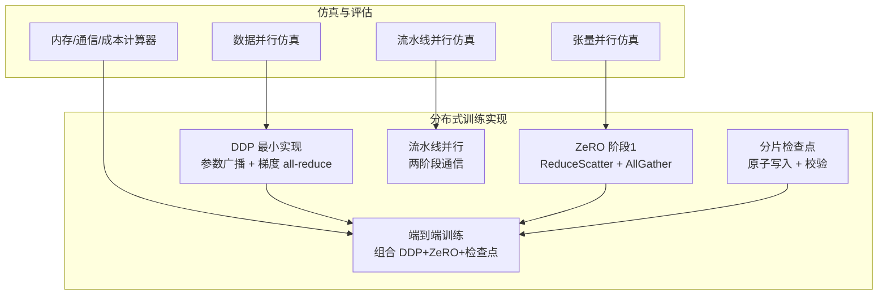

**图表来源**
- [main.py:5-82](file://phases/10-llms-from-scratch/05-scaling-distributed/code/main.py#L5-L82)
- [main.py:103-130](file://phases/19-capstone-projects/48-distributed-fsdp-ddp/code/main.py#L103-L130)
- [main.py:98-160](file://phases/19-capstone-projects/78-zero-parameter-sharding/code/main.py#L98-L160)
- [main.py:111-160](file://phases/19-capstone-projects/79-pipeline-parallel/code/main.py#L111-L160)
- [main.py:105-156](file://phases/19-capstone-projects/80-checkpoint-sharded-resume/code/main.py#L105-L156)
- [main.py:315-357](file://phases/19-capstone-projects/81-end-to-end-distributed-train/code/main.py#L315-L357)

## 详细组件分析

### 数据并行（Data Parallelism）仿真与可视化
- 仿真逻辑：将全局批次按设备数整除分配，余数轮流入每块；反向传播后对梯度执行 all-reduce 并取平均，损失取均值。
- 可视化要点：每个 GPU 持有完整模型副本，梯度通过 ring all-reduce 同步，吞吐接近线性增长但显存不下降。
- 关键函数与流程参见：
  - 仿真入口与循环：[main.py:5-26](file://phases/10-llms-from-scratch/05-scaling-distributed/code/main.py#L5-L26)
  - 可视化渲染：[figures-infra.js:13-66](file://site/figures-infra.js#L13-L66)

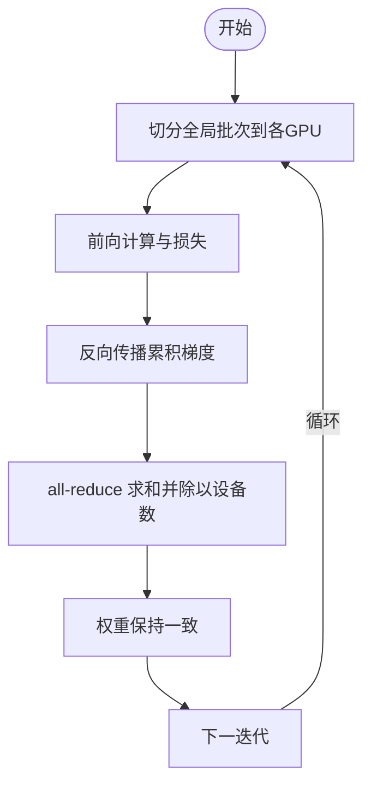

**图表来源**
- [main.py:5-26](file://phases/10-llms-from-scratch/05-scaling-distributed/code/main.py#L5-L26)
- [figures-infra.js:13-66](file://site/figures-infra.js#L13-L66)

**章节来源**
- [main.py:5-26](file://phases/10-llms-from-scratch/05-scaling-distributed/code/main.py#L5-L26)
- [figures-infra.js:13-66](file://site/figures-infra.js#L13-L66)

### 张量并行（Tensor Parallelism）仿真
- 仿真逻辑：将矩阵乘法的输出维（列）按设备数分片，每台设备计算局部结果，最后通过 all-gather 拼接得到完整输出。
- 关键函数与流程参见：
  - 仿真入口与误差校验：[main.py:29-48](file://phases/10-llms-from-scratch/05-scaling-distributed/code/main.py#L29-L48)
  - 可视化渲染：[figures-infra.js:69-110](file://site/figures-infra.js#L69-L110)

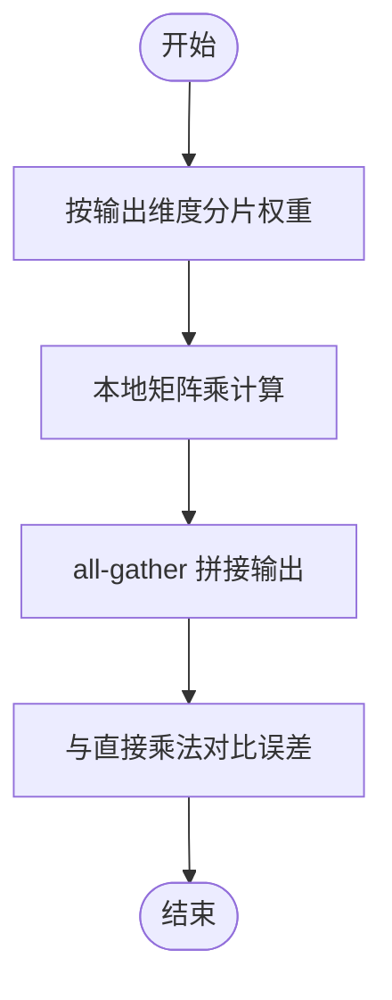

**图表来源**
- [main.py:29-48](file://phases/10-llms-from-scratch/05-scaling-distributed/code/main.py#L29-L48)
- [figures-infra.js:69-110](file://site/figures-infra.js#L69-L110)

**章节来源**
- [main.py:29-48](file://phases/10-llms-from-scratch/05-scaling-distributed/code/main.py#L29-L48)
- [figures-infra.js:69-110](file://site/figures-infra.js#L69-L110)

### 流水线并行（Pipeline Parallelism）仿真与调度
- 仿真逻辑：将网络层均匀划分到多个阶段，微批在流水线上流动；通过 GPipe 调度计算前向与反向时间线，统计气泡比例并与闭式公式对比。
- 关键函数与流程参见：
  - 时间线与气泡计算：[main.py:51-82](file://phases/10-llms-from-scratch/05-scaling-distributed/code/main.py#L51-L82)
  - 闭式气泡公式与可视化：[figures-infra.js:37-47](file://site/figures-infra.js#L37-L47)

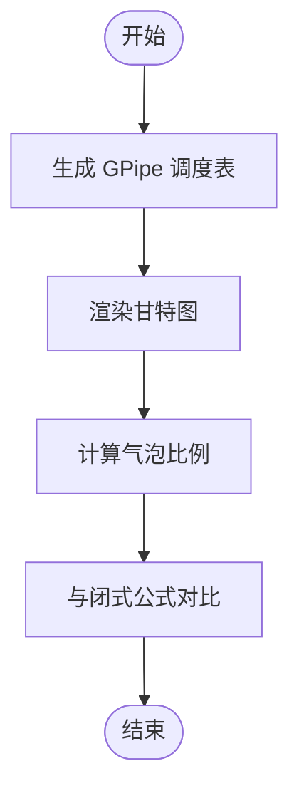

**图表来源**
- [main.py:51-82](file://phases/10-llms-from-scratch/05-scaling-distributed/code/main.py#L51-L82)
- [figures-infra.js:37-47](file://site/figures-infra.js#L37-L47)

**章节来源**
- [main.py:51-82](file://phases/10-llms-from-scratch/05-scaling-distributed/code/main.py#L51-L82)
- [figures-infra.js:37-47](file://site/figures-infra.js#L37-L47)

### FSDP 参数分片与全-收集（AllGather/ReduceScatter）流程
- 分片策略：在前向时通过 all_gather 重建完整参数张量，使用完毕后丢弃全量副本，仅保留分片，从而将每设备显存降至 1/N。
- 关键函数与流程参见：
  - FSDP 回传验证：[main.py:141-176](file://phases/19-capstone-projects/48-distributed-fsdp-ddp/code/main.py#L141-L176)
  - MinimalDDP 包装器：[main.py:103-130](file://phases/19-capstone-projects/48-distributed-fsdp-ddp/code/main.py#L103-L130)

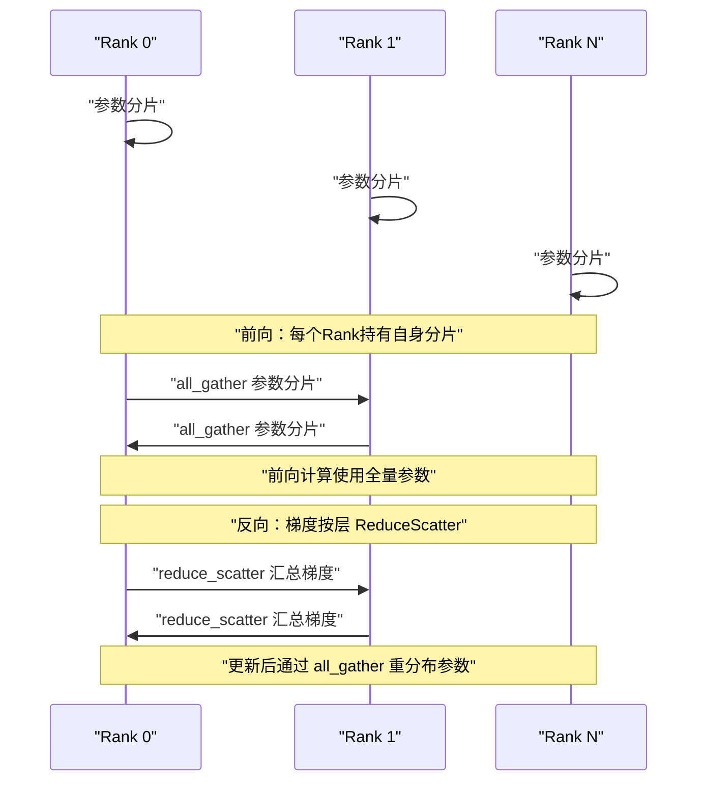

**图表来源**
- [main.py:141-176](file://phases/19-capstone-projects/48-distributed-fsdp-ddp/code/main.py#L141-L176)
- [main.py:103-130](file://phases/19-capstone-projects/48-distributed-fsdp-ddp/code/main.py#L103-L130)

**章节来源**
- [main.py:141-176](file://phases/19-capstone-projects/48-distributed-fsdp-ddp/code/main.py#L141-L176)
- [main.py:103-130](file://phases/19-capstone-projects/48-distributed-fsdp-ddp/code/main.py#L103-L130)

### DDP 最小实现与 all-reduce 正确性验证
- 核心机制：构造时将参数从主设备广播至所有设备；反向完成后对梯度执行 all-reduce 并取平均，确保每设备权重一致。
- 关键函数与流程参见：
  - DDP 包装器与梯度同步：[main.py:59-87](file://phases/19-capstone-projects/77-data-parallel-ddp/code/main.py#L59-L87)
  - 手动 all-reduce 与单进程对比：[main.py:179-221](file://phases/19-capstone-projects/48-distributed-fsdp-ddp/code/main.py#L179-L221)

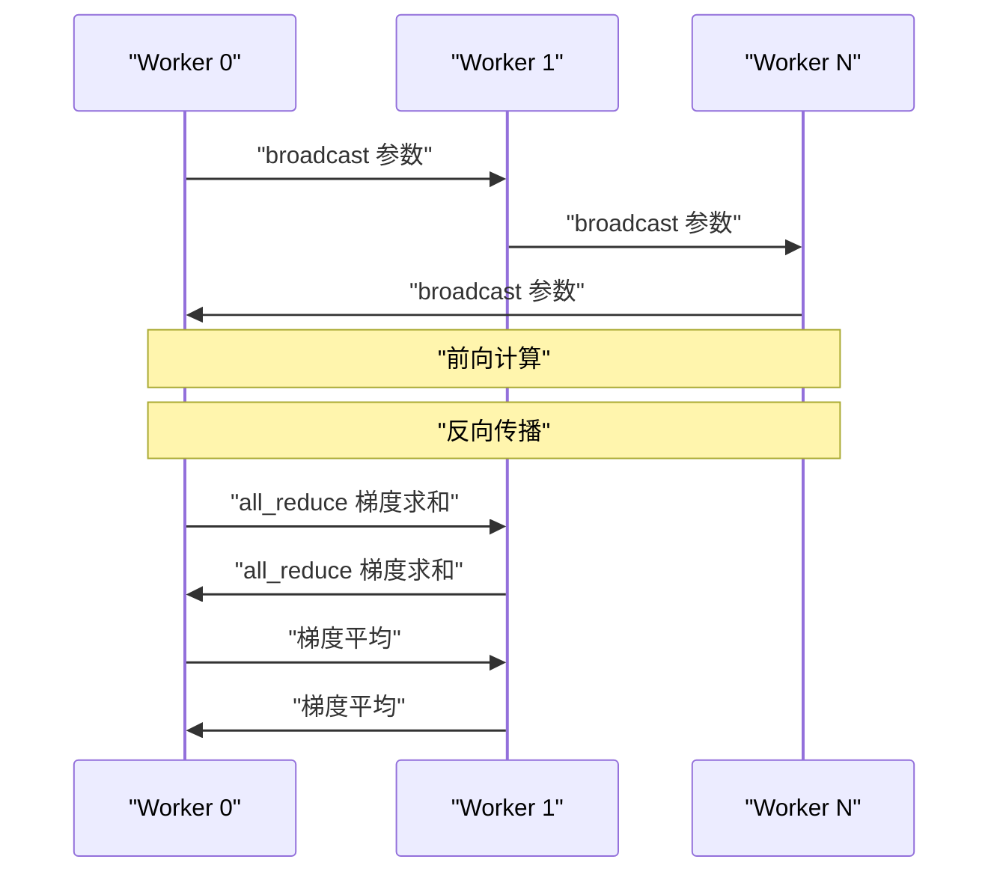

**图表来源**
- [main.py:59-87](file://phases/19-capstone-projects/77-data-parallel-ddp/code/main.py#L59-L87)
- [main.py:179-221](file://phases/19-capstone-projects/48-distributed-fsdp-ddp/code/main.py#L179-L221)

**章节来源**
- [main.py:59-87](file://phases/19-capstone-projects/77-data-parallel-ddp/code/main.py#L59-L87)
- [main.py:179-221](file://phases/19-capstone-projects/48-distributed-fsdp-ddp/code/main.py#L179-L221)

### ZeRO 阶段1：优化器状态分片与 reduce-scatter
- 核心机制：每设备仅持有 master 权重与优化器状态（m、v）的 1/N，反向后对全梯度执行 reduce-scatter，仅接收自身分片的梯度，再进行 Adam 更新，最后通过 all-gather 重建完整参数用于下一次前向。
- 关键函数与流程参见：
  - ZeRO 优化器步骤：[main.py:137-159](file://phases/19-capstone-projects/78-zero-parameter-sharding/code/main.py#L137-L159)

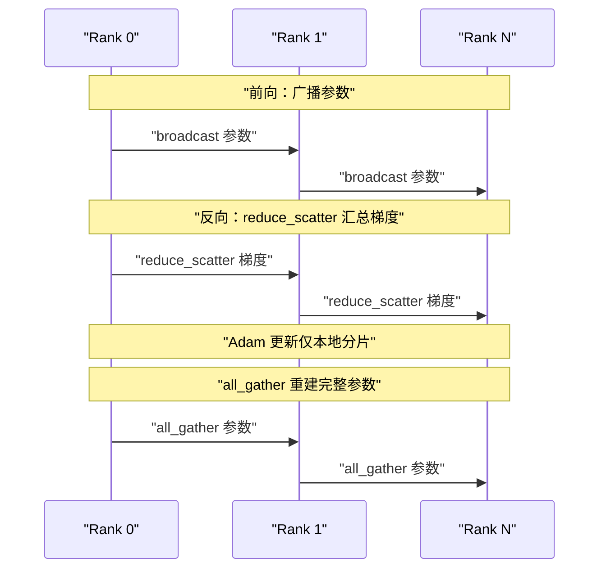

**图表来源**
- [main.py:137-159](file://phases/19-capstone-projects/78-zero-parameter-sharding/code/main.py#L137-L159)

**章节来源**
- [main.py:137-159](file://phases/19-capstone-projects/78-zero-parameter-sharding/code/main.py#L137-L159)

### 流水线并行：两阶段管道与通信
- 核心机制：将网络分为两个阶段，分别由两个设备持有；微批在阶段间通过 send/recv 传递激活与梯度，实现流水线推进。
- 关键函数与流程参见：
  - 两阶段管道工作流：[main.py:111-160](file://phases/19-capstone-projects/79-pipeline-parallel/code/main.py#L111-L160)

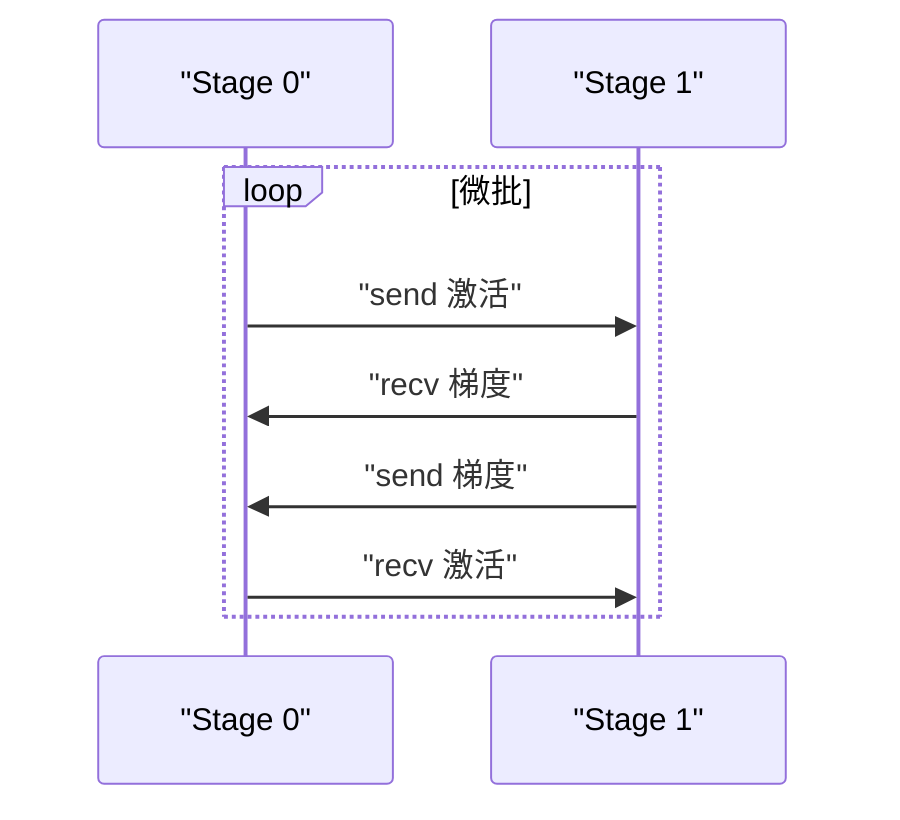

**图表来源**
- [main.py:111-160](file://phases/19-capstone-projects/79-pipeline-parallel/code/main.py#L111-L160)

**章节来源**
- [main.py:111-160](file://phases/19-capstone-projects/79-pipeline-parallel/code/main.py#L111-L160)

### 分片检查点：原子写入与恢复校验
- 核心机制：先写临时文件，再写清单，最后一次性重命名；加载时校验世界规模、清单版本、分片数量与哈希，确保恢复一致性。
- 关键函数与流程参见：
  - 保存与加载：[main.py:105-156](file://phases/19-capstone-projects/80-checkpoint-sharded-resume/code/main.py#L105-L156)
  - 加载校验：[main.py:159-209](file://phases/19-capstone-projects/80-checkpoint-sharded-resume/code/main.py#L159-L209)

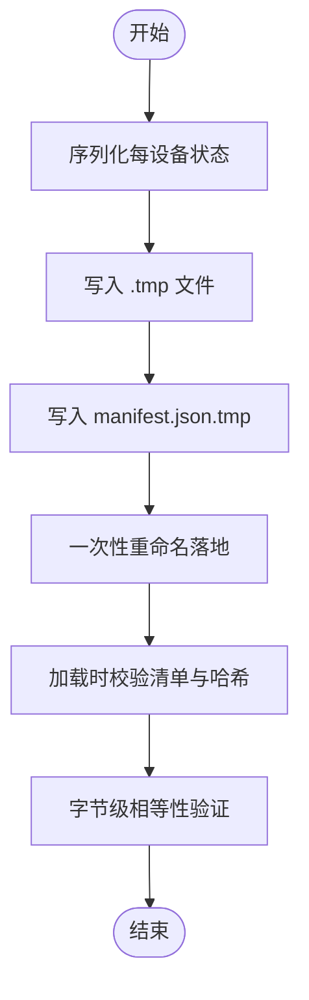

**图表来源**
- [main.py:105-156](file://phases/19-capstone-projects/80-checkpoint-sharded-resume/code/main.py#L105-L156)
- [main.py:159-209](file://phases/19-capstone-projects/80-checkpoint-sharded-resume/code/main.py#L159-L209)

**章节来源**
- [main.py:105-156](file://phases/19-capstone-projects/80-checkpoint-sharded-resume/code/main.py#L105-L156)
- [main.py:159-209](file://phases/19-capstone-projects/80-checkpoint-sharded-resume/code/main.py#L159-L209)

### 端到端分布式训练：组合 DDP+ZeRO+检查点
- 组合策略：使用 DDP 进行参数广播与梯度 all-reduce；在优化器阶段采用 ZeRO 阶段1；在训练中途进行分片检查点保存与恢复验证。
- 关键函数与流程参见：
  - 训练循环与检查点：[main.py:315-357](file://phases/19-capstone-projects/81-end-to-end-distributed-train/code/main.py#L315-L357)
  - 恢复一致性验证：[main.py:401-414](file://phases/19-capstone-projects/81-end-to-end-distributed-train/code/main.py#L401-L414)

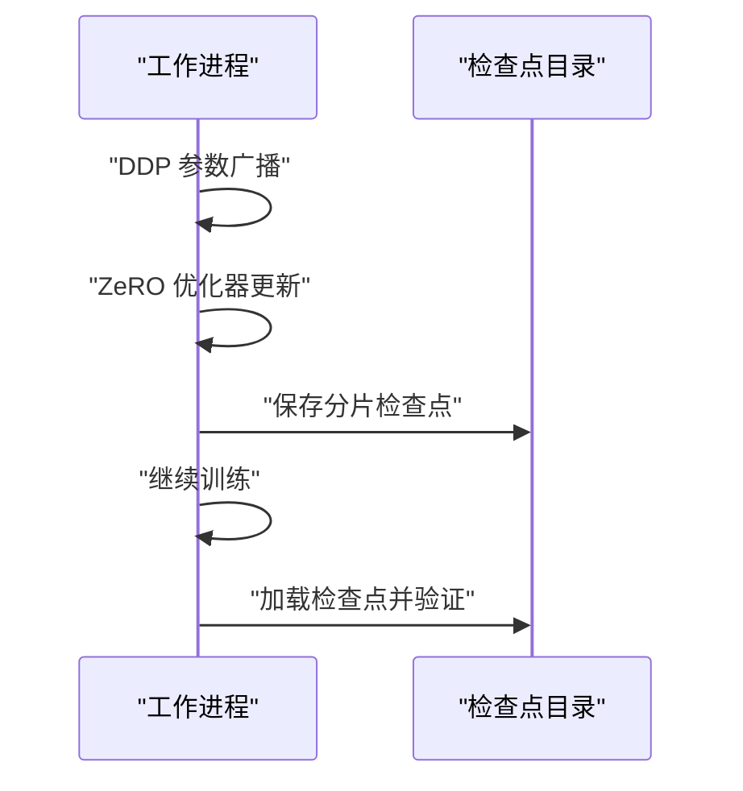

**图表来源**
- [main.py:315-357](file://phases/19-capstone-projects/81-end-to-end-distributed-train/code/main.py#L315-L357)
- [main.py:401-414](file://phases/19-capstone-projects/81-end-to-end-distributed-train/code/main.py#L401-L414)

**章节来源**
- [main.py:315-357](file://phases/19-capstone-projects/81-end-to-end-distributed-train/code/main.py#L315-L357)
- [main.py:401-414](file://phases/19-capstone-projects/81-end-to-end-distributed-train/code/main.py#L401-L414)

## 依赖关系分析
- 组件内聚与耦合：
  - 仿真模块（阶段10）独立于实际分布式实现，提供教学与验证基础。
  - 实战模块（阶段19）逐步引入 DDP、ZeRO、流水线并行与检查点，形成递进依赖。
- 外部依赖：
  - torch.distributed：进程组初始化、广播、all-reduce、reduce-scatter、all-gather、send/recv、barrier 等。
  - torch.multiprocessing：在 CPU 上模拟多进程分布式环境。
  - Python 标准库：json、hashlib、multiprocessing、tempfile 等。

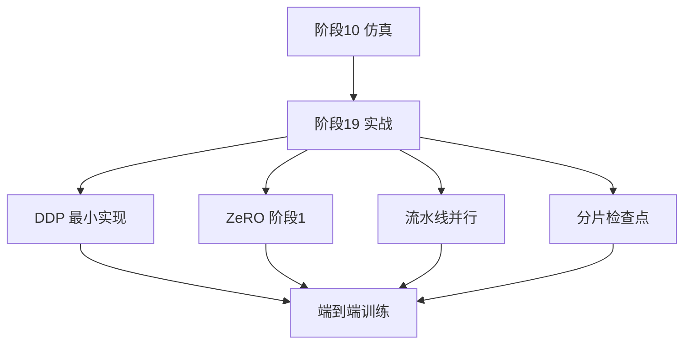

**图表来源**
- [main.py:246-348](file://phases/10-llms-from-scratch/05-scaling-distributed/code/main.py#L246-L348)
- [main.py:388-411](file://phases/19-capstone-projects/48-distributed-fsdp-ddp/code/main.py#L388-L411)
- [main.py:266-282](file://phases/19-capstone-projects/78-zero-parameter-sharding/code/main.py#L266-L282)
- [main.py:201-217](file://phases/19-capstone-projects/79-pipeline-parallel/code/main.py#L201-L217)
- [main.py:249-288](file://phases/19-capstone-projects/80-checkpoint-sharded-resume/code/main.py#L249-L288)
- [main.py:417-448](file://phases/19-capstone-projects/81-end-to-end-distributed-train/code/main.py#L417-L448)

**章节来源**
- [main.py:246-348](file://phases/10-llms-from-scratch/05-scaling-distributed/code/main.py#L246-L348)
- [main.py:388-411](file://phases/19-capstone-projects/48-distributed-fsdp-ddp/code/main.py#L388-L411)
- [main.py:266-282](file://phases/19-capstone-projects/78-zero-parameter-sharding/code/main.py#L266-L282)
- [main.py:201-217](file://phases/19-capstone-projects/79-pipeline-parallel/code/main.py#L201-L217)
- [main.py:249-288](file://phases/19-capstone-projects/80-checkpoint-sharded-resume/code/main.py#L249-L288)
- [main.py:417-448](file://phases/19-capstone-projects/81-end-to-end-distributed-train/code/main.py#L417-L448)

## 性能考量
- 通信模式与体积：
  - 数据并行：每步通信体积约为参数总量的梯度大小，使用 ring all-reduce。
  - FSDP：每层涉及一次 all-gather（参数重建）与一次 reduce-scatter（梯度聚合），通信量与层数成正比。
  - 张量并行：每层使用 all-reduce 通信，通信次数约等于层数的两倍。
- 内存占用：
  - 数据并行：每设备存储完整模型与优化器状态，显存不随设备数下降。
  - FSDP/ZeRO：参数与优化器状态按设备数分片，显著降低每设备显存占用。
- 训练成本估算：
  - 基于模型规模、目标 token 数、GPU 类型与利用率估算总耗时与成本。
- 性能优化建议：
  - 使用混合精度（BF16/FP16）减少内存与带宽压力。
  - 在流水线并行中增加微批数量以降低气泡比例。
  - 通过 reduce-scatter 与 all-gather 的合理配比减少通信峰值。

**章节来源**
- [main.py:170-196](file://phases/10-llms-from-scratch/05-scaling-distributed/code/main.py#L170-L196)
- [main.py:85-140](file://phases/10-llms-from-scratch/05-scaling-distributed/code/main.py#L85-L140)
- [main.py:199-243](file://phases/10-llms-from-scratch/05-scaling-distributed/code/main.py#L199-L243)

## 故障排查指南
- 参数未对齐或漂移：
  - 确认 DDP 初始化时已广播参数，且每设备权重在训练前后保持一致。
  - 参考断言与日志输出：[main.py:405-407](file://phases/19-capstone-projects/48-distributed-fsdp-ddp/code/main.py#L405-L407)
- 梯度同步异常：
  - 检查 all-reduce 是否执行、是否除以设备数；确认梯度存在且形状匹配。
  - 参考最小 DDP 实现：[main.py:76-81](file://phases/19-capstone-projects/77-data-parallel-ddp/code/main.py#L76-L81)
- 通信错误或超时：
  - 确保环回接口设置正确（macOS 使用 lo0，Linux 使用 lo），并在 CPU 环境下启用支持 gloo 的构建。
  - 参考环境初始化与错误提示：[main.py:390-395](file://phases/19-capstone-projects/48-distributed-fsdp-ddp/code/main.py#L390-L395)
- 检查点损坏或恢复失败：
  - 校验清单版本、世界规模与分片数量；逐项核对哈希值。
  - 参考加载校验逻辑：[main.py:159-209](file://phases/19-capstone-projects/80-checkpoint-sharded-resume/code/main.py#L159-L209)
- 流水线并行气泡过高：
  - 增加微批数量，使阶段利用率更接近闭式公式预测值。
  - 参考气泡分析与可视化：[main.py:90-97](file://phases/19-capstone-projects/79-pipeline-parallel/code/main.py#L90-L97)

**章节来源**
- [main.py:390-395](file://phases/19-capstone-projects/48-distributed-fsdp-ddp/code/main.py#L390-L395)
- [main.py:405-407](file://phases/19-capstone-projects/48-distributed-fsdp-ddp/code/main.py#L405-L407)
- [main.py:76-81](file://phases/19-capstone-projects/77-data-parallel-ddp/code/main.py#L76-L81)
- [main.py:159-209](file://phases/19-capstone-projects/80-checkpoint-sharded-resume/code/main.py#L159-L209)
- [main.py:90-97](file://phases/19-capstone-projects/79-pipeline-parallel/code/main.py#L90-L97)

## 结论
本项目提供了从理论仿真到工程实现的完整分布式训练学习路径。通过数据并行、张量并行、流水线并行与 FSDP/ZeRO 的组合，能够有效突破显存瓶颈并提升吞吐。配合分片检查点与端到端训练流程，可构建可扩展、可恢复的大模型训练系统。建议在实践中优先验证通信正确性与内存占用，再逐步引入流水线并行与混合精度以获得最佳性价比。

## 附录
- 可视化资源：站点包含数据并行、张量并行、ZeRO 等概念的交互式图示，有助于直观理解分布式策略。
- 课程索引：站点数据文件列出分布式训练相关课程与项目，便于按主题检索与学习。

**章节来源**
- [figures-infra.js:13-210](file://site/figures-infra.js#L13-L210)
- [data.js:1762-10764](file://site/data.js#L1762-L10764)