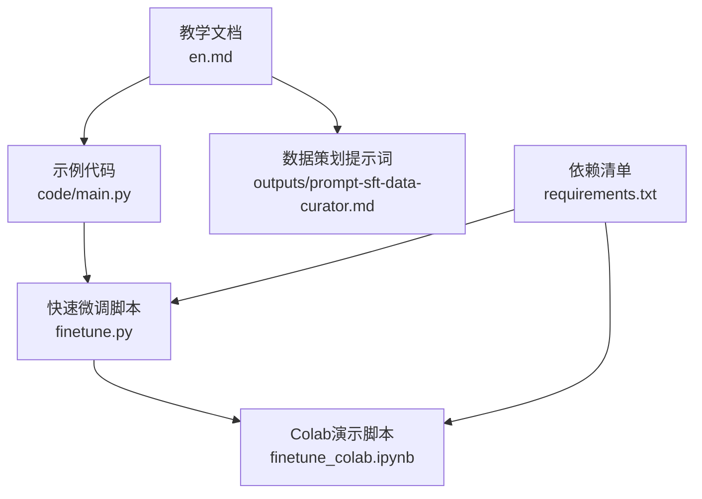
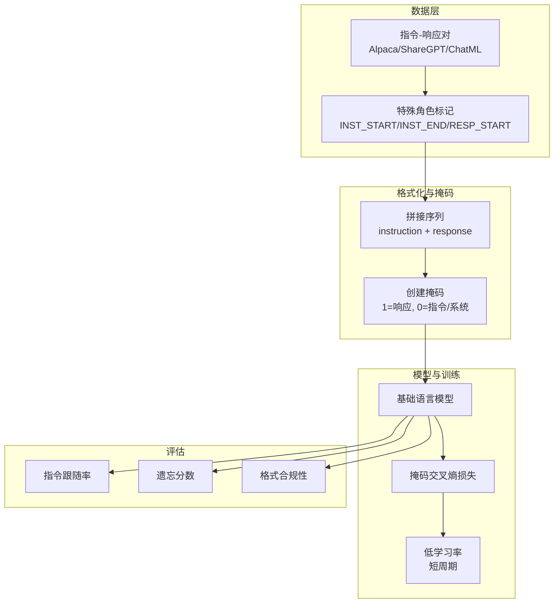
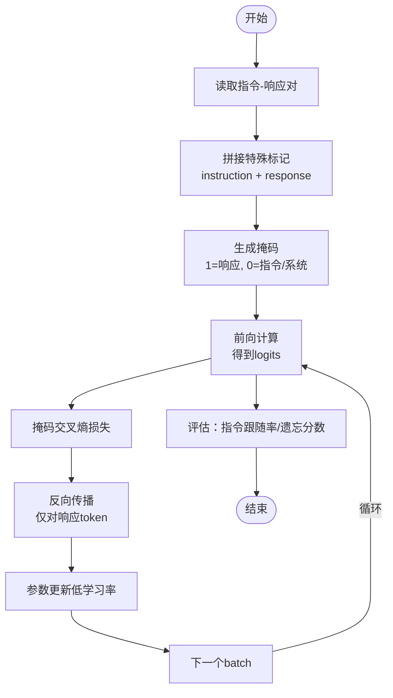
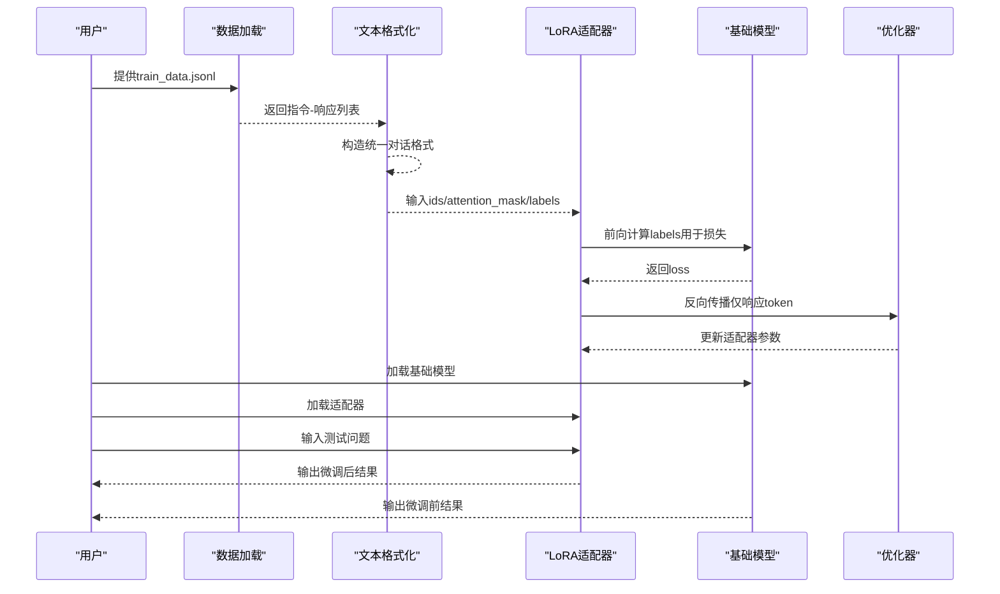
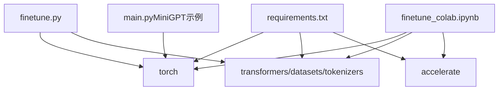

# 指令微调技术

<cite>
**本文引用的文件**
- [phases/10-llms-from-scratch/06-instruction-tuning-sft/docs/en.md](file://phases/10-llms-from-scratch/06-instruction-tuning-sft/docs/en.md)
- [phases/10-llms-from-scratch/06-instruction-tuning-sft/code/main.py](file://phases/10-llms-from-scratch/06-instruction-tuning-sft/code/main.py)
- [phases/10-llms-from-scratch/06-instruction-tuning-sft/outputs/prompt-sft-data-curator.md](file://phases/10-llms-from-scratch/06-instruction-tuning-sft/outputs/prompt-sft-data-curator.md)
- [finetune.py](file://finetune.py)
- [finetune_colab.ipynb](file://finetune_colab.ipynb)
- [requirements.txt](file://requirements.txt)
</cite>

## 目录
1. [引言](#引言)
2. [项目结构](#项目结构)
3. [核心组件](#核心组件)
4. [架构总览](#架构总览)
5. [详细组件分析](#详细组件分析)
6. [依赖关系分析](#依赖关系分析)
7. [性能考量](#性能考量)
8. [故障排查指南](#故障排查指南)
9. [结论](#结论)
10. [附录](#附录)

## 引言
本技术文档围绕“监督指令微调（Supervised Fine-Tuning, SFT）”展开，系统讲解其核心原理、数据格式设计、损失函数定义、训练策略与评估方法，并结合仓库中的教学实现与脚本，给出可操作的训练流程与最佳实践。SFT是将基础语言模型从“续写文本”的能力转化为“遵循指令、回答问题、进行多轮对话”的关键步骤，广泛应用于各类对话助手与专业领域助手的落地。

## 项目结构
本仓库与SFT相关的内容主要分布在以下位置：
- 教学文档与示例：phases/10-llms-from-scratch/06-instruction-tuning-sft/docs/en.md 与 code/main.py 提供了从零实现的SFT训练与评估流程，包括数据格式化、掩码交叉熵损失、训练循环与灾难性遗忘检测。
- 数据策划提示词：outputs/prompt-sft-data-curator.md 提供了面向不同能力（如代码生成、数学推理、对话等）的数据集设计框架、格式偏好、质量标准与预算估算。
- 快速微调脚本：finetune.py 与 finetune_colab.ipynb 展示了使用LoRA在真实模型上的端到端SFT流程，包括数据准备、标签掩码、训练与推理对比。

**图示来源**
- [phases/10-llms-from-scratch/06-instruction-tuning-sft/docs/en.md](file://phases/10-llms-from-scratch/06-instruction-tuning-sft/docs/en.md)
- [phases/10-llms-from-scratch/06-instruction-tuning-sft/code/main.py](file://phases/10-llms-from-scratch/06-instruction-tuning-sft/code/main.py)
- [phases/10-llms-from-scratch/06-instruction-tuning-sft/outputs/prompt-sft-data-curator.md](file://phases/10-llms-from-scratch/06-instruction-tuning-sft/outputs/prompt-sft-data-curator.md)
- [finetune.py](file://finetune.py)
- [finetune_colab.ipynb](file://finetune_colab.ipynb)
- [requirements.txt](file://requirements.txt)

**章节来源**
- [phases/10-llms-from-scratch/06-instruction-tuning-sft/docs/en.md](file://phases/10-llms-from-scratch/06-instruction-tuning-sft/docs/en.md)
- [phases/10-llms-from-scratch/06-instruction-tuning-sft/code/main.py](file://phases/10-llms-from-scratch/06-instruction-tuning-sft/code/main.py)
- [phases/10-llms-from-scratch/06-instruction-tuning-sft/outputs/prompt-sft-data-curator.md](file://phases/10-llms-from-scratch/06-instruction-tuning-sft/outputs/prompt-sft-data-curator.md)
- [finetune.py](file://finetune.py)
- [finetune_colab.ipynb](file://finetune_colab.ipynb)
- [requirements.txt](file://requirements.txt)

## 核心组件
- 数据格式与掩码
  - 支持多种对话模板：Alpaca、ShareGPT、ChatML；SFT的关键在于仅对“助手”角色的响应部分计算损失，指令与系统提示等不参与梯度更新。
  - 在自研MiniGPT示例中，通过特殊标记界定指令/响应边界，并以掩码向量仅保留响应token的梯度信号。
- 掩码交叉熵损失
  - 对每个token计算负对数似然，再乘以掩码并按响应token数量归一化，确保长指令不会稀释梯度强度。
- 训练循环
  - 复用预训练框架，采用极低学习率（如2e-5），短周期（1-3轮），并在数据混合中加入少量原始文本以缓解灾难性遗忘。
- 评估与质量控制
  - 基于“指令跟随率”“遗忘分数（困惑度变化）”“格式合规性”“基准评测（如MT-Bench/AlpacaEval）”等指标综合评估SFT效果。
- 快速微调脚本
  - 使用LoRA在真实模型上进行SFT，支持标签掩码、数据加载、训练循环与推理对比，便于快速验证与部署。

**章节来源**
- [phases/10-llms-from-scratch/06-instruction-tuning-sft/docs/en.md](file://phases/10-llms-from-scratch/06-instruction-tuning-sft/docs/en.md)
- [phases/10-llms-from-scratch/06-instruction-tuning-sft/code/main.py](file://phases/10-llms-from-scratch/06-instruction-tuning-sft/code/main.py)
- [finetune.py](file://finetune.py)
- [finetune_colab.ipynb](file://finetune_colab.ipynb)

## 架构总览
下图展示了SFT从数据到模型行为改变的整体流程：数据经由模板化与掩码处理，进入前向计算与掩码损失，反向传播仅作用于响应token，最终使模型具备“遵循指令”的行为。

**图示来源**
- [phases/10-llms-from-scratch/06-instruction-tuning-sft/docs/en.md](file://phases/10-llms-from-scratch/06-instruction-tuning-sft/docs/en.md)
- [phases/10-llms-from-scratch/06-instruction-tuning-sft/code/main.py](file://phases/10-llms-from-scratch/06-instruction-tuning-sft/code/main.py)

## 详细组件分析

### 数据集构建与质量保障
- 设计原则
  - 质量优先于数量：专家标注的小规模高质量数据可达到更大规模噪声数据的效果。
  - 多样性覆盖：根据目标能力分配不同任务比例（如问答、创作、代码、推理、总结、约束指令等）。
  - 准确性、清晰度、难度梯度：确保事实正确、表达简洁、覆盖易中难。
- 质量检查
  - 单条检查：相关性、事实准确性、完整性、简洁性、格式一致性。
  - 数据级检查：单一来源占比上限、有效token占比、平均响应长度、系统提示多样性。
- 格式选择
  - Alpaca：单轮指令-响应，适合快速原型。
  - ShareGPT：多轮对话，适合聊天应用。
  - ChatML：使用特殊开始/结束标记，适合特定模型（如Qwen/Yi）。
- 训练配置建议
  - 学习率：7B模型约2e-5，70B模型更低；批次大小32-128；周期1-3；热身步数0-5%；权重衰减0.0-0.1；仅对响应token计算损失；混入2-5%原始文本防止遗忘。

**章节来源**
- [phases/10-llms-from-scratch/06-instruction-tuning-sft/outputs/prompt-sft-data-curator.md](file://phases/10-llms-from-scratch/06-instruction-tuning-sft/outputs/prompt-sft-data-curator.md)

### 自研MiniGPT的SFT实现
- 数据格式化
  - 将instruction与response编码为token序列，并插入特殊标记界定角色边界。
  - 生成掩码：指令与系统提示为0，响应为1；响应起始标记本身不参与损失。
- 掩码交叉熵损失
  - 对数softmax后按掩码加权，按响应token数量归一化，避免长指令稀释梯度。
- 训练循环
  - 低学习率（如2e-5）、短周期（1-3轮）、随机打乱、截断到固定长度。
  - 通过MiniGPT的Transformer块参数更新展示梯度如何仅作用于响应token。
- 评估
  - 指令跟随评估：构造instruction格式输入，观察模型在RESP_START之后的生成行为。
  - 灾难性遗忘检测：比较SFT前后在原始文本上的困惑度变化，阈值建议小于15%。

**图示来源**
- [phases/10-llms-from-scratch/06-instruction-tuning-sft/code/main.py](file://phases/10-llms-from-scratch/06-instruction-tuning-sft/code/main.py)

**章节来源**
- [phases/10-llms-from-scratch/06-instruction-tuning-sft/docs/en.md](file://phases/10-llms-from-scratch/06-instruction-tuning-sft/docs/en.md)
- [phases/10-llms-from-scratch/06-instruction-tuning-sft/code/main.py](file://phases/10-llms-from-scratch/06-instruction-tuning-sft/code/main.py)

### 快速微调脚本（LoRA + 真实模型）
- 模型与适配器
  - 使用AutoModelForCausalLM与AutoTokenizer加载真实模型，注入LoRA适配器，仅训练少量可训练参数。
- 数据准备
  - 读取JSONL格式的指令-响应数据，构造统一的对话格式文本。
- 标签掩码
  - 通过查找“客服：”等标识，将标签矩阵中指令部分置为忽略值，仅对响应部分计算损失。
- 训练循环
  - 使用小批量、低学习率、AdamW优化器，训练若干轮后保存适配器。
- 推理对比
  - 加载基础模型与适配器，在相同输入上分别生成，对比输出差异，验证SFT效果。

**图示来源**
- [finetune.py](file://finetune.py)
- [finetune_colab.ipynb](file://finetune_colab.ipynb)

**章节来源**
- [finetune.py](file://finetune.py)
- [finetune_colab.ipynb](file://finetune_colab.ipynb)

### 关键算法与实现要点
- 掩码交叉熵损失
  - 形状与数值稳定：对logits做最大值中心化，避免溢出；按掩码加权后按响应token数量归一化。
  - 梯度方向：仅响应token产生非零梯度，指令token梯度为0，避免模型“生成指令”而非“回答指令”。
- 训练策略
  - 低学习率（远低于预训练）、短周期、必要时混入少量原始文本，缓解灾难性遗忘。
- 评估指标
  - 指令跟随率：测试集中能给出相关且完整回答的比例。
  - 遗忘分数：与基线模型相比在通用文本上的困惑度变化。
  - 格式合规性：输出是否符合期望的对话格式。
  - 基准评测：如MT-Bench或AlpacaEval等标准评测。

**章节来源**
- [phases/10-llms-from-scratch/06-instruction-tuning-sft/docs/en.md](file://phases/10-llms-from-scratch/06-instruction-tuning-sft/docs/en.md)
- [phases/10-llms-from-scratch/06-instruction-tuning-sft/code/main.py](file://phases/10-llms-from-scratch/06-instruction-tuning-sft/code/main.py)

## 依赖关系分析
- Python生态
  - PyTorch、Transformers、Datasets、Tokenizers、Accelerate等为SFT与推理提供基础设施。
- 教学与脚本
  - 教学代码基于MiniGPT实现，强调掩码损失与灾难性遗忘检测；快速脚本基于真实模型与LoRA，强调工程可用性。
- 版本与兼容
  - requirements.txt列出了关键库版本下限，确保在Colab与本地环境中一致运行。

**图示来源**
- [requirements.txt](file://requirements.txt)
- [finetune.py](file://finetune.py)
- [finetune_colab.ipynb](file://finetune_colab.ipynb)
- [phases/10-llms-from-scratch/06-instruction-tuning-sft/code/main.py](file://phases/10-llms-from-scratch/06-instruction-tuning-sft/code/main.py)

**章节来源**
- [requirements.txt](file://requirements.txt)
- [finetune.py](file://finetune.py)
- [finetune_colab.ipynb](file://finetune_colab.ipynb)
- [phases/10-llms-from-scratch/06-instruction-tuning-sft/code/main.py](file://phases/10-llms-from-scratch/06-instruction-tuning-sft/code/main.py)

## 性能考量
- 计算效率
  - LoRA仅训练少量参数，显著降低显存占用与训练时间；适合在消费级设备上快速迭代。
  - MiniGPT示例强调理解机制，实际工程建议使用真实大模型与分布式训练。
- 训练稳定性
  - 低学习率与短周期是SFT的关键；若出现过拟合或灾难性遗忘，应降低学习率、减少周期或混入原始文本。
- 推理吞吐
  - 适配器体积小，易于部署；在服务端可通过模型路由与缓存提升整体吞吐。

[本节为通用指导，无需引用具体文件]

## 故障排查指南
- 验证损失上升
  - 现象：验证集/通用文本困惑度上升超过15%。
  - 原因：学习率过高、周期过长、数据量不足或未混入原始文本。
  - 处理：降低学习率、缩短周期、增加数据多样性、混入2-5%原始文本。
- 模型过度拟合
  - 现象：模型开始复述训练示例而非泛化。
  - 原因：数据多样性不足或周期过多。
  - 处理：引入更多样例、早停、正则化或权重衰减。
- 输出格式异常
  - 现象：输出不符合期望的对话格式。
  - 原因：标签掩码错误或模板不一致。
  - 处理：核对掩码与模板，确保RESP_START之后才计算损失。
- 适配器加载失败
  - 现象：无法加载保存的适配器或推理报错。
  - 原因：模型名称不匹配、设备映射或dtype设置不当。
  - 处理：确认模型名称、device_map与dtype一致；在Colab中使用自动设备映射。

**章节来源**
- [phases/10-llms-from-scratch/06-instruction-tuning-sft/docs/en.md](file://phases/10-llms-from-scratch/06-instruction-tuning-sft/docs/en.md)
- [finetune.py](file://finetune.py)
- [finetune_colab.ipynb](file://finetune_colab.ipynb)

## 结论
SFT通过“指令-响应”数据与“响应token掩码损失”，将基础语言模型转变为具备指令跟随能力的实用助手。教学示例强调掩码损失与灾难性遗忘检测，快速脚本强调LoRA与工程落地。结合数据策划提示词与评估指标，开发者可在不同规模与预算下构建高质量的指令跟随模型。

[本节为总结性内容，无需引用具体文件]

## 附录
- 实践清单
  - 明确目标能力与预算，制定数据采集计划与格式规范。
  - 构建高质量数据集，执行单条与数据级质量检查。
  - 选择合适的学习率、周期与批次大小，混入少量原始文本。
  - 使用掩码交叉熵损失，仅对响应token计算梯度。
  - 评估指令跟随率、遗忘分数、格式合规性与基准评测。
  - 保存并部署适配器，持续监控线上效果。

**章节来源**
- [phases/10-llms-from-scratch/06-instruction-tuning-sft/outputs/prompt-sft-data-curator.md](file://phases/10-llms-from-scratch/06-instruction-tuning-sft/outputs/prompt-sft-data-curator.md)
- [phases/10-llms-from-scratch/06-instruction-tuning-sft/docs/en.md](file://phases/10-llms-from-scratch/06-instruction-tuning-sft/docs/en.md)
- [finetune.py](file://finetune.py)
- [finetune_colab.ipynb](file://finetune_colab.ipynb)