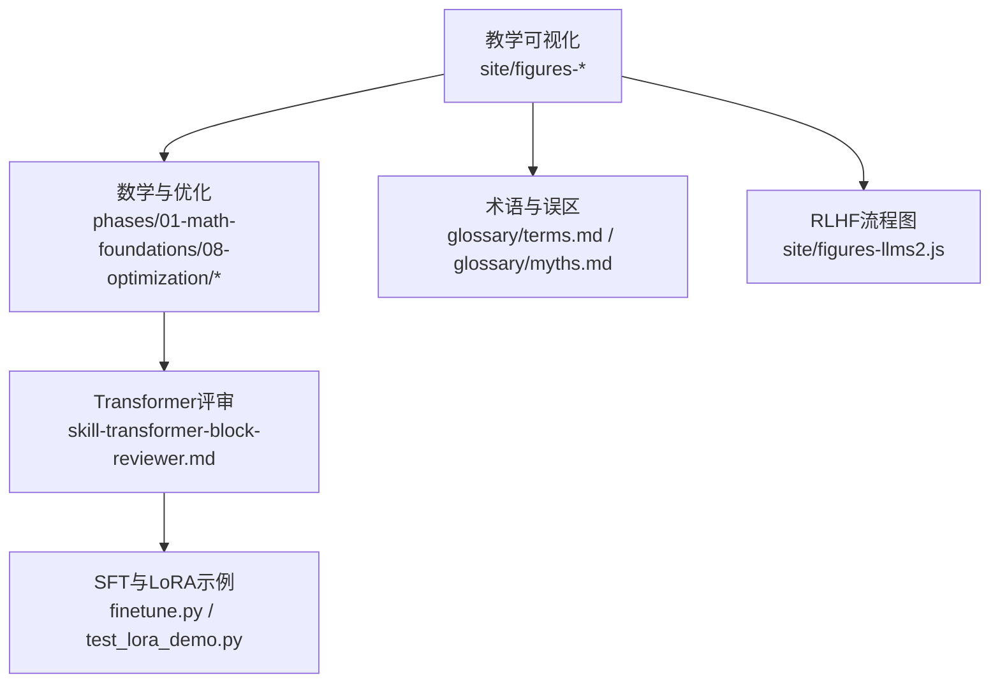
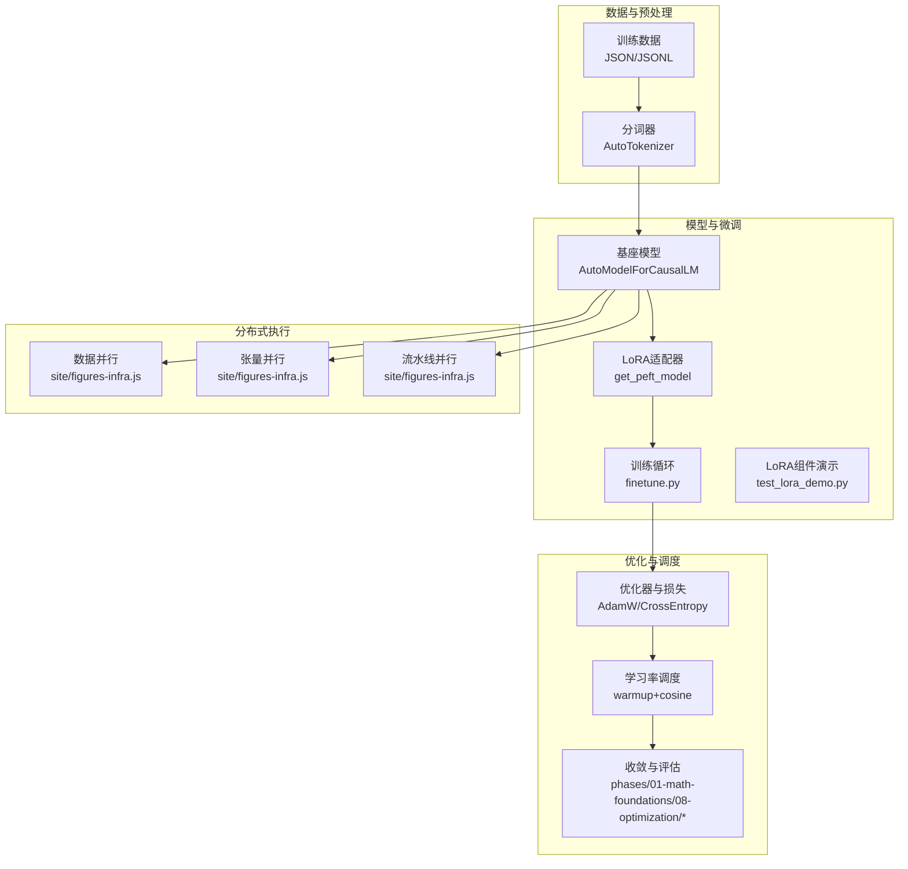
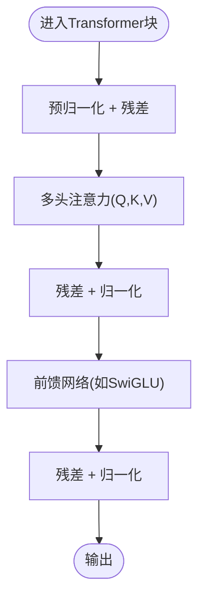
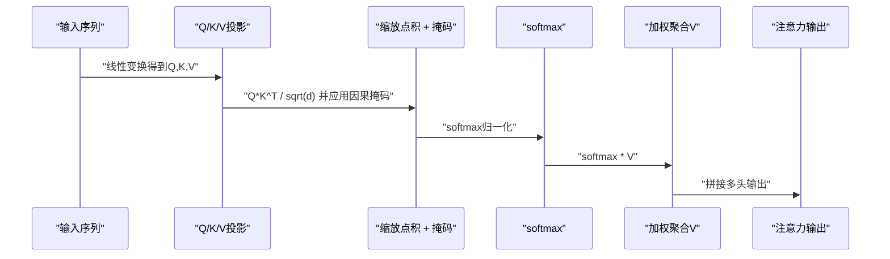
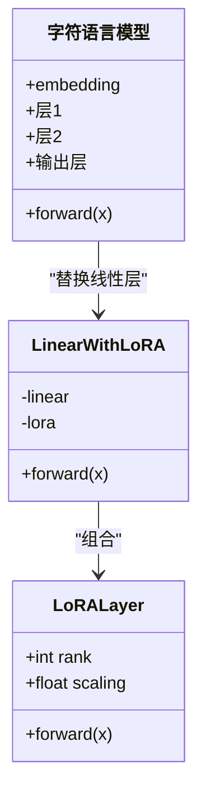
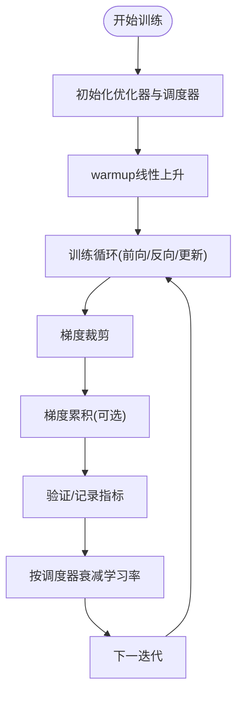
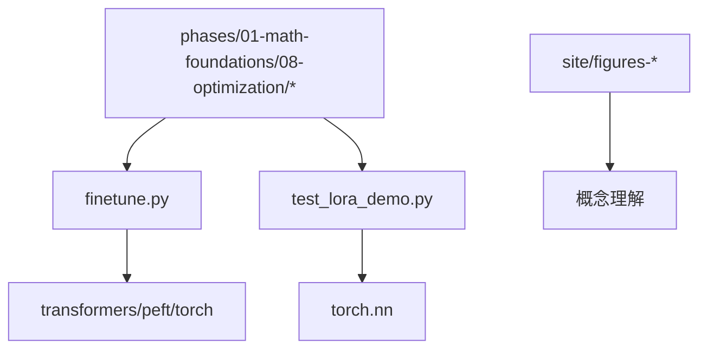

# 预训练与微调技术

<cite>
**本文引用的文件**
- [finetune.py](file://finetune.py)
- [test_lora_demo.py](file://test_lora_demo.py)
- [site/figures-transformers.js](file://site/figures-transformers.js)
- [site/figures-infra.js](file://site/figures-infra.js)
- [site/lesson-figures.js](file://site/lesson-figures.js)
- [phases/01-math-foundations/08-optimization/docs/en.md](file://phases/01-math-foundations/08-optimization/docs/en.md)
- [phases/01-math-foundations/08-optimization/quiz.json](file://phases/01-math-foundations/08-optimization/quiz.json)
- [glossary/terms.md](file://glossary/terms.md)
- [glossary/myths.md](file://glossary/myths.md)
- [phases/07-transformers-deep-dive/05-full-transformer/outputs/skill-transformer-block-reviewer.md](file://phases/07-transformers-deep-dive/05-full-transformer/outputs/skill-transformer-block-reviewer.md)
- [phases/07-transformers-deep-dive/06-bert-masked-language-modeling/outputs/skill-bert-finetuner.md](file://phases/07-transformers-deep-dive/06-bert-masked-language-modeling/outputs/skill-bert-finetuner.md)
- [site/figures-llms2.js](file://site/figures-llms2.js)
</cite>

## 目录
1. [引言](#引言)
2. [项目结构](#项目结构)
3. [核心组件](#核心组件)
4. [架构总览](#架构总览)
5. [详细组件分析](#详细组件分析)
6. [依赖关系分析](#依赖关系分析)
7. [性能考量](#性能考量)
8. [故障排查指南](#故障排查指南)
9. [结论](#结论)
10. [附录](#附录)

## 引言
本文件围绕“预训练与微调技术”主题，系统梳理Mini GPT模型的实现要点与工程化实践，覆盖Transformer架构、注意力机制、位置编码等核心组件；详述预训练策略（掩码语言建模、对比学习等任务设计）；深入解析指令微调（SFT）的数据格式、损失函数与训练技巧；并给出分布式训练的实现方案（数据并行、张量并行、流水线并行等）。最后提供完整的训练流程指南，包含超参数调优、学习率调度、梯度累积等关键技术。

## 项目结构
仓库以“分阶段学习路径”组织内容，其中与本主题直接相关的关键模块包括：
- 教学可视化与术语：site/figures-* 提供Transformer、分布式训练、学习率调度等可视化；glossary/terms.md、glossary/myths.md 提供术语与常见误区说明。
- 数学基础与优化：phases/01-math-foundations/08-optimization 提供优化器、学习率调度、收敛判断等理论与实践指导。
- Transformer实现与评审：phases/07-transformers-deep-dive/05-full-transformer/outputs/skill-transformer-block-reviewer.md 提供Transformer模块评审清单。
- 微调与LoRA示例：finetune.py（端到端SFT示例）、test_lora_demo.py（LoRA组件与训练演示）。
- 任务范式与RLHF：phases/07-transformers-deep-dive/06-bert-masked-language-modeling/outputs/skill-bert-finetuner.md（BERT微调范式）；site/figures-llms2.js（RLHF三阶段流程）。



**章节来源**
- [site/figures-transformers.js:131-393](file://site/figures-transformers.js#L131-L393)
- [site/figures-infra.js:52-110](file://site/figures-infra.js#L52-L110)
- [site/lesson-figures.js:295-339](file://site/lesson-figures.js#L295-L339)
- [phases/01-math-foundations/08-optimization/docs/en.md:121-356](file://phases/01-math-foundations/08-optimization/docs/en.md#L121-L356)
- [phases/07-transformers-deep-dive/05-full-transformer/outputs/skill-transformer-block-reviewer.md:1-19](file://phases/07-transformers-deep-dive/05-full-transformer/outputs/skill-transformer-block-reviewer.md#L1-L19)
- [finetune.py:1-67](file://finetune.py#L1-L67)
- [test_lora_demo.py:33-67](file://test_lora_demo.py#L33-L67)
- [site/figures-llms2.js:111-174](file://site/figures-llms2.js#L111-L174)

## 核心组件
- Transformer架构与子层
  - 自注意力与多头注意力：计算任意位置间的相关性，支持因果掩码（decoder）与对称关注（encoder）。
  - 前馈网络（FFN）：经典结构为两层线性变换夹带激活，现代偏好SwiGLU等。
  - 残差连接与归一化：预归一化（pre-norm）成为主流，减少深层不稳定。
  - 位置编码：绝对、正弦/余弦、RoPE、ALiBi等，注入顺序信息而非序列理解。
- 注意力机制
  - Q、K、V投影后缩放点积，softmax得到权重，再加权聚合V；可扩展至GQA/MQA/MLA。
  - 因果掩码确保解码时不可见未来信息。
- 位置编码
  - 不同方法处理顺序注入，无统一“真正顺序理解”的机制。
- 预训练策略
  - 掩码语言建模（MLM）：随机掩码部分token，预测被掩码位置。
  - 对比学习：通过对比正负样本提升语义对齐。
  - 其他：自回归语言建模（Causal LM）、句子级排序等。
- 指令微调（SFT）
  - 数据格式：(instruction, response)或对话历史+助手回复。
  - 损失函数：交叉熵，标签通常设为响应部分（或全序列）。
  - 技巧：冻结部分层、LoRA低秩适配、梯度裁剪、warmup+余弦退火。
- 分布式训练
  - 数据并行：每卡复制完整模型，梯度All-Reduce同步。
  - 张量并行：矩阵乘按列切分，各卡计算局部结果后All-Gather。
  - 流水线并行：将层数切分到不同设备，相邻设备间流水交换激活与梯度。
- 训练流程与超参数
  - 优化器：AdamW（Transformer默认）、SGD（图像分类）。
  - 学习率：warmup线性上升，随后cosine/step衰减。
  - 梯度累积：在显存受限时扩大有效batch。
  - 检查点：周期性保存，支持断点续训。

**章节来源**
- [site/figures-transformers.js:358-393](file://site/figures-transformers.js#L358-L393)
- [glossary/myths.md:85-108](file://glossary/myths.md#L85-L108)
- [phases/07-transformers-deep-dive/06-bert-masked-language-modeling/outputs/skill-bert-finetuner.md:10-19](file://phases/07-transformers-deep-dive/06-bert-masked-language-modeling/outputs/skill-bert-finetuner.md#L10-L19)
- [site/figures-infra.js:52-110](file://site/figures-infra.js#L52-L110)
- [phases/01-math-foundations/08-optimization/docs/en.md:121-356](file://phases/01-math-foundations/08-optimization/docs/en.md#L121-L356)

## 架构总览
下图展示从数据到模型再到分布式执行的整体视图，映射到仓库中的具体文件与模块。



**图表来源**
- [finetune.py:1-67](file://finetune.py#L1-L67)
- [test_lora_demo.py:139-186](file://test_lora_demo.py#L139-L186)
- [site/figures-infra.js:52-110](file://site/figures-infra.js#L52-L110)
- [phases/01-math-foundations/08-optimization/docs/en.md:121-356](file://phases/01-math-foundations/08-optimization/docs/en.md#L121-L356)

## 详细组件分析

### Transformer块与子层
- 结构要点
  - 预归一化与残差：每个子层外包裹LayerNorm与残差连接。
  - 注意力：支持MHA/GQA/MQA/MLA；decoder需应用因果掩码；cross-attention中Q来自decoder，K/V来自encoder。
  - FFN：现代偏好SwiGLU，扩张比约2.67×；经典为4× ReLU/GELU。
  - 位置信号：RoPE/ALiBi/绝对位置编码，通常作用于Q/K投影。
- 审核清单
  - 是否采用预归一化；是否正确堆叠残差；是否硬编码d_model；是否缺少因果掩码等。



**章节来源**
- [phases/07-transformers-deep-dive/05-full-transformer/outputs/skill-transformer-block-reviewer.md:10-19](file://phases/07-transformers-deep-dive/05-full-transformer/outputs/skill-transformer-block-reviewer.md#L10-L19)
- [site/figures-transformers.js:358-393](file://site/figures-transformers.js#L358-L393)

### 注意力与因果掩码
- 自注意力计算流程：QKV投影、缩放点积、softmax、加权聚合V。
- 因果掩码：在softmax前将未来位置置负无穷，使模型只能看到过去与当前信息，实现自回归生成。



**章节来源**
- [site/figures-transformers.js:131-137](file://site/figures-transformers.js#L131-L137)

### 位置编码与顺序注入
- 位置编码并非天然顺序理解，而是通过添加位置相关向量注入顺序信息；不同方法（正弦/余弦、RoPE、ALiBi）各有差异。
- 这解释了为何位置编码研究仍在活跃进行。

**章节来源**
- [glossary/myths.md:85-89](file://glossary/myths.md#L85-L89)

### 预训练策略
- 掩码语言建模（MLM）：随机掩码token，预测被掩码位置，广泛用于BERT类模型。
- 对比学习：通过对比正负样本对，提升语义对齐与泛化。
- 其他：自回归语言建模（GPT类）、句子级排序、跨句一致性等。

**章节来源**
- [phases/07-transformers-deep-dive/06-bert-masked-language-modeling/outputs/skill-bert-finetuner.md:10-19](file://phases/07-transformers-deep-dive/06-bert-masked-language-modeling/outputs/skill-bert-finetuner.md#L10-L19)

### 指令微调（SFT）技术细节
- 数据格式：(instruction, response)或对话历史+助手回复；示例中通过模板拼接形成训练样本。
- 损失函数：交叉熵；标签通常设为响应部分（或全序列）。
- 训练技巧：LoRA低秩适配显著降低可训练参数；梯度裁剪；warmup+余弦退火；必要时冻结部分层。
- 端到端示例：加载Qwen2.5-0.5B-Instruct，配置LoRA，准备数据，训练并保存adapter。

```mermaid
sequenceDiagram
participant U as "用户"
participant T as "模板格式化"
participant Tok as "分词器"
participant M as "模型(含LoRA)"
participant Opt as "优化器"
participant L as "损失函数"
U->>T : "提供{prompt, response}"
T->>Tok : "拼接并编码"
Tok->>M : "前向传播(input_ids, attention_mask, labels)"
M->>L : "计算loss"
L->>Opt : "反向传播与参数更新"
Opt-->>M : "权重更新"
```

**章节来源**
- [finetune.py:1-67](file://finetune.py#L1-L67)

### LoRA组件与合并
- LoRA通过低秩分解对权重更新进行参数高效适配，训练参数远小于全量微调。
- 示例中定义LoRALayer与LinearWithLoRA，并提供合并逻辑（将LoRA增量合并回原线性层）。



**章节来源**
- [test_lora_demo.py:89-136](file://test_lora_demo.py#L89-L136)
- [test_lora_demo.py:139-186](file://test_lora_demo.py#L139-L186)

### 分布式训练实现方案
- 数据并行：每卡持有完整模型副本，按全局batch切片；反向后All-Reduce同步梯度。
- 张量并行：将权重矩阵按列切分，各卡计算X·W_i，再All-Gather得到完整结果。
- 流水线并行：将层数分配到不同设备，相邻设备间流水交换激活与梯度。


**章节来源**
- [site/figures-infra.js:52-110](file://site/figures-infra.js#L52-L110)

### 训练流程与超参数调优
- 优化器选择：Transformer默认AdamW；CNN图像分类可用SGD（动量）。
- 学习率调度：warmup线性上升（占总步数5-10%），随后cosine衰减至0；也可step/exponential。
- 梯度裁剪：max_norm≈1.0，避免爆炸梯度。
- 梯度累积：在显存受限时扩大有效batch。
- 收敛判断：监控loss与指标，结合数值梯度检验与收敛步长估计。



**章节来源**
- [phases/01-math-foundations/08-optimization/docs/en.md:121-356](file://phases/01-math-foundations/08-optimization/docs/en.md#L121-L356)
- [site/lesson-figures.js:295-339](file://site/lesson-figures.js#L295-L339)

## 依赖关系分析
- 文件内依赖
  - finetune.py依赖transformers、peft、torch，完成模型加载、LoRA配置、数据准备与训练循环。
  - test_lora_demo.py定义LoRA组件与训练流程，演示参数统计与合并。
  - site/figures-* 提供可视化素材，支撑概念理解。
  - phases/01-math-foundations/08-optimization/* 提供优化器与调度的理论与实践依据。
- 概念依赖
  - Transformer子层依赖位置编码与因果掩码；分布式训练依赖通信原语（All-Reduce/All-Gather）。
  - SFT依赖数据格式规范与损失函数设计；预训练依赖任务设计与数据清洗。



**章节来源**
- [finetune.py:1-67](file://finetune.py#L1-L67)
- [test_lora_demo.py:139-186](file://test_lora_demo.py#L139-L186)
- [site/figures-transformers.js:131-393](file://site/figures-transformers.js#L131-L393)
- [phases/01-math-foundations/08-optimization/docs/en.md:121-356](file://phases/01-math-foundations/08-optimization/docs/en.md#L121-L356)

## 性能考量
- 内存与吞吐
  - 数据并行：每卡存储完整模型，显存压力大；吞吐接近线性增长。
  - 张量并行：每卡参数减少，但需All-Gather通信；适合大模型单卡显存限制。
  - 流水线并行：通过时间换取空间，需平衡设备间流水深度。
- 训练稳定性
  - warmup+余弦退火可缓解早期不稳定；梯度裁剪抑制爆炸。
  - LoRA显著降低可训练参数，提高效率与稳定性。
- 评估与收敛
  - 使用合适的评估指标（困惑度、准确率、F1等）；结合数值梯度检验与收敛步长估计。

[本节为通用指导，不直接分析具体文件]

## 故障排查指南
- 学习率相关
  - 余弦退火学习率调度的作用与适用场景，可通过可视化工具观察曲线形态。
- 优化器与调度
  - AdamW默认用于Transformer；若出现发散，尝试降低学习率或增加warmup比例。
- 梯度异常
  - 发散、NaN或梯度爆炸：启用梯度裁剪、检查学习率、确认数据分布与标签格式。
- 检查点与恢复
  - 断点续训需保存与加载状态；建议周期性保存并在实验失败时快速恢复。

**章节来源**
- [site/lesson-figures.js:295-339](file://site/lesson-figures.js#L295-L339)
- [phases/01-math-foundations/08-optimization/quiz.json:30-39](file://phases/01-math-foundations/08-optimization/quiz.json#L30-L39)

## 结论
本文件从代码与教学资源出发，系统梳理了Mini GPT模型的预训练与微调技术要点：Transformer架构、注意力与位置编码、预训练任务设计、SFT数据与损失、分布式训练策略以及训练流程与超参数调优。结合仓库中的可视化与范式文档，读者可在理解原理的基础上，快速落地工程实践并进行性能优化与故障排查。

## 附录
- 术语与误区
  - SFT（监督微调）：在预训练基础上，使用指令-响应对进行微调，使模型具备遵循指令的能力。
  - Softmax：将实数向量转换为概率分布，常用于分类头与注意力权重。
  - 系统提示词：开发者设置的会话初始消息，定义模型行为、口吻与约束。
- RLHF三阶段流程
  - SFT：使用人类示范微调基座模型，得到初始策略π₀。
  - 奖赏模型：基于偏好对训练奖励模型r(x,y)。
  - PPO：以奖励模型为指导，使用KL惩罚保持与SFT相近，优化策略π。

**章节来源**
- [glossary/terms.md:317-333](file://glossary/terms.md#L317-L333)
- [site/figures-llms2.js:111-174](file://site/figures-llms2.js#L111-L174)