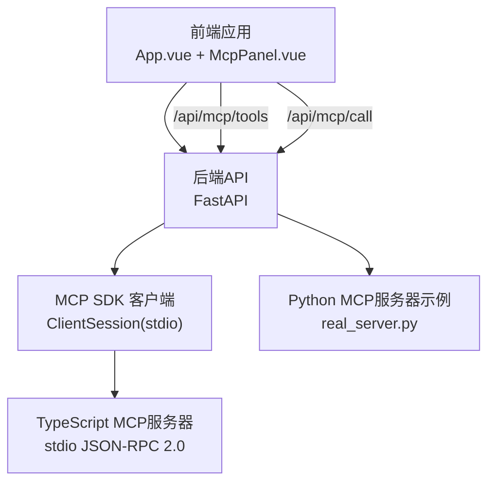
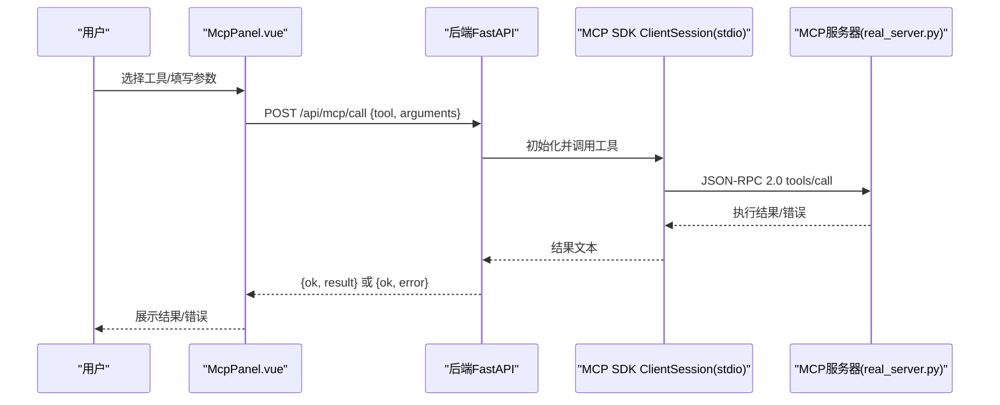
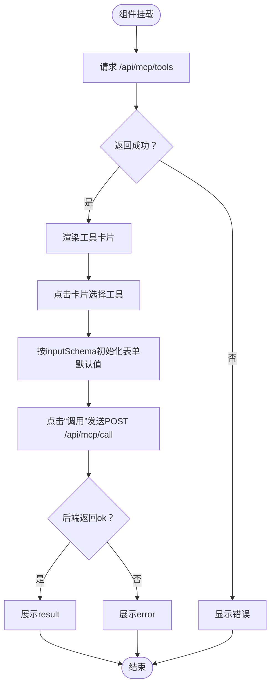
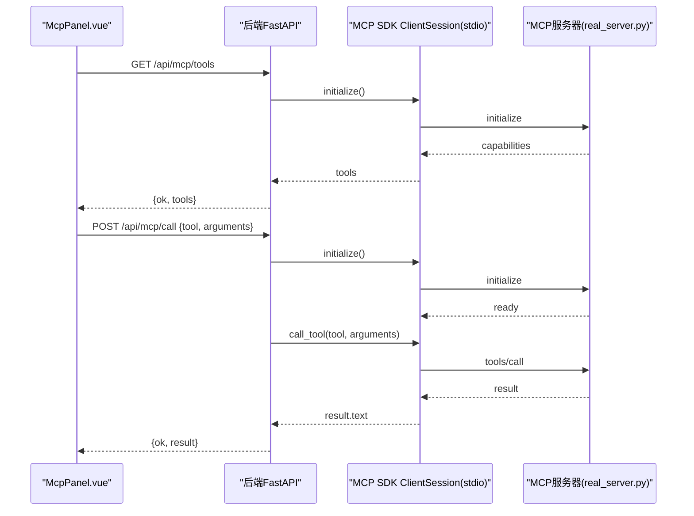
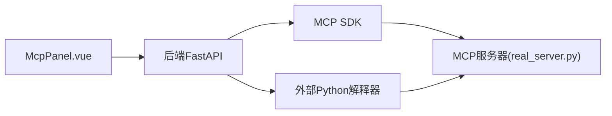

# MCP面板组件

<cite>
**本文档引用的文件**
- [McpPanel.vue](file://guardrails-sandbox/frontend/src/components/McpPanel.vue)
- [App.vue](file://guardrails-sandbox/frontend/src/App.vue)
- [main.py（后端）](file://guardrails-sandbox/backend/main.py)
- [phase_summary.py](file://guardrails-sandbox/backend/playground/modules/phase_summary.py)
- [lesson_search.py](file://guardrails-sandbox/backend/playground/modules/lesson_search.py)
- [cost_estimator.py](file://guardrails-sandbox/backend/playground/modules/cost_estimator.py)
- [main.py（MCP服务器+注册表）](file://phases/19-capstone-projects/13-mcp-server-with-registry/code/main.py)
- [README.md（TypeScript MCP服务器）](file://phases/19-capstone-projects/13-mcp-server-with-registry/code/ts/README.md)
- [index.ts（TypeScript MCP服务器入口）](file://phases/19-capstone-projects/13-mcp-server-with-registry/code/ts/src/index.ts)
- [real_server.py（示例MCP服务器）](file://phases/11-llm-engineering/14-model-context-protocol/code/real_server.py)
</cite>

## 目录
1. [引言](#引言)
2. [项目结构](#项目结构)
3. [核心组件](#核心组件)
4. [架构总览](#架构总览)
5. [详细组件分析](#详细组件分析)
6. [依赖分析](#依赖分析)
7. [性能考量](#性能考量)
8. [故障排查指南](#故障排查指南)
9. [结论](#结论)
10. [附录](#附录)

## 引言
本文件围绕MCP面板组件（McpPanel）进行系统化文档化，重点阐述其如何支持Model Context Protocol（MCP）的配置与调试能力，涵盖MCP服务器管理、工具注册、协议通信、传输层配置、资源管理与采样参数等特性。文档同时提供MCP服务器搭建指南、客户端连接配置与调试技巧，并总结协议规范遵循、安全考虑与性能监控方法。

## 项目结构
MCP面板位于前端Vue应用中，通过后端FastAPI接口与MCP服务器交互。后端提供统一的API路由，其中包含MCP工具列表与调用接口；前端McpPanel负责展示工具、收集参数并发起HTTP请求；示例MCP服务器位于课程代码目录中，演示基于stdio的JSON-RPC 2.0传输与工具执行。

图表来源
- [App.vue:123-169](file://guardrails-sandbox/frontend/src/App.vue#L123-L169)
- [McpPanel.vue:33-88](file://guardrails-sandbox/frontend/src/components/McpPanel.vue#L33-L88)
- [main.py（后端）:324-357](file://guardrails-sandbox/backend/main.py#L324-L357)
- [real_server.py（示例MCP服务器）](file://phases/11-llm-engineering/14-model-context-protocol/code/real_server.py)

章节来源
- [App.vue:123-169](file://guardrails-sandbox/frontend/src/App.vue#L123-L169)
- [McpPanel.vue:1-359](file://guardrails-sandbox/frontend/src/components/McpPanel.vue#L1-L359)
- [main.py（后端）:1-421](file://guardrails-sandbox/backend/main.py#L1-L421)

## 核心组件
- 前端MCP面板（McpPanel）
  - 功能：加载MCP工具清单、渲染工具卡片、根据工具输入模式生成表单、提交调用请求、展示结果或错误。
  - 关键流程：挂载时拉取工具列表；选择工具初始化表单默认值；点击“调用”发送POST请求至后端。
- 后端API（FastAPI）
  - 提供两个关键接口：
    - GET /api/mcp/tools：通过MCP SDK连接示例服务器，列举可用工具及其输入模式。
    - POST /api/mcp/call：通过MCP SDK调用指定工具，返回结果或错误。
  - 传输层：使用stdio客户端连接外部MCP服务器，遵循JSON-RPC 2.0。
- 示例MCP服务器（TypeScript/Python）
  - TypeScript版本：手写stdio JSON-RPC 2.0，提供三个模拟incident工具。
  - Python版本：示例real_server.py用于演示MCP服务器行为。

章节来源
- [McpPanel.vue:33-88](file://guardrails-sandbox/frontend/src/components/McpPanel.vue#L33-L88)
- [main.py（后端）:324-357](file://guardrails-sandbox/backend/main.py#L324-L357)
- [README.md（TypeScript MCP服务器）:1-30](file://phases/19-capstone-projects/13-mcp-server-with-registry/code/ts/README.md#L1-L30)
- [index.ts（TypeScript MCP服务器入口）:1-12](file://phases/19-capstone-projects/13-mcp-server-with-registry/code/ts/src/index.ts#L1-L12)
- [real_server.py（示例MCP服务器）](file://phases/11-llm-engineering/14-model-context-protocol/code/real_server.py)

## 架构总览
McpPanel通过后端API桥接到MCP SDK，SDK再通过stdio与外部MCP服务器建立JSON-RPC 2.0连接。工具清单与调用均经由后端转发，确保前端无需直接暴露服务器细节。

图表来源
- [McpPanel.vue:60-86](file://guardrails-sandbox/frontend/src/components/McpPanel.vue#L60-L86)
- [main.py（后端）:324-331](file://guardrails-sandbox/backend/main.py#L324-L331)
- [real_server.py（示例MCP服务器）](file://phases/11-llm-engineering/14-model-context-protocol/code/real_server.py)

## 详细组件分析

### 前端组件：McpPanel
- 数据结构
  - 工具列表：数组，每项包含名称、描述与输入模式（properties/required）。
  - 表单值：动态对象，键为参数名，值为用户输入。
- 处理逻辑
  - 加载工具：GET /api/mcp/tools，填充工具列表。
  - 选择工具：清空上次结果，按工具输入模式初始化表单默认值。
  - 调用工具：POST /api/mcp/call，等待后端返回结果或错误。
- 视图渲染
  - 工具卡片：名称与描述，支持选中态切换。
  - 输入表单：依据输入模式生成字符串/数值字段。
  - 结果区域：展示返回内容或错误信息；加载态显示旋转指示器。

图表来源
- [McpPanel.vue:33-88](file://guardrails-sandbox/frontend/src/components/McpPanel.vue#L33-L88)

章节来源
- [McpPanel.vue:1-359](file://guardrails-sandbox/frontend/src/components/McpPanel.vue#L1-L359)

### 后端API：MCP工具代理
- 工具列表接口
  - 使用MCP SDK的stdio客户端连接外部MCP服务器，调用initialize与list_tools，返回工具清单。
- 工具调用接口
  - 使用MCP SDK的initialize与call_tool，返回结果文本；异常捕获并回传错误。
- 传输层配置
  - 通过StdioServerParameters指定外部Python解释器与服务器脚本路径，实现跨进程stdio JSON-RPC 2.0。
- 资源管理
  - 采用同步包装函数在现有事件循环中安全运行协程，避免阻塞。
- 采样参数
  - 当前实现未显式注入采样参数；如需扩展，可在调用处增加参数传递与服务器侧解析。

图表来源
- [main.py（后端）:333-357](file://guardrails-sandbox/backend/main.py#L333-L357)
- [main.py（后端）:324-331](file://guardrails-sandbox/backend/main.py#L324-L331)
- [real_server.py（示例MCP服务器）](file://phases/11-llm-engineering/14-model-context-protocol/code/real_server.py)

章节来源
- [main.py（后端）:283-357](file://guardrails-sandbox/backend/main.py#L283-L357)

### 示例MCP服务器（TypeScript）
- 传输层
  - 自行实现stdio JSON-RPC 2.0，包含初始化、工具列表与工具调用消息处理。
- 工具集合
  - 提供三个模拟incident工具，便于理解工具注册与执行流程。
- 运行方式
  - 支持fixture演示与真实stdio循环两种启动模式。

章节来源
- [README.md（TypeScript MCP服务器）:1-30](file://phases/19-capstone-projects/13-mcp-server-with-registry/code/ts/README.md#L1-L30)
- [index.ts（TypeScript MCP服务器入口）:1-12](file://phases/19-capstone-projects/13-mcp-server-with-registry/code/ts/src/index.ts#L1-L12)

### 实验台工具（与MCP工具映射）
- 阶段概要（phase_summary）
  - 输入阶段号，列出该阶段课程，对应MCP的get_phase_summary。
- 课程搜索（lesson_search）
  - 在课程文档中搜索关键词，对应MCP的search_lessons。
- 成本估算（cost_estimator）
  - 输入模型、token量、请求频率，输出月度/年度成本，对应MCP的calculate_cost。

章节来源
- [phase_summary.py:1-68](file://guardrails-sandbox/backend/playground/modules/phase_summary.py#L1-L68)
- [lesson_search.py:1-132](file://guardrails-sandbox/backend/playground/modules/lesson_search.py#L1-L132)
- [cost_estimator.py:1-86](file://guardrails-sandbox/backend/playground/modules/cost_estimator.py#L1-L86)

## 依赖分析
- 组件耦合
  - 前端McpPanel仅依赖后端提供的两个API，耦合度低，便于替换后端实现。
  - 后端通过MCP SDK与外部服务器解耦，只需保持stdio JSON-RPC 2.0契约。
- 外部依赖
  - MCP SDK（ClientSession、stdio_client、StdioServerParameters）。
  - FastAPI（路由、响应模型）。
- 潜在环路
  - 无直接循环依赖；API路由与MCP服务器通过stdio异步通信。

图表来源
- [McpPanel.vue:60-86](file://guardrails-sandbox/frontend/src/components/McpPanel.vue#L60-L86)
- [main.py（后端）:324-331](file://guardrails-sandbox/backend/main.py#L324-L331)
- [real_server.py（示例MCP服务器）](file://phases/11-llm-engineering/14-model-context-protocol/code/real_server.py)

章节来源
- [McpPanel.vue:1-359](file://guardrails-sandbox/frontend/src/components/McpPanel.vue#L1-L359)
- [main.py（后端）:1-421](file://guardrails-sandbox/backend/main.py#L1-L421)

## 性能考量
- 传输层开销
  - stdio JSON-RPC 2.0具备较低协议开销，适合本地或内网部署；远程传输建议评估延迟与吞吐。
- 并发与阻塞
  - 后端使用同步包装函数在既有事件循环中运行协程，避免阻塞主线程；建议在高并发场景下引入连接池与超时控制。
- 结果缓存
  - 对于重复查询（如工具列表），可在后端实现短期缓存，减少SDK初始化与握手次数。
- 前端渲染
  - 大结果集建议分页或懒加载，避免长文本渲染造成UI卡顿。

## 故障排查指南
- 常见问题
  - 工具列表为空：确认后端连接的MCP服务器路径正确，且服务器已启动。
  - 调用报错：检查工具名是否匹配，参数类型是否符合inputSchema。
  - 连接失败：验证Python解释器路径与服务器脚本路径，确保权限与依赖可用。
- 调试技巧
  - 启用后端日志，观察SDK初始化与工具调用过程。
  - 使用TypeScript MCP服务器的fixture模式快速验证协议往返。
  - 在前端网络面板查看请求与响应体，定位错误来源。
- 安全建议
  - 限制工具调用范围，结合鉴权与策略门禁（参考注册表与策略门示例）。
  - 对输入参数进行严格校验，避免注入与越权操作。

章节来源
- [main.py（后端）:324-357](file://guardrails-sandbox/backend/main.py#L324-L357)
- [README.md（TypeScript MCP服务器）:1-30](file://phases/19-capstone-projects/13-mcp-server-with-registry/code/ts/README.md#L1-L30)

## 结论
McpPanel通过后端API与MCP SDK实现了对MCP协议的友好封装，前端仅需关注工具展示与参数收集，后端负责与外部MCP服务器的stdio JSON-RPC 2.0通信。该设计具备良好的可扩展性与可维护性，适合在生产环境中进一步增强安全与性能保障。

## 附录

### MCP服务器搭建指南
- 准备工作
  - 安装MCP SDK与所需依赖。
  - 准备Python解释器与服务器脚本路径。
- 启动步骤
  - 启动外部MCP服务器（示例：real_server.py）。
  - 配置后端API的StdioServerParameters，指向服务器脚本。
  - 启动后端服务，访问前端McpPanel进行调试。

章节来源
- [main.py（后端）:305-322](file://guardrails-sandbox/backend/main.py#L305-L322)
- [real_server.py（示例MCP服务器）](file://phases/11-llm-engineering/14-model-context-protocol/code/real_server.py)

### 客户端连接配置
- 前端
  - 通过GET /api/mcp/tools获取工具清单，POST /api/mcp/call调用工具。
- 后端
  - 使用ClientSession与stdio_client建立连接，确保initialize与call_tool调用顺序正确。

章节来源
- [McpPanel.vue:33-88](file://guardrails-sandbox/frontend/src/components/McpPanel.vue#L33-L88)
- [main.py（后端）:333-357](file://guardrails-sandbox/backend/main.py#L333-L357)

### 协议规范遵循与安全考虑
- 规范遵循
  - 采用JSON-RPC 2.0与MCP协议约定的消息格式与生命周期（initialize、tools/list、tools/call）。
- 安全考虑
  - 策略门禁与审计日志（参考注册表与策略门示例），对工具调用进行授权与记录。
  - 输入参数校验与最小权限原则，避免破坏性工具被滥用。

章节来源
- [main.py（MCP服务器+注册表）:126-144](file://phases/19-capstone-projects/13-mcp-server-with-registry/code/main.py#L126-L144)
- [README.md（TypeScript MCP服务器）:1-30](file://phases/19-capstone-projects/13-mcp-server-with-registry/code/ts/README.md#L1-L30)