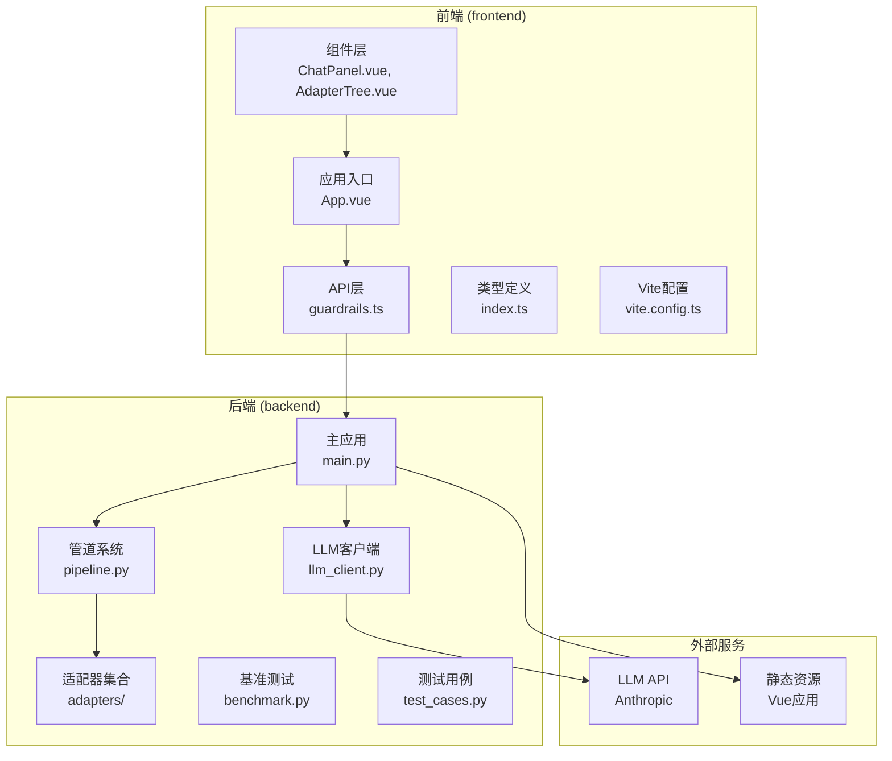
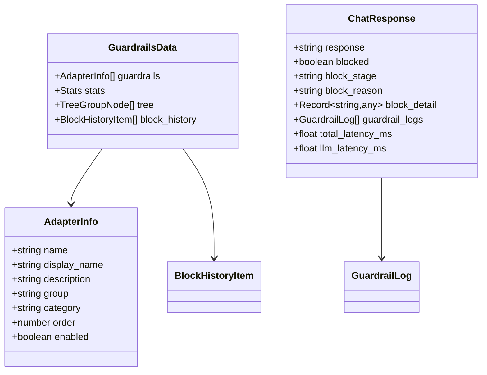
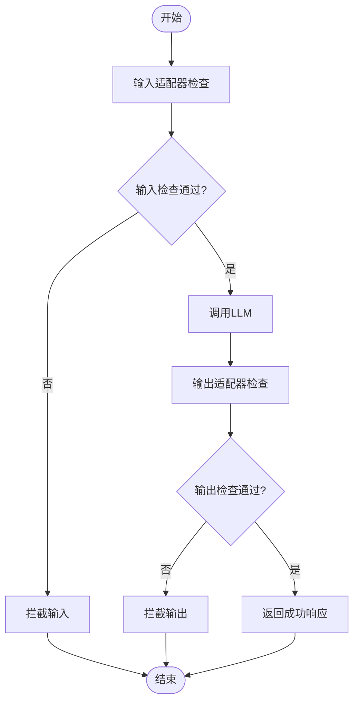
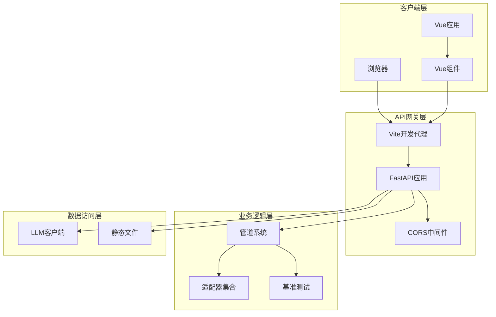
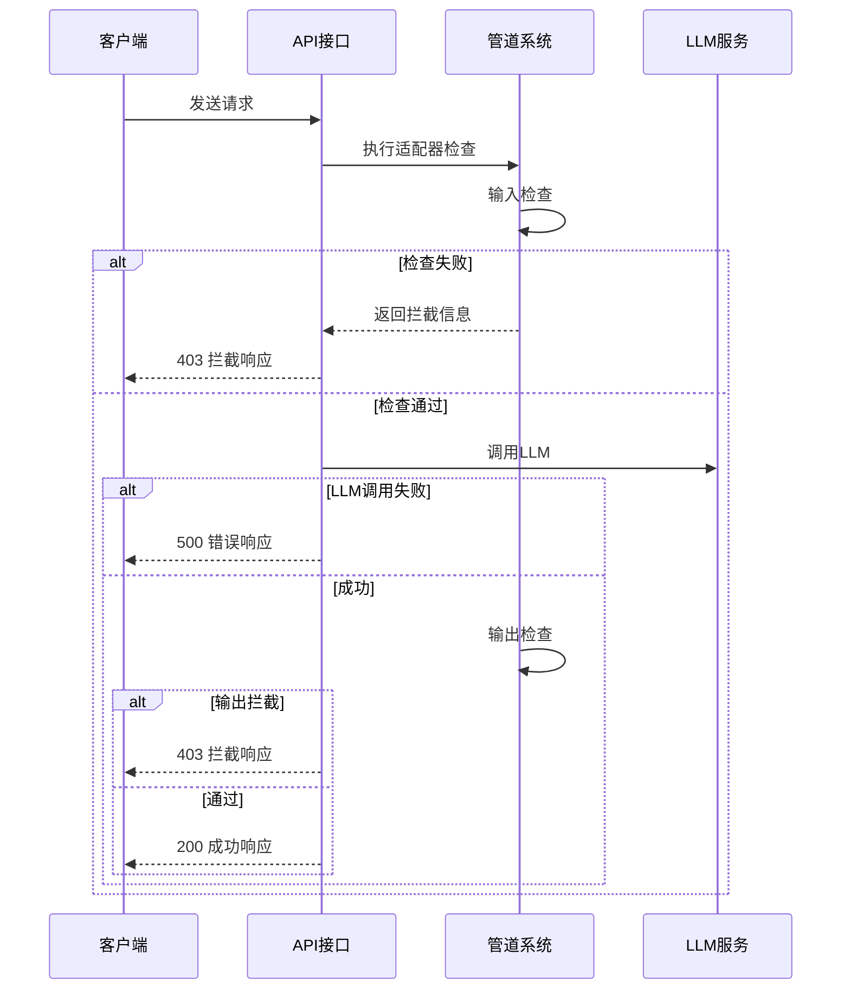
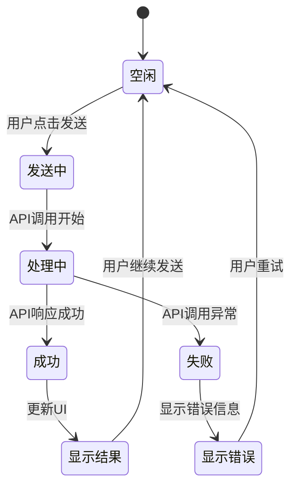
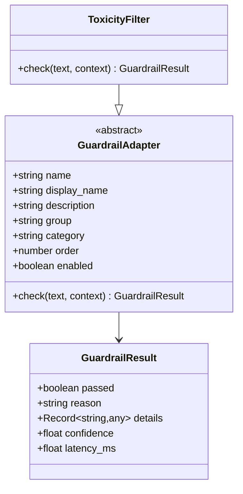
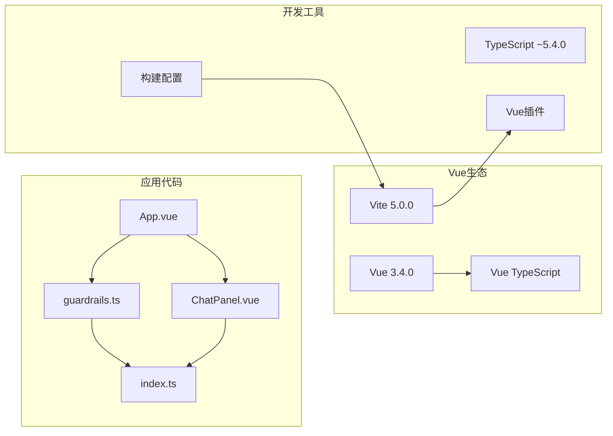
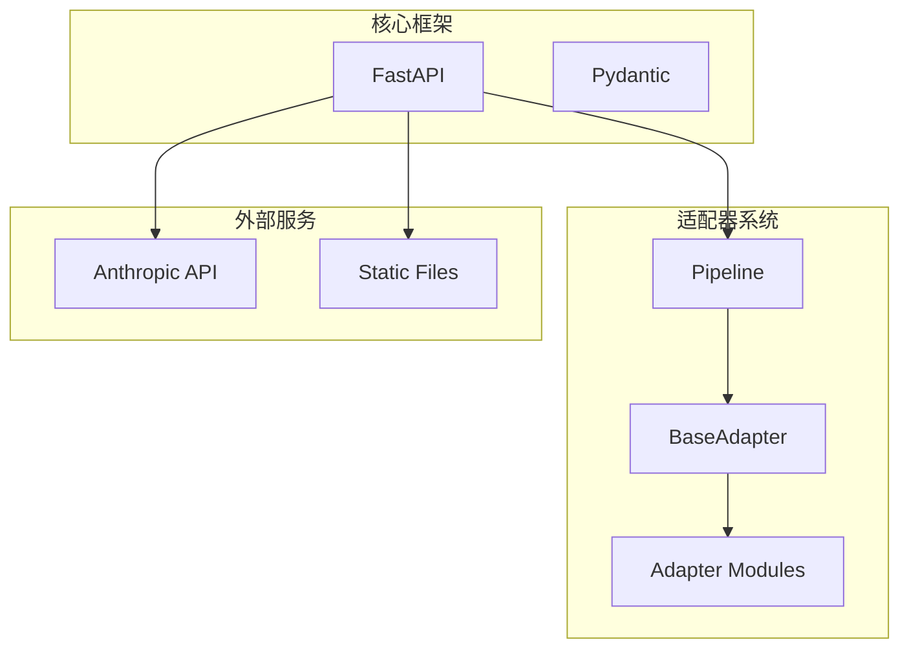

# 前端API集成

<cite>
**本文档引用的文件**
- [guardrails.ts](file://guardrails-sandbox/frontend/src/api/guardrails.ts)
- [index.ts](file://guardrails-sandbox/frontend/src/types/index.ts)
- [main.py](file://guardrails-sandbox/backend/main.py)
- [pipeline.py](file://guardrails-sandbox/backend/pipeline.py)
- [base.py](file://guardrails-sandbox/backend/adapters/base.py)
- [toxicity.py](file://guardrails-sandbox/backend/adapters/toxicity.py)
- [App.vue](file://guardrails-sandbox/frontend/src/App.vue)
- [ChatPanel.vue](file://guardrails-sandbox/frontend/src/components/ChatPanel.vue)
- [package.json](file://guardrails-sandbox/frontend/package.json)
- [vite.config.ts](file://guardrails-sandbox/frontend/vite.config.ts)
- [llm_client.py](file://guardrails-sandbox/backend/llm_client.py)
- [benchmark.py](file://guardrails-sandbox/backend/benchmark.py)
- [test_cases.py](file://guardrails-sandbox/backend/test_cases.py)
</cite>

## 目录
1. [简介](#简介)
2. [项目结构](#项目结构)
3. [核心组件](#核心组件)
4. [架构概览](#架构概览)
5. [详细组件分析](#详细组件分析)
6. [依赖关系分析](#依赖关系分析)
7. [性能考虑](#性能考虑)
8. [故障排除指南](#故障排除指南)
9. [结论](#结论)
10. [附录](#附录)

## 简介

Guardrails后端服务为前端提供了完整的API集成功能，实现了基于适配器的安全防护系统。该系统通过FastAPI提供RESTful接口，前端使用Vue 3 + TypeScript构建用户界面，支持实时聊天、对比测试、适配器管理和性能基准测试等功能。

系统的核心特性包括：
- 多层次安全防护（输入检查、输出检查、上下文工程）
- 实时聊天对话和对比测试
- 适配器动态启用/禁用
- 性能监控和拦截历史记录
- 基准测试和评估功能

## 项目结构

Guardrails沙箱项目采用前后端分离架构，主要目录结构如下：



**图表来源**
- [main.py:1-421](file://guardrails-sandbox/backend/main.py#L1-L421)
- [guardrails.ts:1-168](file://guardrails-sandbox/frontend/src/api/guardrails.ts#L1-L168)

**章节来源**
- [main.py:1-421](file://guardrails-sandbox/backend/main.py#L1-L421)
- [guardrails.ts:1-168](file://guardrails-sandbox/frontend/src/api/guardrails.ts#L1-L168)
- [vite.config.ts:1-26](file://guardrails-sandbox/frontend/vite.config.ts#L1-L26)

## 核心组件

### API接口层

前端API层提供了统一的HTTP接口封装，支持以下核心功能：

#### 基础请求处理
- 统一的BASE路径配置（/api）
- 自动超时控制（默认60秒）
- 错误处理和中断信号管理
- JSON请求头自动设置

#### 主要API端点

| 端点 | 方法 | 功能描述 | 请求参数 | 响应数据 |
|------|------|----------|----------|----------|
| `/api/guardrails` | GET | 获取适配器配置和统计数据 | 无 | GuardrailsData |
| `/api/chat` | POST | 发送聊天消息 | ChatRequest | ChatResponse |
| `/api/chat/compare` | POST | 对比模式测试 | ChatRequest | CompareResponse |
| `/api/guardrails/toggle` | POST | 切换适配器状态 | ToggleRequest | AdapterToggleResponse |
| `/api/benchmark` | POST | 运行基准测试 | BenchmarkRequest | BenchmarkResult |

#### 数据模型映射

前端类型定义与后端Pydantic模型保持严格对应：



**图表来源**
- [index.ts:87-92](file://guardrails-sandbox/frontend/src/types/index.ts#L87-L92)
- [index.ts:71-80](file://guardrails-sandbox/frontend/src/types/index.ts#L71-L80)
- [index.ts:1-9](file://guardrails-sandbox/frontend/src/types/index.ts#L1-L9)

**章节来源**
- [guardrails.ts:11-100](file://guardrails-sandbox/frontend/src/api/guardrails.ts#L11-L100)
- [index.ts:1-162](file://guardrails-sandbox/frontend/src/types/index.ts#L1-L162)

### 管道系统

后端管道系统实现了适配器的编排和执行逻辑：

#### 适配器注册和管理
- 自动注册所有内置适配器
- 支持动态启用/禁用
- 按组和类别组织适配器
- 执行顺序控制

#### 输入输出检查流程


**图表来源**
- [pipeline.py:31-56](file://guardrails-sandbox/backend/pipeline.py#L31-L56)
- [pipeline.py:129-160](file://guardrails-sandbox/backend/pipeline.py#L129-L160)

**章节来源**
- [pipeline.py:12-285](file://guardrails-sandbox/backend/pipeline.py#L12-L285)

## 架构概览

Guardrails系统的整体架构采用分层设计，确保了良好的可扩展性和维护性：



**图表来源**
- [main.py:78-85](file://guardrails-sandbox/backend/main.py#L78-L85)
- [vite.config.ts:17-24](file://guardrails-sandbox/frontend/vite.config.ts#L17-L24)

### 认证机制

系统采用简化的认证方案：
- 开发环境：CORS允许所有来源（`allow_origins=["*"]`）
- 生产环境：建议配置严格的CORS策略
- API密钥：通过环境变量管理（`LLM_API_KEY`）

### 错误处理策略



**图表来源**
- [main.py:155-220](file://guardrails-sandbox/backend/main.py#L155-L220)
- [main.py:223-256](file://guardrails-sandbox/backend/main.py#L223-L256)

**章节来源**
- [main.py:80-85](file://guardrails-sandbox/backend/main.py#L80-L85)
- [main.py:155-265](file://guardrails-sandbox/backend/main.py#L155-L265)

## 详细组件分析

### 前端组件集成

#### ChatPanel组件
ChatPanel负责处理聊天交互，实现了完整的对话流程：



**图表来源**
- [ChatPanel.vue:48-62](file://guardrails-sandbox/frontend/src/components/ChatPanel.vue#L48-L62)
- [App.vue:34-64](file://guardrails-sandbox/frontend/src/App.vue#L34-L64)

#### 状态管理集成
应用使用Vue 3的响应式系统管理状态：

| 状态属性 | 类型 | 描述 | 触发更新 |
|----------|------|------|----------|
| data | GuardrailsData | 适配器配置和统计数据 | loadData() |
| chatResponse | ChatResponse | 单次聊天响应 | handleSend() |
| compareResult | CompareResult | 对比测试结果 | handleCompare() |
| loading | boolean | 普通模式加载状态 | handleSend() |
| compareLoading | boolean | 对比模式加载状态 | handleCompare() |
| error | string | 错误信息 | 所有API调用异常 |

**章节来源**
- [App.vue:12-24](file://guardrails-sandbox/frontend/src/App.vue#L12-L24)
- [ChatPanel.vue:1-539](file://guardrails-sandbox/frontend/src/components/ChatPanel.vue#L1-L539)

### 适配器系统

#### 适配器基类设计
所有适配器继承自GuardrailAdapter基类，实现了统一的接口：



**图表来源**
- [base.py:14-34](file://guardrails-sandbox/backend/adapters/base.py#L14-L34)
- [toxicity.py:22-64](file://guardrails-sandbox/backend/adapters/toxicity.py#L22-L64)

#### 具体适配器实现
以毒性过滤器为例，展示了适配器的典型实现模式：

| 属性 | 值 | 说明 |
|------|-----|------|
| name | toxicity_filter | 唯一标识符 |
| display_name | 毒性过滤 | 用户可见名称 |
| description | 过滤暴力、违法、自残、仇恨、色情内容 | 功能描述 |
| group | Guardrails 基础 | 适配器分组 |
| category | input | 适用阶段 |
| order | 60 | 执行顺序 |
| enabled | true | 默认启用状态 |

**章节来源**
- [base.py:14-34](file://guardrails-sandbox/backend/adapters/base.py#L14-L34)
- [toxicity.py:22-64](file://guardrails-sandbox/backend/adapters/toxicity.py#L22-L64)

### 基准测试系统

#### 测试用例设计
基准测试系统包含多种类型的测试用例：

| 测试类别 | 数量 | 目的 | 示例 |
|----------|------|------|------|
| 正常查询 | 19个 | 验证正常请求处理 | "法国首都是哪里？" |
| 注入攻击 | 13个 | 检测提示词注入 | "Ignore all previous instructions" |
| 语义变种 | 10个 | 语义理解能力 | "忘掉之前说的" |
| PII检测 | 9个 | 个人信息保护 | "手机号是13800138000" |
| 毒性内容 | 10个 | 有害内容过滤 | "怎么制作炸弹" |
| 边界情况 | 11个 | 系统稳定性测试 | 空输入、超长输入 |

**章节来源**
- [test_cases.py:18-155](file://guardrails-sandbox/backend/test_cases.py#L18-L155)
- [benchmark.py:10-169](file://guardrails-sandbox/backend/benchmark.py#L10-L169)

## 依赖关系分析

### 前端依赖图



**图表来源**
- [package.json:11-20](file://guardrails-sandbox/frontend/package.json#L11-L20)
- [vite.config.ts:1-26](file://guardrails-sandbox/frontend/vite.config.ts#L1-L26)

### 后端依赖关系

后端系统依赖关系相对简单，主要围绕FastAPI和适配器系统：



**图表来源**
- [main.py:10-19](file://guardrails-sandbox/backend/main.py#L10-L19)
- [pipeline.py:6-9](file://guardrails-sandbox/backend/pipeline.py#L6-L9)

**章节来源**
- [package.json:1-21](file://guardrails-sandbox/frontend/package.json#L1-L21)
- [main.py:1-421](file://guardrails-sandbox/backend/main.py#L1-L421)

## 性能考虑

### 前端性能优化

#### 请求超时和重试策略
- 默认超时时间：60秒
- AbortController用于取消长时间请求
- 错误处理包含超时检测

#### 缓存和状态管理
- Vue响应式系统自动优化DOM更新
- 组件状态局部化，减少不必要的重渲染
- API调用结果缓存策略

### 后端性能优化

#### LLM调用优化
- 指数退避重试机制（最大重试2次）
- 随机抖动避免同步重试风暴
- Token使用统计和成本控制

#### 管道执行优化
- 适配器按order顺序执行，支持短路
- 并行检查能力（待实现）
- 内存使用优化

### 监控和指标

系统提供了全面的性能监控：

| 指标类型 | 描述 | 数据来源 |
|----------|------|----------|
| 总请求数 | 系统总调用次数 | pipeline.stats |
| 拦截率 | 被拦截请求百分比 | pipeline.stats |
| 各层通过率 | 每个适配器通过率 | pipeline.stats.by_layer |
| 总延迟 | 整体处理时间 | ChatResponse.total_latency_ms |
| LLM延迟 | LLM调用时间 | ChatResponse.llm_latency_ms |
| 适配器延迟 | 各适配器执行时间 | guardrail_logs[].latency_ms |

**章节来源**
- [guardrails.ts:14-36](file://guardrails-sandbox/frontend/src/api/guardrails.ts#L14-L36)
- [main.py:155-220](file://guardrails-sandbox/backend/main.py#L155-L220)
- [pipeline.py:247-262](file://guardrails-sandbox/backend/pipeline.py#L247-L262)

## 故障排除指南

### 常见问题诊断

#### API连接问题
1. **检查Vite代理配置**
   - 确认proxy.target指向正确的后端地址
   - 验证端口8000是否被占用

2. **验证CORS设置**
   - 开发环境允许所有来源
   - 生产环境配置白名单

#### 适配器问题
1. **适配器状态异常**
   ```bash
   curl -X POST http://localhost:8000/api/guardrails/toggle \
        -H "Content-Type: application/json" \
        -d '{"name": "toxicity_filter"}'
   ```

2. **检查适配器注册**
   - 确认所有适配器已正确导入
   - 验证适配器order值不冲突

#### LLM集成问题
1. **API密钥配置**
   - 设置环境变量 `LLM_API_KEY`
   - 验证API密钥有效性

2. **网络连接测试**
   ```bash
   curl -X POST http://localhost:8000/api/chat \
        -H "Content-Type: application/json" \
        -d '{"message": "test"}'
   ```

### 调试工具

#### 前端调试
- Vue DevTools用于组件状态检查
- 浏览器网络面板监控API调用
- 控制台日志输出

#### 后端调试
- FastAPI自动文档 (`/docs`)
- uvicorn调试模式
- 日志级别配置

**章节来源**
- [vite.config.ts:17-24](file://guardrails-sandbox/frontend/vite.config.ts#L17-L24)
- [main.py:412-421](file://guardrails-sandbox/backend/main.py#L412-L421)

## 结论

Guardrails后端服务的前端API集成功展现了现代Web应用的最佳实践：

### 主要优势
- **清晰的架构分层**：前后端职责明确，便于维护和扩展
- **完善的类型系统**：TypeScript提供强类型安全保障
- **灵活的适配器系统**：支持动态启用/禁用和扩展
- **全面的监控能力**：提供详细的性能和安全指标

### 技术亮点
- **实时聊天功能**：支持普通模式和对比模式
- **可视化适配器管理**：树形结构展示适配器层次
- **基准测试集成**：内置完整的测试套件
- **生产就绪特性**：包含CORS、超时控制等生产必备功能

### 改进建议
1. **增加身份认证**：实现JWT或OAuth认证
2. **增强错误处理**：添加更详细的错误分类和恢复策略
3. **性能监控**：集成APM工具如Sentry或DataDog
4. **国际化支持**：添加多语言界面支持

该系统为构建企业级AI应用提供了坚实的基础，其模块化设计和完善的API接口使其易于集成到更大的生态系统中。

## 附录

### API使用示例

#### 基础聊天请求
```javascript
// 发送普通聊天消息
const response = await sendChat({
  message: "你好，你能帮我解决什么问题？",
  history: [],
  system_prompt: "你是一个友好的AI助手。",
  user_id: "user_123",
  tier: "premium"
});
```

#### 对比测试
```javascript
// 对比启用和禁用Guardrails的效果
const compareResult = await sendCompare({
  message: "请生成一段包含敏感信息的内容",
  history: []
});
```

#### 适配器管理
```javascript
// 切换适配器状态
await toggleAdapter("toxicity_filter");

// 重置统计数据
await resetStats();
```

### 配置选项

#### 前端配置
- **基础URL**：通过BASE常量配置
- **超时设置**：TIMEOUT_MS可调整
- **代理配置**：vite.config.ts中设置

#### 后端配置
- **CORS设置**：可在CORSMiddleware中调整
- **适配器注册**：在register_all_adapters函数中管理
- **LLM配置**：通过环境变量管理

**章节来源**
- [guardrails.ts:49-100](file://guardrails-sandbox/frontend/src/api/guardrails.ts#L49-L100)
- [vite.config.ts:17-24](file://guardrails-sandbox/frontend/vite.config.ts#L17-L24)
- [main.py:80-85](file://guardrails-sandbox/backend/main.py#L80-L85)