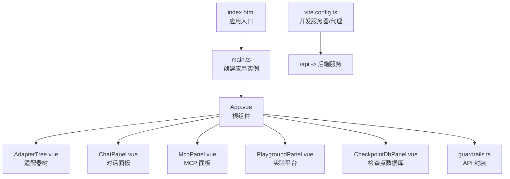
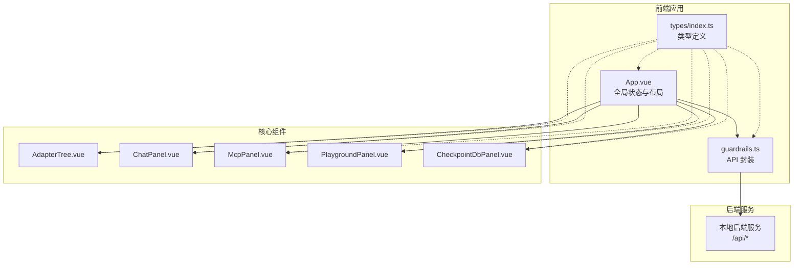
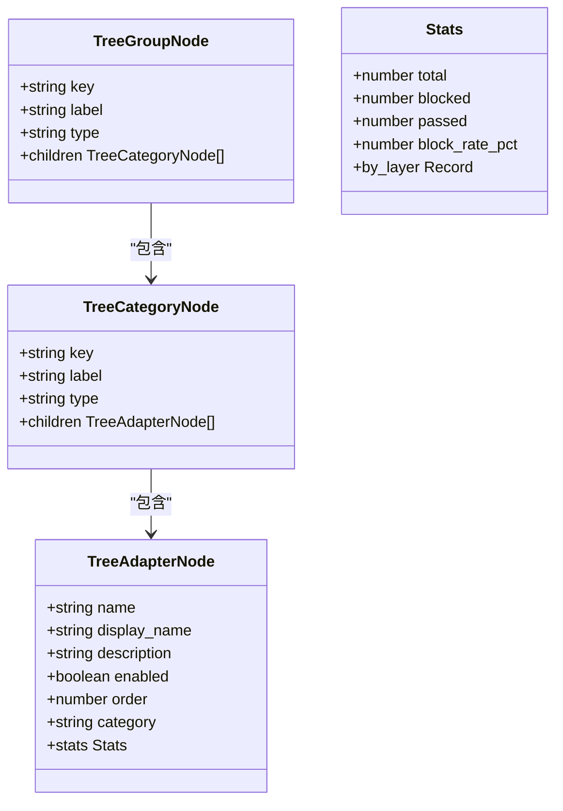
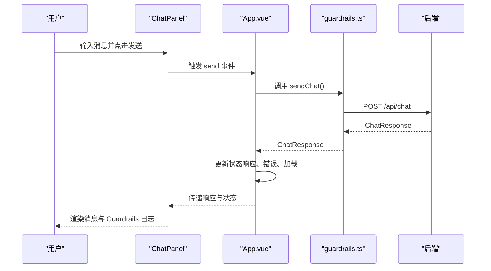
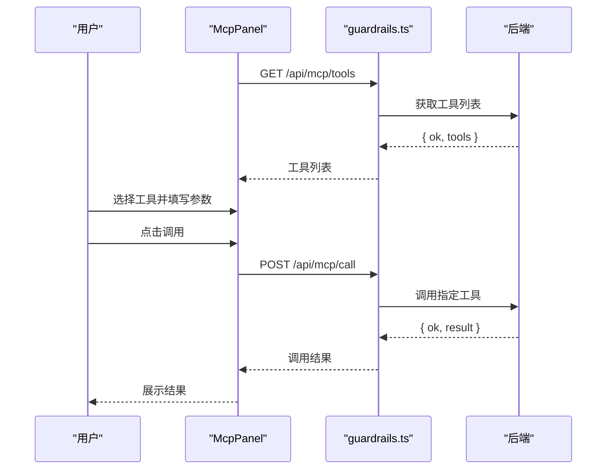
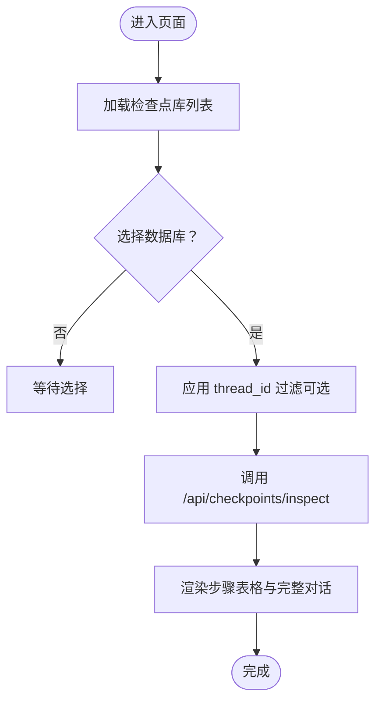
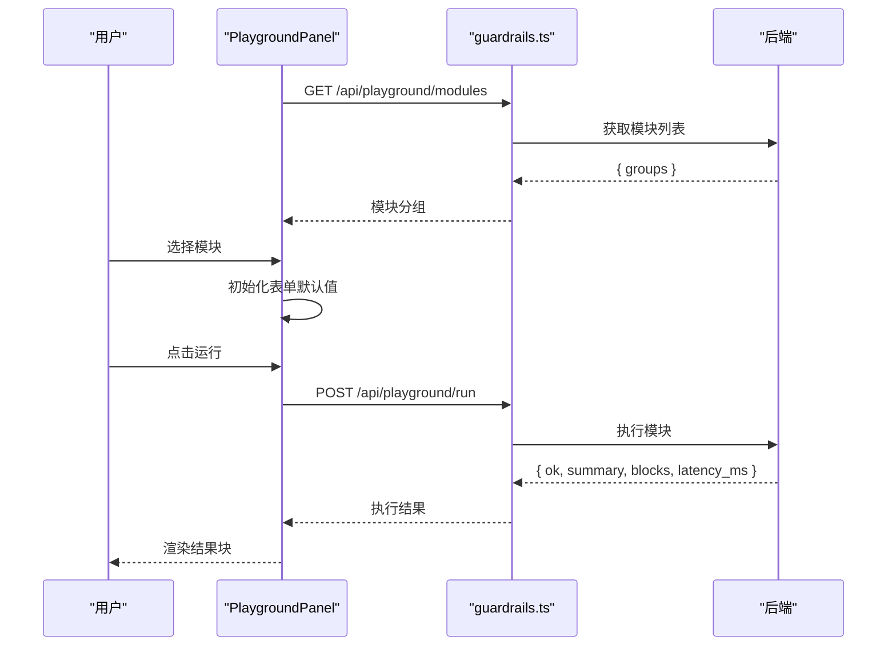
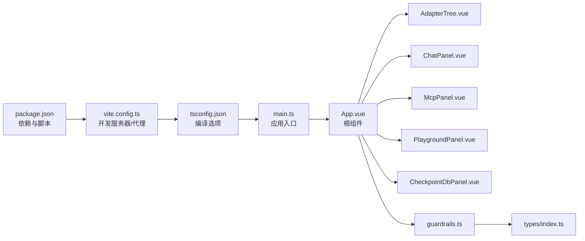

# 前端用户界面

<cite>
**本文档引用的文件**
- [App.vue](file://guardrails-sandbox/frontend/src/App.vue)
- [main.ts](file://guardrails-sandbox/frontend/src/main.ts)
- [index.ts](file://guardrails-sandbox/frontend/src/types/index.ts)
- [guardrails.ts](file://guardrails-sandbox/frontend/src/api/guardrails.ts)
- [AdapterTree.vue](file://guardrails-sandbox/frontend/src/components/AdapterTree.vue)
- [ChatPanel.vue](file://guardrails-sandbox/frontend/src/components/ChatPanel.vue)
- [CheckpointDbPanel.vue](file://guardrails-sandbox/frontend/src/components/CheckpointDbPanel.vue)
- [McpPanel.vue](file://guardrails-sandbox/frontend/src/components/McpPanel.vue)
- [PlaygroundPanel.vue](file://guardrails-sandbox/frontend/src/components/PlaygroundPanel.vue)
- [package.json](file://guardrails-sandbox/frontend/package.json)
- [vite.config.ts](file://guardrails-sandbox/frontend/vite.config.ts)
- [tsconfig.json](file://guardrails-sandbox/frontend/tsconfig.json)
- [tsconfig.node.json](file://guardrails-sandbox/frontend/tsconfig.node.json)
- [index.html](file://guardrails-sandbox/frontend/index.html)
</cite>

## 目录
1. [简介](#简介)
2. [项目结构](#项目结构)
3. [核心组件](#核心组件)
4. [架构总览](#架构总览)
5. [详细组件分析](#详细组件分析)
6. [依赖关系分析](#依赖关系分析)
7. [性能考虑](#性能考虑)
8. [故障排除指南](#故障排除指南)
9. [结论](#结论)
10. [附录](#附录)

## 简介
本项目为“AI 工程学习实验台”的前端用户界面，采用 Vue 3 + TypeScript 构建，提供现代化的实验与调试能力。界面围绕四大核心功能模块展开：
- 适配器树组件（AdapterTree）：可视化展示与管理防护墙适配器，支持开关控制、统计信息与批量操作
- 对话面板（ChatPanel）：与 LLM 交互，支持普通模式与对比模式，展示 Guardrails 检测日志
- 检查点数据库面板（CheckpointDbPanel）：查看与回放 LangGraph SQLite 检查点数据
- MCP 面板（McpPanel）：工具协议配置与调试，支持 schema 驱动的工具调用
- 实验平台面板（PlaygroundPanel）：访问课程实验模块，提供可配置的输入表单与结果渲染

前端通过统一的 API 层与后端交互，使用 Vite 进行开发与构建，并通过代理将 /api 请求转发至本地后端服务。

## 项目结构
前端项目位于 guardrails-sandbox/frontend 目录，采用典型的 Vue 3 单页应用结构：
- src/api：封装与后端的 HTTP 交互
- src/components：四大核心组件与辅助组件
- src/types：TypeScript 类型定义
- src/main.ts：应用入口
- public/index.html：HTML 模板
- vite.config.ts：Vite 开发服务器与构建配置
- package.json：依赖与脚本

**图表来源**
- [index.html:1-13](file://guardrails-sandbox/frontend/index.html#L1-L13)
- [main.ts:1-5](file://guardrails-sandbox/frontend/src/main.ts#L1-L5)
- [App.vue:1-300](file://guardrails-sandbox/frontend/src/App.vue#L1-L300)
- [guardrails.ts:1-168](file://guardrails-sandbox/frontend/src/api/guardrails.ts#L1-L168)
- [vite.config.ts:1-26](file://guardrails-sandbox/frontend/vite.config.ts#L1-L26)

**章节来源**
- [package.json:1-21](file://guardrails-sandbox/frontend/package.json#L1-L21)
- [vite.config.ts:1-26](file://guardrails-sandbox/frontend/vite.config.ts#L1-L26)
- [index.html:1-13](file://guardrails-sandbox/frontend/index.html#L1-L13)

## 核心组件
本节概述四大核心组件的功能职责与交互方式：

- 适配器树组件（AdapterTree）
  - 功能：以树形结构展示适配器分组、类别与具体适配器，支持展开/折叠、开关控制、统计信息展示与批量基准测试
  - 关键特性：悬浮提示（含实现机制、业务影响、适用场景）、统计面板、批量操作按钮
  - 交互：通过事件向上抛出 toggle/reset/benchmark，由父组件统一处理

- 对话面板（ChatPanel）
  - 功能：与 LLM 交互，支持普通模式与对比模式，展示 Guardrails 检测日志与拦截原因
  - 关键特性：消息历史渲染、拦截横幅、检测日志列表、对比结果网格、加载与错误状态
  - 交互：通过事件向上抛出 send/compare，父组件负责调用 API 并更新状态

- MCP 面板（McpPanel）
  - 功能：展示可用工具列表，根据工具 schema 自动生成表单，发起工具调用并展示结果
  - 关键特性：schema 驱动的表单生成、工具选择卡片、调用结果预览
  - 交互：选择工具后初始化表单，点击调用后通过 /api/mcp/* 接口与后端通信

- 检查点数据库面板（CheckpointDbPanel）
  - 功能：读取预置的 SQLite 检查点库，展示每一步检查点与完整对话回放
  - 关键特性：数据库选择、thread_id 过滤、步骤表格、完整对话流、只读模式
  - 交互：选择数据库与过滤条件后刷新，展示解码后的消息内容

- 实验平台面板（PlaygroundPanel）
  - 功能：按阶段分组展示课程实验模块，提供 schema 驱动的输入表单与多种结果块渲染
  - 关键特性：模块导航、示例填充（Tab）、快捷键运行（Enter/Cmd/Ctrl+Enter）、结果块渲染器
  - 交互：选择模块后生成表单，点击运行后调用 /api/playground/* 接口

**章节来源**
- [AdapterTree.vue:1-716](file://guardrails-sandbox/frontend/src/components/AdapterTree.vue#L1-L716)
- [ChatPanel.vue:1-539](file://guardrails-sandbox/frontend/src/components/ChatPanel.vue#L1-L539)
- [McpPanel.vue:1-359](file://guardrails-sandbox/frontend/src/components/McpPanel.vue#L1-L359)
- [CheckpointDbPanel.vue:1-381](file://guardrails-sandbox/frontend/src/components/CheckpointDbPanel.vue#L1-L381)
- [PlaygroundPanel.vue:1-363](file://guardrails-sandbox/frontend/src/components/PlaygroundPanel.vue#L1-L363)

## 架构总览
前端采用组件化架构，根组件 App.vue 负责全局状态与路由式布局（Tab 切换），四大核心组件分别承担不同领域的交互职责。API 层集中封装请求逻辑，统一处理超时与错误。

**图表来源**
- [App.vue:1-300](file://guardrails-sandbox/frontend/src/App.vue#L1-L300)
- [guardrails.ts:1-168](file://guardrails-sandbox/frontend/src/api/guardrails.ts#L1-L168)
- [index.ts:1-162](file://guardrails-sandbox/frontend/src/types/index.ts#L1-L162)

**章节来源**
- [App.vue:1-300](file://guardrails-sandbox/frontend/src/App.vue#L1-L300)
- [guardrails.ts:1-168](file://guardrails-sandbox/frontend/src/api/guardrails.ts#L1-L168)

## 详细组件分析

### 适配器树组件（AdapterTree）分析
- 数据结构：树形节点包括 Group、Category、Adapter 三类，支持统计信息与启用状态
- 交互流程：鼠标悬停显示工具提示，包含实现机制、业务影响、适用场景与统计；点击开关触发 toggle 事件
- 视觉设计：深色主题，统计面板突出拦截率与总量；分组可折叠，子项带图标与排序标识

**图表来源**
- [index.ts:17-49](file://guardrails-sandbox/frontend/src/types/index.ts#L17-L49)
- [AdapterTree.vue:1-716](file://guardrails-sandbox/frontend/src/components/AdapterTree.vue#L1-L716)

**章节来源**
- [AdapterTree.vue:1-716](file://guardrails-sandbox/frontend/src/components/AdapterTree.vue#L1-L716)
- [index.ts:1-162](file://guardrails-sandbox/frontend/src/types/index.ts#L1-L162)

### 对话面板（ChatPanel）分析
- 功能要点：支持普通模式与对比模式，展示 Guardrails 日志与拦截详情；提供清空聊天、发送与对比发送
- 用户体验：消息气泡区分角色，拦截时显示横幅与原因；对比模式左右分栏对比有无 Guardrails 的结果
- 键盘交互：普通模式 Enter 发送，对比模式 Enter 对比发送；Shift+Enter 允许在多行输入框中换行

**图表来源**
- [ChatPanel.vue:1-539](file://guardrails-sandbox/frontend/src/components/ChatPanel.vue#L1-L539)
- [App.vue:34-64](file://guardrails-sandbox/frontend/src/App.vue#L34-L64)
- [guardrails.ts:49-66](file://guardrails-sandbox/frontend/src/api/guardrails.ts#L49-L66)

**章节来源**
- [ChatPanel.vue:1-539](file://guardrails-sandbox/frontend/src/components/ChatPanel.vue#L1-L539)
- [App.vue:34-64](file://guardrails-sandbox/frontend/src/App.vue#L34-L64)
- [guardrails.ts:49-66](file://guardrails-sandbox/frontend/src/api/guardrails.ts#L49-L66)

### MCP 面板（McpPanel）分析
- 工具发现：首次挂载时拉取工具列表，基于工具 schema 自动生成表单字段
- 调用流程：选择工具后初始化表单默认值，点击调用后通过 /api/mcp/call 发起请求，展示返回结果
- 错误处理：网络异常与后端错误均以错误消息形式展示

**图表来源**
- [McpPanel.vue:1-359](file://guardrails-sandbox/frontend/src/components/McpPanel.vue#L1-L359)
- [guardrails.ts:1-168](file://guardrails-sandbox/frontend/src/api/guardrails.ts#L1-L168)

**章节来源**
- [McpPanel.vue:1-359](file://guardrails-sandbox/frontend/src/components/McpPanel.vue#L1-L359)
- [guardrails.ts:1-168](file://guardrails-sandbox/frontend/src/api/guardrails.ts#L1-L168)

### 检查点数据库面板（CheckpointDbPanel）分析
- 数据源：读取预置的 SQLite 检查点库，支持选择数据库与 thread_id 过滤
- 展示内容：每一步检查点表格（索引、thread_id、checkpoint_id、消息数、最后消息摘要）与完整对话回放
- 安全性：以只读模式打开数据库，确保不会修改外部文件

**图表来源**
- [CheckpointDbPanel.vue:1-381](file://guardrails-sandbox/frontend/src/components/CheckpointDbPanel.vue#L1-L381)
- [guardrails.ts:155-167](file://guardrails-sandbox/frontend/src/api/guardrails.ts#L155-L167)

**章节来源**
- [CheckpointDbPanel.vue:1-381](file://guardrails-sandbox/frontend/src/components/CheckpointDbPanel.vue#L1-L381)
- [guardrails.ts:155-167](file://guardrails-sandbox/frontend/src/api/guardrails.ts#L155-L167)

### 实验平台面板（PlaygroundPanel）分析
- 模块发现：加载按阶段分组的实验模块，每个模块带有输入 schema
- 表单生成：根据 schema 动态生成表单字段，支持示例填充（Tab 快捷键）
- 运行流程：点击运行后调用 /api/playground/run，根据返回的渲染块类型进行多样化展示

**图表来源**
- [PlaygroundPanel.vue:1-363](file://guardrails-sandbox/frontend/src/components/PlaygroundPanel.vue#L1-L363)
- [guardrails.ts:104-116](file://guardrails-sandbox/frontend/src/api/guardrails.ts#L104-L116)

**章节来源**
- [PlaygroundPanel.vue:1-363](file://guardrails-sandbox/frontend/src/components/PlaygroundPanel.vue#L1-L363)
- [guardrails.ts:104-116](file://guardrails-sandbox/frontend/src/api/guardrails.ts#L104-L116)

## 依赖关系分析
- 构建工具：Vite 提供开发服务器与代理，将 /api 请求转发至本地后端（端口 8000）
- 运行时依赖：Vue 3 作为核心框架，TypeScript 提供类型安全
- 类型系统：通过统一的类型定义文件，确保组件间的数据契约一致
- 开发配置：tsconfig.json 配置严格模式与路径别名，便于模块导入

**图表来源**
- [package.json:1-21](file://guardrails-sandbox/frontend/package.json#L1-L21)
- [vite.config.ts:1-26](file://guardrails-sandbox/frontend/vite.config.ts#L1-L26)
- [tsconfig.json:1-24](file://guardrails-sandbox/frontend/tsconfig.json#L1-L24)
- [main.ts:1-5](file://guardrails-sandbox/frontend/src/main.ts#L1-L5)
- [App.vue:1-300](file://guardrails-sandbox/frontend/src/App.vue#L1-L300)
- [guardrails.ts:1-168](file://guardrails-sandbox/frontend/src/api/guardrails.ts#L1-L168)
- [index.ts:1-162](file://guardrails-sandbox/frontend/src/types/index.ts#L1-L162)

**章节来源**
- [package.json:1-21](file://guardrails-sandbox/frontend/package.json#L1-L21)
- [vite.config.ts:1-26](file://guardrails-sandbox/frontend/vite.config.ts#L1-L26)
- [tsconfig.json:1-24](file://guardrails-sandbox/frontend/tsconfig.json#L1-L24)

## 性能考虑
- 组件懒加载：当前采用内联组件，若模块数量增长，可考虑按需引入以减少首屏体积
- 图标与样式：组件内部使用内联样式与 Teleport 提示，建议在大型项目中拆分为外部样式文件以提升缓存效率
- 请求超时：API 层统一设置 60 秒超时，避免长时间阻塞 UI；建议在 UI 中增加取消按钮与进度反馈
- 代理配置：开发环境通过代理转发 /api 请求，生产环境需确保反向代理正确配置 CORS 与路径前缀

## 故障排除指南
- 后端不可达
  - 现象：API 调用报错或超时
  - 排查：确认本地后端服务已在 http://localhost:8000 运行；检查 vite 代理配置
  - 参考
    - [vite.config.ts:17-24](file://guardrails-sandbox/frontend/vite.config.ts#L17-L24)
    - [guardrails.ts:14-36](file://guardrails-sandbox/frontend/src/api/guardrails.ts#L14-L36)

- 请求超时
  - 现象：聊天或模块运行长时间无响应
  - 排查：检查后端处理时间与网络延迟；适当增大超时时间或优化后端性能
  - 参考
    - [guardrails.ts:11-12](file://guardrails-sandbox/frontend/src/api/guardrails.ts#L11-L12)
    - [guardrails.ts:14-36](file://guardrails-sandbox/frontend/src/api/guardrails.ts#L14-L36)

- MCP 工具调用失败
  - 现象：选择工具后调用报错
  - 排查：确认工具名称正确、参数类型匹配；检查后端 MCP 服务状态
  - 参考
    - [McpPanel.vue:33-88](file://guardrails-sandbox/frontend/src/components/McpPanel.vue#L33-L88)
    - [guardrails.ts:33-88](file://guardrails-sandbox/frontend/src/api/guardrails.ts#L33-L88)

- Playground 模块运行异常
  - 现象：模块运行报错或无结果
  - 排查：检查模块名称与输入 schema；确认后端模块实现正常
  - 参考
    - [PlaygroundPanel.vue:13-50](file://guardrails-sandbox/frontend/src/components/PlaygroundPanel.vue#L13-L50)
    - [guardrails.ts:104-116](file://guardrails-sandbox/frontend/src/api/guardrails.ts#L104-L116)

**章节来源**
- [vite.config.ts:17-24](file://guardrails-sandbox/frontend/vite.config.ts#L17-L24)
- [guardrails.ts:11-36](file://guardrails-sandbox/frontend/src/api/guardrails.ts#L11-L36)
- [McpPanel.vue:33-88](file://guardrails-sandbox/frontend/src/components/McpPanel.vue#L33-L88)
- [PlaygroundPanel.vue:13-50](file://guardrails-sandbox/frontend/src/components/PlaygroundPanel.vue#L13-L50)

## 结论
该前端用户界面以 Vue 3 + TypeScript 为基础，围绕防护墙适配器、LLM 对话、MCP 工具与实验平台四大领域构建，具备清晰的组件边界与统一的 API 抽象。通过树形可视化、schema 驱动表单与只读检查点回放等特性，有效支撑教学与实验场景。建议后续在大型化时引入组件拆分、样式抽离与更完善的错误处理与可观测性。

## 附录

### API 接口设计概览
- 防护墙与聊天
  - GET /api/guardrails：获取适配器树与统计数据
  - POST /api/guardrails/toggle：切换适配器启用状态
  - POST /api/chat：发送消息并返回响应与 Guardrails 日志
  - POST /api/chat/compare：对比模式（有/无 Guardrails）
  - POST /api/chat/reset-stats：重置统计
  - POST /api/benchmark：运行基准测试
- 实验平台
  - GET /api/playground/modules：获取模块分组
  - POST /api/playground/run：运行指定模块
- 检查点数据库
  - GET /api/checkpoints/dbs：获取可用数据库列表
  - POST /api/checkpoints/inspect：检查点巡检与回放
- MCP 工具
  - GET /api/mcp/tools：获取可用工具列表
  - POST /api/mcp/call：调用指定工具

**章节来源**
- [guardrails.ts:38-167](file://guardrails-sandbox/frontend/src/api/guardrails.ts#L38-L167)

### 状态管理与用户交互流程
- 全局状态
  - App.vue 维护 Guardrails 数据、聊天响应、对比结果、加载与错误状态以及当前 Tab
  - 通过事件驱动组件间通信：toggle、reset、benchmark、send、compare
- 交互流程
  - 用户在左侧适配器树中切换开关或点击基准测试，触发后端更新并刷新数据
  - 在对话面板中输入消息，触发发送或对比，等待后端响应并渲染结果
  - 在 MCP 面板中选择工具并填写参数，发起调用后展示结果
  - 在实验平台中选择模块并运行，展示多样化结果块

**章节来源**
- [App.vue:12-81](file://guardrails-sandbox/frontend/src/App.vue#L12-L81)
- [AdapterTree.vue:11-15](file://guardrails-sandbox/frontend/src/components/AdapterTree.vue#L11-L15)
- [ChatPanel.vue:15-18](file://guardrails-sandbox/frontend/src/components/ChatPanel.vue#L15-L18)

### 开发环境搭建与构建部署
- 开发环境
  - 安装依赖：npm install
  - 启动开发服务器：npm run dev
  - 访问地址：http://localhost:5173（默认端口由 Vite 分配）
  - 代理配置：/api 请求转发至 http://localhost:8000
- 构建与预览
  - 构建产物：npm run build（输出至 dist 目录）
  - 本地预览：npm run preview
- TypeScript 配置
  - 严格模式与路径别名：@/* 指向 src/*
  - 与 Vite bundler 配合，支持 Vue/TSX/JSON 模块

**章节来源**
- [package.json:6-10](file://guardrails-sandbox/frontend/package.json#L6-L10)
- [vite.config.ts:1-26](file://guardrails-sandbox/frontend/vite.config.ts#L1-L26)
- [tsconfig.json:1-24](file://guardrails-sandbox/frontend/tsconfig.json#L1-L24)
- [tsconfig.node.json:1-11](file://guardrails-sandbox/frontend/tsconfig.node.json#L1-L11)