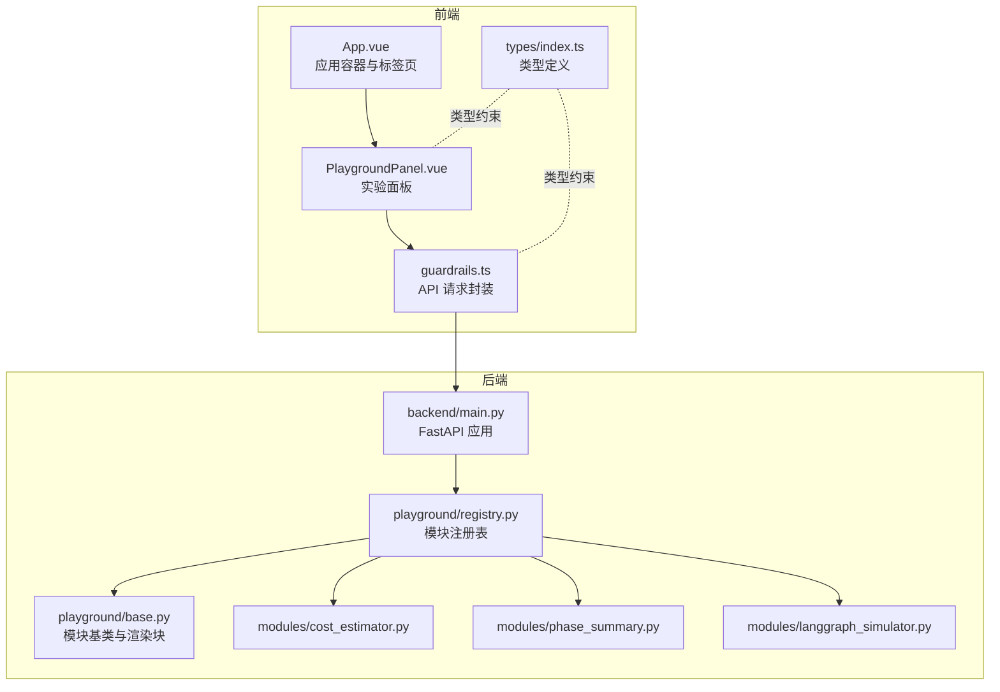
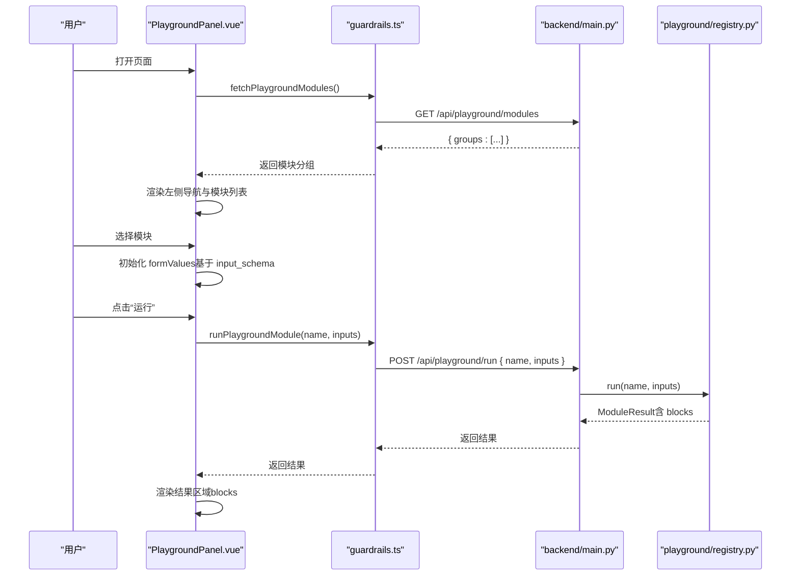
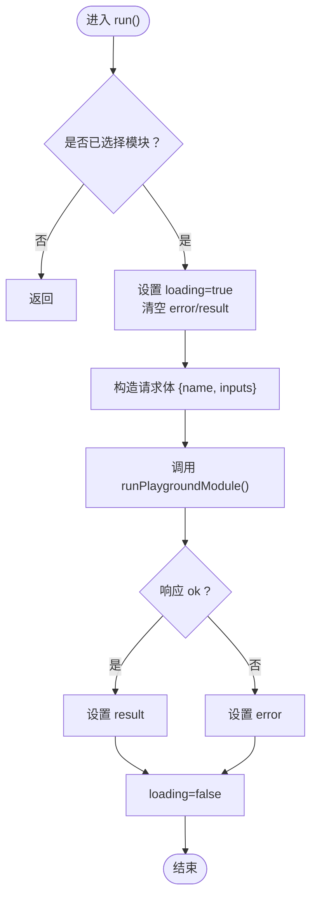
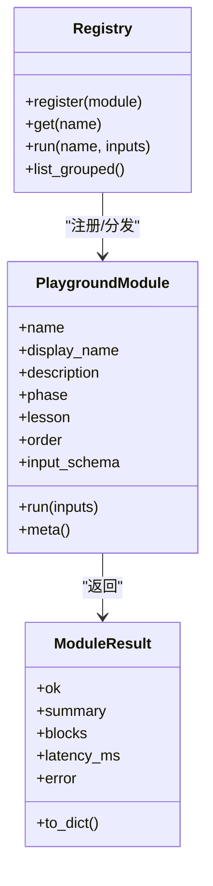
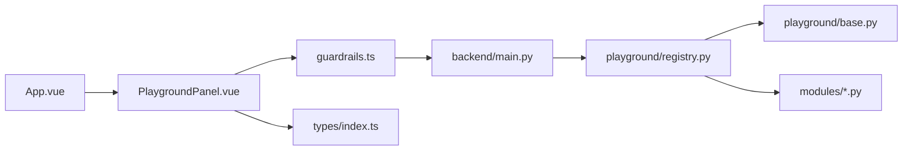

# 实验平台面板

<cite>
**本文引用的文件**
- [PlaygroundPanel.vue](file://guardrails-sandbox/frontend/src/components/PlaygroundPanel.vue)
- [guardrails.ts](file://guardrails-sandbox/frontend/src/api/guardrails.ts)
- [index.ts](file://guardrails-sandbox/frontend/src/types/index.ts)
- [App.vue](file://guardrails-sandbox/frontend/src/App.vue)
- [main.ts](file://guardrails-sandbox/frontend/src/main.ts)
- [main.py](file://guardrails-sandbox/backend/main.py)
- [registry.py](file://guardrails-sandbox/backend/playground/registry.py)
- [base.py](file://guardrails-sandbox/backend/playground/base.py)
- [cost_estimator.py](file://guardrails-sandbox/backend/playground/modules/cost_estimator.py)
- [phase_summary.py](file://guardrails-sandbox/backend/playground/modules/phase_summary.py)
- [langgraph_simulator.py](file://guardrails-sandbox/backend/playground/modules/langgraph_simulator.py)
</cite>

## 目录
1. [引言](#引言)
2. [项目结构](#项目结构)
3. [核心组件](#核心组件)
4. [架构总览](#架构总览)
5. [详细组件分析](#详细组件分析)
6. [依赖关系分析](#依赖关系分析)
7. [性能考虑](#性能考虑)
8. [故障排查指南](#故障排查指南)
9. [结论](#结论)
10. [附录](#附录)

## 引言
本文件围绕实验平台面板组件（PlaygroundPanel）进行系统性技术文档编写，目标是帮助开发者快速理解并扩展“课程实验台”功能。文档将从系统架构、组件职责、数据流与处理逻辑、模块组织与加载机制、生命周期管理、参数传递与状态同步、扩展机制、性能监控与用户体验优化等方面进行全面阐述，并提供模块开发指南与最佳实践。

## 项目结构
前端采用 Vue 3 单页应用，后端基于 FastAPI 提供 API。PlaygroundPanel 位于前端组件层，负责渲染实验模块导航、动态表单、执行与结果展示；后端通过 PlaygroundRegistry 统一注册与调度模块，提供按 phase 分组的模块清单与执行入口。

**图表来源**
- [App.vue:1-300](file://guardrails-sandbox/frontend/src/App.vue#L1-L300)
- [PlaygroundPanel.vue:1-363](file://guardrails-sandbox/frontend/src/components/PlaygroundPanel.vue#L1-L363)
- [guardrails.ts:1-168](file://guardrails-sandbox/frontend/src/api/guardrails.ts#L1-L168)
- [index.ts:1-162](file://guardrails-sandbox/frontend/src/types/index.ts#L1-L162)
- [main.py:359-404](file://guardrails-sandbox/backend/main.py#L359-L404)
- [registry.py:1-118](file://guardrails-sandbox/backend/playground/registry.py#L1-L118)
- [base.py:1-129](file://guardrails-sandbox/backend/playground/base.py#L1-L129)
- [cost_estimator.py:1-86](file://guardrails-sandbox/backend/playground/modules/cost_estimator.py#L1-L86)
- [phase_summary.py:1-68](file://guardrails-sandbox/backend/playground/modules/phase_summary.py#L1-L68)
- [langgraph_simulator.py:1-119](file://guardrails-sandbox/backend/playground/modules/langgraph_simulator.py#L1-L119)

**章节来源**
- [App.vue:1-300](file://guardrails-sandbox/frontend/src/App.vue#L1-L300)
- [PlaygroundPanel.vue:1-363](file://guardrails-sandbox/frontend/src/components/PlaygroundPanel.vue#L1-L363)
- [guardrails.ts:1-168](file://guardrails-sandbox/frontend/src/api/guardrails.ts#L1-L168)
- [index.ts:1-162](file://guardrails-sandbox/frontend/src/types/index.ts#L1-L162)
- [main.py:359-404](file://guardrails-sandbox/backend/main.py#L359-L404)
- [registry.py:1-118](file://guardrails-sandbox/backend/playground/registry.py#L1-L118)
- [base.py:1-129](file://guardrails-sandbox/backend/playground/base.py#L1-L129)

## 核心组件
- PlaygroundPanel.vue：实验面板的核心 UI 组件，负责模块导航、schema 驱动表单渲染、执行控制、结果渲染与错误提示。
- guardrails.ts：前端 API 封装，提供获取模块清单与执行模块的请求方法。
- types/index.ts：定义 PlaygroundModuleMeta、PlaygroundGroup、RenderBlock、ModuleResult 等类型，确保前后端契约一致。
- App.vue：应用容器，包含标签页切换，PlaygroundPanel 作为独立面板全屏展示。
- backend/main.py：后端 FastAPI 应用，提供 /api/playground/modules 与 /api/playground/run 接口。
- playground/registry.py：模块注册表，提供按 phase 分组的模块清单与执行分发。
- playground/base.py：模块基类与渲染块辅助函数，统一模块元信息与结果结构。
- 示例模块：cost_estimator.py、phase_summary.py、langgraph_simulator.py 展示了不同类型的输入与输出形态。

**章节来源**
- [PlaygroundPanel.vue:1-363](file://guardrails-sandbox/frontend/src/components/PlaygroundPanel.vue#L1-L363)
- [guardrails.ts:104-116](file://guardrails-sandbox/frontend/src/api/guardrails.ts#L104-L116)
- [index.ts:108-162](file://guardrails-sandbox/frontend/src/types/index.ts#L108-L162)
- [App.vue:114-116](file://guardrails-sandbox/frontend/src/App.vue#L114-L116)
- [main.py:368-378](file://guardrails-sandbox/backend/main.py#L368-L378)
- [registry.py:67-84](file://guardrails-sandbox/backend/playground/registry.py#L67-L84)
- [base.py:19-97](file://guardrails-sandbox/backend/playground/base.py#L19-L97)

## 架构总览
PlaygroundPanel 通过 API 获取后端模块清单，按 phase 分组渲染左侧导航；选择模块后根据 input_schema 动态生成表单；点击运行后将 inputs 发送到后端，后端通过 Registry 分发到具体模块，模块返回标准化的渲染块集合，前端统一渲染。

**图表来源**
- [PlaygroundPanel.vue:13-49](file://guardrails-sandbox/frontend/src/components/PlaygroundPanel.vue#L13-L49)
- [guardrails.ts:104-116](file://guardrails-sandbox/frontend/src/api/guardrails.ts#L104-L116)
- [main.py:368-378](file://guardrails-sandbox/backend/main.py#L368-L378)
- [registry.py:58-65](file://guardrails-sandbox/backend/playground/registry.py#L58-L65)

## 详细组件分析

### PlaygroundPanel 组件
- 导航与状态
  - groups：按 phase 分组的模块列表，来源于后端 /api/playground/modules。
  - activeModule：当前选中的模块元信息，用于生成表单与渲染结果。
  - formValues：表单字段值，随 input_schema 动态初始化。
  - result/error/loading：执行结果、错误信息与加载状态。
- 生命周期与事件
  - onMounted(loadModules)：组件挂载时拉取模块清单。
  - selectModule(mod)：设置当前模块，清空上次结果与错误，按 input_schema 初始化默认值。
  - run()：构建请求体，调用 runPlaygroundModule，处理成功/失败分支，最终更新 result 或 error。
- 表单与交互
  - schema 驱动渲染：根据字段类型渲染 textarea、select、number、text。
  - Tab 填入示例：从 placeholder 中抽取示例文本，按 Tab 自动填充空字段。
  - Enter 运行：单行输入框直接 Enter 触发；多行输入框需 Cmd/Ctrl+Enter。
  - hasAnyInput：至少有一个字段非空才允许运行。
- 结果渲染
  - 支持 text、score、table、json、keyvalue、list 六种渲染块类型。
  - score 百分比计算与进度条展示。
  - latency_ms 展示模块执行耗时。

**图表来源**
- [PlaygroundPanel.vue:32-49](file://guardrails-sandbox/frontend/src/components/PlaygroundPanel.vue#L32-L49)
- [guardrails.ts:108-116](file://guardrails-sandbox/frontend/src/api/guardrails.ts#L108-L116)

**章节来源**
- [PlaygroundPanel.vue:1-363](file://guardrails-sandbox/frontend/src/components/PlaygroundPanel.vue#L1-L363)
- [guardrails.ts:104-116](file://guardrails-sandbox/frontend/src/api/guardrails.ts#L104-L116)

### API 与类型契约
- API 方法
  - fetchPlaygroundModules：获取模块分组清单。
  - runPlaygroundModule：执行指定模块并返回结果。
- 类型定义
  - PlaygroundField/PlaygroundModuleMeta：模块元信息与输入字段 schema。
  - PlaygroundGroup：按 phase 分组的模块集合。
  - RenderBlock/ModuleResult：模块结果的统一渲染块与顶层结构。
- 错误处理
  - request 封装统一超时控制与错误抛出，便于前端捕获与展示。

**章节来源**
- [guardrails.ts:104-116](file://guardrails-sandbox/frontend/src/api/guardrails.ts#L104-L116)
- [index.ts:108-162](file://guardrails-sandbox/frontend/src/types/index.ts#L108-L162)

### 后端模块注册与执行
- Registry
  - register/get：模块注册与查找。
  - run：执行模块并返回 ModuleResult。
  - list_grouped：按 phase 分组并排序，供前端导航渲染。
- PlaygroundModule 与辅助函数
  - field_spec：声明输入字段。
  - block_*：生成标准渲染块（text/score/table/json/keyvalue/list）。
  - ModuleResult：统一结果结构（ok/summary/blocks/latency_ms/error）。
- 示例模块
  - cost_estimator：数值输入与表格/键值对输出。
  - phase_summary：文件系统扫描与列表/文本输出。
  - langgraph_simulator：文本输入与多类型块输出。

**图表来源**
- [registry.py:48-84](file://guardrails-sandbox/backend/playground/registry.py#L48-L84)
- [base.py:101-129](file://guardrails-sandbox/backend/playground/base.py#L101-L129)
- [base.py:81-97](file://guardrails-sandbox/backend/playground/base.py#L81-L97)

**章节来源**
- [registry.py:1-118](file://guardrails-sandbox/backend/playground/registry.py#L1-L118)
- [base.py:1-129](file://guardrails-sandbox/backend/playground/base.py#L1-L129)

### 模块开发指南与接口规范
- 新增模块步骤
  - 在 backend/playground/modules 下创建模块文件，继承 PlaygroundModule 并实现 run(inputs)。
  - 在 registry.py 的 _MODULES 列表中注册实例。
  - 前端无需改动即可自动出现在导航中。
- 输入 schema 设计
  - 使用 field_spec 定义字段名称、标签、类型、默认值、占位符与选项。
  - 类型支持 text、textarea、number、select。
- 结果渲染块
  - 使用 block_text、block_score、block_table、block_json、block_keyvalue、block_list 组合输出。
  - blocks 顺序即渲染顺序。
- 参数传递与状态同步
  - 前端 formValues 与后端 inputs 一一对应。
  - 后端返回 ModuleResult，前端直接绑定到 result，触发重新渲染。
- 开发建议
  - input_schema 尽量清晰，提供合理的默认值与占位符示例。
  - 使用 block_score 提供直观评分，block_table 展示对比数据。
  - 控制 blocks 数量与大小，避免一次性渲染过多内容影响性能。

**章节来源**
- [registry.py:7-11](file://guardrails-sandbox/backend/playground/registry.py#L7-L11)
- [base.py:19-77](file://guardrails-sandbox/backend/playground/base.py#L19-L77)
- [cost_estimator.py:29-36](file://guardrails-sandbox/backend/playground/modules/cost_estimator.py#L29-L36)
- [phase_summary.py:26-29](file://guardrails-sandbox/backend/playground/modules/phase_summary.py#L26-L29)
- [langgraph_simulator.py:35-41](file://guardrails-sandbox/backend/playground/modules/langgraph_simulator.py#L35-L41)

## 依赖关系分析
- 前端依赖
  - PlaygroundPanel 依赖 guardrails.ts 的 API 方法与 types/index.ts 的类型定义。
  - App.vue 作为容器，将 PlaygroundPanel 作为独立面板渲染。
- 后端依赖
  - main.py 注册 /api/playground/modules 与 /api/playground/run。
  - registry.py 依赖 base.py 的模块基类与渲染块辅助函数。
  - 模块文件依赖 base.py 的 field_spec 与 block_* 辅助函数。

**图表来源**
- [PlaygroundPanel.vue:1-10](file://guardrails-sandbox/frontend/src/components/PlaygroundPanel.vue#L1-L10)
- [guardrails.ts:1-12](file://guardrails-sandbox/frontend/src/api/guardrails.ts#L1-L12)
- [App.vue:1-11](file://guardrails-sandbox/frontend/src/App.vue#L1-L11)
- [main.py:359-378](file://guardrails-sandbox/backend/main.py#L359-L378)
- [registry.py:12-118](file://guardrails-sandbox/backend/playground/registry.py#L12-L118)
- [base.py:15-129](file://guardrails-sandbox/backend/playground/base.py#L15-L129)

**章节来源**
- [PlaygroundPanel.vue:1-10](file://guardrails-sandbox/frontend/src/components/PlaygroundPanel.vue#L1-L10)
- [guardrails.ts:1-12](file://guardrails-sandbox/frontend/src/api/guardrails.ts#L1-L12)
- [App.vue:1-11](file://guardrails-sandbox/frontend/src/App.vue#L1-L11)
- [main.py:359-378](file://guardrails-sandbox/backend/main.py#L359-L378)
- [registry.py:12-118](file://guardrails-sandbox/backend/playground/registry.py#L12-L118)
- [base.py:15-129](file://guardrails-sandbox/backend/playground/base.py#L15-L129)

## 性能考虑
- 前端
  - 表单渲染与结果渲染均基于响应式数据，合理使用 v-if/v-show 控制复杂块的显示时机。
  - 对于长文本或大表格，建议分页或懒加载，避免一次性渲染造成卡顿。
  - 使用防抖/节流处理高频输入（如实时搜索场景），但当前 Playground 以显式运行为主。
- 后端
  - Registry.run 对异常进行捕获并返回 ModuleResult(error)，前端统一处理，避免服务崩溃。
  - 模块内部应尽量避免阻塞操作，必要时使用异步或后台任务，缩短执行时间。
  - 通过 latency_ms 返回模块耗时，便于前端展示与后续优化。
- 网络
  - request 封装统一超时控制，防止长时间等待导致 UI 卡死。
  - 对于大数据量的模块，建议后端分批返回或压缩数据。

[本节为通用指导，无需特定文件引用]

## 故障排查指南
- 常见问题
  - 无法加载模块清单：检查 /api/playground/modules 是否可达，确认后端已注册模块。
  - 运行时报错：查看 result.error 或前端 error，定位模块内部异常或输入校验失败。
  - 表单无响应：确认 activeModule 是否存在，hasAnyInput 是否为真，键盘快捷键组合是否正确。
- 调试建议
  - 在 PlaygroundPanel 中打印 formValues 与请求体，核对字段映射。
  - 在后端模块中记录关键路径耗时与输入参数，结合 latency_ms 定位瓶颈。
  - 使用浏览器开发者工具 Network 面板观察 API 响应与错误码。

**章节来源**
- [PlaygroundPanel.vue:13-49](file://guardrails-sandbox/frontend/src/components/PlaygroundPanel.vue#L13-L49)
- [guardrails.ts:14-36](file://guardrails-sandbox/frontend/src/api/guardrails.ts#L14-L36)
- [registry.py:58-65](file://guardrails-sandbox/backend/playground/registry.py#L58-L65)

## 结论
PlaygroundPanel 通过 schema 驱动的表单与统一的结果渲染块，实现了“零改动”的模块扩展能力。后端以 Registry 为核心，将模块注册、分组与执行解耦，前端仅依赖类型与 API 即可接入新模块。配合清晰的开发规范与性能优化策略，实验平台能够持续扩展并保持良好的用户体验。

[本节为总结，无需特定文件引用]

## 附录

### API 定义（Playground）
- 获取模块清单
  - 方法：GET
  - 路径：/api/playground/modules
  - 返回：{ groups: PlaygroundGroup[] }
- 执行模块
  - 方法：POST
  - 路径：/api/playground/run
  - 请求体：{ name: string, inputs: Record<string, any> }
  - 返回：ModuleResult

**章节来源**
- [main.py:368-378](file://guardrails-sandbox/backend/main.py#L368-L378)
- [guardrails.ts:104-116](file://guardrails-sandbox/frontend/src/api/guardrails.ts#L104-L116)

### 类型定义摘要
- PlaygroundField：字段规格（name/label/type/default/placeholder/help/options）
- PlaygroundModuleMeta：模块元信息（name/display_name/description/phase/lesson/order/input_schema）
- PlaygroundGroup：分组（phase/label/icon/modules）
- RenderBlock：渲染块（text/score/table/json/keyvalue/list）
- ModuleResult：模块结果（ok/summary/blocks/latency_ms/error）

**章节来源**
- [index.ts:108-162](file://guardrails-sandbox/frontend/src/types/index.ts#L108-L162)

### 示例模块一览
- cost_estimator：输入模型、token 与请求量，输出成本与缓存节省对比。
- phase_summary：输入阶段号，输出课程列表与简介。
- langgraph_simulator：输入任务描述，输出 Agent 形状度、拓扑与检查点序列。

**章节来源**
- [cost_estimator.py:21-86](file://guardrails-sandbox/backend/playground/modules/cost_estimator.py#L21-L86)
- [phase_summary.py:18-68](file://guardrails-sandbox/backend/playground/modules/phase_summary.py#L18-L68)
- [langgraph_simulator.py:27-119](file://guardrails-sandbox/backend/playground/modules/langgraph_simulator.py#L27-L119)