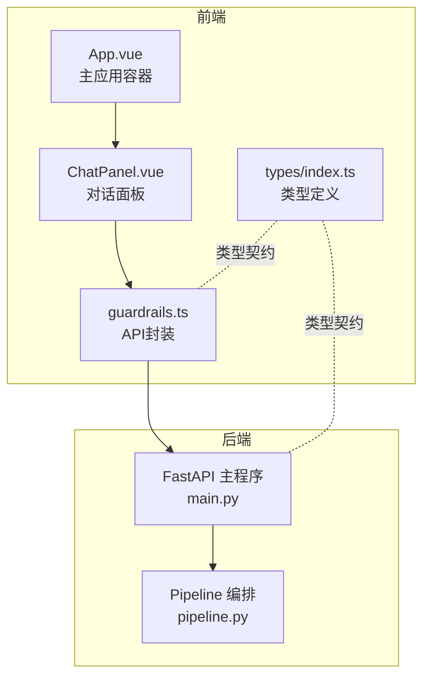
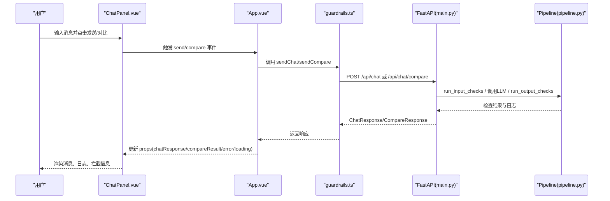
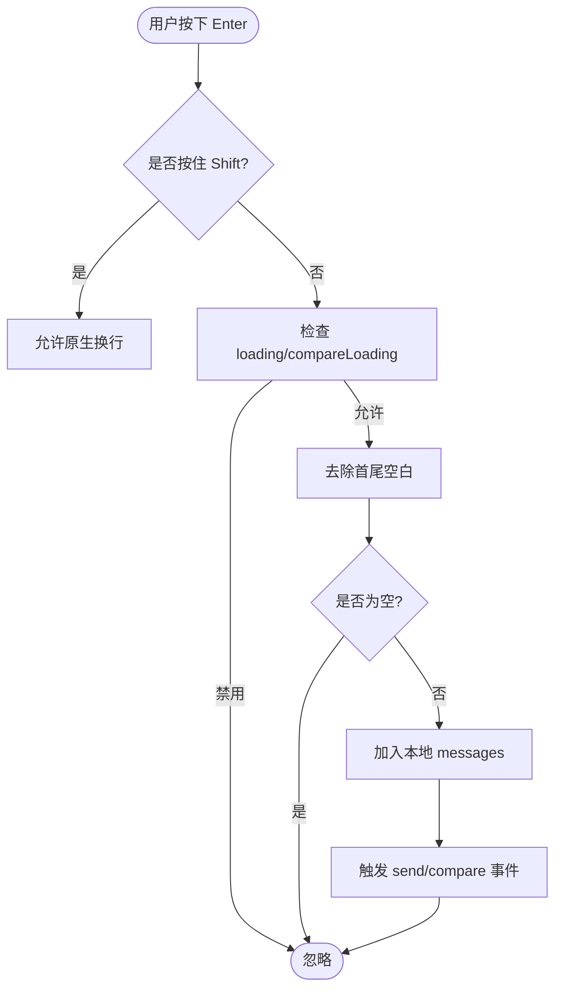
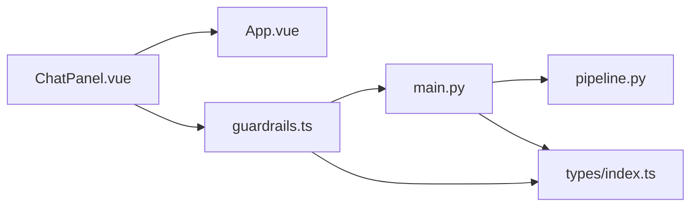

# 对话面板组件

<cite>
**本文引用的文件**
- [ChatPanel.vue](file://guardrails-sandbox/frontend/src/components/ChatPanel.vue)
- [App.vue](file://guardrails-sandbox/frontend/src/App.vue)
- [guardrails.ts](file://guardrails-sandbox/frontend/src/api/guardrails.ts)
- [index.ts](file://guardrails-sandbox/frontend/src/types/index.ts)
- [main.py](file://guardrails-sandbox/backend/main.py)
- [pipeline.py](file://guardrails-sandbox/backend/pipeline.py)
</cite>

## 目录
1. [简介](#简介)
2. [项目结构](#项目结构)
3. [核心组件](#核心组件)
4. [架构总览](#架构总览)
5. [详细组件分析](#详细组件分析)
6. [依赖关系分析](#依赖关系分析)
7. [性能考量](#性能考量)
8. [故障排查指南](#故障排查指南)
9. [结论](#结论)
10. [附录](#附录)

## 简介
本文件为对话面板组件（ChatPanel）的权威技术文档，面向前端工程师与产品/运营人员，系统阐述该组件如何提供与LLM进行交互的完整聊天界面，涵盖消息发送/接收逻辑、实时响应处理、会话状态管理、消息格式化、用户输入验证、历史记录保存、API集成方式、错误处理机制与性能优化策略，并给出组件配置选项、样式定制与用户体验优化建议。

## 项目结构
ChatPanel位于前端Vue项目guardrails-sandbox中，作为主应用的一个面板，与后端FastAPI服务通过REST API通信。其核心职责是：
- 渲染消息列表与输入区域
- 触发发送/对比请求
- 展示Guardrails检测结果与拦截详情
- 展示错误与加载状态

**图表来源**
- [App.vue:1-300](file://guardrails-sandbox/frontend/src/App.vue#L1-L300)
- [ChatPanel.vue:1-539](file://guardrails-sandbox/frontend/src/components/ChatPanel.vue#L1-L539)
- [guardrails.ts:1-168](file://guardrails-sandbox/frontend/src/api/guardrails.ts#L1-L168)
- [index.ts:1-162](file://guardrails-sandbox/frontend/src/types/index.ts#L1-L162)
- [main.py:1-421](file://guardrails-sandbox/backend/main.py#L1-L421)
- [pipeline.py:1-285](file://guardrails-sandbox/backend/pipeline.py#L1-L285)

**章节来源**
- [App.vue:1-300](file://guardrails-sandbox/frontend/src/App.vue#L1-L300)
- [ChatPanel.vue:1-539](file://guardrails-sandbox/frontend/src/components/ChatPanel.vue#L1-L539)
- [guardrails.ts:1-168](file://guardrails-sandbox/frontend/src/api/guardrails.ts#L1-L168)
- [index.ts:1-162](file://guardrails-sandbox/frontend/src/types/index.ts#L1-L162)
- [main.py:1-421](file://guardrails-sandbox/backend/main.py#L1-L421)
- [pipeline.py:1-285](file://guardrails-sandbox/backend/pipeline.py#L1-L285)

## 核心组件
- 组件名称：ChatPanel
- 所属模块：frontend/src/components
- 作用域：普通模式与对比模式的聊天交互展示
- 关键能力：
  - 用户输入与发送（Enter发送/Shift+Enter换行）
  - 普通模式：展示LLM回复、Guardrails检测日志、拦截原因
  - 对比模式：同时展示“无Guardrails”与“有Guardrails”的结果
  - 错误与加载状态提示
  - 清空历史消息

**章节来源**
- [ChatPanel.vue:1-539](file://guardrails-sandbox/frontend/src/components/ChatPanel.vue#L1-L539)

## 架构总览
前端通过guardrails.ts封装的API与后端交互，后端采用Pipeline对Guardrails进行编排，先执行输入检查，再调用LLM，最后执行输出检查。对比模式会临时启用所有适配器进行对照。

**图表来源**
- [ChatPanel.vue:48-66](file://guardrails-sandbox/frontend/src/components/ChatPanel.vue#L48-L66)
- [App.vue:34-64](file://guardrails-sandbox/frontend/src/App.vue#L34-L64)
- [guardrails.ts:49-81](file://guardrails-sandbox/frontend/src/api/guardrails.ts#L49-L81)
- [main.py:155-221](file://guardrails-sandbox/backend/main.py#L155-L221)
- [main.py:223-256](file://guardrails-sandbox/backend/main.py#L223-L256)
- [pipeline.py:31-84](file://guardrails-sandbox/backend/pipeline.py#L31-L84)

**章节来源**
- [App.vue:34-64](file://guardrails-sandbox/frontend/src/App.vue#L34-L64)
- [guardrails.ts:49-81](file://guardrails-sandbox/frontend/src/api/guardrails.ts#L49-L81)
- [main.py:155-221](file://guardrails-sandbox/backend/main.py#L155-L221)
- [main.py:223-256](file://guardrails-sandbox/backend/main.py#L223-L256)
- [pipeline.py:31-84](file://guardrails-sandbox/backend/pipeline.py#L31-L84)

## 详细组件分析

### 组件属性与事件
- 属性
  - activeTab: 'normal' | 'compare'
  - loading: boolean
  - compareLoading: boolean
  - chatResponse: ChatResponse | null
  - compareResult: { without: ChatResponse; with_: ChatResponse } | null
  - guardrails: AdapterInfo[]
  - error: string
- 事件
  - send(message: string)
  - compare(message: string)

这些属性驱动UI状态与数据流，事件用于向上冒泡触发后端请求。

**章节来源**
- [ChatPanel.vue:5-18](file://guardrails-sandbox/frontend/src/components/ChatPanel.vue#L5-L18)

### 消息发送与输入处理
- Enter发送：监听textarea的keydown.enter.exact，调用sendMessage或sendCompare
- Shift+Enter：允许原生换行
- 输入验证：trim后非空且对应loading为false才允许发送
- 发送流程：将当前输入推入messages，清空输入框，触发对应事件

**图表来源**
- [ChatPanel.vue:48-66](file://guardrails-sandbox/frontend/src/components/ChatPanel.vue#L48-L66)
- [ChatPanel.vue:171-177](file://guardrails-sandbox/frontend/src/components/ChatPanel.vue#L171-L177)

**章节来源**
- [ChatPanel.vue:48-66](file://guardrails-sandbox/frontend/src/components/ChatPanel.vue#L48-L66)
- [ChatPanel.vue:171-177](file://guardrails-sandbox/frontend/src/components/ChatPanel.vue#L171-L177)

### 普通模式消息渲染
- 当activeTab为normal且存在chatResponse时：
  - 若被拦截：显示拦截横幅（输入/输出阶段、原因、置信度）
  - 若通过：显示助手回复
  - 展示Guardrails检测日志（名称、通过/拦截、置信度、耗时、原因）

**章节来源**
- [ChatPanel.vue:94-132](file://guardrails-sandbox/frontend/src/components/ChatPanel.vue#L94-L132)

### 对比模式消息渲染
- 当activeTab为compare且存在compareResult时：
  - 左列：无Guardrails的回复与耗时
  - 右列：有Guardrails的回复，若被拦截则显示拦截原因与耗时、检查数量

**章节来源**
- [ChatPanel.vue:134-157](file://guardrails-sandbox/frontend/src/components/ChatPanel.vue#L134-L157)

### 错误与加载状态
- error：展示错误横幅
- loading/compareLoading：显示加载动画与文案

**章节来源**
- [ChatPanel.vue:159-167](file://guardrails-sandbox/frontend/src/components/ChatPanel.vue#L159-L167)

### 适配器名称本地化
- 内置适配器中英文名与缩写映射，用于日志标题展示

**章节来源**
- [ChatPanel.vue:23-46](file://guardrails-sandbox/frontend/src/components/ChatPanel.vue#L23-L46)

### 与主应用的集成
- App.vue负责：
  - 加载Guardrails树与统计数据
  - 处理发送/对比请求，更新loading与响应
  - 将props传递给ChatPanel并绑定事件处理器

**章节来源**
- [App.vue:26-81](file://guardrails-sandbox/frontend/src/App.vue#L26-L81)
- [App.vue:137-148](file://guardrails-sandbox/frontend/src/App.vue#L137-L148)

### 后端API与Pipeline
- 前端API封装：
  - sendChat：发送消息，携带history、system_prompt、user_id、tier
  - sendCompare：对比模式，返回without与with_guardrails两份结果
- 后端路由：
  - /api/chat：执行输入检查→调用LLM→执行输出检查
  - /api/chat/compare：对比模式，分别返回无/有Guardrails的结果
- Pipeline：
  - 先按order排序的input适配器链路，遇拦截即短路
  - LLM调用后执行output适配器链路
  - 收集guardrail_logs、统计与拦截历史

**章节来源**
- [guardrails.ts:49-81](file://guardrails-sandbox/frontend/src/api/guardrails.ts#L49-L81)
- [main.py:155-221](file://guardrails-sandbox/backend/main.py#L155-L221)
- [main.py:223-256](file://guardrails-sandbox/backend/main.py#L223-L256)
- [pipeline.py:31-84](file://guardrails-sandbox/backend/pipeline.py#L31-L84)

### 数据模型与类型
- ChatResponse：包含response、blocked、block_stage、block_reason、block_detail、guardrail_logs、total_latency_ms、llm_latency_ms
- GuardrailLog：name、description、passed、confidence、latency_ms、reason、details
- CompareResponse：without_guardrails与with_guardrails两个ChatResponse

**章节来源**
- [index.ts:61-85](file://guardrails-sandbox/frontend/src/types/index.ts#L61-L85)

## 依赖关系分析
- 组件耦合
  - ChatPanel依赖App.vue传入的props与事件回调，低耦合高内聚
  - 与guardrails.ts存在API层面的依赖，便于替换后端实现
- 外部依赖
  - 后端FastAPI服务提供REST接口
  - Pipeline负责Guardrails编排与统计

**图表来源**
- [ChatPanel.vue:1-539](file://guardrails-sandbox/frontend/src/components/ChatPanel.vue#L1-L539)
- [App.vue:1-300](file://guardrails-sandbox/frontend/src/App.vue#L1-L300)
- [guardrails.ts:1-168](file://guardrails-sandbox/frontend/src/api/guardrails.ts#L1-L168)
- [main.py:1-421](file://guardrails-sandbox/backend/main.py#L1-L421)
- [pipeline.py:1-285](file://guardrails-sandbox/backend/pipeline.py#L1-L285)
- [index.ts:1-162](file://guardrails-sandbox/frontend/src/types/index.ts#L1-L162)

**章节来源**
- [ChatPanel.vue:1-539](file://guardrails-sandbox/frontend/src/components/ChatPanel.vue#L1-L539)
- [App.vue:1-300](file://guardrails-sandbox/frontend/src/App.vue#L1-L300)
- [guardrails.ts:1-168](file://guardrails-sandbox/frontend/src/api/guardrails.ts#L1-L168)
- [main.py:1-421](file://guardrails-sandbox/backend/main.py#L1-L421)
- [pipeline.py:1-285](file://guardrails-sandbox/backend/pipeline.py#L1-L285)
- [index.ts:1-162](file://guardrails-sandbox/frontend/src/types/index.ts#L1-L162)

## 性能考量
- 前端
  - 本地messages数组仅用于UI展示，避免频繁DOM重排
  - 日志列表按需渲染，减少不必要的diff
  - 加载态与错误态及时反馈，避免无效请求堆积
- 后端
  - Pipeline按order排序，短路拦截减少LLM调用
  - 对比模式临时启用适配器，注意并发与资源占用
  - 统一超时控制（前端fetch超时与后端路由超时）

**章节来源**
- [guardrails.ts:14-36](file://guardrails-sandbox/frontend/src/api/guardrails.ts#L14-L36)
- [main.py:11-12](file://guardrails-sandbox/backend/main.py#L11-L12)
- [pipeline.py:22-23](file://guardrails-sandbox/backend/pipeline.py#L22-L23)

## 故障排查指南
- 常见错误
  - 请求超时：检查后端服务状态与网络连通性
  - LLM调用失败：查看后端异常返回与日志
  - 拦截原因：查看block_reason与guardrail_logs
- 前端定位
  - 查看error属性与错误横幅
  - 检查loading/compareLoading状态
- 后端定位
  - 查看Pipeline统计与拦截历史
  - 对比模式下确认适配器状态恢复

**章节来源**
- [ChatPanel.vue:159-167](file://guardrails-sandbox/frontend/src/components/ChatPanel.vue#L159-L167)
- [main.py:186-194](file://guardrails-sandbox/backend/main.py#L186-L194)
- [main.py:165-177](file://guardrails-sandbox/backend/main.py#L165-L177)
- [main.py:201-210](file://guardrails-sandbox/backend/main.py#L201-L210)

## 结论
ChatPanel通过清晰的属性/事件契约与后端API协作，实现了从输入到响应、从日志到拦截的完整闭环。其设计兼顾易用性与可观测性，适合在生产环境中作为LLM交互的统一入口。建议在实际部署中结合后端Pipeline的统计与拦截历史，持续优化适配器组合与阈值，以获得更好的安全性与用户体验。

## 附录

### 组件配置选项
- activeTab：normal/compare
- loading/compareLoading：控制发送按钮与加载态
- chatResponse/compareResult：后端返回的响应数据
- guardrails：适配器树与统计
- error：错误信息

**章节来源**
- [ChatPanel.vue:5-18](file://guardrails-sandbox/frontend/src/components/ChatPanel.vue#L5-L18)

### 样式定制与主题变量
- 使用CSS变量控制颜色与圆角，便于主题切换
- 消息气泡、拦截横幅、日志项、对比网格等均有独立样式类

**章节来源**
- [ChatPanel.vue:204-538](file://guardrails-sandbox/frontend/src/components/ChatPanel.vue#L204-L538)

### 用户体验优化建议
- 输入提示：明确Enter发送/Shift+Enter换行
- 滚动行为：新消息自动滚动到底部
- 响应速度：在前端增加骨架屏或轻量占位符
- 可访问性：为按钮与输入框提供aria-label与键盘快捷键支持

[本节为通用建议，无需特定文件引用]