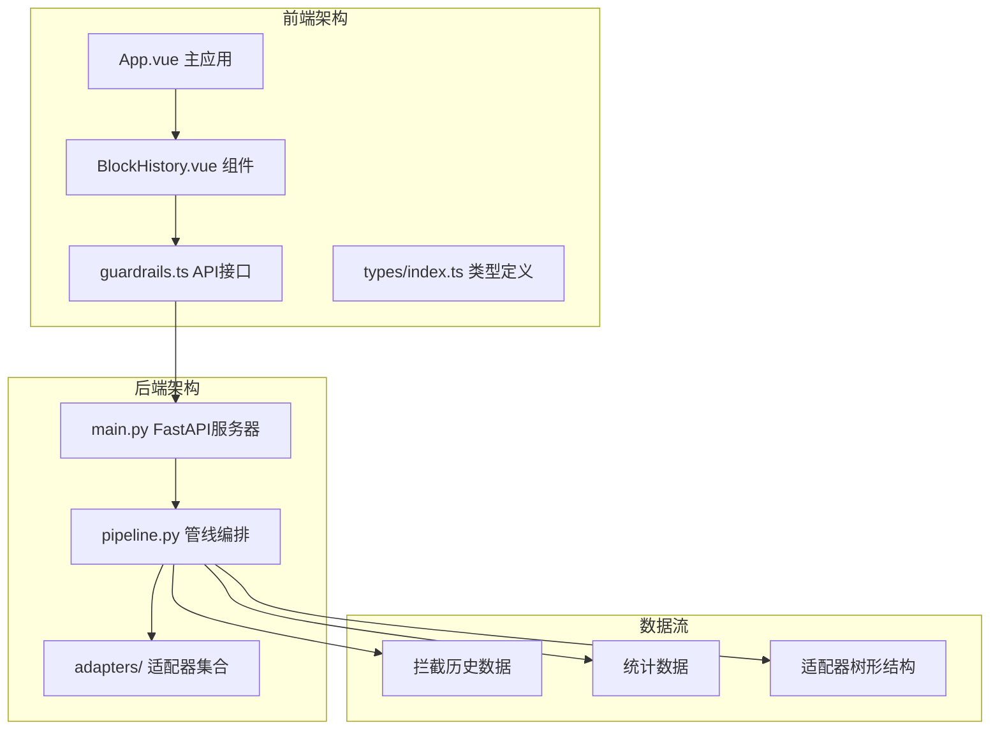
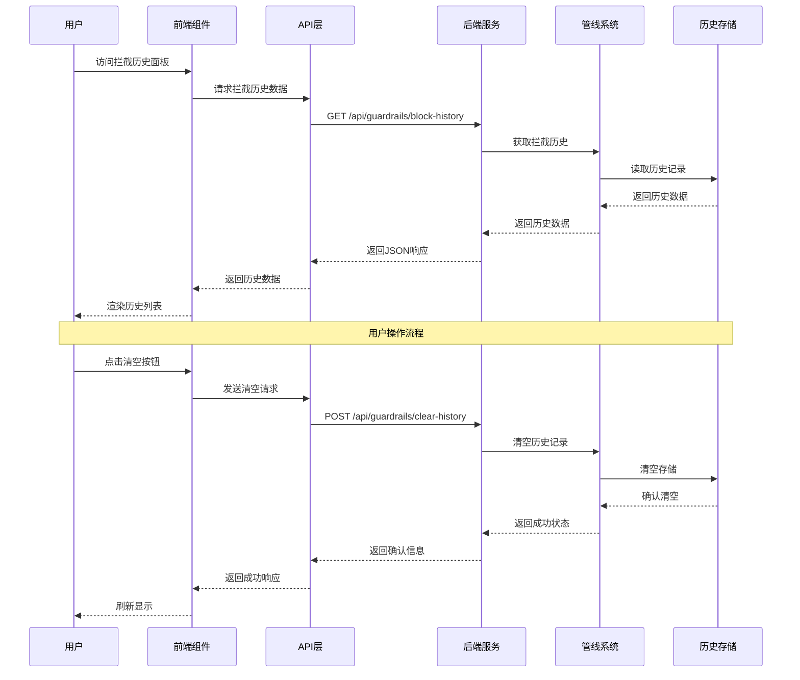
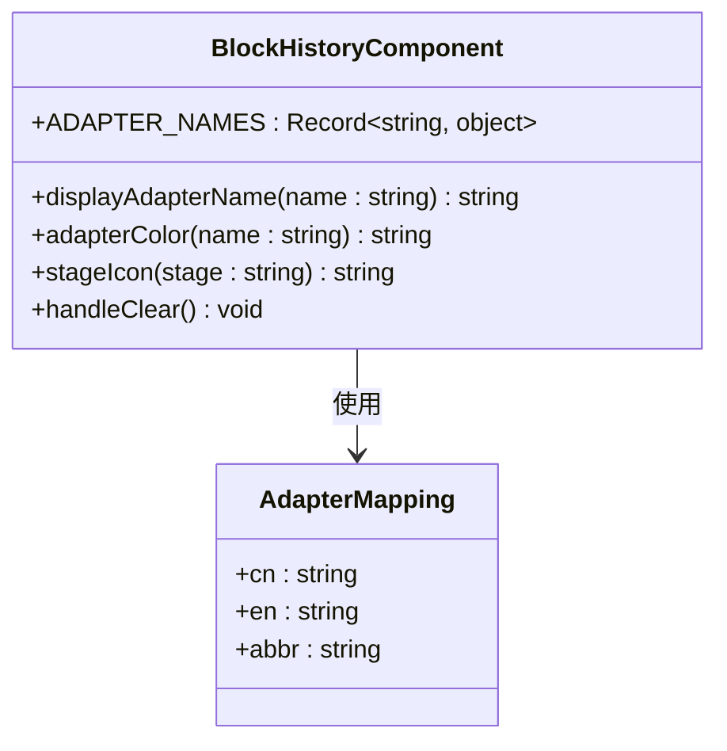
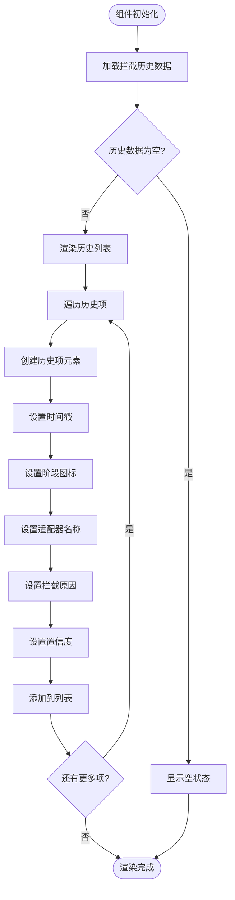
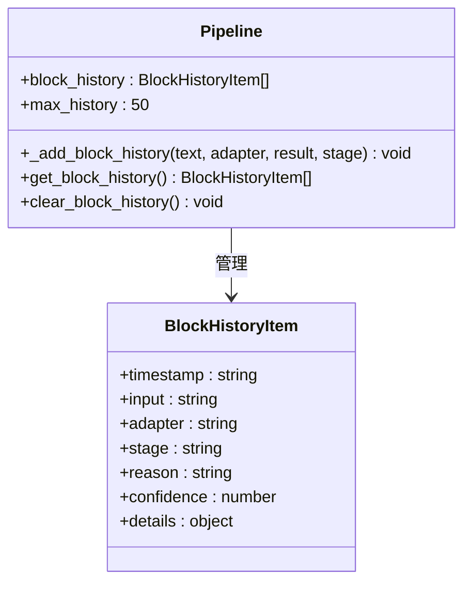
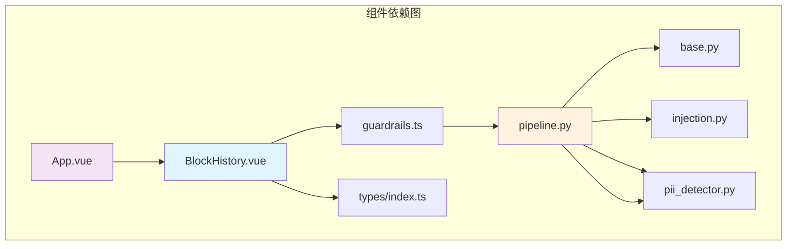
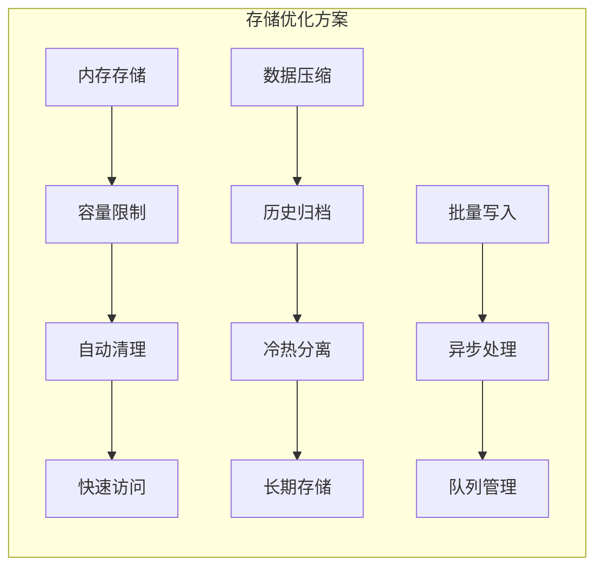

# 拦截历史组件

<cite>
**本文档引用的文件**
- [BlockHistory.vue](file://guardrails-sandbox/frontend/src/components/BlockHistory.vue)
- [guardrails.ts](file://guardrails-sandbox/frontend/src/api/guardrails.ts)
- [types/index.ts](file://guardrails-sandbox/frontend/src/types/index.ts)
- [App.vue](file://guardrails-sandbox/frontend/src/App.vue)
- [pipeline.py](file://guardrails-sandbox/backend/pipeline.py)
- [main.py](file://guardrails-sandbox/backend/main.py)
- [base.py](file://guardrails-sandbox/backend/adapters/base.py)
- [injection.py](file://guardrails-sandbox/backend/adapters/injection.py)
- [pii_detector.py](file://guardrails-sandbox/backend/adapters/pii_detector.py)
</cite>

## 目录
1. [简介](#简介)
2. [项目结构](#项目结构)
3. [核心组件](#核心组件)
4. [架构概览](#架构概览)
5. [详细组件分析](#详细组件分析)
6. [依赖关系分析](#依赖关系分析)
7. [性能考虑](#性能考虑)
8. [故障排除指南](#故障排除指南)
9. [结论](#结论)

## 简介

拦截历史组件(BlockHistory)是AI工程学习实验台中的一个重要功能模块，专门用于记录和展示所有被防护墙拦截的历史事件。该组件提供了完整的拦截事件追踪、可视化展示和历史数据管理功能，帮助开发者和安全工程师监控和分析系统的安全防护效果。

该组件的核心功能包括：
- 实时记录所有拦截事件的时间戳、触发原因和详细信息
- 提供直观的历史事件列表展示界面
- 支持清空历史记录的操作
- 展示拦截原因的分类统计
- 提供拦截详情查看和趋势分析能力

## 项目结构

拦截历史组件位于前端Vue应用中，采用组件化的架构设计，与后端防护墙系统紧密集成。



**图表来源**
- [App.vue:151-156](file://guardrails-sandbox/frontend/src/App.vue#L151-L156)
- [BlockHistory.vue:1-51](file://guardrails-sandbox/frontend/src/components/BlockHistory.vue#L1-L51)
- [main.py:121-145](file://guardrails-sandbox/backend/main.py#L121-L145)

**章节来源**
- [App.vue:151-156](file://guardrails-sandbox/frontend/src/App.vue#L151-L156)
- [BlockHistory.vue:1-51](file://guardrails-sandbox/frontend/src/components/BlockHistory.vue#L1-L51)

## 核心组件

拦截历史组件是一个独立的Vue单文件组件，负责展示和管理拦截历史数据。组件通过props接收历史数据，并通过事件机制与父组件通信。

### 组件属性和事件

组件通过以下方式与外部系统交互：

- **属性接收**: `history` - BlockHistoryItem[] 类型的历史事件数组
- **事件发射**: `refresh` - 用于通知父组件刷新数据

### 数据结构定义

拦截历史项的数据结构包含以下关键字段：

| 字段名 | 类型 | 描述 | 示例值 |
|--------|------|------|--------|
| timestamp | string | 事件发生的时间戳 | "14:30:25" |
| input | string | 触发拦截的输入内容 | "用户敏感信息..." |
| adapter | string | 触发拦截的适配器名称 | "pii_detector" |
| stage | string | 拦截发生的阶段 | "input" 或 "output" |
| reason | string | 拦截的具体原因 | "检测到个人信息" |
| confidence | number | 拦截的置信度分数 | 0.95 |
| details | Record<string, any> | 详细的拦截信息 | 包含匹配模式等 |

**章节来源**
- [types/index.ts:51-59](file://guardrails-sandbox/frontend/src/types/index.ts#L51-L59)
- [BlockHistory.vue:5-11](file://guardrails-sandbox/frontend/src/components/BlockHistory.vue#L5-L11)

## 架构概览

拦截历史组件采用前后端分离的架构设计，前端负责数据展示，后端负责数据收集和存储。



**图表来源**
- [guardrails.ts:83-89](file://guardrails-sandbox/frontend/src/api/guardrails.ts#L83-L89)
- [main.py:136-144](file://guardrails-sandbox/backend/main.py#L136-L144)
- [pipeline.py:280-285](file://guardrails-sandbox/backend/pipeline.py#L280-L285)

## 详细组件分析

### 组件实现细节

拦截历史组件采用了现代化的Vue 3 Composition API设计，提供了丰富的功能特性和良好的用户体验。

#### 适配器名称映射系统

组件内置了完整的适配器名称映射表，支持中英文双语显示：



**图表来源**
- [BlockHistory.vue:13-36](file://guardrails-sandbox/frontend/src/components/BlockHistory.vue#L13-L36)

#### 样式定制系统

组件采用CSS变量系统，支持主题定制和响应式设计：

| CSS变量 | 默认值 | 用途 |
|---------|--------|------|
| `--bg` | #0f172a | 背景色 |
| `--surface` | #1e293b | 表面色 |
| `--border` | #334155 | 边框色 |
| `--text` | #e2e8f0 | 主文字色 |
| `--text-muted` | #64748b | 次要文字色 |
| `--red` | #ef4444 | 红色强调 |
| `--orange` | #f59e0b | 橙色强调 |

#### 功能特性

1. **实时拦截记录**: 自动记录所有拦截事件，包含时间戳、适配器名称、拦截原因等信息
2. **分类展示**: 按输入(input)和输出(output)阶段分类显示拦截事件
3. **置信度显示**: 展示每个拦截事件的置信度分数
4. **详情查看**: 支持查看详细的拦截信息和匹配模式
5. **历史管理**: 提供清空历史记录的功能

**章节来源**
- [BlockHistory.vue:1-193](file://guardrails-sandbox/frontend/src/components/BlockHistory.vue#L1-L193)

### 数据流处理

拦截历史组件的数据流遵循标准的前端组件数据流模式：



**图表来源**
- [BlockHistory.vue:64-85](file://guardrails-sandbox/frontend/src/components/BlockHistory.vue#L64-L85)

### 后端数据管理

后端通过Pipeline类管理拦截历史数据，实现了高效的数据存储和检索机制。

#### 历史数据存储策略



**图表来源**
- [pipeline.py:16-285](file://guardrails-sandbox/backend/pipeline.py#L16-L285)

#### 数据持久化机制

后端采用内存存储策略，具有以下特点：
- **内存存储**: 使用Python列表存储拦截历史，访问速度快
- **容量限制**: 最多保留50条历史记录，防止内存泄漏
- **自动清理**: 超出容量时自动移除最旧的记录
- **快速插入**: 使用insert(0, item)在开头插入新记录，保持最新记录在前

**章节来源**
- [pipeline.py:264-285](file://guardrails-sandbox/backend/pipeline.py#L264-L285)

### API接口设计

拦截历史组件通过标准化的API接口与后端进行数据交换，确保了系统的可维护性和扩展性。

#### 接口规范

| 接口 | 方法 | 路径 | 功能描述 |
|------|------|------|----------|
| 获取历史 | GET | `/api/guardrails/block-history` | 获取当前拦截历史数据 |
| 清空历史 | POST | `/api/guardrails/clear-history` | 清空所有拦截历史记录 |
| 获取总览 | GET | `/api/guardrails` | 获取完整的系统状态数据 |

#### 数据格式

**获取历史记录响应格式**:
```json
{
  "history": [
    {
      "timestamp": "14:30:25",
      "input": "用户输入内容...",
      "adapter": "pii_detector",
      "stage": "input",
      "reason": "检测到个人信息",
      "confidence": 0.95,
      "details": {}
    }
  ]
}
```

**清空历史响应格式**:
```json
{
  "ok": true
}
```

**章节来源**
- [guardrails.ts:83-89](file://guardrails-sandbox/frontend/src/api/guardrails.ts#L83-L89)
- [main.py:136-144](file://guardrails-sandbox/backend/main.py#L136-L144)

## 依赖关系分析

拦截历史组件与其他系统组件之间存在清晰的依赖关系，形成了完整的功能体系。



**图表来源**
- [App.vue:151-156](file://guardrails-sandbox/frontend/src/App.vue#L151-L156)
- [BlockHistory.vue:1-7](file://guardrails-sandbox/frontend/src/components/BlockHistory.vue#L1-L7)
- [pipeline.py:12-24](file://guardrails-sandbox/backend/pipeline.py#L12-L24)

### 组件耦合度分析

拦截历史组件的设计体现了良好的低耦合原则：

- **与UI层解耦**: 组件通过props接收数据，不直接依赖具体的数据源
- **与业务逻辑解耦**: 通过API接口与后端交互，业务逻辑集中在后端
- **与样式解耦**: 使用CSS变量，便于主题定制和样式修改

### 外部依赖

组件对外部系统的依赖主要包括：

1. **Vue 3框架**: 提供响应式数据绑定和组件化开发能力
2. **TypeScript类型系统**: 确保类型安全和更好的开发体验
3. **FastAPI后端**: 提供RESTful API接口和数据存储服务
4. **适配器系统**: 作为拦截事件的来源，提供多样化的检测能力

**章节来源**
- [BlockHistory.vue:1-51](file://guardrails-sandbox/frontend/src/components/BlockHistory.vue#L1-L51)
- [pipeline.py:12-24](file://guardrails-sandbox/backend/pipeline.py#L12-L24)

## 性能考虑

拦截历史组件在设计时充分考虑了性能优化，确保在大量数据场景下的流畅运行。

### 前端性能优化

1. **虚拟滚动**: 对于大量历史记录，可以考虑实现虚拟滚动以提高渲染性能
2. **懒加载**: 拦截详情信息可以采用懒加载方式，减少初始渲染负担
3. **防抖处理**: 对频繁的刷新操作进行防抖处理，避免重复请求
4. **内存管理**: 合理控制历史记录数量，防止内存占用过高

### 后端性能优化

1. **索引优化**: 为时间戳字段建立索引，提高查询效率
2. **分页机制**: 实现分页查询，避免一次性返回大量数据
3. **缓存策略**: 对热门查询结果进行缓存
4. **连接池**: 使用连接池管理数据库连接

### 存储优化策略



## 故障排除指南

### 常见问题及解决方案

#### 1. 历史数据不显示

**可能原因**:
- 后端服务未启动或异常
- 网络连接问题
- API接口返回错误

**解决步骤**:
1. 检查后端服务状态
2. 验证网络连接
3. 查看浏览器开发者工具中的网络请求
4. 检查API响应状态码

#### 2. 清空历史功能失效

**可能原因**:
- 后端权限问题
- 数据库连接异常
- 事务处理失败

**解决步骤**:
1. 检查后端日志
2. 验证数据库连接
3. 确认用户权限
4. 重试操作

#### 3. 性能问题

**可能原因**:
- 历史记录过多
- 组件渲染开销过大
- API响应缓慢

**优化建议**:
1. 实现分页加载
2. 添加加载状态提示
3. 优化组件渲染逻辑
4. 考虑数据缓存

**章节来源**
- [guardrails.ts:14-36](file://guardrails-sandbox/frontend/src/api/guardrails.ts#L14-L36)
- [pipeline.py:264-285](file://guardrails-sandbox/backend/pipeline.py#L264-L285)

## 结论

拦截历史组件(BlockHistory)是一个设计精良、功能完善的前端组件，为AI工程学习实验台提供了重要的安全监控能力。组件通过清晰的架构设计、完善的数据管理和优秀的用户体验，有效地支持了防护墙系统的运维和分析需求。

### 主要优势

1. **架构清晰**: 采用组件化设计，职责明确，易于维护
2. **功能完整**: 提供了从数据收集到展示的完整解决方案
3. **性能优秀**: 通过合理的优化策略，确保了良好的用户体验
4. **扩展性强**: 良好的接口设计，便于功能扩展和定制

### 技术亮点

- **响应式设计**: 适配各种屏幕尺寸，提供一致的用户体验
- **国际化支持**: 内置多语言支持，便于全球化部署
- **主题定制**: 通过CSS变量系统，支持灵活的主题定制
- **错误处理**: 完善的错误处理机制，提升了系统的稳定性

### 未来发展方向

1. **增强分析功能**: 添加更多统计分析和可视化图表
2. **移动端优化**: 进一步优化移动端的用户体验
3. **实时更新**: 实现拦截事件的实时推送功能
4. **导出功能**: 支持将历史数据导出为多种格式

拦截历史组件为整个防护墙系统提供了重要的数据支撑，是保障AI应用安全运行的重要基础设施。