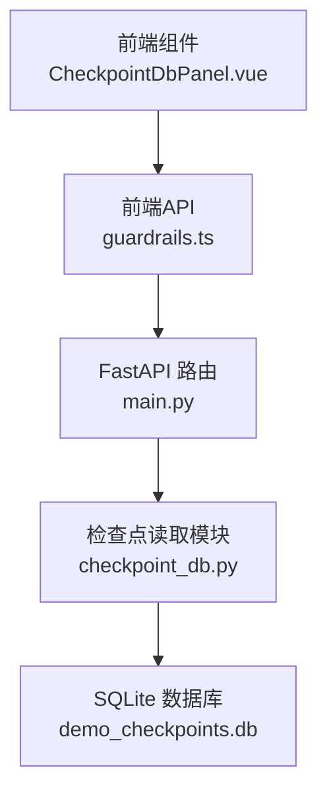
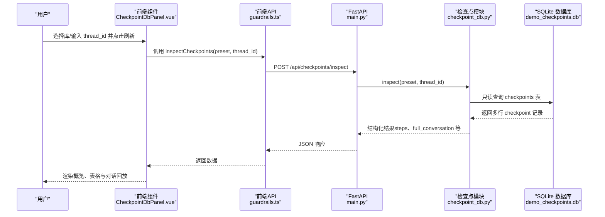
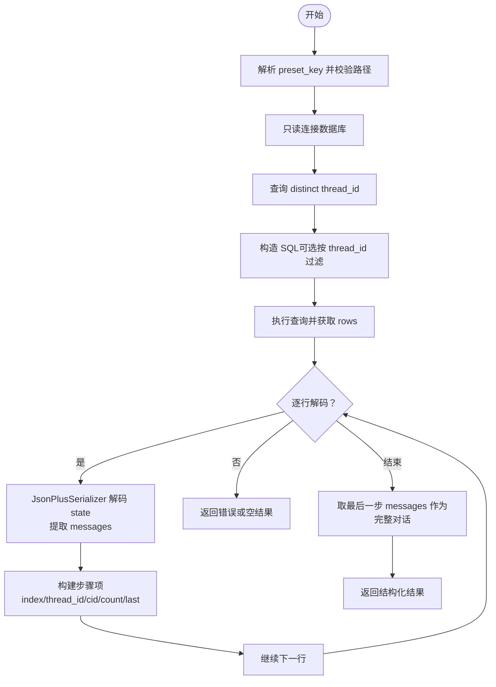
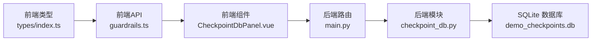

# 检查点数据库面板

<cite>
**本文引用的文件**
- [guardrails-sandbox/backend/playground/checkpoint_db.py](file://guardrails-sandbox/backend/playground/checkpoint_db.py)
- [guardrails-sandbox/backend/main.py](file://guardrails-sandbox/backend/main.py)
- [guardrails-sandbox/frontend/src/components/CheckpointDbPanel.vue](file://guardrails-sandbox/frontend/src/components/CheckpointDbPanel.vue)
- [guardrails-sandbox/frontend/src/api/guardrails.ts](file://guardrails-sandbox/frontend/src/api/guardrails.ts)
- [guardrails-sandbox/frontend/src/types/index.ts](file://guardrails-sandbox/frontend/src/types/index.ts)
- [guardrails-sandbox/backend/playground/modules/checkpoint_viewer.py](file://guardrails-sandbox/backend/playground/modules/checkpoint_viewer.py)
- [guardrails-sandbox/backend/playground/data/demo_checkpoints.db](file://guardrails-sandbox/backend/playground/data/demo_checkpoints.db)
</cite>

## 目录
1. [简介](#简介)
2. [项目结构](#项目结构)
3. [核心组件](#核心组件)
4. [架构总览](#架构总览)
5. [详细组件分析](#详细组件分析)
6. [依赖关系分析](#依赖关系分析)
7. [性能考虑](#性能考虑)
8. [故障排除指南](#故障排除指南)
9. [结论](#结论)
10. [附录](#附录)

## 简介
本文件为“检查点数据库面板（CheckpointDbPanel）”组件的详细技术文档。该组件用于读取并可视化 LangGraph 的 SQLite 检查点数据库，将二进制状态解码为可读的对话轨迹，支持按 thread_id 过滤、概览统计、每步检查点表格以及完整对话回放。后端提供只读访问与严格的路径安全控制，前端提供直观的交互界面与错误提示。

## 项目结构
- 后端 FastAPI 提供 /api/checkpoints/* 接口，封装只读数据库访问与解码逻辑。
- 前端 CheckpointDbPanel.vue 通过 guardrails.ts 发起请求，渲染概览、表格与对话回放。
- 数据库位于后端 playground/data 目录下的 demo_checkpoints.db（演示库）。

图表来源
- [guardrails-sandbox/backend/main.py:389-404](file://guardrails-sandbox/backend/main.py#L389-L404)
- [guardrails-sandbox/backend/playground/checkpoint_db.py:86-148](file://guardrails-sandbox/backend/playground/checkpoint_db.py#L86-L148)
- [guardrails-sandbox/frontend/src/components/CheckpointDbPanel.vue:35-66](file://guardrails-sandbox/frontend/src/components/CheckpointDbPanel.vue#L35-L66)
- [guardrails-sandbox/frontend/src/api/guardrails.ts:155-167](file://guardrails-sandbox/frontend/src/api/guardrails.ts#L155-L167)

章节来源
- [guardrails-sandbox/backend/main.py:389-404](file://guardrails-sandbox/backend/main.py#L389-L404)
- [guardrails-sandbox/backend/playground/checkpoint_db.py:12-47](file://guardrails-sandbox/backend/playground/checkpoint_db.py#L12-L47)
- [guardrails-sandbox/frontend/src/components/CheckpointDbPanel.vue:69-181](file://guardrails-sandbox/frontend/src/components/CheckpointDbPanel.vue#L69-L181)

## 核心组件
- 后端接口
  - GET /api/checkpoints/dbs：列出可用的预置检查点库（当前仅 demo）。
  - POST /api/checkpoints/inspect：根据 preset 与可选 thread_id 读取并解码数据库，返回结构化结果。
- 数据库读取模块
  - list_dbs：枚举预置库及其存在状态。
  - inspect：只读打开数据库，查询 checkpoints 表，按 checkpoint_id 升序返回每步消息与完整对话。
  - 路径安全：限制在 DATA_DIR 内，拒绝目录穿越；数据库以只读模式打开。
- 前端组件
  - CheckpointDbPanel.vue：提供库选择、thread_id 过滤、加载与错误处理，渲染概览卡片、步骤表格与完整对话回放。
- 类型与API
  - guardrails.ts 定义 CheckpointDb、CheckpointMessage、CheckpointStep、CheckpointInspectResult 等类型与请求方法。
  - types/index.ts 提供前端通用类型定义。

章节来源
- [guardrails-sandbox/backend/main.py:389-404](file://guardrails-sandbox/backend/main.py#L389-L404)
- [guardrails-sandbox/backend/playground/checkpoint_db.py:23-148](file://guardrails-sandbox/backend/playground/checkpoint_db.py#L23-L148)
- [guardrails-sandbox/frontend/src/components/CheckpointDbPanel.vue:1-381](file://guardrails-sandbox/frontend/src/components/CheckpointDbPanel.vue#L1-L381)
- [guardrails-sandbox/frontend/src/api/guardrails.ts:120-167](file://guardrails-sandbox/frontend/src/api/guardrails.ts#L120-L167)
- [guardrails-sandbox/frontend/src/types/index.ts:120-161](file://guardrails-sandbox/frontend/src/types/index.ts#L120-L161)

## 架构总览
后端采用 FastAPI 路由封装数据库读取逻辑，前端通过统一 API 请求获取数据并渲染。整体流程如下：

图表来源
- [guardrails-sandbox/backend/main.py:389-404](file://guardrails-sandbox/backend/main.py#L389-L404)
- [guardrails-sandbox/backend/playground/checkpoint_db.py:86-148](file://guardrails-sandbox/backend/playground/checkpoint_db.py#L86-L148)
- [guardrails-sandbox/frontend/src/api/guardrails.ts:159-167](file://guardrails-sandbox/frontend/src/api/guardrails.ts#L159-L167)
- [guardrails-sandbox/frontend/src/components/CheckpointDbPanel.vue:35-52](file://guardrails-sandbox/frontend/src/components/CheckpointDbPanel.vue#L35-L52)

## 详细组件分析

### 后端接口与安全策略
- 路由设计
  - GET /api/checkpoints/dbs：返回预置库清单（key、label、filename、exists）。
  - POST /api/checkpoints/inspect：接收 preset 与 thread_id，返回 ok、db_filename、tables、all_threads、thread_filter、checkpoint_count、steps、full_conversation。
- 安全与合规
  - 只读模式：sqlite3.connect 使用 URI 模式并设置只读（mode=ro）。
  - 路径白名单：仅允许 DATA_DIR 下的预置库，解析后路径必须位于 DATA_DIR 内，防止目录穿越。
  - 表结构校验：要求存在 checkpoints 表，否则视为非 LangGraph 检查点库。
- 数据解码
  - 使用 JsonPlusSerializer 解码 checkpoints 表中的二进制 state，提取 channel_values.messages。
  - 将 LangChain 消息对象映射为前端友好的字典结构（kind、role、content、tool_call）。

章节来源
- [guardrails-sandbox/backend/main.py:389-404](file://guardrails-sandbox/backend/main.py#L389-L404)
- [guardrails-sandbox/backend/playground/checkpoint_db.py:12-47](file://guardrails-sandbox/backend/playground/checkpoint_db.py#L12-L47)
- [guardrails-sandbox/backend/playground/checkpoint_db.py:86-148](file://guardrails-sandbox/backend/playground/checkpoint_db.py#L86-L148)

### 数据库读取与解码流程
- 步骤
  - 解析并校验 preset_key，定位文件路径并进行安全检查。
  - 只读连接数据库，查询所有 thread_id，再按 thread_id 过滤（可选）。
  - 逐行解码 state，生成每步的 messages 列表，并计算 message_count 与 last_message。
  - 以最后一步的 messages 作为完整对话回放。
- 错误处理
  - 对未知库、非法路径、文件不存在、解码失败等情况返回明确错误信息。

图表来源
- [guardrails-sandbox/backend/playground/checkpoint_db.py:86-148](file://guardrails-sandbox/backend/playground/checkpoint_db.py#L86-L148)

章节来源
- [guardrails-sandbox/backend/playground/checkpoint_db.py:86-148](file://guardrails-sandbox/backend/playground/checkpoint_db.py#L86-L148)

### 前端组件与交互
- 功能
  - 自动加载可用数据库列表，选择默认存在的库并触发首次加载。
  - 支持输入 thread_id 进行过滤，回车或点击刷新触发重新加载。
  - 成功时渲染概览卡片（数据库文件、检查点总数、会话数、thread 列表、表名）、步骤表格（步、thread_id、checkpoint_id、消息数、最后消息摘要）与完整对话回放。
  - 失败时显示错误信息。
- 角色与工具调用
  - 角色映射：user、assistant、tool、system，并提供图标与标签。
  - 工具调用：若存在 tool_call，显示调用名称与参数。

章节来源
- [guardrails-sandbox/frontend/src/components/CheckpointDbPanel.vue:1-381](file://guardrails-sandbox/frontend/src/components/CheckpointDbPanel.vue#L1-L381)

### 类型与API契约
- CheckpointDb：后端返回的库描述，包含 key、label、filename、exists。
- CheckpointMessage：消息结构，包含 kind、role、content、tool_call。
- CheckpointStep：每步检查点，包含 index、thread_id、checkpoint_id、message_count、last_message、messages。
- CheckpointInspectResult：最终响应体，包含 ok、error（可选）、db_filename、tables、all_threads、thread_filter、checkpoint_count、steps、full_conversation。
- guardrails.ts 中的 inspectCheckpoints 与 fetchCheckpointDbs 方法分别对应后端 /api/checkpoints/inspect 与 /api/checkpoints/dbs。

章节来源
- [guardrails-sandbox/frontend/src/api/guardrails.ts:120-167](file://guardrails-sandbox/frontend/src/api/guardrails.ts#L120-L167)
- [guardrails-sandbox/frontend/src/types/index.ts:120-161](file://guardrails-sandbox/frontend/src/types/index.ts#L120-L161)

### 与课程实验模块的关系
- 后端还提供一个名为 checkpoint_viewer 的 Playground 模块，功能与 CheckpointDbPanel 类似，但输出为渲染块（blocks）而非结构化 JSON，适合在课程实验台内嵌展示。
- 两者共享相同的数据库读取与解码思路，差异在于输出形态与集成方式。

章节来源
- [guardrails-sandbox/backend/playground/modules/checkpoint_viewer.py:64-206](file://guardrails-sandbox/backend/playground/modules/checkpoint_viewer.py#L64-L206)

## 依赖关系分析
- 组件耦合
  - 前端 CheckpointDbPanel.vue 依赖 guardrails.ts 的 API 方法与 types 中的数据类型。
  - 后端 main.py 依赖 checkpoint_db.py 实现具体业务逻辑。
  - checkpoint_db.py 依赖 sqlite3 与 langgraph.checkpoint.serde.jsonplus.JsonPlusSerializer。
- 外部依赖
  - langgraph 序列化器：用于解码 checkpoints 表中的 typed blob。
  - SQLite：只读访问 demo_checkpoints.db。

图表来源
- [guardrails-sandbox/frontend/src/types/index.ts:120-161](file://guardrails-sandbox/frontend/src/types/index.ts#L120-L161)
- [guardrails-sandbox/frontend/src/api/guardrails.ts:155-167](file://guardrails-sandbox/frontend/src/api/guardrails.ts#L155-L167)
- [guardrails-sandbox/frontend/src/components/CheckpointDbPanel.vue:1-381](file://guardrails-sandbox/frontend/src/components/CheckpointDbPanel.vue#L1-L381)
- [guardrails-sandbox/backend/main.py:389-404](file://guardrails-sandbox/backend/main.py#L389-L404)
- [guardrails-sandbox/backend/playground/checkpoint_db.py:86-148](file://guardrails-sandbox/backend/playground/checkpoint_db.py#L86-L148)

章节来源
- [guardrails-sandbox/backend/main.py:389-404](file://guardrails-sandbox/backend/main.py#L389-L404)
- [guardrails-sandbox/backend/playground/checkpoint_db.py:86-148](file://guardrails-sandbox/backend/playground/checkpoint_db.py#L86-L148)
- [guardrails-sandbox/frontend/src/api/guardrails.ts:155-167](file://guardrails-sandbox/frontend/src/api/guardrails.ts#L155-L167)

## 性能考虑
- 查询优化
  - 仅查询 checkpoints 表的关键列（thread_id、checkpoint_id、type、checkpoint），避免不必要的列扫描。
  - 使用 ORDER BY checkpoint_id 保证顺序一致性，便于前端展示。
- 解码开销
  - 每行 state 需要反序列化，建议在数据量较大时启用 thread_id 过滤以减少解码次数。
- 前端渲染
  - 大量消息时，建议分页或虚拟滚动（可在现有表格基础上扩展）。
  - 对 tool_call 参数进行节流显示，避免长 JSON 导致渲染卡顿。
- I/O 与并发
  - 当前实现为单次请求一次性返回所有步骤，若数据量增长，可考虑分批加载或增量刷新策略。

## 故障排除指南
- “未知的库”或“非法路径”
  - 确认 preset 是否在后端预置库清单中；确保数据库文件位于 DATA_DIR 下。
- “找不到检查点库”
  - 确认 demo_checkpoints.db 是否存在于 backend/playground/data 目录。
- “不是 LangGraph 检查点库（缺 checkpoints 表）”
  - 确认数据库为 SqliteSaver 写入的 LangGraph 检查点库，包含 checkpoints 表。
- “解码失败”
  - 检查 langgraph.checkpoint.serde.jsonplus.JsonPlusSerializer 是否可用；确认 state 的 type 与 blob 格式正确。
- “读取出错”
  - 查看后端异常捕获返回的错误字符串，结合日志定位具体原因。
- 前端错误提示
  - 若出现错误信息，检查网络请求是否成功（状态码 200），并确认后端服务已启动。

章节来源
- [guardrails-sandbox/backend/playground/checkpoint_db.py:37-47](file://guardrails-sandbox/backend/playground/checkpoint_db.py#L37-L47)
- [guardrails-sandbox/backend/playground/checkpoint_db.py:96-99](file://guardrails-sandbox/backend/playground/checkpoint_db.py#L96-L99)
- [guardrails-sandbox/backend/playground/checkpoint_db.py:117-122](file://guardrails-sandbox/backend/playground/checkpoint_db.py#L117-L122)
- [guardrails-sandbox/backend/main.py:398-403](file://guardrails-sandbox/backend/main.py#L398-L403)
- [guardrails-sandbox/frontend/src/components/CheckpointDbPanel.vue:101-101](file://guardrails-sandbox/frontend/src/components/CheckpointDbPanel.vue#L101-L101)

## 结论
CheckpointDbPanel 通过后端只读数据库访问与严格的安全控制，实现了对 LangGraph 检查点数据的高效可视化。前端提供清晰的概览、表格与对话回放，配合 thread_id 过滤满足多会话场景需求。后续可在大数据量场景下引入分页与缓存策略，进一步提升用户体验与性能表现。

## 附录
- 数据库位置
  - demo_checkpoints.db：backend/playground/data/demo_checkpoints.db
- 预置库配置
  - key: demo
  - filename: demo_checkpoints.db
  - label: 课程演示库 (demo_checkpoints.db)
- 前端类型定义
  - CheckpointDb、CheckpointMessage、CheckpointStep、CheckpointInspectResult

章节来源
- [guardrails-sandbox/backend/playground/checkpoint_db.py:14-20](file://guardrails-sandbox/backend/playground/checkpoint_db.py#L14-L20)
- [guardrails-sandbox/backend/playground/data/demo_checkpoints.db](file://guardrails-sandbox/backend/playground/data/demo_checkpoints.db)