# 类型系统设计

<cite>
**本文档引用的文件**
- [index.ts](file://guardrails-sandbox/frontend/src/types/index.ts)
- [guardrails.ts](file://guardrails-sandbox/frontend/src/api/guardrails.ts)
- [AdapterTree.vue](file://guardrails-sandbox/frontend/src/components/AdapterTree.vue)
- [ChatPanel.vue](file://guardrails-sandbox/frontend/src/components/ChatPanel.vue)
- [PlaygroundPanel.vue](file://guardrails-sandbox/frontend/src/components/PlaygroundPanel.vue)
- [App.vue](file://guardrails-sandbox/frontend/src/App.vue)
- [tsconfig.json](file://guardrails-sandbox/frontend/tsconfig.json)
- [tsconfig.node.json](file://guardrails-sandbox/frontend/tsconfig.node.json)
- [vite.config.ts](file://guardrails-sandbox/frontend/vite.config.ts)
- [env.d.ts](file://guardrails-sandbox/frontend/src/env.d.ts)
- [package.json](file://guardrails-sandbox/frontend/package.json)
</cite>

## 目录
1. [简介](#简介)
2. [项目结构](#项目结构)
3. [核心组件](#核心组件)
4. [架构概览](#架构概览)
5. [详细组件分析](#详细组件分析)
6. [依赖关系分析](#依赖关系分析)
7. [性能考虑](#性能考虑)
8. [故障排除指南](#故障排除指南)
9. [结论](#结论)

## 简介

本项目是一个基于Vue 3和TypeScript的AI工程学习实验台前端应用，专注于类型安全的前端开发实践。该类型系统设计涵盖了完整的数据模型定义、组件属性类型、API响应类型以及泛型使用策略，为整个前端应用提供了强类型安全保障。

该项目采用现代化的前端技术栈，包括Vue 3 Composition API、TypeScript 5.4、Vite构建工具，以及严格的类型检查配置。类型系统不仅确保了编译时的安全性，还为开发者提供了优秀的开发体验和IDE智能提示功能。

## 项目结构

前端项目采用清晰的模块化组织结构，类型定义集中在专门的目录中，便于维护和复用：

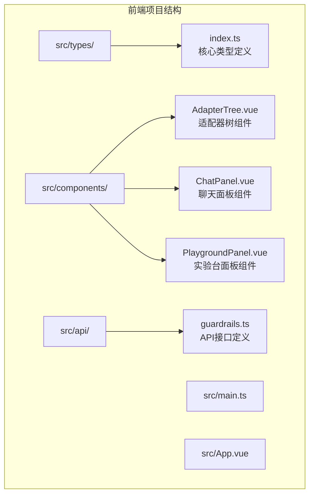

**图表来源**
- [index.ts:1-162](file://guardrails-sandbox/frontend/src/types/index.ts#L1-L162)
- [guardrails.ts:1-168](file://guardrails-sandbox/frontend/src/api/guardrails.ts#L1-L168)

**章节来源**
- [index.ts:1-162](file://guardrails-sandbox/frontend/src/types/index.ts#L1-L162)
- [guardrails.ts:1-168](file://guardrails-sandbox/frontend/src/api/guardrails.ts#L1-L168)

## 核心组件

### 类型系统架构

项目的核心类型系统围绕以下关键概念构建：

#### 数据模型层次结构

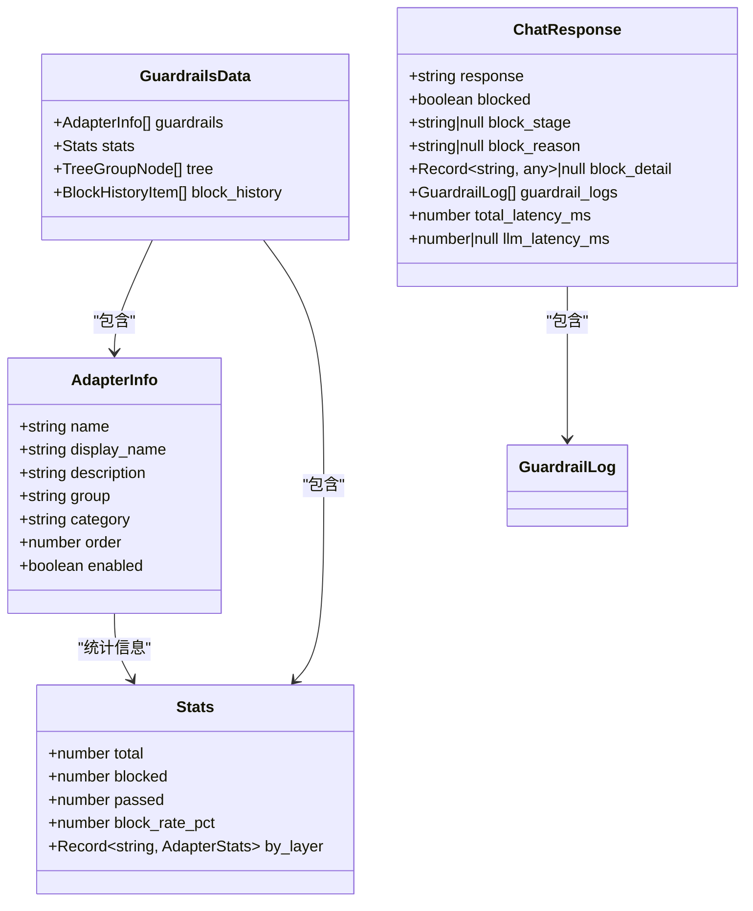

**图表来源**
- [index.ts:1-92](file://guardrails-sandbox/frontend/src/types/index.ts#L1-L92)

#### 组件类型系统

每个Vue组件都定义了明确的props和emits类型，确保组件间通信的类型安全：

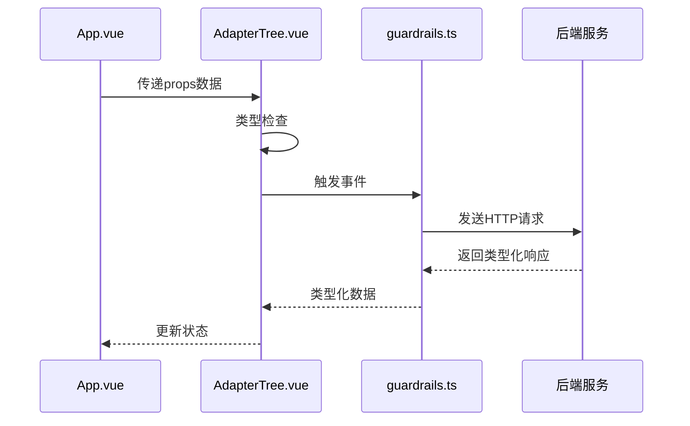

**图表来源**
- [App.vue:1-82](file://guardrails-sandbox/frontend/src/App.vue#L1-L82)
- [AdapterTree.vue:1-50](file://guardrails-sandbox/frontend/src/components/AdapterTree.vue#L1-L50)
- [guardrails.ts:38-47](file://guardrails-sandbox/frontend/src/api/guardrails.ts#L38-L47)

**章节来源**
- [index.ts:1-162](file://guardrails-sandbox/frontend/src/types/index.ts#L1-L162)
- [App.vue:1-82](file://guardrails-sandbox/frontend/src/App.vue#L1-L82)
- [AdapterTree.vue:1-50](file://guardrails-sandbox/frontend/src/components/AdapterTree.vue#L1-L50)

## 架构概览

### 类型安全保证机制

项目采用了多层次的类型安全保证机制：

#### 编译时类型检查

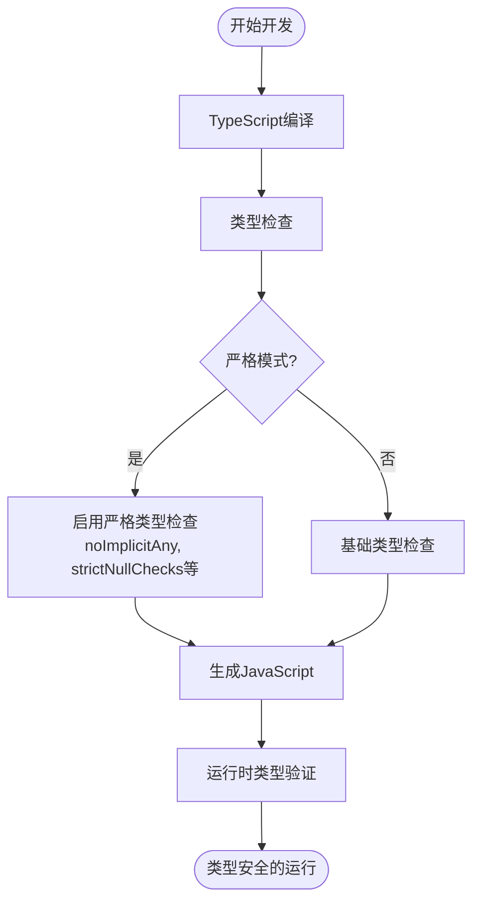

#### 运行时类型验证

项目在运行时也实现了额外的类型验证机制，确保数据的完整性和一致性。

**章节来源**
- [tsconfig.json:1-24](file://guardrails-sandbox/frontend/tsconfig.json#L1-L24)
- [tsconfig.node.json:1-11](file://guardrails-sandbox/frontend/tsconfig.node.json#L1-L11)

## 详细组件分析

### 核心数据模型

#### 适配器系统类型定义

适配器系统是Guardrails的核心组件，其类型定义体现了复杂的层次结构：

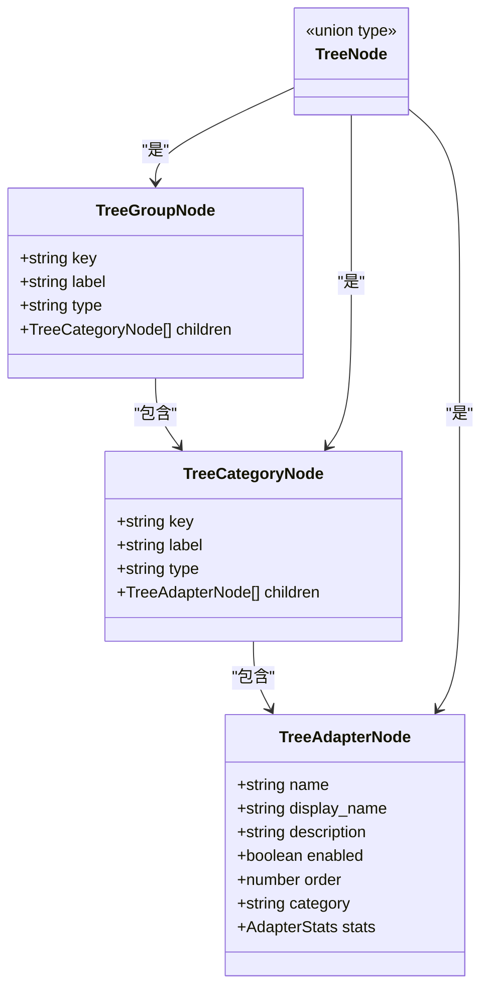

**图表来源**
- [index.ts:17-41](file://guardrails-sandbox/frontend/src/types/index.ts#L17-L41)

#### 聊天响应类型系统

聊天响应类型系统设计体现了复杂的数据流转过程：

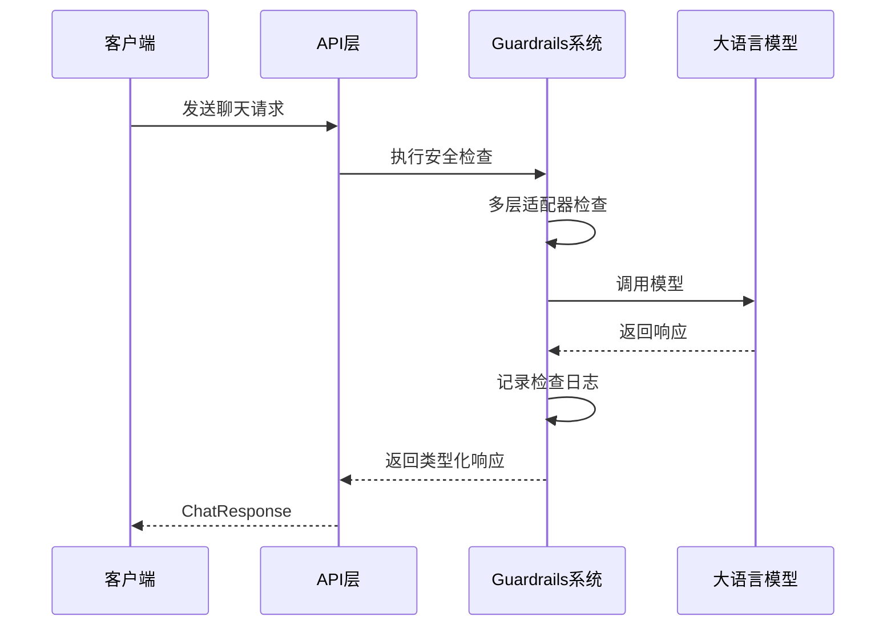

**图表来源**
- [index.ts:71-85](file://guardrails-sandbox/frontend/src/types/index.ts#L71-L85)
- [guardrails.ts:49-66](file://guardrails-sandbox/frontend/src/api/guardrails.ts#L49-L66)

**章节来源**
- [index.ts:17-92](file://guardrails-sandbox/frontend/src/types/index.ts#L17-L92)
- [guardrails.ts:49-81](file://guardrails-sandbox/frontend/src/api/guardrails.ts#L49-L81)

### 组件属性类型系统

#### Vue组件类型定义

每个Vue组件都明确定义了props和emits类型，确保组件间的类型安全：

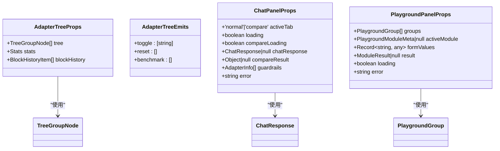

**图表来源**
- [AdapterTree.vue:5-15](file://guardrails-sandbox/frontend/src/components/AdapterTree.vue#L5-L15)
- [ChatPanel.vue:5-13](file://guardrails-sandbox/frontend/src/components/ChatPanel.vue#L5-L13)
- [PlaygroundPanel.vue:2-11](file://guardrails-sandbox/frontend/src/components/PlaygroundPanel.vue#L2-L11)

**章节来源**
- [AdapterTree.vue:1-50](file://guardrails-sandbox/frontend/src/components/AdapterTree.vue#L1-L50)
- [ChatPanel.vue:1-20](file://guardrails-sandbox/frontend/src/components/ChatPanel.vue#L1-L20)
- [PlaygroundPanel.vue:1-20](file://guardrails-sandbox/frontend/src/components/PlaygroundPanel.vue#L1-L20)

### API响应类型系统

#### 异步API类型定义

API层的类型定义确保了前后端数据交换的一致性：

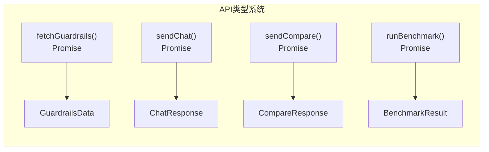

**图表来源**
- [guardrails.ts:38-100](file://guardrails-sandbox/frontend/src/api/guardrails.ts#L38-L100)

**章节来源**
- [guardrails.ts:1-168](file://guardrails-sandbox/frontend/src/api/guardrails.ts#L1-L168)

## 依赖关系分析

### 类型导入和导出机制

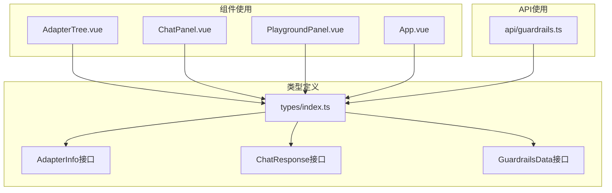

**图表来源**
- [index.ts:1-162](file://guardrails-sandbox/frontend/src/types/index.ts#L1-L162)
- [AdapterTree.vue:1-5](file://guardrails-sandbox/frontend/src/components/AdapterTree.vue#L1-L5)
- [ChatPanel.vue:1-5](file://guardrails-sandbox/frontend/src/components/ChatPanel.vue#L1-L5)
- [PlaygroundPanel.vue:1-5](file://guardrails-sandbox/frontend/src/components/PlaygroundPanel.vue#L1-L5)
- [App.vue:1-10](file://guardrails-sandbox/frontend/src/App.vue#L1-L10)
- [guardrails.ts:1-10](file://guardrails-sandbox/frontend/src/api/guardrails.ts#L1-L10)

### 类型扩展机制

项目采用了灵活的类型扩展机制，支持向后兼容性和渐进式增强：

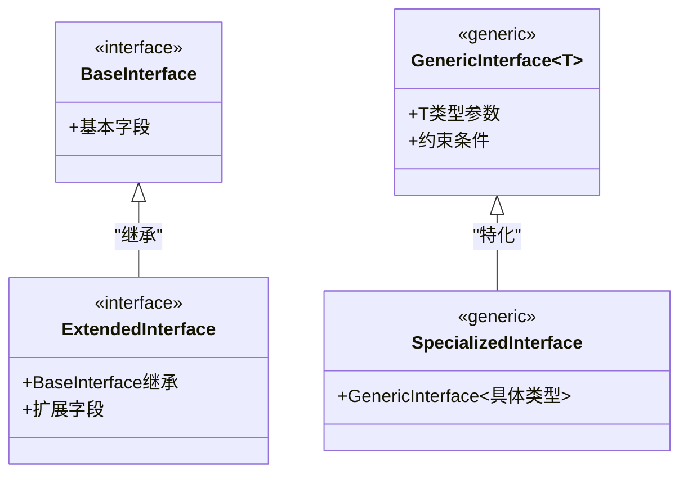

**章节来源**
- [index.ts:1-162](file://guardrails-sandbox/frontend/src/types/index.ts#L1-L162)

## 性能考虑

### 类型检查性能优化

项目在TypeScript配置中采用了多项性能优化策略：

#### 编译配置优化

- **模块解析优化**: 使用`bundler`模块解析器，提高大型项目的编译速度
- **跳过库检查**: `skipLibCheck: true`跳过第三方库的类型检查，减少编译时间
- **隔离模块**: `isolatedModules: true`支持增量编译和更好的IDE体验

#### 运行时性能考虑

- **类型擦除**: TypeScript编译后生成的JavaScript不包含类型信息，不影响运行时性能
- **编译时优化**: 严格类型检查在编译阶段完成，运行时不进行额外的类型验证

## 故障排除指南

### 常见类型错误处理

#### 编译时错误诊断

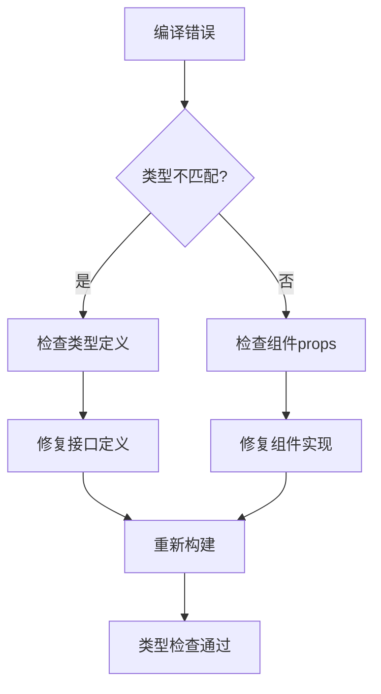

#### 运行时类型验证

项目实现了运行时类型验证机制，帮助捕获潜在的类型问题：

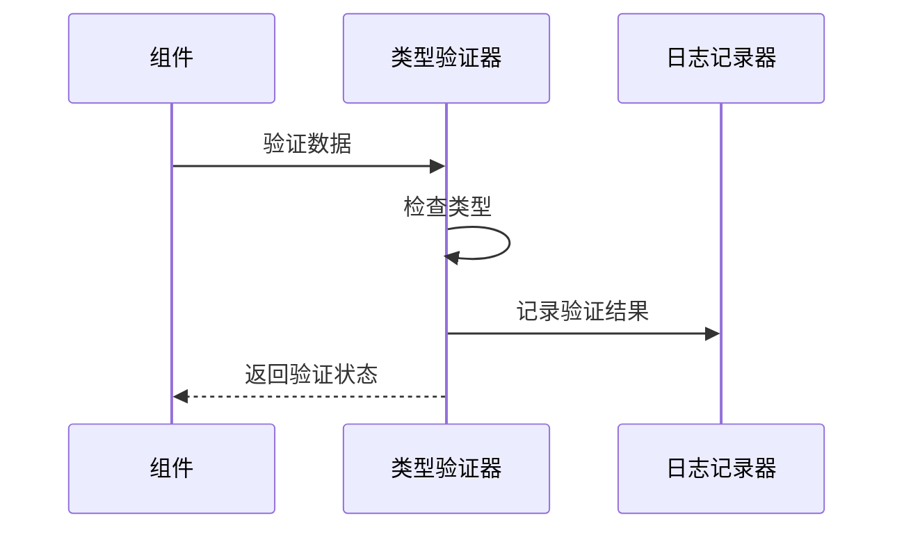

**章节来源**
- [tsconfig.json:1-24](file://guardrails-sandbox/frontend/tsconfig.json#L1-L24)

## 结论

本项目的前端类型系统设计体现了现代TypeScript开发的最佳实践，通过精心设计的数据模型、组件类型定义和API接口，为整个应用提供了全面的类型安全保障。

### 主要成就

1. **完整的类型层次结构**: 从基础接口到复杂的数据模型，形成了清晰的类型体系
2. **组件级别的类型安全**: 每个Vue组件都有明确的props和emits类型定义
3. **API接口的强类型约束**: 确保前后端数据交换的一致性和可靠性
4. **灵活的扩展机制**: 支持向后兼容性和渐进式功能增强
5. **性能优化的编译配置**: 在保证类型安全的同时优化了开发体验

### 技术特色

- **严格模式配置**: 启用了所有TypeScript严格检查选项
- **泛型使用策略**: 合理使用泛型提高代码复用性
- **接口扩展机制**: 支持向后兼容性的接口设计
- **运行时验证**: 结合编译时检查提供双重安全保障

这个类型系统设计为AI工程学习实验台提供了坚实的技术基础，确保了代码质量和开发效率，同时为未来的功能扩展奠定了良好的基础。