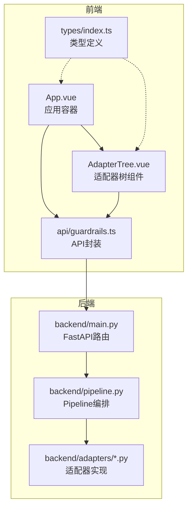
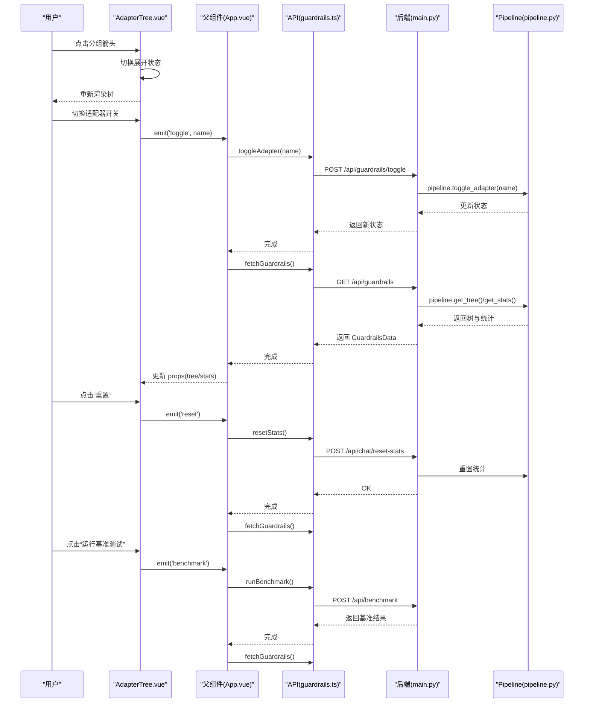
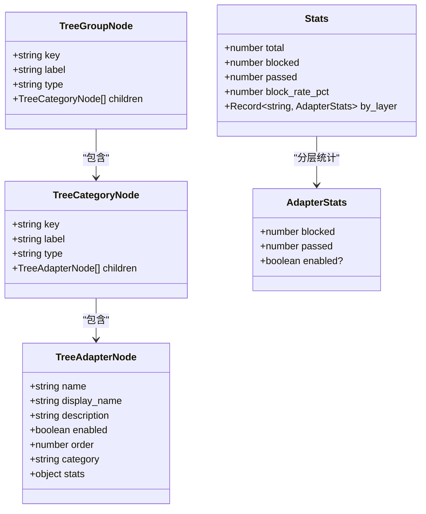
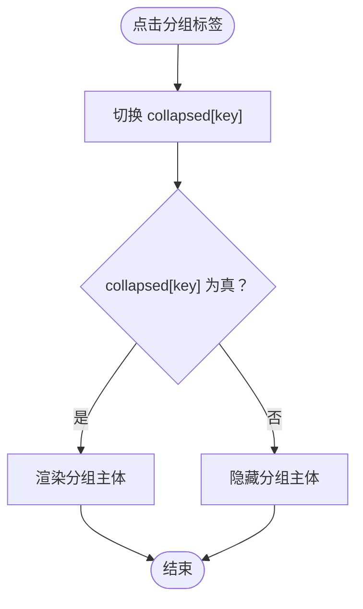
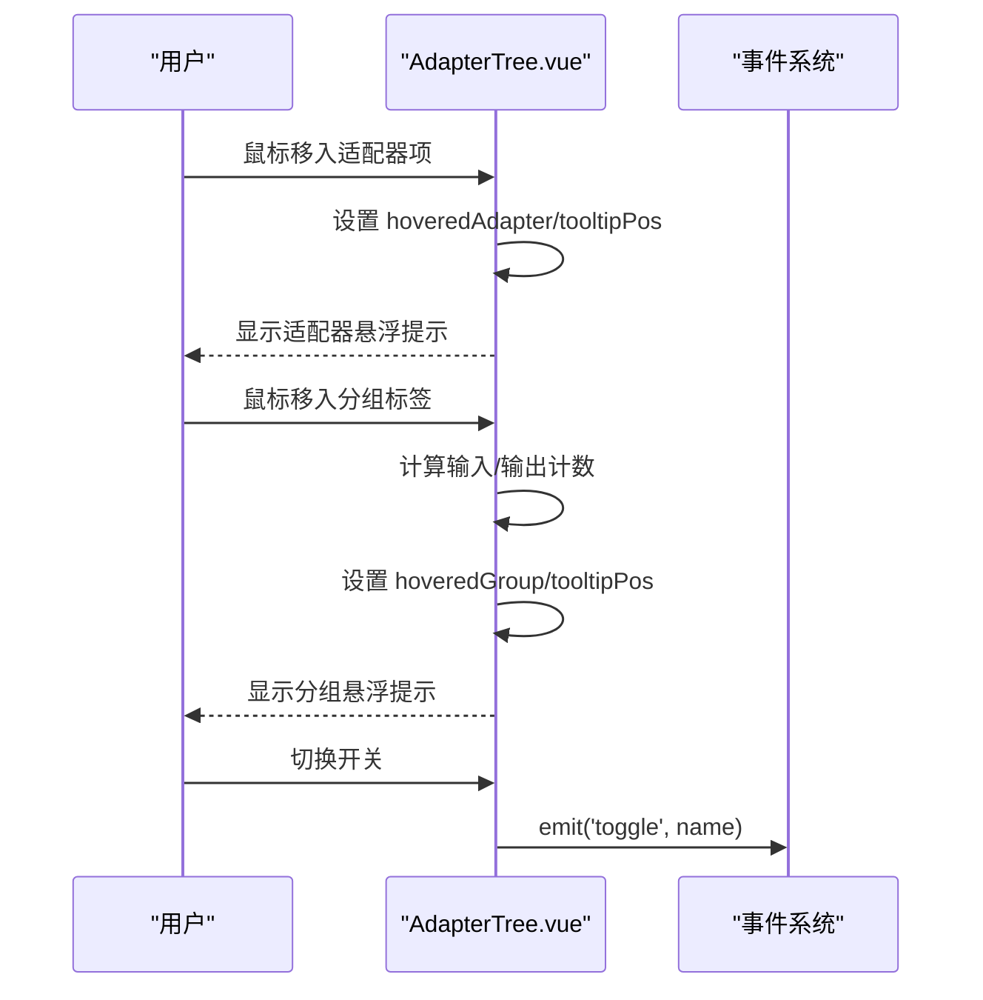
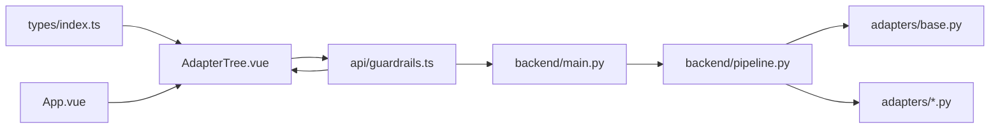

# 适配器树组件

<cite>
**本文档引用的文件**
- [AdapterTree.vue](file://guardrails-sandbox/frontend/src/components/AdapterTree.vue)
- [index.ts](file://guardrails-sandbox/frontend/src/types/index.ts)
- [App.vue](file://guardrails-sandbox/frontend/src/App.vue)
- [guardrails.ts](file://guardrails-sandbox/frontend/src/api/guardrails.ts)
- [main.py](file://guardrails-sandbox/backend/main.py)
- [pipeline.py](file://guardrails-sandbox/backend/pipeline.py)
- [base.py](file://guardrails-sandbox/backend/adapters/base.py)
- [injection.py](file://guardrails-sandbox/backend/adapters/injection.py)
- [format_validator.py](file://guardrails-sandbox/backend/adapters/format_validator.py)
- [topic_classifier.py](file://guardrails-sandbox/backend/adapters/topic_classifier.py)
- [__init__.py](file://guardrails-sandbox/backend/adapters/__init__.py)
</cite>

## 目录
1. [简介](#简介)
2. [项目结构](#项目结构)
3. [核心组件](#核心组件)
4. [架构总览](#架构总览)
5. [详细组件分析](#详细组件分析)
6. [依赖关系分析](#依赖关系分析)
7. [性能考虑](#性能考虑)
8. [故障排查指南](#故障排查指南)
9. [结论](#结论)
10. [附录](#附录)

## 简介
适配器树组件（AdapterTree）是防护墙沙箱前端的核心可视化组件，用于以树形结构展示和管理所有可用的防护墙适配器。它提供以下能力：
- 树形层级展示：按“分组 → 分类 → 适配器”三层结构组织
- 展开/折叠控制：支持按分组维度展开/折叠
- 交互开关：每个适配器项提供开关控件进行启用/禁用
- 悬浮提示：鼠标悬停显示适配器详情、机制、影响与统计
- 统计面板：展示拦截总数、通过数、拦截率及分层统计
- 批量操作：支持重置统计、运行基准测试
- 事件驱动：向上抛出切换、重置、基准测试等事件供父组件处理

该组件与后端 Pipeline 协作，通过 API 获取适配器树、统计数据与拦截历史，并响应用户的交互操作。

## 项目结构
前端采用 Vue 3 + TypeScript 构建，组件位于 frontend/src/components；类型定义位于 frontend/src/types；API 请求封装于 frontend/src/api；后端使用 Python + FastAPI，适配器实现位于 backend/adapters，编排逻辑位于 backend/pipeline.py。

图表来源
- [App.vue:124-132](file://guardrails-sandbox/frontend/src/App.vue#L124-L132)
- [AdapterTree.vue:11-15](file://guardrails-sandbox/frontend/src/components/AdapterTree.vue#L11-L15)
- [guardrails.ts:38-47](file://guardrails-sandbox/frontend/src/api/guardrails.ts#L38-L47)
- [main.py:121-128](file://guardrails-sandbox/backend/main.py#L121-L128)
- [pipeline.py:188-235](file://guardrails-sandbox/backend/pipeline.py#L188-L235)
- [index.ts:17-49](file://guardrails-sandbox/frontend/src/types/index.ts#L17-L49)

章节来源
- [App.vue:124-132](file://guardrails-sandbox/frontend/src/App.vue#L124-L132)
- [AdapterTree.vue:1-716](file://guardrails-sandbox/frontend/src/components/AdapterTree.vue#L1-L716)
- [index.ts:1-162](file://guardrails-sandbox/frontend/src/types/index.ts#L1-L162)
- [guardrails.ts:1-168](file://guardrails-sandbox/frontend/src/api/guardrails.ts#L1-L168)
- [main.py:1-421](file://guardrails-sandbox/backend/main.py#L1-L421)
- [pipeline.py:1-285](file://guardrails-sandbox/backend/pipeline.py#L1-L285)

## 核心组件
- 组件名称：AdapterTree
- 文件路径：guardrails-sandbox/frontend/src/components/AdapterTree.vue
- 角色定位：防护墙适配器的可视化与交互中心，负责树形展示、状态显示、事件转发与样式呈现
- 关键职责：
  - 渲染树形结构（分组、分类、适配器）
  - 维护展开状态与悬停状态
  - 提供开关控件与悬浮提示
  - 计算并展示统计信息
  - 暴露事件给父组件（切换、重置、基准测试）

章节来源
- [AdapterTree.vue:1-716](file://guardrails-sandbox/frontend/src/components/AdapterTree.vue#L1-L716)

## 架构总览
前端通过 API 获取后端 Pipeline 生成的树形数据与统计信息，组件内部维护本地状态（展开/悬停），并通过事件与父组件协同完成开关、重置、基准测试等操作。

图表来源
- [AdapterTree.vue:11-15](file://guardrails-sandbox/frontend/src/components/AdapterTree.vue#L11-L15)
- [App.vue:66-79](file://guardrails-sandbox/frontend/src/App.vue#L66-L79)
- [guardrails.ts:42-100](file://guardrails-sandbox/frontend/src/api/guardrails.ts#L42-L100)
- [main.py:147-152](file://guardrails-sandbox/backend/main.py#L147-L152)
- [pipeline.py:237-245](file://guardrails-sandbox/backend/pipeline.py#L237-L245)

## 详细组件分析

### 数据结构设计
组件接收三类数据：
- tree：树形结构数组，元素为分组节点，包含子分类节点，再包含适配器节点
- stats：全局统计信息，包含总量、拦截数、通过数、拦截率及分层统计
- blockHistory：拦截历史，用于右侧历史面板

图表来源
- [index.ts:17-49](file://guardrails-sandbox/frontend/src/types/index.ts#L17-L49)

章节来源
- [index.ts:17-49](file://guardrails-sandbox/frontend/src/types/index.ts#L17-L49)
- [AdapterTree.vue:5-9](file://guardrails-sandbox/frontend/src/components/AdapterTree.vue#L5-L9)

### 节点展开/折叠逻辑
- 状态管理：使用响应式对象记录每个分组的展开状态
- 交互方式：点击分组标签触发切换；根据状态决定是否渲染分组主体
- 箭头指示：根据展开状态显示“▼/▶”，直观反馈当前状态

图表来源
- [AdapterTree.vue:22-28](file://guardrails-sandbox/frontend/src/components/AdapterTree.vue#L22-L28)

章节来源
- [AdapterTree.vue:22-28](file://guardrails-sandbox/frontend/src/components/AdapterTree.vue#L22-L28)

### 适配器状态显示与交互
- 开关控件：每个适配器项右侧提供开关，绑定到适配器的 enabled 字段
- 事件传播：开关变更时向上抛出 toggle 事件，携带适配器名称
- 悬浮提示：
  - 适配器悬浮：显示描述、启用状态、分类、顺序、机制、影响、适用场景与统计
  - 分组悬浮：显示分组图标、名称、描述、输入/输出适配器数量
- 鼠标跟踪：记录坐标并在 Teleport 到 body 的提示框中定位

图表来源
- [AdapterTree.vue:30-54](file://guardrails-sandbox/frontend/src/components/AdapterTree.vue#L30-L54)
- [AdapterTree.vue:245-252](file://guardrails-sandbox/frontend/src/components/AdapterTree.vue#L245-L252)

章节来源
- [AdapterTree.vue:30-54](file://guardrails-sandbox/frontend/src/components/AdapterTree.vue#L30-L54)
- [AdapterTree.vue:245-252](file://guardrails-sandbox/frontend/src/components/AdapterTree.vue#L245-L252)

### 统计面板与拦截历史
- 统计栏：展示总量、拦截、通过、拦截率
- 分层统计：通过 by_layer 提供每个适配器的通过/拦截计数
- 拦截历史：记录最近的拦截事件，包含时间戳、输入片段、适配器名、阶段、原因、置信度与细节

章节来源
- [AdapterTree.vue:193-210](file://guardrails-sandbox/frontend/src/components/AdapterTree.vue#L193-L210)
- [index.ts:43-59](file://guardrails-sandbox/frontend/src/types/index.ts#L43-L59)
- [pipeline.py:247-262](file://guardrails-sandbox/backend/pipeline.py#L247-L262)
- [pipeline.py:264-284](file://guardrails-sandbox/backend/pipeline.py#L264-L284)

### 适配器分类展示
- 分组：如“Guardrails 基础”、“Prompt 工程”、“Few-Shot & CoT”、“结构化输出”、“RAG”、“缓存与成本”
- 分类：input（输入检查）与 output（输出检查）
- 适配器：每个适配器包含名称、显示名、描述、启用状态、顺序、分类与统计

章节来源
- [AdapterTree.vue:76-86](file://guardrails-sandbox/frontend/src/components/AdapterTree.vue#L76-L86)
- [AdapterTree.vue:176-178](file://guardrails-sandbox/frontend/src/components/AdapterTree.vue#L176-L178)
- [pipeline.py:188-235](file://guardrails-sandbox/backend/pipeline.py#L188-L235)

### 搜索过滤功能
- 当前实现：组件未内置搜索过滤逻辑
- 建议方案：
  - 在父组件 App.vue 中维护搜索关键词，将过滤后的 tree 传入组件
  - 或在组件内增加本地搜索状态，通过 computed 计算过滤结果
- 注意：若采用本地过滤，需同步更新统计与历史面板

[本节为概念性建议，不直接分析具体文件]

### 批量操作支持
- 重置统计：清除全局与分层统计，清空拦截历史
- 运行基准测试：触发后端基准测试，返回结果并刷新数据
- 事件接口：组件通过 emit('reset') 和 emit('benchmark') 通知父组件

章节来源
- [AdapterTree.vue:11-15](file://guardrails-sandbox/frontend/src/components/AdapterTree.vue#L11-L15)
- [App.vue:71-79](file://guardrails-sandbox/frontend/src/App.vue#L71-L79)
- [guardrails.ts:91-100](file://guardrails-sandbox/frontend/src/api/guardrails.ts#L91-L100)
- [main.py:259-265](file://guardrails-sandbox/backend/main.py#L259-L265)

### 组件属性配置
- tree：TreeGroupNode[]，必填
- stats：Stats，必填
- blockHistory：BlockHistoryItem[]，必填
- 事件：
  - toggle(name: string)：切换适配器启用状态
  - reset()：重置统计
  - benchmark()：运行基准测试

章节来源
- [AdapterTree.vue:5-15](file://guardrails-sandbox/frontend/src/components/AdapterTree.vue#L5-L15)

### 事件处理与样式定制
- 事件处理：父组件监听并调用 API，刷新数据后重新渲染
- 样式定制：组件提供 scoped 与全局样式，可通过变量覆盖主题色、边框、圆角等

章节来源
- [AdapterTree.vue:559-581](file://guardrails-sandbox/frontend/src/components/AdapterTree.vue#L559-L581)
- [App.vue:162-299](file://guardrails-sandbox/frontend/src/App.vue#L162-L299)

### 实际使用示例
- 在 App.vue 中引入组件，传入 tree、stats、blockHistory，并绑定事件处理器
- 事件处理器通过 API 调用后端，随后再次拉取数据以刷新视图

章节来源
- [App.vue:124-132](file://guardrails-sandbox/frontend/src/App.vue#L124-L132)
- [App.vue:66-79](file://guardrails-sandbox/frontend/src/App.vue#L66-L79)

### 最佳实践
- 保持分组与分类命名一致性，便于用户理解
- 为每个适配器提供清晰的描述与适用场景，提升可运维性
- 对高频交互（开关、悬浮）进行防抖或节流，避免频繁重渲染
- 在父组件中统一处理错误与加载状态，提升用户体验

[本节为通用建议，不直接分析具体文件]

## 依赖关系分析
- 组件依赖：
  - 类型定义：TreeGroupNode、TreeCategoryNode、TreeAdapterNode、Stats、BlockHistoryItem
  - API：fetchGuardrails、toggleAdapter、resetStats、runBenchmark
  - 父组件：App.vue
- 后端依赖：
  - Pipeline：注册适配器、构建树形结构、统计与拦截历史
  - 适配器：继承 GuardrailAdapter，实现 check() 方法

图表来源
- [index.ts:17-49](file://guardrails-sandbox/frontend/src/types/index.ts#L17-L49)
- [AdapterTree.vue:1-716](file://guardrails-sandbox/frontend/src/components/AdapterTree.vue#L1-L716)
- [guardrails.ts:1-168](file://guardrails-sandbox/frontend/src/api/guardrails.ts#L1-L168)
- [App.vue:1-300](file://guardrails-sandbox/frontend/src/App.vue#L1-L300)
- [main.py:1-421](file://guardrails-sandbox/backend/main.py#L1-L421)
- [pipeline.py:1-285](file://guardrails-sandbox/backend/pipeline.py#L1-L285)
- [base.py:1-34](file://guardrails-sandbox/backend/adapters/base.py#L1-L34)

章节来源
- [index.ts:1-162](file://guardrails-sandbox/frontend/src/types/index.ts#L1-L162)
- [AdapterTree.vue:1-716](file://guardrails-sandbox/frontend/src/components/AdapterTree.vue#L1-L716)
- [guardrails.ts:1-168](file://guardrails-sandbox/frontend/src/api/guardrails.ts#L1-L168)
- [App.vue:1-300](file://guardrails-sandbox/frontend/src/App.vue#L1-L300)
- [main.py:1-421](file://guardrails-sandbox/backend/main.py#L1-L421)
- [pipeline.py:1-285](file://guardrails-sandbox/backend/pipeline.py#L1-L285)
- [base.py:1-34](file://guardrails-sandbox/backend/adapters/base.py#L1-L34)

## 性能考虑
- 渲染优化：
  - 使用 v-show 控制分组主体显隐，减少 DOM 重建
  - 适配器列表使用 v-for 并提供稳定 key，避免不必要的重排
- 事件处理：
  - 开关切换与悬浮事件在组件内处理，避免跨组件通信开销
- 数据更新：
  - 通过 API 拉取最新数据，确保视图与后端状态一致
- 大数据集：
  - 若适配器数量增长，可考虑虚拟滚动或分页展示

[本节提供一般性指导，不直接分析具体文件]

## 故障排查指南
- 无法加载适配器树：
  - 检查后端 /api/guardrails 是否返回正确数据
  - 确认前端 API 请求是否超时或返回错误
- 开关无效：
  - 确认父组件 handleToggle 是否调用 toggleAdapter 并重新拉取数据
  - 检查后端 pipeline.toggle_adapter 是否成功切换状态
- 统计不更新：
  - 确认 resetStats 是否被调用并清空历史
  - 检查后端统计逻辑与拦截历史记录
- 悬浮提示异常：
  - 检查 Teleport 是否正确挂载到 body
  - 确认鼠标事件回调是否正确设置坐标

章节来源
- [guardrails.ts:14-36](file://guardrails-sandbox/frontend/src/api/guardrails.ts#L14-L36)
- [main.py:147-152](file://guardrails-sandbox/backend/main.py#L147-L152)
- [pipeline.py:237-245](file://guardrails-sandbox/backend/pipeline.py#L237-L245)
- [AdapterTree.vue:266-351](file://guardrails-sandbox/frontend/src/components/AdapterTree.vue#L266-L351)

## 结论
适配器树组件通过清晰的三层结构与直观的交互设计，有效支撑了防护墙适配器的可视化管理。结合后端 Pipeline 的编排能力，实现了从数据到界面的完整闭环。建议在后续迭代中增强搜索过滤与虚拟滚动能力，进一步提升大规模场景下的可用性与性能。

[本节为总结性内容，不直接分析具体文件]

## 附录

### 适配器实现示例（节选）
- 注入检测（输入）：基于正则匹配与编码绕过检测
- 格式校验（输出）：JSON/Markdown/空输出检测
- 话题分类（输入）：白名单/黑名单匹配

章节来源
- [injection.py:44-88](file://guardrails-sandbox/backend/adapters/injection.py#L44-L88)
- [format_validator.py:13-86](file://guardrails-sandbox/backend/adapters/format_validator.py#L13-L86)
- [topic_classifier.py:20-54](file://guardrails-sandbox/backend/adapters/topic_classifier.py#L20-L54)

### 适配器注册与树构建
- 后端通过 Pipeline.register 注册适配器实例
- Pipeline.get_tree 将适配器按 group/category/order 组织为树形结构

章节来源
- [main.py:24-58](file://guardrails-sandbox/backend/main.py#L24-L58)
- [pipeline.py:18-24](file://guardrails-sandbox/backend/pipeline.py#L18-L24)
- [pipeline.py:188-235](file://guardrails-sandbox/backend/pipeline.py#L188-L235)