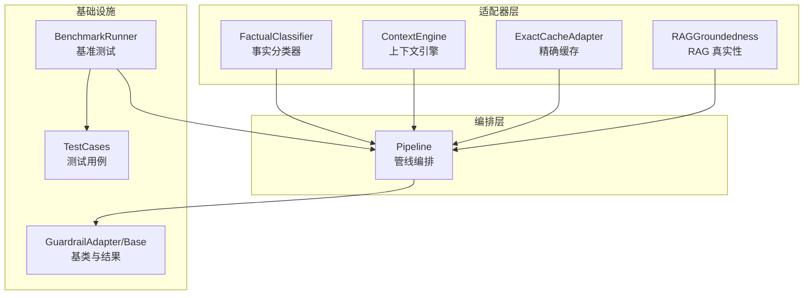
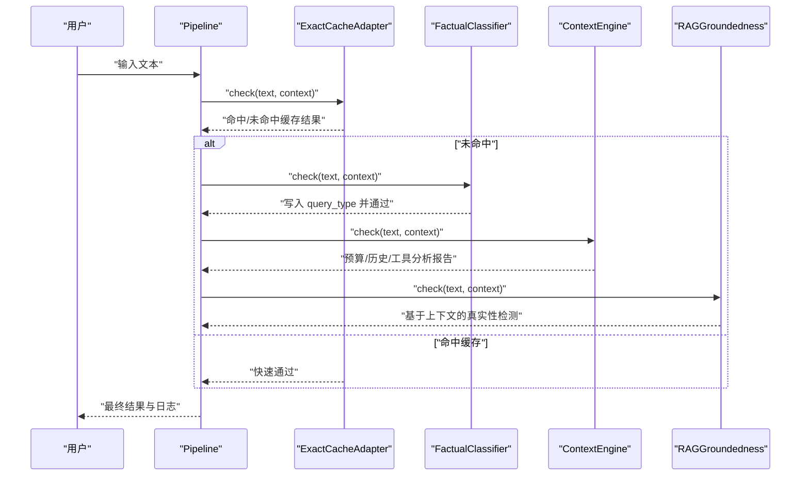
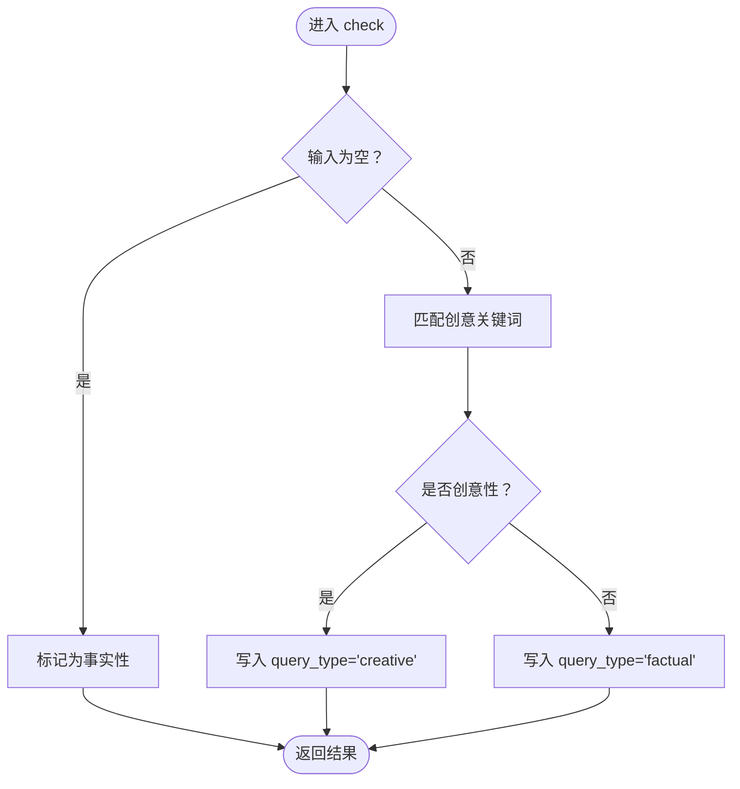
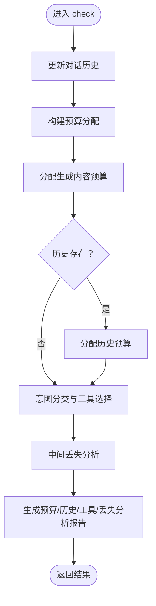
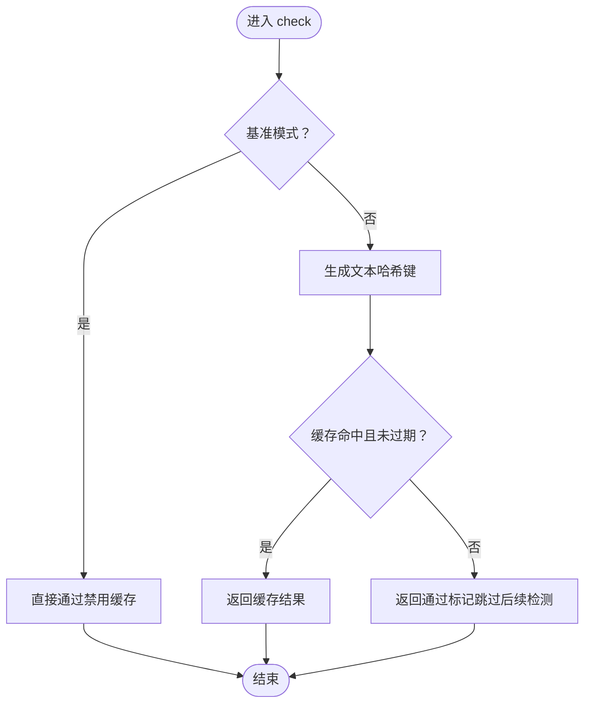
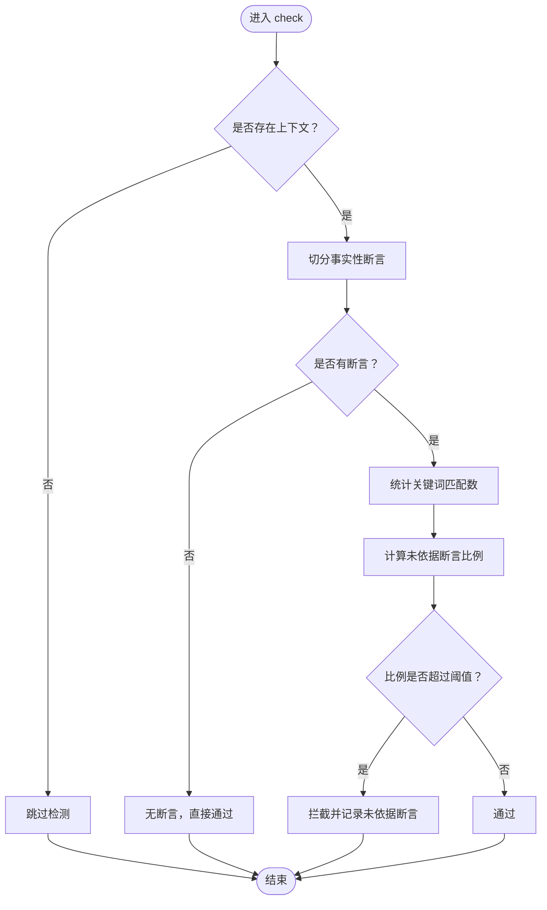
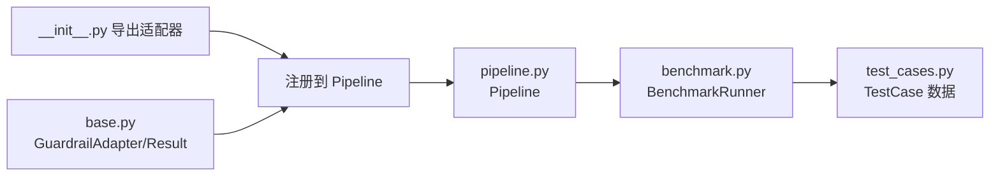

# 内容完整性适配器

<cite>
**本文档引用的文件**
- [factual_classifier.py](file://guardrails-sandbox/backend/adapters/factual_classifier.py)
- [context_engine.py](file://guardrails-sandbox/backend/adapters/context_engine.py)
- [exact_cache.py](file://guardrails-sandbox/backend/adapters/exact_cache.py)
- [rag_groundedness.py](file://guardrails-sandbox/backend/adapters/rag_groundedness.py)
- [base.py](file://guardrails-sandbox/backend/adapters/base.py)
- [pipeline.py](file://guardrails-sandbox/backend/pipeline.py)
- [__init__.py](file://guardrails-sandbox/backend/adapters/__init__.py)
- [benchmark.py](file://guardrails-sandbox/backend/benchmark.py)
- [test_cases.py](file://guardrails-sandbox/backend/test_cases.py)
</cite>

## 目录
1. [简介](#简介)
2. [项目结构](#项目结构)
3. [核心组件](#核心组件)
4. [架构总览](#架构总览)
5. [组件详解](#组件详解)
6. [依赖关系分析](#依赖关系分析)
7. [性能考量](#性能考量)
8. [故障排查指南](#故障排查指南)
9. [结论](#结论)
10. [附录](#附录)

## 简介
本文件聚焦于内容完整性适配器体系，围绕以下四个关键适配器展开：事实分类器（factual_classifier）、上下文引擎（context_engine）、精确缓存（exact_cache）、RAG 真实性（rag_groundedness）。我们将解释它们在保障生成内容的事实准确性、上下文相关性与信息一致性方面的职责与实现机制，并给出配置建议、性能优化策略与边界情况处理方案。

## 项目结构
内容完整性适配器位于 guardrails-sandbox 后端目录下的 adapters 子模块，配合通用的 GuardrailAdapter 基类与 Pipeline 编排框架共同工作。适配器通过统一的接口定义与执行顺序控制，实现输入/输出阶段的多层安全与质量保障。

图示来源
- [pipeline.py:12-285](file://guardrails-sandbox/backend/pipeline.py#L12-L285)
- [base.py:5-34](file://guardrails-sandbox/backend/adapters/base.py#L5-L34)
- [factual_classifier.py:20-55](file://guardrails-sandbox/backend/adapters/factual_classifier.py#L20-L55)
- [context_engine.py:179-251](file://guardrails-sandbox/backend/adapters/context_engine.py#L179-L251)
- [exact_cache.py:12-69](file://guardrails-sandbox/backend/adapters/exact_cache.py#L12-L69)
- [rag_groundedness.py:16-100](file://guardrails-sandbox/backend/adapters/rag_groundedness.py#L16-L100)
- [benchmark.py:10-169](file://guardrails-sandbox/backend/benchmark.py#L10-L169)
- [test_cases.py:10-155](file://guardrails-sandbox/backend/test_cases.py#L10-L155)

章节来源
- [pipeline.py:12-285](file://guardrails-sandbox/backend/pipeline.py#L12-L285)
- [base.py:5-34](file://guardrails-sandbox/backend/adapters/base.py#L5-L34)

## 核心组件
- 事实分类器（FactualClassifier）
  - 作用：识别查询类型（事实性/创意性），为后续适配器提供动态阈值与上下文策略依据。
  - 特点：轻量关键词匹配，永不拦截，仅写入上下文标记。
- 上下文引擎（ContextEngine）
  - 作用：跟踪 Token 预算、压缩对话历史、分析“中间丢失”效应、动态选择工具。
  - 特点：全局预算与历史实例，输出预算报告与工具选择建议。
- 精确缓存（ExactCacheAdapter）
  - 作用：对相同输入的 Guardrail 结果进行缓存，避免重复检测。
  - 特点：SHA256 键、TTL 过期、容量淘汰、支持基准模式跳过。
- RAG 真实性（RAGGroundedness）
  - 作用：检测 LLM 输出是否基于给定上下文，防止幻觉。
  - 特点：事实性断言提取、关键词匹配、阈值判定、置信度估计。

章节来源
- [factual_classifier.py:20-55](file://guardrails-sandbox/backend/adapters/factual_classifier.py#L20-L55)
- [context_engine.py:179-251](file://guardrails-sandbox/backend/adapters/context_engine.py#L179-L251)
- [exact_cache.py:12-69](file://guardrails-sandbox/backend/adapters/exact_cache.py#L12-L69)
- [rag_groundedness.py:16-100](file://guardrails-sandbox/backend/adapters/rag_groundedness.py#L16-L100)

## 架构总览
内容完整性适配器遵循“输入阶段短路 + 输出阶段细检”的双阶段策略。Pipeline 负责按类别与顺序调度各适配器，遇到拦截即短路，否则汇总日志与结果。

图示来源
- [pipeline.py:31-84](file://guardrails-sandbox/backend/pipeline.py#L31-L84)
- [exact_cache.py:44-69](file://guardrails-sandbox/backend/adapters/exact_cache.py#L44-L69)
- [factual_classifier.py:29-55](file://guardrails-sandbox/backend/adapters/factual_classifier.py#L29-L55)
- [context_engine.py:188-242](file://guardrails-sandbox/backend/adapters/context_engine.py#L188-L242)
- [rag_groundedness.py:25-99](file://guardrails-sandbox/backend/adapters/rag_groundedness.py#L25-L99)

## 组件详解

### 事实分类器（FactualClassifier）
- 设计目标
  - 区分“事实性问题”（如查订单、问政策）与“创意性问题”（如写文章、分析），为后续适配器提供差异化阈值与策略。
- 关键实现
  - 使用预定义创意关键词集合进行启发式匹配。
  - 对空输入默认视为事实性，保证鲁棒性。
  - 将查询类型写入上下文，供其他适配器读取。
- 处理逻辑
  - 永不拦截；仅记录匹配到的关键词与分类结果。
  - 返回毫秒级耗时与空置信度，便于统计与可视化。

图示来源
- [factual_classifier.py:29-55](file://guardrails-sandbox/backend/adapters/factual_classifier.py#L29-L55)

章节来源
- [factual_classifier.py:20-55](file://guardrails-sandbox/backend/adapters/factual_classifier.py#L20-L55)

### 上下文引擎（ContextEngine）
- 设计目标
  - 将上下文窗口视为稀缺资源，采用“预算管理 + 历史压缩 + 工具选择 + 中间丢失分析”的综合策略。
- 关键实现
  - ContextBudget：跟踪各组件 Token 使用，支持最大占用裁剪与剩余量统计。
  - HistoryCompressor：对话轮次过多时自动摘要，降低历史开销。
  - 工具选择：基于查询意图动态挑选工具，控制 Token 预算。
  - 中间丢失分析：强调“开头/结尾优先”，指导内容布局。
- 处理逻辑
  - 更新全局历史；分配系统提示、生成内容、历史、工具等组件预算。
  - 输出预算报告、历史统计、工具选择与中间丢失位置建议。

图示来源
- [context_engine.py:188-242](file://guardrails-sandbox/backend/adapters/context_engine.py#L188-L242)

章节来源
- [context_engine.py:80-251](file://guardrails-sandbox/backend/adapters/context_engine.py#L80-L251)

### 精确缓存（ExactCacheAdapter）
- 设计目标
  - 对相同输入的 Guardrail 结果进行缓存，减少重复计算，提升吞吐与稳定性。
- 关键实现
  - 以 SHA256 文本哈希作为键，存储 GuardrailResult 与时间戳。
  - TTL 过期与容量上限（逐出最久项），支持基准模式禁用缓存。
- 处理逻辑
  - 命中：直接返回缓存结果，附加命中标识与延迟。
  - 未命中：返回“通过”标记，通知上游跳过后续检测（由其他适配器继续）。

图示来源
- [exact_cache.py:44-69](file://guardrails-sandbox/backend/adapters/exact_cache.py#L44-L69)

章节来源
- [exact_cache.py:12-69](file://guardrails-sandbox/backend/adapters/exact_cache.py#L12-L69)

### RAG 真实性（RAGGroundedness）
- 设计目标
  - 检测 LLM 输出是否基于提供的上下文，防止“幻觉”（hallucination）。
- 关键实现
  - 将回答切分为“事实性断言”（包含数字、日期、金额、百分比等）。
  - 在上下文中统计关键词匹配数量，若低于阈值则判定为“无依据”。
  - 以未依据断言占比作为拦截依据，同时给出置信度与详细日志。
- 处理逻辑
  - 无上下文：跳过检测。
  - 无事实性断言：直接通过。
  - 断言存在：统计未依据比例，超过阈值则拦截。

图示来源
- [rag_groundedness.py:25-99](file://guardrails-sandbox/backend/adapters/rag_groundedness.py#L25-L99)

章节来源
- [rag_groundedness.py:16-100](file://guardrails-sandbox/backend/adapters/rag_groundedness.py#L16-L100)

## 依赖关系分析
- 适配器注册
  - 通过适配器包导出统一注册，Pipeline 仅依赖基类与结果类型。
- 基类与结果
  - GuardrailAdapter 定义统一接口与元信息；GuardrailResult 承载结果与统计字段。
- 编排与测试
  - Pipeline 负责排序、短路与统计；BenchmarkRunner 与 TestCases 提供评估闭环。

图示来源
- [__init__.py:1-16](file://guardrails-sandbox/backend/adapters/__init__.py#L1-L16)
- [base.py:5-34](file://guardrails-sandbox/backend/adapters/base.py#L5-L34)
- [pipeline.py:12-285](file://guardrails-sandbox/backend/pipeline.py#L12-L285)
- [benchmark.py:10-169](file://guardrails-sandbox/backend/benchmark.py#L10-L169)
- [test_cases.py:10-155](file://guardrails-sandbox/backend/test_cases.py#L10-L155)

章节来源
- [__init__.py:1-16](file://guardrails-sandbox/backend/adapters/__init__.py#L1-L16)
- [base.py:5-34](file://guardrails-sandbox/backend/adapters/base.py#L5-L34)
- [pipeline.py:12-285](file://guardrails-sandbox/backend/pipeline.py#L12-L285)
- [benchmark.py:10-169](file://guardrails-sandbox/backend/benchmark.py#L10-L169)
- [test_cases.py:10-155](file://guardrails-sandbox/backend/test_cases.py#L10-L155)

## 性能考量
- 缓存策略
  - 精确缓存可显著降低重复检测成本；建议在生产环境启用，基准模式禁用以保证测试公平性。
  - TTL 与容量参数需结合业务 QPS 与内存预算调优。
- 上下文预算
  - 合理设置生成预留与最大预算，避免生成阶段挤占其他组件。
  - 历史压缩阈值应平衡记忆与成本，避免过早摘要导致上下文丢失。
- RAG 真实性
  - 事实性断言提取与关键词匹配为 O(n*m) 级别，建议在大规模文本前先做分段或采样。
  - 阈值 0.4 可根据召回与误报目标微调。
- 执行顺序
  - 精确缓存优先执行，事实分类器次之，上下文引擎与 RAG 真实性分别服务于不同阶段，避免不必要的重复计算。

## 故障排查指南
- 缓存未生效
  - 检查是否处于基准模式（上下文包含特定标志）。
  - 核对 TTL 与容量是否过小导致频繁淘汰。
- 误判拦截
  - 对 RAG 真实性：确认上下文是否充分、断言提取是否合理；适当提高阈值或扩展关键词匹配。
  - 对事实分类器：检查创意关键词是否覆盖不足，必要时扩展模式集合。
- 上下文溢出
  - 检查各组件预算分配是否合理；必要时降低生成预留或压缩历史。
- 日志与统计
  - 使用 Pipeline 的统计接口与拦截历史，定位具体阻断层与原因。

章节来源
- [exact_cache.py:44-69](file://guardrails-sandbox/backend/adapters/exact_cache.py#L44-L69)
- [rag_groundedness.py:25-99](file://guardrails-sandbox/backend/adapters/rag_groundedness.py#L25-L99)
- [context_engine.py:80-129](file://guardrails-sandbox/backend/adapters/context_engine.py#L80-L129)
- [pipeline.py:247-285](file://guardrails-sandbox/backend/pipeline.py#L247-L285)

## 结论
内容完整性适配器通过“缓存提速 + 分类引导 + 预算治理 + 真实性校验”的组合拳，有效提升了生成内容的事实准确性、上下文相关性与信息一致性。实践中应结合业务场景调整阈值、预算与缓存策略，并利用评估框架持续优化。

## 附录
- 配置选项清单
  - 精确缓存
    - max_size：缓存条目上限
    - ttl_seconds：缓存 TTL（秒）
  - 上下文引擎
    - ContextBudget：max_tokens、gen_reserve
    - HistoryCompressor：max_tokens
  - RAG 真实性
    - 事实性断言阈值：未依据断言比例阈值
- 建议
  - 在高并发场景优先启用精确缓存与合理的预算预留。
  - 对 RAG 场景务必提供高质量上下文，避免误判。
  - 定期用基准测试评估拦截率与误报率，动态调参。