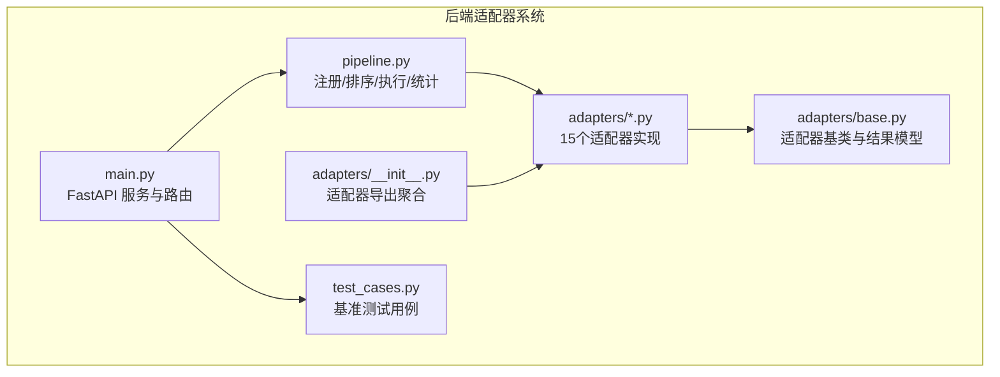
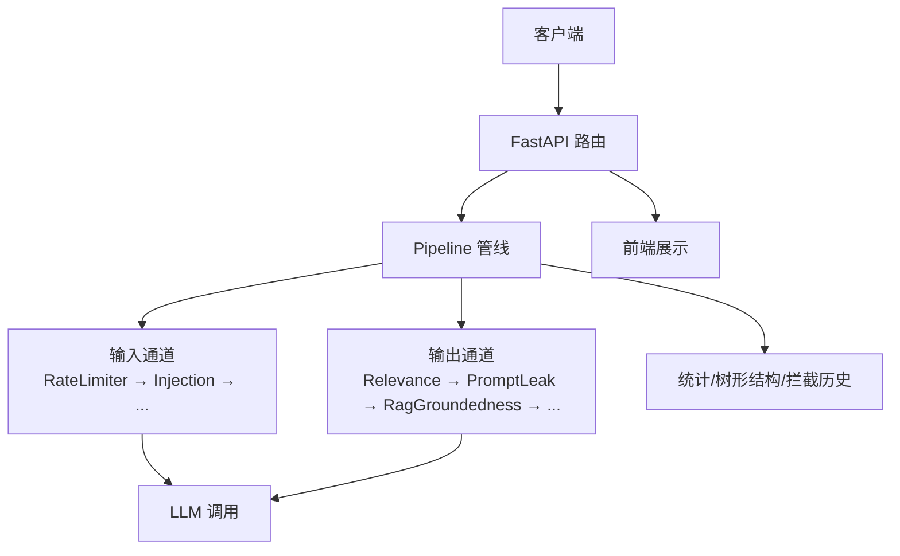
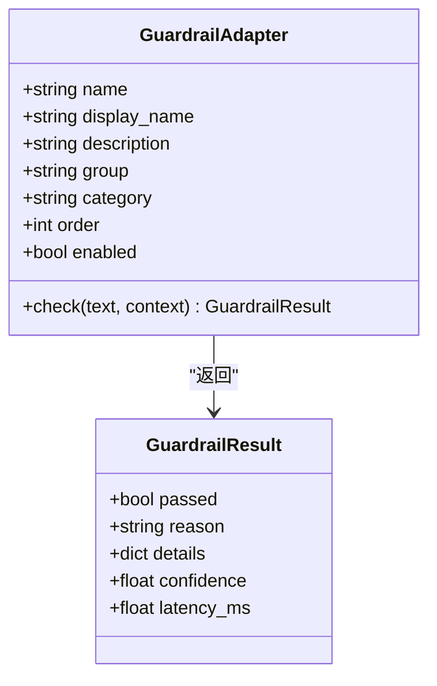
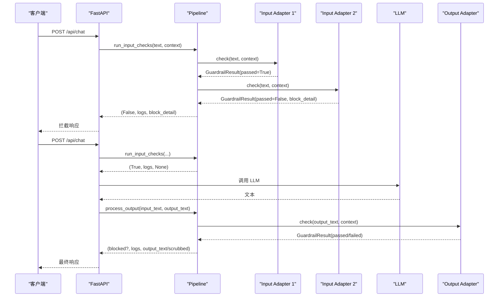
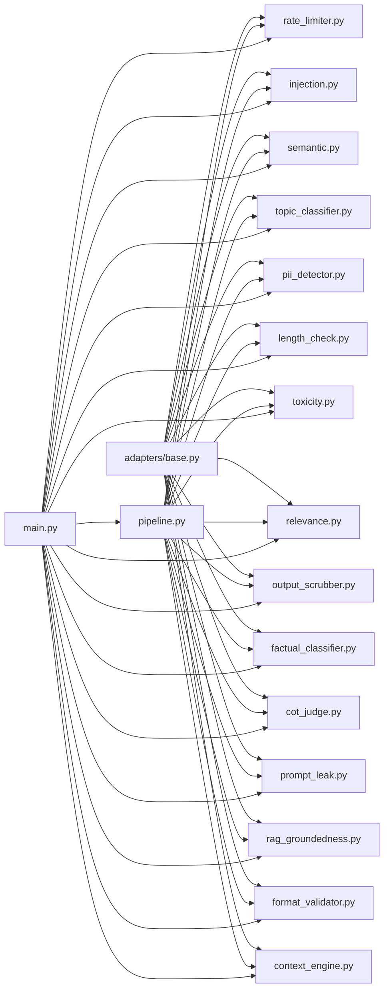

# 后端适配器系统

<cite>
**本文档引用的文件**
- [backend/adapters/base.py](file://guardrails-sandbox/backend/adapters/base.py)
- [backend/adapters/__init__.py](file://guardrails-sandbox/backend/adapters/__init__.py)
- [backend/pipeline.py](file://guardrails-sandbox/backend/pipeline.py)
- [backend/main.py](file://guardrails-sandbox/backend/main.py)
- [backend/adapters/context_engine.py](file://guardrails-sandbox/backend/adapters/context_engine.py)
- [backend/adapters/factual_classifier.py](file://guardrails-sandbox/backend/adapters/factual_classifier.py)
- [backend/adapters/format_validator.py](file://guardrails-sandbox/backend/adapters/format_validator.py)
- [backend/adapters/injection.py](file://guardrails-sandbox/backend/adapters/injection.py)
- [backend/adapters/length_check.py](file://guardrails-sandbox/backend/adapters/length_check.py)
- [backend/adapters/output_scrubber.py](file://guardrails-sandbox/backend/adapters/output_scrubber.py)
- [backend/adapters/pii_detector.py](file://guardrails-sandbox/backend/adapters/pii_detector.py)
- [backend/adapters/prompt_leak.py](file://guardrails-sandbox/backend/adapters/prompt_leak.py)
- [backend/adapters/rag_groundedness.py](file://guardrails-sandbox/backend/adapters/rag_groundedness.py)
- [backend/adapters/rate_limiter.py](file://guardrails-sandbox/backend/adapters/rate_limiter.py)
- [backend/adapters/relevance.py](file://guardrails-sandbox/backend/adapters/relevance.py)
- [backend/adapters/topic_classifier.py](file://guardrails-sandbox/backend/adapters/topic_classifier.py)
- [backend/adapters/toxicity.py](file://guardrails-sandbox/backend/adapters/toxicity.py)
- [backend/test_cases.py](file://guardrails-sandbox/backend/test_cases.py)
</cite>

## 目录
1. [简介](#简介)
2. [项目结构](#项目结构)
3. [核心组件](#核心组件)
4. [架构总览](#架构总览)
5. [详细组件分析](#详细组件分析)
6. [依赖分析](#依赖分析)
7. [性能考虑](#性能考虑)
8. [故障排查指南](#故障排查指南)
9. [结论](#结论)
10. [附录](#附录)

## 简介
本文件面向后端适配器系统，系统采用“适配器基类 + 管线编排”的设计，统一抽象各类安全与质量保障能力（如注入检测、PII 检测、格式校验、RAG 真实性、速率限制等）。通过标准化接口与可插拔的适配器，系统实现了输入/输出双通道的多层防护，并提供可视化树形结构、统计与拦截历史，便于运维与审计。

## 项目结构
后端主要目录与文件如下：
- adapters：适配器集合，包含基类与15个具体适配器
- pipeline.py：适配器注册、排序、执行与统计
- main.py：FastAPI 服务入口，注册适配器、提供 API、集成 LLM 调用
- test_cases.py：基准测试用例数据库

**图表来源**
- [backend/main.py:1-421](file://guardrails-sandbox/backend/main.py#L1-L421)
- [backend/pipeline.py:1-285](file://guardrails-sandbox/backend/pipeline.py#L1-L285)
- [backend/adapters/base.py:1-34](file://guardrails-sandbox/backend/adapters/base.py#L1-L34)
- [backend/adapters/__init__.py:1-16](file://guardrails-sandbox/backend/adapters/__init__.py#L1-L16)
- [backend/test_cases.py:1-155](file://guardrails-sandbox/backend/test_cases.py#L1-L155)

**章节来源**
- [backend/main.py:1-421](file://guardrails-sandbox/backend/main.py#L1-L421)
- [backend/pipeline.py:1-285](file://guardrails-sandbox/backend/pipeline.py#L1-L285)
- [backend/adapters/base.py:1-34](file://guardrails-sandbox/backend/adapters/base.py#L1-L34)
- [backend/adapters/__init__.py:1-16](file://guardrails-sandbox/backend/adapters/__init__.py#L1-L16)
- [backend/test_cases.py:1-155](file://guardrails-sandbox/backend/test_cases.py#L1-L155)

## 核心组件
- 适配器基类与结果模型
  - GuardrailResult：统一返回结构，包含是否通过、原因、细节、置信度、耗时等
  - GuardrailAdapter：抽象基类，定义 name/display_name/description/group/category/order/enabled 等元信息，以及 check(text, context) 接口
- 管线 Pipeline
  - 注册适配器并按 order 排序
  - 输入/输出通道分别执行，支持短路拦截、统计与拦截历史
  - 提供树形结构展示、开关切换、统计汇总
- FastAPI 服务
  - 注册全部适配器
  - 对外提供 /api/chat、/api/guardrails、/api/benchmark 等接口
  - 集成 LLM 调用与对比模式

**章节来源**
- [backend/adapters/base.py:5-34](file://guardrails-sandbox/backend/adapters/base.py#L5-L34)
- [backend/pipeline.py:12-285](file://guardrails-sandbox/backend/pipeline.py#L12-L285)
- [backend/main.py:24-58](file://guardrails-sandbox/backend/main.py#L24-L58)

## 架构总览
系统采用“适配器 + 管线”的分层架构：
- 适配器层：每个适配器实现单一职责，遵循统一接口
- 管线层：负责注册、排序、执行、统计与拦截历史
- 服务层：对外提供 API，编排输入/输出检查与 LLM 调用

**图表来源**
- [backend/main.py:155-221](file://guardrails-sandbox/backend/main.py#L155-L221)
- [backend/pipeline.py:31-161](file://guardrails-sandbox/backend/pipeline.py#L31-L161)

**章节来源**
- [backend/main.py:155-221](file://guardrails-sandbox/backend/main.py#L155-L221)
- [backend/pipeline.py:31-161](file://guardrails-sandbox/backend/pipeline.py#L31-L161)

## 详细组件分析

### 适配器基类与标准化接口
- 统一字段
  - name/display_name/description/group/category/order/enabled 控制显示与执行顺序
- 标准方法
  - check(text, context) -> GuardrailResult
- 结果模型
  - passed、reason、details、confidence、latency_ms

**图表来源**
- [backend/adapters/base.py:5-34](file://guardrails-sandbox/backend/adapters/base.py#L5-L34)

**章节来源**
- [backend/adapters/base.py:5-34](file://guardrails-sandbox/backend/adapters/base.py#L5-L34)

### 管线编排与执行流程
- 注册与排序
  - 按 adapter.order 升序排列；同序按 name 排序
- 输入通道
  - 逐个执行 input 类适配器，遇阻断即短路，记录拦截详情与统计
- 输出通道
  - 逐个执行 output 类适配器，遇阻断即短路；支持脱敏后文本回写 context
- 统计与树形结构
  - 按 group/category 展示适配器树，统计通过/拦截次数与命中率

**图表来源**
- [backend/main.py:155-221](file://guardrails-sandbox/backend/main.py#L155-L221)
- [backend/pipeline.py:31-161](file://guardrails-sandbox/backend/pipeline.py#L31-L161)

**章节来源**
- [backend/pipeline.py:12-285](file://guardrails-sandbox/backend/pipeline.py#L12-L285)
- [backend/main.py:155-221](file://guardrails-sandbox/backend/main.py#L155-L221)

### 15个防护墙适配器详解

#### 1) 上下文引擎（context_engine）
- 角色：输出通道，跟踪 Token 预算、分析上下文利用率、进行“中间丢失”重排序建议
- 关键点
  - 全局 ContextBudget 与 HistoryCompressor，按组件分配 Token 并报告
  - 基于查询意图动态选择工具，构建工具清单
  - 记录中间丢失高/低优先级位置，指导内容布局
- 配置参数
  - max_tokens、gen_reserve（生成预留）、工具预算上限等
- 使用方法
  - 作为 output 适配器参与管线，不拦截，仅记录与报告
- 扩展开发
  - 新增组件预算项时，更新 allocate 逻辑与 report 输出

**章节来源**
- [backend/adapters/context_engine.py:179-251](file://guardrails-sandbox/backend/adapters/context_engine.py#L179-L251)

#### 2) 事实分类器（factual_classifier）
- 角色：输入通道，区分“事实性/创意性”问题，动态调整后续适配器阈值
- 关键点
  - 基于关键词匹配判断是否创意性
  - 将 query_type 写入 context，供其他适配器读取
- 配置参数
  - 创意性关键词集合
- 使用方法
  - 在 injection/semantic 之前运行，order=5
- 扩展开发
  - 可替换为轻量 cross-encoder 小模型提升准确性

**章节来源**
- [backend/adapters/factual_classifier.py:20-55](file://guardrails-sandbox/backend/adapters/factual_classifier.py#L20-L55)

#### 3) 格式验证器（format_validator）
- 角色：输出通道，验证 LLM 输出格式（JSON/Code/文本）
- 关键点
  - JSON 解析校验、Markdown 代码块闭合检查、空输出检测
  - 当输入要求结构化输出时，严格校验
- 配置参数
  - expected_format（来自 context）
- 使用方法
  - order=55，确保在脱敏之后、真实性检查之前
- 扩展开发
  - 支持更多格式（XML、表格等）

**章节来源**
- [backend/adapters/format_validator.py:13-86](file://guardrails-sandbox/backend/adapters/format_validator.py#L13-L86)

#### 4) 注入检测（injection）
- 角色：输入通道，正则匹配已知注入攻击模式与编码绕过
- 关键点
  - 英文/中文注入模式，含编码绕过（Unicode、Base64、ROT13、十六进制）
  - 基于最高置信度决定是否拦截
- 配置参数
  - 注入模式列表、编码绕过模式列表
- 使用方法
  - order=20，早期拦截
- 扩展开发
  - 可接入 NLP 模型进行语义检测

**章节来源**
- [backend/adapters/injection.py:44-88](file://guardrails-sandbox/backend/adapters/injection.py#L44-L88)

#### 5) 长度检查（length_check）
- 角色：输入通道，防止超长输入
- 关键点
  - 字符数与词数双重限制
- 配置参数
  - MAX_CHARS、MAX_WORDS
- 使用方法
  - order=50，避免资源滥用
- 扩展开发
  - 按用户等级差异化限制

**章节来源**
- [backend/adapters/length_check.py:9-37](file://guardrails-sandbox/backend/adapters/length_check.py#L9-L37)

#### 6) 输出清理（output_scrubber）
- 角色：输出通道，替换输出中的 PII 为占位符
- 关键点
  - 脱敏不拦截，但会写入 context["scrubbed_output"]
- 配置参数
  - PII 模式列表（邮箱、手机号、身份证、信用卡）
- 使用方法
  - order=10，尽早脱敏
- 扩展开发
  - 增加更多 PII 类型与哈希摘要

**章节来源**
- [backend/adapters/output_scrubber.py:16-56](file://guardrails-sandbox/backend/adapters/output_scrubber.py#L16-L56)

#### 7) PII 检测（pii_detector）
- 角色：输入通道，识别输入中的个人信息
- 关键点
  - 对手机号、邮箱、身份证、信用卡高置信度拦截；IP 地址仅警告
- 配置参数
  - PII 模式列表与置信度
- 使用方法
  - order=40，中等优先级
- 扩展开发
  - 支持更多国家/地区 PII 规范

**章节来源**
- [backend/adapters/pii_detector.py:19-54](file://guardrails-sandbox/backend/adapters/pii_detector.py#L19-L54)

#### 8) 提示泄露检测（prompt_leak）
- 角色：输出通道，检测 LLM 是否泄露系统提示
- 关键点
  - 敏感短语、系统提示关键词聚集、元指令泄漏标志
  - 可通过 set_system_prompt 注入真实系统提示
- 配置参数
  - SENSITIVE_PHRASES、stop_words
- 使用方法
  - order=60，真实性检查之前
- 扩展开发
  - 自动抽取系统提示关键词，减少手工维护

**章节来源**
- [backend/adapters/prompt_leak.py:14-94](file://guardrails-sandbox/backend/adapters/prompt_leak.py#L14-L94)

#### 9) RAG 真实性（rag_groundedness）
- 角色：输出通道，检测回答是否基于上下文，防止幻觉
- 关键点
  - 将回答切分为“事实性断言”，统计上下文匹配度
  - 无上下文或无事实断言时跳过
- 配置参数
  - 断言阈值（关键词匹配比例）
- 使用方法
  - order=65，真实性检查
- 扩展开发
  - 可结合交叉编码器评估语义相似度

**章节来源**
- [backend/adapters/rag_groundedness.py:16-100](file://guardrails-sandbox/backend/adapters/rag_groundedness.py#L16-L100)

#### 10) 速率限制（rate_limiter）
- 角色：输入通道，基于滑动窗口的 RPM 限制
- 关键点
  - 按 tier（free/pro/enterprise）设置不同上限
- 配置参数
  - TIER_LIMITS
- 使用方法
  - order=10，最早执行
- 扩展开发
  - 支持分布式存储窗口、白名单豁免

**章节来源**
- [backend/adapters/rate_limiter.py:7-56](file://guardrails-sandbox/backend/adapters/rate_limiter.py#L7-L56)

#### 11) 相关性检查（relevance）
- 角色：输出通道，检查输出是否偏离输入话题
- 关键点
  - 停用词过滤、关键词重叠度评分
  - 简短回答跳过检查
- 配置参数
  - STOP_WORDS、THRESHOLD、MIN_MEANINGFUL_WORDS
- 使用方法
  - order=20，较早执行
- 扩展开发
  - 可引入向量相似度

**章节来源**
- [backend/adapters/relevance.py:23-70](file://guardrails-sandbox/backend/adapters/relevance.py#L23-L70)

#### 12) 主题分类（topic_classifier）
- 角色：输入通道，检查输入是否在允许范围内
- 关键点
  - 先检查明确禁止话题，再宽松放行
- 配置参数
  - ALLOWED_TOPICS、BLOCKED_KEYWORDS
- 使用方法
  - order=70，最后执行
- 扩展开发
  - 可接入细粒度主题模型

**章节来源**
- [backend/adapters/topic_classifier.py:20-54](file://guardrails-sandbox/backend/adapters/topic_classifier.py#L20-L54)

#### 13) 毒性检测（toxicity）
- 角色：输入通道，过滤暴力、违法、自残、仇恨、色情内容
- 关键点
  - 安全上下文豁免（如“如何预防”）
  - 基于置信度阈值拦截
- 配置参数
  - TOXIC_PATTERNS、SAFE_CONTEXT_PREFIXES
- 使用方法
  - order=60，中等优先级
- 扩展开发
  - 可接入毒性分类模型

**章节来源**
- [backend/adapters/toxicity.py:22-64](file://guardrails-sandbox/backend/adapters/toxicity.py#L22-L64)

#### 14) 语义检测（semantic）
- 角色：输入通道，检测语义层面的越狱/覆盖指令
- 关键点
  - 语义相似但正则无法覆盖的攻击模式
- 配置参数
  - 语义模型（SentenceTransformer）本地离线加载
- 使用方法
  - 与注入检测配合，order 通常在 factual_classifier 之后
- 扩展开发
  - 可替换为更强大的语义模型

**章节来源**
- [backend/main.py:62-76](file://guardrails-sandbox/backend/main.py#L62-L76)

#### 15) CoT 判决（cot_judge）
- 角色：输入/输出通道，对复杂推理过程进行质量判定
- 关键点
  - 基于思维链步骤的合理性与一致性评估
- 配置参数
  - 判定规则与阈值
- 使用方法
  - 根据业务需求插入合适 order
- 扩展开发
  - 可接入外部推理质量评估服务

**章节来源**
- [backend/adapters/__init__.py:4-12](file://guardrails-sandbox/backend/adapters/__init__.py#L4-L12)

### 适配器配置参数与使用方法总览
- 基类参数
  - name/display_name/description/group/category/order/enabled
- 典型上下文 context
  - user_id、tier、input_text、expected_format、system_prompt、context_docs、_benchmark 等
- 使用方法
  - 在 main.py 中注册全部适配器
  - 通过 Pipeline.run_input_checks/process_output 执行
  - 通过 API /api/guardrails /api/chat /api/benchmark 使用

**章节来源**
- [backend/main.py:24-58](file://guardrails-sandbox/backend/main.py#L24-L58)
- [backend/pipeline.py:31-161](file://guardrails-sandbox/backend/pipeline.py#L31-L161)

### 扩展开发指南
- 新增适配器
  - 继承 GuardrailAdapter，实现 check(text, context)
  - 设置 name/group/category/order/enabled
  - 在 adapters/__init__.py 与 main.py 中注册
- 调整执行顺序
  - 修改 order 数值，数值越小越先执行
- 动态阈值
  - 通过 context 传递动态参数（如 factual_classifier 的 query_type）
- 性能优化
  - 将昂贵模型离线加载，避免异步环境连接问题
  - 合理短路，避免无效计算

**章节来源**
- [backend/adapters/base.py:14-34](file://guardrails-sandbox/backend/adapters/base.py#L14-L34)
- [backend/main.py:62-76](file://guardrails-sandbox/backend/main.py#L62-L76)

## 依赖分析
- 适配器依赖
  - 所有适配器依赖 base.py 的 GuardrailAdapter/GuardrailResult
  - 部分适配器依赖 SentenceTransformer（semantic）
- 管线依赖
  - pipeline.py 依赖 adapters/base.py 的 GuardrailResult
- 服务依赖
  - main.py 依赖 pipeline.py、adapters/*、llm_client

**图表来源**
- [backend/adapters/base.py:1-34](file://guardrails-sandbox/backend/adapters/base.py#L1-L34)
- [backend/pipeline.py:1-285](file://guardrails-sandbox/backend/pipeline.py#L1-L285)
- [backend/main.py:1-421](file://guardrails-sandbox/backend/main.py#L1-L421)

**章节来源**
- [backend/adapters/base.py:1-34](file://guardrails-sandbox/backend/adapters/base.py#L1-L34)
- [backend/pipeline.py:1-285](file://guardrails-sandbox/backend/pipeline.py#L1-L285)
- [backend/main.py:1-421](file://guardrails-sandbox/backend/main.py#L1-L421)

## 性能考虑
- 模型加载
  - 预加载 sentence-transformers 模型，避免异步环境连接问题
- 适配器顺序
  - 将低成本适配器前置（如 rate_limiter、length_check），尽早短路
- 上下文预算
  - 通过 ContextEngine 动态分配 Token，避免上下文溢出
- 统计与日志
  - 仅在非基准场景记录拦截历史，避免额外开销

**章节来源**
- [backend/main.py:62-76](file://guardrails-sandbox/backend/main.py#L62-L76)
- [backend/adapters/context_engine.py:179-251](file://guardrails-sandbox/backend/adapters/context_engine.py#L179-L251)

## 故障排查指南
- 常见问题
  - 适配器未生效：确认 enabled=True 且 order 合理
  - 拦截误报：调整阈值或置信度；必要时在 context 中加入安全上下文
  - 性能瓶颈：检查昂贵模型是否离线加载；合并相似检查
- 排查步骤
  - 查看 /api/guardrails 获取树形结构与统计
  - 查看 /api/guardrails/block-history 获取拦截历史
  - 使用 /api/chat/compare 对比开启/关闭 guardrails 的差异
- 基准测试
  - 使用 /api/benchmark 运行测试用例，定位异常用例

**章节来源**
- [backend/main.py:121-145](file://guardrails-sandbox/backend/main.py#L121-L145)
- [backend/main.py:223-256](file://guardrails-sandbox/backend/main.py#L223-L256)
- [backend/test_cases.py:1-155](file://guardrails-sandbox/backend/test_cases.py#L1-L155)

## 结论
该适配器系统以统一基类与管线编排为核心，提供了可插拔、可配置、可观测的多层防护能力。通过合理的执行顺序与上下文传递机制，既能保证安全性，又能兼顾性能与可维护性。建议在生产环境中结合业务场景动态调整阈值与顺序，并持续完善语义检测与模型能力。

## 附录
- API 一览
  - GET /api/guardrails：获取适配器树、统计与拦截历史
  - GET /api/adapters/tree：仅获取树形结构
  - GET /api/guardrails/block-history：获取拦截历史
  - POST /api/guardrails/toggle：切换适配器启用状态
  - POST /api/chat：聊天接口（含 guardrails）
  - POST /api/chat/compare：对比模式
  - POST /api/chat/reset-stats：重置统计
  - POST /api/benchmark：运行基准测试
- 测试用例
  - normal、injection、semantic、pii、toxicity、edge 六类用例，用于评估拦截效果

**章节来源**
- [backend/main.py:121-281](file://guardrails-sandbox/backend/main.py#L121-L281)
- [backend/test_cases.py:18-155](file://guardrails-sandbox/backend/test_cases.py#L18-L155)