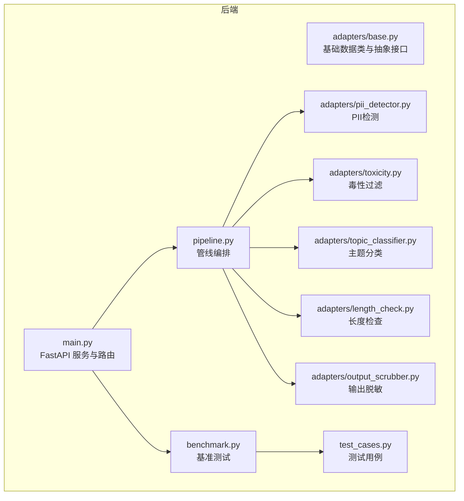
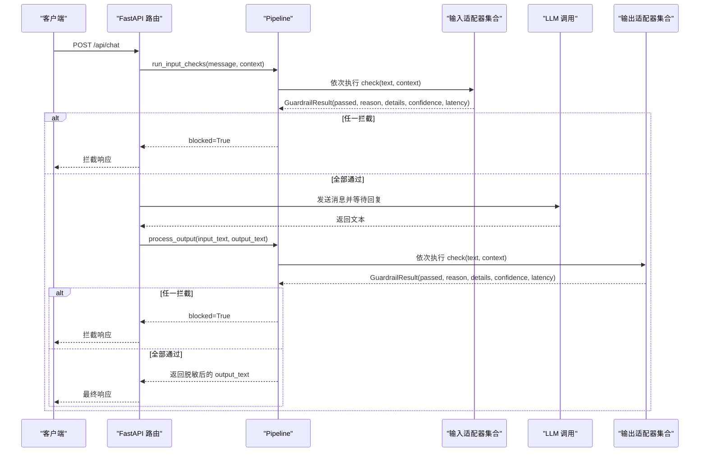
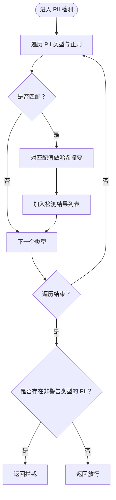
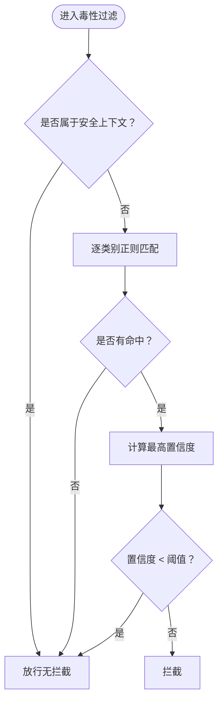
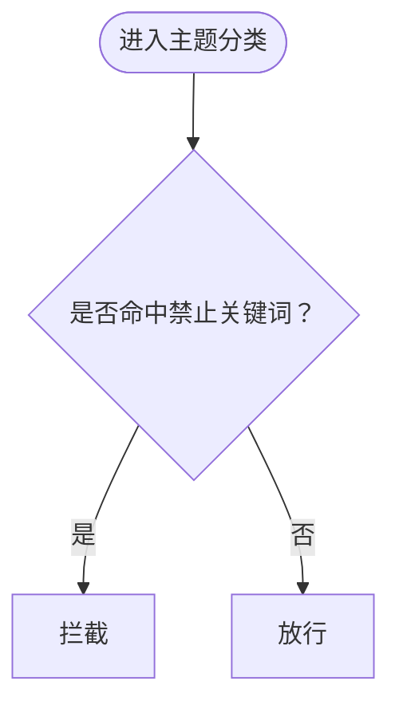
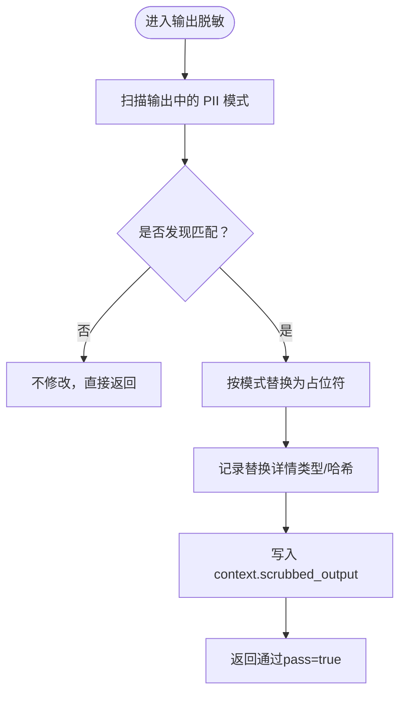
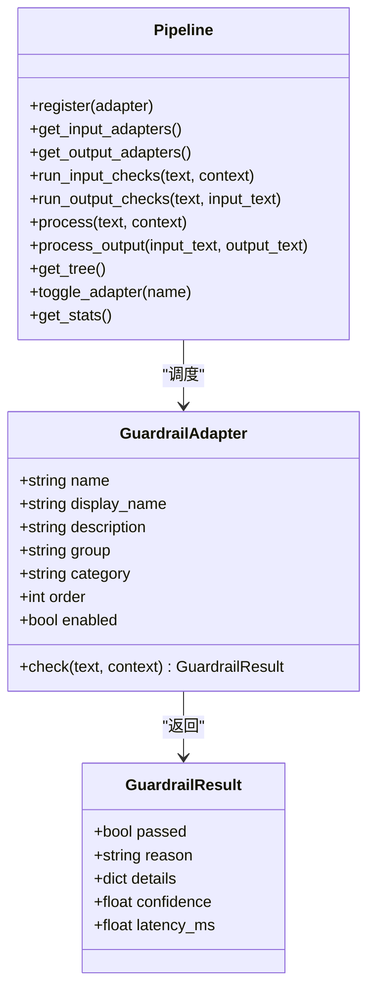
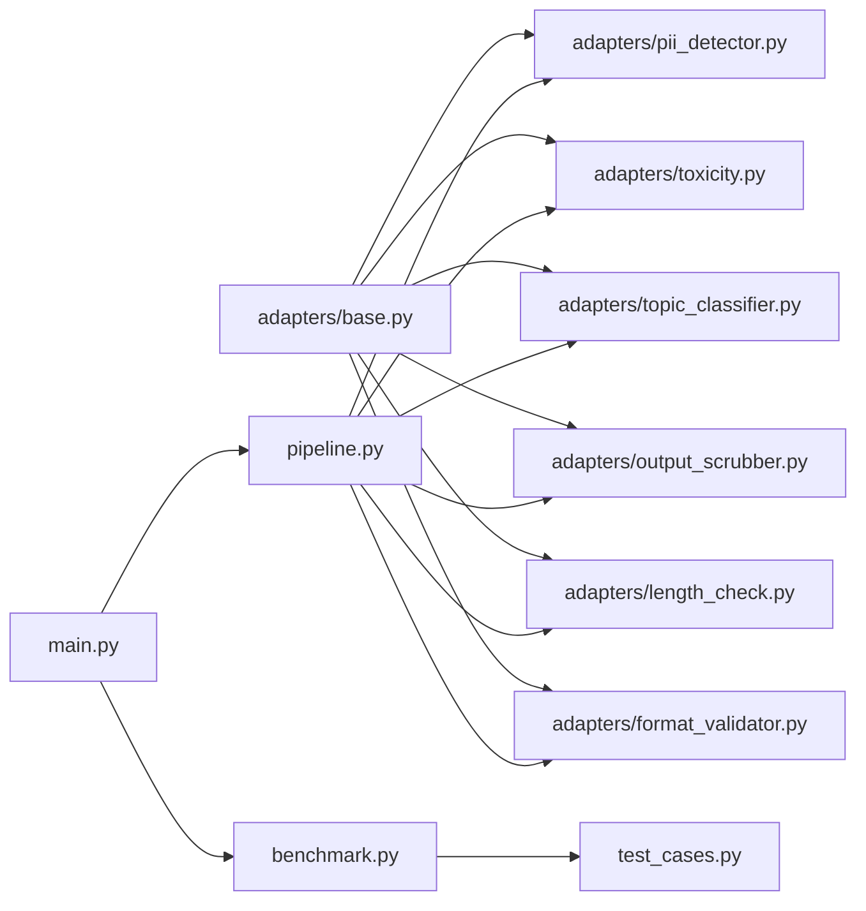

# 安全合规适配器

<cite>
**本文引用的文件**
- [guardrails-sandbox/backend/adapters/base.py](file://guardrails-sandbox/backend/adapters/base.py)
- [guardrails-sandbox/backend/adapters/pii_detector.py](file://guardrails-sandbox/backend/adapters/pii_detector.py)
- [guardrails-sandbox/backend/adapters/toxicity.py](file://guardrails-sandbox/backend/adapters/toxicity.py)
- [guardrails-sandbox/backend/adapters/topic_classifier.py](file://guardrails-sandbox/backend/adapters/topic_classifier.py)
- [guardrails-sandbox/backend/adapters/output_scrubber.py](file://guardrails-sandbox/backend/adapters/output_scrubber.py)
- [guardrails-sandbox/backend/pipeline.py](file://guardrails-sandbox/backend/pipeline.py)
- [guardrails-sandbox/backend/main.py](file://guardrails-sandbox/backend/main.py)
- [guardrails-sandbox/backend/benchmark.py](file://guardrails-sandbox/backend/benchmark.py)
- [guardrails-sandbox/backend/test_cases.py](file://guardrails-sandbox/backend/test_cases.py)
</cite>

## 目录
1. [简介](#简介)
2. [项目结构](#项目结构)
3. [核心组件](#核心组件)
4. [架构总览](#架构总览)
5. [详细组件分析](#详细组件分析)
6. [依赖分析](#依赖分析)
7. [性能考虑](#性能考虑)
8. [故障排查指南](#故障排查指南)
9. [结论](#结论)
10. [附录](#附录)

## 简介
本文件面向“安全合规适配器”的设计与实现，聚焦以下能力：
- 输入层：PII检测、毒性检测、主题分类、长度检查等
- 输出层：PII脱敏（输出清理）
- 管线编排：统一调度、短路拦截、统计与历史记录
- 测试与评估：基准用例、TPR/FPR/准确率等指标

目标是帮助读者理解适配器如何识别与过滤敏感信息、有害内容与不当主题，如何在不暴露敏感数据的前提下清理输出内容，并掌握误报与漏报的平衡策略、合规标准的遵循方式、配置调优与第三方工具集成思路。

## 项目结构
安全合规适配器位于 guardrails-sandbox 后端目录下，采用“适配器 + 管线”的分层设计：
- adapters：各类安全合规适配器（输入/输出）
- pipeline：统一编排与执行
- main：FastAPI 服务入口，注册适配器并提供 API
- benchmark/test_cases：基准测试与用例集

图表来源
- [guardrails-sandbox/backend/main.py:24-58](file://guardrails-sandbox/backend/main.py#L24-L58)
- [guardrails-sandbox/backend/pipeline.py:12-285](file://guardrails-sandbox/backend/pipeline.py#L12-L285)
- [guardrails-sandbox/backend/adapters/base.py:5-34](file://guardrails-sandbox/backend/adapters/base.py#L5-L34)
- [guardrails-sandbox/backend/adapters/pii_detector.py:19-54](file://guardrails-sandbox/backend/adapters/pii_detector.py#L19-L54)
- [guardrails-sandbox/backend/adapters/toxicity.py:22-64](file://guardrails-sandbox/backend/adapters/toxicity.py#L22-L64)
- [guardrails-sandbox/backend/adapters/topic_classifier.py:20-54](file://guardrails-sandbox/backend/adapters/topic_classifier.py#L20-L54)
- [guardrails-sandbox/backend/adapters/output_scrubber.py:16-56](file://guardrails-sandbox/backend/adapters/output_scrubber.py#L16-L56)
- [guardrails-sandbox/backend/benchmark.py:10-169](file://guardrails-sandbox/backend/benchmark.py#L10-L169)
- [guardrails-sandbox/backend/test_cases.py:10-155](file://guardrails-sandbox/backend/test_cases.py#L10-L155)

章节来源
- [guardrails-sandbox/backend/main.py:24-58](file://guardrails-sandbox/backend/main.py#L24-L58)
- [guardrails-sandbox/backend/pipeline.py:12-285](file://guardrails-sandbox/backend/pipeline.py#L12-L285)

## 核心组件
- GuardrailResult：统一的检查结果数据结构，包含是否通过、原因、详情、置信度、耗时等字段。
- GuardrailAdapter：适配器基类，子类仅需实现 check(text, context) 即可接入管线；通过 group/category/name/order 控制树形展示与执行顺序。
- Pipeline：负责注册适配器、按 category 分类、按 order 排序、短路拦截、收集日志与统计、维护拦截历史。
- 主服务 main：注册所有适配器，提供 /api/chat 对外接口，串联输入检查、LLM 调用、输出检查与脱敏。

章节来源
- [guardrails-sandbox/backend/adapters/base.py:5-34](file://guardrails-sandbox/backend/adapters/base.py#L5-L34)
- [guardrails-sandbox/backend/pipeline.py:12-285](file://guardrails-sandbox/backend/pipeline.py#L12-L285)
- [guardrails-sandbox/backend/main.py:24-58](file://guardrails-sandbox/backend/main.py#L24-L58)

## 架构总览
整体流程分为“输入检查”和“输出检查”两个阶段，均支持短路拦截与日志聚合。输出检查阶段可对 LLM 输出进行 PII 脱敏。

图表来源
- [guardrails-sandbox/backend/main.py:155-221](file://guardrails-sandbox/backend/main.py#L155-L221)
- [guardrails-sandbox/backend/pipeline.py:31-161](file://guardrails-sandbox/backend/pipeline.py#L31-L161)

## 详细组件分析

### PII 检测（输入层）
- 功能概述：识别输入中的手机号、邮箱、身份证、信用卡、IP 地址等敏感信息，对部分类型（如 IP 地址）仅发出“警告”而不拦截，以降低误报。
- 关键点：
  - 使用正则表达式匹配，为每类 PII 设定置信度阈值。
  - 将匹配值进行哈希摘要，便于追踪与审计。
  - 若存在非“警告类型”的 PII，则判定拦截。
- 误报与漏报策略：
  - 通过置信度阈值与“警告名单”平衡误报；若误报仍高，可调整阈值或扩展模式。
  - 对于边界场景（如“服务器IP”），结合业务上下文进一步细化规则。
- 合规遵循：满足最小暴露原则，避免直接输出敏感数据。

图表来源
- [guardrails-sandbox/backend/adapters/pii_detector.py:28-54](file://guardrails-sandbox/backend/adapters/pii_detector.py#L28-L54)

章节来源
- [guardrails-sandbox/backend/adapters/pii_detector.py:19-54](file://guardrails-sandbox/backend/adapters/pii_detector.py#L19-L54)

### 毒性过滤（输入层）
- 功能概述：过滤暴力、违法活动、自残、仇恨言论、色情等内容；对特定安全上下文（如“如何预防/帮助”）进行豁免。
- 关键点：
  - 使用大小写无关的正则匹配，针对不同类别设定置信度。
  - 提供安全上下文前缀白名单，避免对正当讨论的误判。
  - 当最高置信度低于阈值时放行。
- 误报与漏报策略：
  - 通过安全上下文豁免减少误报；若仍有漏报，可增加关键词或提升置信度阈值。
  - 结合语义检测（如语义检测器）形成“规则+语义”的双保险。
- 合规遵循：符合内容安全与未成年人保护相关要求。

图表来源
- [guardrails-sandbox/backend/adapters/toxicity.py:31-64](file://guardrails-sandbox/backend/adapters/toxicity.py#L31-L64)

章节来源
- [guardrails-sandbox/backend/adapters/toxicity.py:22-64](file://guardrails-sandbox/backend/adapters/toxicity.py#L22-L64)

### 主题分类（输入层）
- 功能概述：检查输入是否涉及非法/敏感关键词；若命中则拦截；否则默认放行（允许范围较宽）。
- 关键点：
  - 先检查明确禁止的关键词，再放宽允许范围。
  - 通过关键词列表控制敏感话题的边界。
- 误报与漏报策略：
  - 对高频误报的关键词可引入上下文判断或动态阈值。
  - 与毒性过滤配合，形成更全面的主题与内容双重防护。
- 合规遵循：确保对话内容不触碰法律法规与平台政策。

图表来源
- [guardrails-sandbox/backend/adapters/topic_classifier.py:29-54](file://guardrails-sandbox/backend/adapters/topic_classifier.py#L29-L54)

章节来源
- [guardrails-sandbox/backend/adapters/topic_classifier.py:20-54](file://guardrails-sandbox/backend/adapters/topic_classifier.py#L20-L54)

### 输出脱敏（输出层）
- 功能概述：对 LLM 输出中的 PII（邮箱、社保、信用卡、手机号、身份证）进行替换为占位符，不改变通过与否。
- 关键点：
  - 使用正则替换，记录替换次数与类型，便于审计。
  - 将脱敏后的文本写回 context，最终返回给客户端。
- 误报与漏报策略：
  - 若出现误脱敏（如非 PII 的数字串），可通过更严格的上下文限定或更精确的正则优化。
- 合规遵循：满足数据最小暴露与隐私保护要求。

图表来源
- [guardrails-sandbox/backend/adapters/output_scrubber.py:25-56](file://guardrails-sandbox/backend/adapters/output_scrubber.py#L25-L56)

章节来源
- [guardrails-sandbox/backend/adapters/output_scrubber.py:16-56](file://guardrails-sandbox/backend/adapters/output_scrubber.py#L16-L56)

### 管线编排与执行
- 统一注册与排序：按 order 从小到大执行，input 与 output 分类管理。
- 短路拦截：任一适配器返回拦截即停止后续检查，快速阻断风险。
- 日志与统计：收集每次检查的通过/拒绝、置信度、耗时、详情，支持按层统计与拦截历史。
- 输出处理：优先使用脱敏后的文本作为最终输出。

图表来源
- [guardrails-sandbox/backend/adapters/base.py:5-34](file://guardrails-sandbox/backend/adapters/base.py#L5-L34)
- [guardrails-sandbox/backend/pipeline.py:12-285](file://guardrails-sandbox/backend/pipeline.py#L12-L285)

章节来源
- [guardrails-sandbox/backend/pipeline.py:12-285](file://guardrails-sandbox/backend/pipeline.py#L12-L285)
- [guardrails-sandbox/backend/adapters/base.py:5-34](file://guardrails-sandbox/backend/adapters/base.py#L5-L34)

## 依赖分析
- 适配器依赖：各适配器仅依赖 base.py 的 GuardrailResult/GuardrailAdapter 抽象，耦合度低，易于扩展。
- 管线依赖：Pipeline 依赖 adapters 的具体实现，通过统一接口进行编排。
- 服务依赖：main.py 注册所有适配器并提供对外 API；benchmark/test_cases 为测试与评估提供支撑。

图表来源
- [guardrails-sandbox/backend/adapters/base.py:5-34](file://guardrails-sandbox/backend/adapters/base.py#L5-L34)
- [guardrails-sandbox/backend/pipeline.py:12-285](file://guardrails-sandbox/backend/pipeline.py#L12-L285)
- [guardrails-sandbox/backend/main.py:24-58](file://guardrails-sandbox/backend/main.py#L24-L58)
- [guardrails-sandbox/backend/benchmark.py:10-169](file://guardrails-sandbox/backend/benchmark.py#L10-L169)
- [guardrails-sandbox/backend/test_cases.py:10-155](file://guardrails-sandbox/backend/test_cases.py#L10-L155)

章节来源
- [guardrails-sandbox/backend/main.py:24-58](file://guardrails-sandbox/backend/main.py#L24-L58)
- [guardrails-sandbox/backend/benchmark.py:10-169](file://guardrails-sandbox/backend/benchmark.py#L10-L169)
- [guardrails-sandbox/backend/test_cases.py:10-155](file://guardrails-sandbox/backend/test_cases.py#L10-L155)

## 性能考虑
- 时间复杂度：各适配器主要为线性扫描（正则匹配），整体复杂度近似 O(n)，其中 n 为输入长度。
- 并发与延迟：Pipeline 统计每项检查耗时，便于定位瓶颈；建议对高耗时适配器（如语义检测）进行缓存或降采样。
- 资源占用：预加载语义模型于启动阶段，避免异步环境下的连接问题；对正则表达式进行优化，减少回溯。
- 端到端延迟：主服务统计总耗时与 LLM 耗时，便于性能监控与调优。

## 故障排查指南
- 拦截定位：通过 block_history 与 by_layer 统计，快速定位拦截发生的具体适配器与阶段。
- 误报/漏报：结合 test_cases 中的用例类别（如 injection/semantic/pii/toxicity/edge），针对性调整阈值、正则或新增关键词。
- 配置开关：通过 /api/guardrails/toggle 切换适配器启用状态，快速隔离问题。
- 基准测试：使用 /api/benchmark 运行全量或分类用例，获取 TPR/FPR/Precision/F1 等指标，指导策略迭代。

章节来源
- [guardrails-sandbox/backend/pipeline.py:247-285](file://guardrails-sandbox/backend/pipeline.py#L247-L285)
- [guardrails-sandbox/backend/benchmark.py:10-169](file://guardrails-sandbox/backend/benchmark.py#L10-L169)
- [guardrails-sandbox/backend/test_cases.py:10-155](file://guardrails-sandbox/backend/test_cases.py#L10-L155)

## 结论
本安全合规适配器体系以“规则+短路+可观测”为核心，覆盖输入层的敏感信息识别与内容治理、输出层的隐私数据脱敏，并通过统一管线实现高效编排与统计。结合基准测试与拦截历史，可在误报与漏报之间取得稳健平衡，满足合规与生产可用性的双重需求。

## 附录

### 检测算法与策略要点
- 正则匹配：为不同 PII/毒性/主题类别定义高置信度正则，兼顾覆盖率与误报控制。
- 置信度阈值：根据业务风险设定阈值，对高风险项严格拦截，低风险项仅记录或警告。
- 上下文豁免：对“如何预防/帮助/识别”等安全上下文进行豁免，避免对正当讨论的误判。
- 脱敏策略：对输出中的 PII 进行占位符替换，保留审计线索（哈希摘要）。

### 误报与漏报处理策略
- 误报（FPR）：通过更严格的正则、置信度阈值提升、上下文增强与规则收敛降低；必要时引入语义检测作为补充。
- 漏报（FNR）：通过关键词扩充、模式泛化与阈值下调提升召回；结合基准测试持续评估与迭代。

### 合规标准遵循
- 数据最小暴露：PII 检测与脱敏确保敏感信息不出域。
- 内容安全：毒性过滤与主题分类覆盖暴力、违法、自残、仇恨、色情等高风险内容。
- 法律法规：禁止关键词与安全上下文豁免机制符合平台与监管要求。

### 配置参数调优建议
- PII 检测：调整置信度阈值与模式，减少 IP 地址误报；对新出现的 PII 变体及时补充正则。
- 毒性过滤：扩展关键词库与上下文前缀，提升对变种攻击的识别能力。
- 主题分类：定期更新禁止关键词清单，结合业务场景动态调整允许范围。
- 输出脱敏：优化正则边界，避免对非 PII 数字串的误脱敏。

### 第三方合规工具集成方案
- 内容审核平台：将高置信度命中事件上报至第三方审核平台，实现人机协同复核。
- 隐私数据治理：对接企业级数据脱敏与水印系统，实现端到端隐私保护。
- 安全运营中心：将拦截历史与统计接入 SIEM/安全运营平台，支持告警与溯源。