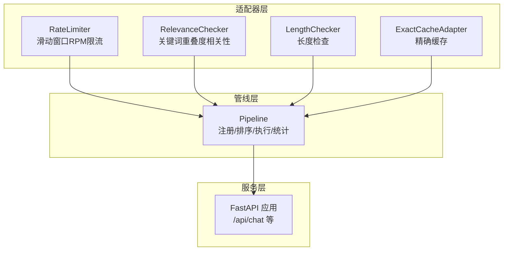
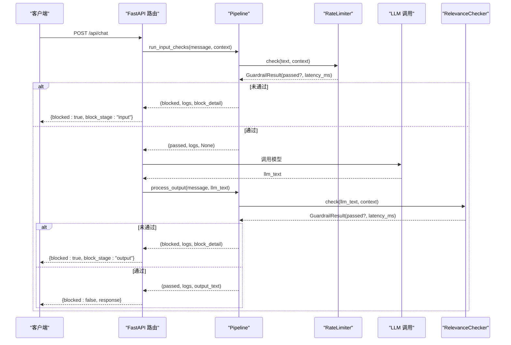
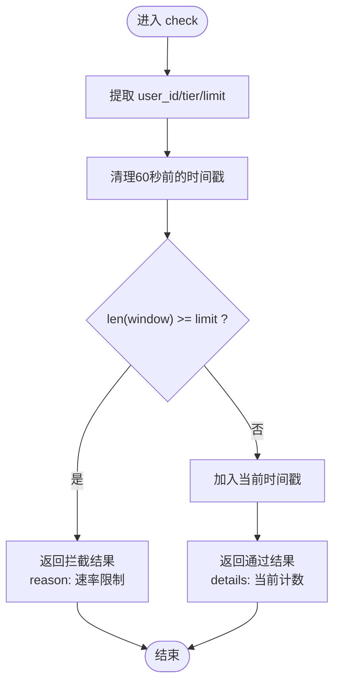
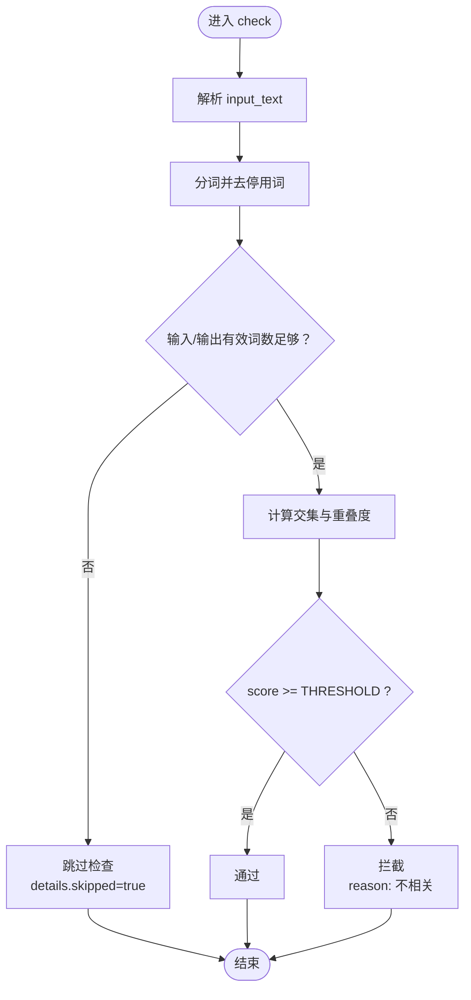
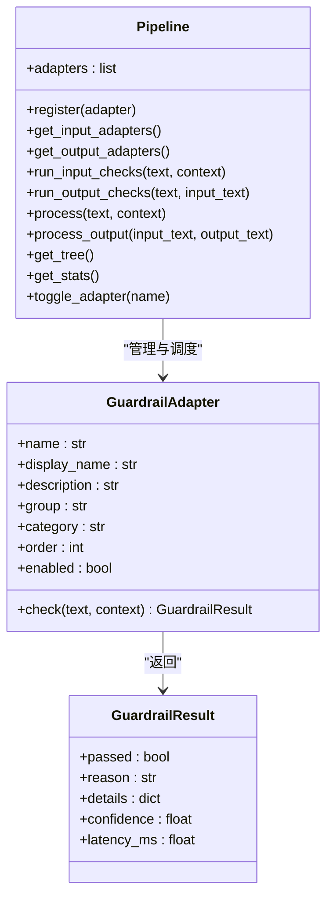
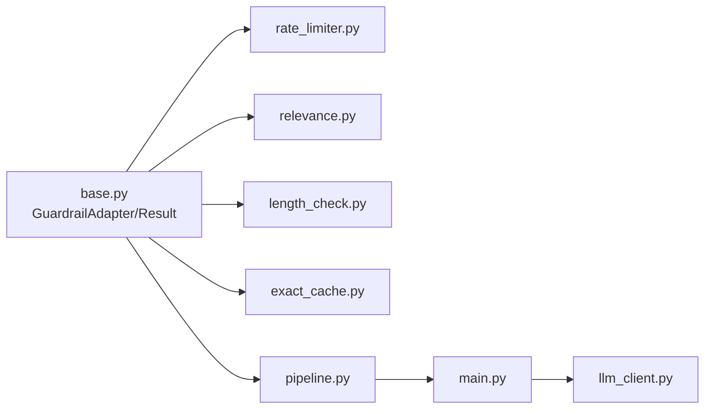

# 性能监控适配器

<cite>
**本文档引用的文件**
- [rate_limiter.py](file://guardrails-sandbox/backend/adapters/rate_limiter.py)
- [relevance.py](file://guardrails-sandbox/backend/adapters/relevance.py)
- [base.py](file://guardrails-sandbox/backend/adapters/base.py)
- [pipeline.py](file://guardrails-sandbox/backend/pipeline.py)
- [main.py](file://guardrails-sandbox/backend/main.py)
- [benchmark.py](file://guardrails-sandbox/backend/benchmark.py)
- [length_check.py](file://guardrails-sandbox/backend/adapters/length_check.py)
- [exact_cache.py](file://guardrails-sandbox/backend/adapters/exact_cache.py)
</cite>

## 目录
1. [简介](#简介)
2. [项目结构](#项目结构)
3. [核心组件](#核心组件)
4. [架构总览](#架构总览)
5. [详细组件分析](#详细组件分析)
6. [依赖关系分析](#依赖关系分析)
7. [性能考量](#性能考量)
8. [故障排查指南](#故障排查指南)
9. [结论](#结论)
10. [附录](#附录)

## 简介
本文件聚焦于性能监控适配器中的两个关键能力：速率限制（rate_limiter）与相关性检查（relevance）。前者通过滑动窗口算法实现基于用户的 RPM（每分钟请求）限流，防止系统过载并保护下游服务；后者通过关键词重叠度评估 LLM 输出与输入的相关性，提升搜索与问答质量。文档将从架构、实现细节、性能指标、配置参数、监控与调优等方面进行系统化说明，并给出与业务场景匹配的实践建议。

## 项目结构
该子系统位于 guardrails-sandbox 后端目录，采用“适配器 + 管线”的分层设计：
- 适配器层：定义统一的 GuardrailAdapter 抽象与 GuardrailResult 结构，具体适配器实现各自检查逻辑
- 管线层：Pipeline 负责注册、排序、执行与统计，支持输入/输出两阶段检查
- 服务层：FastAPI 提供对外接口，集成 LLM 调用与 guardrails 执行
- 基准测试：BenchmarkRunner 对用例进行自动化评测，生成性能与质量指标

**图表来源**
- [rate_limiter.py:1-56](file://guardrails-sandbox/backend/adapters/rate_limiter.py#L1-L56)
- [relevance.py:1-70](file://guardrails-sandbox/backend/adapters/relevance.py#L1-L70)
- [length_check.py:1-37](file://guardrails-sandbox/backend/adapters/length_check.py#L1-L37)
- [exact_cache.py:1-69](file://guardrails-sandbox/backend/adapters/exact_cache.py#L1-L69)
- [pipeline.py:1-285](file://guardrails-sandbox/backend/pipeline.py#L1-L285)
- [main.py:1-421](file://guardrails-sandbox/backend/main.py#L1-L421)

**章节来源**
- [main.py:24-58](file://guardrails-sandbox/backend/main.py#L24-L58)
- [pipeline.py:12-24](file://guardrails-sandbox/backend/pipeline.py#L12-L24)

## 核心组件
- 适配器基类与结果结构
  - GuardrailAdapter：定义统一接口与元信息（name/display_name/description/group/category/order/enabled），子类仅需实现 check 方法
  - GuardrailResult：封装检查结果（passed、reason、details、confidence、latency_ms）
- 速率限制适配器（RateLimiter）
  - 基于滑动窗口的 RPM 限制，按用户维度维护时间戳队列，60 秒内超出限额即拦截
  - 支持 tier 等级（free/pro/enterprise）差异化限流
- 相关性检查适配器（RelevanceChecker）
  - 使用停用词集合过滤后计算输入/输出关键词重叠度，低于阈值则判定不相关
  - 对极短输出跳过检查，避免误判
- 管线（Pipeline）
  - 按 category 分类（input/output），按 order 排序，短路拦截，聚合日志与统计
  - 维护全局统计与拦截历史，支持开关与导出

**章节来源**
- [base.py:5-34](file://guardrails-sandbox/backend/adapters/base.py#L5-L34)
- [rate_limiter.py:7-56](file://guardrails-sandbox/backend/adapters/rate_limiter.py#L7-L56)
- [relevance.py:23-70](file://guardrails-sandbox/backend/adapters/relevance.py#L23-L70)
- [pipeline.py:12-187](file://guardrails-sandbox/backend/pipeline.py#L12-L187)

## 架构总览
下图展示从 API 请求到 LLM 调用再到输出检查的整体流程，重点体现性能监控点（latency、block、stats）与关键决策节点（短路拦截、缓存命中）。

**图表来源**
- [main.py:155-221](file://guardrails-sandbox/backend/main.py#L155-L221)
- [pipeline.py:31-84](file://guardrails-sandbox/backend/pipeline.py#L31-L84)
- [rate_limiter.py:22-56](file://guardrails-sandbox/backend/adapters/rate_limiter.py#L22-L56)
- [relevance.py:32-70](file://guardrails-sandbox/backend/adapters/relevance.py#L32-L70)

## 详细组件分析

### 速率限制适配器（RateLimiter）
- 设计要点
  - 滑动窗口：以用户维度维护时间戳队列，每次检查移除 60 秒前的记录，再判断当前长度是否超过限额
  - 多等级限流：通过 tier 映射不同 RPM 上限，便于区分免费/付费用户
  - 快速短路：在高并发场景下优先拦截，降低下游压力
- 关键参数
  - TIER_LIMITS：不同 tier 的 RPM 上限映射
  - 窗口大小：固定 60 秒
- 性能特征
  - 时间复杂度：O(n)（n 为窗口内元素数，通常很小）
  - 空间复杂度：O(m)（m 为活跃用户数）
  - 延迟：毫秒级，包含队列操作与比较
- 质量控制
  - 当触发限流时，返回明确原因与当前窗口计数，便于定位与告警
  - 与 ExactCache 协同：相同输入可直接命中缓存，减少重复限流计算

**图表来源**
- [rate_limiter.py:22-56](file://guardrails-sandbox/backend/adapters/rate_limiter.py#L22-L56)

**章节来源**
- [rate_limiter.py:7-56](file://guardrails-sandbox/backend/adapters/rate_limiter.py#L7-L56)
- [pipeline.py:16-17](file://guardrails-sandbox/backend/pipeline.py#L16-L17)

### 相关性检查适配器（RelevanceChecker）
- 设计要点
  - 关键词重叠度：去除停用词后计算交集，归一化得到重叠分数
  - 阈值控制：低于阈值判定不相关，高于阈值通过
  - 短回答保护：当有效词数量不足时跳过检查，避免误伤简洁回答
- 关键参数
  - STOP_WORDS：中英文停用词集合
  - THRESHOLD：重叠度阈值
  - MIN_MEANINGFUL_WORDS：最小有效词数
- 性能特征
  - 时间复杂度：O(|I| + |O|)，I/O 分别为输入/输出去停用词后的词集大小
  - 空间复杂度：O(|I| + |O|)
  - 延迟：毫秒级，包含分词、集合运算与阈值比较
- 质量控制
  - 返回共享词列表（前若干项）、重叠度与阈值，便于可视化与调试
  - 跳过检查时标记 skipped，便于统计分析

**图表来源**
- [relevance.py:32-70](file://guardrails-sandbox/backend/adapters/relevance.py#L32-L70)

**章节来源**
- [relevance.py:23-70](file://guardrails-sandbox/backend/adapters/relevance.py#L23-L70)
- [pipeline.py:58-84](file://guardrails-sandbox/backend/pipeline.py#L58-L84)

### 管线（Pipeline）与服务集成
- 管线职责
  - 注册与排序：按 order 与 name 排序，确保执行顺序可控
  - 短路拦截：任一适配器未通过即终止后续执行
  - 日志与统计：收集每个适配器的 passed/confidence/latency_ms/details
  - 历史记录：拦截历史最多保留 50 条，带时间戳与详情
- 服务集成
  - /api/chat：先执行输入检查，再调用 LLM，最后执行输出检查
  - /api/guardrails：暴露适配器树、统计与拦截历史
  - /api/benchmark：运行基准测试，对比预期与实际结果，计算 TPR/FPR/准确率等

**图表来源**
- [base.py:5-34](file://guardrails-sandbox/backend/adapters/base.py#L5-L34)
- [pipeline.py:12-285](file://guardrails-sandbox/backend/pipeline.py#L12-L285)

**章节来源**
- [pipeline.py:12-285](file://guardrails-sandbox/backend/pipeline.py#L12-L285)
- [main.py:121-221](file://guardrails-sandbox/backend/main.py#L121-L221)

## 依赖关系分析
- 适配器依赖
  - RateLimiter 与 RelevanceChecker 均继承自 GuardrailAdapter，遵循统一接口
  - RelevanceChecker 依赖停用词表与阈值常量
  - LengthChecker 与 ExactCacheAdapter 作为其他质量控制组件，共同构成输入侧防护
- 管线依赖
  - Pipeline 依赖适配器基类与 GuardrailResult，负责编排与统计
- 服务依赖
  - FastAPI 路由依赖 Pipeline 与 LLM 客户端，提供对外 API

**图表来源**
- [base.py:5-34](file://guardrails-sandbox/backend/adapters/base.py#L5-L34)
- [rate_limiter.py:1-56](file://guardrails-sandbox/backend/adapters/rate_limiter.py#L1-L56)
- [relevance.py:1-70](file://guardrails-sandbox/backend/adapters/relevance.py#L1-L70)
- [length_check.py:1-37](file://guardrails-sandbox/backend/adapters/length_check.py#L1-L37)
- [exact_cache.py:1-69](file://guardrails-sandbox/backend/adapters/exact_cache.py#L1-L69)
- [pipeline.py:1-285](file://guardrails-sandbox/backend/pipeline.py#L1-L285)
- [main.py:16-58](file://guardrails-sandbox/backend/main.py#L16-L58)

**章节来源**
- [main.py:24-58](file://guardrails-sandbox/backend/main.py#L24-L58)
- [pipeline.py:18-24](file://guardrails-sandbox/backend/pipeline.py#L18-L24)

## 性能考量
- 速率限制（RateLimiter）
  - 适用场景：防止突发流量冲击、保护下游服务、实现公平资源分配
  - 调优建议：
    - 根据业务 tier 设置差异化 RPM 上限，free 与 pro 可分别设为 10/100
    - 在高峰期适当提高窗口期（当前为 60 秒）以平滑突发
    - 结合 ExactCache 减少重复限流开销
  - 监控指标：
    - 拦截率（blocked/total）、按层统计（by_layer）、平均延迟（latency_ms）
- 相关性检查（RelevanceChecker）
  - 适用场景：提升问答质量，避免无关输出影响用户体验
  - 调优建议：
    - 针对领域术语扩展停用词集合，减少噪声
    - 动态调整阈值（THRESHOLD），平衡召回与精度
    - 对极短回答（<3 个有效词）跳过检查，避免误判
  - 监控指标：
    - 重叠度分布、拦截比例、平均延迟、共享词统计
- 管线与服务
  - 短路机制：首个未通过即停止，显著降低整体延迟
  - 统计与历史：通过 get_stats 与 block_history 辅助定位瓶颈与异常
  - 基准测试：BenchmarkRunner 提供 TPR/FPR/准确率等指标，支撑 A/B 对比

**章节来源**
- [rate_limiter.py:16-28](file://guardrails-sandbox/backend/adapters/rate_limiter.py#L16-L28)
- [relevance.py:17-21](file://guardrails-sandbox/backend/adapters/relevance.py#L17-L21)
- [pipeline.py:247-262](file://guardrails-sandbox/backend/pipeline.py#L247-L262)
- [benchmark.py:10-169](file://guardrails-sandbox/backend/benchmark.py#L10-L169)

## 故障排查指南
- 常见问题
  - 误拦截：相关性检查对极短回答跳过；若仍误拦截，检查停用词与阈值
  - 限流误报：确认 user_id 与 tier 是否正确传递；检查窗口清理逻辑
  - 性能退化：观察平均延迟与拦截率，必要时调整阈值或禁用部分适配器
- 排查步骤
  - 查看拦截历史：/api/guardrails/block-history 获取最近 50 条
  - 导出统计：/api/guardrails 获取按层统计与总体指标
  - 基准测试：/api/benchmark 对比不同配置下的 TPR/FPR/准确率
  - 开关适配器：/api/guardrails/toggle 动态启停，快速定位问题来源
- 建议
  - 将 ExactCache 放在首位，减少重复计算
  - 对高频短文本场景，适度放宽相关性阈值或缩短检查范围

**章节来源**
- [main.py:136-144](file://guardrails-sandbox/backend/main.py#L136-L144)
- [pipeline.py:264-285](file://guardrails-sandbox/backend/pipeline.py#L264-L285)
- [main.py:272-281](file://guardrails-sandbox/backend/main.py#L272-L281)
- [main.py:147-153](file://guardrails-sandbox/backend/main.py#L147-L153)

## 结论
速率限制与相关性检查构成了性能监控与质量控制的两大支柱。前者通过滑动窗口实现公平、低开销的资源分配，后者通过关键词重叠度保障输出质量。结合 Pipeline 的短路执行、统计与历史记录，以及基准测试工具，可在生产环境中实现可观测、可调优、可回滚的稳定体系。建议在上线前完成阈值与限流参数的压测验证，并持续监控拦截率与延迟，以适应业务增长与场景变化。

## 附录
- 配置参数一览
  - 速率限制
    - TIER_LIMITS：不同 tier 的 RPM 上限映射
    - 窗口大小：固定 60 秒
  - 相关性检查
    - STOP_WORDS：停用词集合
    - THRESHOLD：重叠度阈值
    - MIN_MEANINGFUL_WORDS：最小有效词数
  - 其他质量控制
    - LengthChecker：最大字符数与最大词数
    - ExactCacheAdapter：缓存容量与 TTL
- API 参考
  - GET /api/guardrails：获取适配器树、统计与拦截历史
  - POST /api/chat：执行完整管线（输入/输出检查）
  - POST /api/benchmark：运行基准测试
  - POST /api/guardrails/toggle：切换适配器开关
  - POST /api/guardrails/clear-history：清空拦截历史

**章节来源**
- [rate_limiter.py:16-28](file://guardrails-sandbox/backend/adapters/rate_limiter.py#L16-L28)
- [relevance.py:5-21](file://guardrails-sandbox/backend/adapters/relevance.py#L5-L21)
- [length_check.py:5-7](file://guardrails-sandbox/backend/adapters/length_check.py#L5-L7)
- [exact_cache.py:20-24](file://guardrails-sandbox/backend/adapters/exact_cache.py#L20-L24)
- [main.py:121-153](file://guardrails-sandbox/backend/main.py#L121-L153)
- [main.py:272-281](file://guardrails-sandbox/backend/main.py#L272-L281)