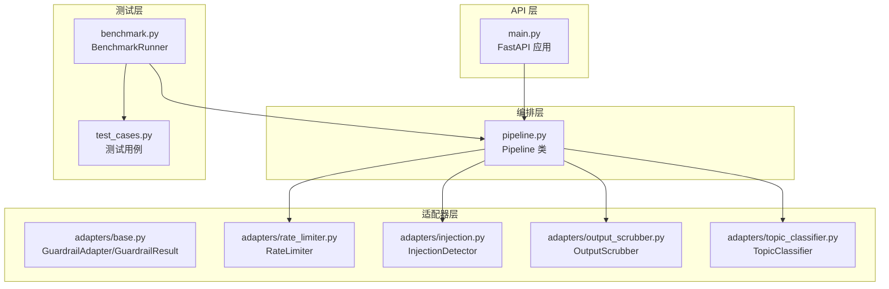
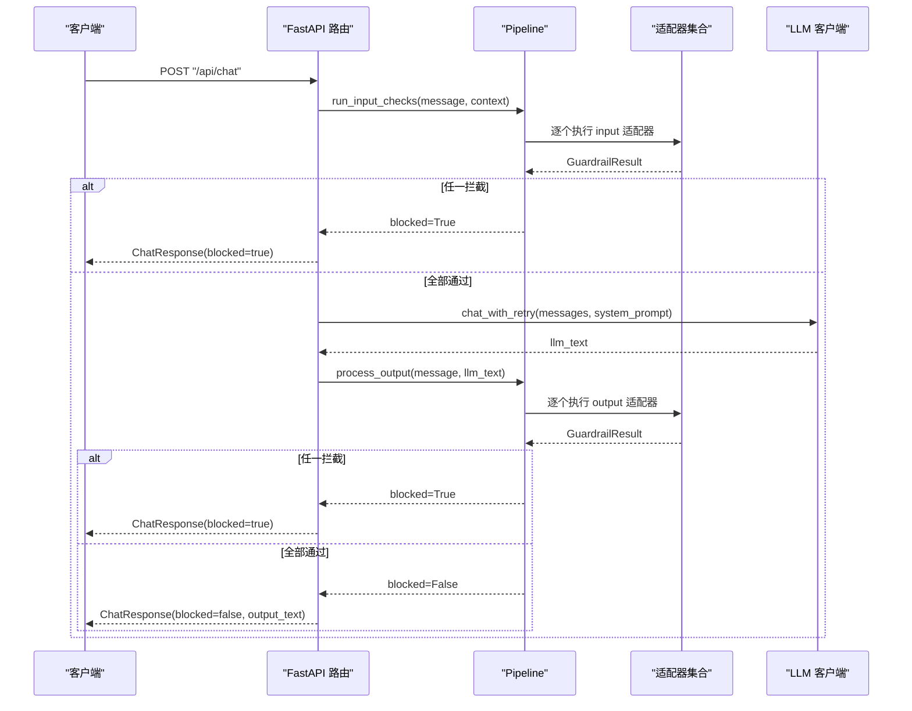
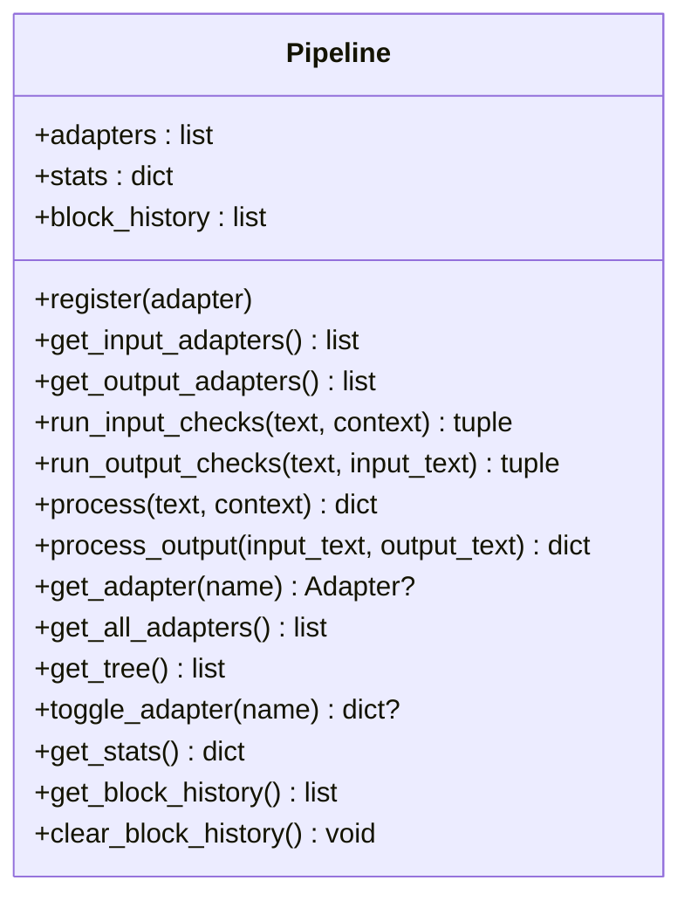
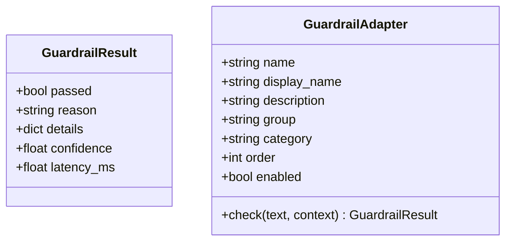
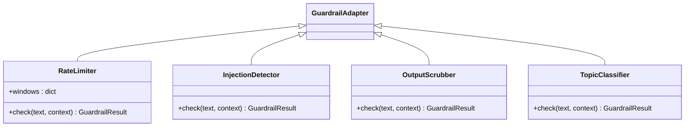
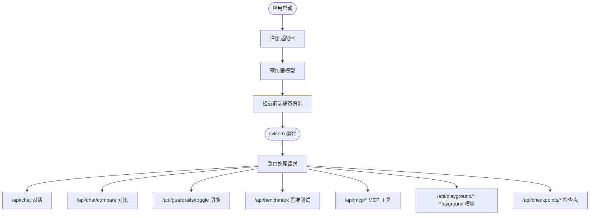
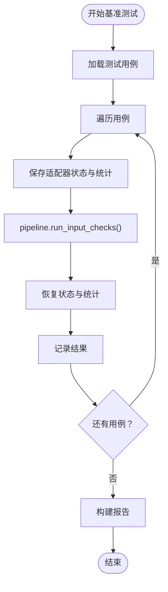
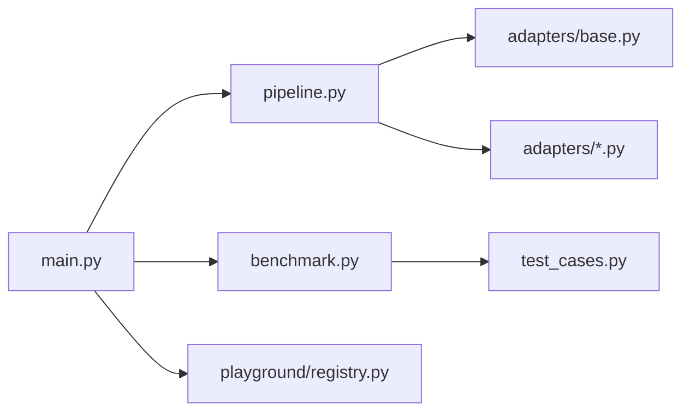

# 管道集成与管理

<cite>
**本文档引用的文件**
- [pipeline.py](file://guardrails-sandbox/backend/pipeline.py)
- [main.py](file://guardrails-sandbox/backend/main.py)
- [base.py](file://guardrails-sandbox/backend/adapters/base.py)
- [injection.py](file://guardrails-sandbox/backend/adapters/injection.py)
- [output_scrubber.py](file://guardrails-sandbox/backend/adapters/output_scrubber.py)
- [rate_limiter.py](file://guardrails-sandbox/backend/adapters/rate_limiter.py)
- [topic_classifier.py](file://guardrails-sandbox/backend/adapters/topic_classifier.py)
- [benchmark.py](file://guardrails-sandbox/backend/benchmark.py)
- [test_cases.py](file://guardrails-sandbox/backend/test_cases.py)
- [registry.py](file://guardrails-sandbox/backend/playground/registry.py)
</cite>

## 目录
1. [简介](#简介)
2. [项目结构](#项目结构)
3. [核心组件](#核心组件)
4. [架构总览](#架构总览)
5. [详细组件分析](#详细组件分析)
6. [依赖关系分析](#依赖关系分析)
7. [性能考虑](#性能考虑)
8. [故障排查指南](#故障排查指南)
9. [结论](#结论)
10. [附录](#附录)

## 简介
本文件面向“管道集成与管理”，聚焦于 guardrails-sandbox 后端的适配器管道编排机制。文档详细解释了 pipeline.py 中定义的管道架构、适配器的注册与调度机制，以及 main.py 中的系统入口与配置管理；并提供管道配置选项、适配器执行顺序控制、错误处理与恢复策略、动态增删适配器的方法，以及性能监控、日志记录、调试工具的使用方法与最佳实践。

## 项目结构
guardrails-sandbox 后端采用“适配器 + 管线”的分层设计：
- 管线层：统一编排与调度，负责适配器注册、执行顺序、统计与拦截历史
- 适配器层：具体的安全与质量控制逻辑，如速率限制、注入检测、PII 脱敏等
- API 层：FastAPI 提供 REST 接口，对接前端与外部工具
- 基准测试层：内置测试用例与评估指标，支持自动化验证

图表来源
- [main.py:1-421](file://guardrails-sandbox/backend/main.py#L1-L421)
- [pipeline.py:1-285](file://guardrails-sandbox/backend/pipeline.py#L1-L285)
- [base.py:1-34](file://guardrails-sandbox/backend/adapters/base.py#L1-L34)
- [rate_limiter.py:1-56](file://guardrails-sandbox/backend/adapters/rate_limiter.py#L1-L56)
- [injection.py:1-88](file://guardrails-sandbox/backend/adapters/injection.py#L1-L88)
- [output_scrubber.py:1-56](file://guardrails-sandbox/backend/adapters/output_scrubber.py#L1-L56)
- [topic_classifier.py:1-54](file://guardrails-sandbox/backend/adapters/topic_classifier.py#L1-L54)
- [benchmark.py:1-169](file://guardrails-sandbox/backend/benchmark.py#L1-L169)
- [test_cases.py:1-155](file://guardrails-sandbox/backend/test_cases.py#L1-L155)

章节来源
- [main.py:1-421](file://guardrails-sandbox/backend/main.py#L1-L421)
- [pipeline.py:1-285](file://guardrails-sandbox/backend/pipeline.py#L1-L285)

## 核心组件
- Pipeline：统一编排与调度，负责适配器注册、执行顺序、统计与拦截历史
- GuardrailAdapter/GuardrailResult：适配器基类与结果数据结构
- 适配器实例：如 RateLimiter、InjectionDetector、OutputScrubber、TopicClassifier 等
- FastAPI 应用：提供 REST 接口，对接前端与外部工具
- BenchmarkRunner：基准测试引擎，基于测试用例评估拦截效果

章节来源
- [pipeline.py:12-285](file://guardrails-sandbox/backend/pipeline.py#L12-L285)
- [base.py:5-34](file://guardrails-sandbox/backend/adapters/base.py#L5-L34)
- [main.py:24-58](file://guardrails-sandbox/backend/main.py#L24-L58)
- [benchmark.py:10-169](file://guardrails-sandbox/backend/benchmark.py#L10-L169)

## 架构总览
管道执行分为两阶段：
- 输入检查（input checks）：短路拦截，通过后进入 LLM 调用
- 输出检查（output checks）：对 LLM 返回进行脱敏与合规检查，必要时短路

图表来源
- [main.py:155-221](file://guardrails-sandbox/backend/main.py#L155-L221)
- [pipeline.py:31-160](file://guardrails-sandbox/backend/pipeline.py#L31-L160)

## 详细组件分析

### 管线编排（Pipeline）
- 注册与排序：按 order 与 name 升序排列，确保确定性执行顺序
- 输入/输出适配器筛选：分别获取 category 为 input 或 output 且 enabled 的适配器
- 短路策略：任一 input 适配器失败即返回，避免调用 LLM
- 统计与历史：记录总次数、拦截次数、按适配器分层统计，维护拦截历史（最多 50 条）

图表来源
- [pipeline.py:12-285](file://guardrails-sandbox/backend/pipeline.py#L12-L285)

章节来源
- [pipeline.py:12-160](file://guardrails-sandbox/backend/pipeline.py#L12-L160)
- [pipeline.py:162-285](file://guardrails-sandbox/backend/pipeline.py#L162-L285)

### 适配器基类与结果
- GuardrailResult：封装检查结果（通过/失败、原因、置信度、耗时、细节）
- GuardrailAdapter：定义适配器元信息（name/display_name/description/group/category/order/enabled）与 check 抽象方法

图表来源
- [base.py:5-34](file://guardrails-sandbox/backend/adapters/base.py#L5-L34)

章节来源
- [base.py:5-34](file://guardrails-sandbox/backend/adapters/base.py#L5-L34)

### 适配器实例与功能
- 速率限制（RateLimiter）：基于滑动窗口的 RPM 限制，按 tier 配置不同上限
- 注入检测（InjectionDetector）：正则匹配已知攻击模式与编码绕过
- 输出脱敏（OutputScrubber）：替换 PII 为占位符，不阻断
- 话题分类（TopicClassifier）：允许白名单话题，拦截黑名单关键词

图表来源
- [rate_limiter.py:7-56](file://guardrails-sandbox/backend/adapters/rate_limiter.py#L7-L56)
- [injection.py:44-88](file://guardrails-sandbox/backend/adapters/injection.py#L44-L88)
- [output_scrubber.py:16-56](file://guardrails-sandbox/backend/adapters/output_scrubber.py#L16-L56)
- [topic_classifier.py:20-54](file://guardrails-sandbox/backend/adapters/topic_classifier.py#L20-L54)

章节来源
- [rate_limiter.py:7-56](file://guardrails-sandbox/backend/adapters/rate_limiter.py#L7-L56)
- [injection.py:44-88](file://guardrails-sandbox/backend/adapters/injection.py#L44-L88)
- [output_scrubber.py:16-56](file://guardrails-sandbox/backend/adapters/output_scrubber.py#L16-L56)
- [topic_classifier.py:20-54](file://guardrails-sandbox/backend/adapters/topic_classifier.py#L20-L54)

### 系统入口与配置管理（main.py）
- 注册适配器：在应用启动时集中注册所有适配器实例
- 预加载模型：在 uvicorn 启动前预热 sentence-transformers 模型，避免异步环境连接问题
- API 路由：
  - 获取适配器树与统计：/api/guardrails、/api/adapters/tree、/api/guardrails/block-history
  - 切换适配器开关：/api/guardrails/toggle
  - 对话接口：/api/chat（含对比模式 /api/chat/compare）
  - 基准测试：/api/benchmark
  - MCP 工具代理：/api/mcp/call、/api/mcp/tools
  - Playground 模块：/api/playground/modules、/api/playground/run
  - 检查点数据库：/api/checkpoints/dbs、/api/checkpoints/inspect
- 错误处理：捕获 LLM 调用异常并返回统一格式

图表来源
- [main.py:24-58](file://guardrails-sandbox/backend/main.py#L24-L58)
- [main.py:62-77](file://guardrails-sandbox/backend/main.py#L62-L77)
- [main.py:121-281](file://guardrails-sandbox/backend/main.py#L121-L281)

章节来源
- [main.py:24-58](file://guardrails-sandbox/backend/main.py#L24-L58)
- [main.py:121-281](file://guardrails-sandbox/backend/main.py#L121-L281)

### 基准测试与评估（BenchmarkRunner）
- 运行策略：对每个用例调用 pipeline.run_input_checks()，不触发 LLM
- 指标计算：TPR/FPR/精确率/F1，按类别与拦截层统计
- 状态隔离：临时启用所有适配器并保存/恢复速率限制器窗口与统计

图表来源
- [benchmark.py:14-81](file://guardrails-sandbox/backend/benchmark.py#L14-L81)
- [test_cases.py:10-155](file://guardrails-sandbox/backend/test_cases.py#L10-L155)

章节来源
- [benchmark.py:10-169](file://guardrails-sandbox/backend/benchmark.py#L10-L169)
- [test_cases.py:10-155](file://guardrails-sandbox/backend/test_cases.py#L10-L155)

## 依赖关系分析
- 管线依赖适配器基类与具体适配器实现
- API 层依赖管线与 LLM 客户端，并提供 Playground 与 MCP 集成
- 基准测试依赖测试用例与管线，用于自动化评估

图表来源
- [main.py:16-18](file://guardrails-sandbox/backend/main.py#L16-L18)
- [pipeline.py:9](file://guardrails-sandbox/backend/pipeline.py#L9)
- [benchmark.py:7](file://guardrails-sandbox/backend/benchmark.py#L7)

章节来源
- [main.py:16-18](file://guardrails-sandbox/backend/main.py#L16-L18)
- [pipeline.py:9](file://guardrails-sandbox/backend/pipeline.py#L9)
- [benchmark.py:7](file://guardrails-sandbox/backend/benchmark.py#L7)

## 性能考虑
- 执行顺序优化：通过 order 控制执行顺序，将轻量快速的适配器前置（如速率限制、长度检查），减少不必要的后续开销
- 短路拦截：输入阶段一旦拦截立即返回，避免 LLM 调用
- 统计与延迟：每个适配器返回 latency_ms，便于定位瓶颈
- 预加载模型：在启动阶段预热模型，降低首次调用延迟
- 并发与异步：MCP 工具调用通过线程池安全运行协程，避免事件循环冲突

章节来源
- [pipeline.py:22-23](file://guardrails-sandbox/backend/pipeline.py#L22-L23)
- [main.py:62-77](file://guardrails-sandbox/backend/main.py#L62-L77)
- [main.py:291-303](file://guardrails-sandbox/backend/main.py#L291-L303)

## 故障排查指南
- 拦截历史：通过 /api/guardrails/block-history 查看最近拦截记录，定位拦截适配器与原因
- 清理历史：/api/guardrails/clear-history 清空拦截历史
- 统计信息：/api/guardrails 获取总体统计与按适配器分层统计，识别高频拦截项
- 重置统计：/api/chat/reset-stats 重置统计与历史
- 对比模式：/api/chat/compare 对比开启/关闭 guardrails 的差异，辅助定位问题
- MCP 工具：/api/mcp/tools 列出可用工具，/api/mcp/call 调用工具，排查外部依赖问题
- Playground 模块：/api/playground/modules 与 /api/playground/run 检查实验模块可用性

章节来源
- [main.py:136-152](file://guardrails-sandbox/backend/main.py#L136-L152)
- [main.py:259-266](file://guardrails-sandbox/backend/main.py#L259-L266)
- [main.py:223-257](file://guardrails-sandbox/backend/main.py#L223-L257)
- [main.py:333-357](file://guardrails-sandbox/backend/main.py#L333-L357)
- [main.py:368-378](file://guardrails-sandbox/backend/main.py#L368-L378)

## 结论
该管道系统以 Pipeline 为核心，通过适配器注册与排序实现可控的执行序列；以短路拦截与脱敏策略保障安全性与合规性；以统计与历史记录支撑可观测性与持续改进。结合 FastAPI 的丰富接口与基准测试能力，系统具备良好的可扩展性与可运维性。

## 附录

### 管道配置选项与控制
- 适配器开关：/api/guardrails/toggle 动态启用/禁用特定适配器
- 执行顺序：通过 order 字段控制，数值越小优先级越高
- 分组与分类：group 与 category 决定在树形结构中的位置与展示
- 上下文传递：适配器可通过 context 共享中间结果（如 OutputScrubber 设置 scrubbed_output）

章节来源
- [pipeline.py:187-235](file://guardrails-sandbox/backend/pipeline.py#L187-L235)
- [pipeline.py:237-246](file://guardrails-sandbox/backend/pipeline.py#L237-L246)
- [output_scrubber.py:43-44](file://guardrails-sandbox/backend/adapters/output_scrubber.py#L43-L44)

### 错误处理与恢复策略
- 输入阶段拦截：立即返回 ChatResponse，包含 block_stage 与 block_reason
- LLM 调用异常：捕获异常并返回统一格式，block_stage 标记为 llm_error
- 输出阶段拦截：返回 ChatResponse，包含 block_stage 与 block_detail
- 基准测试隔离：临时启用适配器并保存/恢复速率限制器窗口与统计，保证测试一致性

章节来源
- [main.py:160-210](file://guardrails-sandbox/backend/main.py#L160-L210)
- [main.py:186-194](file://guardrails-sandbox/backend/main.py#L186-L194)
- [benchmark.py:32-61](file://guardrails-sandbox/backend/benchmark.py#L32-L61)

### 动态添加或移除适配器
- 添加新适配器：在 main.py 的 register_all_adapters() 中注册实例
- 移除适配器：注释或删除相应注册行
- 运行时切换：通过 /api/guardrails/toggle 切换 enabled 状态
- 清理统计：/api/chat/reset-stats 重置统计与历史

章节来源
- [main.py:24-58](file://guardrails-sandbox/backend/main.py#L24-L58)
- [pipeline.py:237-246](file://guardrails-sandbox/backend/pipeline.py#L237-L246)
- [pipeline.py:259-266](file://guardrails-sandbox/backend/pipeline.py#L259-L266)

### 性能监控与日志记录
- 适配器日志：每次检查生成包含 name/description/passed/confidence/latency_ms/reason/details 的日志条目
- 总体统计：total/blocked/passed/block_rate_pct 与按适配器分层统计
- 拦截历史：最多保留 50 条，包含时间戳、输入片段、适配器名、阶段、原因与置信度
- 基准测试报告：包含类别与拦截层统计、TPR/FPR/精确率/F1 等指标

章节来源
- [pipeline.py:37-56](file://guardrails-sandbox/backend/pipeline.py#L37-L56)
- [pipeline.py:247-262](file://guardrails-sandbox/backend/pipeline.py#L247-L262)
- [pipeline.py:264-281](file://guardrails-sandbox/backend/pipeline.py#L264-L281)
- [benchmark.py:82-168](file://guardrails-sandbox/backend/benchmark.py#L82-L168)

### 调试工具与最佳实践
- 调试工具：
  - /api/guardrails 查看适配器树与统计
  - /api/guardrails/block-history 查看拦截历史
  - /api/chat/compare 对比开启/关闭 guardrails 的差异
  - /api/benchmark 运行基准测试
- 最佳实践：
  - 将轻量快速的适配器置于前排（如速率限制、长度检查）
  - 使用分组与分类清晰组织适配器，便于前端展示与管理
  - 通过对比模式验证适配器效果，逐步调整 order 与阈值
  - 定期清理统计与历史，避免累积影响观测

章节来源
- [main.py:121-128](file://guardrails-sandbox/backend/main.py#L121-L128)
- [main.py:136-144](file://guardrails-sandbox/backend/main.py#L136-L144)
- [main.py:223-257](file://guardrails-sandbox/backend/main.py#L223-L257)
- [main.py:272-281](file://guardrails-sandbox/backend/main.py#L272-L281)