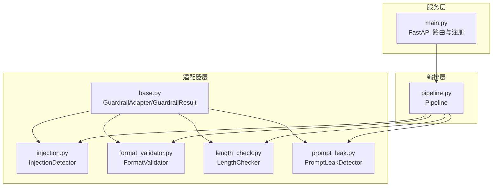
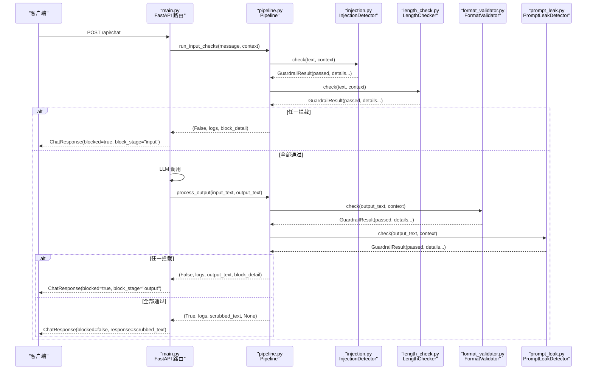
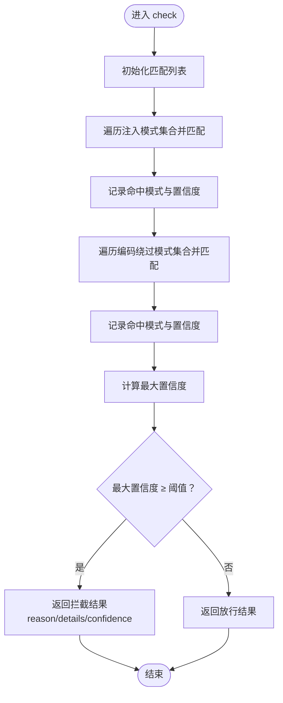
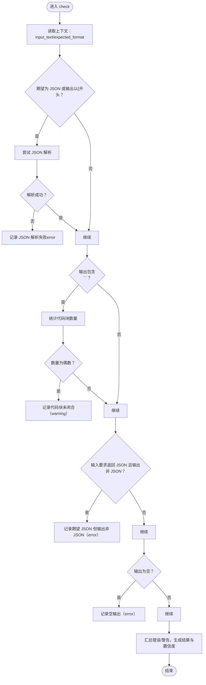
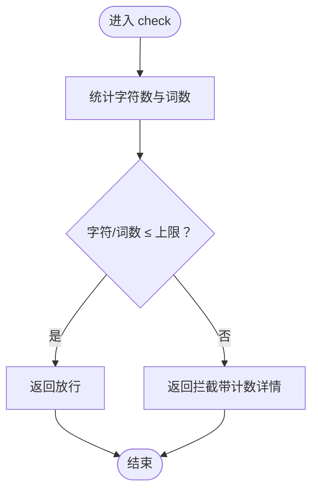
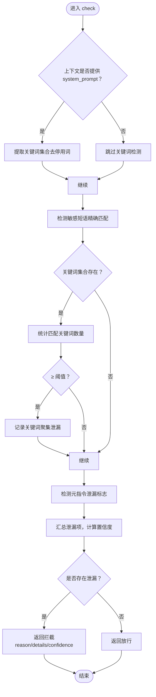
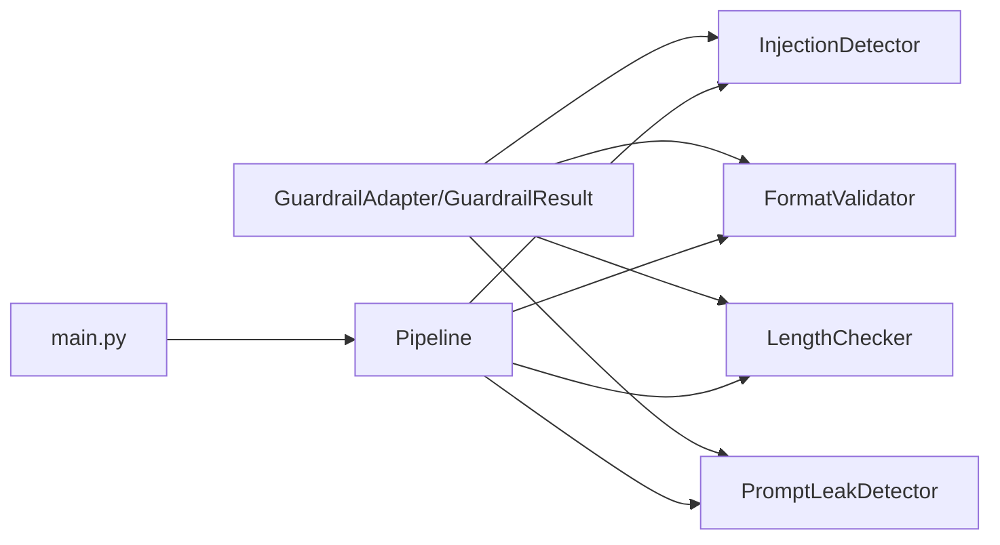

# 输入输出验证适配器

<cite>
**本文引用的文件**
- [guardrails-sandbox/backend/adapters/base.py](file://guardrails-sandbox/backend/adapters/base.py)
- [guardrails-sandbox/backend/adapters/injection.py](file://guardrails-sandbox/backend/adapters/injection.py)
- [guardrails-sandbox/backend/adapters/format_validator.py](file://guardrails-sandbox/backend/adapters/format_validator.py)
- [guardrails-sandbox/backend/adapters/length_check.py](file://guardrails-sandbox/backend/adapters/length_check.py)
- [guardrails-sandbox/backend/adapters/prompt_leak.py](file://guardrails-sandbox/backend/adapters/prompt_leak.py)
- [guardrails-sandbox/backend/pipeline.py](file://guardrails-sandbox/backend/pipeline.py)
- [guardrails-sandbox/backend/main.py](file://guardrails-sandbox/backend/main.py)
- [guardrails-sandbox/backend/adapters/__init__.py](file://guardrails-sandbox/backend/adapters/__init__.py)
- [guardrails-sandbox/backend/test_cases.py](file://guardrails-sandbox/backend/test_cases.py)
</cite>

## 目录
1. [简介](#简介)
2. [项目结构](#项目结构)
3. [核心组件](#核心组件)
4. [架构总览](#架构总览)
5. [详细组件分析](#详细组件分析)
6. [依赖关系分析](#依赖关系分析)
7. [性能考量](#性能考量)
8. [故障排查指南](#故障排查指南)
9. [结论](#结论)
10. [附录](#附录)

## 简介
本文件聚焦于“输入输出验证适配器”，系统性梳理以下四个关键适配器的功能、实现原理与安全价值：
- 注入检测（InjectionDetector）：基于正则表达式的提示注入攻击识别，覆盖英文与中文典型模式及编码绕过手法。
- 格式验证器（FormatValidator）：保障 LLM 输出符合预期格式（JSON/代码块/文本），避免下游解析崩溃。
- 长度检查（LengthChecker）：限制输入字符数与词数，缓解资源滥用与性能风险。
- Prompt 泄露检测（PromptLeakDetector）：检测 LLM 输出中是否泄露系统提示中的敏感短语与关键词，降低提示工程资产被利用的风险。

这些适配器通过统一的基类与管线编排，形成“输入层-LLM-输出层”的三段式安全防线，既可作为生产级防护，也可用于教学与基准测试。

## 项目结构
与输入输出验证适配器直接相关的目录与文件如下：
- 适配器基类与通用结果类型：adapters/base.py
- 具体适配器实现：
  - adapters/injection.py（注入检测）
  - adapters/format_validator.py（格式验证）
  - adapters/length_check.py（长度检查）
  - adapters/prompt_leak.py（Prompt 泄露检测）
- 管线编排：backend/pipeline.py
- 服务入口与注册：backend/main.py
- 适配器导出清单：adapters/__init__.py
- 基准测试用例：backend/test_cases.py

图表来源
- [guardrails-sandbox/backend/adapters/base.py:1-34](file://guardrails-sandbox/backend/adapters/base.py#L1-L34)
- [guardrails-sandbox/backend/adapters/injection.py:1-88](file://guardrails-sandbox/backend/adapters/injection.py#L1-L88)
- [guardrails-sandbox/backend/adapters/format_validator.py:1-86](file://guardrails-sandbox/backend/adapters/format_validator.py#L1-L86)
- [guardrails-sandbox/backend/adapters/length_check.py:1-37](file://guardrails-sandbox/backend/adapters/length_check.py#L1-L37)
- [guardrails-sandbox/backend/adapters/prompt_leak.py:1-94](file://guardrails-sandbox/backend/adapters/prompt_leak.py#L1-L94)
- [guardrails-sandbox/backend/pipeline.py:1-285](file://guardrails-sandbox/backend/pipeline.py#L1-L285)
- [guardrails-sandbox/backend/main.py:1-421](file://guardrails-sandbox/backend/main.py#L1-L421)

章节来源
- [guardrails-sandbox/backend/adapters/base.py:1-34](file://guardrails-sandbox/backend/adapters/base.py#L1-L34)
- [guardrails-sandbox/backend/pipeline.py:1-285](file://guardrails-sandbox/backend/pipeline.py#L1-L285)
- [guardrails-sandbox/backend/main.py:1-421](file://guardrails-sandbox/backend/main.py#L1-L421)

## 核心组件
- GuardrailAdapter：定义适配器接口与元信息（名称、显示名、描述、分组、类别、执行顺序、开关）；子类仅需实现 check 方法。
- GuardrailResult：标准化返回结构，包含是否通过、原因、细节、置信度、耗时等字段。
- Pipeline：负责注册适配器、按类别与顺序执行、短路拦截、统计与拦截历史记录。

章节来源
- [guardrails-sandbox/backend/adapters/base.py:1-34](file://guardrails-sandbox/backend/adapters/base.py#L1-L34)
- [guardrails-sandbox/backend/pipeline.py:1-285](file://guardrails-sandbox/backend/pipeline.py#L1-L285)

## 架构总览
下图展示从 FastAPI 请求到适配器执行再到最终响应的关键流程：

图表来源
- [guardrails-sandbox/backend/main.py:155-221](file://guardrails-sandbox/backend/main.py#L155-L221)
- [guardrails-sandbox/backend/pipeline.py:31-84](file://guardrails-sandbox/backend/pipeline.py#L31-L84)
- [guardrails-sandbox/backend/adapters/injection.py:53-87](file://guardrails-sandbox/backend/adapters/injection.py#L53-L87)
- [guardrails-sandbox/backend/adapters/length_check.py:18-36](file://guardrails-sandbox/backend/adapters/length_check.py#L18-L36)
- [guardrails-sandbox/backend/adapters/format_validator.py:22-85](file://guardrails-sandbox/backend/adapters/format_validator.py#L22-L85)
- [guardrails-sandbox/backend/adapters/prompt_leak.py:44-93](file://guardrails-sandbox/backend/adapters/prompt_leak.py#L44-L93)

## 详细组件分析

### 注入检测（InjectionDetector）
- 功能概述
  - 通过一组预定义正则表达式匹配提示注入攻击模式，包括覆盖指令、越狱口令、打印/泄露系统提示、编码绕过等。
  - 支持中英文注入模式，置信度用于衡量可疑程度。
- 关键实现要点
  - 使用正则匹配与大小写无关策略，收集命中模式及其置信度。
  - 对编码绕过（如 Unicode 转义、Base64、ROT13、十六进制、零宽字符等）进行专项检测。
  - 综合最高置信度决定是否拦截，阈值默认高于一定阈值才判定拦截。
- 安全价值
  - 防止通过指令覆盖、角色扮演、越狱口令等方式绕过系统提示与安全策略。
  - 有效识别常见编码绕过手法，降低注入成功率。
- 配置与阈值
  - 模式与置信度在源码中硬编码，可通过扩展模式集合与调整阈值（当前逻辑以最高置信度与固定阈值结合）实现。
- 复杂度与性能
  - 时间复杂度近似 O(N_patterns × T_text)，空间复杂度与匹配结果数量相关。
  - 单次检测耗时极低，适合在线拦截。

图表来源
- [guardrails-sandbox/backend/adapters/injection.py:53-87](file://guardrails-sandbox/backend/adapters/injection.py#L53-L87)

章节来源
- [guardrails-sandbox/backend/adapters/injection.py:1-88](file://guardrails-sandbox/backend/adapters/injection.py#L1-L88)

### 格式验证器（FormatValidator）
- 功能概述
  - 校验 LLM 输出格式是否符合预期，重点防范“返回纯文本而非 JSON”导致下游解析失败。
  - 检测 Markdown 代码块闭合、输入中要求结构化输出、空输出等场景。
- 关键实现要点
  - 当期望格式为 JSON 或输出以左花括号开头时尝试解析 JSON；若失败则记录错误。
  - 检测代码块数量奇偶性，未闭合则记录警告。
  - 若输入明确要求返回 JSON，而输出无法解析为 JSON，则记录错误。
  - 空输出视为错误。
  - 错误计数决定是否拦截，警告用于降权置信度。
- 安全价值
  - 将“格式错误”这类致命问题前置拦截，避免下游系统因解析异常崩溃。
- 配置与阈值
  - 通过上下文参数 expected_format 控制期望格式；默认按启发式判断。
- 复杂度与性能
  - JSON 解析与字符串分割开销较小，整体检测快速。

图表来源
- [guardrails-sandbox/backend/adapters/format_validator.py](file://guardrails-sandbox/backend/adapters/format_validator.py#L22-L85)

章节来源
- [guardrails-sandbox/backend/adapters/format_validator.py](file://guardrails-sandbox/backend/adapters/format_validator.py#L1-L86)

### 长度检查（LengthChecker）
- 功能概述
  - 限制输入的最大字符数与最大词数，防止超长输入造成资源消耗与性能问题。
- 关键实现要点
  - 计算字符数与词数，与预设上限比较，超过即拦截。
  - 拦截时提供详细计数信息，便于定位异常输入。
- 安全价值
  - 降低 DDoS 与资源耗尽风险，保证系统稳定性。
- 配置与阈值
  - 上限在源码中硬编码，可通过修改常量调整。

图表来源
- [guardrails-sandbox/backend/adapters/length_check.py](file://guardrails-sandbox/backend/adapters/length_check.py#L18-L36)

章节来源
- [guardrails-sandbox/backend/adapters/length_check.py](file://guardrails-sandbox/backend/adapters/length_check.py#L1-L37)

### Prompt 泄露检测（PromptLeakDetector）
- 功能概述
  - 检测 LLM 输出中是否泄露系统提示中的敏感短语或关键词，降低提示工程资产被利用的风险。
- 关键实现要点
  - 支持两类检测：
    - 敏感短语精确匹配（内置短语集合）。
    - 系统提示关键词密度检测（需通过 set_system_prompt 注入真实系统提示，提取关键词集合）。
    - 元指令泄漏标志检测（如覆盖指令、角色扮演等关键词）。
  - 置信度随泄漏数量线性提升，上限控制在合理范围。
- 安全价值
  - 防范“提示泄露”导致的针对性注入与对抗样本生成。
- 配置与阈值
  - 敏感短语集合与关键词密度阈值在源码中硬编码；可通过注入真实系统提示启用关键词检测。
- 复杂度与性能
  - 关键词集合查找与字符串包含均为线性扫描，开销较低。

图表来源
- [guardrails-sandbox/backend/adapters/prompt_leak.py](file://guardrails-sandbox/backend/adapters/prompt_leak.py#L35-L93)

章节来源
- [guardrails-sandbox/backend/adapters/prompt_leak.py](file://guardrails-sandbox/backend/adapters/prompt_leak.py#L1-L94)

## 依赖关系分析
- 组件耦合
  - 所有适配器均继承自 GuardrailAdapter，遵循统一接口，便于扩展与替换。
  - Pipeline 仅依赖适配器接口，不关心具体实现，保持良好内聚与低耦合。
- 外部依赖
  - 正则表达式用于注入与编码绕过检测。
  - JSON 解析用于格式验证。
  - 上下文字典用于传递输入文本、期望格式、系统提示等。
- 潜在循环依赖
  - 未发现循环导入；适配器之间无直接相互依赖。

图表来源
- [guardrails-sandbox/backend/adapters/base.py:14-34](file://guardrails-sandbox/backend/adapters/base.py#L14-L34)
- [guardrails-sandbox/backend/pipeline.py:12-24](file://guardrails-sandbox/backend/pipeline.py#L12-L24)
- [guardrails-sandbox/backend/main.py:24-58](file://guardrails-sandbox/backend/main.py#L24-L58)

章节来源
- [guardrails-sandbox/backend/adapters/base.py:1-34](file://guardrails-sandbox/backend/adapters/base.py#L1-L34)
- [guardrails-sandbox/backend/pipeline.py:1-285](file://guardrails-sandbox/backend/pipeline.py#L1-L285)
- [guardrails-sandbox/backend/main.py:1-421](file://guardrails-sandbox/backend/main.py#L1-L421)

## 性能考量
- 时间复杂度
  - 注入检测：O(N_patterns × T_text)，其中 N_patterns 为模式数量，T_text 为文本长度。
  - 格式验证：主要为字符串扫描与 JSON 解析，整体 O(T_text + N_json)。
  - 长度检查：O(T_text)（按空格切分词）。
  - Prompt 泄露检测：字符串包含与集合查找，近似 O(T_text + N_phrases + N_keywords)。
- 空间复杂度
  - 主要取决于匹配结果与关键词集合规模，通常较小。
- 优化建议
  - 对超长输入提前短路（长度检查在前）。
  - 正则表达式尽量避免回溯陷阱，必要时预编译。
  - JSON 解析失败时尽早返回，减少后续处理。
  - 关键词集合可缓存，避免重复构建。

## 故障排查指南
- 常见问题
  - 注入检测频繁误报：检查注入模式集合与置信度阈值，适当放宽或增加白名单。
  - 格式验证误判：确认 expected_format 是否正确传递，或输入中是否明确要求 JSON。
  - Prompt 泄露检测漏报：确保通过上下文注入真实系统提示，以便启用关键词密度检测。
  - 长度检查触发：根据业务需求调整上限或提示用户精简输入。
- 日志与统计
  - 通过 API 获取适配器树形结构、统计信息与拦截历史，定位问题适配器与触发条件。
- 快速恢复
  - 通过切换适配器开关临时禁用可疑适配器，观察效果后再恢复。

章节来源
- [guardrails-sandbox/backend/pipeline.py:188-235](file://guardrails-sandbox/backend/pipeline.py#L188-L235)
- [guardrails-sandbox/backend/main.py:121-153](file://guardrails-sandbox/backend/main.py#L121-L153)

## 结论
输入输出验证适配器通过“注入检测-格式验证-长度检查-Prompt 泄露检测”的组合拳，有效提升了系统的安全性与鲁棒性。它们以轻量高效的实现方式融入统一管线，既能满足生产环境的实时性要求，又便于扩展与调试。建议在不同场景下按需调整阈值与规则，并结合上下文信息（如系统提示、期望格式）进一步增强防护效果。

## 附录

### 配置参数与阈值说明
- 注入检测（InjectionDetector）
  - 模式与置信度：内置在源码中，支持扩展。
  - 拦截阈值：以最高置信度与固定阈值结合，超过阈值拦截。
- 格式验证器（FormatValidator）
  - 期望格式：通过上下文参数 expected_format 指定。
  - 行为：JSON 解析失败、代码块未闭合、输入要求 JSON 但输出非 JSON、空输出均可能导致拦截。
- 长度检查（LengthChecker）
  - 上限：字符数与词数分别设定，可在源码中修改。
- Prompt 泄露检测（PromptLeakDetector）
  - 敏感短语：内置集合，支持扩展。
  - 关键词密度：需注入真实系统提示以启用，匹配数量达到阈值即视为泄露。
  - 置信度：随泄漏数量线性提升，上限控制。

章节来源
- [guardrails-sandbox/backend/adapters/injection.py:7-41](file://guardrails-sandbox/backend/adapters/injection.py#L7-L41)
- [guardrails-sandbox/backend/adapters/format_validator.py:22-60](file://guardrails-sandbox/backend/adapters/format_validator.py#L22-L60)
- [guardrails-sandbox/backend/adapters/length_check.py:5-6](file://guardrails-sandbox/backend/adapters/length_check.py#L5-L6)
- [guardrails-sandbox/backend/adapters/prompt_leak.py:25-77](file://guardrails-sandbox/backend/adapters/prompt_leak.py#L25-L77)

### 安全威胁示例与防护效果
- 注入攻击示例（英文/中文覆盖指令、越狱口令、打印/泄露系统提示、编码绕过）
  - 防护效果：通过正则匹配与编码绕过检测，显著降低注入成功率。
- 格式错误示例（返回纯文本而非 JSON）
  - 防护效果：提前拦截格式错误，避免下游解析崩溃。
- 超长输入示例（字符/词数远超阈值）
  - 防护效果：及时阻断资源滥用，保障系统稳定。
- Prompt 泄露示例（输出中出现系统提示中的敏感短语或关键词）
  - 防护效果：检测并拦截泄露，降低提示工程资产被利用风险。

章节来源
- [guardrails-sandbox/backend/test_cases.py:47-102](file://guardrails-sandbox/backend/test_cases.py#L47-L102)
- [guardrails-sandbox/backend/adapters/injection.py:7-41](file://guardrails-sandbox/backend/adapters/injection.py#L7-L41)
- [guardrails-sandbox/backend/adapters/format_validator.py:30-68](file://guardrails-sandbox/backend/adapters/format_validator.py#L30-L68)
- [guardrails-sandbox/backend/adapters/length_check.py:18-28](file://guardrails-sandbox/backend/adapters/length_check.py#L18-L28)
- [guardrails-sandbox/backend/adapters/prompt_leak.py:44-93](file://guardrails-sandbox/backend/adapters/prompt_leak.py#L44-L93)