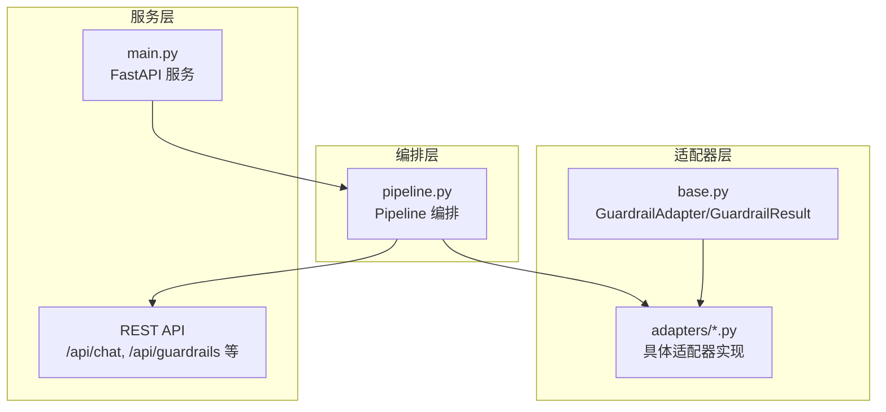
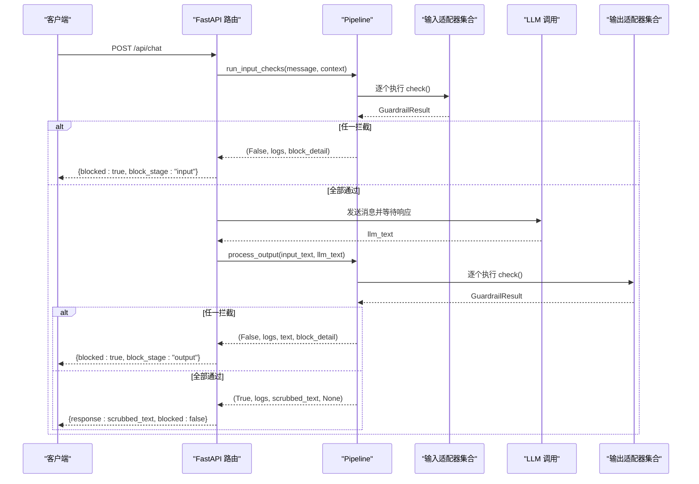
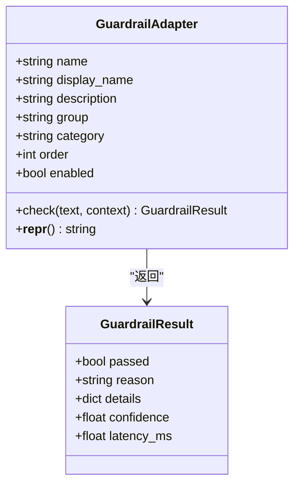
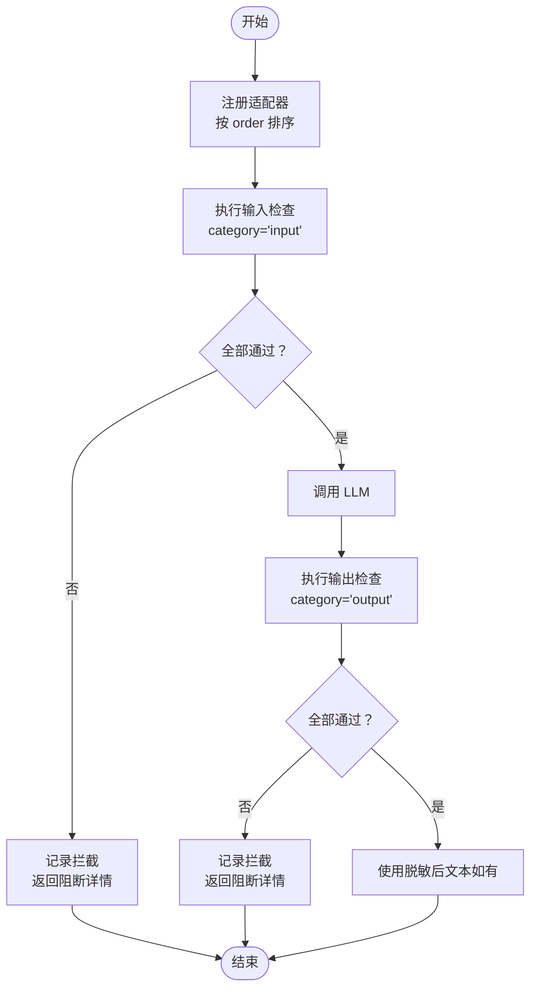
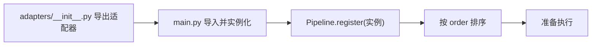
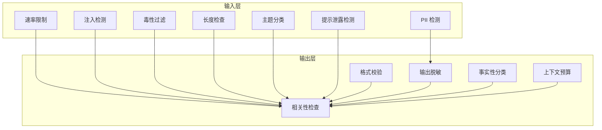
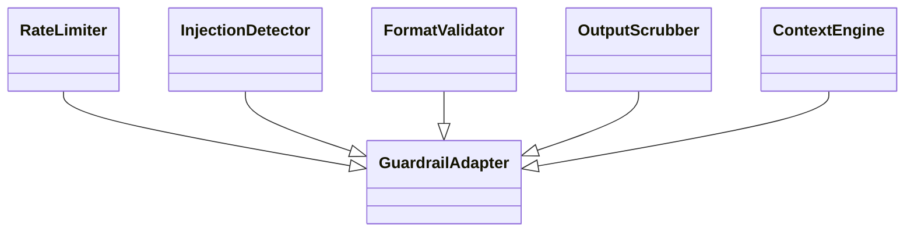
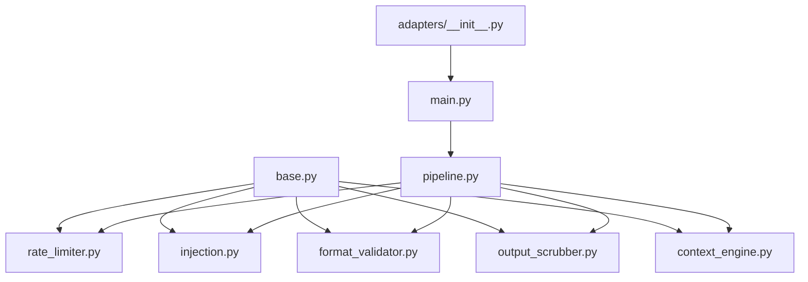

# 适配器基类设计

<cite>
**本文档引用的文件**
- [guardrails-sandbox/backend/adapters/base.py](file://guardrails-sandbox/backend/adapters/base.py)
- [guardrails-sandbox/backend/pipeline.py](file://guardrails-sandbox/backend/pipeline.py)
- [guardrails-sandbox/backend/main.py](file://guardrails-sandbox/backend/main.py)
- [guardrails-sandbox/backend/adapters/__init__.py](file://guardrails-sandbox/backend/adapters/__init__.py)
- [guardrails-sandbox/backend/adapters/rate_limiter.py](file://guardrails-sandbox/backend/adapters/rate_limiter.py)
- [guardrails-sandbox/backend/adapters/injection.py](file://guardrails-sandbox/backend/adapters/injection.py)
- [guardrails-sandbox/backend/adapters/pii_detector.py](file://guardrails-sandbox/backend/adapters/pii_detector.py)
- [guardrails-sandbox/backend/adapters/toxicity.py](file://guardrails-sandbox/backend/adapters/toxicity.py)
- [guardrails-sandbox/backend/adapters/relevance.py](file://guardrails-sandbox/backend/adapters/relevance.py)
- [guardrails-sandbox/backend/adapters/format_validator.py](file://guardrails-sandbox/backend/adapters/format_validator.py)
- [guardrails-sandbox/backend/adapters/output_scrubber.py](file://guardrails-sandbox/backend/adapters/output_scrubber.py)
- [guardrails-sandbox/backend/adapters/context_engine.py](file://guardrails-sandbox/backend/adapters/context_engine.py)
</cite>

## 目录
1. [引言](#引言)
2. [项目结构](#项目结构)
3. [核心组件](#核心组件)
4. [架构总览](#架构总览)
5. [详细组件分析](#详细组件分析)
6. [依赖分析](#依赖分析)
7. [性能考虑](#性能考虑)
8. [故障排除指南](#故障排除指南)
9. [结论](#结论)
10. [附录](#附录)

## 引言
本文件面向“适配器基类设计”，聚焦于防护墙系统中的适配器模式实现。文档围绕以下目标展开：
- 深入解释适配器模式在防护墙系统中的应用方式与价值
- 详细说明 base.py 中定义的抽象基类接口与标准化方法签名
- 介绍适配器生命周期管理、配置参数处理、错误处理机制
- 展示如何实现自定义适配器，并说明注册机制、工厂模式的应用
- 说明适配器之间的组合与继承关系
- 提供具体代码示例路径，展示如何扩展现有适配器或创建全新适配器类型

## 项目结构
防护墙系统的适配器位于 guardrails-sandbox/backend/adapters 目录，采用“按功能分层”的组织方式：
- base.py 定义 GuardrailAdapter 抽象基类与 GuardrailResult 结果封装
- pipeline.py 提供适配器编排、注册、执行与统计
- main.py 将适配器接入 FastAPI 服务，暴露 REST API
- adapters/__init__.py 统一导出适配器，便于集中注册
- 各具体适配器文件（如 rate_limiter.py、injection.py、format_validator.py 等）实现不同类型的防护策略

**图表来源**
- [guardrails-sandbox/backend/adapters/base.py:1-34](file://guardrails-sandbox/backend/adapters/base.py#L1-L34)
- [guardrails-sandbox/backend/pipeline.py:1-285](file://guardrails-sandbox/backend/pipeline.py#L1-L285)
- [guardrails-sandbox/backend/main.py:1-421](file://guardrails-sandbox/backend/main.py#L1-L421)

**章节来源**
- [guardrails-sandbox/backend/adapters/base.py:1-34](file://guardrails-sandbox/backend/adapters/base.py#L1-L34)
- [guardrails-sandbox/backend/pipeline.py:1-285](file://guardrails-sandbox/backend/pipeline.py#L1-L285)
- [guardrails-sandbox/backend/main.py:1-421](file://guardrails-sandbox/backend/main.py#L1-L421)

## 核心组件
本节聚焦于适配器基类与结果封装的数据结构与方法签名。

- GuardrailResult：统一的适配器输出结构，包含通过状态、原因、细节、置信度与耗时等字段，便于上层统计与前端展示。
- GuardrailAdapter：抽象基类，子类仅需实现 check 方法；同时提供 name/display_name/description/group/category/order/enabled 等元数据字段，用于树形结构展示与排序控制。

关键接口与字段：
- check(text: str, context: dict = None) -> GuardrailResult：标准化的检查入口，接收输入文本与上下文字典，返回统一的结果对象
- 元数据字段：name、display_name、description、group、category、order、enabled
- repr：用于调试与日志展示

这些设计确保了：
- 适配器实现的一致性与可扩展性
- 通过 order 控制执行顺序，通过 category 区分输入/输出检查
- 通过 enabled 开关灵活启用/禁用适配器

**章节来源**
- [guardrails-sandbox/backend/adapters/base.py:5-34](file://guardrails-sandbox/backend/adapters/base.py#L5-L34)

## 架构总览
防护墙系统采用“适配器 + 管线编排”的架构：
- 适配器：实现具体的安全/质量检查逻辑
- 管线：负责注册、排序、短路执行、统计与拦截历史记录
- 服务：通过 FastAPI 对外提供聊天、对比模式、开关切换、统计查询等接口

**图表来源**
- [guardrails-sandbox/backend/main.py:155-221](file://guardrails-sandbox/backend/main.py#L155-L221)
- [guardrails-sandbox/backend/pipeline.py:31-84](file://guardrails-sandbox/backend/pipeline.py#L31-L84)

**章节来源**
- [guardrails-sandbox/backend/main.py:155-221](file://guardrails-sandbox/backend/main.py#L155-L221)
- [guardrails-sandbox/backend/pipeline.py:31-84](file://guardrails-sandbox/backend/pipeline.py#L31-L84)

## 详细组件分析

### 基类与结果封装
- GuardrailResult：统一承载检查结果，便于统计与前端渲染
- GuardrailAdapter：定义标准化接口与元数据，子类只需实现 check 即可参与编排

**图表来源**
- [guardrails-sandbox/backend/adapters/base.py:5-34](file://guardrails-sandbox/backend/adapters/base.py#L5-L34)

**章节来源**
- [guardrails-sandbox/backend/adapters/base.py:5-34](file://guardrails-sandbox/backend/adapters/base.py#L5-L34)

### 管线编排与生命周期
- 注册：Pipeline.register 接受适配器实例，按 order 排序
- 输入检查：按 category="input" 的适配器顺序执行，遇阻断即短路
- 输出检查：按 category="output" 的适配器顺序执行，支持脱敏后的内容回填
- 统计与历史：记录 by_layer 统计、拦截历史、阻断率等

**图表来源**
- [guardrails-sandbox/backend/pipeline.py:12-84](file://guardrails-sandbox/backend/pipeline.py#L12-L84)

**章节来源**
- [guardrails-sandbox/backend/pipeline.py:12-84](file://guardrails-sandbox/backend/pipeline.py#L12-L84)

### 适配器注册机制与工厂模式
- 服务启动时集中注册所有适配器实例，形成统一的执行序列
- 通过 adapters/__init__.py 导出适配器，便于集中导入与注册
- 适配器实例化后交由 Pipeline 管理，支持动态开关与统计

**图表来源**
- [guardrails-sandbox/backend/adapters/__init__.py:1-16](file://guardrails-sandbox/backend/adapters/__init__.py#L1-L16)
- [guardrails-sandbox/backend/main.py:24-58](file://guardrails-sandbox/backend/main.py#L24-L58)

**章节来源**
- [guardrails-sandbox/backend/adapters/__init__.py:1-16](file://guardrails-sandbox/backend/adapters/__init__.py#L1-L16)
- [guardrails-sandbox/backend/main.py:24-58](file://guardrails-sandbox/backend/main.py#L24-L58)

### 适配器类型与职责划分
- 输入层（category="input"）：速率限制、注入检测、PII 检测、毒性过滤、长度检查、主题分类、提示泄露检测等
- 输出层（category="output"）：相关性检查、格式校验、输出脱敏、事实性分类、上下文预算等

**图表来源**
- [guardrails-sandbox/backend/adapters/rate_limiter.py:7-56](file://guardrails-sandbox/backend/adapters/rate_limiter.py#L7-L56)
- [guardrails-sandbox/backend/adapters/injection.py:44-88](file://guardrails-sandbox/backend/adapters/injection.py#L44-L88)
- [guardrails-sandbox/backend/adapters/pii_detector.py:19-54](file://guardrails-sandbox/backend/adapters/pii_detector.py#L19-L54)
- [guardrails-sandbox/backend/adapters/toxicity.py:22-64](file://guardrails-sandbox/backend/adapters/toxicity.py#L22-L64)
- [guardrails-sandbox/backend/adapters/relevance.py:23-70](file://guardrails-sandbox/backend/adapters/relevance.py#L23-L70)
- [guardrails-sandbox/backend/adapters/format_validator.py:13-86](file://guardrails-sandbox/backend/adapters/format_validator.py#L13-L86)
- [guardrails-sandbox/backend/adapters/output_scrubber.py:16-56](file://guardrails-sandbox/backend/adapters/output_scrubber.py#L16-L56)
- [guardrails-sandbox/backend/adapters/context_engine.py:179-242](file://guardrails-sandbox/backend/adapters/context_engine.py#L179-L242)

**章节来源**
- [guardrails-sandbox/backend/adapters/rate_limiter.py:7-56](file://guardrails-sandbox/backend/adapters/rate_limiter.py#L7-L56)
- [guardrails-sandbox/backend/adapters/injection.py:44-88](file://guardrails-sandbox/backend/adapters/injection.py#L44-L88)
- [guardrails-sandbox/backend/adapters/pii_detector.py:19-54](file://guardrails-sandbox/backend/adapters/pii_detector.py#L19-L54)
- [guardrails-sandbox/backend/adapters/toxicity.py:22-64](file://guardrails-sandbox/backend/adapters/toxicity.py#L22-L64)
- [guardrails-sandbox/backend/adapters/relevance.py:23-70](file://guardrails-sandbox/backend/adapters/relevance.py#L23-L70)
- [guardrails-sandbox/backend/adapters/format_validator.py:13-86](file://guardrails-sandbox/backend/adapters/format_validator.py#L13-L86)
- [guardrails-sandbox/backend/adapters/output_scrubber.py:16-56](file://guardrails-sandbox/backend/adapters/output_scrubber.py#L16-L56)
- [guardrails-sandbox/backend/adapters/context_engine.py:179-242](file://guardrails-sandbox/backend/adapters/context_engine.py#L179-L242)

### 生命周期管理与配置参数处理
- 生命周期：实例化 → 注册 → 排序 → 执行 → 记录统计与历史
- 配置参数：通过类属性（name、display_name、description、group、category、order、enabled）与上下文（context）传递运行时参数
- 上下文使用：如 format_validator 使用 context["expected_format"]、relevance 使用 context["input_text"]、rate_limiter 使用 context["user_id"] 和 tier 等

**章节来源**
- [guardrails-sandbox/backend/pipeline.py:18-24](file://guardrails-sandbox/backend/pipeline.py#L18-L24)
- [guardrails-sandbox/backend/adapters/format_validator.py:22-27](file://guardrails-sandbox/backend/adapters/format_validator.py#L22-L27)
- [guardrails-sandbox/backend/adapters/relevance.py:32-35](file://guardrails-sandbox/backend/adapters/relevance.py#L32-L35)
- [guardrails-sandbox/backend/adapters/rate_limiter.py:19-28](file://guardrails-sandbox/backend/adapters/rate_limiter.py#L19-L28)

### 错误处理机制
- 短路拦截：任一输入适配器失败即阻断请求，返回阻断详情与日志
- 输出适配器失败：可选择阻断或返回脱敏后的文本（如 OutputScrubber）
- 统一异常捕获：服务层对 LLM 调用异常进行包装并返回

**章节来源**
- [guardrails-sandbox/backend/pipeline.py:48-53](file://guardrails-sandbox/backend/pipeline.py#L48-L53)
- [guardrails-sandbox/backend/pipeline.py:77-80](file://guardrails-sandbox/backend/pipeline.py#L77-L80)
- [guardrails-sandbox/backend/main.py:186-194](file://guardrails-sandbox/backend/main.py#L186-L194)

### 自定义适配器实现指南
- 步骤
  1) 新建文件 adapters/my_adapter.py，继承 GuardrailAdapter
  2) 设置类属性：name、display_name、description、group、category、order、enabled
  3) 实现 check 方法：接收 text 与 context，返回 GuardrailResult
  4) 在 main.py 的 register_all_adapters 中实例化并注册
  5) 如需导出，更新 adapters/__init__.py
- 示例参考
  - 输入层示例：[guardrails-sandbox/backend/adapters/rate_limiter.py:7-56](file://guardrails-sandbox/backend/adapters/rate_limiter.py#L7-L56)、[guardrails-sandbox/backend/adapters/injection.py:44-88](file://guardrails-sandbox/backend/adapters/injection.py#L44-L88)
  - 输出层示例：[guardrails-sandbox/backend/adapters/format_validator.py:13-86](file://guardrails-sandbox/backend/adapters/format_validator.py#L13-L86)、[guardrails-sandbox/backend/adapters/output_scrubber.py:16-56](file://guardrails-sandbox/backend/adapters/output_scrubber.py#L16-L56)

**章节来源**
- [guardrails-sandbox/backend/adapters/rate_limiter.py:7-56](file://guardrails-sandbox/backend/adapters/rate_limiter.py#L7-L56)
- [guardrails-sandbox/backend/adapters/injection.py:44-88](file://guardrails-sandbox/backend/adapters/injection.py#L44-L88)
- [guardrails-sandbox/backend/adapters/format_validator.py:13-86](file://guardrails-sandbox/backend/adapters/format_validator.py#L13-L86)
- [guardrails-sandbox/backend/adapters/output_scrubber.py:16-56](file://guardrails-sandbox/backend/adapters/output_scrubber.py#L16-L56)
- [guardrails-sandbox/backend/main.py:24-58](file://guardrails-sandbox/backend/main.py#L24-L58)
- [guardrails-sandbox/backend/adapters/__init__.py:1-16](file://guardrails-sandbox/backend/adapters/__init__.py#L1-L16)

### 适配器组合与继承关系
- 组合：Pipeline 将多个适配器按顺序组合执行，形成“输入层 → LLM → 输出层”的流水线
- 继承：所有适配器继承 GuardrailAdapter，遵循统一接口；部分适配器内部可能包含辅助类（如 ContextEngine 中的 ContextBudget、HistoryCompressor）

**图表来源**
- [guardrails-sandbox/backend/adapters/base.py:14-34](file://guardrails-sandbox/backend/adapters/base.py#L14-L34)
- [guardrails-sandbox/backend/adapters/rate_limiter.py:7-56](file://guardrails-sandbox/backend/adapters/rate_limiter.py#L7-L56)
- [guardrails-sandbox/backend/adapters/injection.py:44-88](file://guardrails-sandbox/backend/adapters/injection.py#L44-L88)
- [guardrails-sandbox/backend/adapters/format_validator.py:13-86](file://guardrails-sandbox/backend/adapters/format_validator.py#L13-L86)
- [guardrails-sandbox/backend/adapters/output_scrubber.py:16-56](file://guardrails-sandbox/backend/adapters/output_scrubber.py#L16-L56)
- [guardrails-sandbox/backend/adapters/context_engine.py:179-242](file://guardrails-sandbox/backend/adapters/context_engine.py#L179-L242)

**章节来源**
- [guardrails-sandbox/backend/adapters/base.py:14-34](file://guardrails-sandbox/backend/adapters/base.py#L14-L34)
- [guardrails-sandbox/backend/adapters/context_engine.py:80-177](file://guardrails-sandbox/backend/adapters/context_engine.py#L80-L177)

## 依赖分析
- 适配器依赖 base.py 的抽象接口与结果封装
- Pipeline 依赖各适配器实例，负责注册、排序与执行
- main.py 依赖 Pipeline 并将其接入 FastAPI 路由
- adapters/__init__.py 作为适配器导出入口，便于集中注册

**图表来源**
- [guardrails-sandbox/backend/adapters/base.py:1-34](file://guardrails-sandbox/backend/adapters/base.py#L1-L34)
- [guardrails-sandbox/backend/pipeline.py:1-285](file://guardrails-sandbox/backend/pipeline.py#L1-L285)
- [guardrails-sandbox/backend/main.py:1-421](file://guardrails-sandbox/backend/main.py#L1-L421)
- [guardrails-sandbox/backend/adapters/__init__.py:1-16](file://guardrails-sandbox/backend/adapters/__init__.py#L1-L16)

**章节来源**
- [guardrails-sandbox/backend/adapters/base.py:1-34](file://guardrails-sandbox/backend/adapters/base.py#L1-L34)
- [guardrails-sandbox/backend/pipeline.py:1-285](file://guardrails-sandbox/backend/pipeline.py#L1-L285)
- [guardrails-sandbox/backend/main.py:1-421](file://guardrails-sandbox/backend/main.py#L1-L421)
- [guardrails-sandbox/backend/adapters/__init__.py:1-16](file://guardrails-sandbox/backend/adapters/__init__.py#L1-L16)

## 性能考虑
- 执行顺序：通过 order 控制，将轻量检查前置，减少后续昂贵检查的概率
- 短路策略：输入层任一拦截即短路，避免不必要的 LLM 调用
- 脱敏与统计：输出层脱敏与统计开销较小，但建议在高频场景下关注正则匹配与字符串处理的复杂度
- 上下文预算：ContextEngine 通过预算分配与历史压缩降低上下文溢出风险

[本节为通用指导，无需特定文件引用]

## 故障排除指南
- 适配器未生效
  - 检查 enabled 是否为 True
  - 确认已在 main.py 的 register_all_adapters 中注册
  - 确认 adapters/__init__.py 已导出该适配器
- 执行顺序异常
  - 检查 order 设置是否合理
  - 确认 Pipeline.register 后已排序
- 输出未脱敏
  - 确认输出层包含 OutputScrubber
  - 检查 context["scrubbed_output"] 是否被正确回填
- 拦截历史为空
  - 确认未处于基准测试模式（_benchmark）
  - 检查 Pipeline 的 block_history 长度限制

**章节来源**
- [guardrails-sandbox/backend/pipeline.py:237-285](file://guardrails-sandbox/backend/pipeline.py#L237-L285)
- [guardrails-sandbox/backend/main.py:24-58](file://guardrails-sandbox/backend/main.py#L24-L58)

## 结论
本设计以 GuardrailAdapter 为核心抽象，结合 Pipeline 的编排能力，实现了可插拔、可扩展、可观察的防护墙系统。通过统一的接口、标准化的结果封装与清晰的生命周期管理，开发者能够快速实现新的适配器并无缝集成到现有流程中。同时，输入/输出分层与短路策略保证了系统的性能与可靠性。

[本节为总结，无需特定文件引用]

## 附录
- 快速实现新适配器步骤
  1) 在 adapters/my_adapter.py 中继承 GuardrailAdapter，设置类属性
  2) 实现 check 方法，返回 GuardrailResult
  3) 在 main.py 的 register_all_adapters 中注册实例
  4) 可选：在 adapters/__init__.py 导出适配器
- 参考实现路径
  - 输入层：[guardrails-sandbox/backend/adapters/rate_limiter.py:7-56](file://guardrails-sandbox/backend/adapters/rate_limiter.py#L7-L56)、[guardrails-sandbox/backend/adapters/injection.py:44-88](file://guardrails-sandbox/backend/adapters/injection.py#L44-L88)
  - 输出层：[guardrails-sandbox/backend/adapters/format_validator.py:13-86](file://guardrails-sandbox/backend/adapters/format_validator.py#L13-L86)、[guardrails-sandbox/backend/adapters/output_scrubber.py:16-56](file://guardrails-sandbox/backend/adapters/output_scrubber.py#L16-L56)

**章节来源**
- [guardrails-sandbox/backend/adapters/rate_limiter.py:7-56](file://guardrails-sandbox/backend/adapters/rate_limiter.py#L7-L56)
- [guardrails-sandbox/backend/adapters/injection.py:44-88](file://guardrails-sandbox/backend/adapters/injection.py#L44-L88)
- [guardrails-sandbox/backend/adapters/format_validator.py:13-86](file://guardrails-sandbox/backend/adapters/format_validator.py#L13-L86)
- [guardrails-sandbox/backend/adapters/output_scrubber.py:16-56](file://guardrails-sandbox/backend/adapters/output_scrubber.py#L16-L56)
- [guardrails-sandbox/backend/main.py:24-58](file://guardrails-sandbox/backend/main.py#L24-L58)
- [guardrails-sandbox/backend/adapters/__init__.py:1-16](file://guardrails-sandbox/backend/adapters/__init__.py#L1-L16)