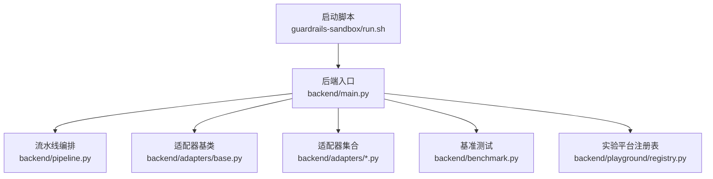
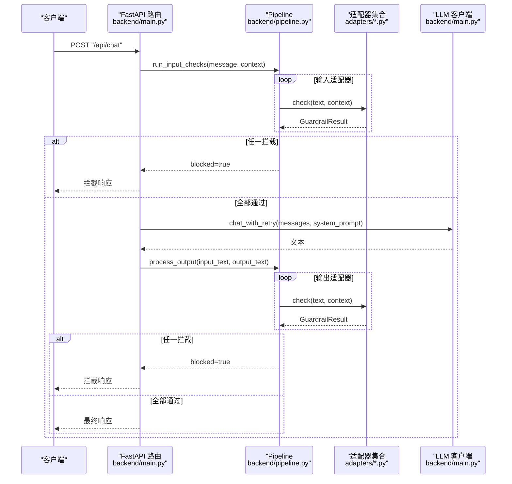
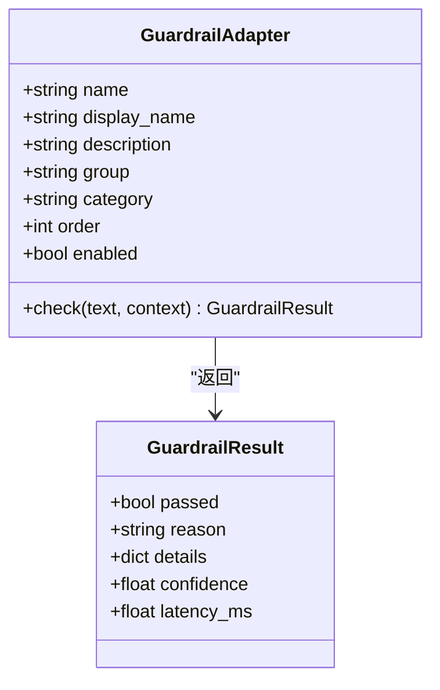
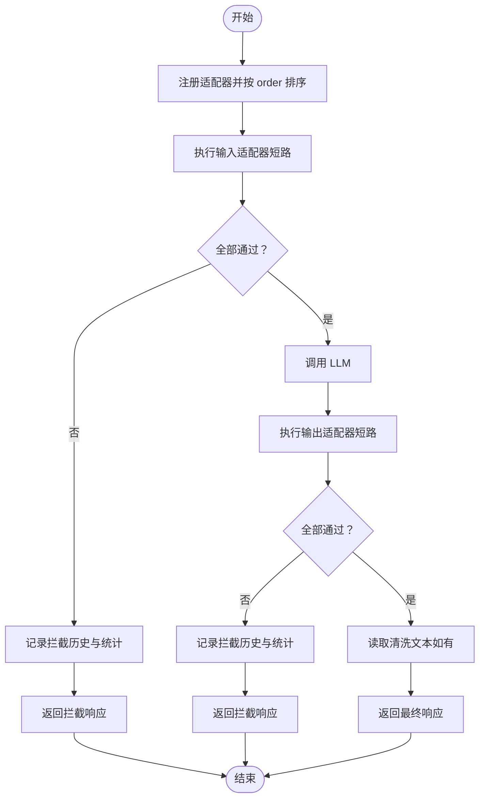
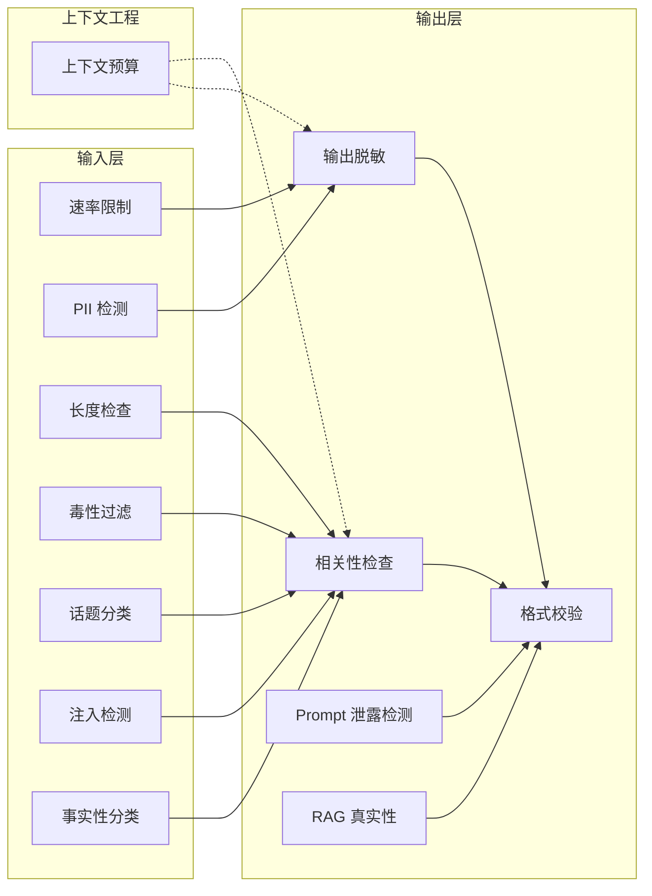
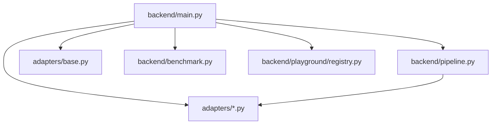

# 安全防护沙箱

<cite>
**本文引用的文件**
- [backend/main.py](file://guardrails-sandbox/backend/main.py)
- [backend/pipeline.py](file://guardrails-sandbox/backend/pipeline.py)
- [backend/adapters/base.py](file://guardrails-sandbox/backend/adapters/base.py)
- [backend/adapters/context_engine.py](file://guardrails-sandbox/backend/adapters/context_engine.py)
- [backend/adapters/factual_classifier.py](file://guardrails-sandbox/backend/adapters/factual_classifier.py)
- [backend/adapters/format_validator.py](file://guardrails-sandbox/backend/adapters/format_validator.py)
- [backend/adapters/injection.py](file://guardrails-sandbox/backend/adapters/injection.py)
- [backend/adapters/rate_limiter.py](file://guardrails-sandbox/backend/adapters/rate_limiter.py)
- [backend/adapters/topic_classifier.py](file://guardrails-sandbox/backend/adapters/topic_classifier.py)
- [backend/adapters/toxicity.py](file://guardrails-sandbox/backend/adapters/toxicity.py)
- [backend/adapters/relevance.py](file://guardrails-sandbox/backend/adapters/relevance.py)
- [backend/adapters/length_check.py](file://guardrails-sandbox/backend/adapters/length_check.py)
- [backend/adapters/pii_detector.py](file://guardrails-sandbox/backend/adapters/pii_detector.py)
- [backend/adapters/output_scrubber.py](file://guardrails-sandbox/backend/adapters/output_scrubber.py)
- [backend/adapters/prompt_leak.py](file://guardrails-sandbox/backend/adapters/prompt_leak.py)
- [backend/adapters/rag_groundedness.py](file://guardrails-sandbox/backend/adapters/rag_groundedness.py)
- [backend/benchmark.py](file://guardrails-sandbox/backend/benchmark.py)
- [backend/playground/registry.py](file://guardrails-sandbox/backend/playground/registry.py)
- [guardrails-sandbox/run.sh](file://guardrails-sandbox/run.sh)
</cite>

## 目录
1. [引言](#引言)
2. [项目结构](#项目结构)
3. [核心组件](#核心组件)
4. [架构总览](#架构总览)
5. [详细组件分析](#详细组件分析)
6. [依赖分析](#依赖分析)
7. [性能考虑](#性能考虑)
8. [故障排查指南](#故障排查指南)
9. [结论](#结论)
10. [附录](#附录)

## 引言
本项目为“安全防护沙箱”系统，旨在提供一套可插拔、可观测、可扩展的安全防护与实验平台。系统围绕“防护墙适配器”构建，采用流水线编排方式，在输入与输出阶段分别执行多类安全检查；同时提供课程实验台、检查点数据库、基准测试等工具，支持在受控环境中学习与演练 AI 安全技术。

## 项目结构
后端采用 Python + FastAPI，前端为 Vite + Vue，通过脚本一键启动前后端服务。后端目录组织清晰：适配器位于 adapters，实验平台模块位于 playground，核心入口为 main.py，编排逻辑在 pipeline.py，基准测试在 benchmark.py。

**图示来源**
- [backend/main.py:1-421](file://guardrails-sandbox/backend/main.py#L1-L421)
- [backend/pipeline.py:1-285](file://guardrails-sandbox/backend/pipeline.py#L1-L285)
- [backend/adapters/base.py:1-34](file://guardrails-sandbox/backend/adapters/base.py#L1-L34)
- [backend/benchmark.py:1-169](file://guardrails-sandbox/backend/benchmark.py#L1-L169)
- [backend/playground/registry.py:1-118](file://guardrails-sandbox/backend/playground/registry.py#L1-L118)
- [guardrails-sandbox/run.sh:1-35](file://guardrails-sandbox/run.sh#L1-L35)

**章节来源**
- [backend/main.py:1-421](file://guardrails-sandbox/backend/main.py#L1-L421)
- [guardrails-sandbox/run.sh:1-35](file://guardrails-sandbox/run.sh#L1-L35)

## 核心组件
- 适配器基类与结果模型：定义统一的 GuardrailAdapter 接口与 GuardrailResult 结构，确保各适配器一致性。
- 流水线 Pipeline：负责注册、排序、执行与统计，支持输入/输出两类检查，短路拦截与日志聚合。
- 适配器集合：覆盖速率限制、注入检测、PII 检测、毒性过滤、话题分类、长度检查、相关性检查、事实性分类、格式校验、上下文预算、输出脱敏、Prompt 泄露检测、RAG 真实性、基准测试与实验平台模块注册表。

**章节来源**
- [backend/adapters/base.py:1-34](file://guardrails-sandbox/backend/adapters/base.py#L1-L34)
- [backend/pipeline.py:1-285](file://guardrails-sandbox/backend/pipeline.py#L1-L285)

## 架构总览
系统采用“请求-流水线-LLM-输出检查”的主流程，支持对比模式、基准测试、MCP 工具调用、实验平台与检查点数据库查看。

**图示来源**
- [backend/main.py:155-221](file://guardrails-sandbox/backend/main.py#L155-L221)
- [backend/pipeline.py:31-160](file://guardrails-sandbox/backend/pipeline.py#L31-L160)

## 详细组件分析

### 适配器基类与结果模型
- GuardrailResult：封装通过/拒绝、原因、置信度、耗时与细节。
- GuardrailAdapter：定义 name/display_name/description/group/category/order/enabled 等元信息，子类仅需实现 check()。

**图示来源**
- [backend/adapters/base.py:5-34](file://guardrails-sandbox/backend/adapters/base.py#L5-L34)

**章节来源**
- [backend/adapters/base.py:1-34](file://guardrails-sandbox/backend/adapters/base.py#L1-L34)

### 流水线编排 Pipeline
- 注册与排序：按 order 与 name 排序，启用/禁用控制。
- 输入检查：逐个执行，遇阻即短路，记录拦截历史与统计。
- 输出检查：接收 LLM 输出，支持脱敏写回 context 并返回清洗后的文本。
- 统计与可视化：按分组/类别/适配器维度统计通过/拦截次数与拦截率。

**图示来源**
- [backend/pipeline.py:18-160](file://guardrails-sandbox/backend/pipeline.py#L18-L160)

**章节来源**
- [backend/pipeline.py:1-285](file://guardrails-sandbox/backend/pipeline.py#L1-L285)

### 适配器清单与功能概览
以下为 15 个防护墙适配器的职责与要点（按组/类别组织，便于理解整体安全矩阵）：

- 基础防护（输入）
  - 速率限制（RateLimiter）：按用户与套餐级别进行滑动窗口限流，防刷。
  - PII 检测（PiiDetector）：识别手机号、邮箱、身份证、信用卡等敏感信息。
  - 长度检查（LengthChecker）：限制字符与词数，防滥用。
  - 毒性过滤（ToxicityFilter）：过滤暴力、违法、自残、仇恨、色情等敏感内容。
  - 话题分类（TopicClassifier）：允许范围内的讨论，禁止明确敏感关键词。
  - 注入检测（InjectionDetector）：匹配已知提示注入模式与编码绕过技巧。
  - 事实性分类（FactualClassifier）：区分事实性/创意性问题，为后续适配器提供上下文标记。

- 基础防护（输出）
  - 输出脱敏（OutputScrubber）：将 PII 替换为占位符，不拦截。
  - 相关性检查（RelevanceChecker）：基于关键词重叠度评估输出相关性。
  - Prompt 泄露检测（PromptLeakDetector）：检测系统提示词是否泄露。
  - RAG 真实性（RAGGroundedness）：基于上下文验证事实性断言，防幻觉。

- 结构化输出
  - 格式校验（FormatValidator）：校验 JSON/代码/文本格式，避免下游解析崩溃。

- 上下文工程
  - 上下文预算（ContextEngine）：跟踪 Token 预算、历史压缩、工具选择与中间丢失分析。

**图示来源**
- [backend/adapters/rate_limiter.py:1-56](file://guardrails-sandbox/backend/adapters/rate_limiter.py#L1-L56)
- [backend/adapters/pii_detector.py:1-54](file://guardrails-sandbox/backend/adapters/pii_detector.py#L1-L54)
- [backend/adapters/length_check.py:1-37](file://guardrails-sandbox/backend/adapters/length_check.py#L1-L37)
- [backend/adapters/toxicity.py:1-64](file://guardrails-sandbox/backend/adapters/toxicity.py#L1-L64)
- [backend/adapters/topic_classifier.py:1-54](file://guardrails-sandbox/backend/adapters/topic_classifier.py#L1-L54)
- [backend/adapters/injection.py:1-88](file://guardrails-sandbox/backend/adapters/injection.py#L1-L88)
- [backend/adapters/factual_classifier.py:1-55](file://guardrails-sandbox/backend/adapters/factual_classifier.py#L1-L55)
- [backend/adapters/output_scrubber.py:1-56](file://guardrails-sandbox/backend/adapters/output_scrubber.py#L1-L56)
- [backend/adapters/relevance.py:1-70](file://guardrails-sandbox/backend/adapters/relevance.py#L1-L70)
- [backend/adapters/prompt_leak.py:1-94](file://guardrails-sandbox/backend/adapters/prompt_leak.py#L1-L94)
- [backend/adapters/rag_groundedness.py:1-100](file://guardrails-sandbox/backend/adapters/rag_groundedness.py#L1-L100)
- [backend/adapters/format_validator.py:1-86](file://guardrails-sandbox/backend/adapters/format_validator.py#L1-L86)
- [backend/adapters/context_engine.py:1-251](file://guardrails-sandbox/backend/adapters/context_engine.py#L1-L251)

**章节来源**
- [backend/adapters/rate_limiter.py:1-56](file://guardrails-sandbox/backend/adapters/rate_limiter.py#L1-L56)
- [backend/adapters/pii_detector.py:1-54](file://guardrails-sandbox/backend/adapters/pii_detector.py#L1-L54)
- [backend/adapters/length_check.py:1-37](file://guardrails-sandbox/backend/adapters/length_check.py#L1-L37)
- [backend/adapters/toxicity.py:1-64](file://guardrails-sandbox/backend/adapters/toxicity.py#L1-L64)
- [backend/adapters/topic_classifier.py:1-54](file://guardrails-sandbox/backend/adapters/topic_classifier.py#L1-L54)
- [backend/adapters/injection.py:1-88](file://guardrails-sandbox/backend/adapters/injection.py#L1-L88)
- [backend/adapters/factual_classifier.py:1-55](file://guardrails-sandbox/backend/adapters/factual_classifier.py#L1-L55)
- [backend/adapters/output_scrubber.py:1-56](file://guardrails-sandbox/backend/adapters/output_scrubber.py#L1-L56)
- [backend/adapters/relevance.py:1-70](file://guardrails-sandbox/backend/adapters/relevance.py#L1-L70)
- [backend/adapters/prompt_leak.py:1-94](file://guardrails-sandbox/backend/adapters/prompt_leak.py#L1-L94)
- [backend/adapters/rag_groundedness.py:1-100](file://guardrails-sandbox/backend/adapters/rag_groundedness.py#L1-L100)
- [backend/adapters/format_validator.py:1-86](file://guardrails-sandbox/backend/adapters/format_validator.py#L1-L86)
- [backend/adapters/context_engine.py:1-251](file://guardrails-sandbox/backend/adapters/context_engine.py#L1-L251)

### 关键适配器详解

#### 速率限制（RateLimiter）
- 机制：按用户 ID 维护滑动时间窗队列，结合套餐级别设定 RPM 上限。
- 行为：超过阈值则拦截，否则放行并记录当前窗口大小。

**章节来源**
- [backend/adapters/rate_limiter.py:19-55](file://guardrails-sandbox/backend/adapters/rate_limiter.py#L19-L55)

#### 注入检测（InjectionDetector）
- 机制：内置多条正则模式与中文注入模式，检测覆盖指令、越狱、打印系统提示等。
- 行为：对编码绕过与混淆手法进行识别，综合置信度决定是否拦截。

**章节来源**
- [backend/adapters/injection.py:53-87](file://guardrails-sandbox/backend/adapters/injection.py#L53-L87)

#### PII 检测（PiiDetector）
- 机制：识别手机号、邮箱、身份证、信用卡、IP 地址等敏感信息。
- 行为：对高风险类型直接拦截，低风险类型仅警告（如 IP 地址）。

**章节来源**
- [backend/adapters/pii_detector.py:28-53](file://guardrails-sandbox/backend/adapters/pii_detector.py#L28-L53)

#### 毒性过滤（ToxicityFilter）
- 机制：针对暴力、违法、自残、仇恨、色情等类别建立正则模式。
- 行为：对安全语境（如“如何预防”）豁免，降低误判。

**章节来源**
- [backend/adapters/toxicity.py:31-63](file://guardrails-sandbox/backend/adapters/toxicity.py#L31-L63)

#### 话题分类（TopicClassifier）
- 机制：白名单允许话题与黑名单敏感关键词双重检查。
- 行为：未命中黑名单即放行，避免过度限制。

**章节来源**
- [backend/adapters/topic_classifier.py:29-53](file://guardrails-sandbox/backend/adapters/topic_classifier.py#L29-L53)

#### 长度检查（LengthChecker）
- 机制：限制字符数与词数，防止超长输入导致资源浪费。
- 行为：超过阈值即拦截，给出统计详情。

**章节来源**
- [backend/adapters/length_check.py:18-36](file://guardrails-sandbox/backend/adapters/length_check.py#L18-L36)

#### 相关性检查（RelevanceChecker）
- 机制：去除停用词后计算关键词重叠度，低于阈值判定不相关。
- 行为：对极短回答跳过检查，避免误伤。

**章节来源**
- [backend/adapters/relevance.py:32-69](file://guardrails-sandbox/backend/adapters/relevance.py#L32-L69)

#### 事实性分类（FactualClassifier）
- 机制：通过关键词识别创意性/事实性问题，写入上下文供后续适配器使用。
- 行为：永不拦截，仅标记。

**章节来源**
- [backend/adapters/factual_classifier.py:29-54](file://guardrails-sandbox/backend/adapters/factual_classifier.py#L29-L54)

#### 格式校验（FormatValidator）
- 机制：校验 JSON 完整性、Markdown 代码块闭合、空输出等。
- 行为：格式错误直接拦截，警告仅提示。

**章节来源**
- [backend/adapters/format_validator.py:22-85](file://guardrails-sandbox/backend/adapters/format_validator.py#L22-L85)

#### 上下文预算（ContextEngine）
- 机制：Token 预算分配、历史压缩、工具选择与中间丢失分析。
- 行为：输出预算报告与工具选择建议，指导上下文工程。

**章节来源**
- [backend/adapters/context_engine.py:179-242](file://guardrails-sandbox/backend/adapters/context_engine.py#L179-L242)

#### 输出脱敏（OutputScrubber）
- 机制：在输出层替换 PII 为占位符，不影响通过与否。
- 行为：记录替换详情，写回清洗后的文本。

**章节来源**
- [backend/adapters/output_scrubber.py:25-55](file://guardrails-sandbox/backend/adapters/output_scrubber.py#L25-L55)

#### Prompt 泄露检测（PromptLeakDetector）
- 机制：检测系统提示中的敏感短语与关键词聚集，以及元指令泄漏标志。
- 行为：若设置系统提示，将提取关键词参与判断。

**章节来源**
- [backend/adapters/prompt_leak.py:44-93](file://guardrails-sandbox/backend/adapters/prompt_leak.py#L44-L93)

#### RAG 真实性（RAGGroundedness）
- 机制：将回答拆分为事实性断言，统计在上下文中可溯源的比例。
- 行为：超过阈值则拦截，提示幻觉风险。

**章节来源**
- [backend/adapters/rag_groundedness.py:25-99](file://guardrails-sandbox/backend/adapters/rag_groundedness.py#L25-L99)

### 实验平台与检查点数据库
- 实验平台模块注册表：集中注册各课程实验模块，按 phase 分组展示，驱动前端导航树。
- 检查点数据库查看器：支持列出预置库与只读读取检查点库，返回结构化数据供前端展示。

**章节来源**
- [backend/playground/registry.py:48-118](file://guardrails-sandbox/backend/playground/registry.py#L48-L118)

### 基准测试
- Runner：遍历测试用例，调用 pipeline.run_input_checks（不调 LLM），对比预期与实际，统计准确率、TPR、FPR、精确率、F1 等指标，并按类别与拦截层汇总。

**章节来源**
- [backend/benchmark.py:10-169](file://guardrails-sandbox/backend/benchmark.py#L10-L169)

## 依赖分析
- 组件耦合：Pipeline 对各适配器松耦合，仅依赖统一接口；适配器之间无直接依赖。
- 外部依赖：FastAPI、CORSMiddleware、SentenceTransformer（离线加载）、MCP 客户端（可选）。
- 潜在风险：适配器顺序影响拦截效果；全局预算与历史压缩在并发场景下的状态一致性需关注。

**图示来源**
- [backend/main.py:16-58](file://guardrails-sandbox/backend/main.py#L16-L58)
- [backend/pipeline.py:12-24](file://guardrails-sandbox/backend/pipeline.py#L12-L24)

**章节来源**
- [backend/main.py:16-58](file://guardrails-sandbox/backend/main.py#L16-L58)
- [backend/pipeline.py:12-24](file://guardrails-sandbox/backend/pipeline.py#L12-L24)

## 性能考虑
- 预加载模型：在启动前离线加载语义模型，避免异步环境连接问题。
- 适配器顺序：将轻量且快速的适配器前置（如速率限制、长度检查），减少无效 LLM 调用。
- 日志与统计：Pipeline 聚合日志与耗时，便于定位瓶颈。
- 并发与状态：全局预算与历史压缩应考虑线程安全；必要时引入锁或无状态设计。

**章节来源**
- [backend/main.py:62-76](file://guardrails-sandbox/backend/main.py#L62-L76)
- [backend/pipeline.py:31-160](file://guardrails-sandbox/backend/pipeline.py#L31-L160)

## 故障排查指南
- 拦截历史：通过 API 获取 block_history，定位拦截发生的时间、适配器与原因。
- 统计面板：查看 by_layer 维度的通过/拦截计数与拦截率，识别异常适配器。
- 对比模式：同时运行“无防护”与“有防护”，快速验证适配器效果。
- MCP 工具：若集成 MCP，可通过工具列表与调用接口验证外部能力可用性。
- 基准测试：使用基准测试报告评估整体拦截性能与误拦情况。

**章节来源**
- [backend/main.py:121-153](file://guardrails-sandbox/backend/main.py#L121-L153)
- [backend/main.py:223-256](file://guardrails-sandbox/backend/main.py#L223-L256)
- [backend/main.py:324-356](file://guardrails-sandbox/backend/main.py#L324-L356)
- [backend/pipeline.py:247-285](file://guardrails-sandbox/backend/pipeline.py#L247-L285)

## 结论
该沙箱系统以“适配器即规则”的理念，提供了覆盖输入/输出全链路的安全能力，并通过流水线编排、统计与可视化、基准测试与实验平台，形成完整的安全工程闭环。在可控环境中演练各类安全技术，有助于提升对 AI 安全风险的识别与治理能力。

## 附录

### 安装与部署
- 启动脚本：一键启动后端（uvicorn）与前端（Vite），自动代理 /api 到后端。
- 前端静态资源：后端挂载前端 dist 目录，提供静态页面服务。

**章节来源**
- [guardrails-sandbox/run.sh:12-35](file://guardrails-sandbox/run.sh#L12-L35)
- [backend/main.py:406-421](file://guardrails-sandbox/backend/main.py#L406-L421)

### 配置管理
- 适配器开关：通过 API 动态切换任意适配器的 enabled 状态。
- 统计重置：清空统计与拦截历史，便于回归测试与基准评估。

**章节来源**
- [backend/main.py:147-152](file://guardrails-sandbox/backend/main.py#L147-L152)
- [backend/main.py:259-265](file://guardrails-sandbox/backend/main.py#L259-L265)

### 监控告警
- 拦截历史与统计：实时追踪拦截事件与适配器表现。
- 基准测试报告：定期运行，产出 TPR/FPR/准确率等指标，作为健康度参考。

**章节来源**
- [backend/pipeline.py:264-285](file://guardrails-sandbox/backend/pipeline.py#L264-L285)
- [backend/benchmark.py:82-169](file://guardrails-sandbox/backend/benchmark.py#L82-L169)

### 适配器开发与扩展
- 新增适配器：继承 GuardrailAdapter，实现 check()，设置 group/category/order/name/display_name/description。
- 排序与短路：利用 order 控制执行顺序，确保前置轻量检查尽早拦截。
- 上下文传递：在 input/output 适配器中读写 context，实现跨适配器协作。

**章节来源**
- [backend/adapters/base.py:14-34](file://guardrails-sandbox/backend/adapters/base.py#L14-L34)
- [backend/pipeline.py:31-160](file://guardrails-sandbox/backend/pipeline.py#L31-L160)

### 性能优化建议
- 适配器顺序优化：将高置信度快速路径前置，减少后续开销。
- 模型与缓存：离线加载与本地缓存，避免网络抖动。
- 并发与状态：全局状态（如预算、历史）需考虑并发安全或无状态化。

**章节来源**
- [backend/main.py:62-76](file://guardrails-sandbox/backend/main.py#L62-L76)
- [backend/adapters/context_engine.py:80-129](file://guardrails-sandbox/backend/adapters/context_engine.py#L80-L129)

### 安全最佳实践与威胁应对
- 多层防御：输入层（注入、PII、毒性、话题、长度、事实性分类）+ 输出层（脱敏、相关性、泄露检测、RAG 真实性、格式校验）。
- 动态阈值：根据问题类型（事实性/创意性）调整拦截标准。
- 观测与审计：持续记录拦截历史与统计，配合基准测试迭代优化。
- 受控学习：在实验平台与检查点数据库中反复演练，积累经验与案例。

**章节来源**
- [backend/adapters/factual_classifier.py:29-54](file://guardrails-sandbox/backend/adapters/factual_classifier.py#L29-L54)
- [backend/adapters/prompt_leak.py:44-93](file://guardrails-sandbox/backend/adapters/prompt_leak.py#L44-L93)
- [backend/adapters/rag_groundedness.py:25-99](file://guardrails-sandbox/backend/adapters/rag_groundedness.py#L25-L99)
- [backend/playground/registry.py:67-84](file://guardrails-sandbox/backend/playground/registry.py#L67-L84)