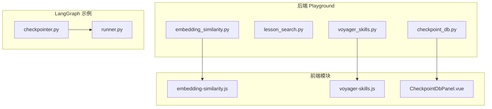
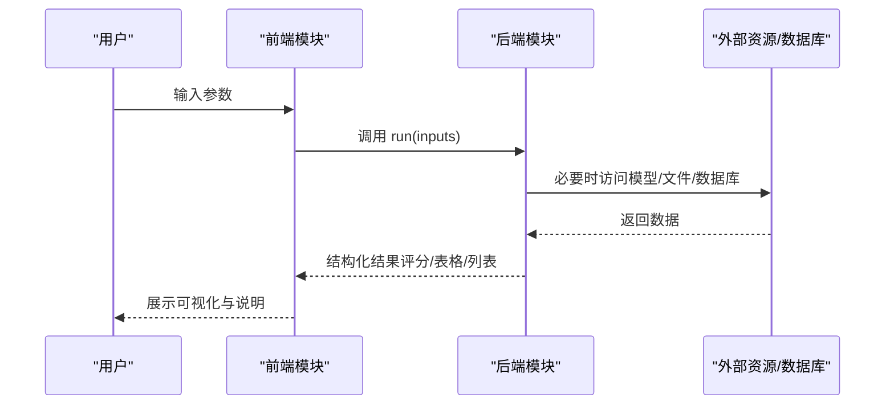
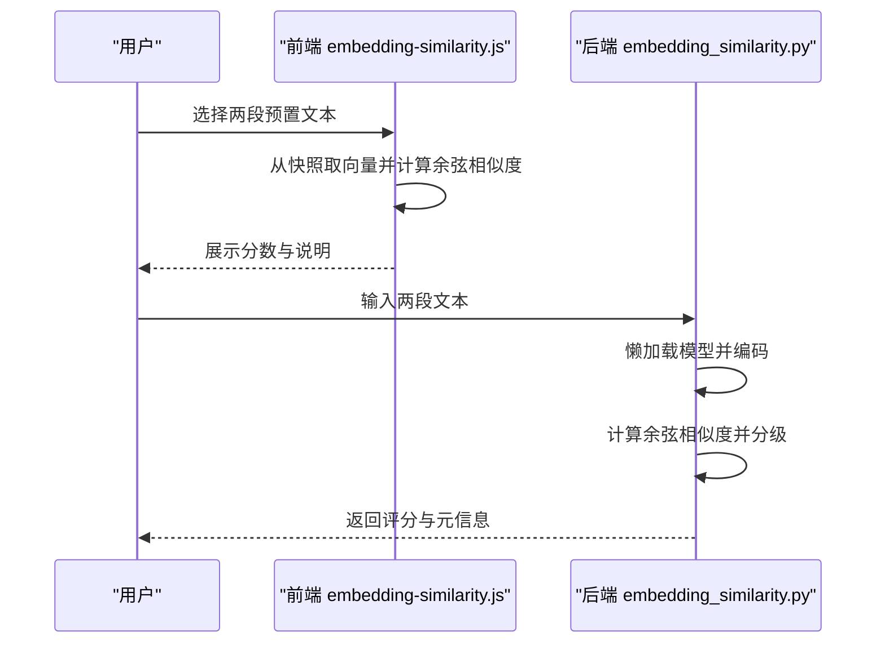
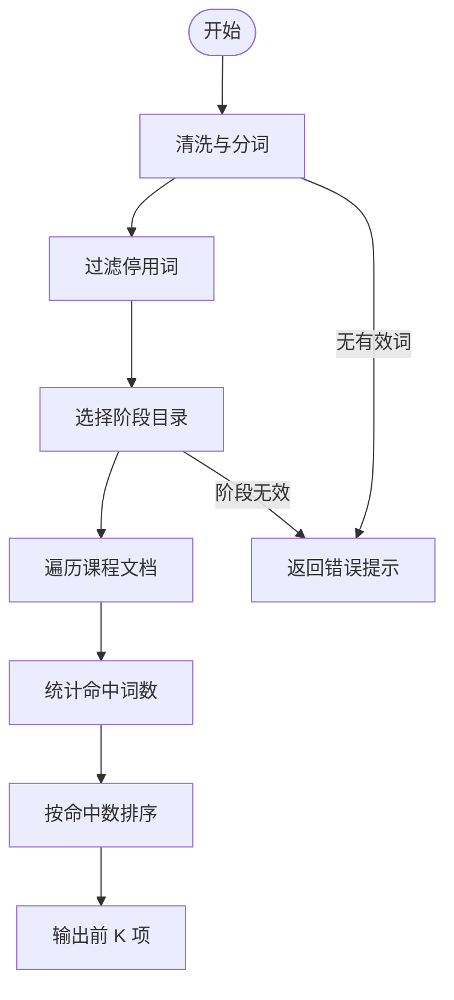
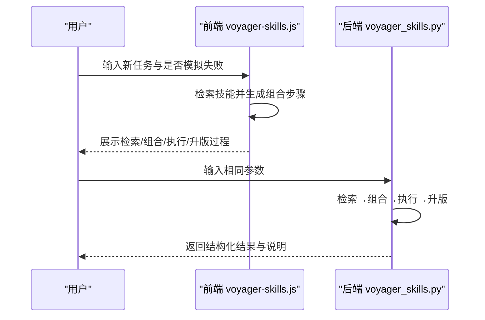
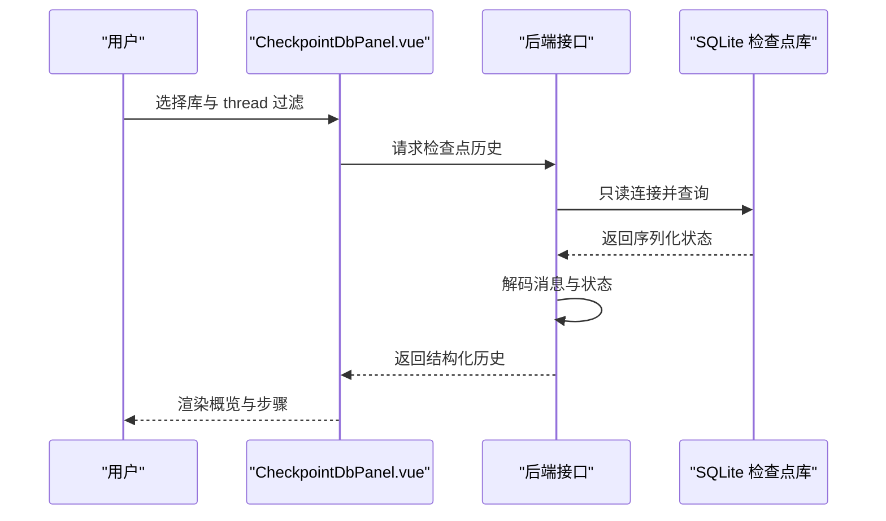
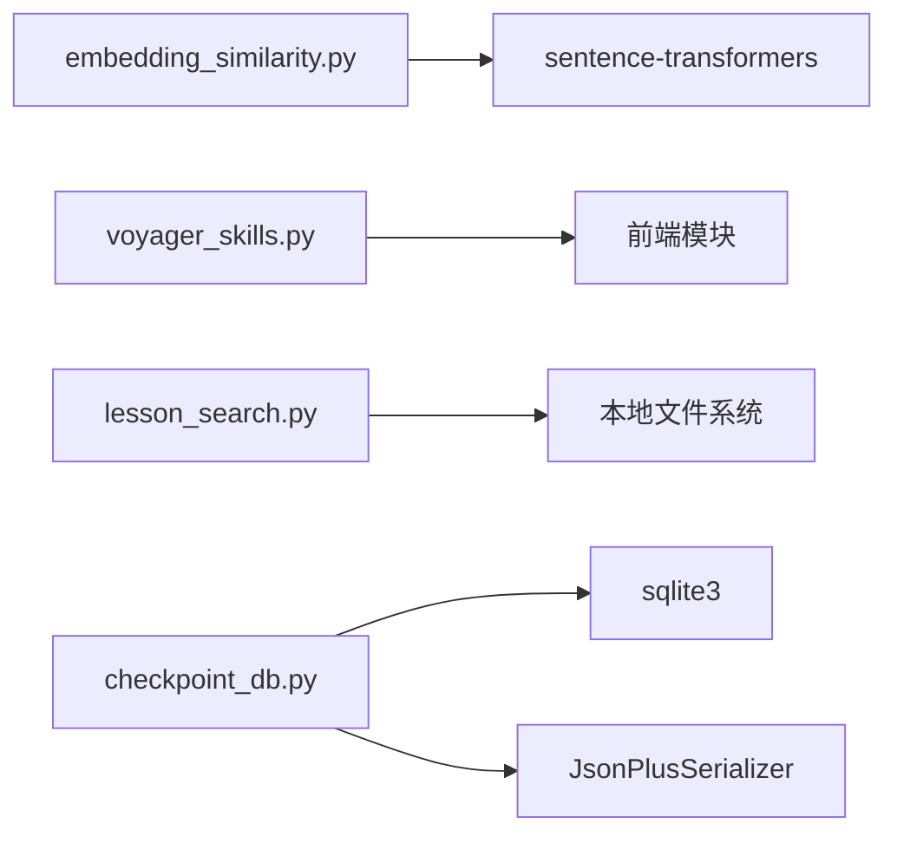

# 专用功能模块

<cite>
**本文引用的文件**
- [embedding_similarity.py](file://guardrails-sandbox/backend/playground/modules/embedding_similarity.py)
- [embedding-similarity.js](file://site/vue-app/summary/src/data/modules/embedding-similarity.js)
- [lesson_search.py](file://guardrails-sandbox/backend/playground/modules/lesson_search.py)
- [voyager_skills.py](file://guardrails-sandbox/backend/playground/modules/voyager_skills.py)
- [voyager-skills.js](file://site/vue-app/summary/src/data/modules/voyager-skills.js)
- [checkpoint_db.py](file://guardrails-sandbox/backend/playground/checkpoint_db.py)
- [CheckpointDbPanel.vue](file://guardrails-sandbox/frontend/src/components/CheckpointDbPanel.vue)
- [checkpoint_db.py](file://phases/14-agent-engineering/13-langgraph-stateful-graphs/outputs/skill-demo/checkpointer.py)
- [runner.py](file://phases/14-agent-engineering/13-langgraph-stateful-graphs/outputs/skill-demo/runner.py)
- [lesson-figures.js](file://site/lesson-figures.js)
- [README.md](file://README.md)
- [ROADMAP.md](file://ROADMAP.md)
</cite>

## 目录
1. [简介](#简介)
2. [项目结构](#项目结构)
3. [核心组件](#核心组件)
4. [架构总览](#架构总览)
5. [详细组件分析](#详细组件分析)
6. [依赖分析](#依赖分析)
7. [性能考虑](#性能考虑)
8. [故障排查指南](#故障排查指南)
9. [结论](#结论)
10. [附录](#附录)

## 简介
本文件聚焦于四个专用功能模块：嵌入相似度（embedding_similarity）、课程搜索（lesson_search）、Voyager 技能库（voyager_skills）、检查点查看器（checkpoint_viewer）。文档从系统架构、数据流、处理逻辑、集成点、错误处理与性能特征等维度进行深入剖析，并给出专业应用场景与技术实现细节，帮助读者快速理解与高效使用。

## 项目结构
- 后端 Playground 模块位于 guardrails-sandbox/backend/playground/modules，提供可交互的演示与教学功能。
- 前端 Vue 应用位于 site/vue-app/summary/src，提供模块化的可视化与交互界面。
- LangGraph 检查点数据库读取层位于 guardrails-sandbox/backend/playground/checkpoint_db.py，负责安全只读访问 SQLite 并解码状态。
- 示例与演示代码位于 phases/14-agent-engineering/13-langgraph-stateful-graphs/outputs/skill-demo，展示检查点保存与历史读取。

**图表来源**
- [embedding_similarity.py:1-84](file://guardrails-sandbox/backend/playground/modules/embedding_similarity.py#L1-L84)
- [embedding-similarity.js:1-66](file://site/vue-app/summary/src/data/modules/embedding-similarity.js#L1-L66)
- [lesson_search.py:1-132](file://guardrails-sandbox/backend/playground/modules/lesson_search.py#L1-L132)
- [voyager_skills.py:1-73](file://guardrails-sandbox/backend/playground/modules/voyager_skills.py#L1-L73)
- [voyager-skills.js:1-118](file://site/vue-app/summary/src/data/modules/voyager-skills.js#L1-L118)
- [checkpoint_db.py:1-148](file://guardrails-sandbox/backend/playground/checkpoint_db.py#L1-L148)
- [CheckpointDbPanel.vue:1-114](file://guardrails-sandbox/frontend/src/components/CheckpointDbPanel.vue#L1-L114)
- [checkpointer.py:77-118](file://phases/14-agent-engineering/13-langgraph-stateful-graphs/outputs/skill-demo/checkpointer.py#L77-L118)
- [runner.py:198-213](file://phases/14-agent-engineering/13-langgraph-stateful-graphs/outputs/skill-demo/runner.py#L198-L213)

**章节来源**
- [embedding_similarity.py:1-84](file://guardrails-sandbox/backend/playground/modules/embedding_similarity.py#L1-L84)
- [embedding-similarity.js:1-66](file://site/vue-app/summary/src/data/modules/embedding-similarity.js#L1-L66)
- [lesson_search.py:1-132](file://guardrails-sandbox/backend/playground/modules/lesson_search.py#L1-L132)
- [voyager_skills.py:1-73](file://guardrails-sandbox/backend/playground/modules/voyager_skills.py#L1-L73)
- [voyager-skills.js:1-118](file://site/vue-app/summary/src/data/modules/voyager-skills.js#L1-L118)
- [checkpoint_db.py:1-148](file://guardrails-sandbox/backend/playground/checkpoint_db.py#L1-L148)
- [CheckpointDbPanel.vue:1-114](file://guardrails-sandbox/frontend/src/components/CheckpointDbPanel.vue#L1-L114)
- [checkpointer.py:77-118](file://phases/14-agent-engineering/13-langgraph-stateful-graphs/outputs/skill-demo/checkpointer.py#L77-L118)
- [runner.py:198-213](file://phases/14-agent-engineering/13-langgraph-stateful-graphs/outputs/skill-demo/runner.py#L198-L213)

## 核心组件
- 嵌入相似度（embedding_similarity）
  - 后端：使用 sentence-transformers 加载中文嵌入模型，计算两段文本的余弦相似度，输出评分与元信息。
  - 前端：使用离线生成的向量快照，仅做余弦相似度计算与可视化。
- 课程搜索（lesson_search）
  - 后端：对 phases 文档进行关键词分词与停用词过滤，按命中词数排序返回匹配课程。
- Voyager 技能库（voyager_skills）
  - 后端/前端：以技能描述与标签的集合相似度进行检索，支持技能组合与失败驱动的迭代升级。
- 检查点查看器（checkpoint_viewer）
  - 后端：安全只读访问 LangGraph SQLite 检查点库，解码消息并返回结构化历史。
  - 前端：提供数据库选择、thread 过滤与历史浏览的交互界面。

**章节来源**
- [embedding_similarity.py:1-84](file://guardrails-sandbox/backend/playground/modules/embedding_similarity.py#L1-L84)
- [embedding-similarity.js:1-66](file://site/vue-app/summary/src/data/modules/embedding-similarity.js#L1-L66)
- [lesson_search.py:1-132](file://guardrails-sandbox/backend/playground/modules/lesson_search.py#L1-L132)
- [voyager_skills.py:1-73](file://guardrails-sandbox/backend/playground/modules/voyager_skills.py#L1-L73)
- [voyager-skills.js:1-118](file://site/vue-app/summary/src/data/modules/voyager-skills.js#L1-L118)
- [checkpoint_db.py:1-148](file://guardrails-sandbox/backend/playground/checkpoint_db.py#L1-L148)
- [CheckpointDbPanel.vue:1-114](file://guardrails-sandbox/frontend/src/components/CheckpointDbPanel.vue#L1-L114)

## 架构总览
四个模块分别承担“向量相似度评测”“课程检索”“技能库管理”“检查点历史追踪”的职责，既可独立运行，也可在教学与演示环境中协同工作。后端模块通过 Playground 基类统一输入/输出与可视化块类型，前端模块提供一致的交互体验与可视化呈现。

**图表来源**
- [embedding_similarity.py:48-83](file://guardrails-sandbox/backend/playground/modules/embedding_similarity.py#L48-L83)
- [embedding-similarity.js:21-51](file://site/vue-app/summary/src/data/modules/embedding-similarity.js#L21-L51)
- [lesson_search.py:66-131](file://guardrails-sandbox/backend/playground/modules/lesson_search.py#L66-L131)
- [voyager_skills.py:47-73](file://guardrails-sandbox/backend/playground/modules/voyager_skills.py#L47-L73)
- [voyager-skills.js:25-99](file://site/vue-app/summary/src/data/modules/voyager-skills.js#L25-L99)
- [checkpoint_db.py:86-147](file://guardrails-sandbox/backend/playground/checkpoint_db.py#L86-L147)

## 详细组件分析

### 嵌入相似度（embedding_similarity）
- 功能概述
  - 后端：加载中文嵌入模型，编码两段文本，计算余弦相似度并分级输出。
  - 前端：使用离线向量快照，仅做余弦相似度计算与可视化。
- 关键流程
  - 输入校验 → 模型懒加载 → 编码 → 相似度计算 → 分级判定 → 结果封装。
- 数据结构与复杂度
  - 向量维度固定，相似度计算为 O(d)（d 为维度），排序开销忽略。
- 错误处理
  - 缺少输入、编码失败、归一化为零等情况返回明确错误。
- 性能特征
  - 模型加载成本高但可缓存；相似度计算轻量。
- 适用场景
  - 教学演示“语义接近=向量接近”；对比不同文本的语义强度。

**图表来源**
- [embedding-similarity.js:21-51](file://site/vue-app/summary/src/data/modules/embedding-similarity.js#L21-L51)
- [embedding_similarity.py:48-83](file://guardrails-sandbox/backend/playground/modules/embedding_similarity.py#L48-L83)

**章节来源**
- [embedding_similarity.py:1-84](file://guardrails-sandbox/backend/playground/modules/embedding_similarity.py#L1-L84)
- [embedding-similarity.js:1-66](file://site/vue-app/summary/src/data/modules/embedding-similarity.js#L1-L66)
- [lesson-figures.js:616-624](file://site/lesson-figures.js#L616-L624)

### 课程搜索（lesson_search）
- 功能概述
  - 在 phases 文档中按关键词检索，支持多词命中与按命中数排序。
- 关键流程
  - 输入清洗与分词 → 停用词过滤 → 遍历指定阶段目录 → 统计命中词数 → 排序输出。
- 数据结构与复杂度
  - 分词与去重为 O(n)；遍历文档为 O(N)（N 为文档数量）；排序 O(K log K)（K 为命中数）。
- 错误处理
  - 未提取到有效关键词、阶段号无效、文件读取异常等均返回友好提示。
- 性能特征
  - 适合小规模本地文档检索；可扩展为倒排索引或向量检索。
- 适用场景
  - 快速定位课程主题与知识点；支持多关键词组合查询。

**图表来源**
- [lesson_search.py:24-131](file://guardrails-sandbox/backend/playground/modules/lesson_search.py#L24-L131)

**章节来源**
- [lesson_search.py:1-132](file://guardrails-sandbox/backend/playground/modules/lesson_search.py#L1-L132)
- [README.md:387-417](file://README.md#L387-L417)
- [ROADMAP.md:129-161](file://ROADMAP.md#L129-L161)

### Voyager 技能库（voyager_skills）
- 功能概述
  - 将“跑通的工具函数”固化为技能，支持检索、组合与失败驱动的迭代升级。
- 关键流程
  - 技能检索（描述+标签的集合相似度）→ 组合高阶技能 → 环境执行验证 → 失败反馈升版 → 入库。
- 数据结构与复杂度
  - 技能集合为哈希映射，相似度计算为 O(|A|+|B|)；排序与表格输出线性。
- 错误处理
  - 任务不包含目标关键词时提示复用已有技能。
- 适用场景
  - 代码助手与自动化 Agent 的可组合能力管理；减少重复开发。

**图表来源**
- [voyager-skills.js:25-99](file://site/vue-app/summary/src/data/modules/voyager-skills.js#L25-L99)
- [voyager_skills.py:47-73](file://guardrails-sandbox/backend/playground/modules/voyager_skills.py#L47-L73)

**章节来源**
- [voyager_skills.py:1-73](file://guardrails-sandbox/backend/playground/modules/voyager_skills.py#L1-L73)
- [voyager-skills.js:1-118](file://site/vue-app/summary/src/data/modules/voyager-skills.js#L1-L118)

### 检查点查看器（checkpoint_viewer）
- 功能概述
  - 安全只读读取 LangGraph SQLite 检查点库，解码每一步的状态与消息，支持 thread 过滤与历史浏览。
- 关键流程
  - 预置库校验 → 路径安全解析 → 只读连接 → 查询与解码 → 结构化返回。
- 数据结构与复杂度
  - 查询为顺序扫描，解码为 O(T)（T 为消息数）；内存占用与记录数线性。
- 错误处理
  - 非法路径、库不存在、非 LangGraph 结构、解码失败等均返回明确错误。
- 适用场景
  - LangGraph 应用的调试与可观测性；离线 Mini LangSmith。

**图表来源**
- [CheckpointDbPanel.vue:35-66](file://guardrails-sandbox/frontend/src/components/CheckpointDbPanel.vue#L35-L66)
- [checkpoint_db.py:86-147](file://guardrails-sandbox/backend/playground/checkpoint_db.py#L86-L147)

**章节来源**
- [checkpoint_db.py:1-148](file://guardrails-sandbox/backend/playground/checkpoint_db.py#L1-L148)
- [CheckpointDbPanel.vue:1-114](file://guardrails-sandbox/frontend/src/components/CheckpointDbPanel.vue#L1-L114)
- [checkpointer.py:77-118](file://phases/14-agent-engineering/13-langgraph-stateful-graphs/outputs/skill-demo/checkpointer.py#L77-L118)
- [runner.py:198-213](file://phases/14-agent-engineering/13-langgraph-stateful-graphs/outputs/skill-demo/runner.py#L198-L213)

## 依赖分析
- 模块内聚与耦合
  - embedding_similarity：后端依赖 sentence-transformers；前端依赖离线向量快照。
  - lesson_search：依赖本地 phases 文档树与正则分词。
  - voyager_skills：前后端均自包含，依赖集合相似度与技能定义。
  - checkpoint_db：依赖 sqlite3 与 langgraph 序列化器，严格路径控制。
- 外部依赖与集成点
  - 模型与序列化：sentence-transformers、JsonPlusSerializer。
  - 前端可视化：统一的模块化 blocks（评分、键值、表格、列表、文本）。
- 循环依赖
  - 无循环依赖，模块间通过接口与数据结构解耦。

**图表来源**
- [embedding_similarity.py:43-46](file://guardrails-sandbox/backend/playground/modules/embedding_similarity.py#L43-L46)
- [lesson_search.py:16-18](file://guardrails-sandbox/backend/playground/modules/lesson_search.py#L16-L18)
- [checkpoint_db.py:90-91](file://guardrails-sandbox/backend/playground/checkpoint_db.py#L90-L91)

**章节来源**
- [embedding_similarity.py:1-84](file://guardrails-sandbox/backend/playground/modules/embedding_similarity.py#L1-L84)
- [lesson_search.py:1-132](file://guardrails-sandbox/backend/playground/modules/lesson_search.py#L1-L132)
- [checkpoint_db.py:1-148](file://guardrails-sandbox/backend/playground/checkpoint_db.py#L1-L148)

## 性能考虑
- 向量相似度
  - 模型加载成本高，建议缓存；相似度计算 O(d)；前端使用离线快照可显著降低延迟。
- 课程搜索
  - 文档遍历 O(N)；可引入倒排索引或向量检索提升大体量场景性能。
- Voyager 技能库
  - 技能检索为集合相似度，适合中小规模技能库；大规模时建议引入向量检索与标签过滤。
- 检查点查看器
  - 只读查询与解码为 O(T)；建议分页与增量加载，避免一次性渲染大量步骤。

## 故障排查指南
- embedding_similarity
  - 症状：返回错误“请同时填写文本 A 和文本 B”。
  - 排查：确认输入非空；检查模型懒加载是否成功。
- lesson_search
  - 症状：无结果或提示“未能提取有效关键词”。
  - 排查：检查输入是否包含有效词汇；确认阶段号格式正确。
- voyager_skills
  - 症状：任务未命中任何技能。
  - 排查：调整任务描述中的关键词；确保标签覆盖充分。
- checkpoint_db
  - 症状：提示“非法路径/找不到库/不是 LangGraph 库”。
  - 排查：确认 preset_key 正确；检查 DATA_DIR 下文件存在；验证表结构。

**章节来源**
- [embedding_similarity.py:53-54](file://guardrails-sandbox/backend/playground/modules/embedding_similarity.py#L53-L54)
- [lesson_search.py:71-76](file://guardrails-sandbox/backend/playground/modules/lesson_search.py#L71-L76)
- [checkpoint_db.py:37-47](file://guardrails-sandbox/backend/playground/checkpoint_db.py#L37-L47)
- [checkpoint_db.py:98-99](file://guardrails-sandbox/backend/playground/checkpoint_db.py#L98-L99)

## 结论
四个专用功能模块分别覆盖“语义相似度评测”“课程检索”“技能库管理”“检查点历史追踪”，在教学与演示场景中提供了清晰、可操作且可视化的实践入口。通过合理的数据结构设计、严格的错误处理与安全策略，模块具备良好的可维护性与扩展性。建议在生产环境中结合向量化检索与索引优化进一步提升性能。

## 附录
- 专业应用场景
  - 向量相似度：教学演示、语义对比、RAG 上游评估。
  - 课程搜索：知识导航、主题检索、学习路径规划。
  - Voyager 技能库：代码助手、Agent 自动化、能力复用与迭代。
  - 检查点查看器：LangGraph 调试、可观测性、历史回放。
- 技术实现要点
  - 模块化输入/输出与可视化块类型，便于统一扩展。
  - 前后端分离：后端专注计算与数据访问，前端专注交互与展示。
  - 安全优先：检查点库只读与路径白名单，杜绝目录穿越。