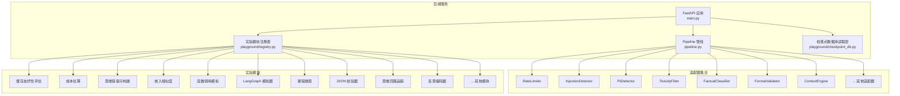
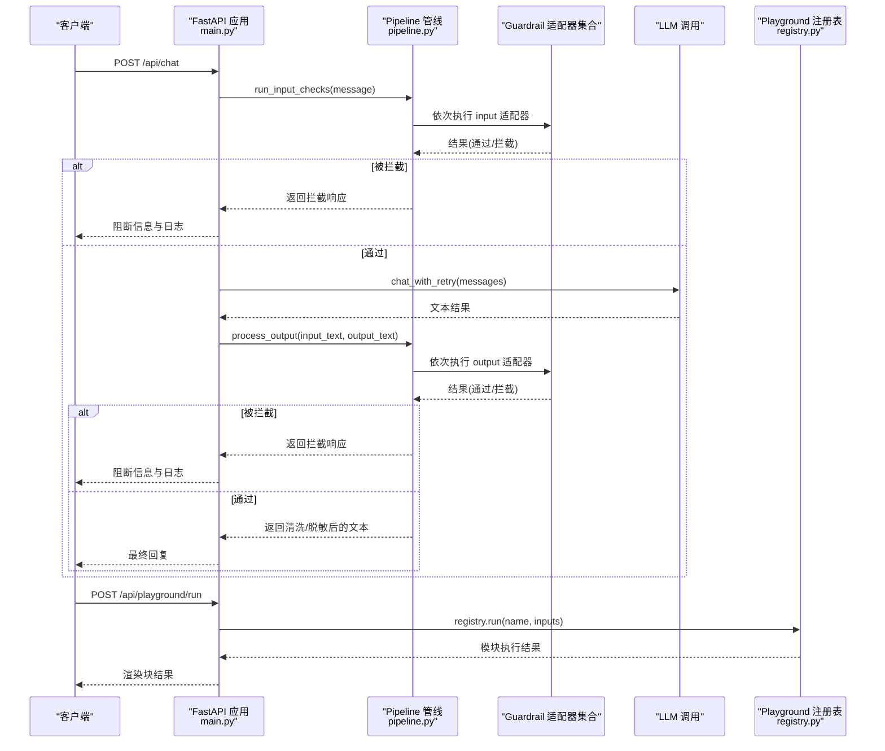
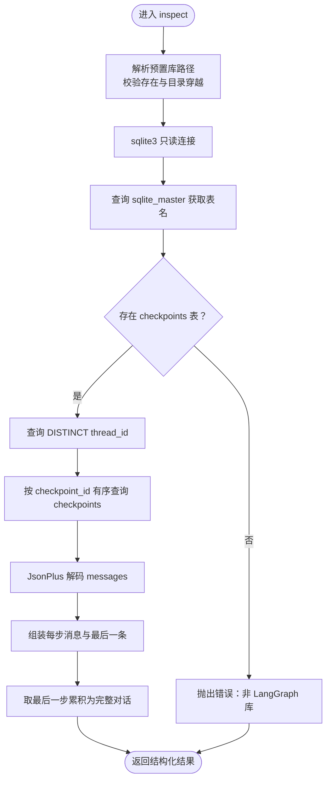
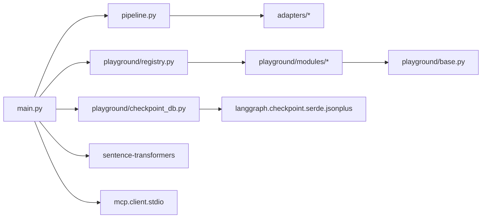

# 实验平台

<cite>
**本文引用的文件**
- [guardrails-sandbox/backend/main.py](file://guardrails-sandbox/backend/main.py)
- [guardrails-sandbox/backend/pipeline.py](file://guardrails-sandbox/backend/pipeline.py)
- [guardrails-sandbox/backend/playground/checkpoint_db.py](file://guardrails-sandbox/backend/playground/checkpoint_db.py)
- [guardrails-sandbox/backend/playground/registry.py](file://guardrails-sandbox/backend/playground/registry.py)
- [guardrails-sandbox/backend/playground/modules/cache_friendliness.py](file://guardrails-sandbox/backend/playground/modules/cache_friendliness.py)
- [guardrails-sandbox/backend/playground/modules/cost_estimator.py](file://guardrails-sandbox/backend/playground/modules/cost_estimator.py)
- [guardrails-sandbox/backend/playground/modules/cot_prompt_builder.py](file://guardrails-sandbox/backend/playground/modules/cot_prompt_builder.py)
- [guardrails-sandbox/backend/playground/modules/embedding_similarity.py](file://guardrails-sandbox/backend/playground/modules/embedding_similarity.py)
- [guardrails-sandbox/backend/playground/modules/function_call_simulator.py](file://guardrails-sandbox/backend/playground/modules/function_call_simulator.py)
- [guardrails-sandbox/backend/playground/modules/langgraph_simulator.py](file://guardrails-sandbox/backend/playground/modules/langgraph_simulator.py)
- [guardrails-sandbox/backend/playground/modules/lesson_search.py](file://guardrails-sandbox/backend/playground/modules/lesson_search.py)
- [guardrails-sandbox/backend/playground/modules/json_validator.py](file://guardrails-sandbox/backend/playground/modules/json_validator.py)
- [guardrails-sandbox/backend/playground/modules/react_loop_tracer.py](file://guardrails-sandbox/backend/playground/modules/react_loop_tracer.py)
- [guardrails-sandbox/backend/playground/modules/reflexion_coder.py](file://guardrails-sandbox/backend/playground/modules/reflexion_coder.py)
</cite>

## 目录
1. [简介](#简介)
2. [项目结构](#项目结构)
3. [核心组件](#核心组件)
4. [架构总览](#架构总览)
5. [详细组件分析](#详细组件分析)
6. [依赖分析](#依赖分析)
7. [性能考量](#性能考量)
8. [故障排查指南](#故障排查指南)
9. [结论](#结论)
10. [附录](#附录)

## 简介
本实验平台面向“AI 工程学习”课程体系，提供交互式实验台（Playground）与安全护栏（Guardrails）两大能力域。其中：
- Playground 提供 21 个实验模块，涵盖缓存友好性评估、成本估算、思维链提示构建、嵌入相似度、函数调用模拟、LangGraph 模拟器、课程搜索、记忆系统、提示分析、思维回路追踪、反思编码器、计划执行模拟器、自我完善批评、树搜索、Voyager 技能库、HTN 进化搜索等，帮助学员在本地快速验证概念、理解流程与优化策略。
- Guardrails 提供输入/输出双通道的安全护栏管线，支持适配器注册、树形可视化、启用/禁用切换、拦截历史记录与统计，便于教学演示与生产级安全治理。

平台后端基于 FastAPI，提供统一 API，前端静态资源托管于 dist 目录，支持本地开发与部署。

## 项目结构
后端采用“适配器 + 管线 + 实验模块”的分层设计：
- 管线层：统一编排 guardrail 适配器，按顺序执行，遇阻断即短路，记录统计与拦截历史。
- 适配器层：注册各类 Guardrail 适配器（限流、注入检测、PII、毒性、事实性、格式校验、上下文引擎等），支持树形展示与动态开关。
- 实验模块层：通过注册表集中管理 21 个 Playground 模块，按 phase 分组，驱动前端导航与执行。
- 检查点数据库：独立的只读 SQLite 读取层，用于可视化 LangGraph 检查点库，支持按 thread 过滤与全对话聚合。

图表来源
- [guardrails-sandbox/backend/main.py:1-421](file://guardrails-sandbox/backend/main.py#L1-L421)
- [guardrails-sandbox/backend/pipeline.py:1-285](file://guardrails-sandbox/backend/pipeline.py#L1-L285)
- [guardrails-sandbox/backend/playground/registry.py:1-118](file://guardrails-sandbox/backend/playground/registry.py#L1-L118)
- [guardrails-sandbox/backend/playground/checkpoint_db.py:1-148](file://guardrails-sandbox/backend/playground/checkpoint_db.py#L1-L148)

章节来源
- [guardrails-sandbox/backend/main.py:1-421](file://guardrails-sandbox/backend/main.py#L1-L421)
- [guardrails-sandbox/backend/pipeline.py:1-285](file://guardrails-sandbox/backend/pipeline.py#L1-L285)
- [guardrails-sandbox/backend/playground/registry.py:1-118](file://guardrails-sandbox/backend/playground/registry.py#L1-L118)
- [guardrails-sandbox/backend/playground/checkpoint_db.py:1-148](file://guardrails-sandbox/backend/playground/checkpoint_db.py#L1-L148)

## 核心组件
- FastAPI 应用与路由
  - 提供 Guardrails 查询、开关、对比模式、基准测试、MCP 工具调用、Playground 模块列表与执行、检查点数据库查看等接口。
  - 支持 CORS，静态文件挂载前端 dist 目录。
- Pipeline 管线
  - 输入/输出适配器分类与排序，遇阻断短路，记录统计与拦截历史，支持树形结构可视化。
- 实验模块注册表
  - 统一注册 21 个模块，按 phase 分组，暴露 list_grouped 与 run 接口，前端无需改动即可扩展。
- 检查点数据库读取层
  - 仅读模式访问 SQLite，校验表结构，解码 JsonPlus 序列化消息，支持按 thread 过滤与全对话聚合。

章节来源
- [guardrails-sandbox/backend/main.py:118-404](file://guardrails-sandbox/backend/main.py#L118-L404)
- [guardrails-sandbox/backend/pipeline.py:12-285](file://guardrails-sandbox/backend/pipeline.py#L12-L285)
- [guardrails-sandbox/backend/playground/registry.py:48-118](file://guardrails-sandbox/backend/playground/registry.py#L48-L118)
- [guardrails-sandbox/backend/playground/checkpoint_db.py:23-148](file://guardrails-sandbox/backend/playground/checkpoint_db.py#L23-L148)

## 架构总览
以下序列图展示一次典型聊天请求在 Guardrails 管线中的处理流程，以及 Playground 模块的执行路径。

图表来源
- [guardrails-sandbox/backend/main.py:155-221](file://guardrails-sandbox/backend/main.py#L155-L221)
- [guardrails-sandbox/backend/pipeline.py:31-160](file://guardrails-sandbox/backend/pipeline.py#L31-L160)
- [guardrails-sandbox/backend/playground/registry.py:58-65](file://guardrails-sandbox/backend/playground/registry.py#L58-L65)

## 详细组件分析

### 检查点数据库（checkpoint_db）
- 功能
  - 仅读访问预置的 LangGraph 检查点数据库（SQLite），校验 checkpoints 表是否存在，按 thread_id 过滤，解码 JsonPlus 序列化消息，输出结构化结果（每步消息、完整对话、线程列表等）。
  - 防御路径穿越，限制在 DATA_DIR 内部。
- 关键点
  - 仅支持 demo 预置库，未来可通过 PRESETS 扩展。
  - 使用 JsonPlusSerializer 解码 channel_values.messages，兼容多种消息类型（Human/AI/Tool/System）。
  - 返回字段包含：数据库名、表清单、线程列表、过滤条件、步数、每步消息、完整对话等。

图表来源
- [guardrails-sandbox/backend/playground/checkpoint_db.py:86-148](file://guardrails-sandbox/backend/playground/checkpoint_db.py#L86-L148)

章节来源
- [guardrails-sandbox/backend/playground/checkpoint_db.py:23-148](file://guardrails-sandbox/backend/playground/checkpoint_db.py#L23-L148)

### 实验模块注册表（registry）
- 功能
  - 集中注册所有 PlaygroundModule，提供 list_grouped（按 phase 分组与排序）、run（按名称执行）。
  - 新增模块只需在 _MODULES 列表中添加实例，前端自动渲染导航树。
- 关键点
  - 按 phase 与 order 排序，显示 phase 标签与图标。
  - 统一返回模块元信息（name/display_name/description/order/lesson）。

章节来源
- [guardrails-sandbox/backend/playground/registry.py:48-118](file://guardrails-sandbox/backend/playground/registry.py#L48-L118)

### 缓存友好性评估（cache_friendliness）
- 功能
  - 分析一段系统提示/前缀对前缀缓存是否友好，检测破坏前缀匹配的动态内容，估算 token 数量，给出盈亏平衡表与布局建议。
- 关键点
  - 动态内容模式：时间戳、会话 ID、随机值等。
  - 布局建议：稳定内容放顶部，可变内容放底部。
  - 成本模型：参考写入溢价，计算不同复用次数下的平均成本倍数与节省比例。

章节来源
- [guardrails-sandbox/backend/playground/modules/cache_friendliness.py:55-123](file://guardrails-sandbox/backend/playground/modules/cache_friendliness.py#L55-L123)

### 成本估算（cost_estimator）
- 功能
  - 输入模型、输入/输出 token、请求频率，输出月度/年度成本，并对比不同缓存命中率的节省。
- 关键点
  - 支持模型：gpt-4o、claude-sonnet、gpt-4o-mini、gemini-pro。
  - 计算公式：按每百万 token 计费，日/月/年累计。

章节来源
- [guardrails-sandbox/backend/playground/modules/cost_estimator.py:21-86](file://guardrails-sandbox/backend/playground/modules/cost_estimator.py#L21-L86)

### 思维链提示构建（cot_prompt_builder）
- 功能
  - 输入一道题目，对比 Zero-shot、Zero-shot-CoT、Few-shot-CoT 三种提示词拼接方式，解释适用场景与代价。
- 关键点
  - 提供三类提示词模板与对比表格，强调 token 成本与推理质量权衡。

章节来源
- [guardrails-sandbox/backend/playground/modules/cot_prompt_builder.py:30-81](file://guardrails-sandbox/backend/playground/modules/cot_prompt_builder.py#L30-L81)

### 嵌入相似度（embedding_similarity）
- 功能
  - 输入两段文本，计算余弦相似度，直观展示“语义接近 = 向量接近”，复用离线预加载的中文向量模型。
- 关键点
  - 使用 sentence-transformers 的 shibing624/text2vec-base-chinese。
  - 输出相似度分数与分级结论。

章节来源
- [guardrails-sandbox/backend/playground/modules/embedding_similarity.py:22-84](file://guardrails-sandbox/backend/playground/modules/embedding_similarity.py#L22-L84)

### 函数调用模拟（function_call_simulator）
- 功能
  - 输入自然语言请求，本地路由到工具（计算器、天气查询），生成 tool_call 结构并执行，返回结果。
- 关键点
  - 关键词路由：数学表达式、天气关键词。
  - 工具函数：_calculator、_get_weather。
  - 输出包含工具选择、tool_call 协议结构与执行结果。

章节来源
- [guardrails-sandbox/backend/playground/modules/function_call_simulator.py:72-125](file://guardrails-sandbox/backend/playground/modules/function_call_simulator.py#L72-L125)

### LangGraph 模拟器（langgraph_simulator）
- 功能
  - 输入任务描述，判断是否“Agent 形状”，绘制四节点 ReAct 图拓扑，模拟检查点序列与工具中断点。
- 关键点
  - 工具提示词与分支提示词决定是否值得画成状态图。
  - 支持在工具前中断（副作用审批）。

章节来源
- [guardrails-sandbox/backend/playground/modules/langgraph_simulator.py:27-119](file://guardrails-sandbox/backend/playground/modules/langgraph_simulator.py#L27-L119)

### 课程搜索（lesson_search）
- 功能
  - 在课程文档中按关键词搜索，支持多词拆分、命中计数排序，限定阶段范围。
- 关键点
  - 中英文混合分词、中文 2-gram、停用词过滤。
  - 支持限定阶段（如 11）或全库搜索。

章节来源
- [guardrails-sandbox/backend/playground/modules/lesson_search.py:50-132](file://guardrails-sandbox/backend/playground/modules/lesson_search.py#L50-L132)

### JSON 校验器（json_validator）
- 功能
  - 校验 JSON 文本是否合法、字段是否齐全、类型是否匹配，支持去除 Markdown 代码围栏。
- 关键点
  - 解析失败时返回定位信息与修复提示。
  - 可选必填字段校验。

章节来源
- [guardrails-sandbox/backend/playground/modules/json_validator.py:16-98](file://guardrails-sandbox/backend/playground/modules/json_validator.py#L16-L98)

### 思维回路追踪（react_loop_tracer）
- 功能
  - 选择预置任务或自定义脚本，在本地跑一遍 ReAct 循环，逐步展示“思考→行动→观察”轨迹、轮次预算、停止条件。
- 关键点
  - 工具注册表：calculator、kv_get/set。
  - 停止条件：finish、脚本耗尽、轮次预算耗尽。
  - 观察格式化器：出错也返回字符串，不崩溃。

章节来源
- [guardrails-sandbox/backend/playground/modules/react_loop_tracer.py:69-203](file://guardrails-sandbox/backend/playground/modules/react_loop_tracer.py#L69-L203)

### 反思编码器（reflexion_coder）
- 功能
  - 模拟“Actor（写代码）→ Evaluator（测试）→ SelfReflector（反思）→ Memory（经验）”闭环，对比“开记忆”与“关记忆”两种策略。
- 关键点
  - 任务：实现罗马数字转整数，处理加法与减法规则。
  - 反思需具体可执行，避免空话。
  - 与 fine-tuning 的本质区别：用语言强化而非梯度重训。

章节来源
- [guardrails-sandbox/backend/playground/modules/reflexion_coder.py:84-185](file://guardrails-sandbox/backend/playground/modules/reflexion_coder.py#L84-L185)

### 其他模块概览（按课程阶段与主题）
以下模块已在注册表中注册，可在前端导航中查看与使用（名称与阶段映射见注册表）：
- prompt_analyzer、context_budget_planner、framework_picker、tot_search、self_refine_critic、tool_use、memgpt_virtual_context、memory_blocks_sleep、mem0_hybrid、voyager_skills、htn_evolutionary、confidence_router。

章节来源
- [guardrails-sandbox/backend/playground/registry.py:88-118](file://guardrails-sandbox/backend/playground/registry.py#L88-L118)

## 依赖分析
- 组件耦合
  - main.py 依赖 pipeline.py（编排 Guardrails）、playground.registry（模块执行）、playground.checkpoint_db（检查点读取）。
  - pipeline.py 依赖 adapters/base（GuardrailResult 接口），内部维护适配器列表与统计。
  - playground 模块均依赖 playground.base（PlaygroundModule、ModuleResult、渲染块工具）。
- 外部依赖
  - sentence-transformers（中文向量模型，离线加载）。
  - langgraph.checkpoint.serde.jsonplus（检查点反序列化）。
  - mcp 客户端（MCP 工具调用）。

图表来源
- [guardrails-sandbox/backend/main.py:16-58](file://guardrails-sandbox/backend/main.py#L16-L58)
- [guardrails-sandbox/backend/pipeline.py:9-24](file://guardrails-sandbox/backend/pipeline.py#L9-L24)
- [guardrails-sandbox/backend/playground/checkpoint_db.py:90-91](file://guardrails-sandbox/backend/playground/checkpoint_db.py#L90-L91)

章节来源
- [guardrails-sandbox/backend/main.py:16-58](file://guardrails-sandbox/backend/main.py#L16-L58)
- [guardrails-sandbox/backend/pipeline.py:9-24](file://guardrails-sandbox/backend/pipeline.py#L9-L24)
- [guardrails-sandbox/backend/playground/checkpoint_db.py:90-91](file://guardrails-sandbox/backend/playground/checkpoint_db.py#L90-L91)

## 性能考量
- 模型加载
  - 预加载 sentence-transformers 模型，避免异步环境中的连接问题；离线模式减少网络依赖。
- I/O 与并发
  - 检查点数据库仅读模式，使用 sqlite3 只读 URI；适配器执行按顺序短路，减少不必要的调用。
- 前端体验
  - 模块执行返回结构化渲染块，前端可增量渲染；对比模式与拦截历史有助于快速定位问题。

## 故障排查指南
- Guardrails 拦截
  - 查看拦截历史与 by_layer 统计，定位阻断适配器；通过 /api/guardrails/toggle 开关特定适配器进行隔离排查。
- LLM 调用失败
  - 对比模式可快速区分“无护栏”与“有护栏”的差异；检查系统提示、历史消息格式与长度。
- 检查点数据库
  - 确认预置库存在且位于 DATA_DIR；确保 checkpoints 表存在；按 thread_id 过滤时注意大小写与格式。
- 模块输入
  - 检查必填字段与数据类型；对于 JSON 校验器，注意 Markdown 代码围栏清理。

章节来源
- [guardrails-sandbox/backend/main.py:141-153](file://guardrails-sandbox/backend/main.py#L141-L153)
- [guardrails-sandbox/backend/pipeline.py:264-285](file://guardrails-sandbox/backend/pipeline.py#L264-L285)
- [guardrails-sandbox/backend/playground/checkpoint_db.py:37-47](file://guardrails-sandbox/backend/playground/checkpoint_db.py#L37-L47)

## 结论
本实验平台通过“Guardrails 管线 + Playground 模块”的组合，既满足教学演示与安全治理需求，又提供了丰富的实践工具。检查点数据库读取层为 LangGraph 学习提供了可视化支撑；21 个实验模块覆盖从提示工程、结构化输出、函数调用、记忆系统到高级规划与反思学习等关键主题，适合不同阶段的学习者循序渐进掌握。

## 附录
- API 一览（节选）
  - Guardrails
    - GET /api/guardrails：获取适配器树、统计与拦截历史
    - GET /api/adapters/tree：适配器树
    - GET /api/guardrails/block-history：拦截历史
    - POST /api/guardrails/toggle：开关某适配器
    - POST /api/guardrails/clear-history：清空拦截历史
    - POST /api/chat：标准聊天
    - POST /api/chat/compare：对比模式（护栏开/关）
    - POST /api/chat/reset-stats：重置统计
    - POST /api/benchmark：运行基准测试
  - Playground
    - GET /api/playground/modules：模块分组列表
    - POST /api/playground/run：执行模块
  - 检查点数据库
    - GET /api/checkpoints/dbs：列出可用库
    - POST /api/checkpoints/inspect：读取并解码检查点库
  - MCP 工具代理
    - GET /api/mcp/tools：列举工具
    - POST /api/mcp/call：调用工具

章节来源
- [guardrails-sandbox/backend/main.py:121-404](file://guardrails-sandbox/backend/main.py#L121-L404)