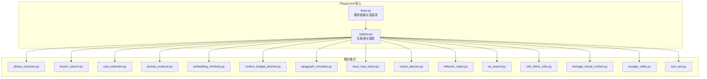
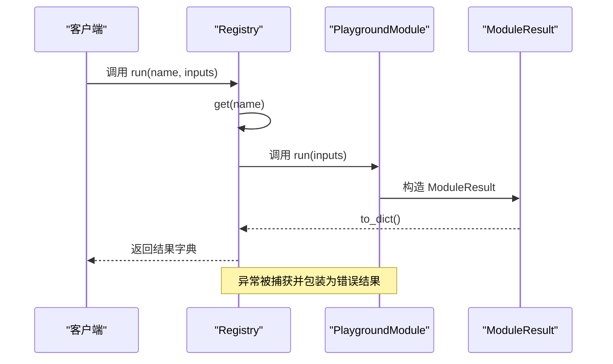
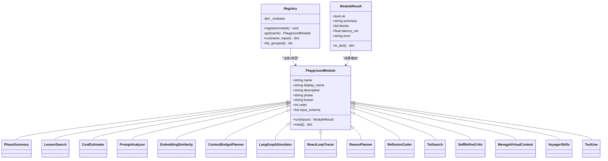
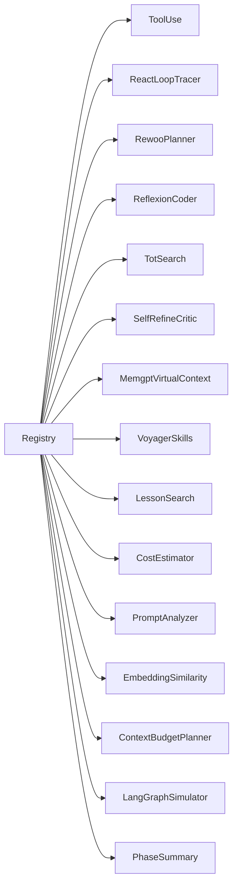

# 实验模块概览

<cite>
**本文档引用的文件**
- [registry.py](file://guardrails-sandbox/backend/playground/registry.py)
- [base.py](file://guardrails-sandbox/backend/playground/base.py)
- [phase_summary.py](file://guardrails-sandbox/backend/playground/modules/phase_summary.py)
- [lesson_search.py](file://guardrails-sandbox/backend/playground/modules/lesson_search.py)
- [cost_estimator.py](file://guardrails-sandbox/backend/playground/modules/cost_estimator.py)
- [prompt_analyzer.py](file://guardrails-sandbox/backend/playground/modules/prompt_analyzer.py)
- [embedding_similarity.py](file://guardrails-sandbox/backend/playground/modules/embedding_similarity.py)
- [context_budget_planner.py](file://guardrails-sandbox/backend/playground/modules/context_budget_planner.py)
- [langgraph_simulator.py](file://guardrails-sandbox/backend/playground/modules/langgraph_simulator.py)
- [react_loop_tracer.py](file://guardrails-sandbox/backend/playground/modules/react_loop_tracer.py)
- [rewoo_planner.py](file://guardrails-sandbox/backend/playground/modules/rewoo_planner.py)
- [reflexion_coder.py](file://guardrails-sandbox/backend/playground/modules/reflexion_coder.py)
- [tot_search.py](file://guardrails-sandbox/backend/playground/modules/tot_search.py)
- [self_refine_critic.py](file://guardrails-sandbox/backend/playground/modules/self_refine_critic.py)
- [memgpt_virtual_context.py](file://guardrails-sandbox/backend/playground/modules/memgpt_virtual_context.py)
- [voyager_skills.py](file://guardrails-sandbox/backend/playground/modules/voyager_skills.py)
- [tool_use.py](file://guardrails-sandbox/backend/playground/modules/tool_use.py)
</cite>

## 目录
1. [引言](#引言)
2. [项目结构](#项目结构)
3. [核心组件](#核心组件)
4. [架构总览](#架构总览)
5. [详细组件分析](#详细组件分析)
6. [依赖分析](#依赖分析)
7. [性能考量](#性能考量)
8. [故障排除指南](#故障排除指南)
9. [结论](#结论)
10. [附录](#附录)

## 引言
本文件面向实验模块概览，系统阐述实验平台的整体架构与模块组织方式，梳理21个实验模块的分类与功能定位，深入解释模块注册机制（Registry）的工作原理（模块发现、加载与初始化），说明模块间依赖关系与交互模式，并提供模块开发指南（新增流程、接口规范与最佳实践），以及实验模块的生命周期管理与状态跟踪机制。

## 项目结构
实验平台位于 guardrails-sandbox/backend/playground 目录，采用“模块即插件”的设计：
- playground/base.py 定义通用模块抽象与渲染块工具，统一输入 schema 与结果结构。
- playground/registry.py 负责集中注册与调度所有模块，提供按 phase 分组的导航清单与执行入口。
- playground/modules/ 下包含21个具体实验模块，每个模块实现独立功能并遵循统一接口。

图表来源
- [registry.py:48-118](file://guardrails-sandbox/backend/playground/registry.py#L48-L118)
- [base.py:101-129](file://guardrails-sandbox/backend/playground/base.py#L101-L129)

章节来源
- [registry.py:1-118](file://guardrails-sandbox/backend/playground/registry.py#L1-L118)
- [base.py:1-129](file://guardrails-sandbox/backend/playground/base.py#L1-L129)

## 核心组件
- PlaygroundModule 抽象类：定义模块的唯一标识、显示名、描述、归属阶段/课程、排序、输入 schema 与 run 方法。
- ModuleResult 结果载体：封装 ok、summary、blocks、latency_ms、error 等字段，统一前端渲染。
- 渲染块工具：提供文本、分数、表格、键值对、列表等渲染块，前端按类型渲染。
- Registry 注册表：维护模块字典、注册、获取、执行与按 phase 分组列表。

章节来源
- [base.py:81-129](file://guardrails-sandbox/backend/playground/base.py#L81-L129)
- [registry.py:48-84](file://guardrails-sandbox/backend/playground/registry.py#L48-L84)

## 架构总览
模块注册与执行的关键流程：
- 模块发现与加载：registry.py 在启动时导入 modules 下的所有模块类，并实例化加入注册表。
- 模块初始化：每个模块在构造时准备自身元信息（name/display_name/description/phase/lesson/order/input_schema）。
- 导航分组：list_grouped() 按 phase 聚合模块，结合 _PHASE_META 提供显示名与图标。
- 执行入口：run(name, inputs) 获取模块实例并调用 run(inputs)，捕获异常并返回标准化结果。

图表来源
- [registry.py:58-65](file://guardrails-sandbox/backend/playground/registry.py#L58-L65)
- [base.py:89-96](file://guardrails-sandbox/backend/playground/base.py#L89-L96)

章节来源
- [registry.py:58-84](file://guardrails-sandbox/backend/playground/registry.py#L58-L84)

## 详细组件分析

### 模块分类与功能定位
实验模块按所属阶段与课程进行分类，覆盖 LLM 工程与 Agent 工程两大方向。以下为21个模块的分类与定位（按 phase/lesson 排列）：

- 课程导航
  - 阶段概要：输入阶段号，列出该阶段全部课程，用于实验台入口工具。
  - 参考文件：[phase_summary.py:18-67](file://guardrails-sandbox/backend/playground/modules/phase_summary.py#L18-L67)

- LLM 工程（Phase 11）
  - 课程搜索：在课程文档中按关键词搜索，支持多词命中与排序。
    - 参考文件：[lesson_search.py:50-131](file://guardrails-sandbox/backend/playground/modules/lesson_search.py#L50-L131)
  - 成本估算：输入模型、token 量、请求频率，输出月度/年度成本与缓存节省对比。
    - 参考文件：[cost_estimator.py:21-85](file://guardrails-sandbox/backend/playground/modules/cost_estimator.py#L21-L85)
  - Prompt 结构分析：分析提示词是否具备角色、任务、上下文、输出格式、约束、示例等要素。
    - 参考文件：[prompt_analyzer.py:34-92](file://guardrails-sandbox/backend/playground/modules/prompt_analyzer.py#L34-L92)
  - 向量相似度：计算两段文本的余弦相似度，演示语义接近与向量接近的关系。
    - 参考文件：[embedding_similarity.py:22-83](file://guardrails-sandbox/backend/playground/modules/embedding_similarity.py#L22-L83)
  - 上下文预算规划：输入查询与上下文窗口，输出意图分类、工具选择与 token 预算分配。
    - 参考文件：[context_budget_planner.py:22-95](file://guardrails-sandbox/backend/playground/modules/context_budget_planner.py#L22-L95)
  - ReAct 状态图模拟：输入任务描述，本地模拟 LangGraph ReAct 图的节点/边/检查点/中断。
    - 参考文件：[langgraph_simulator.py:27-118](file://guardrails-sandbox/backend/playground/modules/langgraph_simulator.py#L27-L118)

- Agent 工程（Phase 14）
  - ReAct 循环轨迹器：本地跑 ReAct 循环，逐步展示思考→行动→观察轨迹与停止条件。
    - 参考文件：[react_loop_tracer.py:69-202](file://guardrails-sandbox/backend/playground/modules/react_loop_tracer.py#L69-L202)
  - ReWOO 计划器：先一次性规划整张 DAG，再并行取证据，最后求解，对比 ReAct 的 token 用量。
    - 参考文件：[rewoo_planner.py:82-178](file://guardrails-sandbox/backend/playground/modules/rewoo_planner.py#L82-L178)
  - Reflexion 自我反思：写函数→跑测试→失败→写反思→带反思重试→通过，对比无记忆与开记忆。
    - 参考文件：[reflexion_coder.py:84-184](file://guardrails-sandbox/backend/playground/modules/reflexion_coder.py#L84-L184)
  - Tree of Thoughts 树搜索：对比 CoT 与 ToT 的搜索策略，价值函数为测试打分。
    - 参考文件：[tot_search.py:56-119](file://guardrails-sandbox/backend/playground/modules/tot_search.py#L56-L119)
  - Self-Refine vs CRITIC：对比自我批评与外部验证器（测试+linter）的批评效果。
    - 参考文件：[self_refine_critic.py:49-126](file://guardrails-sandbox/backend/playground/modules/self_refine_critic.py#L49-L126)
  - MemGPT 虚拟上下文：模拟主上下文超容量时的换出/换入，类比 OS 虚拟内存。
    - 参考文件：[memgpt_virtual_context.py:33-100](file://guardrails-sandbox/backend/playground/modules/memgpt_virtual_context.py#L33-L100)
  - Voyager 技能库：把跑通的工具函数固化成技能存库，支持检索、组合、迭代升级。
    - 参考文件：[voyager_skills.py:30-115](file://guardrails-sandbox/backend/playground/modules/voyager_skills.py#L30-L115)
  - 工具调用：注册 read_file/grep/run_tests，模拟结构化调用、校验与执行。
    - 参考文件：[tool_use.py:62-117](file://guardrails-sandbox/backend/playground/modules/tool_use.py#L62-L117)

章节来源
- [registry.py:89-115](file://guardrails-sandbox/backend/playground/registry.py#L89-L115)
- [phase_summary.py:18-67](file://guardrails-sandbox/backend/playground/modules/phase_summary.py#L18-L67)
- [lesson_search.py:50-131](file://guardrails-sandbox/backend/playground/modules/lesson_search.py#L50-L131)
- [cost_estimator.py:21-85](file://guardrails-sandbox/backend/playground/modules/cost_estimator.py#L21-L85)
- [prompt_analyzer.py:34-92](file://guardrails-sandbox/backend/playground/modules/prompt_analyzer.py#L34-L92)
- [embedding_similarity.py:22-83](file://guardrails-sandbox/backend/playground/modules/embedding_similarity.py#L22-L83)
- [context_budget_planner.py:22-95](file://guardrails-sandbox/backend/playground/modules/context_budget_planner.py#L22-L95)
- [langgraph_simulator.py:27-118](file://guardrails-sandbox/backend/playground/modules/langgraph_simulator.py#L27-L118)
- [react_loop_tracer.py:69-202](file://guardrails-sandbox/backend/playground/modules/react_loop_tracer.py#L69-L202)
- [rewoo_planner.py:82-178](file://guardrails-sandbox/backend/playground/modules/rewoo_planner.py#L82-L178)
- [reflexion_coder.py:84-184](file://guardrails-sandbox/backend/playground/modules/reflexion_coder.py#L84-L184)
- [tot_search.py:56-119](file://guardrails-sandbox/backend/playground/modules/tot_search.py#L56-L119)
- [self_refine_critic.py:49-126](file://guardrails-sandbox/backend/playground/modules/self_refine_critic.py#L49-L126)
- [memgpt_virtual_context.py:33-100](file://guardrails-sandbox/backend/playground/modules/memgpt_virtual_context.py#L33-L100)
- [voyager_skills.py:30-115](file://guardrails-sandbox/backend/playground/modules/voyager_skills.py#L30-L115)
- [tool_use.py:62-117](file://guardrails-sandbox/backend/playground/modules/tool_use.py#L62-L117)

### 模块注册机制（Registry）工作原理
- 模块发现与加载
  - registry.py 在模块导入时，显式导入 modules 下的各个模块类，并将其实例加入 _MODULES 列表。
  - 遍历 _MODULES，逐个调用 registry.register(_m) 完成注册。
- 模块初始化
  - 每个模块类在 __init__ 中设置 name/display_name/description/phase/lesson/order/input_schema 等元信息。
- 模块获取与执行
  - get(name) 返回模块实例；run(name, inputs) 调用模块 run(inputs)，并捕获异常返回标准化结果。
- 导航分组
  - list_grouped() 按模块的 phase 聚合，使用 _PHASE_META 提供显示名与图标，排序依据 order 字段。

图表来源
- [base.py:101-129](file://guardrails-sandbox/backend/playground/base.py#L101-L129)
- [registry.py:48-84](file://guardrails-sandbox/backend/playground/registry.py#L48-L84)

章节来源
- [registry.py:89-118](file://guardrails-sandbox/backend/playground/registry.py#L89-L118)
- [base.py:101-129](file://guardrails-sandbox/backend/playground/base.py#L101-L129)

### 模块间依赖关系与交互模式
- 功能依赖
  - LLM 工程模块之间存在前后依赖：如“上下文预算规划”依赖“课程搜索”提供的工具选择结果；“ReAct 状态图模拟”与“ReWOO 计划器”共同对比不同执行范式。
- 数据依赖
  - 模块通过 input_schema 定义输入字段，模块间通过共享的工具/数据结构（如工具目录、向量模型）间接耦合。
- 控制流依赖
  - “工具调用”模块通过校验与执行函数模拟工具层的结构化调用与错误回灌；“Self-Refine vs CRITIC”模块通过外部验证器对接真实信号。
- 交互模式
  - 统一的 ModuleResult 输出格式使前端无需改动即可渲染不同模块的结果。
  - Registry.list_grouped() 提供前端导航树，模块无需感知前端。

章节来源
- [tool_use.py:30-59](file://guardrails-sandbox/backend/playground/modules/tool_use.py#L30-L59)
- [self_refine_critic.py:30-47](file://guardrails-sandbox/backend/playground/modules/self_refine_critic.py#L30-L47)
- [context_budget_planner.py:17-19](file://guardrails-sandbox/backend/playground/modules/context_budget_planner.py#L17-L19)
- [registry.py:67-84](file://guardrails-sandbox/backend/playground/registry.py#L67-L84)

### 模块开发指南
- 新增模块流程
  - 在 playground/modules/ 下新建模块文件，实现 PlaygroundModule 子类，设置 name/display_name/description/phase/lesson/order/input_schema。
  - 在 registry.py 的 _MODULES 列表中添加模块实例。
  - 前端无需改动，Registry.list_grouped() 会自动纳入导航。
- 接口规范
  - 必须实现 run(inputs) -> ModuleResult。
  - 使用 field_spec 定义 input_schema，确保前端可自动生成表单。
  - 使用 block_* 工具构造 blocks，保证前端渲染一致性。
- 最佳实践
  - 输入校验：对必填项、类型与范围进行严格校验，失败返回结构化错误字符串，避免抛异常。
  - 结果结构：优先使用标准渲染块（文本、分数、表格、键值对、列表），减少前端适配成本。
  - 性能与成本：对昂贵操作（如模型加载）采用惰性初始化；记录 latency_ms 便于监控。
  - 可观测性：在 summary 中提供简洁结论，在 blocks 中提供可追踪的中间结果。

章节来源
- [registry.py:7-11](file://guardrails-sandbox/backend/playground/registry.py#L7-L11)
- [base.py:21-77](file://guardrails-sandbox/backend/playground/base.py#L21-L77)
- [tool_use.py:41-49](file://guardrails-sandbox/backend/playground/modules/tool_use.py#L41-L49)

### 生命周期管理与状态跟踪
- 生命周期阶段
  - 发现与注册：模块类导入并实例化，加入 Registry。
  - 初始化：模块准备元信息与资源（如惰性加载模型）。
  - 执行：接收输入，执行业务逻辑，返回标准化结果。
  - 清理：模块通常无持久状态；若涉及外部资源，应在合适时机释放。
- 状态跟踪
  - Registry 维护模块字典，支持按 name 获取与执行。
  - ModuleResult 包含 ok/summary/blocks/error/latency_ms，便于前端与后端统一跟踪。
  - 导航分组 list_grouped() 提供 phase 级别的状态视图。

章节来源
- [registry.py:48-84](file://guardrails-sandbox/backend/playground/registry.py#L48-L84)
- [base.py:81-96](file://guardrails-sandbox/backend/playground/base.py#L81-L96)

## 依赖分析
- 内聚性
  - 每个模块聚焦单一功能，内聚度高；通过 Registry 解耦模块发现与调度。
- 耦合性
  - 模块间通过公共工具（field_spec、block_*、ModuleResult）弱耦合。
  - 部分模块共享底层基础设施（如向量模型、工具目录），但通过模块内部封装降低耦合。
- 潜在循环依赖
  - 模块间无直接循环依赖；Registry 仅持有模块实例引用，不反向依赖模块。

图表来源
- [registry.py:89-115](file://guardrails-sandbox/backend/playground/registry.py#L89-L115)

章节来源
- [registry.py:89-115](file://guardrails-sandbox/backend/playground/registry.py#L89-L115)

## 性能考量
- 模块执行
  - 使用 latency_ms 记录执行耗时，便于前端展示与后端监控。
- 惰性初始化
  - 如向量模型等昂贵资源采用惰性加载，降低启动成本。
- 渲染效率
  - 前端按 blocks 类型渲染，避免复杂模板；统一的数据结构减少传输体积。
- 成本估算
  - 成本模块提供缓存命中率对比，帮助用户理解不同策略的成本影响。

章节来源
- [embedding_similarity.py:40-46](file://guardrails-sandbox/backend/playground/modules/embedding_similarity.py#L40-L46)
- [cost_estimator.py:67-85](file://guardrails-sandbox/backend/playground/modules/cost_estimator.py#L67-L85)

## 故障排除指南
- 常见问题
  - 模块未找到：检查 name 是否正确，确认 registry.py 中是否已注册。
  - 输入校验失败：检查 input_schema 与前端传入字段类型/必填项。
  - 执行异常：模块内部异常会被捕获并包装为 ModuleResult(error)，查看 error 字段定位问题。
- 排查步骤
  - 查看 Registry.list_grouped() 输出，确认模块是否在目标 phase 中出现。
  - 在模块 run 中增加最小化日志，定位输入与处理环节。
  - 使用 ModuleResult 的 blocks 展示中间状态，便于前端调试。

章节来源
- [registry.py:58-65](file://guardrails-sandbox/backend/playground/registry.py#L58-L65)
- [base.py:89-96](file://guardrails-sandbox/backend/playground/base.py#L89-L96)

## 结论
实验平台通过“模块即插件”的架构，实现了高度可扩展的实验生态。Registry 负责模块的发现、注册与调度，PlaygroundModule 统一了输入/输出与渲染规范，21个模块覆盖 LLM 工程与 Agent 工程的核心主题。模块开发遵循统一接口与最佳实践，即可快速扩展新的实验模块，同时保持前端与后端的低耦合与高内聚。

## 附录
- 模块清单（按 phase 分组）
  - 课程导航：阶段概要
  - Phase 11 · LLM 工程：课程搜索、成本估算、Prompt 结构分析、向量相似度、上下文预算规划、ReAct 状态图模拟
  - Phase 14 · Agent 工程：ReAct 循环轨迹器、ReWOO 计划器、Reflexion 自我反思、Tree of Thoughts 树搜索、Self-Refine vs CRITIC、MemGPT 虚拟上下文、Voyager 技能库、工具调用

章节来源
- [registry.py:41-45](file://guardrails-sandbox/backend/playground/registry.py#L41-L45)
- [registry.py:67-84](file://guardrails-sandbox/backend/playground/registry.py#L67-L84)