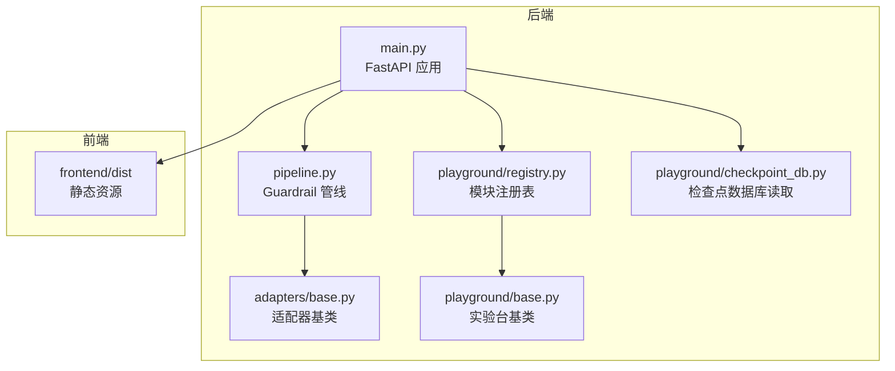
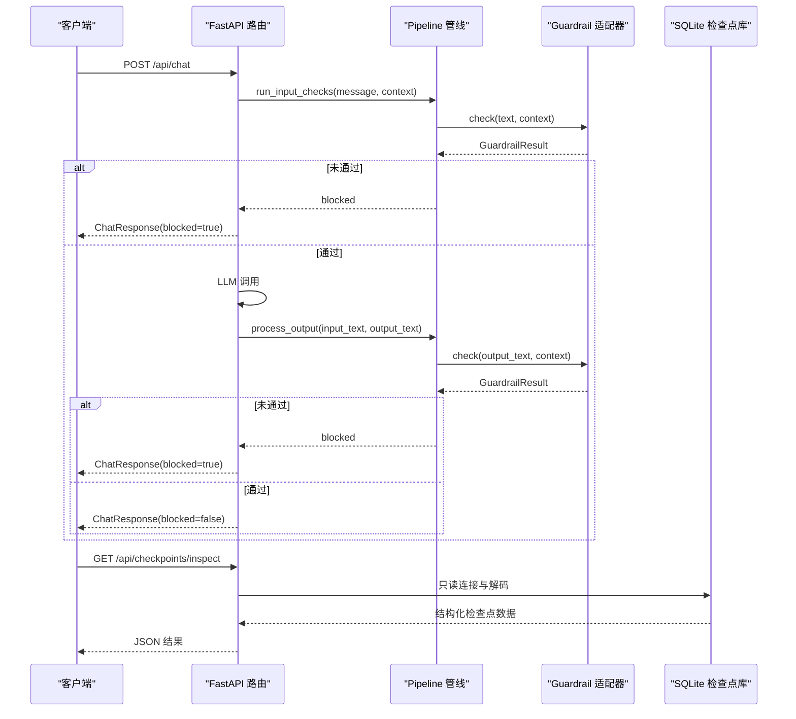
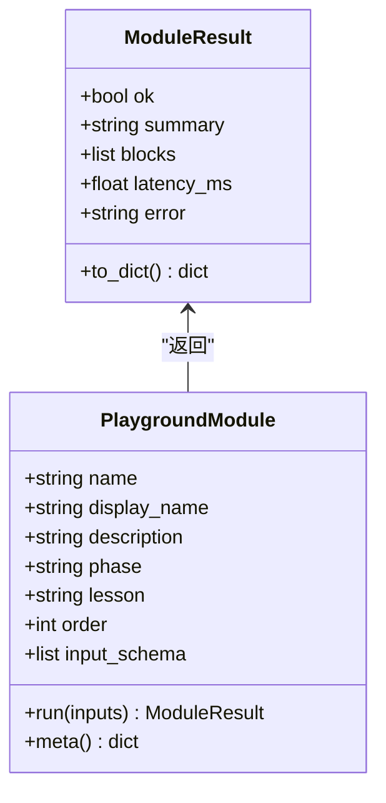
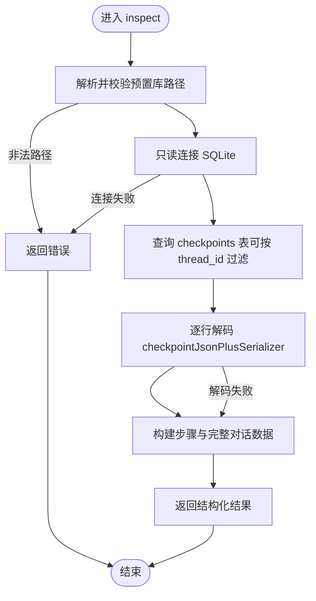
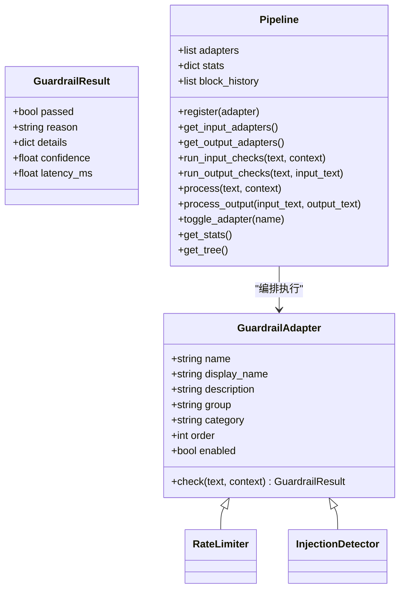
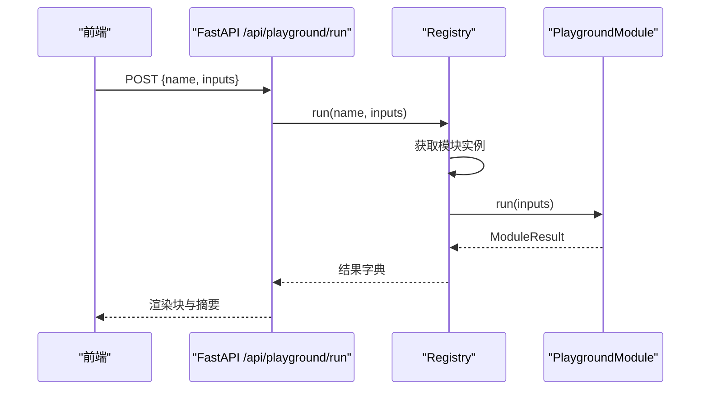
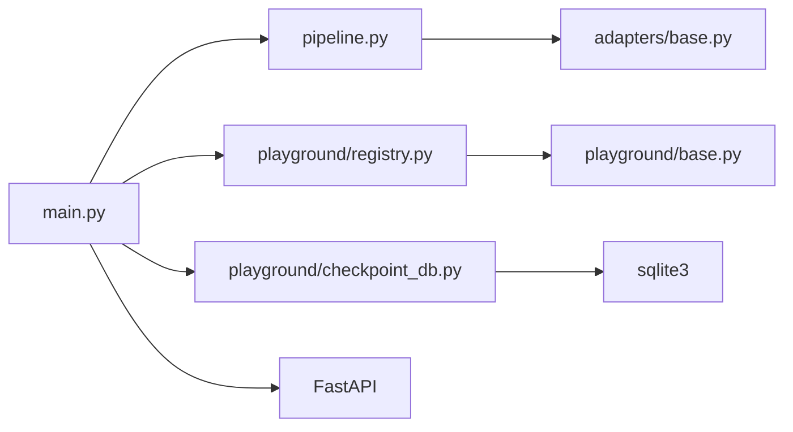

# 平台配置与管理

<cite>
**本文档引用的文件**
- [guardrails-sandbox/backend/playground/base.py](file://guardrails-sandbox/backend/playground/base.py)
- [guardrails-sandbox/backend/playground/checkpoint_db.py](file://guardrails-sandbox/backend/playground/checkpoint_db.py)
- [guardrails-sandbox/backend/main.py](file://guardrails-sandbox/backend/main.py)
- [guardrails-sandbox/backend/pipeline.py](file://guardrails-sandbox/backend/pipeline.py)
- [guardrails-sandbox/backend/playground/registry.py](file://guardrails-sandbox/backend/playground/registry.py)
- [guardrails-sandbox/backend/adapters/base.py](file://guardrails-sandbox/backend/adapters/base.py)
- [guardrails-sandbox/backend/adapters/rate_limiter.py](file://guardrails-sandbox/backend/adapters/rate_limiter.py)
- [guardrails-sandbox/backend/adapters/injection.py](file://guardrails-sandbox/backend/adapters/injection.py)
- [guardrails-sandbox/backend/playground/modules/checkpoint_viewer.py](file://guardrails-sandbox/backend/playground/modules/checkpoint_viewer.py)
- [guardrails-sandbox/backend/playground/modules/langgraph_simulator.py](file://guardrails-sandbox/backend/playground/modules/langgraph_simulator.py)
- [guardrails-sandbox/run.sh](file://guardrails-sandbox/run.sh)
- [requirements.txt](file://requirements.txt)
</cite>

## 目录
1. [简介](#简介)
2. [项目结构](#项目结构)
3. [核心组件](#核心组件)
4. [架构总览](#架构总览)
5. [详细组件分析](#详细组件分析)
6. [依赖关系分析](#依赖关系分析)
7. [性能考虑](#性能考虑)
8. [故障排除指南](#故障排除指南)
9. [结论](#结论)

## 简介
本文件为 Guardrails 沙箱平台的配置与管理文档，重点涵盖以下方面：
- 实验平台基础架构（playground/base.py）的设计模式与扩展机制
- 检查点数据库（checkpoint_db）的存储结构、查询接口与数据管理策略
- 平台配置选项、环境变量与启动参数
- 平台监控指标、日志记录与错误处理机制
- 平台部署、维护与性能优化的实用指南
- 故障排除与调试技巧

## 项目结构
Guardrails 沙箱平台采用前后端分离架构，后端基于 FastAPI 提供 API 服务，前端使用 Vite 构建。核心模块包括：
- 后端主程序：FastAPI 应用与路由定义
- Guardrail 管线：适配器注册、编排与统计
- Playground 实验台：模块化教学实验与可视化
- 检查点数据库：LangGraph 检查点库只读读取与解码
- 适配器集合：输入/输出安全检查与过滤

**图表来源**
- [guardrails-sandbox/backend/main.py:1-421](file://guardrails-sandbox/backend/main.py#L1-L421)
- [guardrails-sandbox/backend/pipeline.py:1-285](file://guardrails-sandbox/backend/pipeline.py#L1-L285)
- [guardrails-sandbox/backend/adapters/base.py:1-34](file://guardrails-sandbox/backend/adapters/base.py#L1-L34)
- [guardrails-sandbox/backend/playground/base.py:1-129](file://guardrails-sandbox/backend/playground/base.py#L1-L129)
- [guardrails-sandbox/backend/playground/registry.py:1-118](file://guardrails-sandbox/backend/playground/registry.py#L1-L118)
- [guardrails-sandbox/backend/playground/checkpoint_db.py:1-148](file://guardrails-sandbox/backend/playground/checkpoint_db.py#L1-L148)

**章节来源**
- [guardrails-sandbox/backend/main.py:1-421](file://guardrails-sandbox/backend/main.py#L1-L421)
- [guardrails-sandbox/backend/pipeline.py:1-285](file://guardrails-sandbox/backend/pipeline.py#L1-L285)
- [guardrails-sandbox/backend/playground/base.py:1-129](file://guardrails-sandbox/backend/playground/base.py#L1-L129)
- [guardrails-sandbox/backend/playground/registry.py:1-118](file://guardrails-sandbox/backend/playground/registry.py#L1-L118)
- [guardrails-sandbox/backend/playground/checkpoint_db.py:1-148](file://guardrails-sandbox/backend/playground/checkpoint_db.py#L1-L148)

## 核心组件
本节概述平台的关键组件及其职责：
- FastAPI 应用与路由：提供聊天、对比模式、基准测试、MCP 工具代理、实验台模块与检查点数据库查看器等 API
- Guardrail 管线：注册与编排适配器，支持输入/输出检查、统计与拦截历史记录
- 适配器基类：统一的 GuardrailResult 结构与 GuardrailAdapter 抽象接口
- 实验台基类与注册表：模块化实验台，支持 schema 驱动的表单渲染与结果块
- 检查点数据库读取层：只读访问 LangGraph SQLite 检查点库，解码消息并返回结构化数据

**章节来源**
- [guardrails-sandbox/backend/main.py:1-421](file://guardrails-sandbox/backend/main.py#L1-L421)
- [guardrails-sandbox/backend/pipeline.py:1-285](file://guardrails-sandbox/backend/pipeline.py#L1-L285)
- [guardrails-sandbox/backend/adapters/base.py:1-34](file://guardrails-sandbox/backend/adapters/base.py#L1-L34)
- [guardrails-sandbox/backend/playground/base.py:1-129](file://guardrails-sandbox/backend/playground/base.py#L1-L129)
- [guardrails-sandbox/backend/playground/registry.py:1-118](file://guardrails-sandbox/backend/playground/registry.py#L1-L118)
- [guardrails-sandbox/backend/playground/checkpoint_db.py:1-148](file://guardrails-sandbox/backend/playground/checkpoint_db.py#L1-L148)

## 架构总览
平台采用分层设计：
- 表现层：FastAPI 路由与响应模型
- 业务层：Pipeline 管线与适配器编排
- 数据层：SQLite 检查点库只读访问
- 可视化层：Playground 模块渲染块与前端静态资源

**图表来源**
- [guardrails-sandbox/backend/main.py:155-221](file://guardrails-sandbox/backend/main.py#L155-L221)
- [guardrails-sandbox/backend/pipeline.py:31-84](file://guardrails-sandbox/backend/pipeline.py#L31-L84)
- [guardrails-sandbox/backend/playground/checkpoint_db.py:86-147](file://guardrails-sandbox/backend/playground/checkpoint_db.py#L86-L147)

## 详细组件分析

### 基础架构与扩展机制（playground/base.py）
- 设计模式
  - 数据类封装：ModuleResult 统一输出结构，包含布尔状态、摘要、渲染块、延迟与错误信息
  - 模板方法：PlaygroundModule 抽象类定义 run 接口，子类仅实现业务逻辑
  - 工厂/辅助函数：field_spec 与多种 block_* 函数简化输入 schema 与渲染块构造
- 扩展机制
  - 子类通过定义 name/display_name/description/phase/lesson/order/input_schema 等属性声明元数据
  - render blocks 体系：text/json/table/keyvalue/list 等类型由前端统一渲染，无需前端改动
- 典型用法
  - 模块通过 field_spec 描述输入字段，通过 block_* 构造渲染块，最终以 ModuleResult 返回

**图表来源**
- [guardrails-sandbox/backend/playground/base.py:81-129](file://guardrails-sandbox/backend/playground/base.py#L81-L129)

**章节来源**
- [guardrails-sandbox/backend/playground/base.py:1-129](file://guardrails-sandbox/backend/playground/base.py#L1-L129)

### 检查点数据库（checkpoint_db）设计与实现
- 存储结构
  - 使用 SQLite 存储 LangGraph 检查点，表名为 checkpoints，包含 thread_id、checkpoint_id、type、checkpoint 等字段
  - checkpoint 列为二进制（msgpack），需通过 JsonPlusSerializer 解码为消息列表
- 查询接口
  - list_dbs：列出预置库及其存在状态
  - inspect：按 preset_key 与可选 thread_id 查询，返回结构化结果（包含每步消息、完整对话等）
- 数据管理策略
  - 只读模式（mode=ro）与目录穿越防护（resolve 后必须位于 DATA_DIR 内）
  - 对异常进行分类处理：ValueError/FileNotFoundError 与通用异常分别返回错误信息
  - 解码失败时记录 error 字段，保证前端可感知

**图表来源**
- [guardrails-sandbox/backend/playground/checkpoint_db.py:86-147](file://guardrails-sandbox/backend/playground/checkpoint_db.py#L86-L147)

**章节来源**
- [guardrails-sandbox/backend/playground/checkpoint_db.py:1-148](file://guardrails-sandbox/backend/playground/checkpoint_db.py#L1-L148)
- [guardrails-sandbox/backend/playground/modules/checkpoint_viewer.py:1-206](file://guardrails-sandbox/backend/playground/modules/checkpoint_viewer.py#L1-L206)

### Guardrail 管线与适配器体系
- 管线编排
  - Pipeline 维护适配器列表、统计信息与拦截历史，按 group/category/order 排序执行
  - 输入/输出两类适配器分别在请求入口与 LLM 输出阶段运行，遇阻断即短路
- 适配器基类
  - GuardrailAdapter 定义统一的 check 接口与 GuardrailResult 结果结构
  - 支持启用/禁用控制与优先级排序
- 示例适配器
  - 速率限制：基于滑动窗口的 RPM 限制，按 tier 配置不同限额
  - 注入检测：正则匹配提示注入攻击模式与编码绕过尝试

**图表来源**
- [guardrails-sandbox/backend/adapters/base.py:5-34](file://guardrails-sandbox/backend/adapters/base.py#L5-L34)
- [guardrails-sandbox/backend/pipeline.py:12-285](file://guardrails-sandbox/backend/pipeline.py#L12-L285)
- [guardrails-sandbox/backend/adapters/rate_limiter.py:7-56](file://guardrails-sandbox/backend/adapters/rate_limiter.py#L7-L56)
- [guardrails-sandbox/backend/adapters/injection.py:44-88](file://guardrails-sandbox/backend/adapters/injection.py#L44-L88)

**章节来源**
- [guardrails-sandbox/backend/pipeline.py:1-285](file://guardrails-sandbox/backend/pipeline.py#L1-L285)
- [guardrails-sandbox/backend/adapters/base.py:1-34](file://guardrails-sandbox/backend/adapters/base.py#L1-L34)
- [guardrails-sandbox/backend/adapters/rate_limiter.py:1-56](file://guardrails-sandbox/backend/adapters/rate_limiter.py#L1-L56)
- [guardrails-sandbox/backend/adapters/injection.py:1-88](file://guardrails-sandbox/backend/adapters/injection.py#L1-L88)

### 实验台模块注册与扩展
- 注册表
  - Registry 维护模块字典，提供按 phase 分组的模块清单与执行入口
  - 支持模块运行时异常捕获与错误返回
- 模块扩展流程
  - 在 modules/ 下新增模块文件，导入并在 _MODULES 列表中注册
  - 通过 PlaygroundModule 声明元数据与 input_schema，前端自动渲染
- 典型模块
  - LangGraph 模拟器：根据任务描述判断是否具备 Agent 形状，并模拟 ReAct 图的检查点序列
  - 检查点查看器：读取真实检查点库，解码每一步消息并提供完整对话回放

**图表来源**
- [guardrails-sandbox/backend/playground/registry.py:58-66](file://guardrails-sandbox/backend/playground/registry.py#L58-L66)
- [guardrails-sandbox/backend/main.py:374-378](file://guardrails-sandbox/backend/main.py#L374-L378)

**章节来源**
- [guardrails-sandbox/backend/playground/registry.py:1-118](file://guardrails-sandbox/backend/playground/registry.py#L1-L118)
- [guardrails-sandbox/backend/playground/modules/langgraph_simulator.py:1-119](file://guardrails-sandbox/backend/playground/modules/langgraph_simulator.py#L1-L119)
- [guardrails-sandbox/backend/playground/modules/checkpoint_viewer.py:1-206](file://guardrails-sandbox/backend/playground/modules/checkpoint_viewer.py#L1-L206)

## 依赖关系分析
- 外部依赖
  - Python 生态：FastAPI、SQLAlchemy（通过 sqlite3）、langgraph（序列化器）、sentence-transformers 等
  - 前端：Vite 开发服务器与静态资源托管
- 内部耦合
  - main.py 依赖 pipeline.py、playground/registry.py、playground/checkpoint_db.py
  - pipeline.py 依赖 adapters/base.py 与具体适配器
  - playground 模块依赖 playground/base.py 与渲染块工具

**图表来源**
- [guardrails-sandbox/backend/main.py:1-421](file://guardrails-sandbox/backend/main.py#L1-L421)
- [guardrails-sandbox/backend/pipeline.py:1-285](file://guardrails-sandbox/backend/pipeline.py#L1-L285)
- [guardrails-sandbox/backend/playground/registry.py:1-118](file://guardrails-sandbox/backend/playground/registry.py#L1-L118)
- [guardrails-sandbox/backend/playground/checkpoint_db.py:1-148](file://guardrails-sandbox/backend/playground/checkpoint_db.py#L1-L148)
- [guardrails-sandbox/backend/adapters/base.py:1-34](file://guardrails-sandbox/backend/adapters/base.py#L1-L34)

**章节来源**
- [guardrails-sandbox/backend/main.py:1-421](file://guardrails-sandbox/backend/main.py#L1-L421)
- [requirements.txt:1-19](file://requirements.txt#L1-L19)

## 性能考虑
- 预加载模型
  - 在启动前预加载 sentence-transformers 模型，避免异步环境下 httpx 连接问题
- 延迟测量
  - 主要流程（整体、LLM、输入/输出检查）均记录毫秒级延迟，便于性能分析
- 适配器执行顺序
  - 按 group/category/order 排序，短路策略减少不必要的检查开销
- 数据库只读与安全
  - SQLite 以只读模式连接，降低锁竞争与写入开销；路径解析与目录穿越防护确保安全性

**章节来源**
- [guardrails-sandbox/backend/main.py:62-76](file://guardrails-sandbox/backend/main.py#L62-L76)
- [guardrails-sandbox/backend/main.py:155-221](file://guardrails-sandbox/backend/main.py#L155-L221)
- [guardrails-sandbox/backend/pipeline.py:22-24](file://guardrails-sandbox/backend/pipeline.py#L22-L24)

## 故障排除指南
- 检查点数据库相关
  - 未知库或非法路径：确认 preset_key 正确且路径解析后位于 DATA_DIR 内
  - 找不到数据库文件：确认 demo_checkpoints.db 已生成并放置于 data/ 目录
  - 不是 LangGraph 检查点库：确认包含 checkpoints 表
  - 解码失败：确认安装了 langgraph 序列化器并正确使用 JsonPlusSerializer
- 适配器相关
  - 速率限制触发：检查用户 tier 与当前 RPM 使用情况
  - 注入检测告警：检查输入文本是否包含已知攻击模式或编码绕过
- API 错误处理
  - 404 未找到适配器：确认适配器名称拼写正确
  - LLM 调用失败：检查网络连通性与凭据配置
- 日志与统计
  - 查看拦截历史与统计信息，定位高频拦截原因
  - 使用对比模式（/api/chat/compare）比较开启/关闭 guardrails 的差异

**章节来源**
- [guardrails-sandbox/backend/playground/checkpoint_db.py:37-47](file://guardrails-sandbox/backend/playground/checkpoint_db.py#L37-L47)
- [guardrails-sandbox/backend/playground/checkpoint_db.py:86-147](file://guardrails-sandbox/backend/playground/checkpoint_db.py#L86-L147)
- [guardrails-sandbox/backend/adapters/rate_limiter.py:37-45](file://guardrails-sandbox/backend/adapters/rate_limiter.py#L37-L45)
- [guardrails-sandbox/backend/adapters/injection.py:77-87](file://guardrails-sandbox/backend/adapters/injection.py#L77-L87)
- [guardrails-sandbox/backend/main.py:147-152](file://guardrails-sandbox/backend/main.py#L147-L152)
- [guardrails-sandbox/backend/main.py:186-194](file://guardrails-sandbox/backend/main.py#L186-L194)

## 结论
本平台通过清晰的分层架构与模块化设计，实现了可扩展的安全检查与可视化实验功能。基础架构以 PlaygroundModule 为核心，配合 Registry 实现模块的快速扩展；Guardrail 管线提供统一的适配器编排与统计能力；检查点数据库读取层确保了对 LangGraph 检查点的安全、只读访问。结合完善的监控指标、日志记录与错误处理机制，平台能够满足教学演示与生产级部署的双重需求。