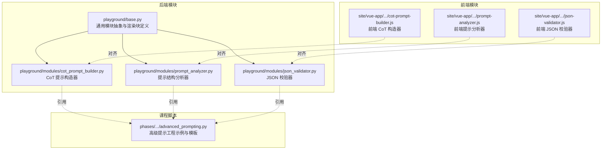
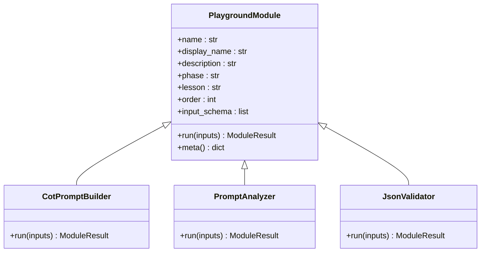
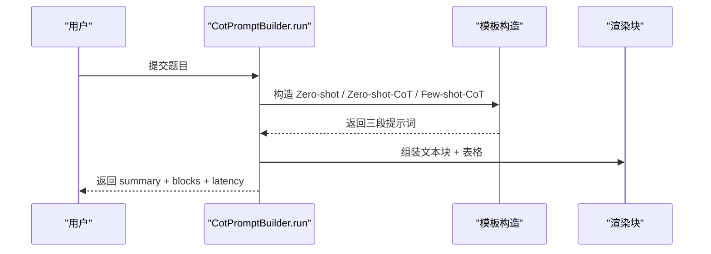
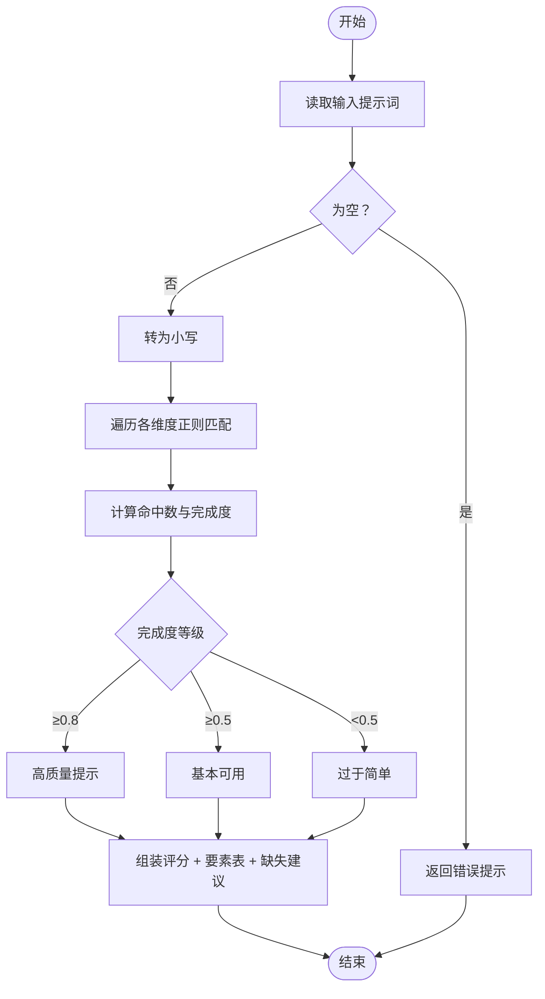
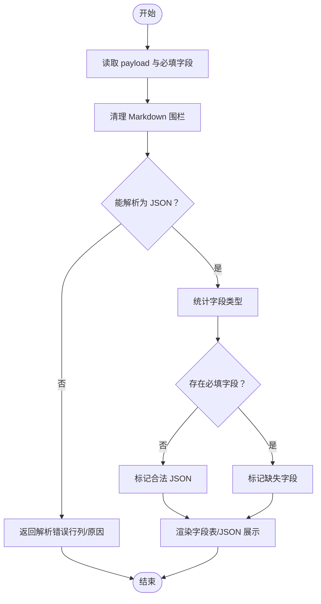
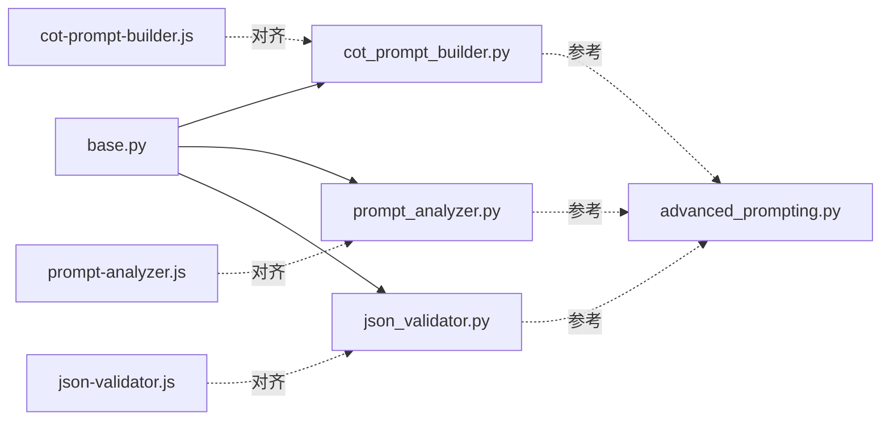

# 提示工程模块

<cite>
**本文档引用的文件**
- [cot_prompt_builder.py](file://guardrails-sandbox/backend/playground/modules/cot_prompt_builder.py)
- [prompt_analyzer.py](file://guardrails-sandbox/backend/playground/modules/prompt_analyzer.py)
- [json_validator.py](file://guardrails-sandbox/backend/playground/modules/json_validator.py)
- [base.py](file://guardrails-sandbox/backend/playground/base.py)
- [advanced_prompting.py](file://phases/11-llm-engineering/02-few-shot-cot/code/advanced_prompting.py)
- [cot-prompt-builder.js](file://site/vue-app/summary/src/data/modules/cot-prompt-builder.js)
- [prompt-analyzer.js](file://site/vue-app/summary/src/data/modules/prompt-analyzer.js)
- [json-validator.js](file://site/vue-app/summary/src/data/modules/json-validator.js)
</cite>

## 目录
1. [简介](#简介)
2. [项目结构](#项目结构)
3. [核心组件](#核心组件)
4. [架构总览](#架构总览)
5. [详细组件分析](#详细组件分析)
6. [依赖分析](#依赖分析)
7. [性能考虑](#性能考虑)
8. [故障排查指南](#故障排查指南)
9. [结论](#结论)
10. [附录](#附录)

## 简介
本文件系统性梳理提示工程模块，围绕以下三个核心能力展开：
- 思维链提示构建器（cot_prompt_builder）：对比 Zero-shot、Zero-shot-CoT、Few-shot-CoT 三类提示词的构造方式与适用场景，帮助用户快速生成并比较不同复杂度的提示词。
- 提示分析器（prompt_analyzer）：对用户输入的提示词进行本地化结构分析，从“角色设定、明确任务、输出格式、约束条件、示例、上下文”六个维度打分并给出改进建议。
- JSON 验证器（json_validator）：对 LLM 输出的 JSON 进行本地校验，支持解析合法性、字段齐全性与类型一致性检查。

本模块采用统一的 PlaygroundModule 抽象，前端通过输入 schema 自动渲染表单与结果块，保证模块扩展与前端解耦。

## 项目结构
提示工程模块位于 guardrails-sandbox 后端 playground 的 modules 目录中，配合前端侧的同名模块实现前后端一致的交互体验。课程配套的高级提示工程脚本提供了更丰富的提示模板与评估流程，便于理解与迁移。

**图表来源**
- [base.py:1-129](file://guardrails-sandbox/backend/playground/base.py#L1-L129)
- [cot_prompt_builder.py:1-81](file://guardrails-sandbox/backend/playground/modules/cot_prompt_builder.py#L1-L81)
- [prompt_analyzer.py:1-93](file://guardrails-sandbox/backend/playground/modules/prompt_analyzer.py#L1-L93)
- [json_validator.py:1-98](file://guardrails-sandbox/backend/playground/modules/json_validator.py#L1-L98)
- [cot-prompt-builder.js:1-66](file://site/vue-app/summary/src/data/modules/cot-prompt-builder.js#L1-L66)
- [prompt-analyzer.js:1-82](file://site/vue-app/summary/src/data/modules/prompt-analyzer.js#L1-L82)
- [json-validator.js:78-95](file://site/vue-app/summary/src/data/modules/json-validator.js#L78-L95)
- [advanced_prompting.py:1-548](file://phases/11-llm-engineering/02-few-shot-cot/code/advanced_prompting.py#L1-L548)

**章节来源**
- [cot_prompt_builder.py:1-81](file://guardrails-sandbox/backend/playground/modules/cot_prompt_builder.py#L1-L81)
- [prompt_analyzer.py:1-93](file://guardrails-sandbox/backend/playground/modules/prompt_analyzer.py#L1-L93)
- [json_validator.py:1-98](file://guardrails-sandbox/backend/playground/modules/json_validator.py#L1-L98)
- [base.py:1-129](file://guardrails-sandbox/backend/playground/base.py#L1-L129)
- [advanced_prompting.py:1-548](file://phases/11-llm-engineering/02-few-shot-cot/code/advanced_prompting.py#L1-L548)
- [cot-prompt-builder.js:1-66](file://site/vue-app/summary/src/data/modules/cot-prompt-builder.js#L1-L66)
- [prompt-analyzer.js:1-82](file://site/vue-app/summary/src/data/modules/prompt-analyzer.js#L1-L82)
- [json-validator.js:78-95](file://site/vue-app/summary/src/data/modules/json-validator.js#L78-L95)

## 核心组件
- CoT 提示构造器（cot_prompt_builder）
  - 功能：生成 Zero-shot、Zero-shot-CoT、Few-shot-CoT 三类提示词，标注各自 Token 成本与适用场景。
  - 关键点：内置少量示例用于 Few-shot；构造逻辑与课程脚本中的 build_*_prompt 对应。
- 提示分析器（prompt_analyzer）
  - 功能：对提示词进行本地化结构分析，按六个维度打分并给出缺失项建议。
  - 关键点：使用正则匹配关键词，计算完成度得分，输出可视化块。
- JSON 验证器（json_validator）
  - 功能：校验 JSON 合法性、字段齐全性与类型一致性，支持去除 Markdown 代码围栏。
  - 关键点：解析失败时返回具体行列位置与常见问题提示；通过渲染块直观展示字段与类型。

**章节来源**
- [cot_prompt_builder.py:30-81](file://guardrails-sandbox/backend/playground/modules/cot_prompt_builder.py#L30-L81)
- [prompt_analyzer.py:34-93](file://guardrails-sandbox/backend/playground/modules/prompt_analyzer.py#L34-L93)
- [json_validator.py:16-98](file://guardrails-sandbox/backend/playground/modules/json_validator.py#L16-L98)

## 架构总览
模块遵循“PlaygroundModule 抽象 + 统一渲染块”的设计，前端仅依赖 input_schema 与模块元信息即可自动渲染表单与结果面板。每个模块负责：
- 声明输入字段（field_spec）
- 实现 run(inputs) 返回 ModuleResult
- 使用 block_* 辅助函数组织渲染块（文本、表格、JSON、键值对、评分）

**图表来源**
- [base.py:101-129](file://guardrails-sandbox/backend/playground/base.py#L101-L129)
- [cot_prompt_builder.py:30-81](file://guardrails-sandbox/backend/playground/modules/cot_prompt_builder.py#L30-L81)
- [prompt_analyzer.py:34-93](file://guardrails-sandbox/backend/playground/modules/prompt_analyzer.py#L34-L93)
- [json_validator.py:16-98](file://guardrails-sandbox/backend/playground/modules/json_validator.py#L16-L98)

## 详细组件分析

### 思维链提示构建器（cot_prompt_builder）
- 设计思路
  - 三类提示词模板：零样本、思维链触发、少样本示范。
  - 通过统一的 Q/A 格式与“让我们一步一步思考”触发 CoT。
  - 将课程脚本中的 build_*_prompt 逻辑映射到本地构造，避免调用 LLM。
- 实现要点
  - 输入字段：题目（textarea）。
  - 输出：三段提示词文本块 + 成本与质量对比表格。
  - 时间开销：记录运行耗时，便于性能感知。
- 优化策略
  - 在少样本场景下，优先选择与目标问题语义相近的示例，减少 token 并提升稳定性。
  - 对于复杂推理任务，建议使用 Zero-shot-CoT 或 Few-shot-CoT；若对准确率极致追求，可结合 Self-Consistency 多次采样投票。

**图表来源**
- [cot_prompt_builder.py:43-81](file://guardrails-sandbox/backend/playground/modules/cot_prompt_builder.py#L43-L81)
- [advanced_prompting.py:123-157](file://phases/11-llm-engineering/02-few-shot-cot/code/advanced_prompting.py#L123-L157)

**章节来源**
- [cot_prompt_builder.py:1-81](file://guardrails-sandbox/backend/playground/modules/cot_prompt_builder.py#L1-L81)
- [advanced_prompting.py:123-157](file://phases/11-llm-engineering/02-few-shot-cot/code/advanced_prompting.py#L123-L157)

### 提示分析器（prompt_analyzer）
- 功能特性
  - 维度覆盖：角色设定、明确任务、输出格式、约束条件、示例、上下文。
  - 本地化分析：不调用 LLM，基于关键词正则匹配。
  - 结果呈现：完成度评分、要素检查表、缺失建议清单。
- 实现要点
  - 输入字段：提示词（textarea）。
  - 匹配策略：将提示词转为小写后逐维度正则扫描，统计命中数量。
  - 评分规则：命中数/维度总数，结合字符长度与评语输出。
- 改进建议
  - 若缺失“输出格式”，建议指定 JSON/Markdown/表格等结构化输出。
  - 若缺失“示例”，建议添加 1-2 个少样本示例以降低歧义。

**图表来源**
- [prompt_analyzer.py:47-93](file://guardrails-sandbox/backend/playground/modules/prompt_analyzer.py#L47-L93)

**章节来源**
- [prompt_analyzer.py:1-93](file://guardrails-sandbox/backend/playground/modules/prompt_analyzer.py#L1-L93)

### JSON 验证器（json_validator）
- 校验机制
  - 解析合法性：去除 Markdown 代码围栏后尝试 json.loads，捕获 JSONDecodeError 并定位行列。
  - 字段齐全性：根据 required_fields 参数校验必填字段是否存在。
  - 类型一致性：遍历顶层对象输出字段类型与示例值摘要。
- 实现要点
  - 输入字段：payload（textarea）、required_fields（可选文本）。
  - 错误处理：解析失败时返回结构化错误信息与修复建议。
  - 结果呈现：字段一览表、缺失字段提示、最终 JSON 展示块。
- 优化建议
  - 在提示中显式要求“仅返回合法 JSON”，并限定顶层类型，减少解析失败概率。
  - 使用 required_fields 精确约束关键字段，避免下游处理遗漏。

**图表来源**
- [json_validator.py:32-98](file://guardrails-sandbox/backend/playground/modules/json_validator.py#L32-L98)

**章节来源**
- [json_validator.py:1-98](file://guardrails-sandbox/backend/playground/modules/json_validator.py#L1-L98)

## 依赖分析
- 模块内聚与耦合
  - 三个模块均继承自 PlaygroundModule，共享统一的输入/输出契约与渲染块体系，内聚高、耦合低。
  - 前端模块与后端模块一一对应，通过相同名称与 schema 保持一致性。
- 外部依赖
  - 基础层：Python 标准库（json、re、time）。
  - 课程脚本：advanced_prompting.py 提供模板与评估流程参考。
- 潜在循环依赖
  - 无直接循环依赖；模块间通过 base.py 的抽象进行解耦。

**图表来源**
- [base.py:1-129](file://guardrails-sandbox/backend/playground/base.py#L1-L129)
- [cot_prompt_builder.py:1-81](file://guardrails-sandbox/backend/playground/modules/cot_prompt_builder.py#L1-L81)
- [prompt_analyzer.py:1-93](file://guardrails-sandbox/backend/playground/modules/prompt_analyzer.py#L1-L93)
- [json_validator.py:1-98](file://guardrails-sandbox/backend/playground/modules/json_validator.py#L1-L98)
- [advanced_prompting.py:1-548](file://phases/11-llm-engineering/02-few-shot-cot/code/advanced_prompting.py#L1-L548)
- [cot-prompt-builder.js:1-66](file://site/vue-app/summary/src/data/modules/cot-prompt-builder.js#L1-L66)
- [prompt-analyzer.js:1-82](file://site/vue-app/summary/src/data/modules/prompt-analyzer.js#L1-L82)
- [json-validator.js:78-95](file://site/vue-app/summary/src/data/modules/json-validator.js#L78-L95)

**章节来源**
- [base.py:1-129](file://guardrails-sandbox/backend/playground/base.py#L1-L129)
- [cot_prompt_builder.py:1-81](file://guardrails-sandbox/backend/playground/modules/cot_prompt_builder.py#L1-L81)
- [prompt_analyzer.py:1-93](file://guardrails-sandbox/backend/playground/modules/prompt_analyzer.py#L1-L93)
- [json_validator.py:1-98](file://guardrails-sandbox/backend/playground/modules/json_validator.py#L1-L98)
- [advanced_prompting.py:1-548](file://phases/11-llm-engineering/02-few-shot-cot/code/advanced_prompting.py#L1-L548)
- [cot-prompt-builder.js:1-66](file://site/vue-app/summary/src/data/modules/cot-prompt-builder.js#L1-L66)
- [prompt-analyzer.js:1-82](file://site/vue-app/summary/src/data/modules/prompt-analyzer.js#L1-L82)
- [json-validator.js:78-95](file://site/vue-app/summary/src/data/modules/json-validator.js#L78-L95)

## 性能考虑
- 时间开销
  - 三个模块均为纯本地计算，时间复杂度与输入规模近似线性；通过 latency_ms 字段记录耗时，便于监控与优化。
- Token 成本
  - Zero-shot-CoT 通过“让我们一步一步思考”低成本提升推理质量；Few-shot-CoT 提升稳定但增加 token；Self-Consistency 通过多次采样显著提高准确率但成本更高。
- 建议
  - 在资源受限场景优先使用 Zero-shot 或 Zero-shot-CoT；对关键任务可采用 Few-shot-CoT 或 Self-Consistency。
  - 对提示词进行缓存与复用，减少重复构造成本。

[本节为通用性能讨论，不直接分析具体文件]

## 故障排查指南
- 提示分析器
  - 症状：提示词过短或缺乏关键要素导致评分偏低。
  - 排查：检查是否包含“角色设定、明确任务、输出格式、约束条件、示例、上下文”等关键词；根据缺失建议逐一补齐。
- JSON 验证器
  - 症状：解析失败，报错行列位置。
  - 排查：确认引号/逗号/括号配对；检查是否多包一层文字或漏尾随逗号；必要时移除 Markdown 代码围栏。
- CoT 提示构造器
  - 症状：少样本示例与问题差异较大，导致准确率下降。
  - 排查：替换更贴近目标问题的示例；或切换到 Zero-shot-CoT 以减少示例依赖。

**章节来源**
- [prompt_analyzer.py:47-93](file://guardrails-sandbox/backend/playground/modules/prompt_analyzer.py#L47-L93)
- [json_validator.py:32-98](file://guardrails-sandbox/backend/playground/modules/json_validator.py#L32-L98)
- [cot_prompt_builder.py:43-81](file://guardrails-sandbox/backend/playground/modules/cot_prompt_builder.py#L43-L81)

## 结论
提示工程模块通过统一的 Playground 抽象实现了“输入即表单、输出即可视化”的开发体验。CoT 提示构造器、提示分析器与 JSON 验证器分别覆盖了提示词生成、结构分析与输出校验的关键环节，既适合教学演示，也便于在生产环境中进行本地化质量保障与调试。

[本节为总结性内容，不直接分析具体文件]

## 附录

### 最佳实践
- 提示词设计
  - 明确角色与任务，限定输出格式与字数范围，提供上下文与示例。
  - 对复杂推理任务优先使用 CoT 触发或少样本示范。
- 输出治理
  - 在提示中强制要求合法 JSON，并指定顶层类型；使用必填字段参数确保关键字段齐全。
  - 对 LLM 输出进行本地 JSON 校验，尽早暴露格式错误。

### 常见陷阱
- 提示词过于宽泛：模型可能自由发挥，输出不可控。
- 忽视输出格式：导致下游解析困难或逻辑分支异常。
- 少样本示例与目标问题差异大：反而降低准确率。

### 调试技巧
- 使用提示分析器对提示词进行结构化打分，快速定位缺失要素。
- 使用 JSON 验证器定位解析错误的具体行列，结合常见问题提示修正。
- 在 CoT 构造器中切换不同模板，观察 token 成本与准确率变化，找到平衡点。

[本节为通用指导，不直接分析具体文件]