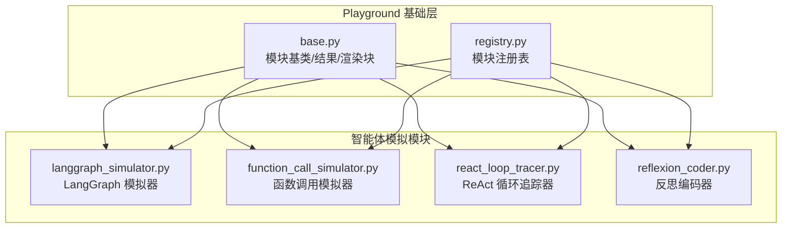
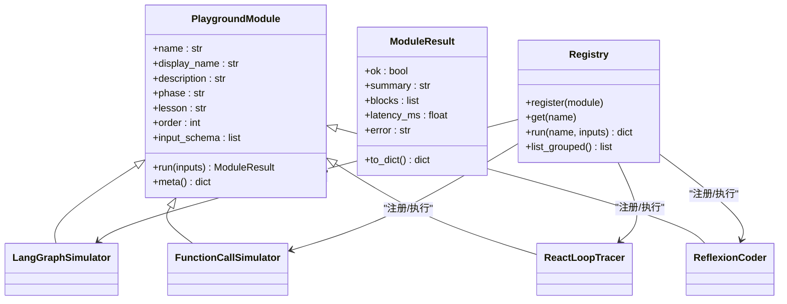
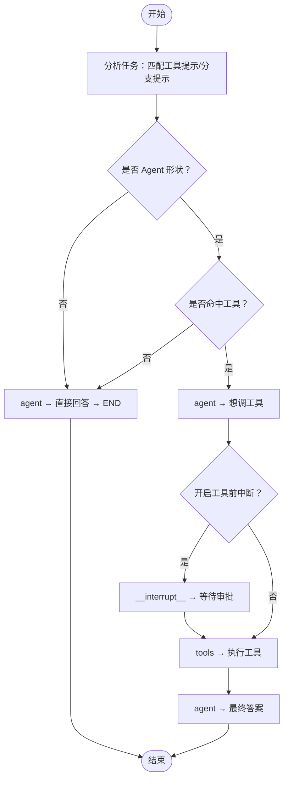
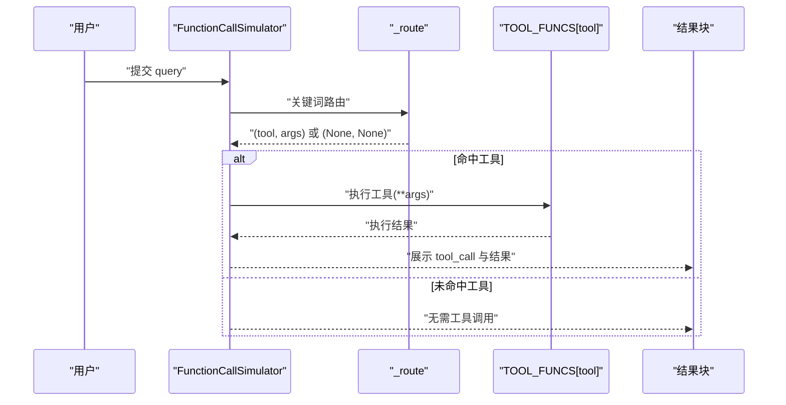
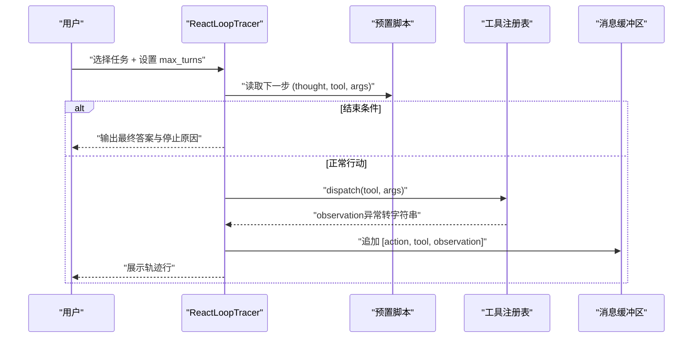
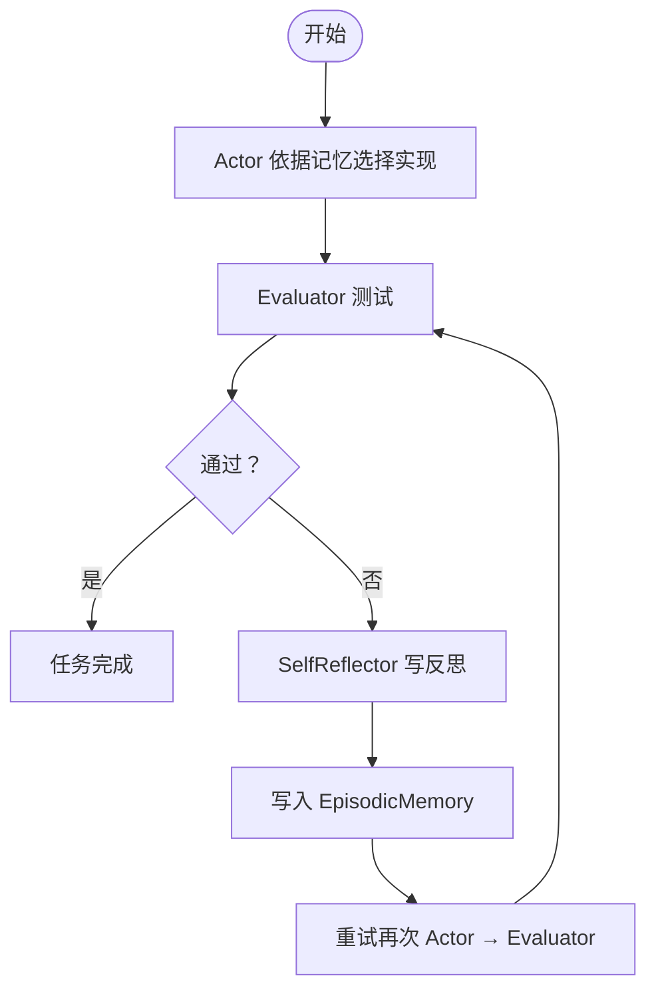
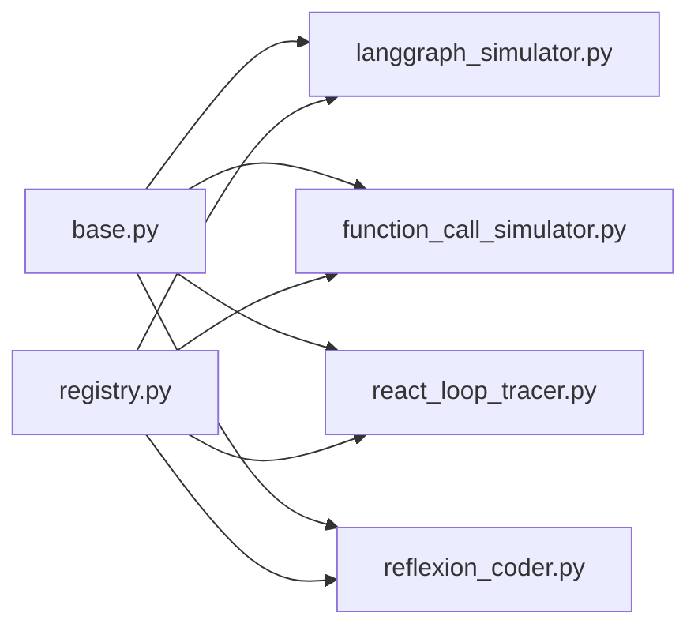

# 智能体模拟模块

<cite>
**本文引用的文件**
- [langgraph_simulator.py](file://guardrails-sandbox/backend/playground/modules/langgraph_simulator.py)
- [function_call_simulator.py](file://guardrails-sandbox/backend/playground/modules/function_call_simulator.py)
- [react_loop_tracer.py](file://guardrails-sandbox/backend/playground/modules/react_loop_tracer.py)
- [reflexion_coder.py](file://guardrails-sandbox/backend/playground/modules/reflexion_coder.py)
- [base.py](file://guardrails-sandbox/backend/playground/base.py)
- [registry.py](file://guardrails-sandbox/backend/playground/registry.py)
- [code_assistant_reflexion.py](file://phases/14-agent-engineering/03-reflexion-verbal-rl/code/code_assistant_reflexion.py)
</cite>

## 目录
1. [简介](#简介)
2. [项目结构](#项目结构)
3. [核心组件](#核心组件)
4. [架构总览](#架构总览)
5. [详细组件分析](#详细组件分析)
6. [依赖关系分析](#依赖关系分析)
7. [性能考量](#性能考量)
8. [故障排查指南](#故障排查指南)
9. [结论](#结论)
10. [附录](#附录)

## 简介
本文件面向“智能体模拟模块”，围绕以下四个子模块展开系统化文档：
- LangGraph 模拟器（langgraph_simulator）：以本地方式模拟 ReAct 状态图的节点、边、检查点与工具中断流程，帮助理解 LangGraph 的状态机与图遍历。
- 函数调用模拟器（function_call_simulator）：本地复现 function-calling 的“路由→构造 tool_call→执行工具→回填结果”的闭环，便于离线验证工具选择与参数传递。
- 思维-行动-反思循环追踪器（react_loop_tracer）：以预置脚本驱动 ReAct 循环，逐步展示“思考→行动→观察”的轨迹、停止条件与轮次预算，强调五要素（消息缓冲区、工具注册表、停止条件、轮次预算、观察格式化器）。
- 反思编码器（reflexion_coder）：模拟代码助手的“写→测→失败→反思→记忆→重试”的 Verbal RL 过程，对比“开记忆”与“关记忆”的效果，体现语言强化学习的即时性与可解释性。

## 项目结构
智能体模拟模块位于 guardrails-sandbox 的 playground 模块体系中，采用统一的模块抽象与注册机制：
- 模块基类与结果封装：PlaygroundModule、ModuleResult、渲染块辅助函数
- 模块注册表：Registry 统一注册各模块，提供按 phase 分组的导航与执行入口
- 四个核心模拟器模块：LangGraph 模拟器、函数调用模拟器、ReAct 循环追踪器、反思编码器

图表来源
- [base.py:101-129](file://guardrails-sandbox/backend/playground/base.py#L101-L129)
- [registry.py:48-118](file://guardrails-sandbox/backend/playground/registry.py#L48-L118)
- [langgraph_simulator.py:27-119](file://guardrails-sandbox/backend/playground/modules/langgraph_simulator.py#L27-L119)
- [function_call_simulator.py:72-125](file://guardrails-sandbox/backend/playground/modules/function_call_simulator.py#L72-L125)
- [react_loop_tracer.py:69-203](file://guardrails-sandbox/backend/playground/modules/react_loop_tracer.py#L69-L203)
- [reflexion_coder.py:84-185](file://guardrails-sandbox/backend/playground/modules/reflexion_coder.py#L84-L185)

章节来源
- [base.py:1-129](file://guardrails-sandbox/backend/playground/base.py#L1-L129)
- [registry.py:1-118](file://guardrails-sandbox/backend/playground/registry.py#L1-L118)

## 核心组件
- LangGraph 模拟器：检测任务是否具备“Agent 形状”（工具/分支），生成四节点 ReAct 图拓扑，模拟检查点序列与工具中断点，强调本地执行、不调 LLM。
- 函数调用模拟器：基于关键词路由选择工具，构造 OpenAI 格式的 tool_call，本地执行工具并回填结果，展示参数传递与错误处理。
- ReAct 循环追踪器：以预置脚本驱动循环，记录“思考→行动→观察”轨迹，支持轮次预算与停止条件，强调观察格式化器的健壮性。
- 反思编码器：模拟 Actor（实现生成）、Evaluator（测试）、SelfReflector（反思）与 EpisodicMemory（记忆）的闭环，对比开/关记忆的效果。

章节来源
- [langgraph_simulator.py:27-119](file://guardrails-sandbox/backend/playground/modules/langgraph_simulator.py#L27-L119)
- [function_call_simulator.py:72-125](file://guardrails-sandbox/backend/playground/modules/function_call_simulator.py#L72-L125)
- [react_loop_tracer.py:69-203](file://guardrails-sandbox/backend/playground/modules/react_loop_tracer.py#L69-L203)
- [reflexion_coder.py:84-185](file://guardrails-sandbox/backend/playground/modules/reflexion_coder.py#L84-L185)

## 架构总览
四个模块均继承自 PlaygroundModule，遵循统一的输入/输出协议，并由 Registry 集中管理与调度。模块内部通过渲染块（文本、表格、键值对、JSON、列表、分数）向前端呈现结果。

图表来源
- [base.py:101-129](file://guardrails-sandbox/backend/playground/base.py#L101-L129)
- [registry.py:48-118](file://guardrails-sandbox/backend/playground/registry.py#L48-L118)
- [langgraph_simulator.py:27-119](file://guardrails-sandbox/backend/playground/modules/langgraph_simulator.py#L27-L119)
- [function_call_simulator.py:72-125](file://guardrails-sandbox/backend/playground/modules/function_call_simulator.py#L72-L125)
- [react_loop_tracer.py:69-203](file://guardrails-sandbox/backend/playground/modules/react_loop_tracer.py#L69-L203)
- [reflexion_coder.py:84-185](file://guardrails-sandbox/backend/playground/modules/reflexion_coder.py#L84-L185)

## 详细组件分析

### LangGraph 模拟器（状态机与图遍历）
- 功能概述
  - 输入任务描述，判断是否“Agent 形状”（命中工具提示或存在分支）
  - 输出四节点 ReAct 图拓扑：agent →（有 tool_calls?）→ tools → agent，无 tool_calls 则直达 END
  - 模拟检查点序列：包含 __start__、agent、__interrupt__（可选）、tools、agent（最终答案或直接回答）
  - 展示 LangGraph 四大超能力：检查点、中断、流式、时光回溯
- 状态机与图遍历
  - 节点集合：__start__、agent、tools、__interrupt__（仅在开启工具前中断时出现）、END
  - 边集合：__start__ → agent；agent → tools（当命中工具）；agent → END（无工具）；tools → agent；agent → END
  - 遍历策略：顺序推进，遇工具调用即插入工具节点与可选中断点
- 关键实现要点
  - 工具提示与分支提示用于启发式判定“Agent 形状”
  - 中断开关控制在工具调用前暂停，便于人工审批
  - 检查点序列以表格形式呈现，便于复现与回溯

图表来源
- [langgraph_simulator.py:43-80](file://guardrails-sandbox/backend/playground/modules/langgraph_simulator.py#L43-L80)

章节来源
- [langgraph_simulator.py:1-119](file://guardrails-sandbox/backend/playground/modules/langgraph_simulator.py#L1-L119)

### 函数调用模拟器（接口设计与参数传递）
- 功能概述
  - 输入自然语言请求，本地关键词路由决定工具与参数
  - 生成 OpenAI 格式的 tool_call 结构，本地执行工具并回填结果
  - 支持多工具（示例：计算器、天气查询），参数校验与错误处理
- 接口设计
  - 输入字段：query（用户请求）
  - 输出块：工具选择、tool_call 结构、工具执行结果
- 参数传递机制
  - 路由规则：正则匹配数学表达式、关键词触发（如“计算/天气/温度”）
  - 参数构造：将提取的表达式或城市名封装为工具参数
  - 执行回填：将结果作为 JSON 块返回，供后续流程使用
- 错误处理
  - 非法字符检测、表达式求值异常、未知城市等均以结构化错误返回

图表来源
- [function_call_simulator.py:85-124](file://guardrails-sandbox/backend/playground/modules/function_call_simulator.py#L85-L124)

章节来源
- [function_call_simulator.py:1-125](file://guardrails-sandbox/backend/playground/modules/function_call_simulator.py#L1-L125)

### 思维-行动-反思循环追踪器（轨迹记录与分析）
- 功能概述
  - 选择预置任务脚本，本地驱动 ReAct 循环，逐步展示“思考→行动→观察”
  - 支持轮次预算与停止条件，记录最终答案与停止原因
  - 强调五要素：消息缓冲区、工具注册表、停止条件、轮次预算、观察格式化器
- 循环与轨迹
  - 每步从脚本读取 (thought, tool, args)，执行 dispatch 获取观察
  - 将“action + observation”追加到消息缓冲区，供后续思考参考
  - 若遇到 finish 或预算耗尽，终止循环并汇总结果
- 健壮性设计
  - dispatch 将异常转为字符串，避免循环崩溃，体现“报错也是一种观察”的自我纠正能力

图表来源
- [react_loop_tracer.py:86-202](file://guardrails-sandbox/backend/playground/modules/react_loop_tracer.py#L86-L202)

章节来源
- [react_loop_tracer.py:1-203](file://guardrails-sandbox/backend/playground/modules/react_loop_tracer.py#L1-L203)

### 反思编码器（自适应学习与改进）
- 功能概述
  - 任务：实现 roman_to_int（罗马数字转整数）
  - 主循环：Actor 生成实现 → Evaluator 测试 → 失败则 SelfReflector 写反思 → 写入 EpisodicMemory → 重试
  - 对比“开记忆”（Reflexion）与“关记忆”（Baseline），突出反思的即时学习价值
- 机制映射
  - Actor：根据记忆中是否存在“减法”教训，选择不同实现版本
  - Evaluator：可靠测试，返回通过与否与首个失败详情
  - SelfReflector：将失败详情转化为可执行的人话经验
  - Memory：累积反思，下次写代码前塞回 prompt
- 效果对比
  - 关记忆：纯函数式 prompt，失败信息丢弃，重复写出同样错误代码
  - 开记忆：反思即时注入 prompt，行为随经验迭代优化

图表来源
- [reflexion_coder.py:100-184](file://guardrails-sandbox/backend/playground/modules/reflexion_coder.py#L100-L184)
- [code_assistant_reflexion.py:101-128](file://phases/14-agent-engineering/03-reflexion-verbal-rl/code/code_assistant_reflexion.py#L101-L128)

章节来源
- [reflexion_coder.py:1-185](file://guardrails-sandbox/backend/playground/modules/reflexion_coder.py#L1-L185)
- [code_assistant_reflexion.py:1-143](file://phases/14-agent-engineering/03-reflexion-verbal-rl/code/code_assistant_reflexion.py#L1-L143)

## 依赖关系分析
- 模块间耦合
  - 四个模拟器模块彼此独立，均依赖 PlaygroundModule 基类与渲染块
  - Registry 统一注册与执行，模块之间无直接耦合
- 外部依赖
  - 正则表达式用于关键词匹配（LangGraph、函数调用）
  - 时间戳用于统计延迟（各模块）
  - 基础工具函数（计算器、KV 存储）内置于模块中，便于离线运行

图表来源
- [base.py:101-129](file://guardrails-sandbox/backend/playground/base.py#L101-L129)
- [registry.py:48-118](file://guardrails-sandbox/backend/playground/registry.py#L48-L118)
- [langgraph_simulator.py:27-119](file://guardrails-sandbox/backend/playground/modules/langgraph_simulator.py#L27-L119)
- [function_call_simulator.py:72-125](file://guardrails-sandbox/backend/playground/modules/function_call_simulator.py#L72-L125)
- [react_loop_tracer.py:69-203](file://guardrails-sandbox/backend/playground/modules/react_loop_tracer.py#L69-L203)
- [reflexion_coder.py:84-185](file://guardrails-sandbox/backend/playground/modules/reflexion_coder.py#L84-L185)

章节来源
- [registry.py:1-118](file://guardrails-sandbox/backend/playground/registry.py#L1-L118)

## 性能考量
- 时间复杂度
  - LangGraph 模拟器：启发式匹配与顺序遍历，整体 O(n)（n 为任务长度或分支数）
  - 函数调用模拟器：路由与工具执行均为 O(m)（m 为输入长度或数据库大小）
  - ReAct 循环追踪器：按脚本长度线性推进，最坏 O(T)（T 为 max_turns）
  - 反思编码器：主循环最多 T 次尝试，每次评测 O(S)（S 为测试用例数）
- 空间复杂度
  - LangGraph 模拟器：检查点序列线性增长，O(C)（C 为检查点数量）
  - 函数调用模拟器：工具参数与结果对象 O(1)
  - ReAct 循环追踪器：消息缓冲区与轨迹表线性增长，O(B)（B 为行动回合数）
  - 反思编码器：记忆列表线性增长，O(M)（M 为反思条目数）
- 优化建议
  - 使用缓存减少重复路由与工具执行
  - 控制 max_turns 与 max_trials，避免无限循环
  - 对工具执行结果进行结构化日志记录，便于审计与回放

## 故障排查指南
- LangGraph 模拟器
  - 问题：未识别到工具或分支，判定为非 Agent 形状
  - 排查：确认任务描述中是否包含工具提示关键词或分支语义
  - 建议：适当增加提示词或明确分支逻辑
- 函数调用模拟器
  - 问题：工具执行报错或参数不合法
  - 排查：检查表达式合法性、城市名称是否在数据库中
  - 建议：在路由阶段加入更严格的参数校验与默认值兜底
- ReAct 循环追踪器
  - 问题：循环未停止或无限循环
  - 排查：核对 max_turns 设置与脚本是否包含 finish
  - 建议：设置合理预算并确保脚本末尾有结束标记
- 反思编码器
  - 问题：开记忆后仍未通过
  - 排查：反思是否具体可执行；Evaluator 是否稳定
  - 建议：提升反思质量，引入相关性召回与记忆衰减

章节来源
- [langgraph_simulator.py:43-80](file://guardrails-sandbox/backend/playground/modules/langgraph_simulator.py#L43-L80)
- [function_call_simulator.py:85-124](file://guardrails-sandbox/backend/playground/modules/function_call_simulator.py#L85-L124)
- [react_loop_tracer.py:121-165](file://guardrails-sandbox/backend/playground/modules/react_loop_tracer.py#L121-L165)
- [reflexion_coder.py:100-184](file://guardrails-sandbox/backend/playground/modules/reflexion_coder.py#L100-L184)

## 结论
智能体模拟模块通过四个独立而互补的组件，分别覆盖状态机与图遍历、函数调用协议、ReAct 循环轨迹与 Verbal RL 反思机制。它们共同提供了从“任务建模→工具路由→循环执行→经验学习”的完整离线验证路径，既可用于教学演示，也可作为工程调试与性能监控的工具箱。

## 附录
- 使用指南
  - LangGraph 模拟器：输入任务描述，勾选“工具执行前人工审批”，查看 Agent 形状度、拓扑与检查点序列
  - 函数调用模拟器：输入自然语言请求，查看工具选择、tool_call 结构与执行结果
  - ReAct 循环追踪器：选择预置任务，调整轮次预算，观察轨迹与停止原因
  - 反思编码器：选择记忆开关与最大尝试次数，对比开/关记忆的通过情况与反思内容
- 调试建议
  - 逐步缩小输入范围，定位路由与工具执行瓶颈
  - 记录轨迹与检查点，结合 Registry 的 list_grouped 导航定位模块
  - 对照真实 LLM 行为，补充边界条件与错误处理