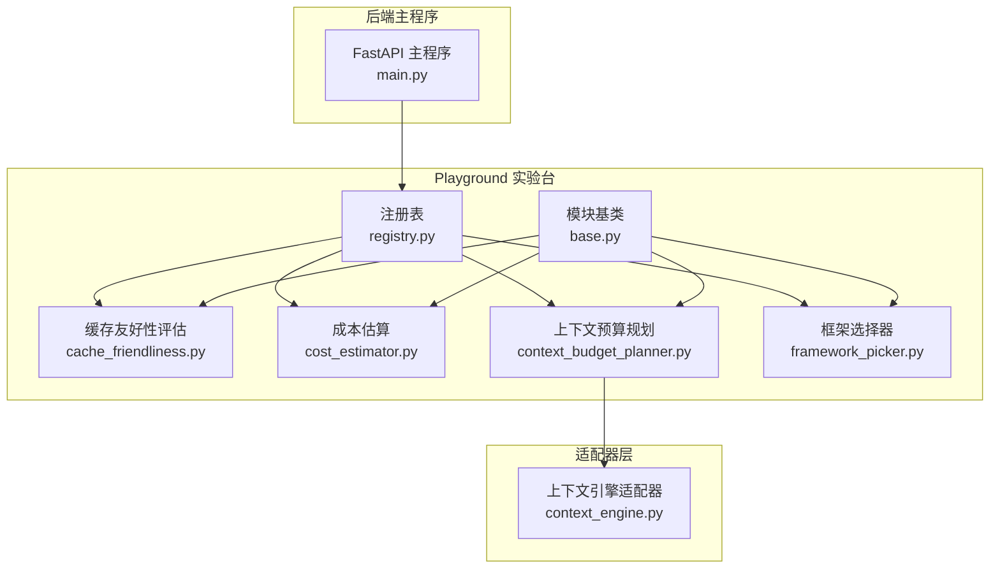
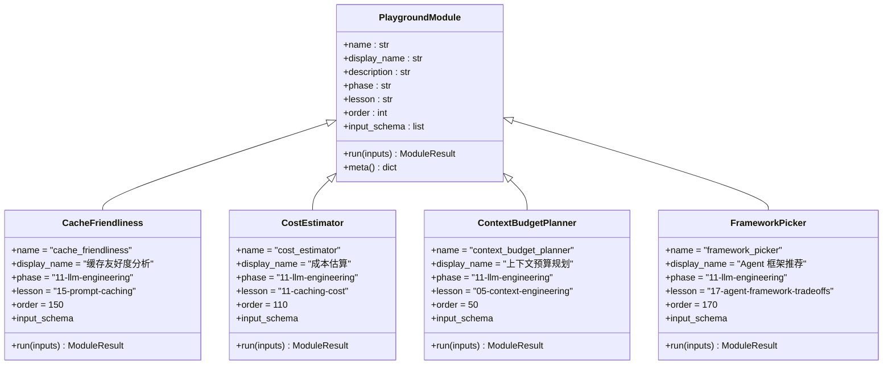
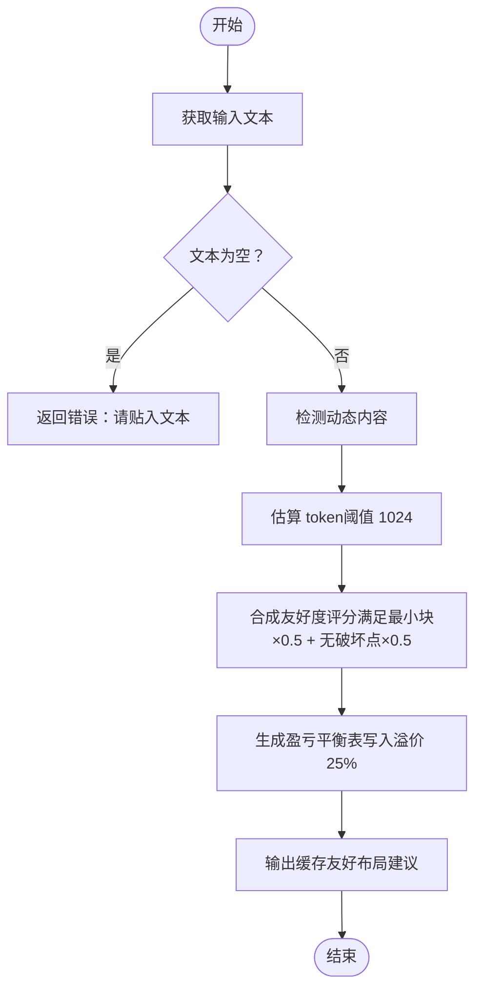
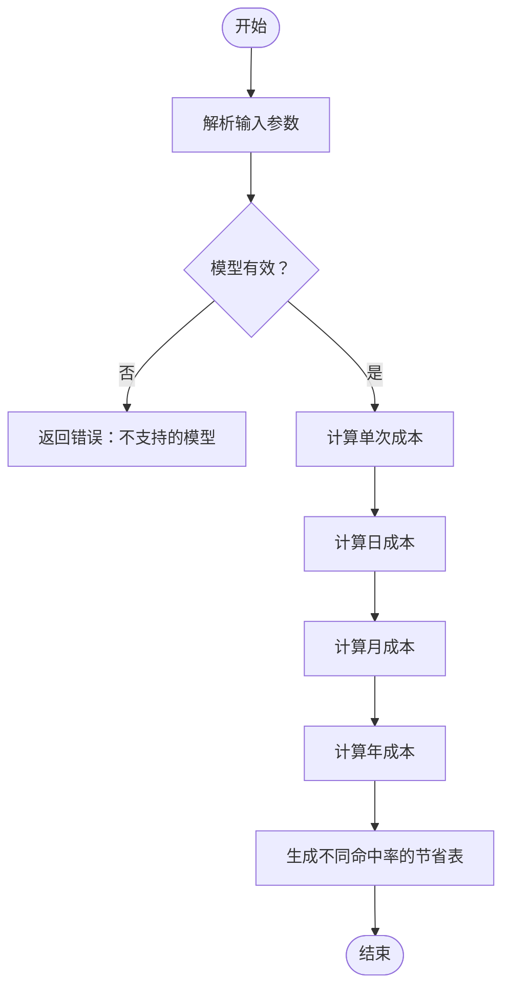
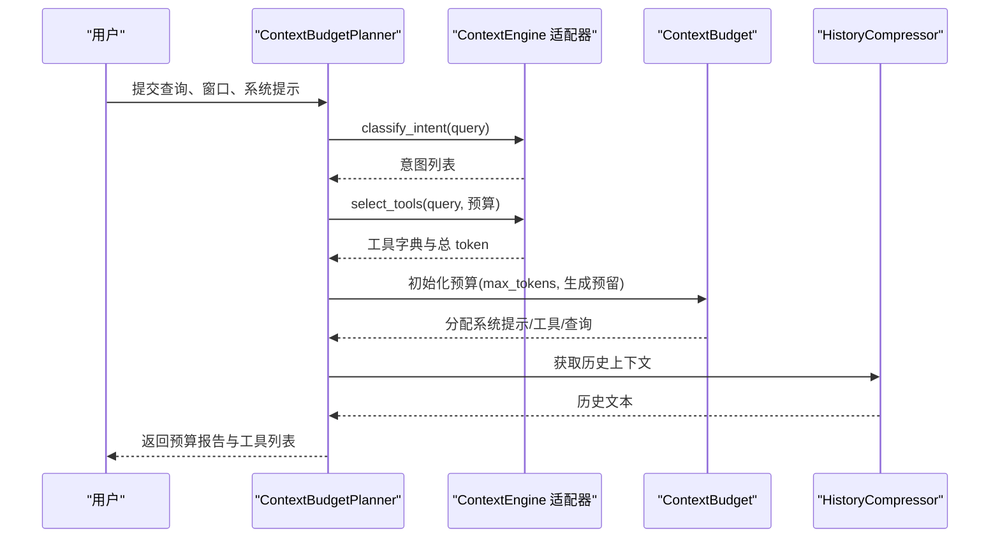
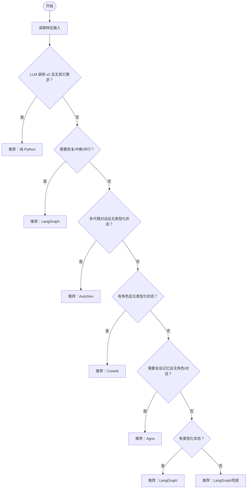
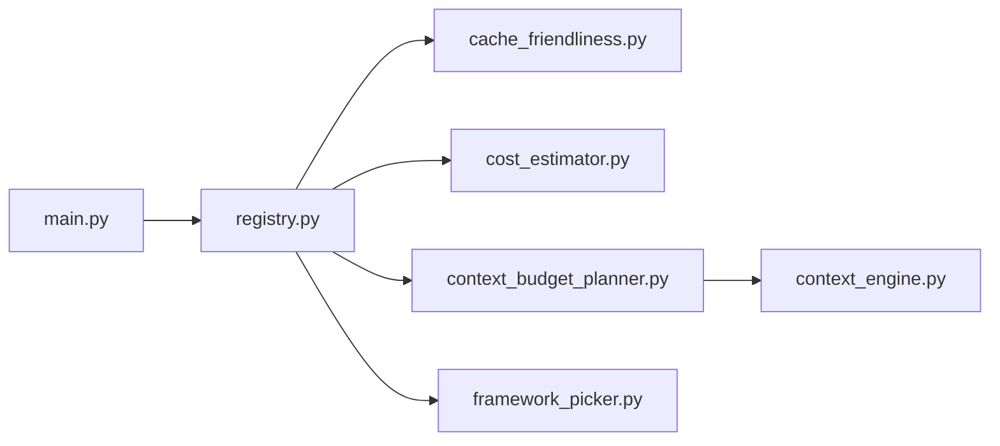

# 核心功能模块

<cite>
**本文引用的文件**
- [cache_friendliness.py](file://guardrails-sandbox/backend/playground/modules/cache_friendliness.py)
- [cost_estimator.py](file://guardrails-sandbox/backend/playground/modules/cost_estimator.py)
- [context_budget_planner.py](file://guardrails-sandbox/backend/playground/modules/context_budget_planner.py)
- [framework_picker.py](file://guardrails-sandbox/backend/playground/modules/framework_picker.py)
- [context_engine.py](file://guardrails-sandbox/backend/adapters/context_engine.py)
- [base.py](file://guardrails-sandbox/backend/playground/base.py)
- [registry.py](file://guardrails-sandbox/backend/playground/registry.py)
- [main.py](file://guardrails-sandbox/backend/main.py)
- [caching_cost.py](file://phases/11-llm-engineering/11-caching-cost/code/caching_cost.py)
</cite>

## 目录
1. [简介](#简介)
2. [项目结构](#项目结构)
3. [核心组件](#核心组件)
4. [架构总览](#架构总览)
5. [详细组件分析](#详细组件分析)
6. [依赖关系分析](#依赖关系分析)
7. [性能考量](#性能考量)
8. [故障排查指南](#故障排查指南)
9. [结论](#结论)
10. [附录](#附录)

## 简介
本文件聚焦于“核心功能模块”的设计与使用，覆盖以下四个关键模块：
- 缓存友好性评估（cache_friendliness）：检测系统提示/前缀中破坏前缀缓存的动态内容，估算最小可缓存块，给出盈亏平衡与布局建议。
- 成本估算（cost_estimator）：基于模型定价与请求规模，计算月度/年度成本，并对比不同缓存命中率的节省。
- 上下文预算规划（context_budget_planner）：输入查询与上下文窗口，输出意图分类、动态工具选择与预算分配明细，复用上下文引擎适配器逻辑。
- 框架选择器（framework_picker）：基于问题形状的决策树，本地推荐 LangGraph/CrewAI/AutoGen/Agno/纯 Python。

每个模块均提供配置参数、性能指标与使用示例，帮助读者快速落地实践。

## 项目结构
四个核心模块位于 Playground 实验台中，统一通过注册表进行管理，并由后端主程序暴露为 API 接口，供前端可视化渲染与交互。

**图表来源**
- [registry.py:1-118](file://guardrails-sandbox/backend/playground/registry.py#L1-L118)
- [base.py:1-129](file://guardrails-sandbox/backend/playground/base.py#L1-L129)
- [cache_friendliness.py:1-123](file://guardrails-sandbox/backend/playground/modules/cache_friendliness.py#L1-L123)
- [cost_estimator.py:1-86](file://guardrails-sandbox/backend/playground/modules/cost_estimator.py#L1-L86)
- [context_budget_planner.py:1-96](file://guardrails-sandbox/backend/playground/modules/context_budget_planner.py#L1-L96)
- [framework_picker.py:1-153](file://guardrails-sandbox/backend/playground/modules/framework_picker.py#L1-L153)
- [context_engine.py:1-251](file://guardrails-sandbox/backend/adapters/context_engine.py#L1-L251)
- [main.py:359-421](file://guardrails-sandbox/backend/main.py#L359-L421)

**章节来源**
- [registry.py:1-118](file://guardrails-sandbox/backend/playground/registry.py#L1-L118)
- [main.py:359-421](file://guardrails-sandbox/backend/main.py#L359-L421)

## 核心组件
- 缓存友好性评估（CacheFriendliness）
  - 输入：系统提示/前缀文本
  - 输出：缓存友好度评分、破坏点检测、最小块估算、盈亏平衡表、布局建议
  - 关键特性：本地运行、不调用 LLM；基于正则检测动态内容；token 估算与阈值判定；评分合成
- 成本估算（CostEstimator）
  - 输入：模型、输入/输出 token、每日请求数、每月天数
  - 输出：单次/日/月/年成本，不同缓存命中率下的节省对比
  - 关键特性：内置模型定价表；按百万级换算；表格化展示节省
- 上下文预算规划（ContextBudgetPlanner）
  - 输入：用户查询、上下文窗口、系统提示
  - 输出：意图分类、动态工具选择、预算分配明细、利用率
  - 关键特性：复用上下文引擎适配器；动态预算分配；历史压缩器统计
- 框架选择器（FrameworkPicker）
  - 输入：问题形状特征（类型化状态、角色、对话、并行扇出、恢复、人工中断、会话记忆、LLM 调用次数）
  - 输出：推荐框架与理由，框架速查与决策要点
  - 关键特性：本地决策树；多框架速查；特征可视化

**章节来源**
- [cache_friendliness.py:55-123](file://guardrails-sandbox/backend/playground/modules/cache_friendliness.py#L55-L123)
- [cost_estimator.py:21-86](file://guardrails-sandbox/backend/playground/modules/cost_estimator.py#L21-L86)
- [context_budget_planner.py:22-96](file://guardrails-sandbox/backend/playground/modules/context_budget_planner.py#L22-L96)
- [framework_picker.py:73-153](file://guardrails-sandbox/backend/playground/modules/framework_picker.py#L73-L153)

## 架构总览
四个模块均继承自 PlaygroundModule，遵循统一的输入/输出规范，通过注册表集中管理，并由后端主程序提供 API 接口。

**图表来源**
- [base.py:101-129](file://guardrails-sandbox/backend/playground/base.py#L101-L129)
- [cache_friendliness.py:55-123](file://guardrails-sandbox/backend/playground/modules/cache_friendliness.py#L55-L123)
- [cost_estimator.py:21-86](file://guardrails-sandbox/backend/playground/modules/cost_estimator.py#L21-L86)
- [context_budget_planner.py:22-96](file://guardrails-sandbox/backend/playground/modules/context_budget_planner.py#L22-L96)
- [framework_picker.py:73-153](file://guardrails-sandbox/backend/playground/modules/framework_picker.py#L73-L153)

## 详细组件分析

### 缓存友好性评估（CacheFriendliness）
- 算法原理
  - 动态内容检测：通过正则表达式识别时间戳、会话 ID、随机值等破坏前缀缓存的特征。
  - 最小块估算：按字符长度粗略估算 token 数，阈值为 1024。
  - 友好度评分：满足最小块权重 0.5 + 无破坏点权重 0.5，上限 1.0。
  - 盈亏平衡：在写入溢价（示例 25%）下，计算不同复用次数下的平均成本倍数与节省百分比。
- 使用方法
  - 输入：系统提示/前缀文本
  - 输出：评分、破坏点列表、估算 token、满足最小块、盈亏平衡表、布局建议
- 性能指标
  - 本地执行，无 LLM 调用，延迟主要取决于文本长度与正则匹配
- 配置参数
  - 文本输入（textarea）
- 使用示例
  - 将一段角色设定与工具定义粘贴至输入框，点击运行，查看缓存友好度与建议

**图表来源**
- [cache_friendliness.py:68-123](file://guardrails-sandbox/backend/playground/modules/cache_friendliness.py#L68-L123)

**章节来源**
- [cache_friendliness.py:18-53](file://guardrails-sandbox/backend/playground/modules/cache_friendliness.py#L18-L53)
- [cache_friendliness.py:68-123](file://guardrails-sandbox/backend/playground/modules/cache_friendliness.py#L68-L123)

### 成本估算（CostEstimator）
- 定价模型与计算逻辑
  - 模型定价：内置多模型输入/输出单价（美元/百万 token）。
  - 单次成本：(输入 token/百万 × 输入单价) + (输出 token/百万 × 输出单价)。
  - 日/月/年成本：日成本 × 日数；月成本 × 12。
  - 缓存节省：按不同命中率（0%/20%/40%/60%/80%）计算实际月成本与节省金额。
- 使用方法
  - 输入：模型、输入 token/次、输出 token/次、每日请求数、每月天数
  - 输出：成本汇总与缓存节省对比表
- 性能指标
  - 本地纯数值计算，延迟极低
- 配置参数
  - 模型（下拉）、输入 token/次（数字）、输出 token/次（数字）、每日请求数（数字）、每月天数（数字）
- 使用示例
  - 选择模型与输入输出 token，调整请求频率与天数，查看月度/年度成本与不同命中率节省

**图表来源**
- [cost_estimator.py:38-86](file://guardrails-sandbox/backend/playground/modules/cost_estimator.py#L38-L86)

**章节来源**
- [cost_estimator.py:13-18](file://guardrails-sandbox/backend/playground/modules/cost_estimator.py#L13-L18)
- [cost_estimator.py:38-86](file://guardrails-sandbox/backend/playground/modules/cost_estimator.py#L38-L86)

### 上下文预算规划（ContextBudgetPlanner）
- 内存管理与优化技术
  - 意图分类：基于关键词统计，确定查询意图集合。
  - 动态工具选择：按预算限制（最大 2000 token）选择工具，避免超限。
  - 预算分配：ContextBudget 管理全局可用 token，按组件分配并报告利用率。
  - 历史压缩：HistoryCompressor 在超限时自动总结旧轮次对话，降低上下文占用。
- 使用方法
  - 输入：用户查询、上下文窗口、系统提示
  - 输出：意图、选中工具、预算分配明细、利用率
- 性能指标
  - 本地执行，延迟主要受 token 计算与预算分配影响
- 配置参数
  - 用户查询（textarea）、上下文窗口（数字）、系统提示（textarea）
- 使用示例
  - 输入查询与窗口大小，查看意图与工具选择，核对预算分配与剩余空间

**图表来源**
- [context_budget_planner.py:40-96](file://guardrails-sandbox/backend/playground/modules/context_budget_planner.py#L40-L96)
- [context_engine.py:47-129](file://guardrails-sandbox/backend/adapters/context_engine.py#L47-L129)

**章节来源**
- [context_budget_planner.py:30-96](file://guardrails-sandbox/backend/playground/modules/context_budget_planner.py#L30-L96)
- [context_engine.py:80-172](file://guardrails-sandbox/backend/adapters/context_engine.py#L80-L172)

### 框架选择器（FrameworkPicker）
- 兼容性检测与推荐机制
  - 特征提取：将用户勾选项映射为布尔特征（类型化状态、角色、对话、并行扇出、恢复、人工中断、会话记忆、LLM 调用次数）。
  - 决策树：依据特征组合，优先考虑状态/中断/并行等需求，其次考虑对话/角色/会话记忆等形状，最后兜底推荐 LangGraph。
  - 结果呈现：返回推荐框架、理由与框架速查表。
- 使用方法
  - 勾选问题形状特征，点击运行，查看推荐与理由
- 性能指标
  - 本地纯逻辑判断，延迟极低
- 配置参数
  - LLM 调用数（数字）、类型化状态（是/否）、崩溃恢复（是/否）、人工中断（是/否）、并行扇出（是/否）、专家角色（是/否）、多代理对话（是/否）、会话记忆（是/否）
- 使用示例
  - 针对多步工作流且需恢复/中断/并行的场景，推荐 LangGraph；针对角色驱动流水线，推荐 CrewAI

**图表来源**
- [framework_picker.py:102-153](file://guardrails-sandbox/backend/playground/modules/framework_picker.py#L102-L153)

**章节来源**
- [framework_picker.py:28-71](file://guardrails-sandbox/backend/playground/modules/framework_picker.py#L28-L71)
- [framework_picker.py:102-153](file://guardrails-sandbox/backend/playground/modules/framework_picker.py#L102-L153)

## 依赖关系分析
- 模块依赖
  - ContextBudgetPlanner 复用上下文引擎适配器（intent 分类、工具选择、预算分配、历史压缩）。
  - 四个模块均继承自 PlaygroundModule，统一输入/输出格式。
- 外部接口
  - 后端主程序提供 /api/playground/modules 与 /api/playground/run 接口，前端通过注册表获取模块清单并执行。

**图表来源**
- [registry.py:87-118](file://guardrails-sandbox/backend/playground/registry.py#L87-L118)
- [context_budget_planner.py:17-19](file://guardrails-sandbox/backend/playground/modules/context_budget_planner.py#L17-L19)
- [main.py:368-378](file://guardrails-sandbox/backend/main.py#L368-L378)

**章节来源**
- [registry.py:87-118](file://guardrails-sandbox/backend/playground/registry.py#L87-L118)
- [main.py:368-378](file://guardrails-sandbox/backend/main.py#L368-L378)

## 性能考量
- 缓存友好性评估
  - 正则匹配复杂度与文本长度线性相关；建议控制输入文本长度，减少正则数量。
  - token 估算为近似值，实际部署中可结合具体 tokenizer 得到更精确估算。
- 成本估算
  - 仅数值计算，性能开销可忽略；建议批量计算时合并请求以减少网络往返。
- 上下文预算规划
  - token 计算与预算分配为 O(n)；历史压缩在超限时触发，避免频繁压缩。
  - 工具选择按预算上限剪枝，建议合理设置预算上限以提升响应速度。
- 框架选择器
  - 决策树为常数时间复杂度，性能优异；建议前端收集特征时做输入校验。

## 故障排查指南
- 输入验证
  - 模型选择：若不在支持列表内，返回错误提示（支持模型列表可在模块中查看）。
  - 数值类型：token 与请求数必须为整数，非整数将导致错误。
  - 查询为空：上下文预算规划与缓存友好性评估均要求非空输入。
- 输出解读
  - 缓存友好度：若存在破坏点或未达到最小块，模块会明确提示原因与建议。
  - 预算分配：若工具选择导致超限，模块会自动裁剪工具以满足预算。
  - 框架推荐：若特征冲突，模块按优先级规则给出推荐，必要时可调整特征以获得更优结果。

**章节来源**
- [cost_estimator.py:40-54](file://guardrails-sandbox/backend/playground/modules/cost_estimator.py#L40-L54)
- [context_budget_planner.py:42-44](file://guardrails-sandbox/backend/playground/modules/context_budget_planner.py#L42-L44)
- [cache_friendliness.py:71-73](file://guardrails-sandbox/backend/playground/modules/cache_friendliness.py#L71-L73)

## 结论
四个核心功能模块围绕“缓存友好性”“成本控制”“上下文预算”“框架选择”四大主题，提供了本地化、可解释、可量化的工程实践工具。通过统一的 Playground 模块抽象与注册表管理，用户可以快速组合使用这些模块，形成面向生产的 LLM 工程能力闭环。

## 附录
- 与课程配套的成本计算参考
  - 课程代码中提供了更详细的定价模型与缓存节省计算，可作为扩展阅读与实践参考。

**章节来源**
- [caching_cost.py:25-44](file://phases/11-llm-engineering/11-caching-cost/code/caching_cost.py#L25-L44)