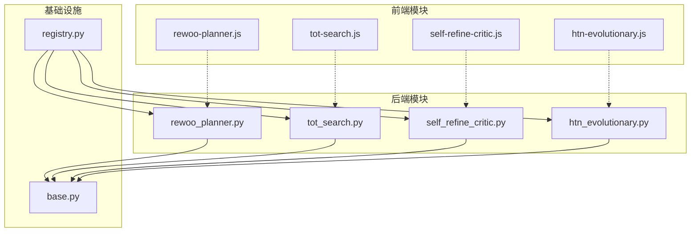
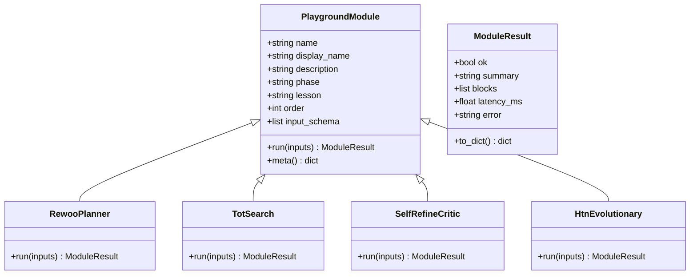
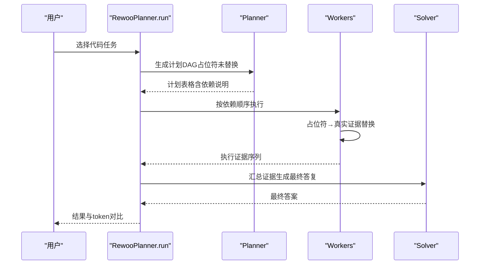
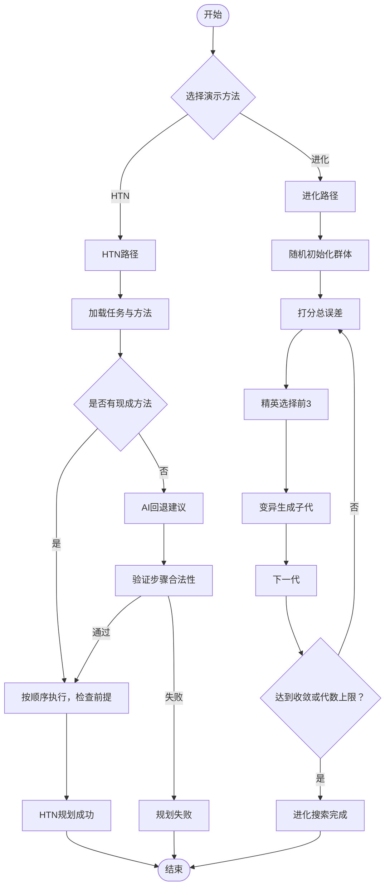
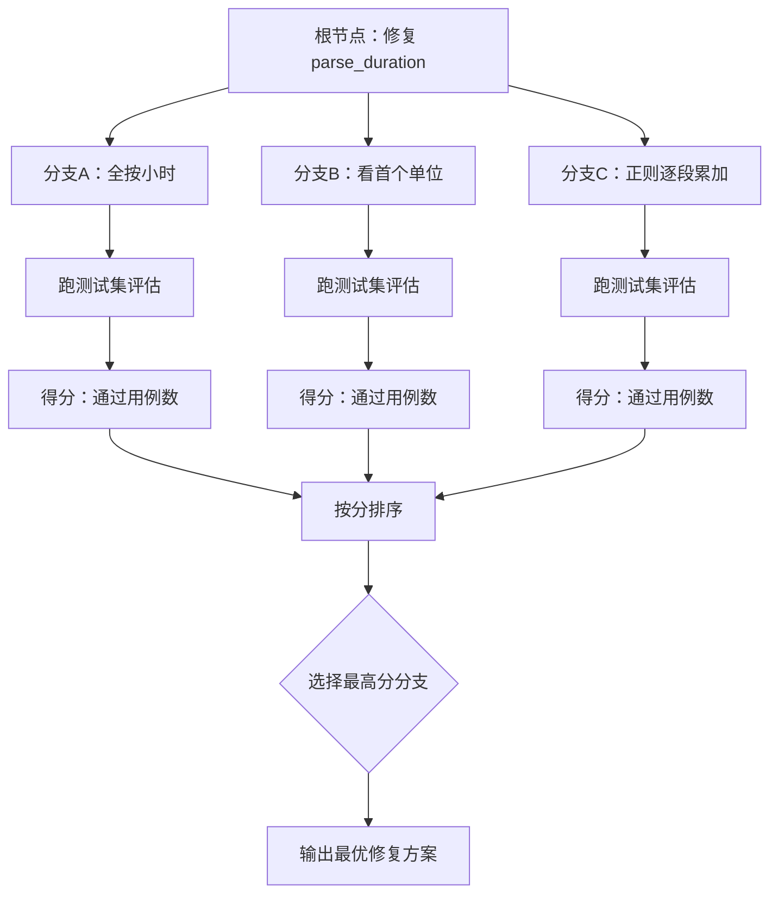
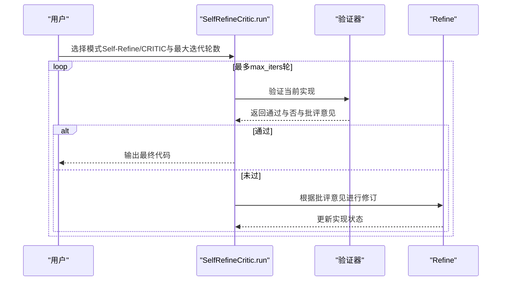
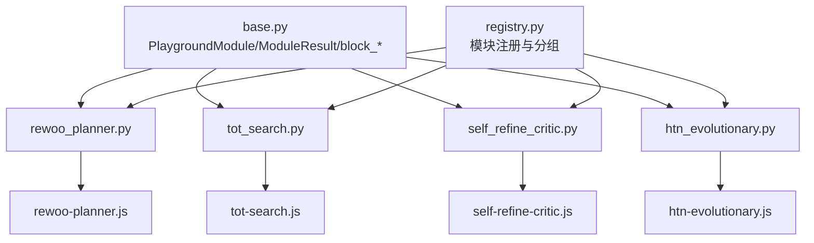

# 规划执行模块

<cite>
**本文档引用的文件**
- [rewoo_planner.py](file://guardrails-sandbox/backend/playground/modules/rewoo_planner.py)
- [rewoo-planner.js](file://site/vue-app/summary/src/data/modules/rewoo-planner.js)
- [tot_search.py](file://guardrails-sandbox/backend/playground/modules/tot_search.py)
- [tot-search.js](file://site/vue-app/summary/src/data/modules/tot-search.js)
- [self_refine_critic.py](file://guardrails-sandbox/backend/playground/modules/self_refine_critic.py)
- [self-refine-critic.js](file://site/vue-app/summary/src/data/modules/self-refine-critic.js)
- [htn_evolutionary.py](file://guardrails-sandbox/backend/playground/modules/htn_evolutionary.py)
- [htn-evolutionary.js](file://site/vue-app/summary/src/data/modules/htn-evolutionary.js)
- [registry.py](file://guardrails-sandbox/backend/playground/registry.py)
- [base.py](file://guardrails-sandbox/backend/playground/base.py)
</cite>

## 目录
1. [简介](#简介)
2. [项目结构](#项目结构)
3. [核心组件](#核心组件)
4. [架构概览](#架构概览)
5. [详细组件分析](#详细组件分析)
6. [依赖分析](#依赖分析)
7. [性能考虑](#性能考虑)
8. [故障排除指南](#故障排除指南)
9. [结论](#结论)
10. [附录](#附录)

## 简介
本文件系统性梳理并深入解析AI工程从零开始项目中的规划执行模块，重点覆盖以下四个核心组件：
- ReWOO计划执行（rewoo_planner）：层次化规划策略与执行监控机制
- HTN进化搜索（htn_evolutionary）：基于前提-效果的分层任务网络与AlphaEvolve式进化算法
- 思维树搜索（tot_search）：分支限界法与启发式评估
- 自我完善批评（self_refine_critic）：质量评估与迭代改进流程

文档旨在帮助读者理解各模块的设计思想、实现细节、数据流与控制流，并提供算法选择指南、参数调优建议以及性能基准测试方法。

## 项目结构
规划执行模块位于guardrails-sandbox/backend/playground/modules目录下，采用前后端分离的演示框架：
- 后端Python模块：提供完整的算法实现与结果渲染
- 前端JavaScript模块：提供等价的纯前端演示，便于离线体验
- 注册中心：统一管理模块注册、分组与执行入口
- 基础抽象：定义PlaygroundModule基类与渲染块规范

**图表来源**
- [registry.py:27-36](file://guardrails-sandbox/backend/playground/registry.py#L27-L36)
- [base.py:101-129](file://guardrails-sandbox/backend/playground/base.py#L101-L129)

**章节来源**
- [registry.py:1-118](file://guardrails-sandbox/backend/playground/registry.py#L1-L118)
- [base.py:1-129](file://guardrails-sandbox/backend/playground/base.py#L1-L129)

## 核心组件
本节概述四个规划执行模块的核心职责与设计特点：

- ReWOO计划执行（rewoo_planner）
  - 将"思考"与"执行"解耦：先规划后执行，避免历史信息回灌prompt
  - 支持一次性规划整张DAG，按依赖顺序执行，证据引用占位符替换
  - 提供与ReAct的token用量对比，突出其在长流程中的成本优势

- HTN进化搜索（htn_evolutionary）
  - HTN分支：操作符带前提-效果，按顺序执行，跳步/乱序被拦截
  - 进化搜索：群体随机初始化→打分→精英保留→变异→下一代，自动逼近最优
  - 两者均将LLM作为"放大器"而非主力，强调确定性与可重复性

- 思维树搜索（tot_search）
  - 对比CoT与ToT：CoT一条路走到黑，ToT多分支并行探索
  - 价值函数=单元测试打分，回溯剪枝选择最优
  - 展示分支探索的成本与收益权衡

- 自我完善批评（self_refine_critic）
  - Self-Refine：模型自我批评，易忽略崩溃型幻觉
  - CRITIC：外部验证器（测试+linter）落地真实信号，捕获模型未察觉的错误
  - 循环式迭代改进，支持最大迭代轮数配置

**章节来源**
- [rewoo_planner.py:1-179](file://guardrails-sandbox/backend/playground/modules/rewoo_planner.py#L1-L179)
- [htn_evolutionary.py:1-192](file://guardrails-sandbox/backend/playground/modules/htn_evolutionary.py#L1-L192)
- [tot_search.py:1-120](file://guardrails-sandbox/backend/playground/modules/tot_search.py#L1-L120)
- [self_refine_critic.py:1-127](file://guardrails-sandbox/backend/playground/modules/self_refine_critic.py#L1-L127)

## 架构概览
四个模块共享统一的PlaygroundModule抽象与渲染块体系，通过Registry集中注册与分组展示，形成清晰的"算法-演示"闭环。

**图表来源**
- [base.py:101-129](file://guardrails-sandbox/backend/playground/base.py#L101-L129)
- [rewoo_planner.py:82-179](file://guardrails-sandbox/backend/playground/modules/rewoo_planner.py#L82-L179)
- [tot_search.py:56-120](file://guardrails-sandbox/backend/playground/modules/tot_search.py#L56-L120)
- [self_refine_critic.py:49-127](file://guardrails-sandbox/backend/playground/modules/self_refine_critic.py#L49-L127)
- [htn_evolutionary.py:150-192](file://guardrails-sandbox/backend/playground/modules/htn_evolutionary.py#L150-L192)

## 详细组件分析

### ReWOO计划执行（rewoo_planner）
ReWOO将规划与执行分离，先生成完整DAG，再按依赖顺序执行，证据引用占位符在执行前替换为真实证据。该策略显著降低token消耗，尤其在长流程中优势明显。

**图表来源**
- [rewoo_planner.py:97-179](file://guardrails-sandbox/backend/playground/modules/rewoo_planner.py#L97-L179)

实现要点：
- 证据引用占位符：#E1、#E2等，执行前替换为实际证据
- 规划阶段不看观察，可使用小模型进行规划，大模型执行
- token对比：ReWOO仅在规划、执行、求解阶段分别计算，避免历史重复

**章节来源**
- [rewoo_planner.py:1-179](file://guardrails-sandbox/backend/playground/modules/rewoo_planner.py#L1-L179)
- [rewoo-planner.js:1-166](file://site/vue-app/summary/src/data/modules/rewoo-planner.js#L1-L166)

### HTN进化搜索（htn_evolutionary）
该模块同时演示HTN与进化搜索两种重型规划法：
- HTN：操作符带前提-效果，按顺序执行，跳步/乱序被拦截，确保正确性
- 进化搜索：群体随机初始化→打分→精英保留→变异→下一代，自动逼近最优

**图表来源**
- [htn_evolutionary.py:38-192](file://guardrails-sandbox/backend/playground/modules/htn_evolutionary.py#L38-L192)

实现要点：
- HTN操作符：每个最小动作声明前提与效果，形成"骨牌链"
- AI回退：无现成方法时询问AI，建议需通过验证才采纳
- 进化搜索：打分函数为a*x+b与目标3x+7的总误差，越小越好

**章节来源**
- [htn_evolutionary.py:1-192](file://guardrails-sandbox/backend/playground/modules/htn_evolutionary.py#L1-L192)
- [htn-evolutionary.js:1-274](file://site/vue-app/summary/src/data/modules/htn-evolutionary.js#L1-L274)

### 思维树搜索（tot_search）
ToT通过多分支并行探索，每个分支跑单元测试作为价值函数，按分回溯剪枝选择最优；CoT则一条路走到黑，第一步错误会导致全局失败。

**图表来源**
- [tot_search.py:70-120](file://guardrails-sandbox/backend/playground/modules/tot_search.py#L70-L120)

实现要点：
- 价值函数：单元测试通过数量，客观可靠
- 成本权衡：探索N个分支=N倍token，需谨慎使用
- 适用场景：代码助手天然具备测试作为价值函数的优势

**章节来源**
- [tot_search.py:1-120](file://guardrails-sandbox/backend/playground/modules/tot_search.py#L1-L120)
- [tot-search.js:1-132](file://site/vue-app/summary/src/data/modules/tot-search.js#L1-L132)

### 自我完善批评（self_refine_critic）
Self-Refine与CRITIC对比展示了"自我批评"与"外部验证"在质量评估上的差异：前者易忽略崩溃型幻觉，后者通过真实测试信号捕获模型未察觉的错误。

**图表来源**
- [self_refine_critic.py:64-127](file://guardrails-sandbox/backend/playground/modules/self_refine_critic.py#L64-L127)

实现要点：
- Self-Refine：模型自我批评，主要挑表面风格问题
- CRITIC：外部验证器（测试+lint），能捕获崩溃型bug
- 迭代预算：1-5轮，每轮增加延迟与token消耗

**章节来源**
- [self_refine_critic.py:1-127](file://guardrails-sandbox/backend/playground/modules/self_refine_critic.py#L1-L127)
- [self-refine-critic.js:1-127](file://site/vue-app/summary/src/data/modules/self-refine-critic.js#L1-L127)

## 依赖分析
四个模块均继承PlaygroundModule基类，遵循统一的输入schema与渲染块协议，通过Registry集中注册与分组展示。

**图表来源**
- [base.py:101-129](file://guardrails-sandbox/backend/playground/base.py#L101-L129)
- [registry.py:27-36](file://guardrails-sandbox/backend/playground/registry.py#L27-L36)

**章节来源**
- [registry.py:1-118](file://guardrails-sandbox/backend/playground/registry.py#L1-L118)
- [base.py:1-129](file://guardrails-sandbox/backend/playground/base.py#L1-L129)

## 性能考虑
- ReWOO规划执行
  - token节省：避免历史重复回灌，长流程中优势明显
  - 规模效应：步骤越多，ReWOO相对ReAct的token节省越显著
  - 延迟：主要来自规划与求解阶段，执行阶段仅需替换占位符

- HTN进化搜索
  - HTN：执行时间取决于任务复杂度与前提检查次数
  - 进化搜索：受代数上限与群体规模影响，收敛速度与精度权衡
  - LLM调用：HTN在AI回退时产生额外调用，但可通过缓存减少重复

- 思维树搜索
  - 分支成本：N个分支=O(N)倍token与计算量
  - 适用性：代码助手场景下，单元测试作为价值函数成本低且可靠
  - 控制开关：建议仅在难题场景启用ToT，简单任务使用ReAct

- 自我完善批评
  - 迭代预算：1-5轮，每轮增加延迟与token
  - 验证器成本：外部验证器（测试+lint）带来额外计算开销
  - 优先级：CRITIC在捕获崩溃型bug方面更有效，但成本更高

[本节为通用性能讨论，无需特定文件来源]

## 故障排除指南
- ReWOO规划执行
  - 证据引用缺失：检查占位符是否在证据字典中存在
  - 规划失败：确认计划步骤是否符合工具调用规范
  - token对比异常：核对请求长度与各阶段字符串拼接逻辑

- HTN进化搜索
  - AI回退失败：确认AI建议中的步骤是否存在于操作符集合
  - 提前终止：检查前提条件是否满足，跳步将导致执行中断
  - 进化停滞：调整代数上限与变异强度，确保种群多样性

- 思维树搜索
  - 分数异常：检查测试用例与期望输出，确保评估函数正确
  - 分支剪枝：确认排序与选择逻辑，避免错误分支被剪除
  - 性能瓶颈：控制分支数量，避免过度探索

- 自我完善批评
  - 自我批评盲区：模型可能忽略崩溃型bug，应切换至CRITIC
  - 迭代超限：适当增加最大迭代轮数，或优化验证器效率
  - 验证器误报：检查测试用例与lint规则，确保评估标准合理

**章节来源**
- [rewoo_planner.py:75-179](file://guardrails-sandbox/backend/playground/modules/rewoo_planner.py#L75-L179)
- [htn_evolutionary.py:38-192](file://guardrails-sandbox/backend/playground/modules/htn_evolutionary.py#L38-L192)
- [tot_search.py:70-120](file://guardrails-sandbox/backend/playground/modules/tot_search.py#L70-L120)
- [self_refine_critic.py:64-127](file://guardrails-sandbox/backend/playground/modules/self_refine_critic.py#L64-L127)

## 结论
规划执行模块通过四个独立而互补的算法演示，展现了从"先规划后执行"到"多分支搜索"再到"外部验证改进"的完整质量闭环。ReWOO强调token效率与执行稳定性；HTN确保正确性；ToT提供探索能力；CRITIC强化质量保障。实践中应根据任务特性与资源约束选择合适策略，并通过参数调优与性能基准测试持续优化。

[本节为总结性内容，无需特定文件来源]

## 附录

### 算法选择指南
- 任务正确性优先：优先选择HTN，确保每步前提满足
- 优化问题求最优：选择进化搜索，要求可自动打分
- 探索性强的修复：选择ToT，利用单元测试作为价值函数
- 质量保障与改进：选择CRITIC，外部验证器捕获模型未察觉的错误
- 通用场景：ReAct适合简单任务，ReWOO适合长流程

### 参数调优建议
- ReWOO
  - 规划器与执行器模型规模：规划器可用小模型，执行器用大模型
  - token预算：控制计划步数与描述长度
- HTN
  - AI回退阈值：设置合理的AI调用上限与缓存策略
  - 方法库维护：持续积累可复用的方法模板
- ToT
  - 分支数量：平衡探索广度与成本
  - 评估频率：定期更新测试用例
- CRITIC
  - 迭代轮数：1-5轮之间权衡质量与成本
  - 验证器规则：确保测试与lint规则覆盖关键场景

### 性能基准测试方法
- ReWOO
  - 对比ReAct与ReWOO的token用量，记录不同步骤数下的节省比例
  - 测试执行延迟与吞吐量，评估规划与执行阶段的性能
- HTN
  - 统计AI回退次数与缓存命中率，评估在线学习效果
  - 测量不同任务复杂度下的执行时间与成功率
- ToT
  - 记录分支数量与探索深度，评估成本-收益比
  - 对比不同策略在相同任务上的通过率与用时
- CRITIC
  - 统计迭代轮数分布与平均通过轮数
  - 对比Self-Refine与CRITIC在捕获崩溃型bug方面的差异

[本节为通用指导，无需特定文件来源]