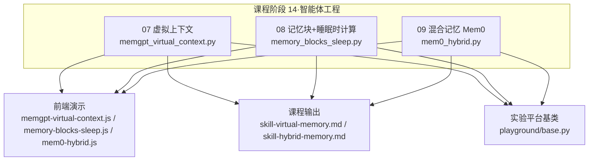
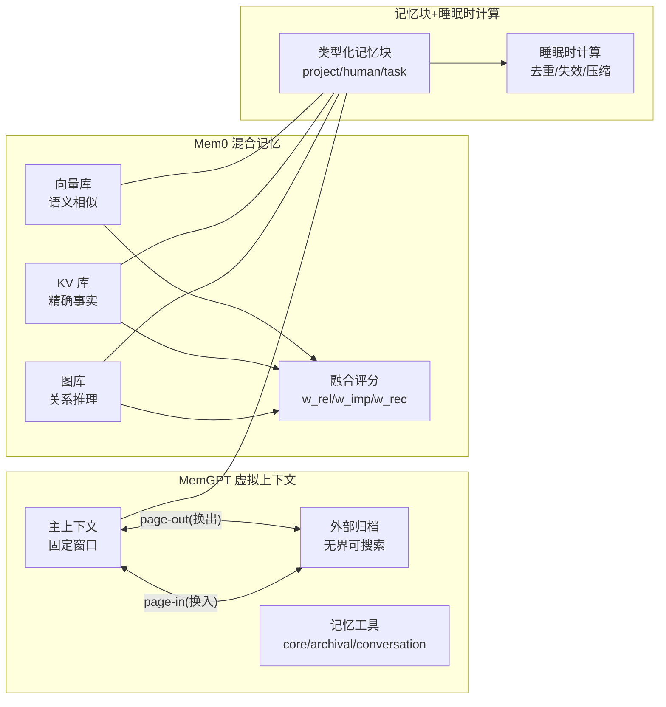
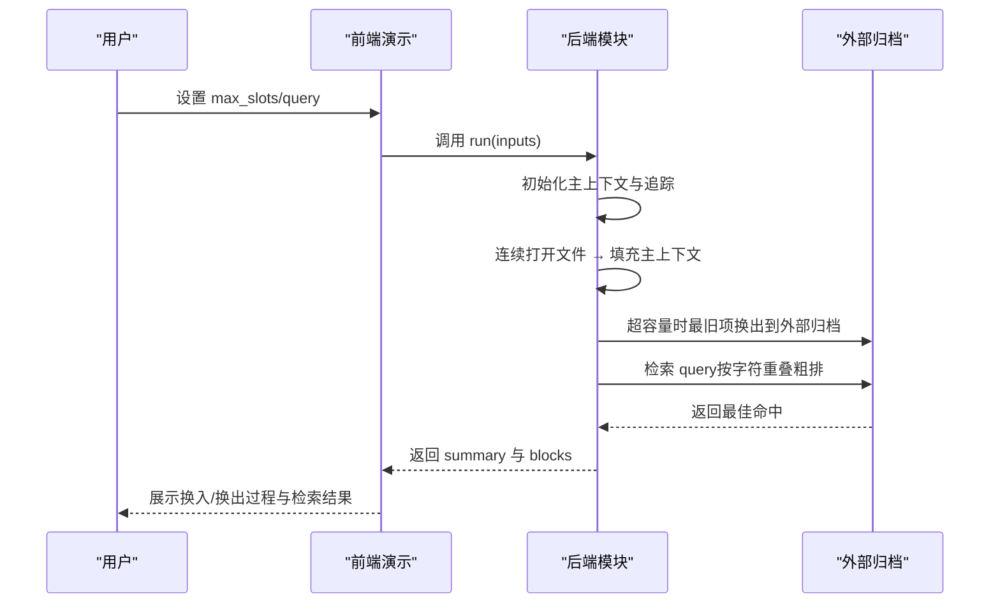
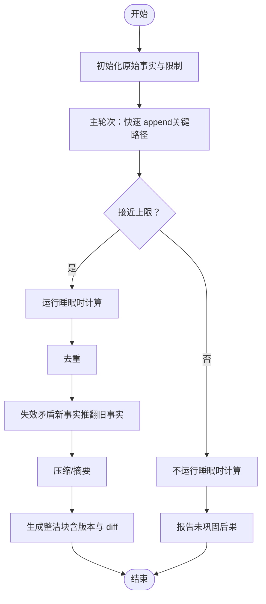
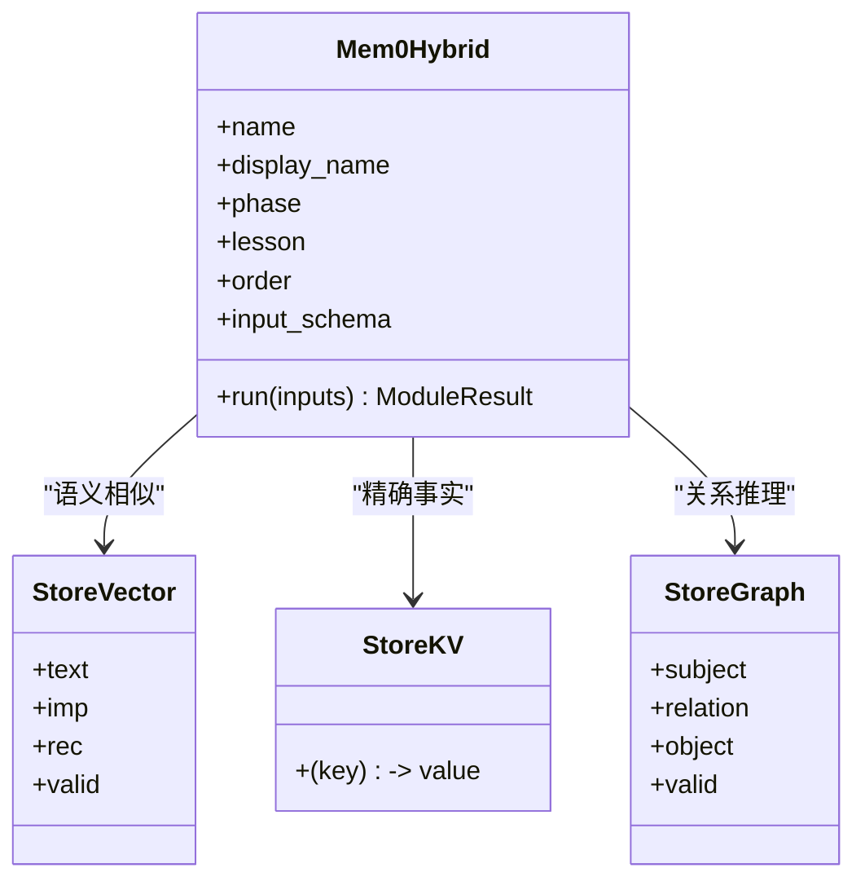
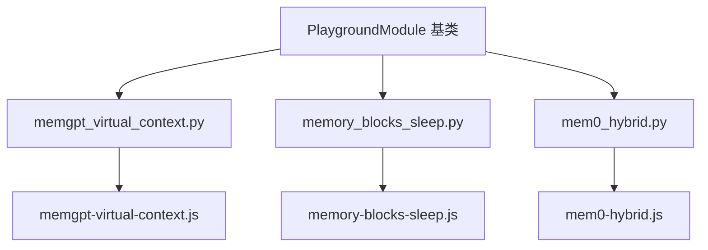

# 记忆系统模块

<cite>
**本文档引用的文件**
- [guardrails-sandbox/backend/playground/modules/mem0_hybrid.py](file://guardrails-sandbox/backend/playground/modules/mem0_hybrid.py)
- [site/vue-app/summary/src/data/modules/mem0-hybrid.js](file://site/vue-app/summary/src/data/modules/mem0-hybrid.js)
- [phases/14-agent-engineering/09-hybrid-memory-mem0/outputs/skill-hybrid-memory.md](file://phases/14-agent-engineering/09-hybrid-memory-mem0/outputs/skill-hybrid-memory.md)
- [guardrails-sandbox/backend/playground/modules/memgpt_virtual_context.py](file://guardrails-sandbox/backend/playground/modules/memgpt_virtual_context.py)
- [site/vue-app/summary/src/data/modules/memgpt-virtual-context.js](file://site/vue-app/summary/src/data/modules/memgpt-virtual-context.js)
- [phases/14-agent-engineering/07-memory-virtual-context-memgpt/outputs/skill-virtual-memory.md](file://phases/14-agent-engineering/07-memory-virtual-context-memgpt/outputs/skill-virtual-memory.md)
- [guardrails-sandbox/backend/playground/modules/memory_blocks_sleep.py](file://guardrails-sandbox/backend/playground/modules/memory_blocks_sleep.py)
- [site/vue-app/summary/src/data/modules/memory-blocks-sleep.js](file://site/vue-app/summary/src/data/modules/memory-blocks-sleep.js)
- [guardrails-sandbox/backend/playground/base.py](file://guardrails-sandbox/backend/playground/base.py)
- [site/vue-app/summary/src/data/content.js](file://site/vue-app/summary/src/data/content.js)
</cite>

## 目录
1. [简介](#简介)
2. [项目结构](#项目结构)
3. [核心组件](#核心组件)
4. [架构总览](#架构总览)
5. [详细组件分析](#详细组件分析)
6. [依赖分析](#依赖分析)
7. [性能考虑](#性能考虑)
8. [故障排除指南](#故障排除指南)
9. [结论](#结论)
10. [附录](#附录)

## 简介
本文件面向“记忆系统模块”，围绕两类代表性方案进行系统化解析：
- 混合记忆系统（mem0_hybrid）：向量（语义相似）、KV（精确事实）、图（关系推理）三路存储，融合评分检索，并具备冲突检测与软删除能力，适合“多类查询统一入口”的场景。
- MemGPT 虚拟上下文（memgpt_virtual_context）：主上下文（固定窗口）与外部归档（无界可搜索）的分层结构，通过“换入/换出”（page-in/page-out）管理上下文容量，适合“上下文窗口不足”的场景。

同时，文档补充了“记忆块 + 睡眠时计算”（memory_blocks_sleep）作为长期记忆巩固的配套机制，以及课程目标、配置项、性能调优与故障排除建议，帮助读者在不同业务形态下选择合适方案并正确落地。

## 项目结构
记忆系统模块位于课程“14-智能体工程”下的多个小节中，配套前后端实现与教学输出文档：
- 后端模块：mem0_hybrid.py、memgpt_virtual_context.py、memory_blocks_sleep.py
- 前端演示：mem0-hybrid.js、memgpt-virtual-context.js、memory-blocks-sleep.js
- 课程输出：skill-hybrid-memory.md、skill-virtual-memory.md
- 实验平台基类：playground/base.py
- 教学内容与问答：site/vue-app/summary/src/data/content.js

图表来源
- [guardrails-sandbox/backend/playground/modules/memgpt_virtual_context.py:1-100](file://guardrails-sandbox/backend/playground/modules/memgpt_virtual_context.py#L1-L100)
- [guardrails-sandbox/backend/playground/modules/memory_blocks_sleep.py:1-123](file://guardrails-sandbox/backend/playground/modules/memory_blocks_sleep.py#L1-L123)
- [guardrails-sandbox/backend/playground/modules/mem0_hybrid.py:1-131](file://guardrails-sandbox/backend/playground/modules/mem0_hybrid.py#L1-L131)
- [site/vue-app/summary/src/data/modules/memgpt-virtual-context.js:1-105](file://site/vue-app/summary/src/data/modules/memgpt-virtual-context.js#L1-L105)
- [site/vue-app/summary/src/data/modules/memory-blocks-sleep.js:1-115](file://site/vue-app/summary/src/data/modules/memory-blocks-sleep.js#L1-L115)
- [site/vue-app/summary/src/data/modules/mem0-hybrid.js:1-137](file://site/vue-app/summary/src/data/modules/mem0-hybrid.js#L1-L137)
- [phases/14-agent-engineering/07-memory-virtual-context-memgpt/outputs/skill-virtual-memory.md:1-34](file://phases/14-agent-engineering/07-memory-virtual-context-memgpt/outputs/skill-virtual-memory.md#L1-L34)
- [phases/14-agent-engineering/09-hybrid-memory-mem0/outputs/skill-hybrid-memory.md:1-33](file://phases/14-agent-engineering/09-hybrid-memory-mem0/outputs/skill-hybrid-memory.md#L1-L33)
- [guardrails-sandbox/backend/playground/base.py:1-129](file://guardrails-sandbox/backend/playground/base.py#L1-L129)

章节来源
- [guardrails-sandbox/backend/playground/modules/memgpt_virtual_context.py:1-100](file://guardrails-sandbox/backend/playground/modules/memgpt_virtual_context.py#L1-L100)
- [guardrails-sandbox/backend/playground/modules/memory_blocks_sleep.py:1-123](file://guardrails-sandbox/backend/playground/modules/memory_blocks_sleep.py#L1-L123)
- [guardrails-sandbox/backend/playground/modules/mem0_hybrid.py:1-131](file://guardrails-sandbox/backend/playground/modules/mem0_hybrid.py#L1-L131)
- [site/vue-app/summary/src/data/modules/memgpt-virtual-context.js:1-105](file://site/vue-app/summary/src/data/modules/memgpt-virtual-context.js#L1-L105)
- [site/vue-app/summary/src/data/modules/memory-blocks-sleep.js:1-115](file://site/vue-app/summary/src/data/modules/memory-blocks-sleep.js#L1-L115)
- [site/vue-app/summary/src/data/modules/mem0-hybrid.js:1-137](file://site/vue-app/summary/src/data/modules/mem0-hybrid.js#L1-L137)
- [phases/14-agent-engineering/07-memory-virtual-context-memgpt/outputs/skill-virtual-memory.md:1-34](file://phases/14-agent-engineering/07-memory-virtual-context-memgpt/outputs/skill-virtual-memory.md#L1-L34)
- [phases/14-agent-engineering/09-hybrid-memory-mem0/outputs/skill-hybrid-memory.md:1-33](file://phases/14-agent-engineering/09-hybrid-memory-mem0/outputs/skill-hybrid-memory.md#L1-L33)
- [guardrails-sandbox/backend/playground/base.py:1-129](file://guardrails-sandbox/backend/playground/base.py#L1-L129)

## 核心组件
- MemGPT 虚拟上下文（memgpt_virtual_context）
  - 主上下文（main context）：固定容量的提示词窗口，先进先出（FIFO）淘汰最旧片段。
  - 外部归档（archival store）：无界存储，记录包含来源引用（citation），支持检索与换入。
  - 记忆工具：核心记忆追加/替换、归档插入/检索、对话检索等，供模型在合适时机调用。
  - 换入/换出：当主上下文超容量时，最旧片段被换出到外部归档；当用户提问涉及历史时，检索外部归档并换入主上下文。
- 记忆块 + 睡眠时计算（memory_blocks_sleep）
  - 类型化记忆块：human/project/task 等分类持久片段，支持字符上限与描述。
  - 主轮次快速写入：只负责 append，不做整理，保证低延迟。
  - 睡眠时计算：在空闲时段离线执行去重、失效矛盾、压缩与摘要，避免影响关键路径。
- Mem0 混合记忆（mem0_hybrid）
  - 三路存储：向量（语义相似）、KV（精确事实）、图（关系推理）。
  - 融合评分：score = w_rel·相关性 + w_imp·重要性 + w_rec·时效性。
  - 冲突检测与软删除：偏好改变时，旧边/旧记录标记为无效（valid=False），保留历史可追溯。

章节来源
- [guardrails-sandbox/backend/playground/modules/memgpt_virtual_context.py:1-100](file://guardrails-sandbox/backend/playground/modules/memgpt_virtual_context.py#L1-L100)
- [site/vue-app/summary/src/data/modules/memgpt-virtual-context.js:1-105](file://site/vue-app/summary/src/data/modules/memgpt-virtual-context.js#L1-L105)
- [guardrails-sandbox/backend/playground/modules/memory_blocks_sleep.py:1-123](file://guardrails-sandbox/backend/playground/modules/memory_blocks_sleep.py#L1-L123)
- [site/vue-app/summary/src/data/modules/memory-blocks-sleep.js:1-115](file://site/vue-app/summary/src/data/modules/memory-blocks-sleep.js#L1-L115)
- [guardrails-sandbox/backend/playground/modules/mem0_hybrid.py:1-131](file://guardrails-sandbox/backend/playground/modules/mem0_hybrid.py#L1-L131)
- [site/vue-app/summary/src/data/modules/mem0-hybrid.js:1-137](file://site/vue-app/summary/src/data/modules/mem0-hybrid.js#L1-L137)

## 架构总览
两类方案的架构差异与互补关系如下：

图表来源
- [guardrails-sandbox/backend/playground/modules/memgpt_virtual_context.py:1-100](file://guardrails-sandbox/backend/playground/modules/memgpt_virtual_context.py#L1-L100)
- [guardrails-sandbox/backend/playground/modules/mem0_hybrid.py:1-131](file://guardrails-sandbox/backend/playground/modules/mem0_hybrid.py#L1-L131)
- [guardrails-sandbox/backend/playground/modules/memory_blocks_sleep.py:1-123](file://guardrails-sandbox/backend/playground/modules/memory_blocks_sleep.py#L1-L123)

## 详细组件分析

### 组件 A：MemGPT 虚拟上下文（memgpt_virtual_context）
- 数据结构与流程
  - 主上下文：消息列表（FIFO），达到容量上限时弹出最旧项至外部归档。
  - 外部归档：每条记录携带来源引用（citation），检索命中后可换入主上下文回答。
  - 检索算法：基于字符集合重叠的粗排（模拟向量检索），命中后返回最佳候选。
- 配置与输入
  - max_slots：主上下文容量（2–5 段之间），用于模拟提示词窗口大小。
  - query：触发换入的用户提问，支持预设选项。
- 输出与可视化
  - 返回 summary 与多块渲染（场景说明、换页轨迹、当前分层状态、检索命中等）。
- 优点与局限
  - 优点：类比 OS 虚拟内存，清晰的换入/换出机制，适合超长会话。
  - 局限：仅解决“上下文放不下”，不直接覆盖“多类查询统一入口”。

图表来源
- [guardrails-sandbox/backend/playground/modules/memgpt_virtual_context.py:50-100](file://guardrails-sandbox/backend/playground/modules/memgpt_virtual_context.py#L50-L100)
- [site/vue-app/summary/src/data/modules/memgpt-virtual-context.js:34-88](file://site/vue-app/summary/src/data/modules/memgpt-virtual-context.js#L34-L88)

章节来源
- [guardrails-sandbox/backend/playground/modules/memgpt_virtual_context.py:1-100](file://guardrails-sandbox/backend/playground/modules/memgpt_virtual_context.py#L1-L100)
- [site/vue-app/summary/src/data/modules/memgpt-virtual-context.js:1-105](file://site/vue-app/summary/src/data/modules/memgpt-virtual-context.js#L1-L105)

### 组件 B：记忆块 + 睡眠时计算（memory_blocks_sleep）
- 数据结构与流程
  - 原始事实：主轮次 append 进类型化记忆块（如 project），可能包含重复与矛盾。
  - 睡眠时计算：离线执行去重、失效矛盾（后者推翻前者）、压缩与摘要，最终形成整洁块。
  - 版本化与 diff：巩固后版本升级，便于主轮次观察变更。
- 配置与输入
  - run_sleep：是否运行睡眠时计算（对比巩固前后）。
  - block_limit：记忆块字符上限，接近上限时触发摘要压缩。
- 输出与可视化
  - 展示主轮次原始 append 行为、巩固前膨胀与矛盾、巩固后整洁块及原因说明。
- 优点与局限
  - 优点：将关键路径外的工作移出，不影响主轮次延迟；可使用更强更慢的模型。
  - 局限：需要空闲窗口；需注意块膨胀、静默漂移与投毒巩固的安全审查。

图表来源
- [guardrails-sandbox/backend/playground/modules/memory_blocks_sleep.py:27-46](file://guardrails-sandbox/backend/playground/modules/memory_blocks_sleep.py#L27-L46)
- [site/vue-app/summary/src/data/modules/memory-blocks-sleep.js:19-42](file://site/vue-app/summary/src/data/modules/memory-blocks-sleep.js#L19-L42)

章节来源
- [guardrails-sandbox/backend/playground/modules/memory_blocks_sleep.py:1-123](file://guardrails-sandbox/backend/playground/modules/memory_blocks_sleep.py#L1-L123)
- [site/vue-app/summary/src/data/modules/memory-blocks-sleep.js:1-115](file://site/vue-app/summary/src/data/modules/memory-blocks-sleep.js#L1-L115)

### 组件 C：Mem0 混合记忆（mem0_hybrid）
- 数据结构与流程
  - 向量库：语义记忆，带 importance 与 recency，用于语义相似召回。
  - KV 库：键值对精确事实，适合“语言/CI/缩进”等事实型查询。
  - 图库：三元组（主体、关系、客体），支持 valid 标记，用于关系推理。
  - 路由与融合：根据查询关键词路由到向量/KV/图主路，但均做融合评分排序。
  - 冲突检测：偏好改变时，旧边/旧记录标记为无效，保留历史可追溯。
- 配置与输入
  - query：检索查询（测试/怎么写、语言/CI、依赖 serde 等三类）。
  - flip_pref：是否模拟改偏好（tabs→spaces），触发软删除。
- 输出与可视化
  - 展示三路存储、融合公式、各路召回与排序、冲突检测与时间查询演示。
- 优点与局限
  - 优点：同一接口支撑三类查询；软删除保留审计线索；权重可按产品调优。
  - 局限：冲突检测依赖 subject/relation 精确匹配，提取器噪声可能导致图爆炸；嵌入漂移需定期重嵌。

图表来源
- [guardrails-sandbox/backend/playground/modules/mem0_hybrid.py:28-131](file://guardrails-sandbox/backend/playground/modules/mem0_hybrid.py#L28-L131)
- [site/vue-app/summary/src/data/modules/mem0-hybrid.js:24-118](file://site/vue-app/summary/src/data/modules/mem0-hybrid.js#L24-L118)

章节来源
- [guardrails-sandbox/backend/playground/modules/mem0_hybrid.py:1-131](file://guardrails-sandbox/backend/playground/modules/mem0_hybrid.py#L1-L131)
- [site/vue-app/summary/src/data/modules/mem0-hybrid.js:1-137](file://site/vue-app/summary/src/data/modules/mem0-hybrid.js#L1-L137)

## 依赖分析
- 模块间关系
  - memgpt_virtual_context 与 memory_blocks_sleep 皆属于“上下文与长期记忆”的不同维度：前者关注“窗口容量”，后者关注“块结构与巩固”。
  - mem0_hybrid 与两者互补：前者解决“上下文放不下”，后者解决“多类查询统一入口”，而 mem0_hybrid 将三路存储统一到同一检索接口。
- 平台基类
  - 所有模块继承 PlaygroundModule，遵循统一的输入 schema 与渲染块协议，前端据此自动生成表单与结果展示。

图表来源
- [guardrails-sandbox/backend/playground/base.py:101-129](file://guardrails-sandbox/backend/playground/base.py#L101-L129)
- [guardrails-sandbox/backend/playground/modules/memgpt_virtual_context.py:33-48](file://guardrails-sandbox/backend/playground/modules/memgpt_virtual_context.py#L33-L48)
- [guardrails-sandbox/backend/playground/modules/memory_blocks_sleep.py:49-63](file://guardrails-sandbox/backend/playground/modules/memory_blocks_sleep.py#L49-L63)
- [guardrails-sandbox/backend/playground/modules/mem0_hybrid.py:28-43](file://guardrails-sandbox/backend/playground/modules/mem0_hybrid.py#L28-L43)
- [site/vue-app/summary/src/data/modules/memgpt-virtual-context.js:90-105](file://site/vue-app/summary/src/data/modules/memgpt-virtual-context.js#L90-L105)
- [site/vue-app/summary/src/data/modules/memory-blocks-sleep.js:99-115](file://site/vue-app/summary/src/data/modules/memory-blocks-sleep.js#L99-L115)
- [site/vue-app/summary/src/data/modules/mem0-hybrid.js:120-137](file://site/vue-app/summary/src/data/modules/mem0-hybrid.js#L120-L137)

章节来源
- [guardrails-sandbox/backend/playground/base.py:1-129](file://guardrails-sandbox/backend/playground/base.py#L1-L129)
- [guardrails-sandbox/backend/playground/modules/memgpt_virtual_context.py:1-100](file://guardrails-sandbox/backend/playground/modules/memgpt_virtual_context.py#L1-L100)
- [guardrails-sandbox/backend/playground/modules/memory_blocks_sleep.py:1-123](file://guardrails-sandbox/backend/playground/modules/memory_blocks_sleep.py#L1-L123)
- [guardrails-sandbox/backend/playground/modules/mem0_hybrid.py:1-131](file://guardrails-sandbox/backend/playground/modules/mem0_hybrid.py#L1-L131)
- [site/vue-app/summary/src/data/modules/memgpt-virtual-context.js:1-105](file://site/vue-app/summary/src/data/modules/memgpt-virtual-context.js#L1-L105)
- [site/vue-app/summary/src/data/modules/memory-blocks-sleep.js:1-115](file://site/vue-app/summary/src/data/modules/memory-blocks-sleep.js#L1-L115)
- [site/vue-app/summary/src/data/modules/mem0-hybrid.js:1-137](file://site/vue-app/summary/src/data/modules/mem0-hybrid.js#L1-L137)

## 性能考虑
- MemGPT 虚拟上下文
  - 主上下文容量（max_slots）直接影响 page-out 频率与检索命中概率，建议结合典型会话长度与检索频率设定（2–5 段）。
  - 外部归档检索采用字符集合重叠近似向量相似，复杂度较低，适合大体量归档；若需更高精度，可接入真实向量检索后端。
- 记忆块 + 睡眠时计算
  - 将去重、失效、压缩等强逻辑移出关键路径，显著降低主轮次延迟；可在睡眠时段使用更强更慢的模型提升质量。
  - 建议设置合理的 block_limit，接近上限时自动触发摘要压缩，避免块膨胀导致检索效率下降。
- Mem0 混合记忆
  - 融合评分权重（w_rel/w_imp/w_rec）应按产品目标调整：聊天重时效、合规重重要性、检索重相关性。
  - 冲突检测依赖精确匹配，提取器噪声会导致图爆炸；建议限制每批新增边的数量，并定期重嵌入以缓解漂移。

## 故障排除指南
- 记忆腐烂
  - 现象：写入速度快于读取与整合，过时事实淹没检索。
  - 处理：定期整合与失效，启用睡眠时计算或人工审核流程。
- 记忆投毒
  - 现象：恶意文本被存入记忆，召回时重摄取，成为时间维度的注入攻击。
  - 处理：对检索回写进行安全审查，禁止无条件回写；对归档内容进行可信度评估。
- 引用丢失
  - 现象：回忆起内容却无法溯源。
  - 处理：归档写入时务必保存 citation；模型回答中必须引用来源。
- 典型问题定位
  - MemGPT：确认主上下文容量是否合理、换入检索是否命中、归档是否正确记录 citation。
  - Mem0：检查冲突检测是否按 subject/relation 精确匹配、软删除是否生效、历史查询是否开启 valid_only=False。
  - 记忆块：确认 block_limit 是否接近上限、睡眠时计算是否启用、版本化与 diff 是否可见。

章节来源
- [site/vue-app/summary/src/data/content.js:1571-1598](file://site/vue-app/summary/src/data/content.js#L1571-L1598)
- [guardrails-sandbox/backend/playground/modules/memgpt_virtual_context.py:88-100](file://guardrails-sandbox/backend/playground/modules/memgpt_virtual_context.py#L88-L100)
- [site/vue-app/summary/src/data/modules/memgpt-virtual-context.js:73-82](file://site/vue-app/summary/src/data/modules/memgpt-virtual-context.js#L73-L82)
- [guardrails-sandbox/backend/playground/modules/mem0_hybrid.py:122-128](file://guardrails-sandbox/backend/playground/modules/mem0_hybrid.py#L122-L128)
- [site/vue-app/summary/src/data/modules/mem0-hybrid.js:106-112](file://site/vue-app/summary/src/data/modules/mem0-hybrid.js#L106-L112)

## 结论
- 若你的场景是“上下文窗口不足导致会话中断”，优先选择 MemGPT 虚拟上下文，通过换入/换出维持长期对话连贯性。
- 若你的场景是“需要统一接口支持语义、事实、关系三类查询”，优先选择 Mem0 混合记忆，利用融合评分与软删除实现可审计的记忆演进。
- 若你的场景是“会话长、记忆反复矛盾、存在空闲窗口”，可叠加“记忆块 + 睡眠时计算”，将关键路径外的整理工作离线化，提升稳定性与质量。
- 三者并非互斥，可根据产品形态与运营需求组合使用：MemGPT 负责上下文管理，Mem0 负责多模态检索，记忆块+睡眠负责长期记忆巩固。

## 附录
- 课程目标与规范
  - Mem0：三存储（向量/KV/图）+ 融合评分 + 作用域隔离 + 时间失效 + 提取器契约。
  - MemGPT：主上下文 + 外部归档 + 记忆工具 + 引用契约 + 合规要求。
- 实际应用案例
  - 代码助手：MemGPT 虚拟上下文用于超长重构会话；Mem0 用于偏好与事实查询；记忆块+睡眠用于项目约定沉淀与去噪。
- 集成示例
  - 前后端一致：后端模块通过 PlaygroundModule 抽象与统一渲染块，前端模块直接复用其 input_schema 与 run 方法，无需额外适配。

章节来源
- [phases/14-agent-engineering/09-hybrid-memory-mem0/outputs/skill-hybrid-memory.md:1-33](file://phases/14-agent-engineering/09-hybrid-memory-mem0/outputs/skill-hybrid-memory.md#L1-L33)
- [phases/14-agent-engineering/07-memory-virtual-context-memgpt/outputs/skill-virtual-memory.md:1-34](file://phases/14-agent-engineering/07-memory-virtual-context-memgpt/outputs/skill-virtual-memory.md#L1-L34)
- [guardrails-sandbox/backend/playground/base.py:1-129](file://guardrails-sandbox/backend/playground/base.py#L1-L129)