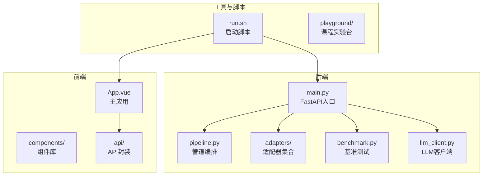
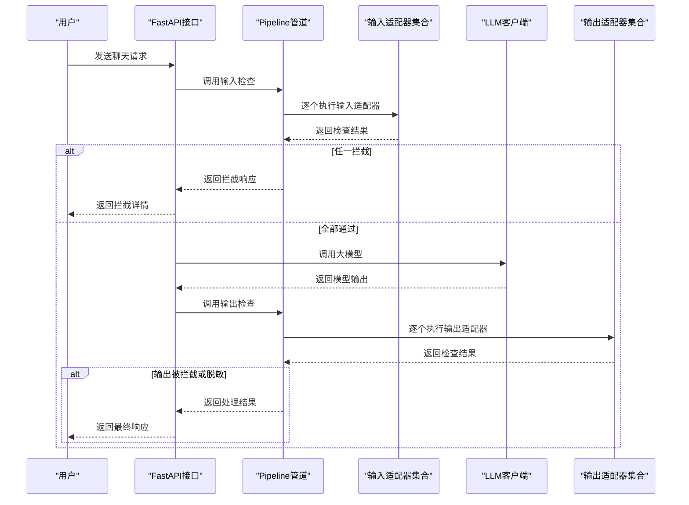
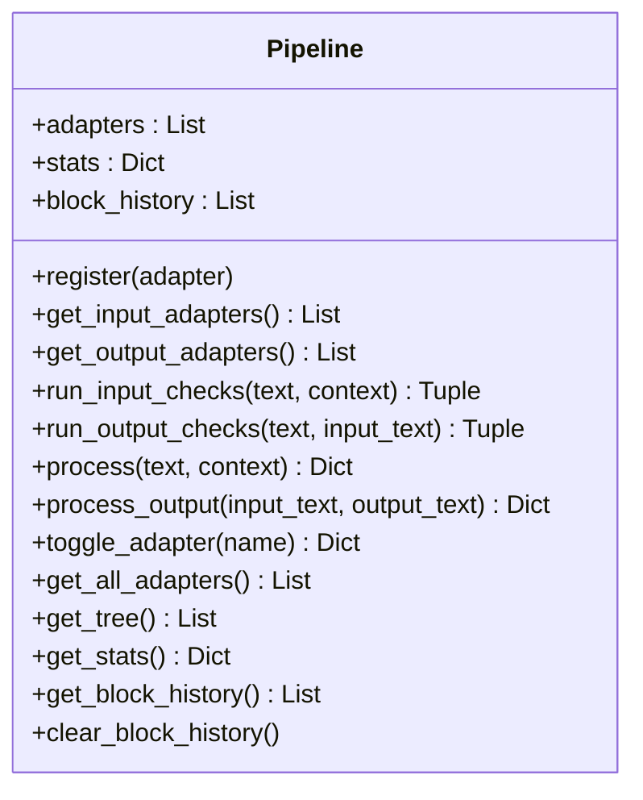
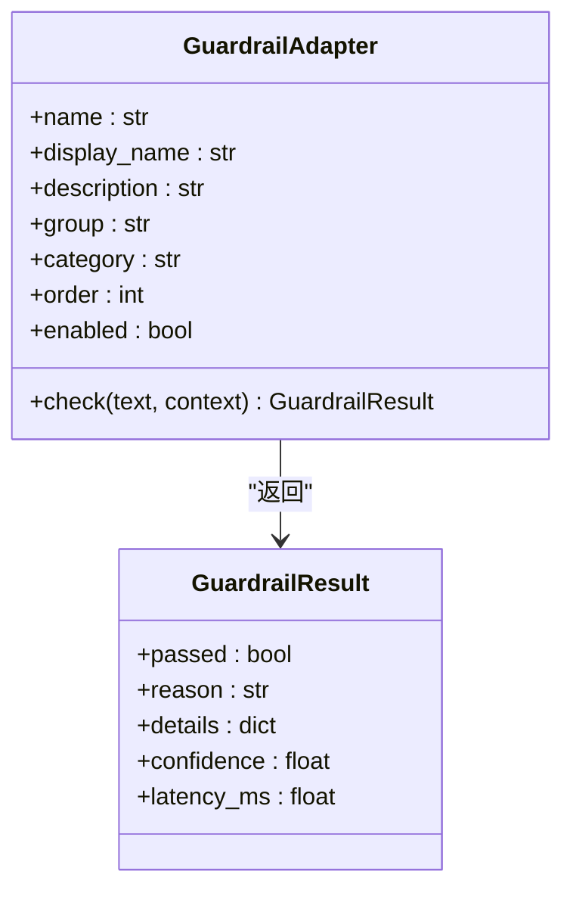
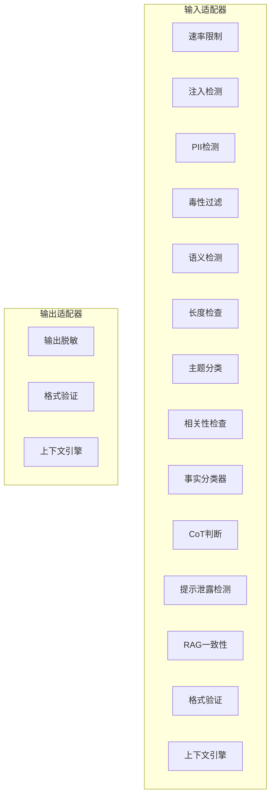
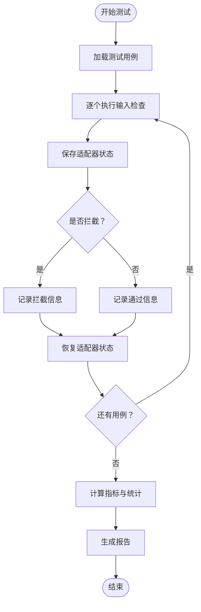
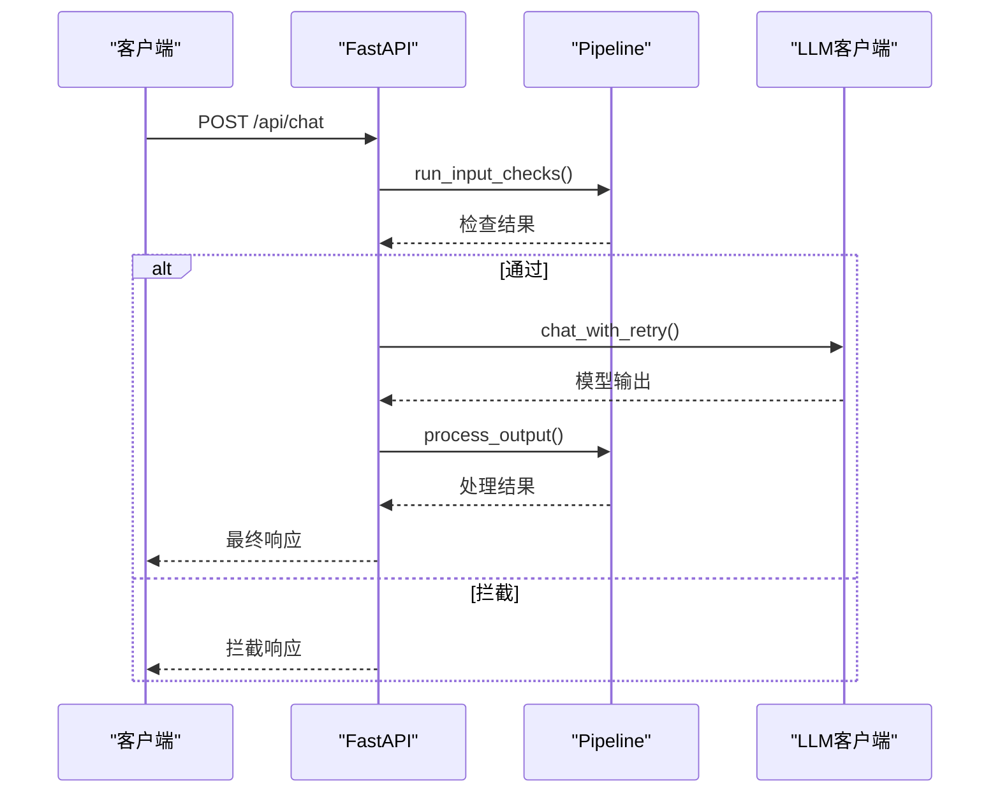
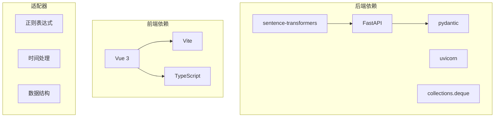

# 沙箱系统概览

<cite>
**本文档引用的文件**
- [main.py](file://guardrails-sandbox/backend/main.py)
- [pipeline.py](file://guardrails-sandbox/backend/pipeline.py)
- [base.py](file://guardrails-sandbox/backend/adapters/base.py)
- [run.sh](file://guardrails-sandbox/run.sh)
- [package.json](file://guardrails-sandbox/frontend/package.json)
- [rate_limiter.py](file://guardrails-sandbox/backend/adapters/rate_limiter.py)
- [injection.py](file://guardrails-sandbox/backend/adapters/injection.py)
- [pii_detector.py](file://guardrails-sandbox/backend/adapters/pii_detector.py)
- [toxicity.py](file://guardrails-sandbox/backend/adapters/toxicity.py)
- [format_validator.py](file://guardrails-sandbox/backend/adapters/format_validator.py)
- [output_scrubber.py](file://guardrails-sandbox/backend/adapters/output_scrubber.py)
- [context_engine.py](file://guardrails-sandbox/backend/adapters/context_engine.py)
- [benchmark.py](file://guardrails-sandbox/backend/benchmark.py)
- [test_cases.py](file://guardrails-sandbox/backend/test_cases.py)
</cite>

## 目录
1. [简介](#简介)
2. [项目结构](#项目结构)
3. [核心组件](#核心组件)
4. [架构总览](#架构总览)
5. [详细组件分析](#详细组件分析)
6. [依赖关系分析](#依赖关系分析)
7. [性能考虑](#性能考虑)
8. [故障排除指南](#故障排除指南)
9. [结论](#结论)
10. [附录](#附录)

## 简介
本项目是一个面向AI安全的防护沙箱系统，旨在提供受控的AI安全实验环境。系统通过15种不同类型的防护墙适配器，构建了多层次的安全防护体系，涵盖输入拦截、输出脱敏、格式校验、上下文预算管理等多个维度。沙箱不仅支持实时聊天接口，还提供了对比测试、基准评测、MCP工具集成、课程实验台等功能，帮助开发者和研究人员安全地测试各种安全防护技术，提升AI系统的安全性与鲁棒性。

## 项目结构
沙箱系统采用前后端分离架构，后端基于FastAPI提供REST API，前端基于Vue 3 + Vite构建交互界面。核心目录结构如下：
- backend：后端服务，包含适配器、管道编排、基准测试、LLM客户端等
- frontend：前端应用，提供可视化界面和交互功能
- run.sh：一键启动脚本，同时启动后端和前端服务
- benchmark：基准测试用例与评估引擎

**图表来源**
- [main.py:1-421](file://guardrails-sandbox/backend/main.py#L1-L421)
- [pipeline.py:1-285](file://guardrails-sandbox/backend/pipeline.py#L1-L285)
- [run.sh:1-35](file://guardrails-sandbox/run.sh#L1-L35)

**章节来源**
- [main.py:1-421](file://guardrails-sandbox/backend/main.py#L1-L421)
- [run.sh:1-35](file://guardrails-sandbox/run.sh#L1-L35)

## 核心组件
系统的核心组件包括：
- 管道编排器（Pipeline）：负责注册、调度和执行适配器，支持输入/输出双通道检查，具备统计与拦截历史记录能力
- 适配器基类（GuardrailAdapter）：定义统一的适配器接口，子类仅需实现check方法
- 适配器集合：包含15种不同类型的防护墙适配器，覆盖速率限制、注入检测、PII检测、毒性过滤、格式校验、输出脱敏、上下文预算等
- 基准测试引擎（BenchmarkRunner）：提供自动化测试用例，支持按类别运行，计算TPR/FPR/准确率等指标
- LLM客户端：封装与大语言模型的交互逻辑，支持重试与消息格式化

**章节来源**
- [pipeline.py:1-285](file://guardrails-sandbox/backend/pipeline.py#L1-L285)
- [base.py:1-34](file://guardrails-sandbox/backend/adapters/base.py#L1-L34)
- [benchmark.py:1-169](file://guardrails-sandbox/backend/benchmark.py#L1-L169)

## 架构总览
系统采用分层架构设计，通过管道编排器串联多个适配器，形成完整的安全防护链路。整体流程包括：用户请求进入后，先进行输入检查（短路拦截），通过后再调用LLM，最后对输出进行二次检查（可脱敏）。系统还提供对比模式、基准测试、MCP工具集成、课程实验台等扩展功能。

**图表来源**
- [main.py:155-221](file://guardrails-sandbox/backend/main.py#L155-L221)
- [pipeline.py:31-161](file://guardrails-sandbox/backend/pipeline.py#L31-L161)

**章节来源**
- [main.py:155-221](file://guardrails-sandbox/backend/main.py#L155-L221)
- [pipeline.py:86-161](file://guardrails-sandbox/backend/pipeline.py#L86-L161)

## 详细组件分析

### 管道编排器（Pipeline）
管道编排器负责：
- 注册适配器并按order排序
- 输入通道：逐个执行适配器，遇拦截即短路
- 输出通道：对LLM输出进行检查，支持脱敏
- 统计与历史：记录拦截次数、通过次数、按层统计、拦截历史
- 树形结构：按分组/类别组织适配器，便于前端展示

**图表来源**
- [pipeline.py:12-285](file://guardrails-sandbox/backend/pipeline.py#L12-L285)

**章节来源**
- [pipeline.py:12-285](file://guardrails-sandbox/backend/pipeline.py#L12-L285)

### 适配器基类（GuardrailAdapter）
适配器基类定义了统一接口：
- 必须实现check方法
- 包含name/display_name/description/group/category/order/enabled等元信息
- check返回GuardrailResult，包含passed/reason/details/confidence/latency_ms

**图表来源**
- [base.py:5-34](file://guardrails-sandbox/backend/adapters/base.py#L5-L34)

**章节来源**
- [base.py:14-34](file://guardrails-sandbox/backend/adapters/base.py#L14-L34)

### 适配器集合（15种防护墙）
系统内置15种适配器，分为输入和输出两类：

#### 输入适配器
- 速率限制（RateLimiter）：基于滑动窗口的RPM限制，按用户等级区分限额
- 注入检测（InjectionDetector）：正则匹配已知攻击模式，检测提示注入、编码绕过
- PII检测（PiiDetector）：识别手机号、邮箱、身份证、信用卡等个人信息
- 毒性过滤（ToxicityFilter）：过滤暴力、违法、自残、仇恨、色情内容
- 语义检测（SemanticDetector）：基于语义的指令覆盖、越狱检测
- 长度检查（LengthChecker）：限制输入长度
- 主题分类（TopicClassifier）：对输入主题进行分类
- 相关性检查（RelevanceChecker）：检查输入与主题相关性
- 事实分类器（FactualClassifier）：判断陈述事实性
- CoT判断（CotJudge）：思维链推理判断
- 提示泄露检测（PromptLeakDetector）：检测提示泄露尝试
- RAG一致性（RAGGroundedness）：基于检索的groundedness判断
- 格式验证（FormatValidator）：输出格式校验（作为输出适配器）
- 上下文引擎（ContextEngine）：上下文预算管理（作为输出适配器）

#### 输出适配器
- 输出脱敏（OutputScrubber）：替换输出中的PII为脱敏标记
- 格式验证（FormatValidator）：验证JSON/代码/文本格式
- 上下文引擎（ContextEngine）：分析Token预算与中间丢失效应

**图表来源**
- [rate_limiter.py:7-56](file://guardrails-sandbox/backend/adapters/rate_limiter.py#L7-L56)
- [injection.py:44-88](file://guardrails-sandbox/backend/adapters/injection.py#L44-L88)
- [pii_detector.py:19-54](file://guardrails-sandbox/backend/adapters/pii_detector.py#L19-L54)
- [toxicity.py:22-64](file://guardrails-sandbox/backend/adapters/toxicity.py#L22-L64)
- [format_validator.py:13-86](file://guardrails-sandbox/backend/adapters/format_validator.py#L13-L86)
- [output_scrubber.py:16-56](file://guardrails-sandbox/backend/adapters/output_scrubber.py#L16-L56)
- [context_engine.py:179-243](file://guardrails-sandbox/backend/adapters/context_engine.py#L179-L243)

**章节来源**
- [rate_limiter.py:1-56](file://guardrails-sandbox/backend/adapters/rate_limiter.py#L1-L56)
- [injection.py:1-88](file://guardrails-sandbox/backend/adapters/injection.py#L1-L88)
- [pii_detector.py:1-54](file://guardrails-sandbox/backend/adapters/pii_detector.py#L1-L54)
- [toxicity.py:1-64](file://guardrails-sandbox/backend/adapters/toxicity.py#L1-L64)
- [format_validator.py:1-86](file://guardrails-sandbox/backend/adapters/format_validator.py#L1-L86)
- [output_scrubber.py:1-56](file://guardrails-sandbox/backend/adapters/output_scrubber.py#L1-L56)
- [context_engine.py:1-251](file://guardrails-sandbox/backend/adapters/context_engine.py#L1-L251)

### 基准测试引擎（BenchmarkRunner）
基准测试引擎提供：
- 自动化测试用例：包含正常查询、注入攻击、语义变种、PII、毒性内容、边界情况
- 指标计算：TPR（攻击拦截率）、FPR（误拦率）、精确率、F1分数
- 分类统计：按类别与拦截层统计准确率
- 状态恢复：测试过程中保存并恢复适配器状态与统计信息

**图表来源**
- [benchmark.py:14-169](file://guardrails-sandbox/backend/benchmark.py#L14-L169)
- [test_cases.py:10-155](file://guardrails-sandbox/backend/test_cases.py#L10-L155)

**章节来源**
- [benchmark.py:1-169](file://guardrails-sandbox/backend/benchmark.py#L1-L169)
- [test_cases.py:1-155](file://guardrails-sandbox/backend/test_cases.py#L1-L155)

### LLM客户端与API接口
后端提供多种API接口：
- 获取适配器树形结构与统计信息
- 切换适配器启用状态
- 对话接口：支持对比模式（有/无防护墙）
- 基准测试接口：按类别运行测试
- MCP工具调用：通过标准协议调用外部工具
- 课程实验台：提供按阶段分组的实验模块

**图表来源**
- [main.py:155-221](file://guardrails-sandbox/backend/main.py#L155-L221)
- [pipeline.py:129-161](file://guardrails-sandbox/backend/pipeline.py#L129-L161)

**章节来源**
- [main.py:121-281](file://guardrails-sandbox/backend/main.py#L121-L281)

## 依赖关系分析
系统的技术栈与依赖关系如下：
- 后端框架：FastAPI（Web框架）、uvicorn（ASGI服务器）
- 前端框架：Vue 3、Vite（开发与构建工具）
- 适配器依赖：正则表达式、时间处理、数据结构（collections.deque等）
- 基准测试：数据类（dataclasses）、JSON序列化
- 运行环境：Python虚拟环境、Node.js（前端依赖）

**图表来源**
- [main.py:10-18](file://guardrails-sandbox/backend/main.py#L10-L18)
- [package.json:11-20](file://guardrails-sandbox/frontend/package.json#L11-L20)

**章节来源**
- [main.py:1-421](file://guardrails-sandbox/backend/main.py#L1-L421)
- [package.json:1-21](file://guardrails-sandbox/frontend/package.json#L1-L21)

## 性能考虑
- 预加载模型：在启动前预加载语义模型，避免异步环境中的连接问题
- 滑动窗口限流：内存级窗口管理，降低存储开销
- 短路拦截：输入通道一旦拦截立即返回，减少后续处理
- 统计与历史：限制拦截历史条目数量，避免内存膨胀
- Token预算：上下文预算管理器动态分配Token，避免溢出

## 故障排除指南
- LLM调用失败：检查系统提示、消息格式与网络连接
- 适配器未生效：确认适配器enabled状态与order排序
- 拦截误判：调整阈值或添加新规则，参考基准测试指标
- 前端无法访问：确认后端端口占用与CORS配置
- MCP工具调用异常：检查工具路径与权限

**章节来源**
- [main.py:186-194](file://guardrails-sandbox/backend/main.py#L186-L194)
- [pipeline.py:264-285](file://guardrails-sandbox/backend/pipeline.py#L264-L285)

## 结论
本沙箱系统通过15种防护墙适配器构建了完整的AI安全防护体系，支持实时拦截、输出脱敏、格式校验、上下文预算管理等能力。系统提供丰富的API接口、对比测试、基准评测与课程实验台，能够有效支撑AI安全教育与研究工作。通过合理的架构设计与性能优化，系统在保证安全性的同时兼顾了易用性与可扩展性。

## 附录
- 一键启动：运行脚本同时启动后端与前端服务
- 前端依赖：Vue 3、Vite、TypeScript
- 后端依赖：FastAPI、uvicorn、pydantic等

**章节来源**
- [run.sh:1-35](file://guardrails-sandbox/run.sh#L1-L35)
- [package.json:1-21](file://guardrails-sandbox/frontend/package.json#L1-L21)