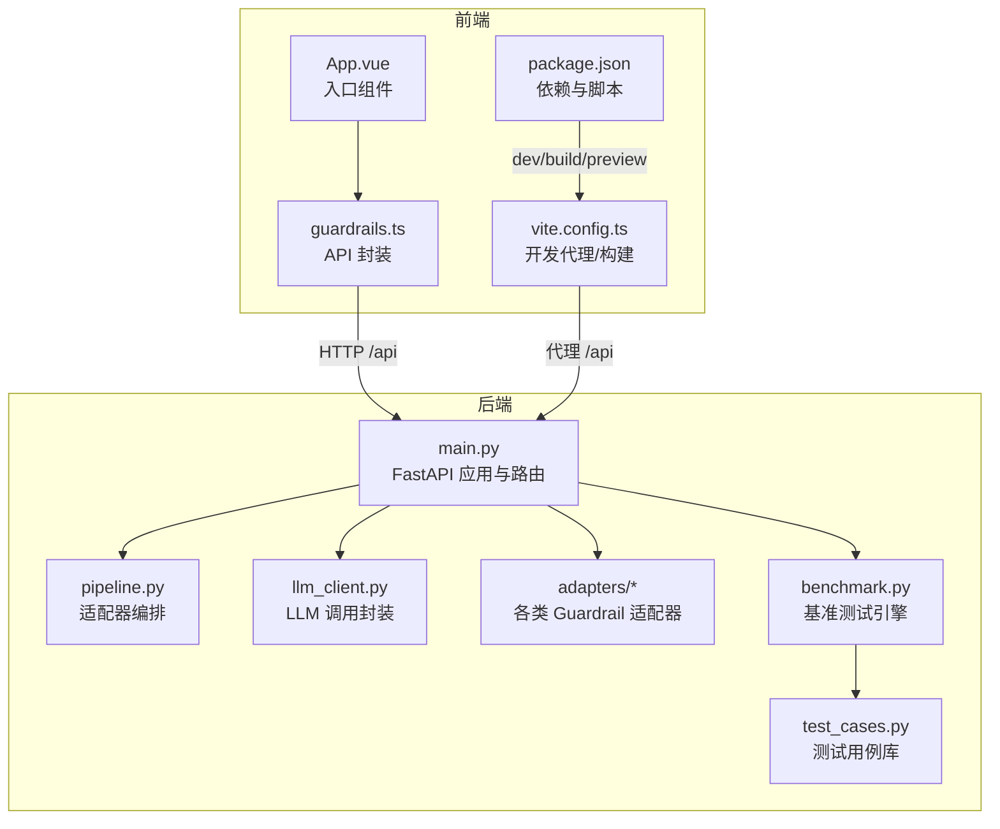
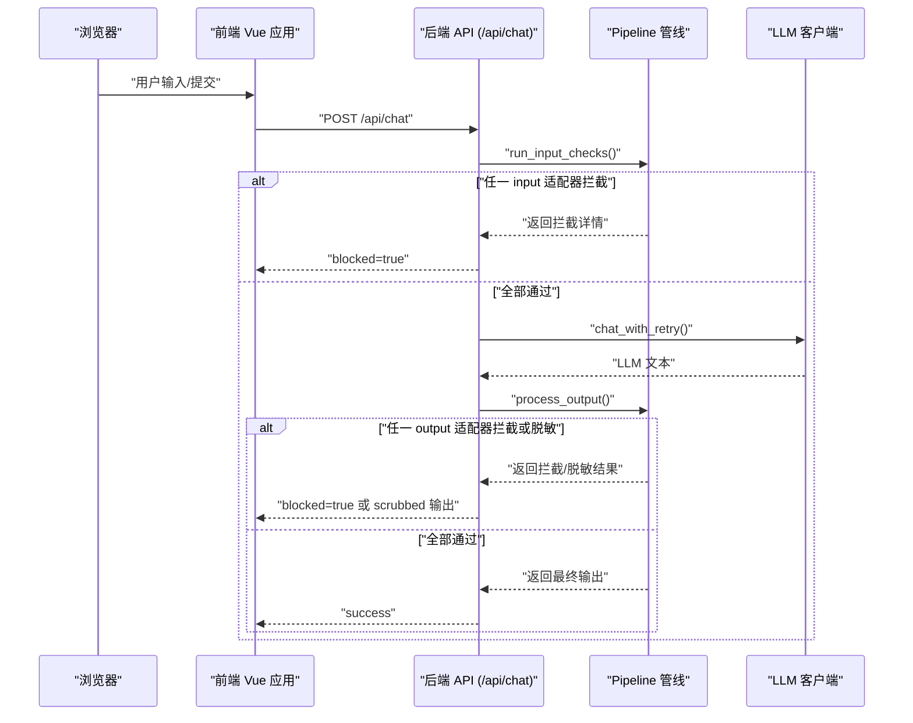
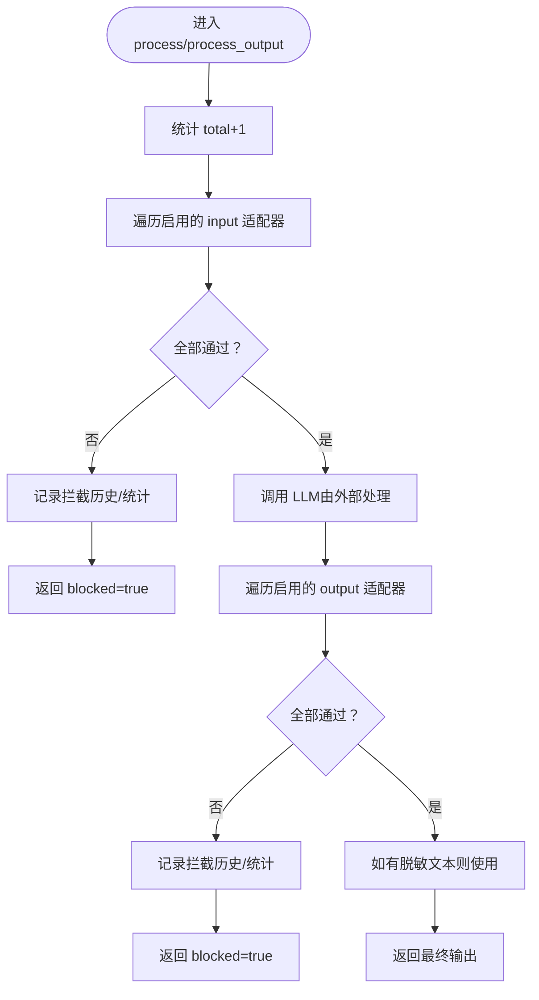
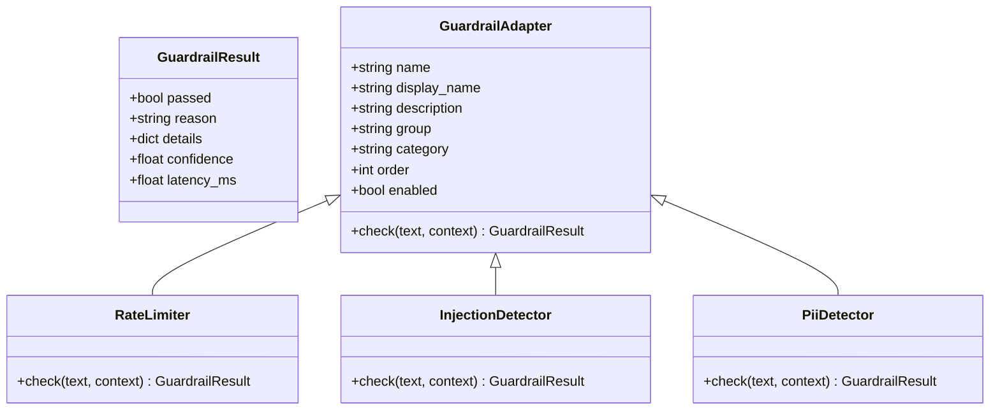
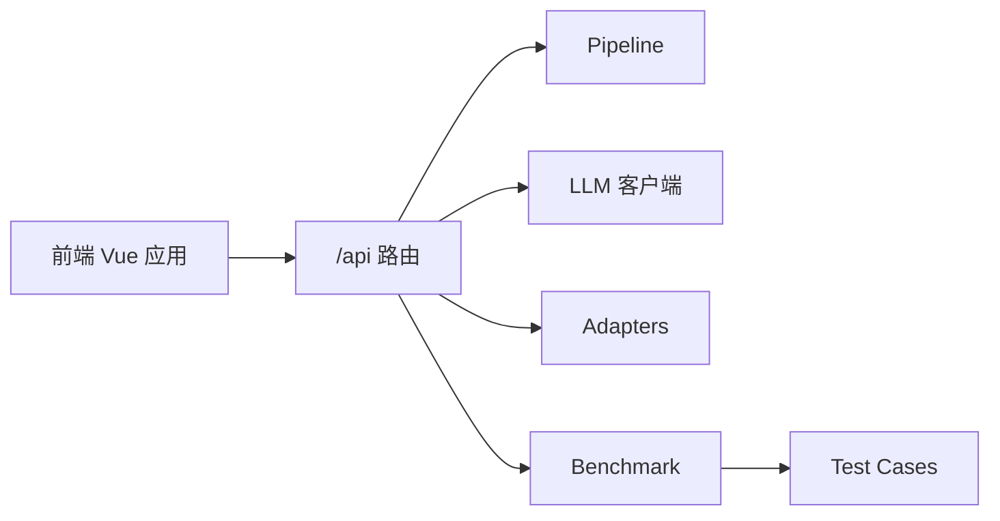

# 部署与配置

<cite>
**本文引用的文件**
- [main.py](file://guardrails-sandbox/backend/main.py)
- [llm_client.py](file://guardrails-sandbox/backend/llm_client.py)
- [pipeline.py](file://guardrails-sandbox/backend/pipeline.py)
- [base.py](file://guardrails-sandbox/backend/adapters/base.py)
- [rate_limiter.py](file://guardrails-sandbox/backend/adapters/rate_limiter.py)
- [injection.py](file://guardrails-sandbox/backend/adapters/injection.py)
- [pii_detector.py](file://guardrails-sandbox/backend/adapters/pii_detector.py)
- [run.sh](file://guardrails-sandbox/run.sh)
- [package.json](file://guardrails-sandbox/frontend/package.json)
- [vite.config.ts](file://guardrails-sandbox/frontend/vite.config.ts)
- [main.ts](file://guardrails-sandbox/frontend/src/main.ts)
- [App.vue](file://guardrails-sandbox/frontend/src/App.vue)
- [guardrails.ts](file://guardrails-sandbox/frontend/src/api/guardrails.ts)
- [test_cases.py](file://guardrails-sandbox/backend/test_cases.py)
- [benchmark.py](file://guardrails-sandbox/backend/benchmark.py)
</cite>

## 目录
1. [简介](#简介)
2. [项目结构](#项目结构)
3. [核心组件](#核心组件)
4. [架构总览](#架构总览)
5. [详细组件分析](#详细组件分析)
6. [依赖关系分析](#依赖关系分析)
7. [性能考虑](#性能考虑)
8. [故障排除指南](#故障排除指南)
9. [结论](#结论)
10. [附录](#附录)

## 简介
本文件面向安全防护沙箱的部署与配置，提供从环境准备、依赖安装、配置文件设置到系统启动、服务运行参数、LLM 客户端配置、容器化与 Kubernetes 编排、性能调优、监控告警与故障排除的完整指南。文档同时给出生产环境的安全配置最佳实践与注意事项。

## 项目结构
沙箱系统采用前后端分离架构：
- 后端：FastAPI 服务，负责安全防护管线编排、适配器注册与执行、LLM 调用封装、基准测试与 MCP 工具代理。
- 前端：Vue 3 + Vite 开发环境，提供可视化界面，支持普通对话、对比模式、课程实验台、MCP 工具面板与检查点数据库查看器。
- 运行脚本：一键启动后端与前端开发服务，并通过 Vite 代理转发 /api 请求至后端。

**图表来源**
- [main.py:78-421](file://guardrails-sandbox/backend/main.py#L78-L421)
- [pipeline.py:12-285](file://guardrails-sandbox/backend/pipeline.py#L12-L285)
- [llm_client.py:1-51](file://guardrails-sandbox/backend/llm_client.py#L1-L51)
- [guardrails.ts:1-168](file://guardrails-sandbox/frontend/src/api/guardrails.ts#L1-L168)
- [vite.config.ts:1-26](file://guardrails-sandbox/frontend/vite.config.ts#L1-L26)
- [package.json:1-21](file://guardrails-sandbox/frontend/package.json#L1-L21)

**章节来源**
- [main.py:78-421](file://guardrails-sandbox/backend/main.py#L78-L421)
- [run.sh:1-35](file://guardrails-sandbox/run.sh#L1-L35)
- [vite.config.ts:1-26](file://guardrails-sandbox/frontend/vite.config.ts#L1-L26)
- [package.json:1-21](file://guardrails-sandbox/frontend/package.json#L1-L21)

## 核心组件
- 适配器基类与结果模型：定义统一的 GuardrailResult 与 GuardrailAdapter 抽象，决定适配器的分组、类别、执行顺序与启用状态。
- 管线编排：Pipeline 负责注册适配器、按顺序执行 input/output 检查、统计拦截与通过次数、维护拦截历史。
- LLM 客户端：封装 Anthropic 风格的 LLM 调用，支持系统提示、指数退避重试与消息格式化。
- 前后端 API：后端提供 /api/chat、/api/guardrails、/api/benchmark 等接口；前端通过 guardrails.ts 统一封装请求。
- 基准测试：基于 test_cases.py 的用例集，评估拦截准确性、TPR/FPR、按类别与适配器层统计。

**章节来源**
- [base.py:5-34](file://guardrails-sandbox/backend/adapters/base.py#L5-L34)
- [pipeline.py:12-285](file://guardrails-sandbox/backend/pipeline.py#L12-L285)
- [llm_client.py:1-51](file://guardrails-sandbox/backend/llm_client.py#L1-L51)
- [guardrails.ts:38-100](file://guardrails-sandbox/frontend/src/api/guardrails.ts#L38-L100)
- [test_cases.py:10-155](file://guardrails-sandbox/backend/test_cases.py#L10-L155)
- [benchmark.py:10-169](file://guardrails-sandbox/backend/benchmark.py#L10-L169)

## 架构总览
下图展示从浏览器到后端、再到 LLM 的典型请求链路，以及 Guardrail 管线在输入与输出阶段的拦截与脱敏处理。

**图表来源**
- [main.py:155-221](file://guardrails-sandbox/backend/main.py#L155-L221)
- [pipeline.py:31-160](file://guardrails-sandbox/backend/pipeline.py#L31-L160)
- [llm_client.py:33-44](file://guardrails-sandbox/backend/llm_client.py#L33-L44)

## 详细组件分析

### 后端应用与路由
- FastAPI 应用初始化、CORS 中间件、静态文件挂载（前端 dist）。
- 注册所有 Guardrail 适配器，预加载语义模型以避免异步环境下的连接问题。
- 提供以下核心路由：
  - 获取适配器树与统计：/api/guardrails、/api/adapters/tree、/api/guardrails/block-history、/api/guardrails/clear-history
  - 切换适配器开关：/api/guardrails/toggle
  - 对话接口：/api/chat（含对比模式 /api/chat/compare）、重置统计：/api/chat/reset-stats
  - 基准测试：/api/benchmark
  - MCP 工具代理：/api/mcp/call、/api/mcp/tools
  - 课程实验台与检查点数据库：/api/playground/*、/api/checkpoints/*

**章节来源**
- [main.py:78-421](file://guardrails-sandbox/backend/main.py#L78-L421)

### 管线编排（Pipeline）
- 注册适配器并按 order 排序，分别提取 input/output 适配器集合。
- 输入检查：逐个执行 input 适配器，任一拦截即短路，记录拦截历史与统计。
- 输出检查：对 LLM 返回文本执行 output 适配器，支持脱敏（OutputScrubber），返回脱敏后的文本或原始文本。
- 统计与树形结构：提供总次数、拦截数、通过数、按层统计、树形分组（group/category/adapter）。

**图表来源**
- [pipeline.py:86-160](file://guardrails-sandbox/backend/pipeline.py#L86-L160)

**章节来源**
- [pipeline.py:12-285](file://guardrails-sandbox/backend/pipeline.py#L12-L285)

### 适配器基类与典型适配器
- 基类：定义 name/display_name/description/group/category/order/enabled 与 check() 抽象方法。
- 典型适配器：
  - 速率限制（RateLimiter）：按用户与套餐级别进行滑动窗口 RPM 限制。
  - 注入检测（InjectionDetector）：正则匹配提示注入模式与编码绕过。
  - PII 检测（PiiDetector）：识别手机号、邮箱、身份证、信用卡等敏感信息。

**图表来源**
- [base.py:5-34](file://guardrails-sandbox/backend/adapters/base.py#L5-L34)
- [rate_limiter.py:7-56](file://guardrails-sandbox/backend/adapters/rate_limiter.py#L7-L56)
- [injection.py:44-88](file://guardrails-sandbox/backend/adapters/injection.py#L44-L88)
- [pii_detector.py:19-54](file://guardrails-sandbox/backend/adapters/pii_detector.py#L19-L54)

**章节来源**
- [base.py:14-34](file://guardrails-sandbox/backend/adapters/base.py#L14-L34)
- [rate_limiter.py:1-56](file://guardrails-sandbox/backend/adapters/rate_limiter.py#L1-L56)
- [injection.py:1-88](file://guardrails-sandbox/backend/adapters/injection.py#L1-L88)
- [pii_detector.py:1-54](file://guardrails-sandbox/backend/adapters/pii_detector.py#L1-L54)

### LLM 客户端
- 默认 API 密钥与基础 URL 从环境变量读取，若未设置则使用内置默认值。
- 支持系统提示、最大输出 token 数、消息格式化与指数退避重试。
- 提供 chat 与 chat_with_retry 两个接口，后者在异常时自动重试。

**章节来源**
- [llm_client.py:1-51](file://guardrails-sandbox/backend/llm_client.py#L1-L51)

### 前端与 API 封装
- Vite 开发服务器通过 proxy 将 /api 请求转发至后端 8000 端口。
- Vue 应用通过 guardrails.ts 封装 /api/* 请求，包含聊天、对比、适配器切换、基准测试、课程实验与检查点数据库等功能。
- 主应用入口与样式位于 App.vue，包含头部标签页与三栏布局（左侧适配器树、中间对话面板、右侧拦截历史）。

**章节来源**
- [vite.config.ts:17-24](file://guardrails-sandbox/frontend/vite.config.ts#L17-L24)
- [guardrails.ts:1-168](file://guardrails-sandbox/frontend/src/api/guardrails.ts#L1-L168)
- [App.vue:1-300](file://guardrails-sandbox/frontend/src/App.vue#L1-L300)
- [main.ts:1-5](file://guardrails-sandbox/frontend/src/main.ts#L1-L5)

### 基准测试与测试用例
- 测试用例分为正常查询、注入攻击、语义变种、PII 检测、毒性内容与边界情况六大类别。
- 基准测试引擎对每个用例执行 input checks，统计准确率、TPR/FPR、按类别与适配器层的命中情况，并计算平均延迟。

**章节来源**
- [test_cases.py:10-155](file://guardrails-sandbox/backend/test_cases.py#L10-L155)
- [benchmark.py:10-169](file://guardrails-sandbox/backend/benchmark.py#L10-L169)

## 依赖关系分析
- 后端依赖：
  - FastAPI、CORS、静态文件服务
  - Pipeline 与 adapters 子模块
  - LLM 客户端（Anthropic SDK）
  - 基准测试与测试用例模块
- 前端依赖：
  - Vue 3、Vite、TypeScript
  - 通过 /api 与后端通信

**图表来源**
- [main.py:16-58](file://guardrails-sandbox/backend/main.py#L16-L58)
- [pipeline.py:12-24](file://guardrails-sandbox/backend/pipeline.py#L12-L24)
- [llm_client.py:1-12](file://guardrails-sandbox/backend/llm_client.py#L1-L12)
- [benchmark.py:6-13](file://guardrails-sandbox/backend/benchmark.py#L6-L13)
- [test_cases.py:7-16](file://guardrails-sandbox/backend/test_cases.py#L7-L16)

**章节来源**
- [main.py:16-58](file://guardrails-sandbox/backend/main.py#L16-L58)
- [package.json:11-20](file://guardrails-sandbox/frontend/package.json#L11-L20)

## 性能考虑
- 预热模型：在 uvicorn 启动前预加载语义模型，避免异步环境下 httpx 连接问题。
- 重试策略：LLM 调用采用指数退避重试，提升稳定性。
- 管线短路：输入阶段任一适配器拦截即短路，减少后续开销。
- 统计与延迟：Pipeline 记录每层适配器耗时，便于定位瓶颈。
- 前端代理：Vite 开发代理简化跨域与本地联调。

**章节来源**
- [main.py:62-76](file://guardrails-sandbox/backend/main.py#L62-L76)
- [llm_client.py:33-44](file://guardrails-sandbox/backend/llm_client.py#L33-L44)
- [pipeline.py:31-56](file://guardrails-sandbox/backend/pipeline.py#L31-L56)

## 故障排除指南
- 后端无法启动
  - 检查 Python 虚拟环境与依赖安装路径。
  - 确认端口 8000 未被占用。
- 前端无法访问 /api
  - 确认 Vite 代理配置指向后端 8000 端口。
  - 查看浏览器 Network 面板与后端日志。
- LLM 调用失败
  - 检查 LLM_API_KEY 与 LLM_BASE_URL 环境变量。
  - 观察 chat_with_retry 的重试日志与异常栈。
- 适配器未生效
  - 通过 /api/guardrails/toggle 切换适配器开关。
  - 检查适配器 order 与 enabled 状态。
- 拦截历史为空
  - 使用 /api/guardrails/block-history 获取，或在非基准场景下才会记录。

**章节来源**
- [run.sh:12-35](file://guardrails-sandbox/run.sh#L12-L35)
- [vite.config.ts:17-24](file://guardrails-sandbox/frontend/vite.config.ts#L17-L24)
- [llm_client.py:7-9](file://guardrails-sandbox/backend/llm_client.py#L7-L9)
- [main.py:147-152](file://guardrails-sandbox/backend/main.py#L147-L152)
- [pipeline.py:264-285](file://guardrails-sandbox/backend/pipeline.py#L264-L285)

## 结论
本文档提供了安全防护沙箱从开发到生产的部署与配置全景：包括环境准备、依赖安装、配置项、启动流程、服务参数、LLM 客户端选项、前端代理、基准测试与可视化界面。结合性能优化与故障排除建议，可在开发与生产环境中稳定落地。

## 附录

### 安装与环境准备
- 安装 Python 3.8+ 并创建虚拟环境。
- 安装后端依赖：FastAPI、uvicorn、anthropic、sentence-transformers 等。
- 安装前端依赖：Vue 3、Vite、TypeScript。
- 设置 LLM API 密钥与基础 URL 环境变量。

**章节来源**
- [llm_client.py:7-9](file://guardrails-sandbox/backend/llm_client.py#L7-L9)
- [package.json:11-20](file://guardrails-sandbox/frontend/package.json#L11-L20)

### 启动流程与运行参数
- 开发启动：执行 run.sh，自动启动后端（uvicorn）与前端（Vite dev server），并建立 /api 代理。
- 后端参数：主机与端口可通过 uvicorn.run 调整。
- 前端参数：Vite 代理目标与变更源在 vite.config.ts 中配置。

**章节来源**
- [run.sh:12-35](file://guardrails-sandbox/run.sh#L12-L35)
- [main.py:413-421](file://guardrails-sandbox/backend/main.py#L413-L421)
- [vite.config.ts:17-24](file://guardrails-sandbox/frontend/vite.config.ts#L17-L24)

### LLM 客户端配置选项
- API 密钥与基础 URL：从环境变量读取，未设置时使用内置默认值。
- 模型选择：当前固定为 deepseek-v4-flash。
- 请求参数：支持系统提示、最大输出 token 数、消息格式化。
- 重试机制：指数退避重试，提升鲁棒性。

**章节来源**
- [llm_client.py:7-9](file://guardrails-sandbox/backend/llm_client.py#L7-L9)
- [llm_client.py:15-31](file://guardrails-sandbox/backend/llm_client.py#L15-L31)
- [llm_client.py:33-44](file://guardrails-sandbox/backend/llm_client.py#L33-L44)

### 容器化部署与 Kubernetes 编排
- Docker 镜像建议：
  - 基于 Python 3.8+ 官方镜像。
  - 复制后端代码与依赖安装，暴露 8000 端口。
  - 前端构建产物复制至后端静态目录，或使用 Nginx 提供静态资源。
- Kubernetes 编排要点：
  - Deployment：副本数、资源限制与探针。
  - Service：ClusterIP/NodePort/LoadBalancer 选择。
  - ConfigMap/Secret：存放 LLM API 密钥与基础 URL。
  - Ingress：域名与 TLS 配置。
  - HPA：根据 CPU/自定义指标扩缩容。
  - PodDisruptionBudget：保证可用性。

[本节为通用实践建议，不直接分析具体文件，故无“章节来源”]

### 性能调优与监控告警
- 性能调优：
  - 预热语义模型，减少首次调用延迟。
  - 合理设置速率限制（RateLimiter）以平衡吞吐与公平性。
  - 优化适配器顺序，将低成本适配器前置。
  - 使用 CDN 与静态资源缓存。
- 监控告警：
  - 指标：QPS、P95/P99 延迟、拦截率、错误率、LLM 调用耗时。
  - 日志：适配器日志、拦截历史、错误堆栈。
  - 告警：阈值触发（如延迟突增、拦截率上升、LLM 错误率）。

[本节为通用实践建议，不直接分析具体文件，故无“章节来源”]

### 安全配置最佳实践与生产注意事项
- 环境变量与密钥：
  - 使用 Secret 管理 LLM API 密钥与基础 URL。
  - 禁止将密钥硬编码进代码或镜像。
- 网络与访问控制：
  - 限制后端暴露范围，仅开放必要端口。
  - 配置 WAF/防火墙与速率限制。
- 数据保护：
  - 对 PII 检测拦截或脱敏，遵循最小化原则。
  - 审计拦截历史与操作日志。
- 生产部署：
  - 使用 HTTPS 与证书管理。
  - 前后端分离部署，静态资源走 CDN。
  - 健壮的健康检查与优雅停机。

[本节为通用实践建议，不直接分析具体文件，故无“章节来源”]