# MCP协议基础

<cite>
**本文档引用的文件**
- [MCP基础概念](file://phases/13-tools-and-protocols/06-mcp-fundamentals/docs/en.md)
- [构建MCP服务器](file://phases/13-tools-and-protocols/07-building-an-mcp-server/docs/en.md)
- [构建MCP客户端](file://phases/13-tools-and-protocols/08-building-an-mcp-client/docs/en.md)
- [MCP传输层](file://phases/13-tools-and-protocols/09-mcp-transports/docs/en.md)
- [MCP资源与提示词](file://phases/13-tools-and-protocols/10-mcp-resources-and-prompts/docs/en.md)
- [MCP采样](file://phases/13-tools-and-protocols/11-mcp-sampling/docs/en.md)
- [MCP安全：工具污染](file://phases/13-tools-and-protocols/15-mcp-security-tool-poisoning/docs/en.md)
- [MCP生产环境认证](file://phases/13-tools-and-protocols/18-mcp-auth-production/docs/en.md)
- [MCP服务器与注册表项目](file://phases/19-capstone-projects/13-mcp-server-with-registry/code/ts/README.md)
- [MCP服务器入口](file://phases/19-capstone-projects/13-mcp-server-with-registry/code/ts/src/index.ts)
</cite>

## 目录
1. [引言](#引言)
2. [项目结构](#项目结构)
3. [核心组件](#核心组件)
4. [架构概览](#架构概览)
5. [详细组件分析](#详细组件分析)
6. [依赖关系分析](#依赖关系分析)
7. [性能考量](#性能考量)
8. [故障排除指南](#故障排除指南)
9. [结论](#结论)
10. [附录](#附录)

## 引言
本文件为MCP（模型上下文协议）的基础入门文档，面向希望理解并应用MCP协议的开发者。文档从设计理念、核心架构、握手机制、消息格式、会话管理、版本兼容性、安全考虑到性能特征进行全面阐述，并提供完整的握手流程实现示例与最佳实践指导。

MCP由Anthropic于2024年11月首次发布，现由Linux基金会的代理AI基金会托管。其目标是标准化工具发现与调用，使任何客户端能够与任何服务器通信。2025-11-25规范定义了六大原语（三类服务器原语：工具、资源、提示词；三类客户端原语：根目录、采样、引导）、三阶段生命周期以及JSON-RPC 2.0线缆格式。

## 项目结构
本仓库中与MCP协议直接相关的教学内容主要分布在以下位置：
- 基础概念与理论：phases/13-tools-and-protocols/06-mcp-fundamentals
- 服务器实现：phases/13-tools-and-protocols/07-building-an-mcp-server
- 客户端实现：phases/13-tools-and-protocols/08-building-an-mcp-client
- 传输层：phases/13-tools-and-protocols/09-mcp-transports
- 资源与提示词：phases/13-tools-and-protocols/10-mcp-resources-and-prompts
- 采样机制：phases/13-tools-and-protocols/11-mcp-sampling
- 安全：phases/13-tools-and-protocols/15-mcp-security-tool-poisoning
- 生产环境认证：phases/13-tools-and-protocols/18-mcp-auth-production
- 综合项目：phases/19-capstone-projects/13-mcp-server-with-registry

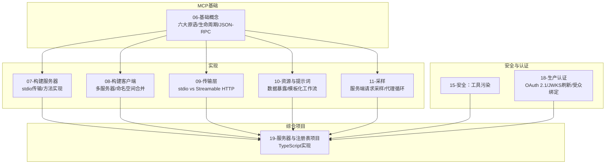

**图表来源**
- [MCP基础概念:1-167](file://phases/13-tools-and-protocols/06-mcp-fundamentals/docs/en.md#L1-L167)
- [构建MCP服务器:1-175](file://phases/13-tools-and-protocols/07-building-an-mcp-server/docs/en.md#L1-L175)
- [构建MCP客户端:1-144](file://phases/13-tools-and-protocols/08-building-an-mcp-client/docs/en.md#L1-L144)
- [MCP传输层:1-145](file://phases/13-tools-and-protocols/09-mcp-transports/docs/en.md#L1-L145)
- [MCP资源与提示词:1-149](file://phases/13-tools-and-protocols/10-mcp-resources-and-prompts/docs/en.md#L1-L149)
- [MCP采样:1-179](file://phases/13-tools-and-protocols/11-mcp-sampling/docs/en.md#L1-L179)
- [MCP安全：工具污染:1-143](file://phases/13-tools-and-protocols/15-mcp-security-tool-poisoning/docs/en.md#L1-L143)
- [MCP生产环境认证:1-326](file://phases/13-tools-and-protocols/18-mcp-auth-production/docs/en.md#L1-L326)
- [MCP服务器与注册表项目:1-30](file://phases/19-capstone-projects/13-mcp-server-with-registry/code/ts/README.md#L1-L30)

**章节来源**
- [MCP基础概念:1-167](file://phases/13-tools-and-protocols/06-mcp-fundamentals/docs/en.md#L1-L167)
- [构建MCP服务器:1-175](file://phases/13-tools-and-protocols/07-building-an-mcp-server/docs/en.md#L1-L175)
- [构建MCP客户端:1-144](file://phases/13-tools-and-protocols/08-building-an-mcp-client/docs/en.md#L1-L144)
- [MCP传输层:1-145](file://phases/13-tools-and-protocols/09-mcp-transports/docs/en.md#L1-L145)
- [MCP资源与提示词:1-149](file://phases/13-tools-and-protocols/10-mcp-resources-and-prompts/docs/en.md#L1-L149)
- [MCP采样:1-179](file://phases/13-tools-and-protocols/11-mcp-sampling/docs/en.md#L1-L179)
- [MCP安全：工具污染:1-143](file://phases/13-tools-and-protocols/15-mcp-security-tool-poisoning/docs/en.md#L1-L143)
- [MCP生产环境认证:1-326](file://phases/13-tools-and-protocols/18-mcp-auth-production/docs/en.md#L1-L326)
- [MCP服务器与注册表项目:1-30](file://phases/19-capstone-projects/13-mcp-server-with-registry/code/ts/README.md#L1-L30)

## 核心组件
- 六大原语
  - 服务器原语：工具（可调用动作）、资源（可寻址数据）、提示词（可复用模板）
  - 客户端原语：根目录（允许访问的URI集合）、采样（请求客户端模型完成）、引导（请求用户结构化输入）
- 三阶段生命周期：初始化（能力协商）、操作（双向消息）、关闭（任意一方断开传输）
- JSON-RPC 2.0线缆格式：请求（含id）、响应（含id）、通知（不含id）

这些组件共同构成MCP协议的最小可行实现，确保跨客户端与服务器的互操作性。

**章节来源**
- [MCP基础概念:29-73](file://phases/13-tools-and-protocols/06-mcp-fundamentals/docs/en.md#L29-L73)
- [MCP基础概念:43-59](file://phases/13-tools-and-protocols/06-mcp-fundamentals/docs/en.md#L43-L59)

## 架构概览
下图展示了MCP在本地与远程两种部署形态下的架构差异：

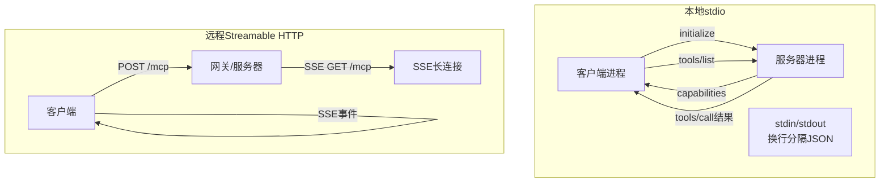

**图表来源**
- [MCP传输层:27-44](file://phases/13-tools-and-protocols/09-mcp-transports/docs/en.md#L27-L44)
- [MCP传输层:35-41](file://phases/13-tools-and-protocols/09-mcp-transports/docs/en.md#L35-L41)

**章节来源**
- [MCP传输层:17-24](file://phases/13-tools-and-protocols/09-mcp-transports/docs/en.md#L17-L24)

## 详细组件分析

### 协议握手与能力协商
握手流程是MCP协议的起点，双方通过initialize交换能力集，随后客户端发送notifications/initialized确认。

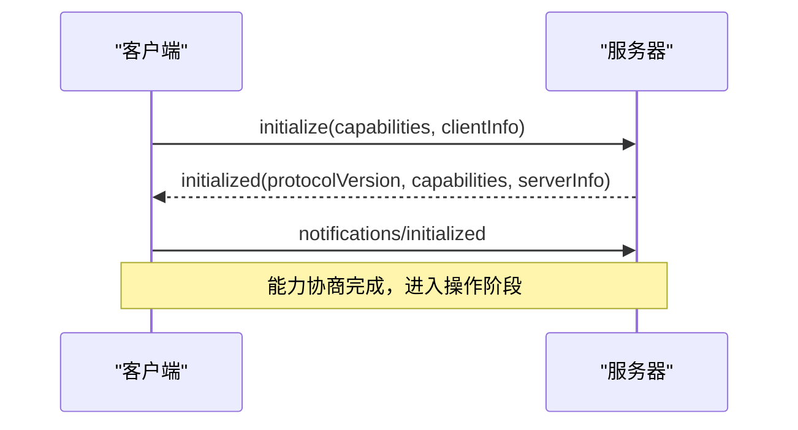

- 能力协商要点
  - 服务器声明支持的特性（如tools.listChanged、resources.subscribe）
  - 客户端声明roots.listChanged、sampling、elicitation等
  - 未声明的能力不应被使用（防止生态漂移）

**图表来源**
- [MCP基础概念:60-73](file://phases/13-tools-and-protocols/06-mcp-fundamentals/docs/en.md#L60-L73)
- [MCP基础概念:74-99](file://phases/13-tools-and-protocols/06-mcp-fundamentals/docs/en.md#L74-L99)

**章节来源**
- [MCP基础概念:60-99](file://phases/13-tools-and-protocols/06-mcp-fundamentals/docs/en.md#L60-L99)

### 消息类型与错误处理
- 请求：包含jsonrpc、id、method、params
- 响应：包含jsonrpc、id、result或error
- 通知：包含jsonrpc、method、params，无id且不期望响应
- 错误形状：遵循JSON-RPC错误码，MCP扩展特定错误数据

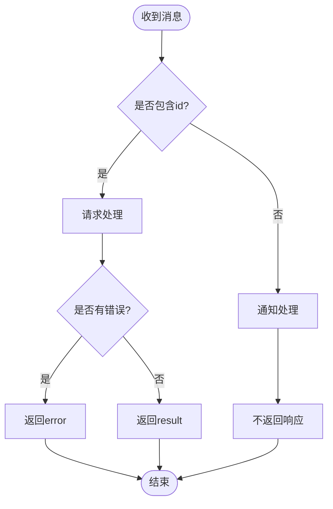

**图表来源**
- [MCP基础概念:47-49](file://phases/13-tools-and-protocols/06-mcp-fundamentals/docs/en.md#L47-L49)
- [MCP基础概念:100-105](file://phases/13-tools-and-protocols/06-mcp-fundamentals/docs/en.md#L100-L105)

**章节来源**
- [MCP基础概念:47-59](file://phases/13-tools-and-protocols/06-mcp-fundamentals/docs/en.md#L47-L59)
- [MCP基础概念:100-105](file://phases/13-tools-and-protocols/06-mcp-fundamentals/docs/en.md#L100-L105)

### 工具调用与内容块
工具调用返回的内容以typed blocks形式组织，常见类型包括text、image、resource等。工具级错误通过isError标记区分于协议级错误。

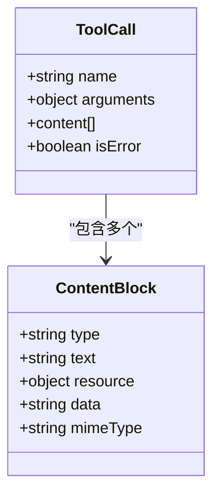

**图表来源**
- [构建MCP服务器:62-75](file://phases/13-tools-and-protocols/07-building-an-mcp-server/docs/en.md#L62-L75)

**章节来源**
- [构建MCP服务器:62-75](file://phases/13-tools-and-protocols/07-building-an-mcp-server/docs/en.md#L62-L75)

### 多服务器客户端与命名空间合并
多服务器客户端负责独立握手、工具列表合并、路由与通知处理。命名空间冲突可通过前缀、静默覆盖或拒绝加载三种策略处理。

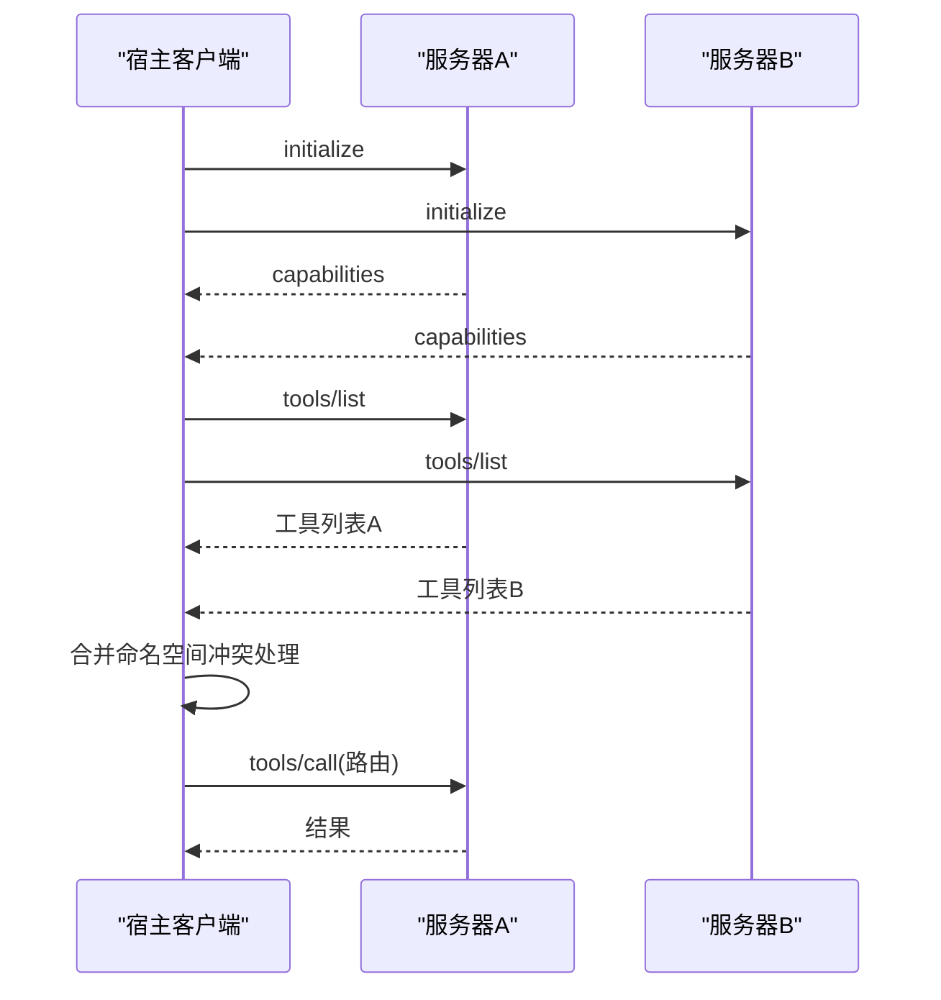

**图表来源**
- [构建MCP客户端:32-56](file://phases/13-tools-and-protocols/08-building-an-mcp-client/docs/en.md#L32-L56)

**章节来源**
- [构建MCP客户端:30-85](file://phases/13-tools-and-protocols/08-building-an-mcp-client/docs/en.md#L30-L85)

### 传输层：stdio与Streamable HTTP
- stdio：子进程模型，每行一个JSON对象，无会话id，适合本地开发
- Streamable HTTP：单端点POST/GET，支持Mcp-Session-Id头进行会话连续性，GET用于SSE推送

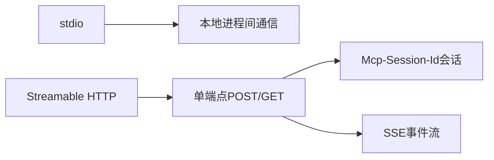

**图表来源**
- [MCP传输层:27-44](file://phases/13-tools-and-protocols/09-mcp-transports/docs/en.md#L27-L44)
- [MCP传输层:35-41](file://phases/13-tools-and-protocols/09-mcp-transports/docs/en.md#L35-L41)

**章节来源**
- [MCP传输层:17-24](file://phases/13-tools-and-protocols/09-mcp-transports/docs/en.md#L17-L24)

### 资源与提示词：数据暴露与模板化工作流
- 资源：只读数据，支持订阅与动态生成；客户端可注入上下文
- 提示词：slash命令模板，服务器提供参数槽位，客户端渲染为消息序列

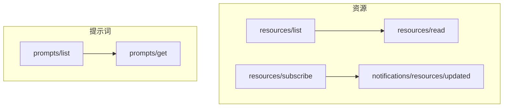

**图表来源**
- [MCP资源与提示词:39-67](file://phases/13-tools-and-protocols/10-mcp-resources-and-prompts/docs/en.md#L39-L67)
- [MCP资源与提示词:62-67](file://phases/13-tools-and-protocols/10-mcp-resources-and-prompts/docs/en.md#L62-L67)

**章节来源**
- [MCP资源与提示词:17-26](file://phases/13-tools-and-protocols/10-mcp-resources-and-prompts/docs/en.md#L17-L26)
- [MCP资源与提示词:39-67](file://phases/13-tools-and-protocols/10-mcp-resources-and-prompts/docs/en.md#L39-L67)

### 采样：服务端请求客户端模型
采样允许服务器向客户端请求模型完成，从而在不持有密钥的情况下实现代理循环。支持modelPreferences与可选的工具内采样。

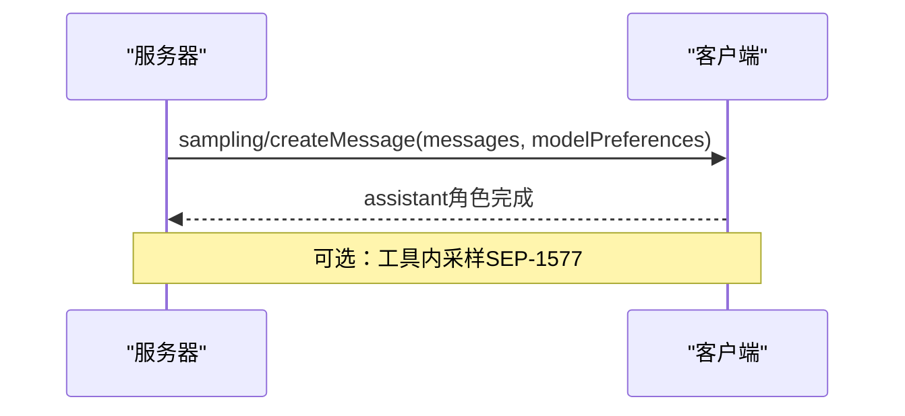

**图表来源**
- [MCP采样:31-64](file://phases/13-tools-and-protocols/11-mcp-sampling/docs/en.md#L31-L64)
- [MCP采样:86-99](file://phases/13-tools-and-protocols/11-mcp-sampling/docs/en.md#L86-L99)

**章节来源**
- [MCP采样:17-28](file://phases/13-tools-and-protocols/11-mcp-sampling/docs/en.md#L17-L28)
- [MCP采样:86-100](file://phases/13-tools-and-protocols/11-mcp-sampling/docs/en.md#L86-L100)

### 安全：工具污染与防御
工具描述直接进入模型上下文，存在隐藏指令风险。建议采用哈希固定、静态检测、规则二（Rule of Two）与运行时检测等组合防御。

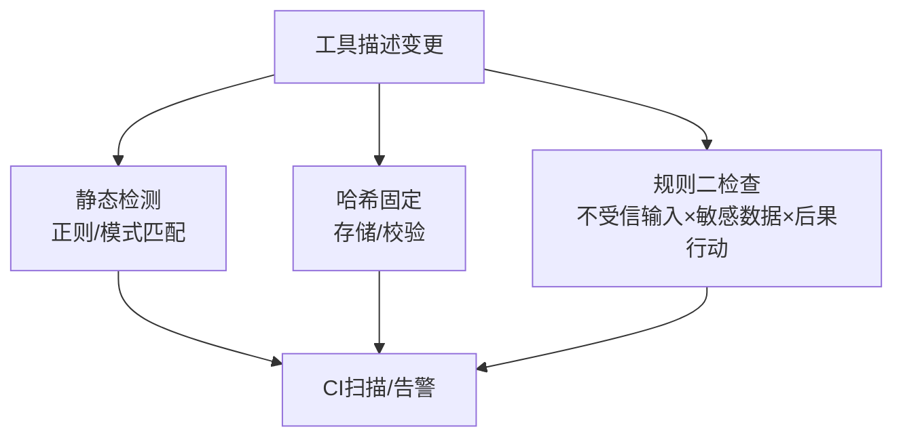

**图表来源**
- [MCP安全：工具污染:33-44](file://phases/13-tools-and-protocols/15-mcp-security-tool-poisoning/docs/en.md#L33-L44)
- [MCP安全：工具污染:71-80](file://phases/13-tools-and-protocols/15-mcp-security-tool-poisoning/docs/en.md#L71-L80)

**章节来源**
- [MCP安全：工具污染:17-32](file://phases/13-tools-and-protocols/15-mcp-security-tool-poisoning/docs/en.md#L17-L32)
- [MCP安全：工具污染:81-95](file://phases/13-tools-and-protocols/15-mcp-security-tool-poisoning/docs/en.md#L81-L95)

### 认证与授权：OAuth 2.1与受众绑定
生产环境需实现OAuth 2.1认证，包括客户端注册（CIMD优先，DCR回退）、JWKS缓存刷新、受众绑定（aud）与Mix-up攻击防护。

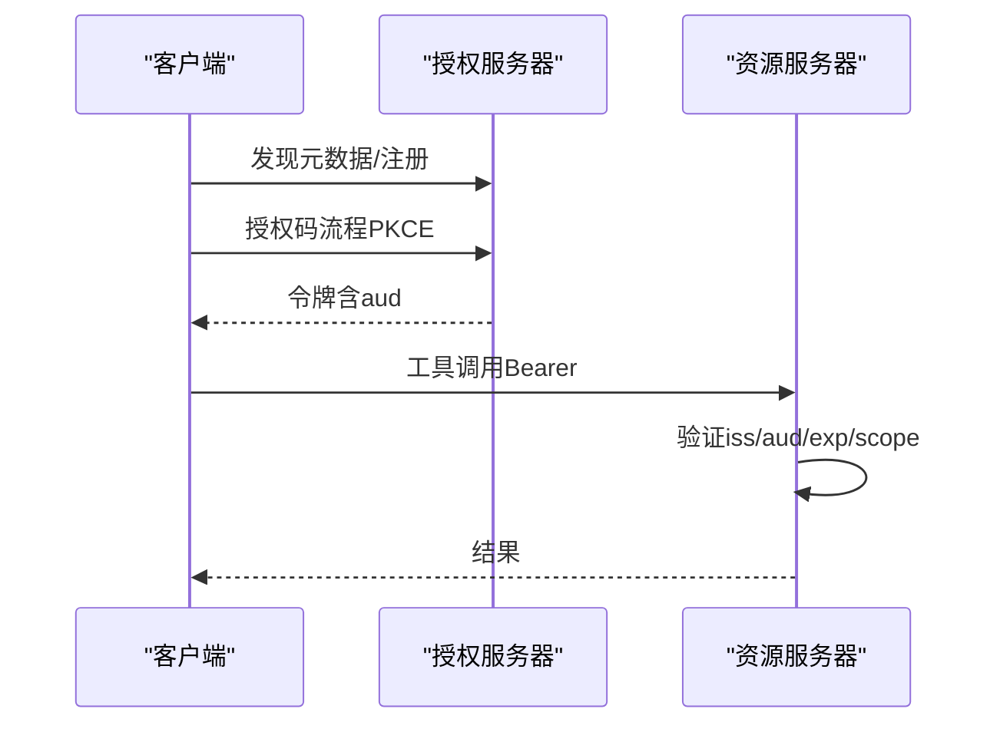

**图表来源**
- [MCP生产环境认证:35-64](file://phases/13-tools-and-protocols/18-mcp-auth-production/docs/en.md#L35-L64)
- [MCP生产环境认证:147-167](file://phases/13-tools-and-protocols/18-mcp-auth-production/docs/en.md#L147-L167)

**章节来源**
- [MCP生产环境认证:21-32](file://phases/13-tools-and-protocols/18-mcp-auth-production/docs/en.md#L21-L32)
- [MCP生产环境认证:155-167](file://phases/13-tools-and-protocols/18-mcp-auth-production/docs/en.md#L155-L167)

### TypeScript综合实现示例
仓库提供了TypeScript端的MCP服务器骨架，展示从协议初始化、工具/资源/提示词到任务执行的完整链路，便于理解协议在真实项目中的落地方式。

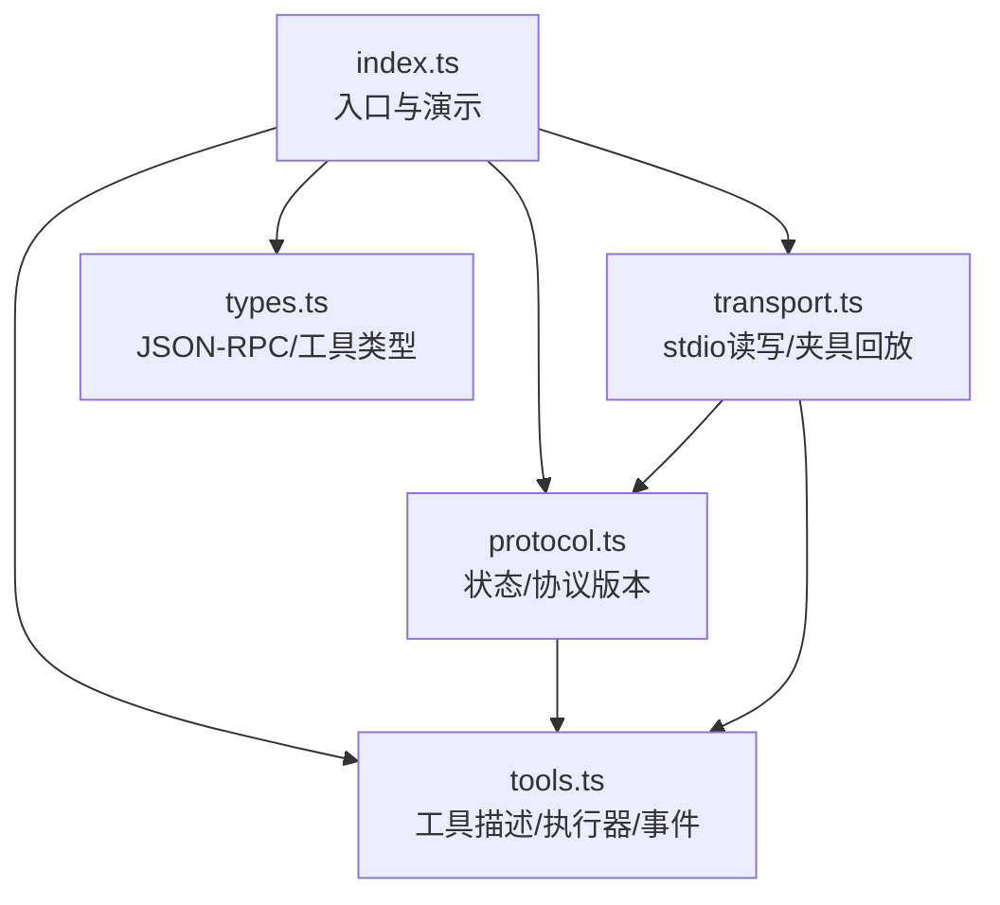

**图表来源**
- [MCP服务器与注册表项目:1-29](file://phases/19-capstone-projects/13-mcp-server-with-registry/code/ts/README.md#L1-L29)
- [MCP服务器入口:1-12](file://phases/19-capstone-projects/13-mcp-server-with-registry/code/ts/src/index.ts#L1-L12)

**章节来源**
- [MCP服务器与注册表项目:1-30](file://phases/19-capstone-projects/13-mcp-server-with-registry/code/ts/README.md#L1-L30)
- [MCP服务器入口:1-12](file://phases/19-capstone-projects/13-mcp-server-with-registry/code/ts/src/index.ts#L1-L12)

## 依赖关系分析
- 模块耦合
  - 服务器与客户端通过JSON-RPC对称消息耦合，能力协商决定可用特性
  - 传输层抽象（stdio/HTTP）与业务逻辑解耦，便于替换
- 外部依赖
  - OAuth 2.1与OpenID Connect用于认证
  - JWKS用于公钥验证
  - SSE用于远程事件推送

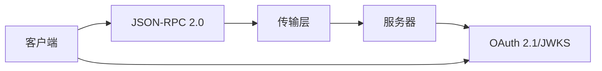

**图表来源**
- [MCP基础概念:110-113](file://phases/13-tools-and-protocols/06-mcp-fundamentals/docs/en.md#L110-L113)
- [MCP传输层:35-41](file://phases/13-tools-and-protocols/09-mcp-transports/docs/en.md#L35-L41)
- [MCP生产环境认证:155-167](file://phases/13-tools-and-protocols/18-mcp-auth-production/docs/en.md#L155-L167)

**章节来源**
- [MCP基础概念:110-113](file://phases/13-tools-and-protocols/06-mcp-fundamentals/docs/en.md#L110-L113)
- [MCP传输层:35-41](file://phases/13-tools-and-protocols/09-mcp-transports/docs/en.md#L35-L41)
- [MCP生产环境认证:155-167](file://phases/13-tools-and-protocols/18-mcp-auth-production/docs/en.md#L155-L167)

## 性能考量
- 本地开发优先使用stdio，避免网络开销
- 远程部署采用Streamable HTTP，利用单端点减少连接管理复杂度
- SSE长连接需注意重连与事件丢失恢复（last-event-id）
- 工具调用应尽量使用批量/并发（在客户端实现中体现）
- 资源订阅优于轮询，降低带宽与CPU消耗

[本节为通用指导，无需具体文件分析]

## 故障排除指南
- 握手失败
  - 检查initialize参数与capabilities声明是否一致
  - 确认notifications/initialized已发送
- 传输问题
  - stdio：SIGPIPE、EOF处理；确保每条消息后flush
  - HTTP：检查Mcp-Session-Id一致性与Origin白名单
- 认证失败
  - 核对iss/aud/exp/scope验证链
  - 确保JWKS缓存定时刷新，避免key轮转导致的验证失败
- 安全告警
  - 工具描述变更触发静态检测或哈希不匹配
  - 实施规则二，避免一次调用同时涉及三类高风险元素

**章节来源**
- [MCP传输层:85-92](file://phases/13-tools-and-protocols/09-mcp-transports/docs/en.md#L85-L92)
- [MCP生产环境认证:248-257](file://phases/13-tools-and-protocols/18-mcp-auth-production/docs/en.md#L248-L257)
- [MCP安全：工具污染:81-95](file://phases/13-tools-and-protocols/15-mcp-security-tool-poisoning/docs/en.md#L81-L95)

## 结论
MCP协议通过标准化的原语、生命周期与线缆格式，为模型与工具生态提供了统一接口。结合恰当的传输层选择、安全与认证策略，开发者可以快速构建可互操作、可扩展且安全的MCP集成方案。建议从基础概念入手，逐步掌握握手、消息格式、命名空间合并与认证授权，再过渡到远程部署与高级特性（采样、资源订阅、提示词模板）。

[本节为总结性内容，无需具体文件分析]

## 附录
- 版本兼容性
  - 使用2025-11-25规范作为基准，逐步引入新特性（如异步任务、URL模式引导等）
- 最佳实践
  - 服务器端：明确声明能力、严格错误处理、资源与工具分离
  - 客户端：多服务器合并、命名空间冲突处理、后台读取队列
  - 传输层：本地stdio、远程Streamable HTTP
  - 安全：哈希固定、静态检测、规则二、受众绑定
  - 认证：CIMD优先、JWKS缓存刷新、Mix-up防护

[本节为通用指导，无需具体文件分析]