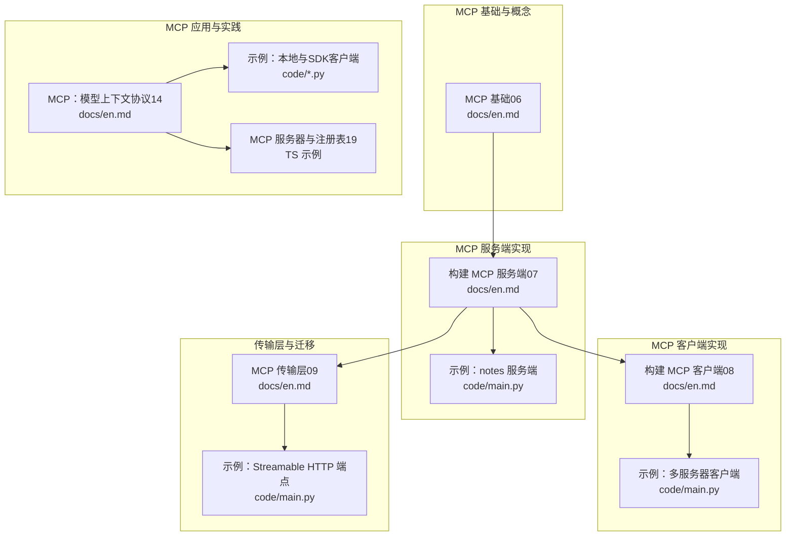
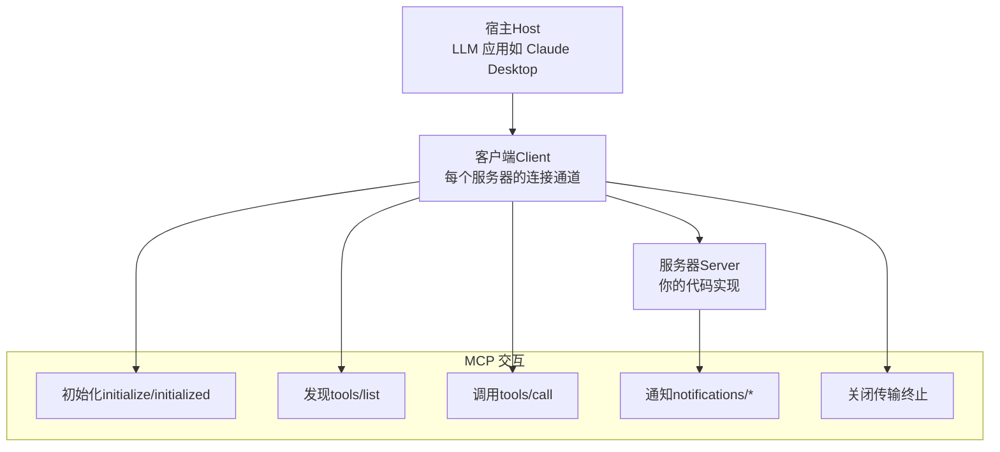
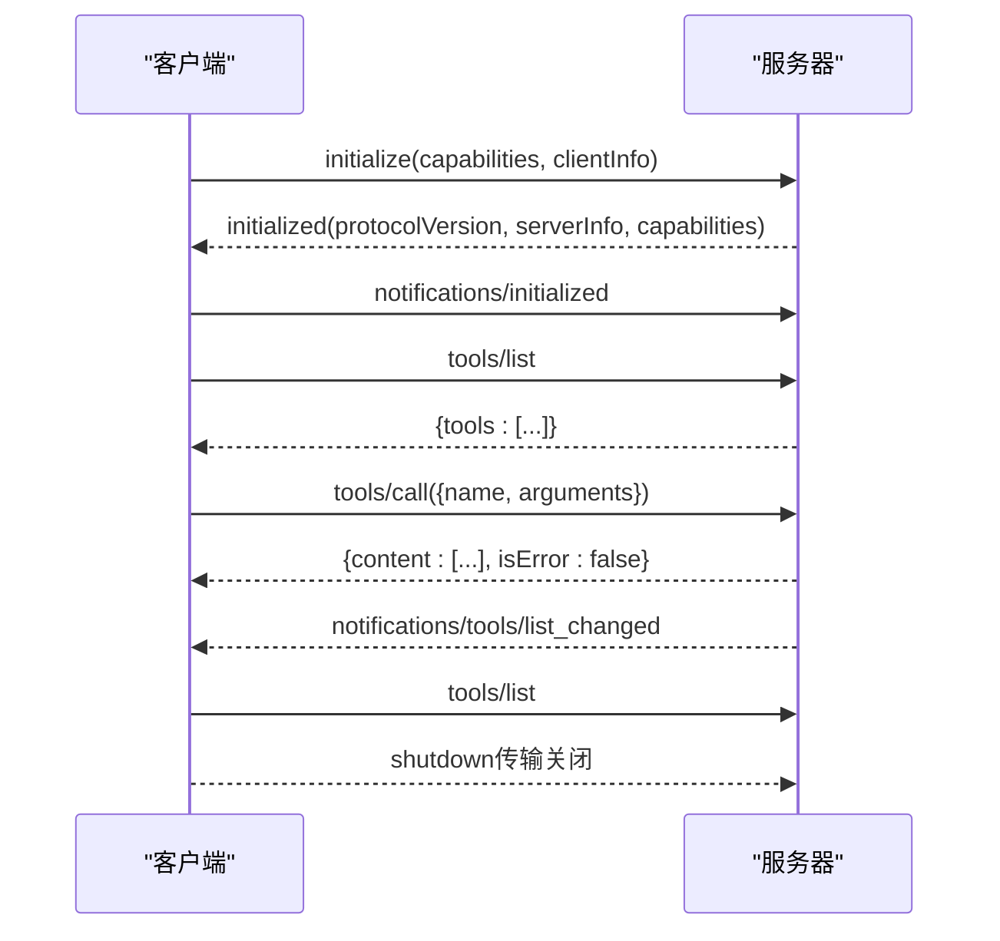
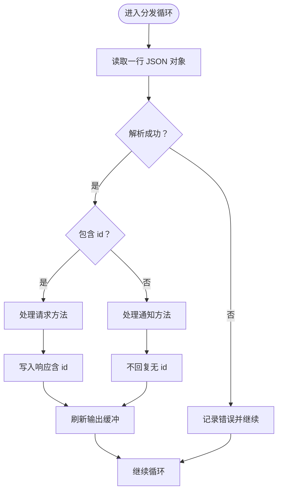
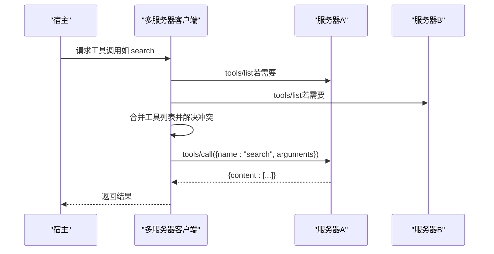
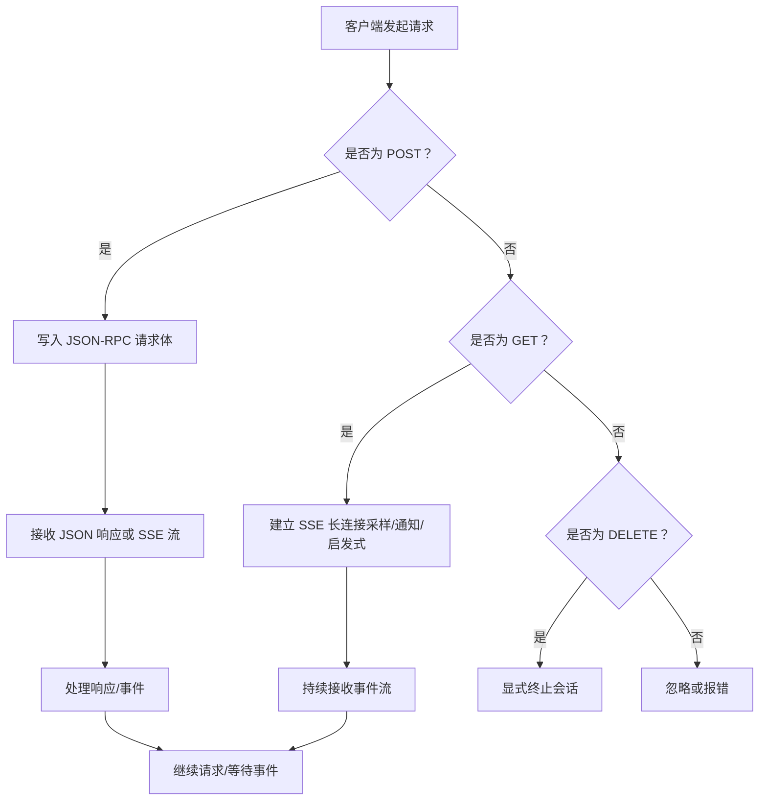
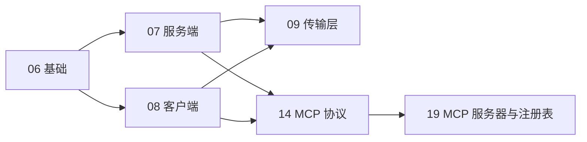

# MCP协议详解

<cite>
**本文档引用的文件**
- [phases/11-llm-engineering/14-model-context-protocol/docs/en.md](file://phases/11-llm-engineering/14-model-context-protocol/docs/en.md)
- [phases/13-tools-and-protocols/06-mcp-fundamentals/docs/en.md](file://phases/13-tools-and-protocols/06-mcp-fundamentals/docs/en.md)
- [phases/13-tools-and-protocols/07-building-an-mcp-server/docs/en.md](file://phases/13-tools-and-protocols/07-building-an-mcp-server/docs/en.md)
- [phases/13-tools-and-protocols/08-building-an-mcp-client/docs/en.md](file://phases/13-tools-and-protocols/08-building-an-mcp-client/docs/en.md)
- [phases/13-tools-and-protocols/09-mcp-transports/docs/en.md](file://phases/13-tools-and-protocols/09-mcp-transports/docs/en.md)
- [phases/11-llm-engineering/14-model-context-protocol/code/main.py](file://phases/11-llm-engineering/14-model-context-protocol/code/main.py)
- [phases/11-llm-engineering/14-model-context-protocol/code/test_client.py](file://phases/11-llm-engineering/14-model-context-protocol/code/test_client.py)
- [phases/11-llm-engineering/14-model-context-protocol/code/test_sdk_client.py](file://phases/11-llm-engineering/14-model-context-protocol/code/test_sdk_client.py)
- [phases/13-tools-and-protocols/07-building-an-mcp-server/code/main.py](file://phases/13-tools-and-protocols/07-building-an-mcp-server/code/main.py)
- [phases/13-tools-and-protocols/08-building-an-mcp-client/code/main.py](file://phases/13-tools-and-protocols/08-building-an-mcp-client/code/main.py)
- [phases/13-tools-and-protocols/09-mcp-transports/code/main.py](file://phases/13-tools-and-protocols/09-mcp-transports/code/main.py)
- [phases/19-capstone-projects/13-mcp-server-with-registry/code/ts/src/index.ts](file://phases/19-capstone-projects/13-mcp-server-with-registry/code/ts/src/index.ts)
- [phases/19-capstone-projects/13-mcp-server-with-registry/code/ts/README.md](file://phases/19-capstone-projects/13-mcp-server-with-registry/code/ts/README.md)
</cite>

## 目录
1. [引言](#引言)
2. [项目结构](#项目结构)
3. [核心组件](#核心组件)
4. [架构总览](#架构总览)
5. [详细组件分析](#详细组件分析)
6. [依赖关系分析](#依赖关系分析)
7. [性能考虑](#性能考虑)
8. [故障排除指南](#故障排除指南)
9. [结论](#结论)
10. [附录](#附录)

## 引言
本文件系统性梳理并阐述 Model Context Protocol（MCP）协议的设计理念与实现要点，覆盖握手流程、消息格式、会话管理、传输层选择（stdio、Streamable HTTP）、资源与提示词管理、采样与启发式触发、异步任务与应用集成等主题。文档以仓库中的官方教程与示例代码为基础，结合图示帮助读者从概念到实现逐步掌握 MCP 的全栈能力。

## 项目结构
围绕 MCP 的学习路径由多个阶段构成，涵盖基础概念、服务端与客户端实现、传输层迁移、资源与提示词管理、采样与启发式触发、异步任务以及应用集成等主题。下图展示与本专题直接相关的课程与示例代码组织：

**图表来源**
- [phases/13-tools-and-protocols/06-mcp-fundamentals/docs/en.md:1-167](file://phases/13-tools-and-protocols/06-mcp-fundamentals/docs/en.md#L1-L167)
- [phases/13-tools-and-protocols/07-building-an-mcp-server/docs/en.md:1-175](file://phases/13-tools-and-protocols/07-building-an-mcp-server/docs/en.md#L1-L175)
- [phases/13-tools-and-protocols/08-building-an-mcp-client/docs/en.md:1-144](file://phases/13-tools-and-protocols/08-building-an-mcp-client/docs/en.md#L1-L144)
- [phases/13-tools-and-protocols/09-mcp-transports/docs/en.md:1-145](file://phases/13-tools-and-protocols/09-mcp-transports/docs/en.md#L1-L145)
- [phases/11-llm-engineering/14-model-context-protocol/docs/en.md:1-207](file://phases/11-llm-engineering/14-model-context-protocol/docs/en.md#L1-L207)
- [phases/19-capstone-projects/13-mcp-server-with-registry/code/ts/src/index.ts:1-12](file://phases/19-capstone-projects/13-mcp-server-with-registry/code/ts/src/index.ts#L1-L12)

**章节来源**
- [phases/11-llm-engineering/14-model-context-protocol/docs/en.md:1-207](file://phases/11-llm-engineering/14-model-context-protocol/docs/en.md#L1-L207)
- [phases/13-tools-and-protocols/06-mcp-fundamentals/docs/en.md:1-167](file://phases/13-tools-and-protocols/06-mcp-fundamentals/docs/en.md#L1-L167)
- [phases/13-tools-and-protocols/07-building-an-mcp-server/docs/en.md:1-175](file://phases/13-tools-and-protocols/07-building-an-mcp-server/docs/en.md#L1-L175)
- [phases/13-tools-and-protocols/08-building-an-mcp-client/docs/en.md:1-144](file://phases/13-tools-and-protocols/08-building-an-mcp-client/docs/en.md#L1-L144)
- [phases/13-tools-and-protocols/09-mcp-transports/docs/en.md:1-145](file://phases/13-tools-and-protocols/09-mcp-transports/docs/en.md#L1-L145)

## 核心组件
- 三类服务端原语（Server Primitives）
  - 工具（Tools）：模型可调用的动作，包含名称、描述、输入模式与处理器；结果以结构化内容块返回。
  - 资源（Resources）：只读内容，通过 URI 地址访问（如 file://、db://），支持清单列出与读取，部分场景支持订阅更新。
  - 提示词（Prompts）：用户可调用的模板，常作为主机 UI 中的斜杠命令，服务端提供模板与参数占位。
- 三类客户端原语（Client Primitives）
  - 根（Roots）：服务器被允许访问的 URI 集合，用于作用域约束。
  - 采样（Sampling）：服务器请求客户端模型执行一次补全，用于在不暴露密钥的情况下进行代理循环。
  - 启发式（Elicitation）：服务器请求客户端用户进行结构化输入（表单或 URL）。
- 消息与生命周期
  - 基于 JSON-RPC 2.0 的对称请求/响应/通知格式。
  - 三阶段生命周期：初始化（initialize/initialized）、操作（双向工具发现与调用、通知、采样等）、关闭（任意一方终止传输）。
- 协商与安全
  - 初始化阶段进行能力协商，未声明的能力不应被使用。
  - 安全建议：根作用域、破坏性动作的人类确认、工具毒化防护（资源内容不可信任）。

**章节来源**
- [phases/11-llm-engineering/14-model-context-protocol/docs/en.md:20-130](file://phases/11-llm-engineering/14-model-context-protocol/docs/en.md#L20-L130)
- [phases/13-tools-and-protocols/06-mcp-fundamentals/docs/en.md:27-113](file://phases/13-tools-and-protocols/06-mcp-fundamentals/docs/en.md#L27-L113)

## 架构总览
下图展示了 MCP 在典型宿主环境中的角色分工与交互：宿主（LLM 应用）负责模型与用户界面，客户端子组件负责与一个或多个 MCP 服务器建立连接，服务器负责暴露工具、资源与提示词，并在协商的能力范围内进行交互。

**图表来源**
- [phases/11-llm-engineering/14-model-context-protocol/docs/en.md:34-75](file://phases/11-llm-engineering/14-model-context-protocol/docs/en.md#L34-L75)
- [phases/13-tools-and-protocols/06-mcp-fundamentals/docs/en.md:60-73](file://phases/13-tools-and-protocols/06-mcp-fundamentals/docs/en.md#L60-L73)

## 详细组件分析

### 组件A：MCP 握手与生命周期
- 初始化阶段
  - 客户端发送 initialize，包含客户端信息与能力声明；服务器返回协议版本、服务器信息与能力集合。
  - 双方基于协商结果决定后续可用特性。
- 操作阶段
  - 客户端调用 tools/list 发现工具集；随后通过 tools/call 执行工具。
  - 服务器可发送通知（如 tools/list_changed、resources/updated、progress）；客户端据此刷新状态。
- 关闭阶段
  - 任一方关闭传输；stdio 下通过 EOF 表示结束，HTTP 下通过 DELETE 或连接断开表示。

**图表来源**
- [phases/13-tools-and-protocols/06-mcp-fundamentals/docs/en.md:60-73](file://phases/13-tools-and-protocols/06-mcp-fundamentals/docs/en.md#L60-L73)
- [phases/11-llm-engineering/14-model-context-protocol/docs/en.md:34-75](file://phases/11-llm-engineering/14-model-context-protocol/docs/en.md#L34-L75)

**章节来源**
- [phases/13-tools-and-protocols/06-mcp-fundamentals/docs/en.md:60-113](file://phases/13-tools-and-protocols/06-mcp-fundamentals/docs/en.md#L60-L113)
- [phases/11-llm-engineering/14-model-context-protocol/docs/en.md:34-75](file://phases/11-llm-engineering/14-model-context-protocol/docs/en.md#L34-L75)

### 组件B：MCP 服务端实现（Python）
- 核心职责
  - 实现 initialize、tools/list、tools/call、resources/list、resources/read、prompts/list、prompts/get 等方法。
  - 实现 JSON-RPC 转发循环，区分请求与通知，严格匹配 id 并正确返回响应。
- 结构化内容与错误
  - 工具返回内容采用 typed blocks（text、image、resource 等）；工具级失败通过 isError 字段标识。
  - 使用 JSON-RPC 错误码与 MCP 特定错误数据。
- 安全注解
  - 工具可携带只读、破坏性、幂等等注解，辅助客户端决策 UX 与路由。
- 迁移到 SDK
  - 从纯手工实现迁移到 FastMCP（Python SDK）或 TypeScript SDK，保持相同 wire 行为。

**图表来源**
- [phases/13-tools-and-protocols/07-building-an-mcp-server/docs/en.md:27-44](file://phases/13-tools-and-protocols/07-building-an-mcp-server/docs/en.md#L27-L44)

**章节来源**
- [phases/13-tools-and-protocols/07-building-an-mcp-server/docs/en.md:10-122](file://phases/13-tools-and-protocols/07-building-an-mcp-server/docs/en.md#L10-L122)
- [phases/13-tools-and-protocols/07-building-an-mcp-server/code/main.py](file://phases/13-tools-and-protocols/07-building-an-mcp-server/code/main.py)

### 组件C：MCP 客户端实现（多服务器聚合）
- 多进程与会话管理
  - 为每个服务器启动子进程，独立完成握手与初始化；维护每服务器会话状态（能力、工具列表、待处理请求映射）。
- 命名空间合并与冲突处理
  - 将来自多个服务器的工具列表扁平化；当出现同名冲突时，采用前缀命名、静默覆盖或拒绝加载等策略。
- 路由与并发
  - 基于工具名到会话的映射进行路由；使用后台线程或异步队列避免阻塞。
- 通知与重连
  - 处理 tools/list_changed、resources/updated 等通知；检测 EOF 并按策略重启或上报。
- 采样回调
  - 若服务器声明 sampling 能力，需阻塞后续请求直至采样完成，再回传结果。

**图表来源**
- [phases/13-tools-and-protocols/08-building-an-mcp-client/docs/en.md:30-84](file://phases/13-tools-and-protocols/08-building-an-mcp-client/docs/en.md#L30-L84)

**章节来源**
- [phases/13-tools-and-protocols/08-building-an-mcp-client/docs/en.md:10-108](file://phases/13-tools-and-protocols/08-building-an-mcp-client/docs/en.md#L10-L108)
- [phases/13-tools-and-protocols/08-building-an-mcp-client/code/main.py](file://phases/13-tools-and-protocols/08-building-an-mcp-client/code/main.py)

### 组件D：传输层协议与迁移
- stdio（本地）
  - 子进程模型，消息为换行分隔的 JSON 对象；无会话 id；适合本地开发。
- Streamable HTTP（远程）
  - 单端点设计：POST 处理请求，GET 建立长连接用于 SSE 推送（服务器发起的消息，如采样、通知、启发式）；DELETE 显式终止会话。
  - 会话由 Mcp-Session-Id 头部标识，必须为加密强度随机值；Origin 白名单防御 DNS 重绑定攻击。
  - 支持 last-event-id 回放，保证网络中断后的事件连续性。
- 迁移建议
  - 从旧版 HTTP+SSE（两终点）迁移到 Streamable HTTP（单端点）；保留向后兼容探测逻辑。

**图表来源**
- [phases/13-tools-and-protocols/09-mcp-transports/docs/en.md:35-67](file://phases/13-tools-and-protocols/09-mcp-transports/docs/en.md#L35-L67)

**章节来源**
- [phases/13-tools-and-protocols/09-mcp-transports/docs/en.md:17-106](file://phases/13-tools-and-protocols/09-mcp-transports/docs/en.md#L17-L106)
- [phases/13-tools-and-protocols/09-mcp-transports/code/main.py](file://phases/13-tools-and-protocols/09-mcp-transports/code/main.py)

### 组件E：资源与提示词管理
- 资源（Resources）
  - 通过 URI 访问只读内容；支持列出与读取；部分场景支持订阅更新（resources/subscribe）。
  - 设计原则：大对象分页或摘要化，避免浪费上下文；谨慎暴露敏感路径（结合 Roots 限制）。
- 提示词（Prompts）
  - 模板化，带参数槽位；宿主 UI 以斜杠命令形式呈现；服务端提供模板与默认值。
- 版本与变更
  - 工具集变更时发出 tools/list_changed 通知；客户端应重新拉取工具列表。
  - 资源更新时发出 resources/updated 通知；客户端按需重新读取。

**章节来源**
- [phases/11-llm-engineering/14-model-context-protocol/docs/en.md:121-137](file://phases/11-llm-engineering/14-model-context-protocol/docs/en.md#L121-L137)
- [phases/13-tools-and-protocols/07-building-an-mcp-server/docs/en.md:76-88](file://phases/13-tools-and-protocols/07-building-an-mcp-server/docs/en.md#L76-L88)

### 组件F：采样策略与启发式触发
- 采样（Sampling）
  - 服务器声明 sampling 能力后，可在运行中请求客户端模型生成一次补全；客户端应阻塞该服务器的进一步请求直至采样完成。
- 启发式（Elicitation）
  - 服务器请求用户在运行中提供结构化输入（表单或 URL），用于中间态决策。
- 与代理循环的结合
  - 无需服务器侧持有 API 密钥即可实现“服务器托管”的代理循环。

**章节来源**
- [phases/13-tools-and-protocols/06-mcp-fundamentals/docs/en.md:35-41](file://phases/13-tools-and-protocols/06-mcp-fundamentals/docs/en.md#L35-L41)
- [phases/11-llm-engineering/14-model-context-protocol/docs/en.md:121-129](file://phases/11-llm-engineering/14-model-context-protocol/docs/en.md#L121-L129)

### 组件G：异步任务与应用集成
- 异步任务（Tasks）
  - 服务器可提交异步任务，客户端在任务生命周期内进行进度跟踪与状态查询；任务可跨会话重连存活。
- 应用集成
  - 将 MCP 作为统一的工具与上下文协议接入各类宿主（桌面、编辑器、Web 应用）；通过网关聚合多个服务器，对外暴露单一逻辑服务面。
- TypeScript 示例
  - 仓库提供了基于手写 stdio JSON-RPC 的 TypeScript 示例，便于理解底层细节与协议字节流。

**章节来源**
- [phases/13-tools-and-protocols/06-mcp-fundamentals/docs/en.md:25-26](file://phases/13-tools-and-protocols/06-mcp-fundamentals/docs/en.md#L25-L26)
- [phases/19-capstone-projects/13-mcp-server-with-registry/code/ts/src/index.ts:1-12](file://phases/19-capstone-projects/13-mcp-server-with-registry/code/ts/src/index.ts#L1-L12)
- [phases/19-capstone-projects/13-mcp-server-with-registry/code/ts/README.md:1-29](file://phases/19-capstone-projects/13-mcp-server-with-registry/code/ts/README.md#L1-L29)

## 依赖关系分析
- 教程依赖链
  - 06 基础 → 07 服务端 → 08 客户端 → 09 传输层 → 14 MCP 协议 → 19 MCP 服务器与注册表。
- 代码依赖链
  - 服务端示例（notes）与客户端示例（多服务器）复用相同的协议与消息格式，确保行为一致性。
  - 传输层示例（Streamable HTTP）与服务端示例共享同一套方法分发逻辑，验证跨传输的一致性。

**图表来源**
- [phases/13-tools-and-protocols/06-mcp-fundamentals/docs/en.md:1-26](file://phases/13-tools-and-protocols/06-mcp-fundamentals/docs/en.md#L1-L26)
- [phases/13-tools-and-protocols/07-building-an-mcp-server/docs/en.md:1-10](file://phases/13-tools-and-protocols/07-building-an-mcp-server/docs/en.md#L1-L10)
- [phases/13-tools-and-protocols/08-building-an-mcp-client/docs/en.md:1-10](file://phases/13-tools-and-protocols/08-building-an-mcp-client/docs/en.md#L1-L10)
- [phases/13-tools-and-protocols/09-mcp-transports/docs/en.md:1-10](file://phases/13-tools-and-protocols/09-mcp-transports/docs/en.md#L1-L10)
- [phases/11-llm-engineering/14-model-context-protocol/docs/en.md:1-10](file://phases/11-llm-engineering/14-model-context-protocol/docs/en.md#L1-L10)
- [phases/19-capstone-projects/13-mcp-server-with-registry/code/ts/README.md:8-19](file://phases/19-capstone-projects/13-mcp-server-with-registry/code/ts/README.md#L8-L19)

**章节来源**
- [phases/13-tools-and-protocols/06-mcp-fundamentals/docs/en.md:1-26](file://phases/13-tools-and-protocols/06-mcp-fundamentals/docs/en.md#L1-L26)
- [phases/13-tools-and-protocols/07-building-an-mcp-server/docs/en.md:1-10](file://phases/13-tools-and-protocols/07-building-an-mcp-server/docs/en.md#L1-L10)
- [phases/13-tools-and-protocols/08-building-an-mcp-client/docs/en.md:1-10](file://phases/13-tools-and-protocols/08-building-an-mcp-client/docs/en.md#L1-L10)
- [phases/13-tools-and-protocols/09-mcp-transports/docs/en.md:1-10](file://phases/13-tools-and-protocols/09-mcp-transports/docs/en.md#L1-L10)
- [phases/11-llm-engineering/14-model-context-protocol/docs/en.md:1-10](file://phases/11-llm-engineering/14-model-context-protocol/docs/en.md#L1-L10)
- [phases/19-capstone-projects/13-mcp-server-with-registry/code/ts/README.md:8-19](file://phases/19-capstone-projects/13-mcp-server-with-registry/code/ts/README.md#L8-L19)

## 性能考虑
- 工具数量与上下文预算
  - 工具过多会导致上下文预算紧张，建议拆分为领域化的服务器，避免超过模型的工具承载上限。
- 资源体积与分页
  - 大型资源应分页或摘要化，减少上下文占用。
- 传输选择
  - 本地开发优先 stdio；远程部署使用 Streamable HTTP，具备会话连续性与 DNS 重绑定防护。
- 并发与背压
  - 客户端应支持多服务器并发请求与排队；服务器应避免阻塞主线程，必要时引入异步任务与进度通知。

## 故障排除指南
- 常见问题
  - 工具列表漂移：模型看到的工具列表与当前不一致，需监听 tools/list_changed 并重新拉取。
  - stdio 死锁：日志输出到 stdout 会污染 JSON-RPC 流，应改用 stderr。
  - SSE 断连：客户端需基于 Mcp-Session-Id 与 last-event-id 重连并回放事件。
  - 版本不一致：不同规范修订可能引入破坏性字段，应在 CI 中固定协议版本。
- 安全检查
  - 根作用域（Roots）必须严格执行；破坏性工具必须要求人类确认；资源内容不可直接注入系统提示词。

**章节来源**
- [phases/11-llm-engineering/14-model-context-protocol/docs/en.md:131-138](file://phases/11-llm-engineering/14-model-context-protocol/docs/en.md#L131-L138)

## 结论
MCP 通过标准化的 JSON-RPC 2.0 消息格式与三类原语（工具、资源、提示词），以及明确的握手与生命周期，为 LLM 与工具、数据源、代理框架之间建立了通用的连接协议。配合多服务器客户端的命名空间合并、传输层的会话与安全机制、以及采样与异步任务等高级能力，MCP 能够支撑从本地开发到企业级生产的全栈应用场景。建议在生产中遵循能力协商、根作用域、破坏性动作确认与工具毒化防护等安全实践，并根据部署形态选择合适的传输层。

## 附录
- 快速参考
  - 三类服务端原语：tools、resources、prompts
  - 三类客户端原语：roots、sampling、elicitation
  - 生命周期：initialize → 操作 → shutdown
  - 传输：stdio（本地）、Streamable HTTP（远程）
- 相关文件索引
  - [phases/11-llm-engineering/14-model-context-protocol/docs/en.md](file://phases/11-llm-engineering/14-model-context-protocol/docs/en.md)
  - [phases/13-tools-and-protocols/06-mcp-fundamentals/docs/en.md](file://phases/13-tools-and-protocols/06-mcp-fundamentals/docs/en.md)
  - [phases/13-tools-and-protocols/07-building-an-mcp-server/docs/en.md](file://phases/13-tools-and-protocols/07-building-an-mcp-server/docs/en.md)
  - [phases/13-tools-and-protocols/08-building-an-mcp-client/docs/en.md](file://phases/13-tools-and-protocols/08-building-an-mcp-client/docs/en.md)
  - [phases/13-tools-and-protocols/09-mcp-transports/docs/en.md](file://phases/13-tools-and-protocols/09-mcp-transports/docs/en.md)
  - [phases/19-capstone-projects/13-mcp-server-with-registry/code/ts/src/index.ts](file://phases/19-capstone-projects/13-mcp-server-with-registry/code/ts/src/index.ts)