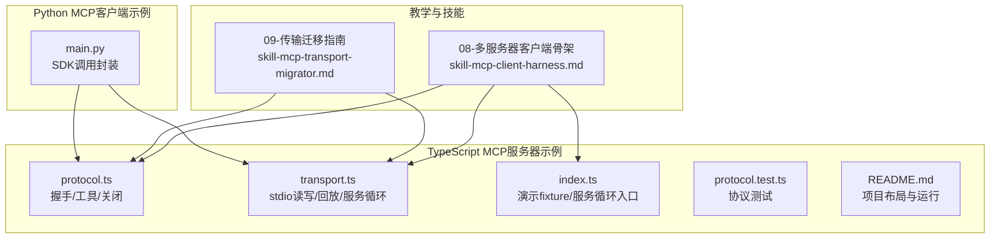
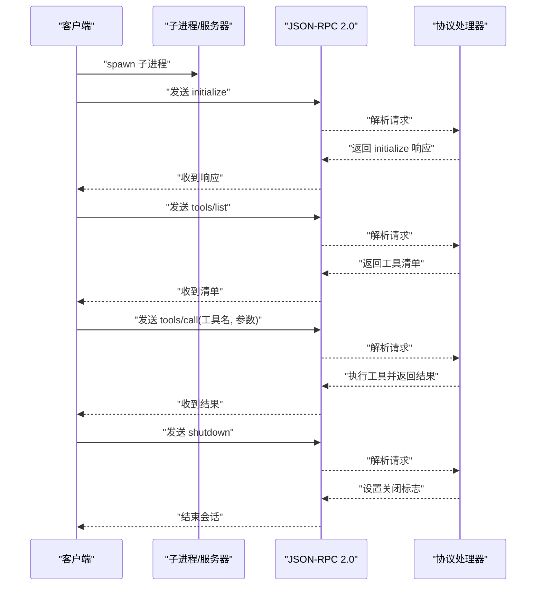
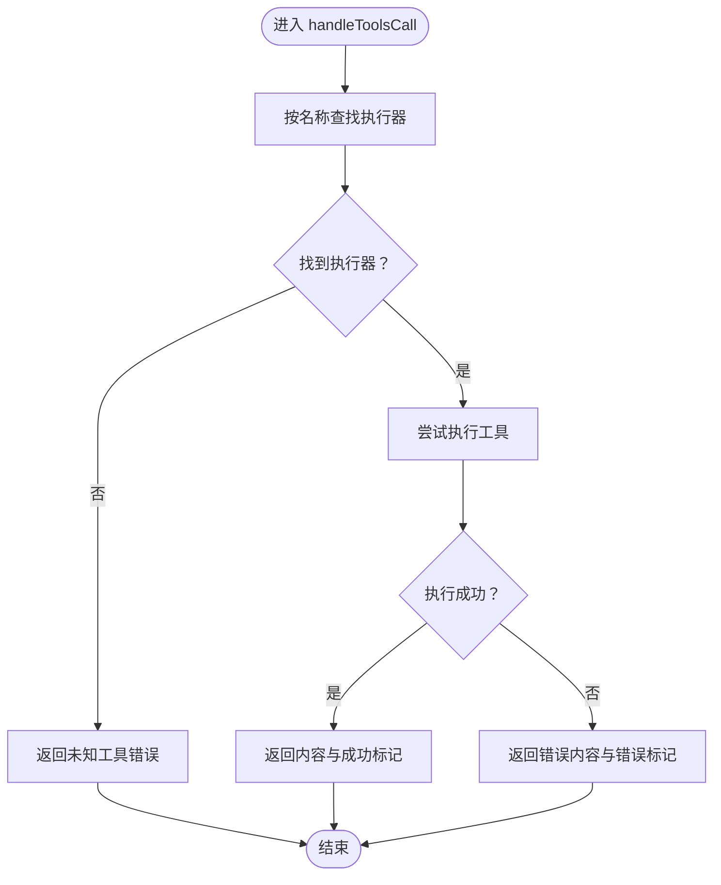
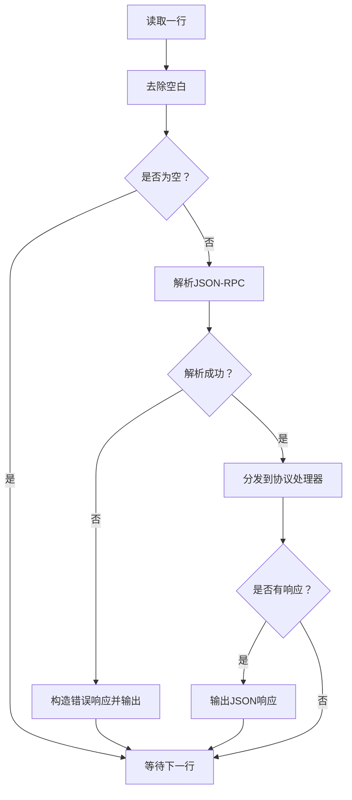
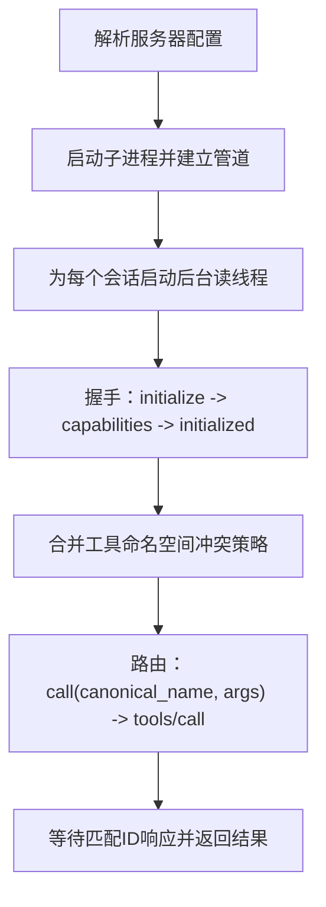
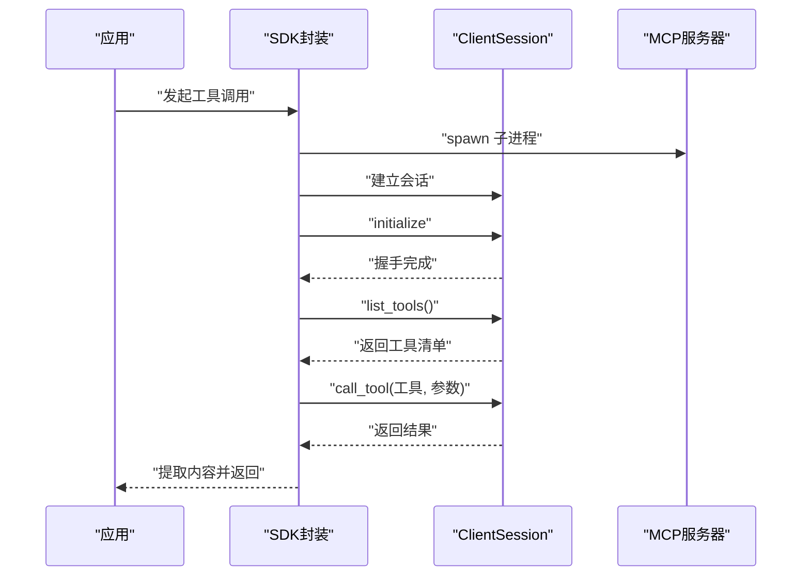
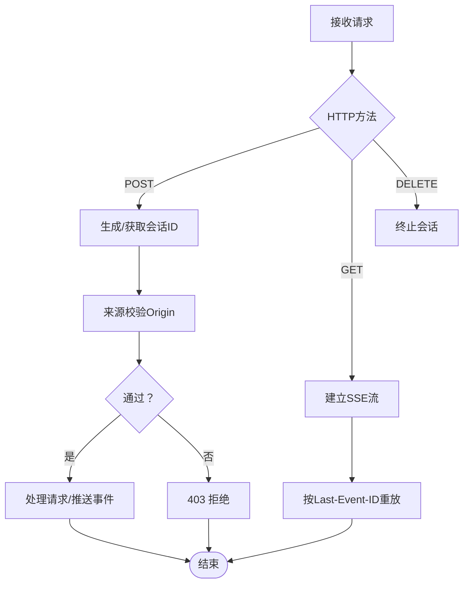

# MCP客户端开发

<cite>
**本文引用的文件**
- [skill-mcp-client-harness.md](file://phases/13-tools-and-protocols/08-building-an-mcp-client/outputs/skill-mcp-client-harness.md)
- [skill-mcp-transport-migrator.md](file://phases/13-tools-and-protocols/09-mcp-transports/outputs/skill-mcp-transport-migrator.md)
- [protocol.ts](file://phases/19-capstone-projects/13-mcp-server-with-registry/code/ts/src/protocol.ts)
- [transport.ts](file://phases/19-capstone-projects/13-mcp-server-with-registry/code/ts/src/transport.ts)
- [index.ts](file://phases/19-capstone-projects/13-mcp-server-with-registry/code/ts/src/index.ts)
- [protocol.test.ts](file://phases/19-capstone-projects/13-mcp-server-with-registry/code/ts/tests/protocol.test.ts)
- [main.py](file://phases/19-capstone-projects/13-mcp-server-with-registry/code/main.py)
- [README.md](file://phases/19-capstone-projects/13-mcp-server-with-registry/code/ts/README.md)
- [main.py](file://guardrails-sandbox/backend/main.py)
- [content.js](file://site/vue-app/summary/src/data/content.js)
- [data.js](file://site/data.js)
</cite>

## 目录
1. [引言](#引言)
2. [项目结构](#项目结构)
3. [核心组件](#核心组件)
4. [架构总览](#架构总览)
5. [详细组件分析](#详细组件分析)
6. [依赖关系分析](#依赖关系分析)
7. [性能考虑](#性能考虑)
8. [故障排除指南](#故障排除指南)
9. [结论](#结论)
10. [附录](#附录)

## 引言
本指南面向MCP客户端开发者，系统阐述客户端架构设计与连接管理机制，覆盖连接建立、认证流程、会话维护、请求构建与发送、响应解析与数据处理、配置管理与性能优化，并提供同步/异步调用、批量与流式处理等高级用法的实践路径。文档以仓库中的教学材料与示例代码为基础，结合JSON-RPC 2.0与MCP协议规范，帮助读者从零搭建稳定、可扩展且可观测的MCP客户端。

## 项目结构
围绕MCP客户端开发，仓库提供了多层级的教学与示例资源：
- 教学技能与迁移指南：定义了“多服务器客户端骨架”与“传输迁移”的任务目标与约束
- TypeScript MCP服务器示例：展示基于stdio的JSON-RPC 2.0实现，包含握手、工具清单与调用
- Python MCP客户端示例：演示使用官方SDK进行初始化、工具列举与调用
- 传输迁移指南：从HTTP+SSE迁移到Streamable HTTP的端点、会话与安全策略

**图表来源**
- [skill-mcp-client-harness.md:1-31](file://phases/13-tools-and-protocols/08-building-an-mcp-client/outputs/skill-mcp-client-harness.md#L1-L31)
- [skill-mcp-transport-migrator.md:1-31](file://phases/13-tools-and-protocols/09-mcp-transports/outputs/skill-mcp-transport-migrator.md#L1-L31)
- [protocol.ts:1-54](file://phases/19-capstone-projects/13-mcp-server-with-registry/code/ts/src/protocol.ts#L1-L54)
- [transport.ts:1-45](file://phases/19-capstone-projects/13-mcp-server-with-registry/code/ts/src/transport.ts#L1-L45)
- [index.ts:1-58](file://phases/19-capstone-projects/13-mcp-server-with-registry/code/ts/src/index.ts#L1-L58)
- [protocol.test.ts:1-32](file://phases/19-capstone-projects/13-mcp-server-with-registry/code/ts/tests/protocol.test.ts#L1-L32)
- [README.md:1-30](file://phases/19-capstone-projects/13-mcp-server-with-registry/code/ts/README.md#L1-L30)
- [main.py:300-421](file://guardrails-sandbox/backend/main.py#L300-L421)

**章节来源**
- [README.md:1-30](file://phases/19-capstone-projects/13-mcp-server-with-registry/code/ts/README.md#L1-L30)
- [data.js:13273-13314](file://site/data.js#L13273-L13314)

## 核心组件
- 协议与消息分发：负责initialize、tools/list、tools/call、shutdown等方法的解析与执行
- 传输层：基于Node readline的stdio传输，逐行读取JSON-RPC消息，支持回放与服务循环
- 客户端SDK封装：演示如何通过SDK完成握手、列举工具与调用工具
- 多服务器客户端骨架：定义配置解析、进程启动、后台读线程、握手流水线、命名空间合并与路由

**章节来源**
- [protocol.ts:1-54](file://phases/19-capstone-projects/13-mcp-server-with-registry/code/ts/src/protocol.ts#L1-L54)
- [transport.ts:1-45](file://phases/19-capstone-projects/13-mcp-server-with-registry/code/ts/src/transport.ts#L1-L45)
- [index.ts:1-58](file://phases/19-capstone-projects/13-mcp-server-with-registry/code/ts/src/index.ts#L1-L58)
- [main.py:300-421](file://guardrails-sandbox/backend/main.py#L300-L421)
- [skill-mcp-client-harness.md:1-31](file://phases/13-tools-and-protocols/08-building-an-mcp-client/outputs/skill-mcp-client-harness.md#L1-L31)

## 架构总览
下图展示了MCP客户端与多服务器的交互关系，以及握手、工具发现与调用的关键步骤。

**图表来源**
- [protocol.ts:25-54](file://phases/19-capstone-projects/13-mcp-server-with-registry/code/ts/src/protocol.ts#L25-L54)
- [transport.ts:7-23](file://phases/19-capstone-projects/13-mcp-server-with-registry/code/ts/src/transport.ts#L7-L23)
- [index.ts:14-50](file://phases/19-capstone-projects/13-mcp-server-with-registry/code/ts/src/index.ts#L14-L50)

## 详细组件分析

### 协议与消息分发（Protocol）
- 初始化：返回协议版本、能力与服务器信息
- 工具列表：返回已注册工具的描述
- 工具调用：根据名称查找执行器，捕获异常并返回错误或内容
- 关闭：标记关闭请求，触发服务端退出

**图表来源**
- [protocol.ts:37-49](file://phases/19-capstone-projects/13-mcp-server-with-registry/code/ts/src/protocol.ts#L37-L49)

**章节来源**
- [protocol.ts:1-54](file://phases/19-capstone-projects/13-mcp-server-with-registry/code/ts/src/protocol.ts#L1-L54)
- [protocol.test.ts:12-32](file://phases/19-capstone-projects/13-mcp-server-with-registry/code/ts/tests/protocol.test.ts#L12-L32)

### 传输层（Transport）
- 行解析：逐行读取stdin，trim后解析JSON-RPC；解析失败返回错误响应
- 回放：按顺序对一组请求进行分发并收集响应
- 服务循环：监听stdin，处理每行消息并在关闭标志触发后退出

**图表来源**
- [transport.ts:7-23](file://phases/19-capstone-projects/13-mcp-server-with-registry/code/ts/src/transport.ts#L7-L23)

**章节来源**
- [transport.ts:1-45](file://phases/19-capstone-projects/13-mcp-server-with-registry/code/ts/src/transport.ts#L1-L45)
- [index.ts:1-58](file://phases/19-capstone-projects/13-mcp-server-with-registry/code/ts/src/index.ts#L1-L58)

### 多服务器客户端骨架（Client Harness）
- 配置解析：将服务器配置映射为命令、参数与环境变量，校验命令存在
- 进程与读线程：使用子进程启动，stdout管道+后台读线程，避免阻塞主线程
- 握手流水线：发送initialize、等待响应、持久化能力、发送initialized通知
- 命名空间合并：冲突策略（默认前缀、拒绝、静默覆盖），打印合并后的工具列表
- 路由：根据工具名定位所属会话，写入tools/call并等待匹配ID的响应

**图表来源**
- [skill-mcp-client-harness.md:10-18](file://phases/13-tools-and-protocols/08-building-an-mcp-client/outputs/skill-mcp-client-harness.md#L10-L18)

**章节来源**
- [skill-mcp-client-harness.md:1-31](file://phases/13-tools-and-protocols/08-building-an-mcp-client/outputs/skill-mcp-client-harness.md#L1-L31)

### Python SDK客户端示例
- 使用SDK参数启动stdio子进程，建立ClientSession
- 初始化后进行工具列举与工具调用，读取结果文本内容
- 封装为同步调用，内部处理事件循环与线程池

**图表来源**
- [main.py:305-321](file://guardrails-sandbox/backend/main.py#L305-L321)

**章节来源**
- [main.py:300-421](file://guardrails-sandbox/backend/main.py#L300-L421)

### 传输迁移（从HTTP+SSE到Streamable HTTP）
- 端点重写：合并/messages与/sse至/mcp，POST用于请求，GET用于SSE流，DELETE终止会话
- 会话连续性：首次POST生成新会话ID，保留旧会话Cookie桥接逻辑
- 来源校验：生产环境允许特定Origin白名单，拒绝其他来源
- 最后事件ID重放：为每个会话维护最近事件环形缓冲，断连重连可续播
- 废弃窗口：标注切换日期与60天宽限期，旧端点301跳转并警告

**图表来源**
- [skill-mcp-transport-migrator.md:10-18](file://phases/13-tools-and-protocols/09-mcp-transports/outputs/skill-mcp-transport-migrator.md#L10-L18)

**章节来源**
- [skill-mcp-transport-migrator.md:1-31](file://phases/13-tools-and-protocols/09-mcp-transports/outputs/skill-mcp-transport-migrator.md#L1-L31)

## 依赖关系分析
- 协议层依赖类型定义与工具执行器，提供方法分发与错误包装
- 传输层依赖协议层进行消息分发，同时负责JSON解析与错误响应
- 客户端示例依赖SDK与子进程通信，完成握手与工具调用
- 多服务器骨架依赖各服务器进程与其stdout读线程，实现并发与隔离

**图表来源**
- [protocol.ts:1-16](file://phases/19-capstone-projects/13-mcp-server-with-registry/code/ts/src/protocol.ts#L1-L16)
- [transport.ts:1-3](file://phases/19-capstone-projects/13-mcp-server-with-registry/code/ts/src/transport.ts#L1-L3)
- [main.py:305-321](file://guardrails-sandbox/backend/main.py#L305-L321)
- [skill-mcp-client-harness.md:14-18](file://phases/13-tools-and-protocols/08-building-an-mcp-client/outputs/skill-mcp-client-harness.md#L14-L18)

**章节来源**
- [protocol.ts:1-54](file://phases/19-capstone-projects/13-mcp-server-with-registry/code/ts/src/protocol.ts#L1-L54)
- [transport.ts:1-45](file://phases/19-capstone-projects/13-mcp-server-with-registry/code/ts/src/transport.ts#L1-L45)
- [main.py:300-421](file://guardrails-sandbox/backend/main.py#L300-L421)
- [skill-mcp-client-harness.md:1-31](file://phases/13-tools-and-protocols/08-building-an-mcp-client/outputs/skill-mcp-client-harness.md#L1-L31)

## 性能考虑
- 并发与背压：多服务器客户端采用后台读线程避免阻塞，建议限制并发请求数量并实现队列与限流
- 连接池与复用：在HTTP传输中启用长连接与连接池，减少握手开销
- 缓存策略：对工具清单与元数据进行短期缓存，降低重复查询成本
- 超时与重试：为请求设置合理超时，结合指数退避与抖动避免雪崩
- 观测性：记录每次调用的模型、token数、延迟与成本，便于复盘与优化

[本节为通用指导，不直接分析具体文件]

## 故障排除指南
- 握手失败：确认initialize响应包含协议版本与服务器信息；检查capabilities是否满足后续调用需求
- 工具未找到：核对tools/list返回的工具名与调用名一致；检查命名空间合并策略
- 解析错误：检查JSON-RPC格式与字段完整性；关注-32600无效请求与解析错误
- 传输阻塞：确保后台读线程不阻塞主线程；避免在stdout读取上做同步阻塞操作
- 安全与合规：迁移HTTP+SSE时必须实施Origin校验与会话ID随机性要求；禁止长期保留旧端点

**章节来源**
- [protocol.test.ts:12-32](file://phases/19-capstone-projects/13-mcp-server-with-registry/code/ts/tests/protocol.test.ts#L12-L32)
- [transport.ts:11-19](file://phases/19-capstone-projects/13-mcp-server-with-registry/code/ts/src/transport.ts#L11-L19)
- [skill-mcp-transport-migrator.md:20-23](file://phases/13-tools-and-protocols/09-mcp-transports/outputs/skill-mcp-transport-migrator.md#L20-L23)

## 结论
通过本指南，开发者可以基于仓库中的教学材料与示例代码，快速搭建符合MCP协议的客户端。建议优先采用多服务器客户端骨架作为起点，结合SDK封装简化开发，并在生产环境中遵循传输迁移指南完善安全与稳定性。配合可观测性与性能优化策略，可进一步提升系统的可靠性与可维护性。

[本节为总结性内容，不直接分析具体文件]

## 附录
- 示例运行与测试：参考TypeScript示例的README，了解项目布局与运行方式
- 教学技能索引：站点数据中包含MCP相关技能条目，可用于检索与导航

**章节来源**
- [README.md:1-30](file://phases/19-capstone-projects/13-mcp-server-with-registry/code/ts/README.md#L1-L30)
- [data.js:13273-13314](file://site/data.js#L13273-L13314)