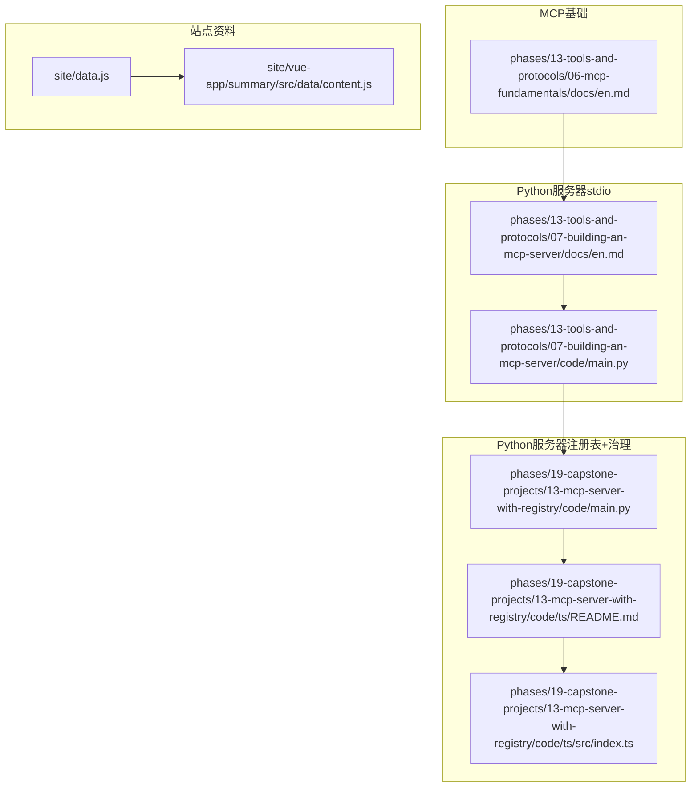
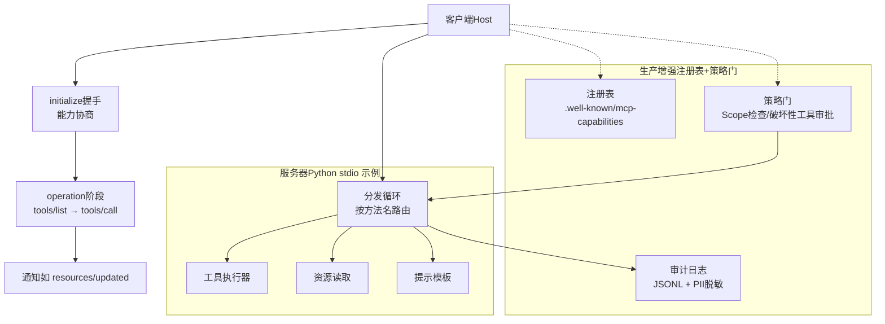
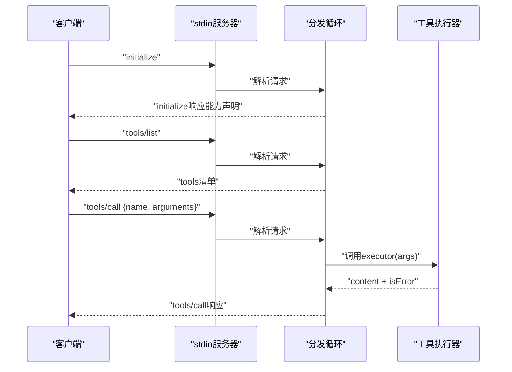
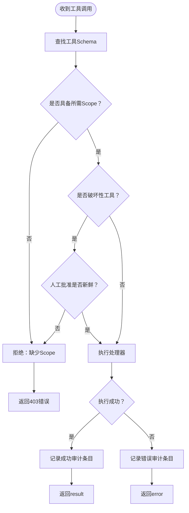
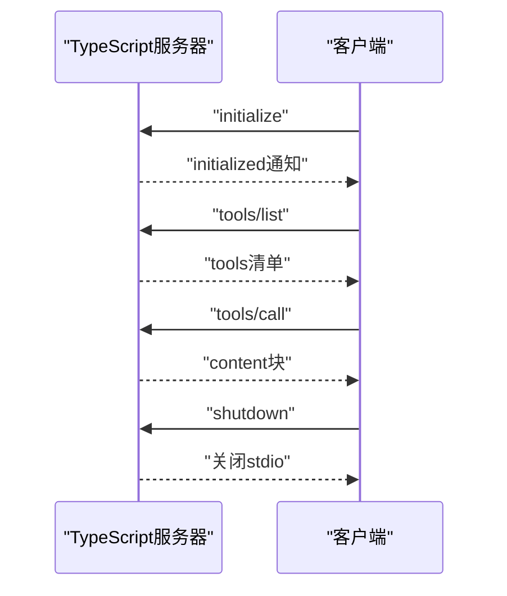
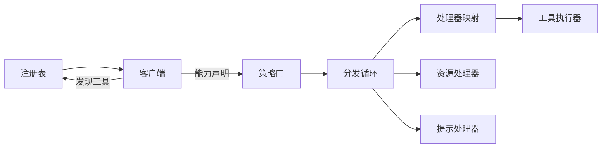

# MCP服务器开发

<cite>
**本文引用的文件**
- [phases/13-tools-and-protocols/06-mcp-fundamentals/docs/en.md](file://phases/13-tools-and-protocols/06-mcp-fundamentals/docs/en.md)
- [phases/13-tools-and-protocols/07-building-an-mcp-server/docs/en.md](file://phases/13-tools-and-protocols/07-building-an-mcp-server/docs/en.md)
- [phases/13-tools-and-protocols/07-building-an-mcp-server/code/main.py](file://phases/13-tools-and-protocols/07-building-an-mcp-server/code/main.py)
- [phases/19-capstone-projects/13-mcp-server-with-registry/code/main.py](file://phases/19-capstone-projects/13-mcp-server-with-registry/code/main.py)
- [phases/19-capstone-projects/13-mcp-server-with-registry/code/ts/README.md](file://phases/19-capstone-projects/13-mcp-server-with-registry/code/ts/README.md)
- [phases/19-capstone-projects/13-mcp-server-with-registry/code/ts/src/index.ts](file://phases/19-capstone-projects/13-mcp-server-with-registry/code/ts/src/index.ts)
- [site/data.js](file://site/data.js)
- [site/vue-app/summary/src/data/content.js](file://site/vue-app/summary/src/data/content.js)
</cite>

## 目录
1. [引言](#引言)
2. [项目结构](#项目结构)
3. [核心组件](#核心组件)
4. [架构总览](#架构总览)
5. [详细组件分析](#详细组件分析)
6. [依赖关系分析](#依赖关系分析)
7. [性能考虑](#性能考虑)
8. [故障排查指南](#故障排查指南)
9. [结论](#结论)
10. [附录](#附录)

## 引言
本开发指南围绕MCP（Model Context Protocol）服务器的架构设计与实现模式展开，结合仓库中的“MCP基础”“构建MCP服务器”“带注册表与治理的MCP服务器”等课程与示例，系统讲解以下主题：
- 服务端接口定义与JSON-RPC消息流
- 请求处理流程与响应生成机制
- 服务器启动与初始化（含能力协商）
- 资源管理策略（工具注册、权限验证、生命周期）
- 任务调度与并发处理思路
- 生产级特性（错误处理、日志审计、监控指标）
- 性能优化与扩展性设计

## 项目结构
本指南聚焦于与MCP服务器直接相关的课程与示例代码，主要由以下部分组成：
- MCP基础：协议与生命周期、JSON-RPC基础、三阶段握手与能力协商
- 构建MCP服务器（Python + stdio）：完整实现initialize、tools/list、tools/call、resources/list、resources/read、prompts/list、prompts/get
- 带注册表与治理的MCP服务器：基于Scope的授权策略、审计日志、.well-known/mcp-capabilities文档、Streamable HTTP风格分发
- TypeScript侧示例：与Python侧配合的stdio传输与工具集

**图示来源**
- [phases/13-tools-and-protocols/06-mcp-fundamentals/docs/en.md:1-167](file://phases/13-tools-and-protocols/06-mcp-fundamentals/docs/en.md#L1-L167)
- [phases/13-tools-and-protocols/07-building-an-mcp-server/docs/en.md:1-175](file://phases/13-tools-and-protocols/07-building-an-mcp-server/docs/en.md#L1-L175)
- [phases/13-tools-and-protocols/07-building-an-mcp-server/code/main.py:1-280](file://phases/13-tools-and-protocols/07-building-an-mcp-server/code/main.py#L1-L280)
- [phases/19-capstone-projects/13-mcp-server-with-registry/code/main.py:1-238](file://phases/19-capstone-projects/13-mcp-server-with-registry/code/main.py#L1-L238)
- [phases/19-capstone-projects/13-mcp-server-with-registry/code/ts/README.md:1-30](file://phases/19-capstone-projects/13-mcp-server-with-registry/code/ts/README.md#L1-L30)
- [phases/19-capstone-projects/13-mcp-server-with-registry/code/ts/src/index.ts:1-12](file://phases/19-capstone-projects/13-mcp-server-with-registry/code/ts/src/index.ts#L1-L12)
- [site/data.js:13233-13314](file://site/data.js#L13233-L13314)
- [site/vue-app/summary/src/data/content.js:867-895](file://site/vue-app/summary/src/data/content.js#L867-L895)

**章节来源**
- [phases/13-tools-and-protocols/06-mcp-fundamentals/docs/en.md:1-167](file://phases/13-tools-and-protocols/06-mcp-fundamentals/docs/en.md#L1-L167)
- [phases/13-tools-and-protocols/07-building-an-mcp-server/docs/en.md:1-175](file://phases/13-tools-and-protocols/07-building-an-mcp-server/docs/en.md#L1-L175)
- [phases/13-tools-and-protocols/07-building-an-mcp-server/code/main.py:1-280](file://phases/13-tools-and-protocols/07-building-an-mcp-server/code/main.py#L1-L280)
- [phases/19-capstone-projects/13-mcp-server-with-registry/code/main.py:1-238](file://phases/19-capstone-projects/13-mcp-server-with-registry/code/main.py#L1-L238)
- [phases/19-capstone-projects/13-mcp-server-with-registry/code/ts/README.md:1-30](file://phases/19-capstone-projects/13-mcp-server-with-registry/code/ts/README.md#L1-L30)
- [phases/19-capstone-projects/13-mcp-server-with-registry/code/ts/src/index.ts:1-12](file://phases/19-capstone-projects/13-mcp-server-with-registry/code/ts/src/index.ts#L1-L12)
- [site/data.js:13233-13314](file://site/data.js#L13233-L13314)
- [site/vue-app/summary/src/data/content.js:867-895](file://site/vue-app/summary/src/data/content.js#L867-L895)

## 核心组件
- 协议与生命周期（基础）
  - JSON-RPC 2.0消息格式：请求、响应、通知
  - 三阶段生命周期：initialize → operation → shutdown
  - 能力协商：tools/resources/prompts等能力声明与约束
- Python服务器（stdio）
  - 实现initialize、tools/list、tools/call、resources/list、resources/read、prompts/list、prompts/get
  - 分发循环：按方法名路由到处理器；严格区分请求与通知
  - 结构化错误：JSON-RPC错误码与工具级错误（isError）
- 注册表与治理（Python）
  - .well-known/mcp-capabilities文档：工具清单、传输URL、作用域要求
  - 授权策略：基于Scope的策略决策（OPA式函数），破坏性工具需要新鲜人工批准
  - 审计日志：结构化JSONL，PII脱敏
- TypeScript服务器（stdio）
  - 手写JSON-RPC over stdio，展示每字节传输细节
  - 与Python侧配合完成端到端演示

**章节来源**
- [phases/13-tools-and-protocols/06-mcp-fundamentals/docs/en.md:43-113](file://phases/13-tools-and-protocols/06-mcp-fundamentals/docs/en.md#L43-L113)
- [phases/13-tools-and-protocols/07-building-an-mcp-server/code/main.py:127-221](file://phases/13-tools-and-protocols/07-building-an-mcp-server/code/main.py#L127-L221)
- [phases/19-capstone-projects/13-mcp-server-with-registry/code/main.py:48-98](file://phases/19-capstone-projects/13-mcp-server-with-registry/code/main.py#L48-L98)

## 架构总览
下图展示了从客户端到服务器的典型交互路径，以及注册表与策略门在生产环境中的位置。

**图示来源**
- [phases/13-tools-and-protocols/06-mcp-fundamentals/docs/en.md:60-98](file://phases/13-tools-and-protocols/06-mcp-fundamentals/docs/en.md#L60-L98)
- [phases/13-tools-and-protocols/07-building-an-mcp-server/code/main.py:195-203](file://phases/13-tools-and-protocols/07-building-an-mcp-server/code/main.py#L195-L203)
- [phases/19-capstone-projects/13-mcp-server-with-registry/code/main.py:149-165](file://phases/19-capstone-projects/13-mcp-server-with-registry/code/main.py#L149-L165)

## 详细组件分析

### 组件A：Python服务器（stdio）——分发循环与工具执行
- 分发循环
  - 读取stdin逐行JSON对象，解析失败返回JSON-RPC parse error
  - 无id为通知，不回包；有id则调用对应处理器并回包
  - 统一异常捕获，返回JSON-RPC内部错误
- 工具执行
  - tools/list返回工具清单（含name/description/inputSchema/annotations）
  - tools/call根据name路由到executor，支持isError标记
- 资源与提示
  - resources/list/resources/read：按URI读取资源内容
  - prompts/list/prompts/get：返回模板消息结构

**图示来源**
- [phases/13-tools-and-protocols/07-building-an-mcp-server/code/main.py:127-221](file://phases/13-tools-and-protocols/07-building-an-mcp-server/code/main.py#L127-L221)

**章节来源**
- [phases/13-tools-and-protocols/07-building-an-mcp-server/code/main.py:127-221](file://phases/13-tools-and-protocols/07-building-an-mcp-server/code/main.py#L127-L221)
- [phases/13-tools-and-protocols/07-building-an-mcp-server/docs/en.md:27-96](file://phases/13-tools-and-protocols/07-building-an-mcp-server/docs/en.md#L27-L96)

### 组件B：注册表与策略门（Python）
- 工具注册与能力导出
  - MCPServer维护工具Schema与处理器映射
  - capabilities导出工具清单、传输类型、URL等
- 授权策略
  - policy_decide：校验工具存在性、所需Scope、破坏性工具的人工批准时效
  - payload大小限制示例
- 审计日志
  - AuditEntry结构化记录时间戳、用户、工具、结果、脱敏参数与响应
  - redact对邮箱、SSN等进行脱敏

**图示来源**
- [phases/19-capstone-projects/13-mcp-server-with-registry/code/main.py:85-144](file://phases/19-capstone-projects/13-mcp-server-with-registry/code/main.py#L85-L144)

**章节来源**
- [phases/19-capstone-projects/13-mcp-server-with-registry/code/main.py:48-98](file://phases/19-capstone-projects/13-mcp-server-with-registry/code/main.py#L48-L98)
- [phases/19-capstone-projects/13-mcp-server-with-registry/code/main.py:126-144](file://phases/19-capstone-projects/13-mcp-server-with-registry/code/main.py#L126-L144)

### 组件C：TypeScript服务器（stdio）
- 传输层：手写JSON-RPC over stdio，支持fixture回放与真实stdio循环
- 协议层：实现initialize、tools/list、tools/call、shutdown等
- 工具层：三个模拟incident工具的描述与执行器

**图示来源**
- [phases/19-capstone-projects/13-mcp-server-with-registry/code/ts/README.md:1-30](file://phases/19-capstone-projects/13-mcp-server-with-registry/code/ts/README.md#L1-L30)
- [phases/19-capstone-projects/13-mcp-server-with-registry/code/ts/src/index.ts:1-12](file://phases/19-capstone-projects/13-mcp-server-with-registry/code/ts/src/index.ts#L1-L12)

**章节来源**
- [phases/19-capstone-projects/13-mcp-server-with-registry/code/ts/README.md:1-30](file://phases/19-capstone-projects/13-mcp-server-with-registry/code/ts/README.md#L1-L30)
- [phases/19-capstone-projects/13-mcp-server-with-registry/code/ts/src/index.ts:1-12](file://phases/19-capstone-projects/13-mcp-server-with-registry/code/ts/src/index.ts#L1-L12)

### 组件D：站点资料与教学要点
- 教学要点：MCP三大服务端原语（Tools/Resources/Prompts）、三大客户端原语（Roots/Sampling/Elicitation）
- 传输方式：stdio（本地进程间）、SSE/Streamable HTTP（远程）
- FastMCP与TypeScript SDK的Graduation路径

**章节来源**
- [site/data.js:13233-13314](file://site/data.js#L13233-L13314)
- [site/vue-app/summary/src/data/content.js:867-895](file://site/vue-app/summary/src/data/content.js#L867-L895)

## 依赖关系分析
- 低耦合的消息路由：分发循环通过方法名映射到处理器，便于扩展新工具
- 可插拔策略门：policy_decide独立于分发逻辑，便于替换或增强
- 清晰的职责边界：注册表负责能力收集与检索；服务器负责工具与资源；客户端负责能力声明与UI行为
- 传输无关：Python stdio示例与TypeScript stdio示例均可无缝对接同一策略门与注册表

**图示来源**
- [phases/13-tools-and-protocols/07-building-an-mcp-server/code/main.py:195-203](file://phases/13-tools-and-protocols/07-building-an-mcp-server/code/main.py#L195-L203)
- [phases/19-capstone-projects/13-mcp-server-with-registry/code/main.py:149-165](file://phases/19-capstone-projects/13-mcp-server-with-registry/code/main.py#L149-L165)

**章节来源**
- [phases/13-tools-and-protocols/07-building-an-mcp-server/code/main.py:195-203](file://phases/13-tools-and-protocols/07-building-an-mcp-server/code/main.py#L195-L203)
- [phases/19-capstone-projects/13-mcp-server-with-registry/code/main.py:149-165](file://phases/19-capstone-projects/13-mcp-server-with-registry/code/main.py#L149-L165)

## 性能考虑
- IO与序列化
  - stdio逐行读写，避免缓冲累积；每次输出后刷新stdout
  - JSON序列化/反序列化尽量复用结构，减少中间对象分配
- 并发与队列
  - 单线程分发循环简单可靠；若扩展为HTTP服务，建议使用异步IO与工作池
  - 对长耗时工具采用任务队列与进度通知（notifications/progress）
- 资源与缓存
  - 资源读取可引入只读缓存；工具输入Schema用于参数校验与限流
- 监控与可观测性
  - 记录请求耗时、错误率、工具调用次数；对破坏性工具增加额外告警
  - 审计日志持久化与索引，支持按用户/工具/时间检索

[本节为通用指导，无需具体文件引用]

## 故障排查指南
- JSON-RPC错误
  - Method not found：检查分发循环中方法名映射
  - Parse error：确认输入为合法JSON对象且以换行分隔
  - Internal error：捕获异常并返回统一错误码
- 工具级错误
  - 使用isError标记工具执行失败，便于模型上下文感知
- 权限问题
  - 策略门拒绝：核对所需Scope与破坏性工具的批准时效
  - payload过大：调整参数或引入压缩/分页
- 审计与脱敏
  - 审计条目缺失：确认异常分支与正常分支均写入日志
  - PII泄露：确保redact规则覆盖常见敏感字段

**章节来源**
- [phases/13-tools-and-protocols/07-building-an-mcp-server/code/main.py:208-221](file://phases/13-tools-and-protocols/07-building-an-mcp-server/code/main.py#L208-L221)
- [phases/19-capstone-projects/13-mcp-server-with-registry/code/main.py:126-144](file://phases/19-capstone-projects/13-mcp-server-with-registry/code/main.py#L126-L144)

## 结论
本指南基于仓库中的MCP基础、Python stdio服务器与注册表+治理示例，系统梳理了MCP服务器的接口定义、请求处理、权限与审计、以及生产级特性。通过清晰的职责分离与可插拔策略门，MCP服务器可在不同传输与安全模型之间平滑演进，并满足企业级合规与可观测性需求。

[本节为总结，无需具体文件引用]

## 附录
- 快速参考
  - 初始化与能力协商：参见initialize与capabilities声明
  - 工具与资源：tools/list、tools/call、resources/list、resources/read、prompts/list、prompts/get
  - 错误处理：JSON-RPC错误码与工具级isError
  - 授权与审计：Scope检查、破坏性工具审批、PII脱敏审计日志
- 进一步阅读
  - MCP 2025-11-25规范与SDK文档链接

**章节来源**
- [phases/13-tools-and-protocols/06-mcp-fundamentals/docs/en.md:160-167](file://phases/13-tools-and-protocols/06-mcp-fundamentals/docs/en.md#L160-L167)
- [phases/13-tools-and-protocols/07-building-an-mcp-server/docs/en.md:168-175](file://phases/13-tools-and-protocols/07-building-an-mcp-server/docs/en.md#L168-L175)