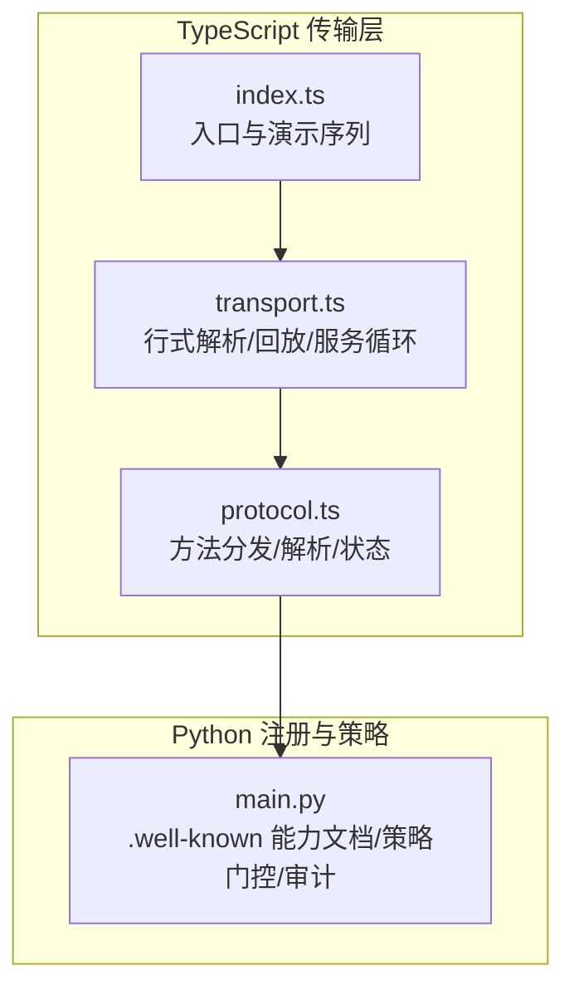
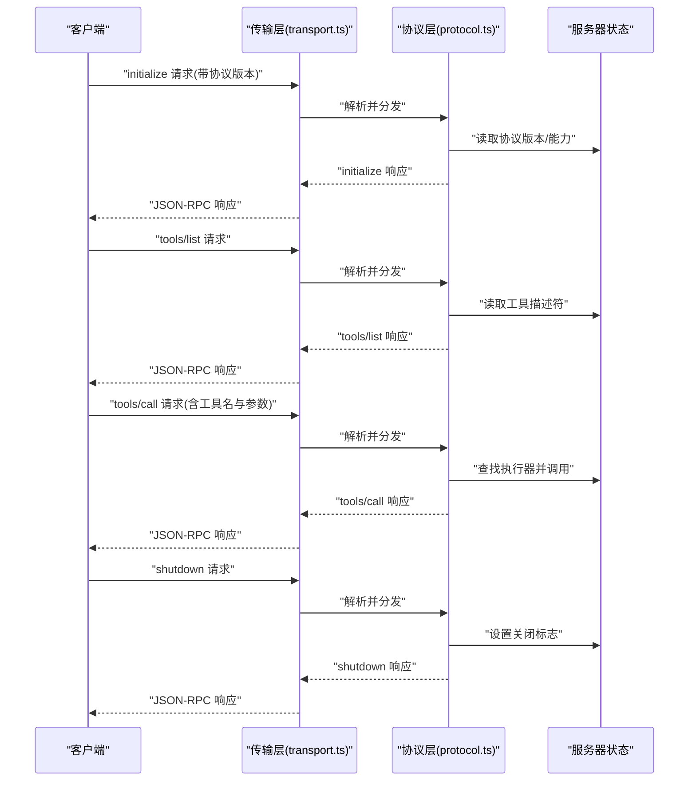
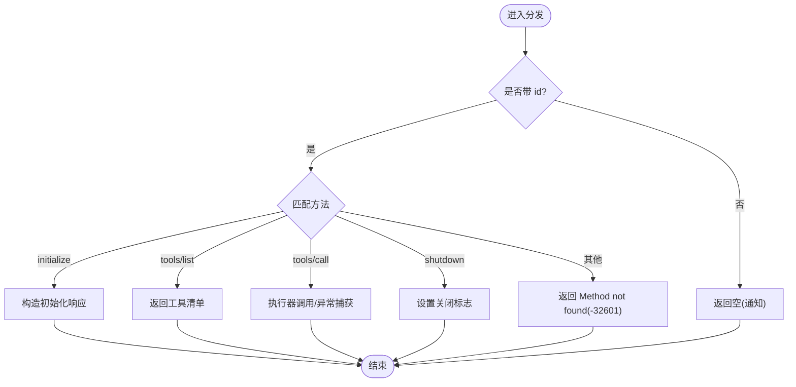
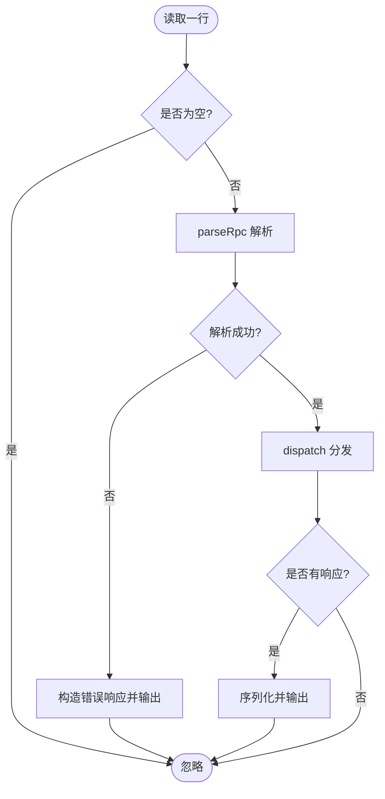
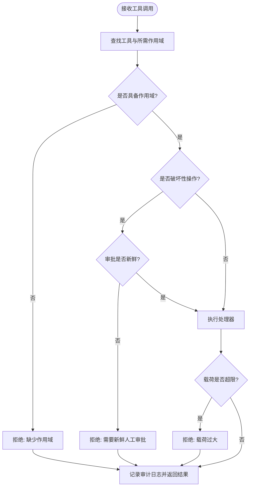
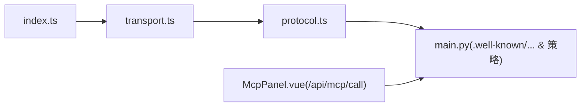

# 传输层协议

<cite>
**本文引用的文件**
- [protocol.ts](file://phases/19-capstone-projects/13-mcp-server-with-registry/code/ts/src/protocol.ts)
- [transport.ts](file://phases/19-capstone-projects/13-mcp-server-with-registry/code/ts/src/transport.ts)
- [index.ts](file://phases/19-capstone-projects/13-mcp-server-with-registry/code/ts/src/index.ts)
- [README.md](file://phases/19-capstone-projects/13-mcp-server-with-registry/code/ts/README.md)
- [protocol.test.ts](file://phases/19-capstone-projects/13-mcp-server-with-registry/code/ts/tests/protocol.test.ts)
- [main.py](file://phases/19-capstone-projects/13-mcp-server-with-registry/code/main.py)
- [skill-mcp-transport-migrator.md](file://phases/13-tools-and-protocols/09-mcp-transports/outputs/skill-mcp-transport-migrator.md)
- [skill-oauth-scope-planner.md](file://phases/13-tools-and-protocols/16-mcp-security-oauth-2-1/outputs/skill-oauth-scope-planner.md)
- [skill-mcp-threat-model.md](file://phases/13-tools-and-protocols/15-mcp-security-tool-poisoning/outputs/skill-mcp-threat-model.md)
- [server.test.ts](file://phases/19-capstone-projects/08-production-rag-chatbot/code/ts/tests/server.test.ts)
- [stream.ts](file://phases/19-capstone-projects/08-production-rag-chatbot/code/ts/src/stream.ts)
- [McpPanel.vue](file://guardrails-sandbox/frontend/src/components/McpPanel.vue)
</cite>

## 目录
1. [简介](#简介)
2. [项目结构](#项目结构)
3. [核心组件](#核心组件)
4. [架构总览](#架构总览)
5. [详细组件分析](#详细组件分析)
6. [依赖关系分析](#依赖关系分析)
7. [性能考虑](#性能考虑)
8. [故障排查指南](#故障排查指南)
9. [结论](#结论)
10. [附录](#附录)

## 简介
本文件面向 MCP（Model Context Protocol）传输层协议，系统性梳理仓库中已实现与可迁移的传输方案，覆盖以下主题：
- 支持的传输类型：标准输入输出（stdio）、HTTP+SSE、Streamable HTTP（单端点）。
- 连接建立、消息编解码、错误处理与关闭流程。
- 安全机制：OAuth 2.1 作用域授权、受保护资源元数据、会话标识与来源校验、威胁建模与规则二（Rule of Two）。
- 性能优化：连接无状态化、单端点扩展、事件重放与回环缓冲、最小化开销的消息格式。
- 配置示例与最佳实践：从本地 stdio 到生产级 Streamable HTTP 的迁移路径与合规要求。

## 项目结构
本仓库在“综合项目 13”中提供了两类传输实现与配套安全治理能力：
- TypeScript 侧：手写 stdio JSON-RPC 传输与协议分发，用于本地演示与测试。
- Python 侧：注册表与策略门控（OPA 风格），展示 .well-known/mcp-capabilities 文档与授权决策。

图表来源
- [index.ts:1-58](file://phases/19-capstone-projects/13-mcp-server-with-registry/code/ts/src/index.ts#L1-L58)
- [transport.ts:1-46](file://phases/19-capstone-projects/13-mcp-server-with-registry/code/ts/src/transport.ts#L1-L46)
- [protocol.ts:1-100](file://phases/19-capstone-projects/13-mcp-server-with-registry/code/ts/src/protocol.ts#L1-L100)
- [main.py:1-238](file://phases/19-capstone-projects/13-mcp-server-with-registry/code/main.py#L1-L238)

章节来源
- [README.md:1-30](file://phases/19-capstone-projects/13-mcp-server-with-registry/code/ts/README.md#L1-L30)

## 核心组件
- 协议版本与服务器信息：定义协议版本与服务器元信息，供握手返回。
- 协议状态：维护工具描述符、执行器映射与关闭标志。
- 方法分发：initialize、tools/list、tools/call、shutdown；未知方法返回标准错误码。
- 行式传输：基于换行分隔的 JSON-RPC 2.0 文本帧，逐行读取与回放，支持通知无 id 返回空响应。
- 解析器：严格校验 JSON 与 JSON-RPC 2.0 包络字段，错误时返回对应错误码。
- 安全与治理：Python 侧提供 .well-known/mcp-capabilities、OAuth 风格作用域、策略门控与审计日志。

章节来源
- [protocol.ts:9-100](file://phases/19-capstone-projects/13-mcp-server-with-registry/code/ts/src/protocol.ts#L9-L100)
- [transport.ts:1-46](file://phases/19-capstone-projects/13-mcp-server-with-registry/code/ts/src/transport.ts#L1-L46)
- [protocol.test.ts:1-123](file://phases/19-capstone-projects/13-mcp-server-with-registry/code/ts/tests/protocol.test.ts#L1-L123)
- [main.py:48-98](file://phases/19-capstone-projects/13-mcp-server-with-registry/code/main.py#L48-L98)

## 架构总览
下图展示了从客户端到服务器的典型交互路径，涵盖握手、工具枚举、工具调用与关闭。

图表来源
- [index.ts:14-51](file://phases/19-capstone-projects/13-mcp-server-with-registry/code/ts/src/index.ts#L14-L51)
- [transport.ts:7-23](file://phases/19-capstone-projects/13-mcp-server-with-registry/code/ts/src/transport.ts#L7-L23)
- [protocol.ts:56-83](file://phases/19-capstone-projects/13-mcp-server-with-registry/code/ts/src/protocol.ts#L56-L83)

## 详细组件分析

### 组件一：协议层（protocol.ts）
- 功能要点
  - 协议版本与服务器信息常量。
  - 协议状态对象包含工具描述符、执行器映射与关闭标志。
  - 分发函数根据方法名路由到具体处理器，并统一包装 JSON-RPC 2.0 响应。
  - 解析函数严格校验 JSON 与包络字段，返回错误码与原因。
- 错误处理
  - 未找到方法返回 -32601；运行期异常返回 -32603。
  - 解析失败返回 -32700（无效 JSON）或 -32600（无效请求）。
- 数据结构复杂度
  - 工具列表查询为 O(n)（n 为工具数）；执行器查找为 O(1)。

图表来源
- [protocol.ts:56-83](file://phases/19-capstone-projects/13-mcp-server-with-registry/code/ts/src/protocol.ts#L56-L83)

章节来源
- [protocol.ts:9-100](file://phases/19-capstone-projects/13-mcp-server-with-registry/code/ts/src/protocol.ts#L9-L100)
- [protocol.test.ts:12-32](file://phases/19-capstone-projects/13-mcp-server-with-registry/code/ts/tests/protocol.test.ts#L12-L32)
- [protocol.test.ts:81-98](file://phases/19-capstone-projects/13-mcp-server-with-registry/code/ts/tests/protocol.test.ts#L81-L98)

### 组件二：传输层（transport.ts）
- 行式传输
  - 使用 readline 逐行读取，忽略空行。
  - 解析失败时构造 JSON-RPC 错误响应并输出。
  - 将响应序列化为单行 JSON 并写入 stdout。
- 回放与演示
  - 提供回放函数以驱动一组请求并收集响应，便于测试与演示。
- 服务循环
  - 在 stdio 模式下持续监听输入，收到关闭标志后退出。

图表来源
- [transport.ts:7-23](file://phases/19-capstone-projects/13-mcp-server-with-registry/code/ts/src/transport.ts#L7-L23)

章节来源
- [transport.ts:1-46](file://phases/19-capstone-projects/13-mcp-server-with-registry/code/ts/src/transport.ts#L1-L46)
- [protocol.test.ts:100-112](file://phases/19-capstone-projects/13-mcp-server-with-registry/code/ts/tests/protocol.test.ts#L100-L112)

### 组件三：入口与演示（index.ts）
- 演示序列包含 initialize、tools/list、多次 tools/call 与 shutdown。
- 支持两种运行模式：fixture 演示与真实 stdio 循环。

章节来源
- [index.ts:14-51](file://phases/19-capstone-projects/13-mcp-server-with-registry/code/ts/src/index.ts#L14-L51)
- [README.md:21-29](file://phases/19-capstone-projects/13-mcp-server-with-registry/code/ts/README.md#L21-L29)

### 组件四：安全与治理（Python 侧）
- .well-known/mcp-capabilities：暴露服务器名、传输类型、URL 与工具清单（含作用域、破坏性标记、输入模式）。
- OAuth 风格作用域：Token 对象包含用户、作用域集合与新鲜审批时间窗口。
- 策略门控：policy_decide 检查工具存在性、作用域、破坏性操作的人工审批新鲜度、载荷大小上限等。
- 审计日志：结构化 JSONL，对敏感字段进行脱敏。

图表来源
- [main.py:85-98](file://phases/19-capstone-projects/13-mcp-server-with-registry/code/main.py#L85-L98)
- [main.py:126-144](file://phases/19-capstone-projects/13-mcp-server-with-registry/code/main.py#L126-L144)

章节来源
- [main.py:48-98](file://phases/19-capstone-projects/13-mcp-server-with-registry/code/main.py#L48-L98)
- [main.py:126-144](file://phases/19-capstone-projects/13-mcp-server-with-registry/code/main.py#L126-L144)

### 组件五：HTTP+SSE 与迁移（Streamable HTTP）
- 迁移目标：将旧版 HTTP+SSE 合并为单端点 Streamable HTTP，保留会话连续性与来源校验。
- 关键变更
  - 端点合并：/messages 与 /sse 合并为 /mcp；POST 处理请求，GET 提供 SSE 流，DELETE 结束会话。
  - 会话连续性：首次 POST 生成新 Mcp-Session-Id，拒绝客户端自定义；保留旧版 Cookie 的桥接逻辑。
  - 来源校验：显式白名单生产来源（如 https://app.company.com、https://claude.ai、localhost 变体），其他来源 403。
  - 事件重放：每个会话维护最近事件的环形缓冲，断线重连可使用 Last-Event-ID 恢复。
  - 弃用窗口：标注切换日期与 60 天宽限期，期间旧端点 301 跳转并警告。

章节来源
- [skill-mcp-transport-migrator.md:10-18](file://phases/13-tools-and-protocols/09-mcp-transports/outputs/skill-mcp-transport-migrator.md#L10-L18)

### 组件六：OAuth 2.1 作用域规划
- 规划内容
  - 作用域层级：graduated（如 read → write → delete → admin），每类操作一个作用域。
  - 作用域到工具映射：明确每个工具所需作用域，标记需要多作用域的工具。
  - 逐步提升策略：破坏性操作需逐步提升，典型为初始同意后触发二次确认。
  - 资源指示值：标准化 resource 参数 URL，确保与 .well-known/oauth-protected-resource 的 resource 字段一致。
  - 受保护资源元数据：包含 authorization_servers、scopes_supported、resource。
- 硬性拒绝与拒绝规则
  - 任何工具需要 admin 但未显式确认对话框即调用，必须逐步提升。
  - 任一作用域覆盖多类操作，视为特权蔓延。
  - 任何跳过受众校验的服务器，存在混淆代理风险。
  - 本地（stdio）拒绝 OAuth，stdio 继承父进程信任。
  - 依赖遗留隐式流的服务器拒绝，强制迁移到 2.1 + PKCE。

章节来源
- [skill-oauth-scope-planner.md:10-28](file://phases/13-tools-and-protocols/16-mcp-security-oauth-2-1/outputs/skill-oauth-scope-planner.md#L10-L28)

### 组件七：威胁建模与规则二
- 攻击适用性：针对工具投毒、 rug pull、影子化、MPMA、寄生工具链、采样攻击、供应链冒名等七类攻击，给出高/中/低适用性与简短理由。
- 防御盘点：列举已在部署中实施的防御（哈希固定、静态检测器、网关、签名注册表、MELON、规则二）。
- 规则二审计：对每个工具分类为未受信任/敏感/后果严重，若一次调用中同时具备三者则标记。
- 缺失防御：基于威胁画像提出最高杠杆缺失项。
- 运行手册：列出团队应在一周内采取的三项改进行动。

章节来源
- [skill-mcp-threat-model.md:10-28](file://phases/13-tools-and-protocols/15-mcp-security-tool-poisoning/outputs/skill-mcp-threat-model.md#L10-L28)

## 依赖关系分析
- TypeScript 传输层依赖协议层完成消息解析与方法分发。
- 入口模块负责组装状态与演示序列，调度传输层服务循环。
- Python 侧提供 .well-known 能力文档与策略门控，作为注册与授权的参考实现。
- 前端示例组件通过 /api/mcp/call 发起 HTTP 请求，体现 HTTP 传输的调用方式。

图表来源
- [index.ts:9-12](file://phases/19-capstone-projects/13-mcp-server-with-registry/code/ts/src/index.ts#L9-L12)
- [transport.ts:1-3](file://phases/19-capstone-projects/13-mcp-server-with-registry/code/ts/src/transport.ts#L1-L3)
- [protocol.ts:1-7](file://phases/19-capstone-projects/13-mcp-server-with-registry/code/ts/src/protocol.ts#L1-L7)
- [main.py:48-61](file://phases/19-capstone-projects/13-mcp-server-with-registry/code/main.py#L48-L61)
- [McpPanel.vue:67-74](file://guardrails-sandbox/frontend/src/components/McpPanel.vue#L67-L74)

章节来源
- [README.md:8-19](file://phases/19-capstone-projects/13-mcp-server-with-registry/code/ts/README.md#L8-L19)

## 性能考虑
- 无状态与水平扩展
  - Streamable HTTP 默认无状态，可在负载均衡器后通过单一端点水平扩展，降低会话粘性带来的复杂性。
- 事件重放与缓冲
  - 为每个会话维护最近事件的环形缓冲，断线重连可使用 Last-Event-ID 快速恢复，减少重复数据与等待时间。
- 最小化开销
  - JSON-RPC 2.0 文本帧简单直接，stdio 场景下无需额外头部与压缩，降低 CPU 开销。
- 前端调用优化
  - 前端组件在发起调用前进行表单校验与加载态管理，避免不必要的重复请求。

章节来源
- [skill-mcp-transport-migrator.md:14-17](file://phases/13-tools-and-protocols/09-mcp-transports/outputs/skill-mcp-transport-migrator.md#L14-L17)
- [server.test.ts:1-27](file://phases/19-capstone-projects/08-production-rag-chatbot/code/ts/tests/server.test.ts#L1-L27)
- [McpPanel.vue:60-86](file://guardrails-sandbox/frontend/src/components/McpPanel.vue#L60-L86)

## 故障排查指南
- 解析失败
  - 现象：收到 JSON 解析错误或无效请求错误。
  - 排查：检查消息是否为合法 JSON，包络字段是否符合 JSON-RPC 2.0；确认换行分隔正确。
- 方法不存在
  - 现象：返回 Method not found(-32601)。
  - 排查：核对方法名拼写与协议版本；确认客户端与服务器协议版本一致。
- 工具未找到或参数错误
  - 现象：tools/call 返回错误，可能为 unknown tool 或参数类型不符。
  - 排查：确认工具名存在于 tools/list 返回中；核对 inputSchema。
- 关闭标志生效
  - 现象：发送 shutdown 后传输循环退出。
  - 排查：确认状态中的关闭标志被正确设置；客户端应停止发送后续请求。
- HTTP+SSE 迁移相关
  - 现象：旧端点 301、Origin 403、会话 ID 不匹配。
  - 排查：确认新端点 /mcp 的 POST/GET/DELETE 语义；检查 Mcp-Session-Id 生成与 Last-Event-ID；核对来源白名单。

章节来源
- [protocol.test.ts:93-112](file://phases/19-capstone-projects/13-mcp-server-with-registry/code/ts/tests/protocol.test.ts#L93-L112)
- [transport.ts:10-20](file://phases/19-capstone-projects/13-mcp-server-with-registry/code/ts/src/transport.ts#L10-L20)
- [protocol.ts:75-82](file://phases/19-capstone-projects/13-mcp-server-with-registry/code/ts/src/protocol.ts#L75-L82)
- [skill-mcp-transport-migrator.md:14-23](file://phases/13-tools-and-protocols/09-mcp-transports/outputs/skill-mcp-transport-migrator.md#L14-L23)

## 结论
本仓库完整呈现了 MCP 传输层的两条路径：本地 stdio 与生产级 Streamable HTTP。前者强调可观察性与最小实现，后者强调无状态、单端点与安全合规。结合 Python 侧的 .well-known 能力文档、OAuth 2.1 作用域规划与威胁建模，可形成从开发到生产的完整传输与安全闭环。

## 附录

### 传输类型与适用场景
- stdio（本地）
  - 特点：进程间通信，无网络开销，适合本地开发与调试。
  - 适用：本地工具、CI/CD、容器内联。
- HTTP+SSE（旧版）
  - 特点：分离请求与事件流，易于浏览器集成。
  - 适用：早期原型、浏览器前端直连。
- Streamable HTTP（推荐）
  - 特点：单端点、无状态、支持事件重放与来源校验。
  - 适用：生产级服务、水平扩展、边缘部署。

章节来源
- [README.md:3-6](file://phases/19-capstone-projects/13-mcp-server-with-registry/code/ts/README.md#L3-L6)
- [skill-mcp-transport-migrator.md:10-18](file://phases/13-tools-and-protocols/09-mcp-transports/outputs/skill-mcp-transport-migrator.md#L10-L18)

### 数据帧格式与编解码
- 文本帧：以换行符分隔的单行 JSON。
- 包络字段：jsonrpc（固定为 2.0）、method（字符串）、id（数字或空）、params（对象）。
- 错误码：-32700（无效 JSON）、-32600（无效请求）、-32601（方法未找到）、-32603（内部错误）。

章节来源
- [protocol.ts:85-99](file://phases/19-capstone-projects/13-mcp-server-with-registry/code/ts/src/protocol.ts#L85-L99)
- [transport.ts:10-20](file://phases/19-capstone-projects/13-mcp-server-with-registry/code/ts/src/transport.ts#L10-L20)

### 安全机制
- 授权模型：OAuth 2.1 作用域，按工具粒度授权，破坏性操作需逐步提升。
- 受保护资源：.well-known/oauth-protected-resource，声明授权服务器、作用域与资源标识。
- 会话与来源：Mcp-Session-Id 由服务端生成，Origin 白名单校验，Last-Event-ID 支持重连。
- 威胁建模：识别七类攻击，盘点现有防御，审计规则二违规，提出改进行动。

章节来源
- [main.py:68-78](file://phases/19-capstone-projects/13-mcp-server-with-registry/code/main.py#L68-L78)
- [main.py:85-98](file://phases/19-capstone-projects/13-mcp-server-with-registry/code/main.py#L85-L98)
- [skill-oauth-scope-planner.md:14-18](file://phases/13-tools-and-protocols/16-mcp-security-oauth-2-1/outputs/skill-oauth-scope-planner.md#L14-L18)
- [skill-mcp-transport-migrator.md:16-17](file://phases/13-tools-and-protocols/09-mcp-transports/outputs/skill-mcp-transport-migrator.md#L16-L17)
- [skill-mcp-threat-model.md:14-18](file://phases/13-tools-and-protocols/15-mcp-security-tool-poisoning/outputs/skill-mcp-threat-model.md#L14-L18)

### 性能优化策略
- 连接无状态：Streamable HTTP 默认无状态，利于横向扩展。
- 事件重放：环形缓冲 + Last-Event-ID，降低重连延迟。
- 缓冲管理：限制载荷大小、合理设置事件缓冲容量。
- 前端优化：请求前校验、并发控制、加载态反馈。

章节来源
- [skill-mcp-transport-migrator.md:17-18](file://phases/13-tools-and-protocols/09-mcp-transports/outputs/skill-mcp-transport-migrator.md#L17-L18)
- [main.py:94-96](file://phases/19-capstone-projects/13-mcp-server-with-registry/code/main.py#L94-L96)
- [McpPanel.vue:60-86](file://guardrails-sandbox/frontend/src/components/McpPanel.vue#L60-L86)

### 配置示例与最佳实践
- 本地 stdio
  - 启动：npm run serve 进入 stdio 循环；npm start 运行 fixture 演示。
  - 最佳实践：在 CI 中使用 fixture 回放验证协议一致性。
- 生产级 Streamable HTTP
  - 端点：/mcp，POST 处理请求，GET 提供 SSE，DELETE 结束会话。
  - 会话：首次 POST 生成 Mcp-Session-Id，禁止客户端自定义。
  - 来源：配置 Origin 白名单，拒绝其他来源。
  - 迁移：60 天弃用窗口，期间 301 跳转并警告。
- OAuth 2.1
  - 作用域层级与映射、逐步提升策略、资源指示值与受保护资源元数据。
  - 禁止：隐式流、无受众校验、本地启用 OAuth。

章节来源
- [README.md:21-29](file://phases/19-capstone-projects/13-mcp-server-with-registry/code/ts/README.md#L21-L29)
- [skill-mcp-transport-migrator.md:14-28](file://phases/13-tools-and-protocols/09-mcp-transports/outputs/skill-mcp-transport-migrator.md#L14-L28)
- [skill-oauth-scope-planner.md:14-18](file://phases/13-tools-and-protocols/16-mcp-security-oauth-2-1/outputs/skill-oauth-scope-planner.md#L14-L18)