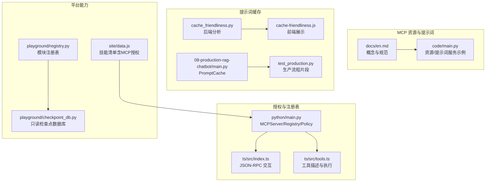
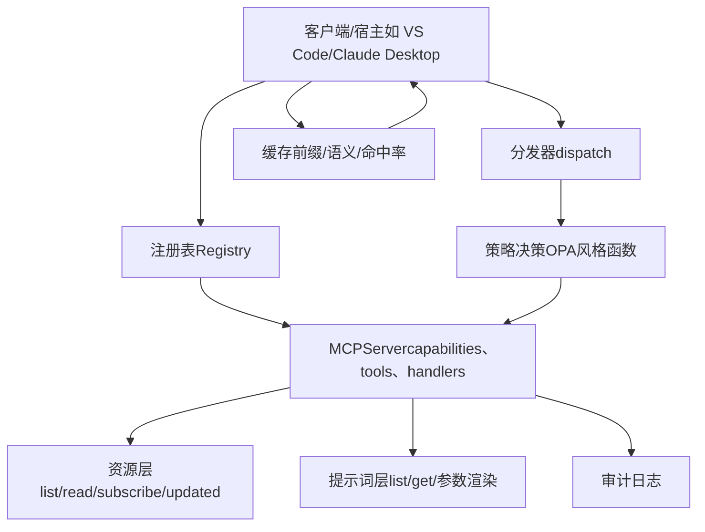
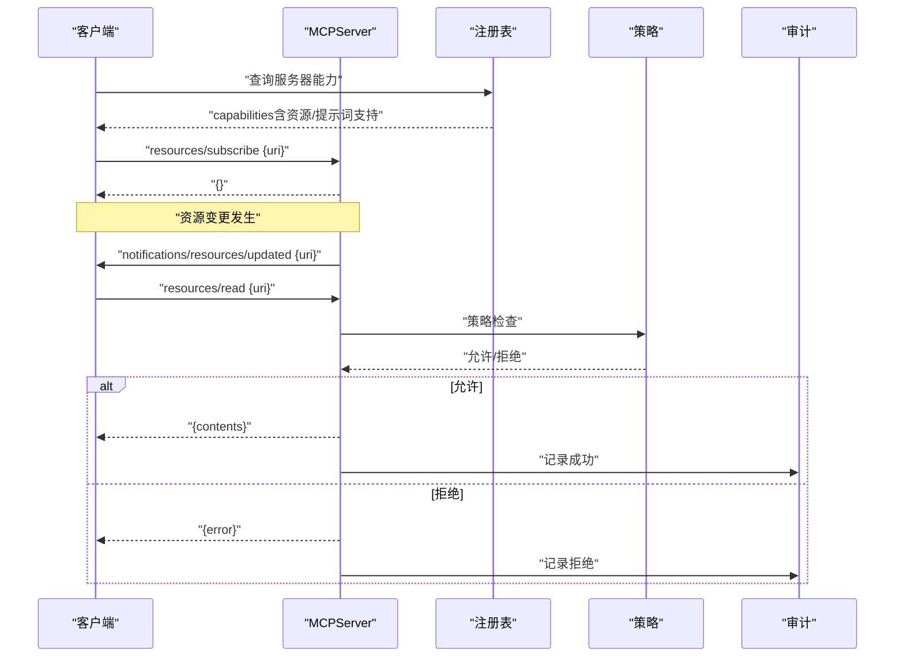
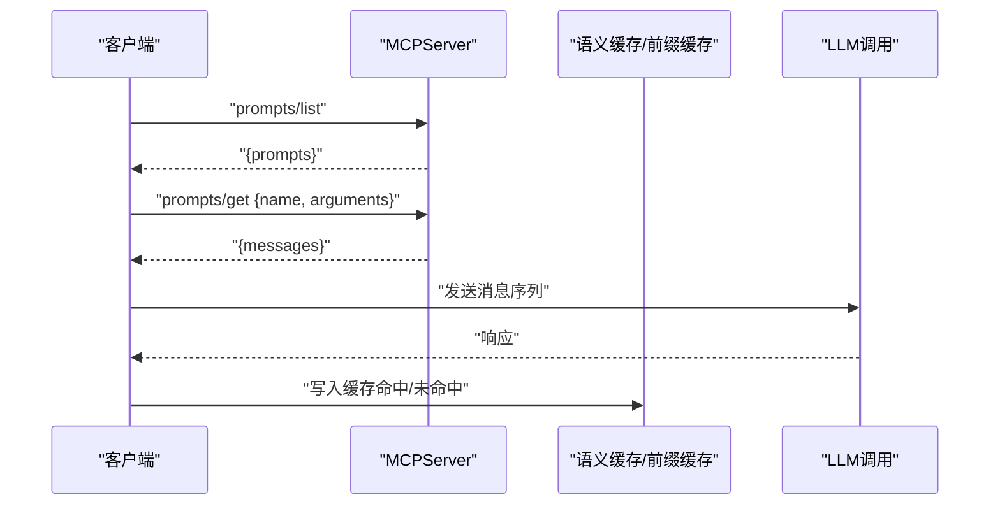
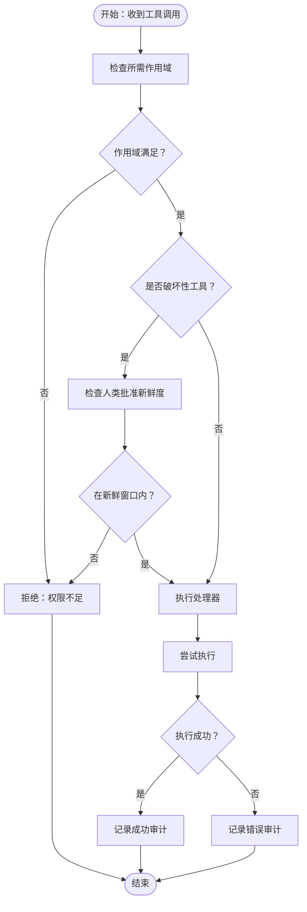
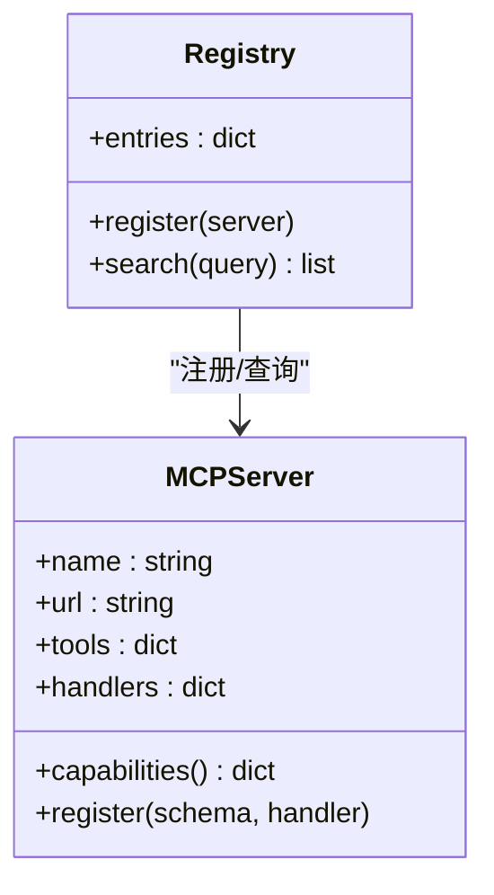
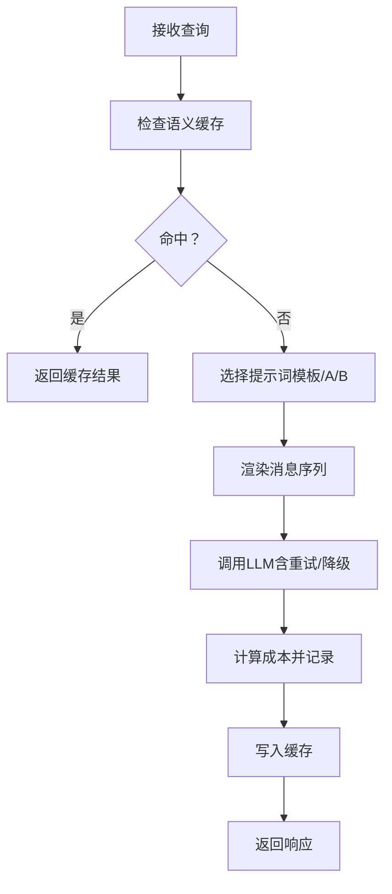
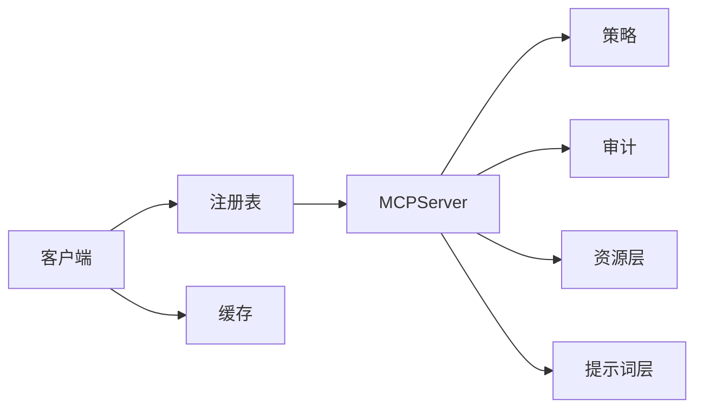

# 资源与提示词管理

<cite>
**本文引用的文件**   
- [en.md](file://phases/13-tools-and-protocols/10-mcp-resources-and-prompts/docs/en.md)
- [main.py](file://phases/13-tools-and-protocols/10-mcp-resources-and-prompts/code/main.py)
- [main.py](file://phases/19-capstone-projects/13-mcp-server-with-registry/code/main.py)
- [index.ts](file://phases/19-capstone-projects/13-mcp-server-with-registry/code/ts/src/index.ts)
- [tools.ts](file://phases/19-capstone-projects/13-mcp-server-with-registry/code/ts/src/tools.ts)
- [cache_friendliness.py](file://guardrails-sandbox/backend/playground/modules/cache_friendliness.py)
- [cache-friendliness.js](file://site/vue-app/summary/src/data/modules/cache-friendliness.js)
- [main.py](file://phases/19-capstone-projects/08-production-rag-chatbot/code/main.py)
- [main.py](file://test_production.py)
- [registry.py](file://guardrails-sandbox/backend/playground/registry.py)
- [checkpoint_db.py](file://guardrails-sandbox/backend/playground/checkpoint_db.py)
- [data.js](file://site/data.js)
</cite>

## 目录
1. [简介](#简介)
2. [项目结构](#项目结构)
3. [核心组件](#核心组件)
4. [架构总览](#架构总览)
5. [组件详解](#组件详解)
6. [依赖关系分析](#依赖关系分析)
7. [性能与扩展性](#性能与扩展性)
8. [故障排查指南](#故障排查指南)
9. [结论](#结论)
10. [附录](#附录)

## 简介
本指南围绕 MCP 资源与提示词管理展开，系统阐述资源发现、注册、版本控制、生命周期管理、权限控制、更新同步与一致性保障，并结合仓库中的示例实现，给出提示词模板的组织与动态生成、缓存策略、以及面向生产的 API 使用范式与最佳实践。

## 项目结构
本主题涉及的实现分布在以下位置：
- MCP 资源与提示词概念与示例：phases/13-tools-and-protocols/10-mcp-resources-and-prompts
- MCP 授权与注册表（Python/TypeScript 示例）：phases/19-capstone-projects/13-mcp-server-with-registry
- 提示词缓存友好度分析（前后端配套）：guardrails-sandbox 与 site/vue-app
- 生产级提示词渲染与缓存流程：phases/19-capstone-projects/08-production-rag-chatbot 与测试用例
- Playground 实验模块注册表与检查点数据库：guardrails-sandbox/backend/playground

图示来源
- [en.md:1-149](file://phases/13-tools-and-protocols/10-mcp-resources-and-prompts/docs/en.md#L1-L149)
- [main.py:1-202](file://phases/13-tools-and-protocols/10-mcp-resources-and-prompts/code/main.py#L1-L202)
- [main.py:1-237](file://phases/19-capstone-projects/13-mcp-server-with-registry/code/main.py#L1-L237)
- [index.ts:1-58](file://phases/19-capstone-projects/13-mcp-server-with-registry/code/ts/src/index.ts#L1-L58)
- [tools.ts:1-43](file://phases/19-capstone-projects/13-mcp-server-with-registry/code/ts/src/tools.ts#L1-L43)
- [cache_friendliness.py:1-35](file://guardrails-sandbox/backend/playground/modules/cache_friendliness.py#L1-L35)
- [cache-friendliness.js:1-105](file://site/vue-app/summary/src/data/modules/cache-friendliness.js#L1-L105)
- [main.py:102-147](file://phases/19-capstone-projects/08-production-rag-chatbot/code/main.py#L102-L147)
- [main.py:335-370](file://test_production.py#L335-L370)
- [registry.py:1-118](file://guardrails-sandbox/backend/playground/registry.py#L1-L118)
- [checkpoint_db.py:1-148](file://guardrails-sandbox/backend/playground/checkpoint_db.py#L1-L148)
- [data.js:13587-13634](file://site/data.js#L13587-L13634)

章节来源
- [en.md:1-149](file://phases/13-tools-and-protocols/10-mcp-resources-and-prompts/docs/en.md#L1-L149)
- [main.py:1-202](file://phases/13-tools-and-protocols/10-mcp-resources-and-prompts/code/main.py#L1-L202)

## 核心组件
- 资源系统
  - 列表与读取：resources/list、resources/read
  - 订阅与推送：resources/subscribe、notifications/resources/updated
  - 动态资源与模板：notes://recent、resourceTemplates
- 提示词系统
  - 列表与获取：prompts/list、prompts/get
  - 参数化与消息模板：arguments、messages
- 授权与注册表
  - MCPServer：capabilities、dispatch、policy_decide
  - Registry：register、search
  - Token：scopes、fresh_approval
- 缓存与性能
  - 前缀缓存友好度分析（时间戳、ID、随机值识别）
  - PromptCache（命中统计）
  - 生产流程中的语义缓存与成本追踪

章节来源
- [en.md:39-108](file://phases/13-tools-and-protocols/10-mcp-resources-and-prompts/docs/en.md#L39-L108)
- [main.py:49-144](file://phases/13-tools-and-protocols/10-mcp-resources-and-prompts/code/main.py#L49-L144)
- [main.py:37-144](file://phases/19-capstone-projects/13-mcp-server-with-registry/code/main.py#L37-L144)
- [cache_friendliness.py:1-35](file://guardrails-sandbox/backend/playground/modules/cache_friendliness.py#L1-L35)
- [main.py:108-147](file://phases/19-capstone-projects/08-production-rag-chatbot/code/main.py#L108-L147)

## 架构总览
下图展示了资源与提示词在 MCP 中的协作关系，以及与授权、注册表、缓存的集成：

图示来源
- [main.py:37-144](file://phases/19-capstone-projects/13-mcp-server-with-registry/code/main.py#L37-L144)
- [main.py:49-144](file://phases/13-tools-and-protocols/10-mcp-resources-and-prompts/code/main.py#L49-L144)
- [cache_friendliness.py:1-35](file://guardrails-sandbox/backend/playground/modules/cache_friendliness.py#L1-L35)

## 组件详解

### 资源系统（Resources）
- 设计要点
  - URI 命名空间：file://、postgres://、notes://、memory:// 等
  - 支持文本与二进制内容（mimeType、text/blob）
  - 动态资源：notes://recent 每次读取返回最新集合
  - 订阅机制：客户端订阅特定 URI，服务端通过通知推送变更
- 关键接口
  - resources/list：返回资源清单（uri/name/mimeType/description）
  - resources/read：按 uri 返回 contents[]
  - resources/subscribe：建立订阅
  - notifications/resources/updated：资源变更通知
  - resources/unsubscribe：取消订阅
- 生命周期
  - 创建：新增笔记触发 list_changed（扩展练习）
  - 更新：编辑笔记触发 updated 通知
  - 销毁：删除笔记后客户端重新 list 或收到 list_changed
- 版本与一致性
  - 静态资源：URI 稳定，客户端可缓存
  - 动态资源：包含时间戳或 nonce，避免缓存陈旧
- 安全与权限
  - 仅对已授权的 URI 进行 read
  - 订阅需在 capabilities 中声明支持

图示来源
- [main.py:49-86](file://phases/13-tools-and-protocols/10-mcp-resources-and-prompts/code/main.py#L49-L86)
- [main.py:126-144](file://phases/19-capstone-projects/13-mcp-server-with-registry/code/main.py#L126-L144)

章节来源
- [en.md:39-95](file://phases/13-tools-and-protocols/10-mcp-resources-and-prompts/docs/en.md#L39-L95)
- [main.py:38-86](file://phases/13-tools-and-protocols/10-mcp-resources-and-prompts/code/main.py#L38-L86)

### 提示词系统（Prompts）
- 设计要点
  - prompts/list：返回可用提示词清单（name/description/arguments）
  - prompts/get：根据 arguments 渲染为消息序列（messages）
  - 参数化：arguments 定义必填/可选字段，支持 A/B 测试选择模板
- 模板组织
  - 将多步骤工作流封装为提示词，便于宿主以“/命令”形式调用
  - 与系统提示分离，避免覆盖宿主自身系统指令
- 动态生成
  - 结合上下文（如标签聚合）、外部资源（如笔记正文）进行参数填充
  - 支持不同风格（如 concise/thorough）

图示来源
- [main.py:107-134](file://phases/13-tools-and-protocols/10-mcp-resources-and-prompts/code/main.py#L107-L134)
- [main.py:335-370](file://test_production.py#L335-L370)

章节来源
- [en.md:62-108](file://phases/13-tools-and-protocols/10-mcp-resources-and-prompts/docs/en.md#L62-L108)
- [main.py:88-134](file://phases/13-tools-and-protocols/10-mcp-resources-and-prompts/code/main.py#L88-L134)

### 权限控制与审计（Authorization & Audit）
- 角色与作用域
  - Token 包含 user 与 scopes 集合
  - 破坏性工具需要 fresh_approval（人类批准）窗口内有效
- 策略决策
  - policy_decide 综合工具、token、参数与时间进行判定
  - 拒绝时返回错误码与原因
- 审计
  - 记录 user、tool、结果（ok/error）、脱敏后的参数与结果
  - 便于合规与问题追溯

图示来源
- [main.py:68-144](file://phases/19-capstone-projects/13-mcp-server-with-registry/code/main.py#L68-L144)

章节来源
- [main.py:68-144](file://phases/19-capstone-projects/13-mcp-server-with-registry/code/main.py#L68-L144)

### 注册表与发现（Registry & Discovery）
- 服务器能力文档（.well-known/mcp-capabilities）
  - 暴露 transport、url、tools 清单与作用域信息
- 注册表职责
  - 拉取各服务器的能力文档并校验
  - 提供搜索：按名称/描述模糊匹配工具
- 客户端行为
  - 依据 capabilities 决定是否使用订阅或轮询

图示来源
- [main.py:48-164](file://phases/19-capstone-projects/13-mcp-server-with-registry/code/main.py#L48-L164)

章节来源
- [main.py:48-164](file://phases/19-capstone-projects/13-mcp-server-with-registry/code/main.py#L48-L164)

### 缓存策略与性能
- 前缀缓存友好度
  - 识别会破坏前缀匹配的动态内容（时间戳、会话ID、随机值）
  - 建议稳定内容置于顶部，可变内容置于底部
- 语义缓存与成本追踪
  - 生产流程中先查语义缓存，命中则直接返回
  - 未命中时渲染提示词模板，调用 LLM，计算成本并写入缓存
- PromptCache
  - 以 cache_key 统计命中/未命中与命中率

图示来源
- [cache_friendliness.py:1-35](file://guardrails-sandbox/backend/playground/modules/cache_friendliness.py#L1-L35)
- [cache-friendliness.js:1-105](file://site/vue-app/summary/src/data/modules/cache-friendliness.js#L1-L105)
- [main.py:335-370](file://test_production.py#L335-L370)
- [main.py:108-147](file://phases/19-capstone-projects/08-production-rag-chatbot/code/main.py#L108-L147)

章节来源
- [cache_friendliness.py:1-35](file://guardrails-sandbox/backend/playground/modules/cache_friendliness.py#L1-L35)
- [cache-friendliness.js:1-105](file://site/vue-app/summary/src/data/modules/cache-friendliness.js#L1-L105)
- [main.py:335-370](file://test_production.py#L335-L370)
- [main.py:108-147](file://phases/19-capstone-projects/08-production-rag-chatbot/code/main.py#L108-L147)

### 更新与同步机制
- 资源更新
  - 服务器维护订阅集合，资源变更时向订阅者推送 updated 通知
  - 客户端收到通知后重新读取
- 列表变更
  - 新增资源时发送 notifications/list_changed，客户端重新调用 list
- 一致性
  - 通过 capabilities 声明订阅能力，兼容不支持订阅的客户端采用轮询
  - 动态资源需引入时间戳/nonce 以避免缓存陈旧

章节来源
- [en.md:74-95](file://phases/13-tools-and-protocols/10-mcp-resources-and-prompts/docs/en.md#L74-L95)
- [main.py:38-86](file://phases/13-tools-and-protocols/10-mcp-resources-and-prompts/code/main.py#L38-L86)

### API 使用示例（基于仓库实现）
- 资源
  - 列出资源：resources/list
  - 读取资源：resources/read {uri}
  - 订阅资源：resources/subscribe {uri}
  - 取消订阅：resources/unsubscribe {uri}
  - 通知：notifications/resources/updated {uri}
- 提示词
  - 列出提示词：prompts/list
  - 获取提示词：prompts/get {name, arguments}
- 授权与分发
  - 通过 Token 与 policy_decide 控制访问
  - 审计日志记录操作详情

章节来源
- [main.py:137-144](file://phases/13-tools-and-protocols/10-mcp-resources-and-prompts/code/main.py#L137-L144)
- [main.py:126-144](file://phases/19-capstone-projects/13-mcp-server-with-registry/code/main.py#L126-L144)

## 依赖关系分析
- 组件耦合
  - MCPServer 与策略、审计紧密耦合，确保访问控制与可观测性
  - 资源与提示词服务通过统一的分发器接入
- 外部依赖
  - 宿主客户端（VS Code/Claude Desktop/Cursor）遵循 MCP 规范
  - 注册表依赖服务器 capabilities 文档
- 潜在循环
  - 当前实现为单向依赖（客户端→注册表→服务器），未见循环

图示来源
- [main.py:150-164](file://phases/19-capstone-projects/13-mcp-server-with-registry/code/main.py#L150-L164)
- [main.py:137-144](file://phases/13-tools-and-protocols/10-mcp-resources-and-prompts/code/main.py#L137-L144)

章节来源
- [main.py:150-164](file://phases/19-capstone-projects/13-mcp-server-with-registry/code/main.py#L150-L164)
- [main.py:137-144](file://phases/13-tools-and-protocols/10-mcp-resources-and-prompts/code/main.py#L137-L144)

## 性能与扩展性
- 缓存优先
  - 前缀缓存友好布局：稳定内容在前，可变内容在后
  - 语义缓存命中即返回，显著降低延迟与成本
- 资源与提示词的分层
  - 读取型能力作为资源，减少模型重复决策
  - 多步骤工作流作为提示词，提升复用效率
- 扩展性
  - 通过 capabilities 声明能力，客户端按需启用订阅或轮询
  - 注册表集中管理服务器清单，便于横向扩展

[本节为通用指导，无需具体文件分析]

## 故障排查指南
- 常见问题
  - 403 拒绝：检查 Token 的 scopes 与 fresh_approval
  - 404 未找到：确认资源 URI 是否正确或是否已创建
  - 未收到更新通知：确认客户端是否订阅，服务器是否推送
- 审计与日志
  - 查看审计条目中的 user、tool、结果与脱敏参数
  - 定位权限不足、执行异常等问题
- 缓存问题
  - 若命中率低，检查前缀稳定性与动态内容
  - 对动态资源增加时间戳/nonce，避免缓存陈旧

章节来源
- [main.py:126-144](file://phases/19-capstone-projects/13-mcp-server-with-registry/code/main.py#L126-L144)
- [cache_friendliness.py:1-35](file://guardrails-sandbox/backend/playground/modules/cache_friendliness.py#L1-L35)

## 结论
本指南从架构、组件、安全、缓存与 API 使用五个维度，系统梳理了 MCP 资源与提示词管理的关键实践。通过清晰的资源/提示词/工具划分、严格的授权与审计、完善的更新与同步机制，以及高效的缓存策略，可在生产环境中实现高可靠、高性能、易扩展的提示词与资源管理体系。

[本节为总结，无需具体文件分析]

## 附录

### 关键术语
- 资源：可通过 URI 访问的内容，支持订阅与推送
- 提示词：命名的消息模板，支持参数化与宿主命令集成
- 作用域：按工具粒度的访问许可
- 审计：对每次工具调用的记录与脱敏

章节来源
- [en.md:127-141](file://phases/13-tools-and-protocols/10-mcp-resources-and-prompts/docs/en.md#L127-L141)

### 技能与生产实践链接
- MCP 授权技能（OAuth、CIMD、DPR、JWKS、PKCE、RFC 系列）：site/data.js 中的技能清单

章节来源
- [data.js:13587-13634](file://site/data.js#L13587-L13634)