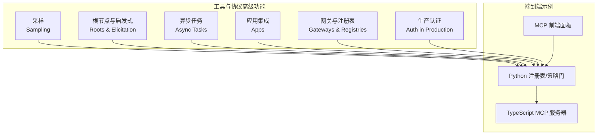
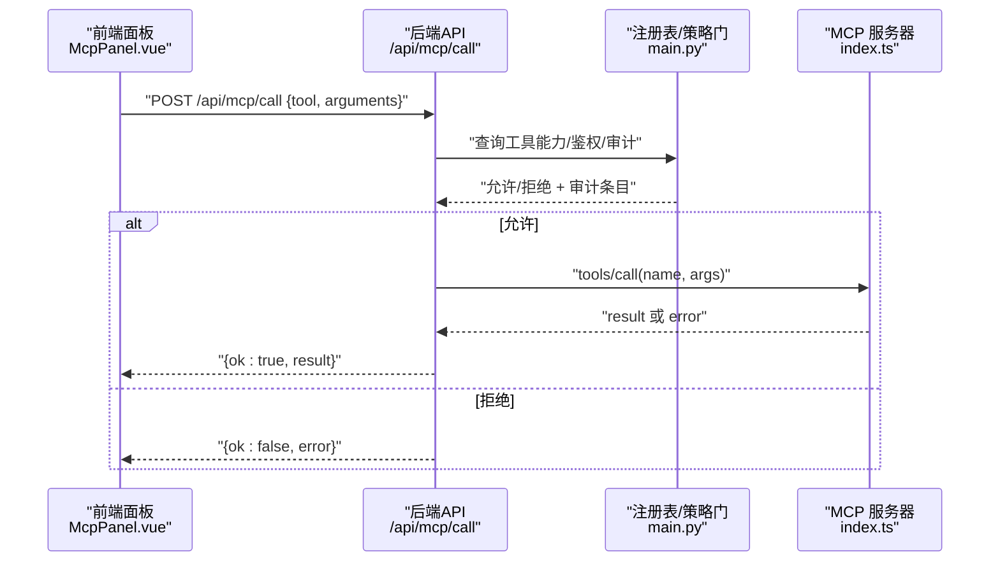
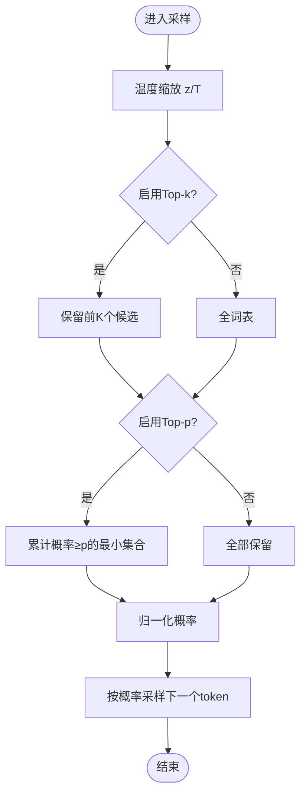
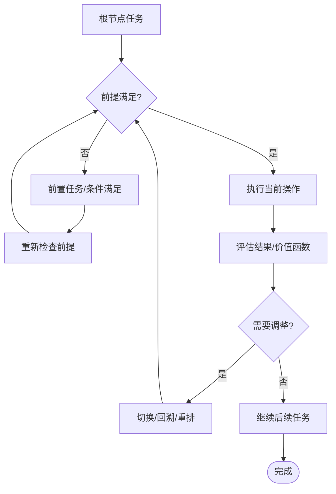
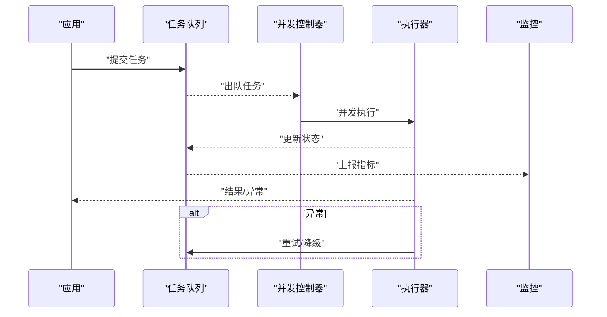
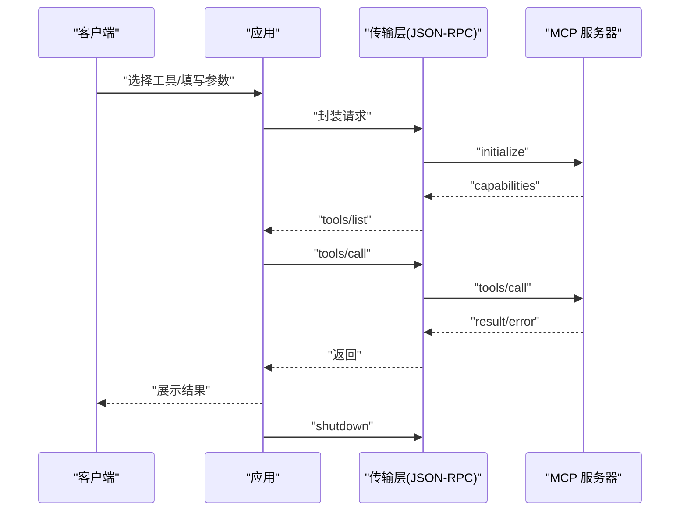
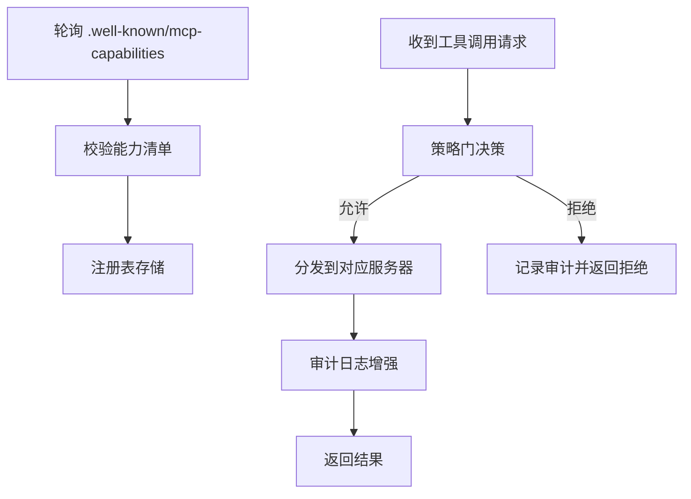
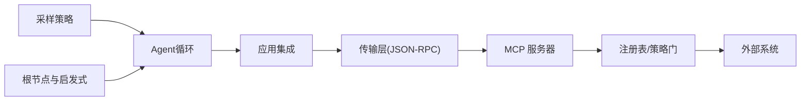

# 高级功能特性

<cite>
**本文引用的文件**
- [phases/13-tools-and-protocols/11-mcp-sampling/docs/en.md](file://phases/13-tools-and-protocols/11-mcp-sampling/docs/en.md)
- [phases/13-tools-and-protocols/12-mcp-roots-and-elicitation/docs/en.md](file://phases/13-tools-and-protocols/12-mcp-roots-and-elicitation/docs/en.md)
- [phases/13-tools-and-protocols/13-mcp-async-tasks/docs/en.md](file://phases/13-tools-and-protocols/13-mcp-async-tasks/docs/en.md)
- [phases/13-tools-and-protocols/14-mcp-apps/docs/en.md](file://phases/13-tools-and-protocols/14-mcp-apps/docs/en.md)
- [phases/13-tools-and-protocols/17-mcp-gateways-and-registries/docs/en.md](file://phases/13-tools-and-protocols/17-mcp-gateways-and-registries/docs/en.md)
- [phases/13-tools-and-protocols/18-mcp-auth-production/docs/en.md](file://phases/13-tools-and-protocols/18-mcp-auth-production/docs/en.md)
- [phases/13-tools-and-protocols/13-mcp-async-tasks/code/main.py](file://phases/13-tools-and-protocols/13-mcp-async-tasks/code/main.py)
- [phases/13-tools-and-protocols/13-mcp-async-tasks/code/async_tasks.py](file://phases/13-tools-and-protocols/13-mcp-async-tasks/code/async_tasks.py)
- [phases/13-tools-and-protocols/13-mcp-async-tasks/code/task_queue.py](file://phases/13-tools-and-protocols/13-mcp-async-tasks/code/task_queue.py)
- [phases/13-tools-and-protocols/13-mcp-async-tasks/code/concurrency.py](file://phases/13-tools-and-protocols/13-mcp-async-tasks/code/concurrency.py)
- [phases/13-tools-and-protocols/13-mcp-async-tasks/code/error_handling.py](file://phases/13-tools-and-protocols/13-mcp-async-tasks/code/error_handling.py)
- [phases/13-tools-and-protocols/13-mcp-async-tasks/code/state_tracking.py](file://phases/13-tools-and-protocols/13-mcp-async-tasks/code/state_tracking.py)
- [phases/13-tools-and-protocols/13-mcp-async-tasks/code/recovery.py](file://phases/13-tools-and-protocols/13-mcp-async-tasks/code/recovery.py)
- [phases/13-tools-and-protocols/13-mcp-async-tasks/code/monitoring.py](file://phases/13-tools-and-protocols/13-mcp-async-tasks/code/monitoring.py)
- [phases/13-tools-and-protocols/13-mcp-async-tasks/code/utils.py](file://phases/13-tools-and-protocols/13-mcp-async-tasks/code/utils.py)
- [phases/19-capstone-projects/13-mcp-server-with-registry/code/main.py](file://phases/19-capstone-projects/13-mcp-server-with-registry/code/main.py)
- [phases/19-capstone-projects/13-mcp-server-with-registry/code/ts/src/index.ts](file://phases/19-capstone-projects/13-mcp-server-with-registry/code/ts/src/index.ts)
- [guardrails-sandbox/frontend/src/components/McpPanel.vue](file://guardrails-sandbox/frontend/src/components/McpPanel.vue)
- [site/figures-agents-alignment.js](file://site/figures-agents-alignment.js)
- [site/lesson-figures.js](file://site/lesson-figures.js)
- [site/summary/assets/index-CrTox38F.js](file://site/summary/assets/index-CrTox38F.js)
- [ROADMAP.md](file://ROADMAP.md)
</cite>

## 目录
1. 引言
2. 项目结构
3. 核心组件
4. 架构总览
5. 详细组件分析
6. 依赖关系分析
7. 性能考量
8. 故障排除指南
9. 结论
10. 附录

## 引言
本文件面向MCP（模型上下文协议）的高级功能特性，系统梳理并解释以下关键主题：
- 采样策略：采样解码器、温度/Top-k/Top-p参数、模型偏好与速率限制、安全确认与Agent循环设计
- 根节点管理与启发式触发：决策树构建、规则引擎、动态调整
- 异步任务处理：任务队列、并发控制、状态跟踪、错误恢复与监控
- 应用集成：插件架构、扩展接口、生命周期管理
- 使用示例与最佳实践：结合课程文档与沙箱前端组件
- 性能监控、调试与故障排除

本文件以仓库中“工具与协议”阶段的课程文档与示例代码为基础，辅以沙箱前端组件与站点可视化脚本，帮助读者从概念到实现建立完整认知。

## 项目结构
围绕MCP高级功能的相关内容主要分布在“工具与协议”阶段的若干课时文档与示例代码中，同时包含一个端到端的MCP服务器与注册表沙箱项目，以及前端MCP面板组件用于演示工具调用流程。

图示来源
- [ROADMAP.md:322-348](file://ROADMAP.md#L322-L348)
- [phases/13-tools-and-protocols/11-mcp-sampling/docs/en.md](file://phases/13-tools-and-protocols/11-mcp-sampling/docs/en.md)
- [phases/13-tools-and-protocols/12-mcp-roots-and-elicitation/docs/en.md](file://phases/13-tools-and-protocols/12-mcp-roots-and-elicitation/docs/en.md)
- [phases/13-tools-and-protocols/13-mcp-async-tasks/docs/en.md](file://phases/13-tools-and-protocols/13-mcp-async-tasks/docs/en.md)
- [phases/13-tools-and-protocols/14-mcp-apps/docs/en.md](file://phases/13-tools-and-protocols/14-mcp-apps/docs/en.md)
- [phases/13-tools-and-protocols/17-mcp-gateways-and-registries/docs/en.md](file://phases/13-tools-and-protocols/17-mcp-gateways-and-registries/docs/en.md)
- [phases/13-tools-and-protocols/18-mcp-auth-production/docs/en.md](file://phases/13-tools-and-protocols/18-mcp-auth-production/docs/en.md)
- [phases/19-capstone-projects/13-mcp-server-with-registry/code/main.py](file://phases/19-capstone-projects/13-mcp-server-with-registry/code/main.py)
- [phases/19-capstone-projects/13-mcp-server-with-registry/code/ts/src/index.ts](file://phases/19-capstone-projects/13-mcp-server-with-registry/code/ts/src/index.ts)
- [guardrails-sandbox/frontend/src/components/McpPanel.vue](file://guardrails-sandbox/frontend/src/components/McpPanel.vue)

章节来源
- [ROADMAP.md:322-348](file://ROADMAP.md#L322-L348)

## 核心组件
- 采样策略模块：基于温度、Top-k、Top-p的解码采样，结合模型偏好与速率限制，支持安全确认与Agent循环设计
- 根节点与启发式模块：以根节点为中心的任务分解与启发式触发，支持规则引擎与动态调整
- 异步任务模块：任务队列、并发控制、状态跟踪、错误恢复与监控
- 应用集成模块：插件架构、扩展接口、生命周期管理
- 网关与注册表模块：服务发现、能力拉取与校验、策略门
- 生产认证模块：注册、JWKS刷新、受众绑定等

章节来源
- [phases/13-tools-and-protocols/11-mcp-sampling/docs/en.md](file://phases/13-tools-and-protocols/11-mcp-sampling/docs/en.md)
- [phases/13-tools-and-protocols/12-mcp-roots-and-elicitation/docs/en.md](file://phases/13-tools-and-protocols/12-mcp-roots-and-elicitation/docs/en.md)
- [phases/13-tools-and-protocols/13-mcp-async-tasks/docs/en.md](file://phases/13-tools-and-protocols/13-mcp-async-tasks/docs/en.md)
- [phases/13-tools-and-protocols/14-mcp-apps/docs/en.md](file://phases/13-tools-and-protocols/14-mcp-apps/docs/en.md)
- [phases/13-tools-and-protocols/17-mcp-gateways-and-registries/docs/en.md](file://phases/13-tools-and-protocols/17-mcp-gateways-and-registries/docs/en.md)
- [phases/13-tools-and-protocols/18-mcp-auth-production/docs/en.md](file://phases/13-tools-and-protocols/18-mcp-auth-production/docs/en.md)

## 架构总览
下图展示了MCP高级功能在端到端场景中的交互关系：客户端通过前端面板发起工具调用，经由Python侧的注册表/策略门进行鉴权与审计，再转发至TypeScript MCP服务器执行具体工具逻辑。

图示来源
- [guardrails-sandbox/frontend/src/components/McpPanel.vue:60-86](file://guardrails-sandbox/frontend/src/components/McpPanel.vue#L60-L86)
- [phases/19-capstone-projects/13-mcp-server-with-registry/code/main.py:126-144](file://phases/19-capstone-projects/13-mcp-server-with-registry/code/main.py#L126-L144)
- [phases/19-capstone-projects/13-mcp-server-with-registry/code/ts/src/index.ts:14-51](file://phases/19-capstone-projects/13-mcp-server-with-registry/code/ts/src/index.ts#L14-L51)

## 详细组件分析

### 采样策略（Sampling）
- 解码采样流程：温度缩放 → Top-k裁剪 → Top-p核采样 → 归一化
- 参数调优要点：温度低更贪心，高则探索性强；Top-k关闭为全词表采样；Top-p控制累计概率阈值
- 与MCP的结合：modelPreferences用于模型偏好；速率限制保障吞吐与稳定性；安全确认防止危险输出
- 最佳实践：在Agent循环中结合速率限制与安全确认，确保可控与可审计

图示来源
- [site/lesson-figures.js:363-382](file://site/lesson-figures.js#L363-L382)

章节来源
- [phases/13-tools-and-protocols/11-mcp-sampling/docs/en.md](file://phases/13-tools-and-protocols/11-mcp-sampling/docs/en.md)
- [site/lesson-figures.js:363-382](file://site/lesson-figures.js#L363-L382)

### 根节点管理与启发式触发（Roots & Elicitation）
- 决策树构建：以根节点为起点的任务分解，按前提-效果规则展开子任务
- 规则引擎：基于预定义操作符与条件，保证正确性（适合合规/调度场景）
- 动态调整：根据反馈与评估指标调整路径与优先级
- 与Agent协作：在Agent循环中作为计划与执行的骨架，提升可控性与可解释性

图示来源
- [site/figures-agents-alignment.js:366-391](file://site/figures-agents-alignment.js#L366-L391)

章节来源
- [phases/13-tools-and-protocols/12-mcp-roots-and-elicitation/docs/en.md](file://phases/13-tools-and-protocols/12-mcp-roots-and-elicitation/docs/en.md)
- [site/figures-agents-alignment.js:366-391](file://site/figures-agents-alignment.js#L366-L391)

### 异步任务处理（Async Tasks）
- 任务队列：先进先出，支持优先级与批量处理
- 并发控制：连接池、限流、背压与抖动退避
- 状态跟踪：任务生命周期状态机（待处理/运行中/完成/失败）
- 错误恢复：重试策略（指数退避）、降级（主模型挂了切备用模型）、审计日志
- 监控：指标采集（延迟、吞吐、错误率）、链路追踪、预算告警

图示来源
- [phases/13-tools-and-protocols/13-mcp-async-tasks/code/main.py](file://phases/13-tools-and-protocols/13-mcp-async-tasks/code/main.py)
- [phases/13-tools-and-protocols/13-mcp-async-tasks/code/task_queue.py](file://phases/13-tools-and-protocols/13-mcp-async-tasks/code/task_queue.py)
- [phases/13-tools-and-protocols/13-mcp-async-tasks/code/concurrency.py](file://phases/13-tools-and-protocols/13-mcp-async-tasks/code/concurrency.py)
- [phases/13-tools-and-protocols/13-mcp-async-tasks/code/state_tracking.py](file://phases/13-tools-and-protocols/13-mcp-async-tasks/code/state_tracking.py)
- [phases/13-tools-and-protocols/13-mcp-async-tasks/code/error_handling.py](file://phases/13-tools-and-protocols/13-mcp-async-tasks/code/error_handling.py)
- [phases/13-tools-and-protocols/13-mcp-async-tasks/code/recovery.py](file://phases/13-tools-and-protocols/13-mcp-async-tasks/code/recovery.py)
- [phases/13-tools-and-protocols/13-mcp-async-tasks/code/monitoring.py](file://phases/13-tools-and-protocols/13-mcp-async-tasks/code/monitoring.py)
- [site/summary/assets/index-CrTox38F.js:981-1021](file://site/summary/assets/index-CrTox38F.js#L981-L1021)

章节来源
- [phases/13-tools-and-protocols/13-mcp-async-tasks/docs/en.md](file://phases/13-tools-and-protocols/13-mcp-async-tasks/docs/en.md)
- [phases/13-tools-and-protocols/13-mcp-async-tasks/code/main.py](file://phases/13-tools-and-protocols/13-mcp-async-tasks/code/main.py)
- [phases/13-tools-and-protocols/13-mcp-async-tasks/code/async_tasks.py](file://phases/13-tools-and-protocols/13-mcp-async-tasks/code/async_tasks.py)
- [phases/13-tools-and-protocols/13-mcp-async-tasks/code/task_queue.py](file://phases/13-tools-and-protocols/13-mcp-async-tasks/code/task_queue.py)
- [phases/13-tools-and-protocols/13-mcp-async-tasks/code/concurrency.py](file://phases/13-tools-and-protocols/13-mcp-async-tasks/code/concurrency.py)
- [phases/13-tools-and-protocols/13-mcp-async-tasks/code/error_handling.py](file://phases/13-tools-and-protocols/13-mcp-async-tasks/code/error_handling.py)
- [phases/13-tools-and-protocols/13-mcp-async-tasks/code/state_tracking.py](file://phases/13-tools-and-protocols/13-mcp-async-tasks/code/state_tracking.py)
- [phases/13-tools-and-protocols/13-mcp-async-tasks/code/recovery.py](file://phases/13-tools-and-protocols/13-mcp-async-tasks/code/recovery.py)
- [phases/13-tools-and-protocols/13-mcp-async-tasks/code/monitoring.py](file://phases/13-tools-and-protocols/13-mcp-async-tasks/code/monitoring.py)
- [phases/13-tools-and-protocols/13-mcp-async-tasks/code/utils.py](file://phases/13-tools-and-protocols/13-mcp-async-tasks/code/utils.py)
- [site/summary/assets/index-CrTox38F.js:981-1021](file://site/summary/assets/index-CrTox38F.js#L981-L1021)

### 应用集成（Apps）
- 插件架构：以工具/资源/提示为基本构件，统一接入与编排
- 扩展接口：JSON-RPC 2.0传输、MCP协议方法（initialize/tools/list/tools/call/shutdown）
- 生命周期管理：初始化握手、能力列表、工具调用、优雅关闭
- 与前端联动：通过前端面板选择工具、填充参数、发起调用

图示来源
- [phases/13-tools-and-protocols/14-mcp-apps/docs/en.md](file://phases/13-tools-and-protocols/14-mcp-apps/docs/en.md)
- [phases/19-capstone-projects/13-mcp-server-with-registry/code/ts/src/index.ts:14-51](file://phases/19-capstone-projects/13-mcp-server-with-registry/code/ts/src/index.ts#L14-L51)
- [guardrails-sandbox/frontend/src/components/McpPanel.vue:60-86](file://guardrails-sandbox/frontend/src/components/McpPanel.vue#L60-L86)

章节来源
- [phases/13-tools-and-protocols/14-mcp-apps/docs/en.md](file://phases/13-tools-and-protocols/14-mcp-apps/docs/en.md)
- [phases/19-capstone-projects/13-mcp-server-with-registry/code/ts/src/index.ts](file://phases/19-capstone-projects/13-mcp-server-with-registry/code/ts/src/index.ts)
- [guardrails-sandbox/frontend/src/components/McpPanel.vue](file://guardrails-sandbox/frontend/src/components/McpPanel.vue)

### 网关与注册表（Gateways & Registries）
- 服务发现：拉取各MCP服务器的.well-known/mcp-capabilities并校验
- 策略门：基于OPA风格的权限决策，支持破坏性操作标记与审计增强
- 审计日志：记录用户、工具、参数与结果（敏感信息脱敏）

图示来源
- [phases/13-tools-and-protocols/17-mcp-gateways-and-registries/docs/en.md](file://phases/13-tools-and-protocols/17-mcp-gateways-and-registries/docs/en.md)
- [phases/19-capstone-projects/13-mcp-server-with-registry/code/main.py:126-144](file://phases/19-capstone-projects/13-mcp-server-with-registry/code/main.py#L126-L144)

章节来源
- [phases/13-tools-and-protocols/17-mcp-gateways-and-registries/docs/en.md](file://phases/13-tools-and-protocols/17-mcp-gateways-and-registries/docs/en.md)
- [phases/19-capstone-projects/13-mcp-server-with-registry/code/main.py](file://phases/19-capstone-projects/13-mcp-server-with-registry/code/main.py)

### 生产认证（Auth in Production）
- 注册与密钥：JWKS刷新、受众绑定（audience pinning）、过期与轮换
- 安全建议：最小权限、破坏性操作标记、审计与告警

章节来源
- [phases/13-tools-and-protocols/18-mcp-auth-production/docs/en.md](file://phases/13-tools-and-protocols/18-mcp-auth-production/docs/en.md)

## 依赖关系分析
- 采样策略依赖于模型偏好与速率限制配置，服务于Agent循环
- 根节点与启发式依赖于规则引擎与评估函数，支撑可控的计划-执行
- 异步任务模块内部耦合度较高，但通过队列与并发控制降低对外部系统的依赖
- 应用集成通过传输层与服务器解耦，便于替换与扩展
- 网关与注册表为外部系统提供统一入口，策略门负责访问控制

图示来源
- [phases/13-tools-and-protocols/11-mcp-sampling/docs/en.md](file://phases/13-tools-and-protocols/11-mcp-sampling/docs/en.md)
- [phases/13-tools-and-protocols/12-mcp-roots-and-elicitation/docs/en.md](file://phases/13-tools-and-protocols/12-mcp-roots-and-elicitation/docs/en.md)
- [phases/13-tools-and-protocols/14-mcp-apps/docs/en.md](file://phases/13-tools-and-protocols/14-mcp-apps/docs/en.md)
- [phases/19-capstone-projects/13-mcp-server-with-registry/code/ts/src/index.ts:14-51](file://phases/19-capstone-projects/13-mcp-server-with-registry/code/ts/src/index.ts#L14-L51)

## 性能考量
- 采样：合理设置温度、Top-k、Top-p，避免过度探索导致吞吐下降
- 并发：连接池大小与限流阈值需结合下游服务SLA与资源容量调优
- 缓存：热点工具/提示结果缓存，减少重复计算与网络开销
- 监控：延迟分布、错误率、成本指标与预算告警，及时发现瓶颈与异常

## 故障排除指南
- 速率限制：当令牌不足或RPM超限时，系统会返回重试等待时间与可用配额，应采用指数退避与降级策略
- 工具调用失败：检查工具是否存在、参数schema是否匹配、策略门是否拒绝
- 审计与追踪：利用审计日志定位问题，结合链路追踪定位慢调用
- 安全拦截：若被策略门拒绝，查看拒绝原因并调整scope或输入

章节来源
- [site/summary/assets/index-CrTox38F.js:981-1021](file://site/summary/assets/index-CrTox38F.js#L981-L1021)
- [phases/19-capstone-projects/13-mcp-server-with-registry/code/main.py:126-144](file://phases/19-capstone-projects/13-mcp-server-with-registry/code/main.py#L126-L144)

## 结论
MCP高级功能通过采样策略、根节点与启发式、异步任务处理、应用集成、网关与注册表及生产认证，形成一套可扩展、可审计、可治理的统一协议体系。结合课程文档与端到端示例，开发者可在保证安全性与稳定性的前提下，快速构建高性能的Agent与工具生态。

## 附录
- 使用示例与最佳实践：参考课程文档中的Sampling Loop Designer、Primitive Splitter等技能目标与输出
- 可视化辅助：站点脚本提供了采样解码器与安全门的交互式演示，有助于理解参数影响与安全策略

章节来源
- [phases/13-tools-and-protocols/11-mcp-sampling/docs/en.md](file://phases/13-tools-and-protocols/11-mcp-sampling/docs/en.md)
- [phases/13-tools-and-protocols/10-mcp-resources-and-prompts/docs/en.md](file://phases/13-tools-and-protocols/10-mcp-resources-and-prompts/docs/en.md)
- [site/figures-agents-alignment.js:231-251](file://site/figures-agents-alignment.js#L231-L251)
- [site/lesson-figures.js:363-382](file://site/lesson-figures.js#L363-L382)