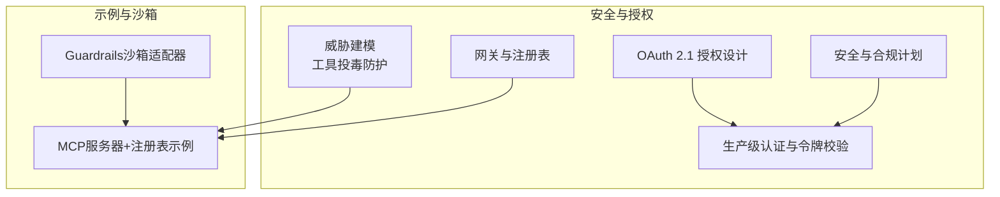
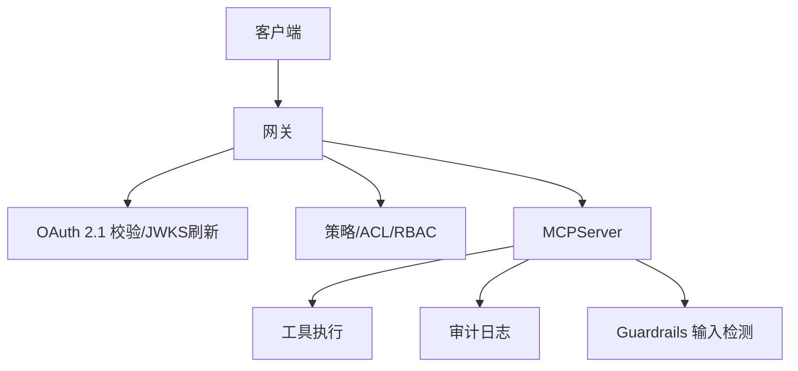
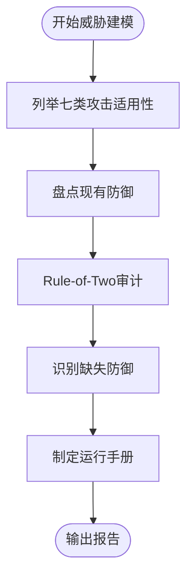
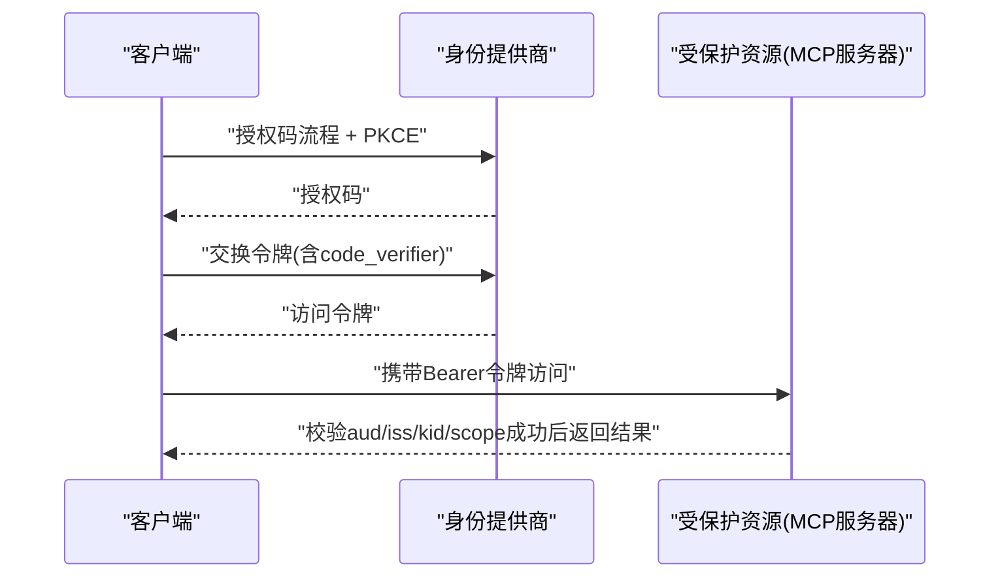
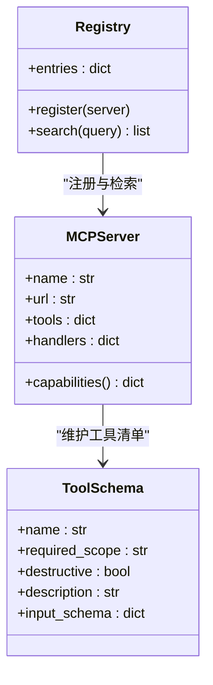
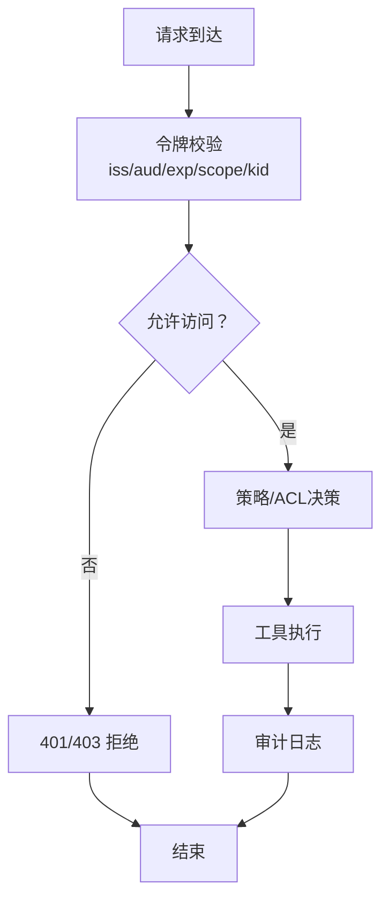
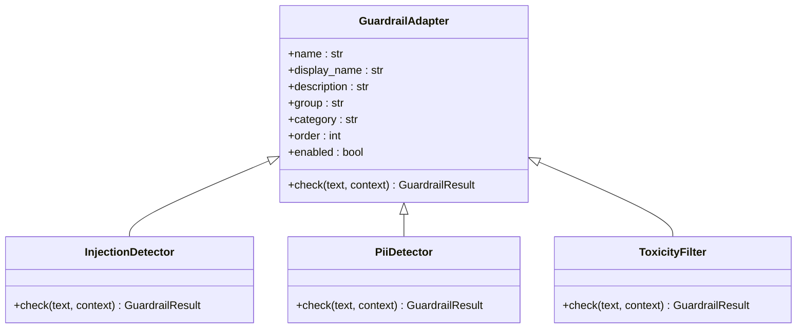
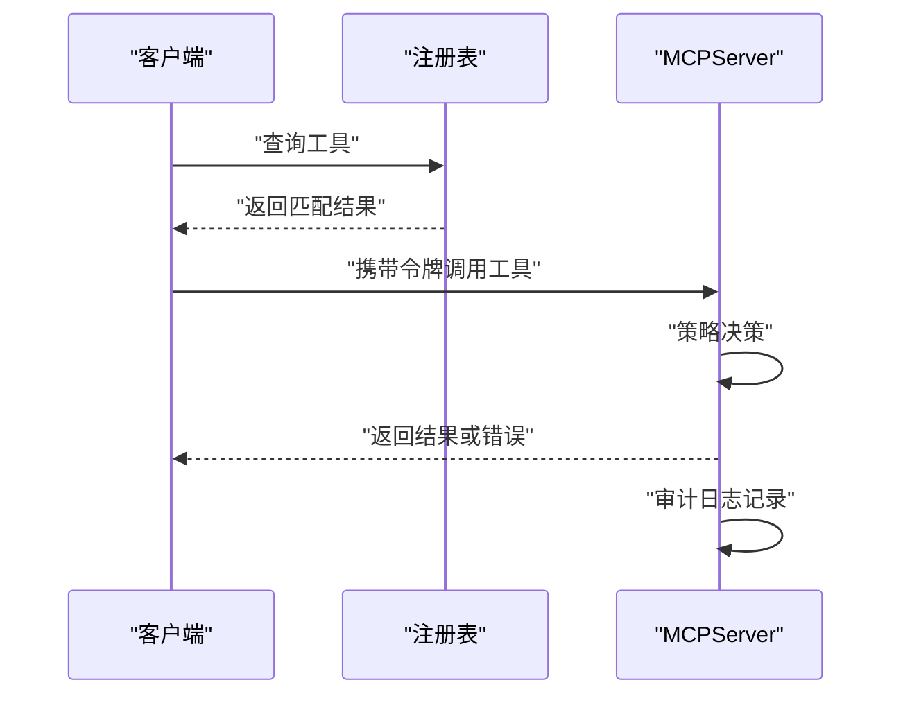
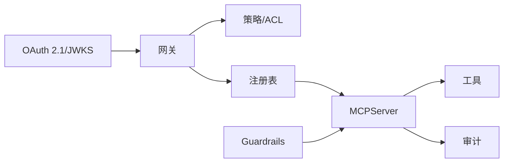

# MCP安全与生产部署

<cite>
**本文引用的文件**
- [phases/13-tools-and-protocols/15-mcp-security-tool-poisoning/outputs/skill-mcp-threat-model.md](file://phases/13-tools-and-protocols/15-mcp-security-tool-poisoning/outputs/skill-mcp-threat-model.md)
- [phases/13-tools-and-protocols/16-mcp-security-oauth-2-1/outputs/skill-oauth-scope-planner.md](file://phases/13-tools-and-protocols/16-mcp-security-oauth-2-1/outputs/skill-oauth-scope-planner.md)
- [phases/13-tools-and-protocols/17-mcp-gateways-and-registries/outputs/skill-gateway-bootstrap.md](file://phases/13-tools-and-protocols/17-mcp-gateways-and-registries/outputs/skill-gateway-bootstrap.md)
- [phases/13-tools-and-protocols/18-mcp-auth-production/outputs/skill-mcp-auth.md](file://phases/13-tools-and-protocols/18-mcp-auth-production/outputs/skill-mcp-auth.md)
- [phases/19-capstone-projects/13-mcp-server-with-registry/code/main.py](file://phases/19-capstone-projects/13-mcp-server-with-registry/code/main.py)
- [guardrails-sandbox/backend/adapters/base.py](file://guardrails-sandbox/backend/adapters/base.py)
- [guardrails-sandbox/backend/adapters/injection.py](file://guardrails-sandbox/backend/adapters/injection.py)
- [guardrails-sandbox/backend/adapters/pii_detector.py](file://guardrails-sandbox/backend/adapters/pii_detector.py)
- [guardrails-sandbox/backend/adapters/toxicity.py](file://guardrails-sandbox/backend/adapters/toxicity.py)
- [phases/17-infrastructure-and-production/25-security-secrets-audit/outputs/skill-llm-security-plan.md](file://phases/17-infrastructure-and-production/25-security-secrets-audit/outputs/skill-llm-security-plan.md)
</cite>

## 目录
1. [简介](#简介)
2. [项目结构](#项目结构)
3. [核心组件](#核心组件)
4. [架构总览](#架构总览)
5. [详细组件分析](#详细组件分析)
6. [依赖关系分析](#依赖关系分析)
7. [性能考量](#性能考量)
8. [故障排查指南](#故障排查指南)
9. [结论](#结论)
10. [附录](#附录)

## 简介
本文件面向MCP（Model Context Protocol）在企业与生产环境中的安全与高可用部署，系统化梳理以下主题：工具投毒攻击的防护机制（恶意工具检测、输入验证、沙箱隔离）、OAuth 2.1认证协议的集成与配置（令牌管理、权限控制、会话安全）、网关与注册表的设计与实现（服务发现、负载均衡、健康检查、策略编排）、以及生产级认证与授权（多租户、访问控制、审计日志）。同时提供安全最佳实践与风险评估指南，确保MCP系统的安全性与可靠性。

## 项目结构
围绕MCP安全与生产部署的相关内容主要分布在如下模块：
- 安全威胁建模与工具投毒防护：技能输出文档定义了威胁分类、防御清单、Rule-of-Two审计与改进行动。
- OAuth 2.1授权设计：技能输出文档定义了作用域层次、映射、提升授权策略与受保护资源元数据。
- 网关与注册表：技能输出文档定义了后端清单、RBAC矩阵、速率限制与审计计划。
- 生产级认证：技能输出文档定义了受保护资源元数据、端点、JWKS刷新、缓存策略与运行时拒绝规则。
- 示例与沙箱：MCP服务器+注册表示例展示了基于策略的工具调用与审计；Guardrails沙箱适配器提供了输入层安全检测能力。
- 安全与合规：安全计划文档覆盖密钥管理、PII清洗、网络出站白名单、审计日志与零信任。

**章节来源**
- [phases/13-tools-and-protocols/15-mcp-security-tool-poisoning/outputs/skill-mcp-threat-model.md:1-31](file://phases/13-tools-and-protocols/15-mcp-security-tool-poisoning/outputs/skill-mcp-threat-model.md#L1-L31)
- [phases/13-tools-and-protocols/16-mcp-security-oauth-2-1/outputs/skill-oauth-scope-planner.md:1-31](file://phases/13-tools-and-protocols/16-mcp-security-oauth-2-1/outputs/skill-oauth-scope-planner.md#L1-L31)
- [phases/13-tools-and-protocols/17-mcp-gateways-and-registries/outputs/skill-gateway-bootstrap.md:1-31](file://phases/13-tools-and-protocols/17-mcp-gateways-and-registries/outputs/skill-gateway-bootstrap.md#L1-L31)
- [phases/13-tools-and-protocols/18-mcp-auth-production/outputs/skill-mcp-auth.md:1-63](file://phases/13-tools-and-protocols/18-mcp-auth-production/outputs/skill-mcp-auth.md#L1-L63)
- [phases/19-capstone-projects/13-mcp-server-with-registry/code/main.py:1-238](file://phases/19-capstone-projects/13-mcp-server-with-registry/code/main.py#L1-L238)
- [guardrails-sandbox/backend/adapters/base.py:1-34](file://guardrails-sandbox/backend/adapters/base.py#L1-L34)
- [guardrails-sandbox/backend/adapters/injection.py:1-88](file://guardrails-sandbox/backend/adapters/injection.py#L1-L88)
- [guardrails-sandbox/backend/adapters/pii_detector.py:1-54](file://guardrails-sandbox/backend/adapters/pii_detector.py#L1-L54)
- [guardrails-sandbox/backend/adapters/toxicity.py:1-64](file://guardrails-sandbox/backend/adapters/toxicity.py#L1-L64)
- [phases/17-infrastructure-and-production/25-security-secrets-audit/outputs/skill-llm-security-plan.md:1-33](file://phases/17-infrastructure-and-production/25-security-secrets-audit/outputs/skill-llm-security-plan.md#L1-L33)

## 核心组件
- 工具与作用域模型：工具具备输入模式、破坏性标记与所需作用域；令牌包含用户、作用域集合与“人类批准”新鲜度窗口。
- 策略决策引擎：基于工具存在性、作用域匹配、破坏性工具的人类批准新鲜度与请求大小限制进行决策。
- 审计与脱敏：结构化审计条目，对邮件、社会安全号码等进行脱敏处理。
- 注册表：拉取并缓存各后端的.mcp-capabilities清单，支持按名称/描述检索。
- Guardrails沙箱适配器：提供注入检测、PII检测、毒性过滤等输入层安全检测能力。

**章节来源**
- [phases/19-capstone-projects/13-mcp-server-with-registry/code/main.py:25-98](file://phases/19-capstone-projects/13-mcp-server-with-registry/code/main.py#L25-L98)
- [phases/19-capstone-projects/13-mcp-server-with-registry/code/main.py:104-144](file://phases/19-capstone-projects/13-mcp-server-with-registry/code/main.py#L104-L144)
- [phases/19-capstone-projects/13-mcp-server-with-registry/code/main.py:150-165](file://phases/19-capstone-projects/13-mcp-server-with-registry/code/main.py#L150-L165)
- [guardrails-sandbox/backend/adapters/base.py:14-34](file://guardrails-sandbox/backend/adapters/base.py#L14-L34)
- [guardrails-sandbox/backend/adapters/injection.py:44-88](file://guardrails-sandbox/backend/adapters/injection.py#L44-L88)
- [guardrails-sandbox/backend/adapters/pii_detector.py:19-54](file://guardrails-sandbox/backend/adapters/pii_detector.py#L19-L54)
- [guardrails-sandbox/backend/adapters/toxicity.py:22-64](file://guardrails-sandbox/backend/adapters/toxicity.py#L22-L64)

## 架构总览
下图展示MCP在生产环境中的关键交互：客户端通过网关发起工具调用，网关进行OAuth 2.1令牌校验与策略决策，随后路由至后端MCPServer；后端依据工具与令牌执行业务逻辑并记录审计日志；Guardrails在输入侧进行安全检测。

**图表来源**
- [phases/13-tools-and-protocols/18-mcp-auth-production/outputs/skill-mcp-auth.md:29-49](file://phases/13-tools-and-protocols/18-mcp-auth-production/outputs/skill-mcp-auth.md#L29-L49)
- [phases/13-tools-and-protocols/17-mcp-gateways-and-registries/outputs/skill-gateway-bootstrap.md:12-19](file://phases/13-tools-and-protocols/17-mcp-gateways-and-registries/outputs/skill-gateway-bootstrap.md#L12-L19)
- [phases/19-capstone-projects/13-mcp-server-with-registry/code/main.py:126-144](file://phases/19-capstone-projects/13-mcp-server-with-registry/code/main.py#L126-L144)
- [guardrails-sandbox/backend/adapters/base.py:14-34](file://guardrails-sandbox/backend/adapters/base.py#L14-L34)

## 详细组件分析

### 组件A：工具投毒攻击防护
- 攻击适用性：针对工具投毒、抽屉交易、影子操作、MPMA、寄生工具链、采样攻击与供应链伪装等七类攻击，结合部署现状进行分级评估。
- 防御清单：包括哈希固定、静态检测器、网关集中治理、签名注册表、MELON与Rule-of-Two强制。
- Rule-of-Two审计：对每个工具进行“不受信/敏感/后果严重”的三元组合标记，禁止在同一轮次内同时满足三项条件。
- 缺失防御：根据威胁画像提出最高杠杆补充项（例如未实施的Per-Session限流或未采用受保护注册表）。
- 运行手册：建议团队在一周内完成三项具体动作以提升安全态势。

**图表来源**
- [phases/13-tools-and-protocols/15-mcp-security-tool-poisoning/outputs/skill-mcp-threat-model.md:10-31](file://phases/13-tools-and-protocols/15-mcp-security-tool-poisoning/outputs/skill-mcp-threat-model.md#L10-L31)

**章节来源**
- [phases/13-tools-and-protocols/15-mcp-security-tool-poisoning/outputs/skill-mcp-threat-model.md:10-31](file://phases/13-tools-and-protocols/15-mcp-security-tool-poisoning/outputs/skill-mcp-threat-model.md#L10-L31)

### 组件B：OAuth 2.1认证与授权设计
- 作用域层次：按操作类别（只读/写入/删除/管理）构建梯度作用域，避免作用域爆炸。
- 作用域到工具映射：为每个工具标注所需作用域，标记需要多重作用域的工具。
- 提升授权策略：破坏性操作需二次确认（Step-up），典型为管理员级操作。
- 受保护资源标识：定义资源URL与.well-known/oauth-protected-resource元数据。
- 强制拒绝与拒绝规则：禁止使用隐式流、跳过受众校验、明文存储机密等；明确运行时拒绝条件。

**图表来源**
- [phases/13-tools-and-protocols/16-mcp-security-oauth-2-1/outputs/skill-oauth-scope-planner.md:10-31](file://phases/13-tools-and-protocols/16-mcp-security-oauth-2-1/outputs/skill-oauth-scope-planner.md#L10-L31)
- [phases/13-tools-and-protocols/18-mcp-auth-production/outputs/skill-mcp-auth.md:21-61](file://phases/13-tools-and-protocols/18-mcp-auth-production/outputs/skill-mcp-auth.md#L21-L61)

**章节来源**
- [phases/13-tools-and-protocols/16-mcp-security-oauth-2-1/outputs/skill-oauth-scope-planner.md:10-31](file://phases/13-tools-and-protocols/16-mcp-security-oauth-2-1/outputs/skill-oauth-scope-planner.md#L10-L31)
- [phases/13-tools-and-protocols/18-mcp-auth-production/outputs/skill-mcp-auth.md:10-63](file://phases/13-tools-and-protocols/18-mcp-auth-production/outputs/skill-mcp-auth.md#L10-L63)

### 组件C：网关与注册表
- 后端清单：登记官方/第三方注册表、反向DNS命名、工具描述哈希固定。
- 用户与角色：定义角色与允许工具集，形成用户×后端×工具的RBAC矩阵。
- 速率限制：区分用户突发与持续限额，昂贵工具设置工具级限额。
- 审计计划：确定日志目的地（文件/OpenTelemetry/SIEM）、保留期与必填字段。

**图表来源**
- [phases/19-capstone-projects/13-mcp-server-with-registry/code/main.py:150-165](file://phases/19-capstone-projects/13-mcp-server-with-registry/code/main.py#L150-L165)
- [phases/19-capstone-projects/13-mcp-server-with-registry/code/main.py:37-61](file://phases/19-capstone-projects/13-mcp-server-with-registry/code/main.py#L37-L61)
- [phases/19-capstone-projects/13-mcp-server-with-registry/code/main.py:25-32](file://phases/19-capstone-projects/13-mcp-server-with-registry/code/main.py#L25-L32)

**章节来源**
- [phases/13-tools-and-protocols/17-mcp-gateways-and-registries/outputs/skill-gateway-bootstrap.md:10-31](file://phases/13-tools-and-protocols/17-mcp-gateways-and-registries/outputs/skill-gateway-bootstrap.md#L10-L31)
- [phases/19-capstone-projects/13-mcp-server-with-registry/code/main.py:150-165](file://phases/19-capstone-projects/13-mcp-server-with-registry/code/main.py#L150-L165)

### 组件D：生产级认证与令牌校验
- 受保护资源元数据：包含资源URL、授权服务器列表、支持的作用域与承载方式。
- HTTP端点：暴露受保护资源元数据、MCP传输端点与可选注册端点。
- 后台任务：定时刷新JWKS、校验流程（iss允许列表、签名、aud、exp、scope）与二次签发路径。
- 缓存策略：按发行方缓存JWKS，miss时回退同步刷新，避免密钥轮换DoS。
- 运行时拒绝规则：严格校验aud、iss、kid、scope与PKCE参数。

**图表来源**
- [phases/13-tools-and-protocols/18-mcp-auth-production/outputs/skill-mcp-auth.md:29-49](file://phases/13-tools-and-protocols/18-mcp-auth-production/outputs/skill-mcp-auth.md#L29-L49)
- [phases/19-capstone-projects/13-mcp-server-with-registry/code/main.py:85-97](file://phases/19-capstone-projects/13-mcp-server-with-registry/code/main.py#L85-L97)

**章节来源**
- [phases/13-tools-and-protocols/18-mcp-auth-production/outputs/skill-mcp-auth.md:10-63](file://phases/13-tools-and-protocols/18-mcp-auth-production/outputs/skill-mcp-auth.md#L10-L63)

### 组件E：输入安全与沙箱隔离
- Guardrails适配器基类：统一的检查接口与执行顺序控制。
- 注入检测：基于正则匹配的提示注入模式与编码绕过检测。
- PII检测：识别手机号、邮箱、身份证、信用卡等敏感信息。
- 毒性过滤：过滤暴力、违法、自残、仇恨、色情等内容，支持安全上下文豁免。

**图表来源**
- [guardrails-sandbox/backend/adapters/base.py:14-34](file://guardrails-sandbox/backend/adapters/base.py#L14-L34)
- [guardrails-sandbox/backend/adapters/injection.py:44-88](file://guardrails-sandbox/backend/adapters/injection.py#L44-L88)
- [guardrails-sandbox/backend/adapters/pii_detector.py:19-54](file://guardrails-sandbox/backend/adapters/pii_detector.py#L19-L54)
- [guardrails-sandbox/backend/adapters/toxicity.py:22-64](file://guardrails-sandbox/backend/adapters/toxicity.py#L22-L64)

**章节来源**
- [guardrails-sandbox/backend/adapters/base.py:14-34](file://guardrails-sandbox/backend/adapters/base.py#L14-L34)
- [guardrails-sandbox/backend/adapters/injection.py:44-88](file://guardrails-sandbox/backend/adapters/injection.py#L44-L88)
- [guardrails-sandbox/backend/adapters/pii_detector.py:19-54](file://guardrails-sandbox/backend/adapters/pii_detector.py#L19-L54)
- [guardrails-sandbox/backend/adapters/toxicity.py:22-64](file://guardrails-sandbox/backend/adapters/toxicity.py#L22-L64)

### 组件F：示例MCP服务器与注册表
- 服务器能力文档：暴露工具清单、传输URL与认证要求，供注册表拉取与验证。
- 分派流程：策略决策→工具执行→审计增强，异常捕获与错误响应。
- 注册表：缓存后端能力清单，支持关键词检索。

**图表来源**
- [phases/19-capstone-projects/13-mcp-server-with-registry/code/main.py:171-191](file://phases/19-capstone-projects/13-mcp-server-with-registry/code/main.py#L171-L191)
- [phases/19-capstone-projects/13-mcp-server-with-registry/code/main.py:126-144](file://phases/19-capstone-projects/13-mcp-server-with-registry/code/main.py#L126-L144)
- [phases/19-capstone-projects/13-mcp-server-with-registry/code/main.py:150-165](file://phases/19-capstone-projects/13-mcp-server-with-registry/code/main.py#L150-L165)

**章节来源**
- [phases/19-capstone-projects/13-mcp-server-with-registry/code/main.py:1-238](file://phases/19-capstone-projects/13-mcp-server-with-registry/code/main.py#L1-L238)

### 组件G：安全与合规计划
- 密钥管理：选择云厂商密钥服务，采用网关模式运行时访问，淘汰硬编码配置。
- 密钥扫描：在每次提交启用TruffleHog/Gitleaks等扫描并阻断PR。
- 轮换策略：根密钥≤90天，CI/CD凭证更短周期。
- PII清洗：实体识别与一致化占位符，保留语义一致性。
- 出站白名单：仅允许LLM提供商、向量库与密钥服务域名。
- 审计日志：不可变追加存储，必填字段覆盖用户/租户/提示/响应哈希/令牌/成本/守卫闸触发，按框架要求保留。
- CI/CD卫生：OIDC联邦、最小权限与供应链事件驱动的改进。

**章节来源**
- [phases/17-infrastructure-and-production/25-security-secrets-audit/outputs/skill-llm-security-plan.md:10-33](file://phases/17-infrastructure-and-production/25-security-secrets-audit/outputs/skill-llm-security-plan.md#L10-L33)

## 依赖关系分析
- 组件耦合：网关依赖OAuth 2.1与JWKS刷新；策略/ACL依赖注册表能力清单；工具执行依赖令牌作用域与破坏性审批窗口；输入安全依赖Guardrails适配器。
- 外部依赖：身份提供商元数据、受保护资源元数据、JWKS端点、注册表能力文档。
- 循环依赖：当前实现为单向依赖，无明显循环。

**图表来源**
- [phases/13-tools-and-protocols/18-mcp-auth-production/outputs/skill-mcp-auth.md:29-49](file://phases/13-tools-and-protocols/18-mcp-auth-production/outputs/skill-mcp-auth.md#L29-L49)
- [phases/13-tools-and-protocols/17-mcp-gateways-and-registries/outputs/skill-gateway-bootstrap.md:12-19](file://phases/13-tools-and-protocols/17-mcp-gateways-and-registries/outputs/skill-gateway-bootstrap.md#L12-L19)
- [phases/19-capstone-projects/13-mcp-server-with-registry/code/main.py:150-165](file://phases/19-capstone-projects/13-mcp-server-with-registry/code/main.py#L150-L165)

**章节来源**
- [phases/13-tools-and-protocols/18-mcp-auth-production/outputs/skill-mcp-auth.md:10-63](file://phases/13-tools-and-protocols/18-mcp-auth-production/outputs/skill-mcp-auth.md#L10-L63)
- [phases/13-tools-and-protocols/17-mcp-gateways-and-registries/outputs/skill-gateway-bootstrap.md:10-31](file://phases/13-tools-and-protocols/17-mcp-gateways-and-registries/outputs/skill-gateway-bootstrap.md#L10-L31)
- [phases/19-capstone-projects/13-mcp-server-with-registry/code/main.py:1-238](file://phases/19-capstone-projects/13-mcp-server-with-registry/code/main.py#L1-L238)

## 性能考量
- 令牌校验：JWKS缓存与定时刷新，miss时单次回退刷新，避免密钥轮换DoS；建议高频IdP缩短刷新周期。
- 请求大小限制：在策略层限制载荷大小，降低后端压力与内存占用。
- 速率限制：按用户与工具维度设置突发与持续限额，缓解热点工具的资源竞争。
- 审计日志：结构化JSONL与脱敏，避免敏感信息泄露；建议异步落盘与滚动清理。

[本节为通用指导，无需特定文件引用]

## 故障排查指南
- 令牌校验失败
  - 现象：401/403错误，错误描述包含audience mismatch或insufficient_scope。
  - 排查：核对受保护资源元数据、发行方允许列表、kid是否在缓存中、scope是否满足工具需求。
- 网关拒绝请求
  - 现象：请求被网关直接拒绝。
  - 排查：确认OAuth 2.1端点配置、PKCE参数、注册端点可用性与JWKS刷新作业状态。
- 工具调用被策略拒绝
  - 现象：403错误，原因包含缺少作用域或破坏性工具未获得新鲜人类批准。
  - 排查：检查令牌作用域、破坏性工具fresh_approval窗口、策略决策逻辑。
- 审计日志异常
  - 现象：审计缺失或脱敏不当。
  - 排查：确认审计条目生成、脱敏正则覆盖范围与日志落盘路径。

**章节来源**
- [phases/13-tools-and-protocols/18-mcp-auth-production/outputs/skill-mcp-auth.md:44-61](file://phases/13-tools-and-protocols/18-mcp-auth-production/outputs/skill-mcp-auth.md#L44-L61)
- [phases/19-capstone-projects/13-mcp-server-with-registry/code/main.py:126-144](file://phases/19-capstone-projects/13-mcp-server-with-registry/code/main.py#L126-L144)

## 结论
通过威胁建模与Rule-of-Two审计，结合OAuth 2.1的受保护资源元数据、JWKS刷新与运行时拒绝规则，配合网关的RBAC与速率限制，以及注册表的能力清单与哈希固定，MCP可在生产环境中实现强健的安全与可观测性。输入侧的Guardrails适配器进一步强化了对抗提示注入、PII泄露与毒性内容的能力。最终，遵循安全与合规计划，可实现密钥治理、PII清洗、出站白名单与审计日志的零信任落地。

[本节为总结，无需特定文件引用]

## 附录
- 关键术语
  - 工具投毒：在工具清单中植入恶意工具或修改工具行为。
  - OAuth 2.1：基于授权码+PKCE与受保护资源元数据的现代授权范式。
  - 网关：集中式入口，负责认证、授权、策略、审计与速率限制。
  - 注册表：统一拉取与验证后端能力清单，支持命名解析与哈希固定。
  - Rule-of-Two：禁止同一轮次内同时满足“不受信输入/敏感数据/后果严重”三项条件。

[本节为概念性内容，无需特定文件引用]