# 工具与协议

<cite>
**本文引用的文件**
- [README.md](file://phases/13-tools-and-protocols/README.md)
- [工具接口.md](file://phases/13-tools-and-protocols/01-the-tool-interface/docs/en.md)
- [函数调用深度解析.md](file://phases/13-tools-and-protocols/02-function-calling-deep-dive/docs/en.md)
- [并行与流式工具调用.md](file://phases/13-tools-and-protocols/03-parallel-and-streaming-tool-calls/docs/en.md)
- [结构化输出.md](file://phases/13-tools-and-protocols/04-structured-output/docs/en.md)
- [工具模式设计.md](file://phases/13-tools-and-protocols/05-tool-schema-design/docs/en.md)
- [MCP 基础.md](file://phases/13-tools-and-protocols/06-mcp-fundamentals/docs/en.md)
- [构建 MCP 服务器.md](file://phases/13-tools-and-protocols/07-building-an-mcp-server/docs/en.md)
- [构建 MCP 客户端.md](file://phases/13-tools-and-protocols/08-building-an-mcp-client/docs/en.md)
- [MCP 传输层.md](file://phases/13-tools-and-protocols/09-mcp-transports/docs/en.md)
- [MCP 资源与提示.md](file://phases/13-tools-and-protocols/10-mcp-resources-and-prompts/docs/en.md)
- [MCP 采样.md](file://phases/13-tools-and-protocols/11-mcp-sampling/docs/en.md)
- [MCP 根与引导.md](file://phases/13-tools-and-protocols/12-mcp-roots-and-elicitation/docs/en.md)
- [MCP 异步任务.md](file://phases/13-tools-and-protocols/13-mcp-async-tasks/docs/en.md)
- [MCP 应用.md](file://phases/13-tools-and-protocols/14-mcp-apps/docs/en.md)
- [MCP 安全：工具污染.md](file://phases/13-tools-and-protocols/15-mcp-security-tool-poisoning/docs/en.md)
- [MCP 安全：OAuth 2.1.md](file://phases/13-tools-and-protocols/16-mcp-security-oauth-2-1/docs/en.md)
- [MCP 网关与注册表.md](file://phases/13-tools-and-protocols/17-mcp-gateways-and-registries/docs/en.md)
- [MCP 认证与生产.md](file://phases/13-tools-and-protocols/18-mcp-auth-production/docs/en.md)
- [A2A 协议.md](file://phases/13-tools-and-protocols/19-a2a-protocol/docs/en.md)
- [OpenTelemetry GenAI.md](file://phases/13-tools-and-protocols/20-opentelemetry-genai/docs/en.md)
- [LLM 路由层.md](file://phases/13-tools-and-protocols/21-llm-routing-layer/docs/en.md)
- [技能与代理 SDK.md](file://phases/13-tools-and-protocols/22-skills-and-agent-sdks/docs/en.md)
- [工具生态系统结业项目.md](file://phases/13-tools-and-protocols/23-capstone-tool-ecosystem/docs/en.md)
</cite>

## 目录
1. [引言](#引言)
2. [项目结构](#项目结构)
3. [核心组件](#核心组件)
4. [架构总览](#架构总览)
5. [详细组件分析](#详细组件分析)
6. [依赖关系分析](#依赖关系分析)
7. [性能考量](#性能考量)
8. [故障排查指南](#故障排查指南)
9. [结论](#结论)
10. [附录](#附录)

## 引言
本课程聚焦“工具与协议”，系统讲解 AI 系统与现实世界交互的接口设计与协议标准。内容覆盖从基础工具接口到多模型提供商的函数调用、并行与流式工具调用、结构化输出、MCP（Model Context Protocol）协议的架构与实现、A2A（Agent-to-Agent）协议、OpenTelemetry GenAI 观测性规范，以及网关、注册表、认证等生产级能力。目标是帮助读者建立可复用、可观测、可扩展的工具与协议体系。

## 项目结构
该阶段围绕“工具与协议”主题组织，包含 23 个子课时，按“学习—实践—进阶—生产”的路径递进，形成完整的知识闭环。

```mermaid
graph TB
subgraph "工具与协议"
A["01 工具接口<br/>四步循环与最小实现"]
B["02 函数调用深度解析<br/>三提供商差异与转换器"]
C["03 并行与流式工具调用<br/>并发执行与参数重组"]
D["04 结构化输出<br/>严格模式与约束解码"]
E["05 工具模式设计<br/>命名、描述与参数约束"]
F["06 MCP 基础<br/>六原语、生命周期与 JSON-RPC"]
G["07 构建 MCP 服务器<br/>stdio 运输与三原语实现"]
H["08 构建 MCP 客户端<br/>多服务器合并与路由"]
I["09 MCP 传输层<br/>HTTP/Streamable 与 stdio"]
J["10 MCP 资源与提示<br/>资源订阅与提示模板"]
K["11 MCP 采样<br/>服务端触发采样与回调"]
L["12 MCP 根与引导<br/>作用域与用户输入"]
M["13 MCP 异步任务<br/>异步任务与进度通知"]
N["14 MCP 应用<br/>UI 资源与交互界面"]
O["15 安全：工具污染<br/>注入风险与威胁建模"]
P["16 安全：OAuth 2.1<br/>资源指示符与令牌管理"]
Q["17 网关与注册表<br/>LLM 网关与工具注册表"]
R["18 MCP 认证与生产<br/>生产级部署与可观测性"]
S["19 A2A 协议<br/>代理间协作与任务生命周期"]
T["20 OpenTelemetry GenAI<br/>跨进程追踪与指标"]
U["21 LLM 路由层<br/>统一入口与多提供商适配"]
V["22 技能与代理 SDK<br/>框架集成与运行时"]
W["23 工具生态系统结业项目<br/>端到端实战"]
end
A --> B --> C --> D --> E
E --> F --> G --> H --> I
I --> J --> K --> L --> M --> N
N --> O --> P --> Q --> R
R --> S --> T --> U --> V --> W
```

图示来源
- [README.md:1-6](file://phases/13-tools-and-protocols/README.md#L1-L6)

章节来源
- [README.md:1-6](file://phases/13-tools-and-protocols/README.md#L1-L6)

## 核心组件
- 工具接口与四步循环：定义工具描述、决策、执行、观察的最小闭环，贯穿所有后续协议与实现。
- 多提供商函数调用：对比 OpenAI、Anthropic、Gemini 的声明、调用、结果形态与限制。
- 并行与流式工具调用：解决 fan-out 与参数增量重组的复杂性，强调 id 关联与完成时机。
- 结构化输出：基于 JSON Schema 的严格模式与约束解码，降低解析失败率与提升可靠性。
- MCP 协议：标准化的工具发现与调用，包含六原语、生命周期、JSON-RPC 传输与能力协商。
- A2A 协议：代理到代理的不透明协作，支持任务生命周期与工件输出。
- OpenTelemetry GenAI：统一的观测性语义约定，覆盖 LLM、工具与代理的跨边界追踪。

章节来源
- [工具接口.md:1-153](file://phases/13-tools-and-protocols/01-the-tool-interface/docs/en.md#L1-L153)
- [函数调用深度解析.md:1-165](file://phases/13-tools-and-protocols/02-function-calling-deep-dive/docs/en.md#L1-L165)
- [并行与流式工具调用.md:1-161](file://phases/13-tools-and-protocols/03-parallel-and-streaming-tool-calls/docs/en.md#L1-L161)
- [结构化输出.md:1-152](file://phases/13-tools-and-protocols/04-structured-output/docs/en.md#L1-L152)
- [MCP 基础.md:1-167](file://phases/13-tools-and-protocols/06-mcp-fundamentals/docs/en.md#L1-L167)
- [A2A 协议.md:1-189](file://phases/13-tools-and-protocols/19-a2a-protocol/docs/en.md#L1-L189)
- [OpenTelemetry GenAI.md:1-161](file://phases/13-tools-and-protocols/20-opentelemetry-genai/docs/en.md#L1-L161)

## 架构总览
下图展示从“工具接口”到“MCP 服务器/客户端”再到“A2A 与观测性”的整体架构，体现“接口—协议—协作—可观测”的演进路径。

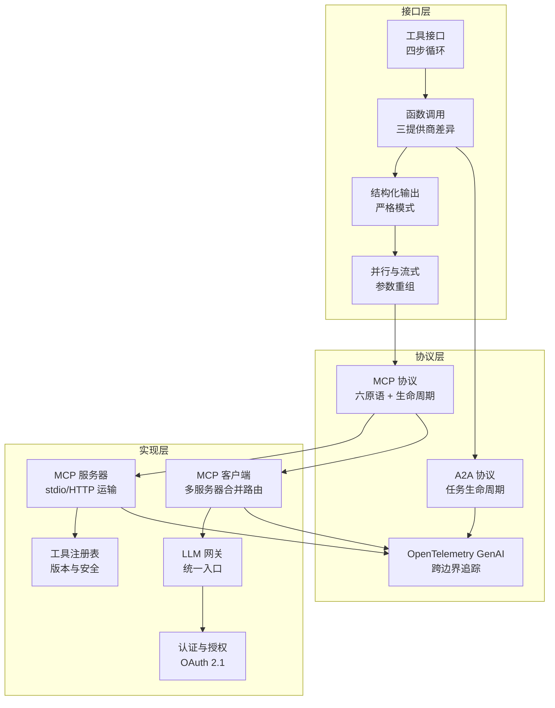

图示来源
- [工具接口.md:1-153](file://phases/13-tools-and-protocols/01-the-tool-interface/docs/en.md#L1-L153)
- [函数调用深度解析.md:1-165](file://phases/13-tools-and-protocols/02-function-calling-deep-dive/docs/en.md#L1-L165)
- [并行与流式工具调用.md:1-161](file://phases/13-tools-and-protocols/03-parallel-and-streaming-tool-calls/docs/en.md#L1-L161)
- [结构化输出.md:1-152](file://phases/13-tools-and-protocols/04-structured-output/docs/en.md#L1-L152)
- [MCP 基础.md:1-167](file://phases/13-tools-and-protocols/06-mcp-fundamentals/docs/en.md#L1-L167)
- [A2A 协议.md:1-189](file://phases/13-tools-and-protocols/19-a2a-protocol/docs/en.md#L1-L189)
- [OpenTelemetry GenAI.md:1-161](file://phases/13-tools-and-protocols/20-opentelemetry-genai/docs/en.md#L1-L161)

## 详细组件分析

### 组件一：工具接口与四步循环
- 设计原则：工具三要素（名称、描述、输入模式），区分纯工具与后果性工具；强调安全分界与电路保护。
- 实现要点：验证器、执行器、观察步骤；最大迭代次数与拒绝处理。
- 生产建议：对后果性工具增加确认门禁；对输入进行类型与范围校验；记录拒绝原因作为安全信号。

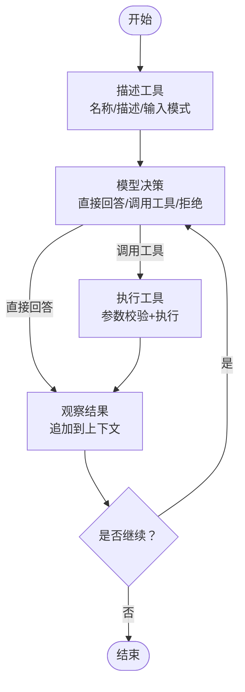

图示来源
- [工具接口.md:29-78](file://phases/13-tools-and-protocols/01-the-tool-interface/docs/en.md#L29-L78)

章节来源
- [工具接口.md:1-153](file://phases/13-tools-and-protocols/01-the-tool-interface/docs/en.md#L1-L153)

### 组件二：多提供商函数调用
- 形态差异：声明容器、参数字段、响应容器、参数类型、id 格式、结果注入、强制/禁止工具、严格模式。
- 限制与错误：不同提供商在工具数量、模式深度、参数长度、错误签名上的差异。
- 转换器模式：以统一工具声明为输入，生成三提供商的声明与响应解析器，确保语义一致。

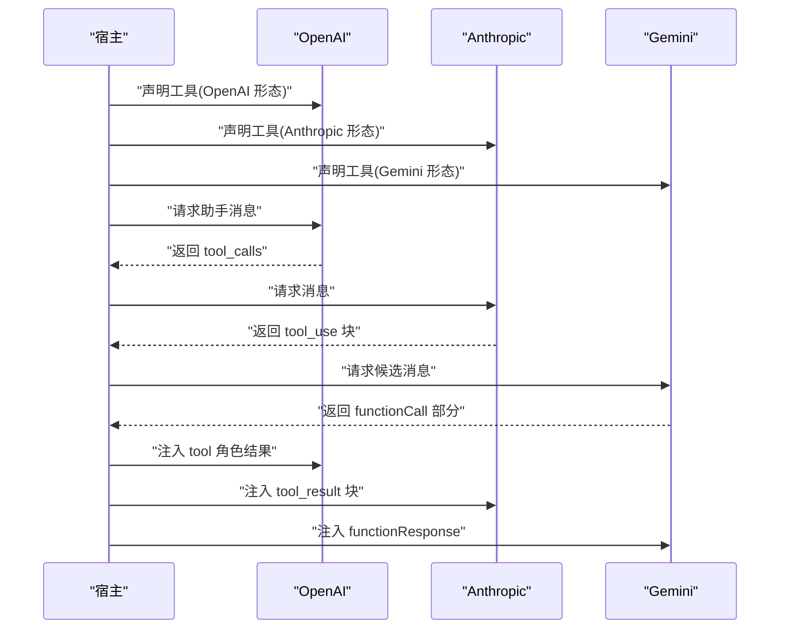

图示来源
- [函数调用深度解析.md:43-90](file://phases/13-tools-and-protocols/02-function-calling-deep-dive/docs/en.md#L43-L90)

章节来源
- [函数调用深度解析.md:1-165](file://phases/13-tools-and-protocols/02-function-calling-deep-dive/docs/en.md#L1-L165)

### 组件三：并行与流式工具调用
- 并行动机：减少往返时间，提高吞吐；需注意 id 关联与乱序完成。
- 流式重组：增量参数块按 id 聚合，等待完成信号后一次性解析；避免“提前解析陷阱”。
- 性能基准：模拟不同延迟组合，验证并行带来的常量级加速。

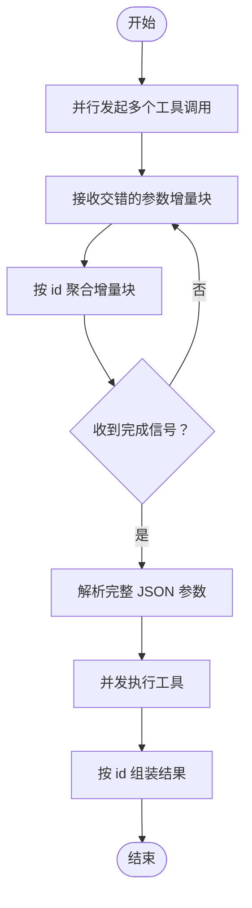

图示来源
- [并行与流式工具调用.md:71-112](file://phases/13-tools-and-protocols/03-parallel-and-streaming-tool-calls/docs/en.md#L71-L112)

章节来源
- [并行与流式工具调用.md:1-161](file://phases/13-tools-and-protocols/03-parallel-and-streaming-tool-calls/docs/en.md#L1-L161)

### 组件四：结构化输出与约束解码
- 严格模式：在解码阶段强制满足模式，避免解析错误与模式违规；拒绝情形需作为第一类结果处理。
- 模式设计：使用 JSON Schema 2020-12 的类型、枚举、必填、范围、正则、数组项与额外属性控制。
- 开源实现：语法机、日志掩码与推测校验等技术路线。

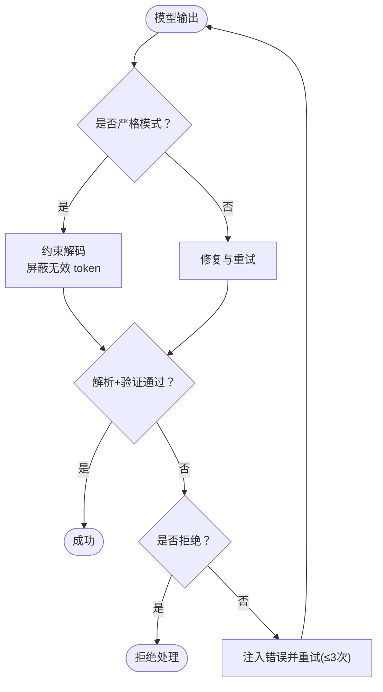

图示来源
- [结构化输出.md:74-103](file://phases/13-tools-and-protocols/04-structured-output/docs/en.md#L74-L103)

章节来源
- [结构化输出.md:1-152](file://phases/13-tools-and-protocols/04-structured-output/docs/en.md#L1-L152)

### 组件五：MCP 协议（基础）
- 六原语：服务器侧（工具、资源、提示）与客户端侧（根、采样、引导）。
- 生命周期：初始化（能力协商）、操作（双向通信）、关闭（传输终止）。
- 传输：JSON-RPC 2.0 请求/响应/通知；stdio 或 Streamable HTTP。
- 错误与内容：结构化错误码与内容块类型（文本/图像/资源）。

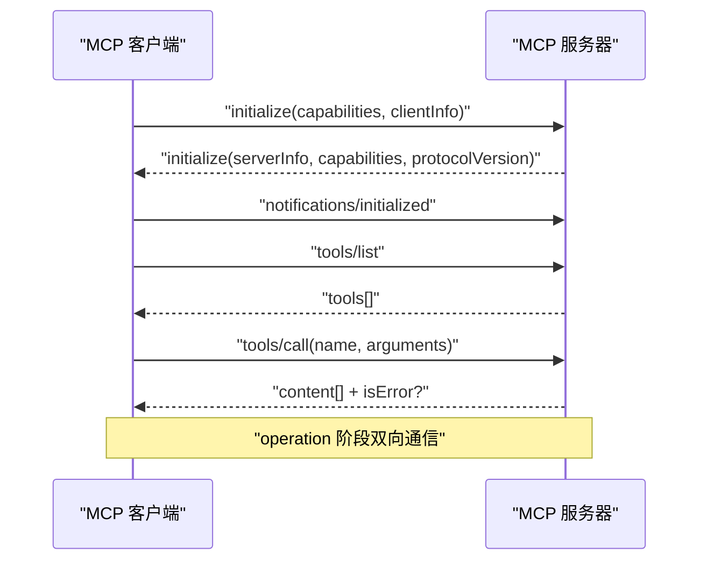

图示来源
- [MCP 基础.md:60-73](file://phases/13-tools-and-protocols/06-mcp-fundamentals/docs/en.md#L60-L73)

章节来源
- [MCP 基础.md:1-167](file://phases/13-tools-and-protocols/06-mcp-fundamentals/docs/en.md#L1-L167)

### 组件六：构建 MCP 服务器（Python + TypeScript）
- 核心方法：initialize、tools/list、tools/call、resources/list、resources/read、prompts/list、prompts/get。
- 运输细节：stdio newline-delimited JSON、非缓冲写入、客户端生命周期控制。
- 安全注解：只读、破坏性、幂等等提示，辅助客户端 UX 与路由。

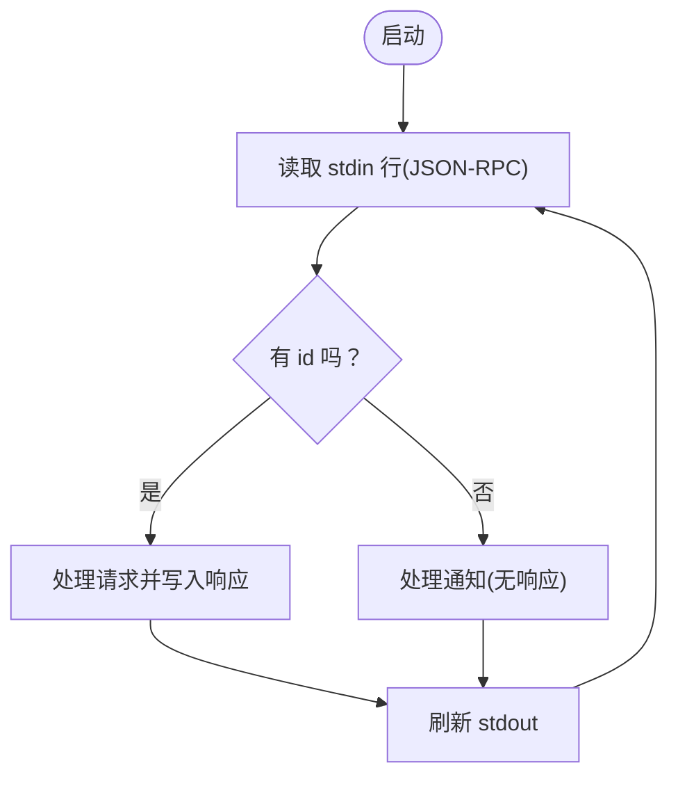

图示来源
- [构建 MCP 服务器.md:27-44](file://phases/13-tools-and-protocols/07-building-an-mcp-server/docs/en.md#L27-L44)

章节来源
- [构建 MCP 服务器.md:1-175](file://phases/13-tools-and-protocols/07-building-an-mcp-server/docs/en.md#L1-L175)

### 组件七：构建 MCP 客户端（多服务器合并与路由）
- 子进程管理：spawn 多个服务器，独立握手与会话状态维护。
- 合并命名空间：前缀命名、首到优先或冲突拒绝三种策略。
- 通知与重连：后台读线程、变更事件再发现、断开检测与重启策略。

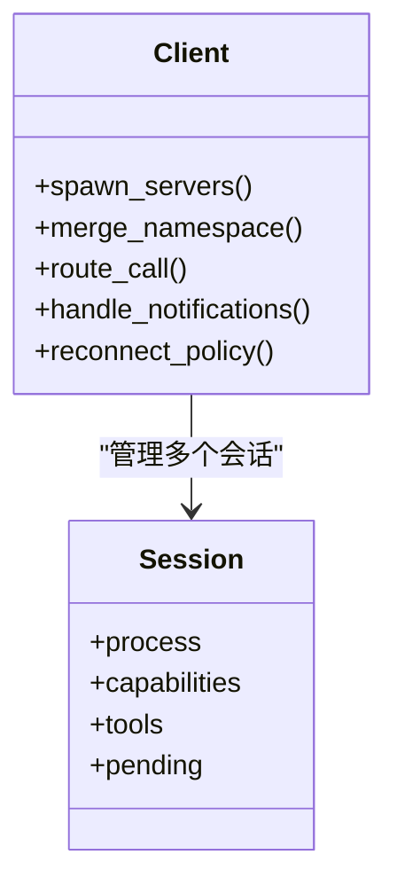

图示来源
- [构建 MCP 客户端.md:36-89](file://phases/13-tools-and-protocols/08-building-an-mcp-client/docs/en.md#L36-L89)

章节来源
- [构建 MCP 客户端.md:1-144](file://phases/13-tools-and-protocols/08-building-an-mcp-client/docs/en.md#L1-L144)

### 组件八：MCP 传输层（HTTP/Streamable 与 stdio）
- stdio：子进程模型、逐行 newline-delimited JSON、无长度前缀帧。
- HTTP：Streamable HTTP 支持头部与会话标识；断开与重连语义。
- 选择建议：本地开发与简单集成选 stdio；远程与企业环境选 HTTP。

章节来源
- [MCP 传输层.md:1-120](file://phases/13-tools-and-protocols/09-mcp-transports/docs/en.md#L1-L120)

### 组件九：MCP 资源与提示
- 资源：只读数据，URI 可寻址（file/db/custom），支持订阅与更新通知。
- 提示：模板化提示，宿主 UI 显示为斜杠命令，参数由客户端填充。
- UI 资源：扩展资源类型，支持交互式 UI。

章节来源
- [MCP 资源与提示.md:1-120](file://phases/13-tools-and-protocols/10-mcp-resources-and-prompts/docs/en.md#L1-L120)

### 组件十：MCP 采样与引导
- 采样：服务器请求客户端模型执行一次补全，用于无需服务端密钥的代理回路。
- 引导：服务器请求用户结构化输入（表单或 URL）。
- 并发与管线：采样回调期间的并发与排队策略。

章节来源
- [MCP 采样.md:1-120](file://phases/13-tools-and-protocols/11-mcp-sampling/docs/en.md#L1-L120)
- [MCP 根与引导.md:1-120](file://phases/13-tools-and-protocols/12-mcp-roots-and-elicitation/docs/en.md#L1-L120)

### 组件十一：MCP 异步任务与应用
- 异步任务：支持异步任务与进度通知，提升长耗时工具体验。
- MCP 应用：ui:// 资源类型，支持交互式 UI。

章节来源
- [MCP 异步任务.md:1-120](file://phases/13-tools-and-protocols/13-mcp-async-tasks/docs/en.md#L1-L120)
- [MCP 应用.md:1-120](file://phases/13-tools-and-protocols/14-mcp-apps/docs/en.md#L1-L120)

### 组件十二：MCP 安全（工具污染与 OAuth 2.1）
- 工具污染：恶意描述注入隐藏指令的风险与检测规则。
- OAuth 2.1：资源指示符语义与令牌管理，防止越权访问。

章节来源
- [MCP 安全：工具污染.md:1-120](file://phases/13-tools-and-protocols/15-mcp-security-tool-poisoning/docs/en.md#L1-L120)
- [MCP 安全：OAuth 2.1.md:1-120](file://phases/13-tools-and-protocols/16-mcp-security-oauth-2-1/docs/en.md#L1-L120)

### 组件十三：网关与注册表
- LLM 网关：统一入口，屏蔽多提供商差异，支持限流、熔断与重试。
- 注册表：工具版本化、命名空间前缀、安全扫描与评估。

章节来源
- [LLM 路由层.md:1-120](file://phases/13-tools-and-protocols/21-llm-routing-layer/docs/en.md#L1-L120)
- [MCP 网关与注册表.md:1-120](file://phases/13-tools-and-protocols/17-mcp-gateways-and-registries/docs/en.md#L1-L120)

### 组件十四：认证与生产
- 生产部署：稳定性、可观测性、告警与回滚策略。
- 认证：结合 OAuth 2.1 与服务端能力声明，确保最小权限与审计。

章节来源
- [MCP 认证与生产.md:1-120](file://phases/13-tools-and-protocols/18-mcp-auth-production/docs/en.md#L1-L120)

### 组件十五：A2A 协议（代理到代理）
- 用途：在不同框架的代理之间进行不透明协作。
- 生命周期：提交 → 执行中 → 输入所需 → 完成/失败/取消/拒绝。
- 传输：JSON-RPC over HTTP 与 gRPC。

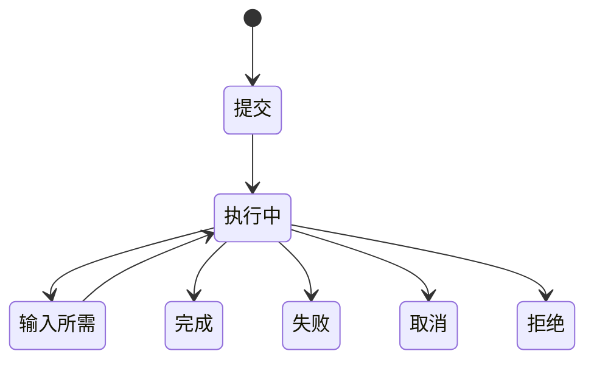

图示来源
- [A2A 协议.md:61-68](file://phases/13-tools-and-protocols/19-a2a-protocol/docs/en.md#L61-L68)

章节来源
- [A2A 协议.md:1-189](file://phases/13-tools-and-protocols/19-a2a-protocol/docs/en.md#L1-L189)

### 组件十六：OpenTelemetry GenAI 观测性
- 层级：agent.invoke_agent → llm.chat → tool.execute → mcp.call → subagent.invoke。
- 属性：gen_ai.operation.name、provider、request/response 模型、usage、trace id。
- 传播：W3C traceparent 头部或 JSON-RPC _meta 字段。

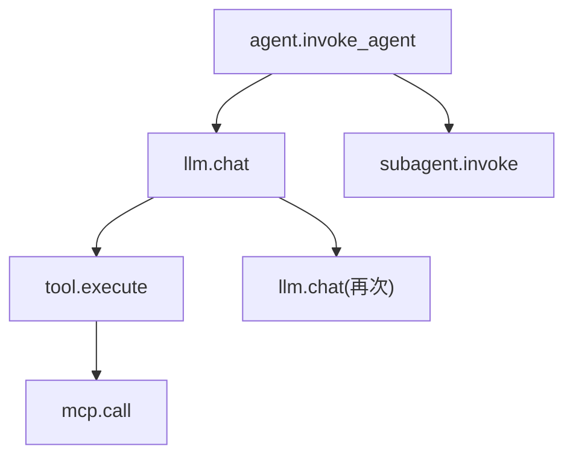

图示来源
- [OpenTelemetry GenAI.md:27-39](file://phases/13-tools-and-protocols/20-opentelemetry-genai/docs/en.md#L27-L39)

章节来源
- [OpenTelemetry GenAI.md:1-161](file://phases/13-tools-and-protocols/20-opentelemetry-genai/docs/en.md#L1-L161)

## 依赖关系分析
- 低耦合高内聚：工具接口与模式设计为上层协议提供稳定契约；MCP 与 A2A 在同一抽象层级上分别面向“工具”和“代理”两类对象。
- 传输与路由：MCP 服务器/客户端依赖 stdio/HTTP 运输；网关负责多提供商适配与路由。
- 安全与合规：工具污染检测与 OAuth 2.1 保障生态安全；注册表与版本化降低破坏面。
- 观测性：OTel GenAI 为跨进程链路提供统一语义，便于定位冷启动、网络抖动与工具执行瓶颈。

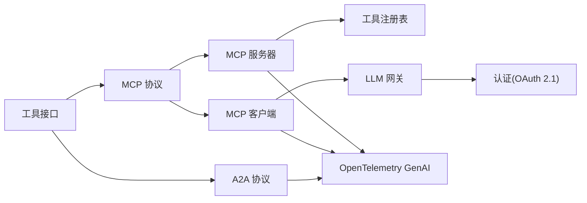

图示来源
- [工具接口.md:1-153](file://phases/13-tools-and-protocols/01-the-tool-interface/docs/en.md#L1-L153)
- [MCP 基础.md:1-167](file://phases/13-tools-and-protocols/06-mcp-fundamentals/docs/en.md#L1-L167)
- [A2A 协议.md:1-189](file://phases/13-tools-and-protocols/19-a2a-protocol/docs/en.md#L1-L189)
- [OpenTelemetry GenAI.md:1-161](file://phases/13-tools-and-protocols/20-opentelemetry-genai/docs/en.md#L1-L161)

## 性能考量
- 并行工具调用显著降低尾延迟，但需关注下游速率限制与顺序依赖；建议在网关层实施背压与重试。
- 结构化输出减少重试成本，严格模式在小模型上也能获得更高可靠性。
- MCP 服务器应避免阻塞式 IO，采用非缓冲写入与后台读线程；客户端使用队列与并发执行提升吞吐。
- 观测性指标（token 使用、操作时延、工具执行时延）用于容量规划与热点识别。

## 故障排查指南
- 工具选择错误：检查描述是否包含“不要用于”的反例；命名是否稳定且语义明确。
- 参数解析失败：确认是否提前解析部分 JSON；严格模式下确保 schema 符合要求。
- 并行乱序：确保按 id 组装结果；对同名并行调用使用唯一 id。
- 传输问题：stdio 确保逐行 newline-delimited；HTTP 检查会话头与断开语义。
- 安全风险：启用工具污染检测；对敏感工具增加确认与审计。
- 观测缺失：确保 traceparent 传播与 OTel 属性完整；开启必要事件捕获。

章节来源
- [工具模式设计.md:92-102](file://phases/13-tools-and-protocols/05-tool-schema-design/docs/en.md#L92-L102)
- [并行与流式工具调用.md:81-84](file://phases/13-tools-and-protocols/03-parallel-and-streaming-tool-calls/docs/en.md#L81-L84)
- [MCP 传输层.md:1-120](file://phases/13-tools-and-protocols/09-mcp-transports/docs/en.md#L1-L120)
- [MCP 安全：工具污染.md:1-120](file://phases/13-tools-and-protocols/15-mcp-security-tool-poisoning/docs/en.md#L1-L120)
- [OpenTelemetry GenAI.md:92-97](file://phases/13-tools-and-protocols/20-opentelemetry-genai/docs/en.md#L92-L97)

## 结论
本课程以“工具接口”为起点，逐步引入多提供商函数调用、并行与流式工具调用、结构化输出等关键技术，最终落于 MCP 与 A2A 协议，并通过 OpenTelemetry GenAI 实现端到端可观测性。配合网关、注册表与认证机制，可构建安全、可靠、可扩展的工具与协议生态。建议在实际项目中先完成工具模式设计与严格模式落地，再扩展至 MCP/A2A，并配套完善的观测与安全治理。

## 附录
- 术语速查：工具、函数调用、严格模式、MCP 六原语、A2A 任务生命周期、OTel GenAI 属性、OAuth 2.1。
- 推荐实践：以原子工具为主、严格的模式与描述、并发与流式的正确实现、能力协商与最小权限、可观测性贯穿始终。