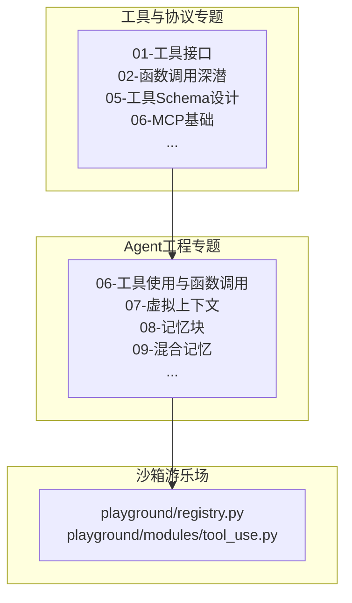
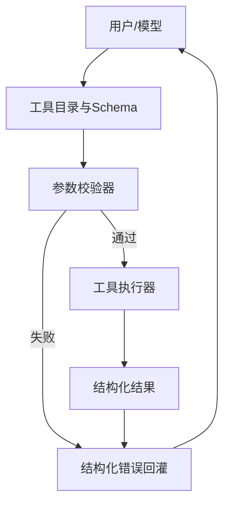
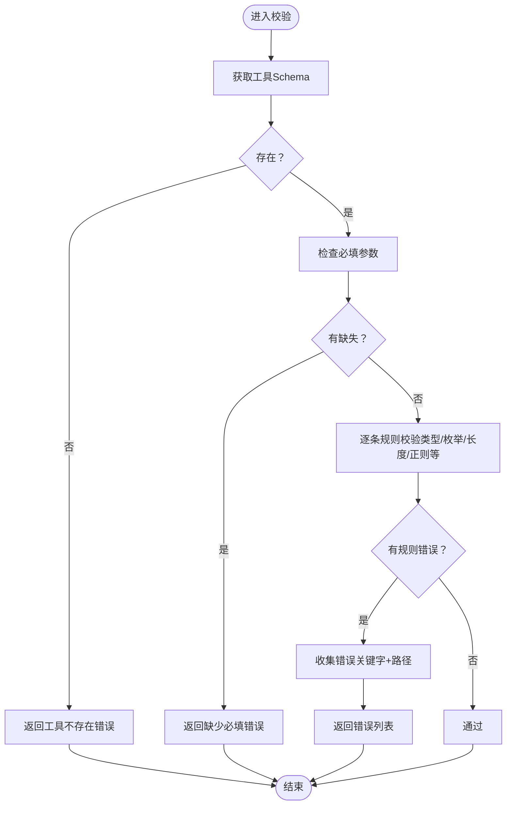
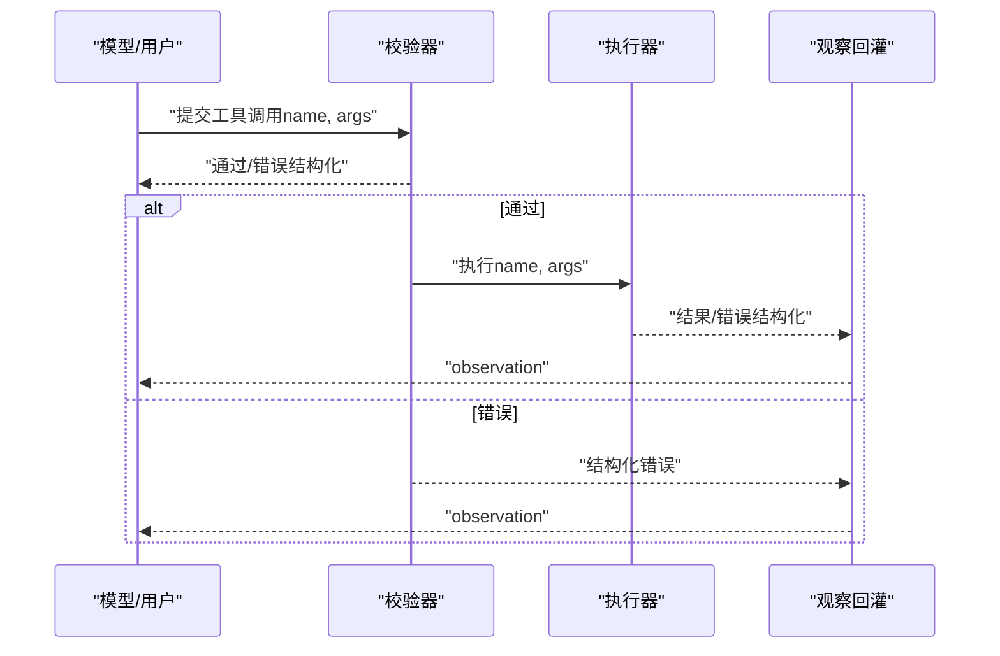
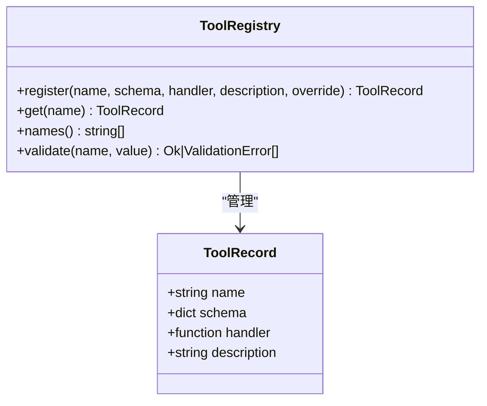

# 工具接口设计

<cite>
**本文引用的文件**
- [guardrails-sandbox/backend/playground/registry.py](file://guardrails-sandbox/backend/playground/registry.py)
- [guardrails-sandbox/backend/playground/modules/tool_use.py](file://guardrails-sandbox/backend/playground/modules/tool_use.py)
- [phases/19-capstone-projects/21-tool-registry-schema-validation/code/tests/test_registry.py](file://phases/19-capstone-projects/21-tool-registry-schema-validation/code/tests/test_registry.py)
- [phases/13-tools-and-protocols/01-the-tool-interface/README.md](file://phases/13-tools-and-protocols/01-the-tool-interface/README.md)
- [phases/13-tools-and-protocols/02-function-calling-deep-dive/README.md](file://phases/13-tools-and-protocols/02-function-calling-deep-dive/README.md)
- [phases/13-tools-and-protocols/05-tool-schema-design/README.md](file://phases/13-tools-and-protocols/05-tool-schema-design/README.md)
- [phases/13-tools-and-protocols/06-mcp-fundamentals/README.md](file://phases/13-tools-and-protocols/06-mcp-fundamentals/README.md)
- [phases/13-tools-and-protocols/07-building-an-mcp-server/README.md](file://phases/13-tools-and-protocols/07-building-an-mcp-server/README.md)
- [phases/13-tools-and-protocols/08-building-an-mcp-client/README.md](file://phases/13-tools-and-protocols/08-building-an-mcp-client/README.md)
- [phases/13-tools-and-protocols/09-mcp-transports/README.md](file://phases/13-tools-and-protocols/09-mcp-transports/README.md)
- [phases/13-tools-and-protocols/10-mcp-resources-and-prompts/README.md](file://phases/13-tools-and-protocols/10-mcp-resources-and-prompts/README.md)
- [phases/13-tools-and-protocols/11-mcp-sampling/README.md](file://phases/13-tools-and-protocols/11-mcp-sampling/README.md)
- [phases/13-tools-and-protocols/12-mcp-roots-and-elicitation/README.md](file://phases/13-tools-and-protocols/12-mcp-roots-and-elicitation/README.md)
- [phases/13-tools-and-protocols/13-mcp-async-tasks/README.md](file://phases/13-tools-and-protocols/13-mcp-async-tasks/README.md)
- [phases/13-tools-and-protocols/14-mcp-apps/README.md](file://phases/13-tools-and-protocols/14-mcp-apps/README.md)
- [phases/13-tools-and-protocols/15-mcp-security-tool-poisoning/README.md](file://phases/13-tools-and-protocols/15-mcp-security-tool-poisoning/README.md)
- [phases/13-tools-and-protocols/16-mcp-security-oauth-2-1/README.md](file://phases/13-tools-and-protocols/16-mcp-security-oauth-2-1/README.md)
- [phases/13-tools-and-protocols/17-mcp-gateways-and-registries/README.md](file://phases/13-tools-and-protocols/17-mcp-gateways-and-registries/README.md)
- [phases/13-tools-and-protocols/18-mcp-auth-production/README.md](file://phases/13-tools-and-protocols/18-mcp-auth-production/README.md)
- [phases/13-tools-and-protocols/19-a2a-protocol/README.md](file://phases/13-tools-and-protocols/19-a2a-protocol/README.md)
- [phases/13-tools-and-protocols/20-opentelemetry-genai/README.md](file://phases/13-tools-and-protocols/20-opentelemetry-genai/README.md)
- [phases/13-tools-and-protocols/21-llm-routing-layer/README.md](file://phases/13-tools-and-protocols/21-llm-routing-layer/README.md)
- [phases/13-tools-and-protocols/22-skills-and-agent-sdks/README.md](file://phases/13-tools-and-protocols/22-skills-and-agent-sdks/README.md)
- [phases/13-tools-and-protocols/23-capstone-tool-ecosystem/README.md](file://phases/13-tools-and-protocols/23-capstone-tool-ecosystem/README.md)
- [phases/14-agent-engineering/06-tool-use-and-function-calling/README.md](file://phases/14-agent-engineering/06-tool-use-and-function-calling/README.md)
- [phases/14-agent-engineering/07-memory-virtual-context-memgpt/README.md](file://phases/14-agent-engineering/07-memory-virtual-context-memgpt/README.md)
- [phases/14-agent-engineering/08-memory-blocks-sleep-time-compute/README.md](file://phases/14-agent-engineering/08-memory-blocks-sleep-time-compute/README.md)
- [phases/14-agent-engineering/09-hybrid-memory-mem0/README.md](file://phases/14-agent-engineering/09-hybrid-memory-mem0/README.md)
- [phases/14-agent-engineering/10-skill-libraries-voyager/README.md](file://phases/14-agent-engineering/10-skill-libraries-voyager/README.md)
- [phases/14-agent-engineering/11-planning-htn-and-evolutionary/README.md](file://phases/14-agent-engineering/11-planning-htn-and-evolutionary/README.md)
- [phases/14-agent-engineering/12-anthropic-workflow-patterns/README.md](file://phases/14-agent-engineering/12-anthropic-workflow-patterns/README.md)
- [phases/14-agent-engineering/13-langgraph-stateful-graphs/README.md](file://phases/14-agent-engineering/13-langgraph-stateful-graphs/README.md)
- [phases/14-agent-engineering/14-autogen-actor-model/README.md](file://phases/14-agent-engineering/14-autogen-actor-model/README.md)
- [phases/14-agent-engineering/15-crewai-role-based-crews/README.md](file://phases/14-agent-engineering/15-crewai-role-based-crews/README.md)
- [phases/14-agent-engineering/16-openai-agents-sdk/README.md](file://phases/14-agent-engineering/16-openai-agents-sdk/README.md)
- [phases/14-agent-engineering/17-claude-agent-sdk/README.md](file://phases/14-agent-engineering/17-claude-agent-sdk/README.md)
- [phases/14-agent-engineering/18-agno-and-mastra-runtimes/README.md](file://phases/14-agent-engineering/18-agno-and-mastra-runtimes/README.md)
- [phases/14-agent-engineering/19-benchmarks-swebench-gaia/README.md](file://phases/14-agent-engineering/19-benchmarks-swebench-gaia/README.md)
- [phases/14-agent-engineering/20-benchmarks-webarena-osworld/README.md](file://phases/14-agent-engineering/20-benchmarks-webarena-osworld/README.md)
- [phases/14-agent-engineering/21-computer-use-agents/README.md](file://phases/14-agent-engineering/21-computer-use-agents/README.md)
- [phases/14-agent-engineering/22-voice-agents-pipecat-livekit/README.md](file://phases/14-agent-engineering/22-voice-agents-pipecat-livekit/README.md)
- [phases/14-agent-engineering/23-otel-genai-conventions/README.md](file://phases/14-agent-engineering/23-otel-genai-conventions/README.md)
- [phases/14-agent-engineering/24-agent-observability-platforms/README.md](file://phases/14-agent-engineering/24-agent-observability-platforms/README.md)
- [phases/14-agent-engineering/25-multi-agent-debate/README.md](file://phases/14-agent-engineering/25-multi-agent-debate/README.md)
- [phases/14-agent-engineering/26-failure-modes-agentic/README.md](file://phases/14-agent-engineering/26-failure-modes-agentic/README.md)
- [phases/14-agent-engineering/27-prompt-injection-defense/README.md](file://phases/14-agent-engineering/27-prompt-injection-defense/README.md)
- [phases/14-agent-engineering/28-orchestration-patterns/README.md](file://phases/14-agent-engineering/28-orchestration-patterns/README.md)
- [phases/14-agent-engineering/29-production-runtimes/README.md](file://phases/14-agent-engineering/29-production-runtimes/README.md)
- [phases/14-agent-engineering/30-eval-driven-agent-development/README.md](file://phases/14-agent-engineering/30-eval-driven-agent-development/README.md)
- [phases/14-agent-engineering/31-agent-workbench-why-models-fail/README.md](file://phases/14-agent-engineering/31-agent-workbench-why-models-fail/README.md)
- [phases/14-agent-engineering/32-minimal-agent-workbench/README.md](file://phases/14-agent-engineering/32-minimal-agent-workbench/README.md)
- [phases/14-agent-engineering/33-instructions-as-executable-constraints/README.md](file://phases/14-agent-engineering/33-instructions-as-executable-constraints/README.md)
- [phases/14-agent-engineering/34-repo-memory-and-state/README.md](file://phases/14-agent-engineering/34-repo-memory-and-state/README.md)
- [phases/14-agent-engineering/35-initialization-scripts/README.md](file://phases/14-agent-engineering/35-initialization-scripts/README.md)
- [phases/14-agent-engineering/36-scope-contracts/README.md](file://phases/14-agent-engineering/36-scope-contracts/README.md)
- [phases/14-agent-engineering/37-runtime-feedback-loops/README.md](file://phases/14-agent-engineering/37-runtime-feedback-loops/README.md)
- [phases/14-agent-engineering/38-verification-gates/README.md](file://phases/14-agent-engineering/38-verification-gates/README.md)
- [phases/14-agent-engineering/39-reviewer-agent/README.md](file://phases/14-agent-engineering/39-reviewer-agent/README.md)
- [phases/14-agent-engineering/40-multi-session-handoff/README.md](file://phases/14-agent-engineering/40-multi-session-handoff/README.md)
- [phases/14-agent-engineering/41-workbench-for-real-repos/README.md](file://phases/14-agent-engineering/41-workbench-for-real-repos/README.md)
- [phases/14-agent-engineering/42-agent-workbench-capstone/README.md](file://phases/14-agent-engineering/42-agent-workbench-capstone/README.md)
</cite>

## 目录
1. [引言](#引言)
2. [项目结构](#项目结构)
3. [核心组件](#核心组件)
4. [架构总览](#架构总览)
5. [详细组件分析](#详细组件分析)
6. [依赖分析](#依赖分析)
7. [性能考虑](#性能考虑)
8. [故障排查指南](#故障排查指南)
9. [结论](#结论)
10. [附录](#附录)

## 引言
本文件围绕“工具接口设计”主题，系统阐述AI系统与外部工具交互的接口设计原理与最佳实践，覆盖函数调用机制、参数传递、返回值处理、Schema设计、类型定义与验证规则、参数验证、错误处理、状态管理、测试与调试方法，并给出Python与TypeScript的实现指引。文档以仓库中的“工具与协议”“Agent工程”“沙箱游乐场”等模块为依据，结合理论与实操，帮助读者构建稳定、可扩展、可观测的工具接口体系。

## 项目结构
本项目在多个阶段与专题中提供了工具接口设计与实现的相关材料，重点包括：
- 工具与协议专题：系统讲解工具接口、函数调用、MCP协议、传输与安全等
- Agent工程专题：聚焦工具使用、函数调用、记忆与技能等
- 沙箱游乐场：提供工具注册表、工具调用模拟器等可运行示例

图示来源
- [phases/13-tools-and-protocols/01-the-tool-interface/README.md](file://phases/13-tools-and-protocols/01-the-tool-interface/README.md)
- [phases/14-agent-engineering/06-tool-use-and-function-calling/README.md](file://phases/14-agent-engineering/06-tool-use-and-function-calling/README.md)
- [guardrails-sandbox/backend/playground/registry.py](file://guardrails-sandbox/backend/playground/registry.py)
- [guardrails-sandbox/backend/playground/modules/tool_use.py](file://guardrails-sandbox/backend/playground/modules/tool_use.py)

章节来源
- [phases/13-tools-and-protocols/01-the-tool-interface/README.md](file://phases/13-tools-and-protocols/01-the-tool-interface/README.md)
- [phases/14-agent-engineering/06-tool-use-and-function-calling/README.md](file://phases/14-agent-engineering/06-tool-use-and-function-calling/README.md)
- [guardrails-sandbox/backend/playground/registry.py](file://guardrails-sandbox/backend/playground/registry.py)
- [guardrails-sandbox/backend/playground/modules/tool_use.py](file://guardrails-sandbox/backend/playground/modules/tool_use.py)

## 核心组件
- 工具目录与Schema：用于声明工具名称、用途与输入Schema，驱动模型选择正确的工具与参数
- 参数校验器：对工具调用进行类型、必填、枚举、长度、正则等规则校验
- 工具执行器：根据校验结果执行具体操作，返回结构化结果或错误信息
- 工具注册表：集中管理工具注册、获取、覆盖与校验逻辑
- 观察回灌：将执行结果或错误转换为可被模型消费的结构化observation

章节来源
- [guardrails-sandbox/backend/playground/modules/tool_use.py](file://guardrails-sandbox/backend/playground/modules/tool_use.py)
- [phases/19-capstone-projects/21-tool-registry-schema-validation/code/tests/test_registry.py](file://phases/19-capstone-projects/21-tool-registry-schema-validation/code/tests/test_registry.py)

## 架构总览
下图展示了从“工具声明”到“执行与回灌”的端到端流程，强调Schema驱动、强校验与结构化输出。

图示来源
- [guardrails-sandbox/backend/playground/modules/tool_use.py](file://guardrails-sandbox/backend/playground/modules/tool_use.py)
- [phases/13-tools-and-protocols/05-tool-schema-design/README.md](file://phases/13-tools-and-protocols/05-tool-schema-design/README.md)

## 详细组件分析

### 组件A：工具目录与Schema设计
- 设计原则
  - 工具三要素：名称、用途描述（明确“何时用”）、输入Schema（JSON Schema）
  - 描述质量决定是否被正确选择；Schema应最小必要且可验证
  - 必填字段、类型、枚举、范围、正则等约束需显式声明
- 最佳实践
  - 使用清晰语义的工具名与路径风格一致
  - 将Schema放入每轮上下文时需权衡成本
  - 对复杂对象使用嵌套Schema与required组合
- 参考实现
  - 工具目录示例与Schema声明位置：[工具目录与Schema](file://guardrails-sandbox/backend/playground/modules/tool_use.py)

章节来源
- [guardrails-sandbox/backend/playground/modules/tool_use.py](file://guardrails-sandbox/backend/playground/modules/tool_use.py)
- [phases/13-tools-and-protocols/05-tool-schema-design/README.md](file://phases/13-tools-and-protocols/05-tool-schema-design/README.md)

### 组件B：参数校验器
- 功能职责
  - 校验工具名是否存在
  - 校验必填参数缺失
  - 校验类型、枚举、长度、正则等
  - 收集多处错误并统一返回
- 错误处理策略
  - 失败即返回结构化错误字符串，避免抛异常导致流程中断
  - 错误包含关键字与路径，便于定位问题
- 参考实现
  - 校验逻辑与错误收集：[参数校验器](file://phases/19-capstone-projects/21-tool-registry-schema-validation/code/tests/test_registry.py)

图示来源
- [phases/19-capstone-projects/21-tool-registry-schema-validation/code/tests/test_registry.py](file://phases/19-capstone-projects/21-tool-registry-schema-validation/code/tests/test_registry.py)

章节来源
- [phases/19-capstone-projects/21-tool-registry-schema-validation/code/tests/test_registry.py](file://phases/19-capstone-projects/21-tool-registry-schema-validation/code/tests/test_registry.py)

### 组件C：工具执行器
- 功能职责
  - 根据工具名与参数执行具体动作
  - 返回结构化结果或错误信息
- 并行与串行
  - 仅在相互独立时并行调用
  - 使用唯一ID关联请求与结果，避免错配
- 参考实现
  - 工具执行与并行回合示例：[工具执行器](file://guardrails-sandbox/backend/playground/modules/tool_use.py)

图示来源
- [guardrails-sandbox/backend/playground/modules/tool_use.py](file://guardrails-sandbox/backend/playground/modules/tool_use.py)

章节来源
- [guardrails-sandbox/backend/playground/modules/tool_use.py](file://guardrails-sandbox/backend/playground/modules/tool_use.py)

### 组件D：工具注册表
- 功能职责
  - 注册工具：名称、Schema、处理器、描述
  - 获取工具：按名称检索
  - 覆盖注册：支持非破坏性更新
  - 校验Schema形状：限制可用关键字与类型
- 测试覆盖
  - 重复注册、非法名称、未知关键字/类型、获取不存在工具等边界条件
- 参考实现
  - 注册表与验证测试：[工具注册表与测试](file://phases/19-capstone-projects/21-tool-registry-schema-validation/code/tests/test_registry.py)

图示来源
- [phases/19-capstone-projects/21-tool-registry-schema-validation/code/tests/test_registry.py](file://phases/19-capstone-projects/21-tool-registry-schema-validation/code/tests/test_registry.py)

章节来源
- [phases/19-capstone-projects/21-tool-registry-schema-validation/code/tests/test_registry.py](file://phases/19-capstone-projects/21-tool-registry-schema-validation/code/tests/test_registry.py)

### 组件E：游乐场注册表与模块运行
- 功能职责
  - 集中注册所有Playground模块
  - 提供按名称执行模块的能力
  - 统一错误处理与结果封装
- 参考实现
  - 注册表与模块运行：[游乐场注册表](file://guardrails-sandbox/backend/playground/registry.py)

章节来源
- [guardrails-sandbox/backend/playground/registry.py](file://guardrails-sandbox/backend/playground/registry.py)

## 依赖分析
- 组件耦合
  - 工具目录与Schema驱动校验器
  - 校验器与执行器解耦，便于替换与扩展
  - 注册表集中管理工具元数据，降低上层耦合
- 外部依赖
  - JSON Schema校验库（在测试中体现）
  - MCP协议与传输（专题中覆盖）

图示来源
- [guardrails-sandbox/backend/playground/modules/tool_use.py](file://guardrails-sandbox/backend/playground/modules/tool_use.py)
- [phases/19-capstone-projects/21-tool-registry-schema-validation/code/tests/test_registry.py](file://phases/19-capstone-projects/21-tool-registry-schema-validation/code/tests/test_registry.py)

章节来源
- [guardrails-sandbox/backend/playground/modules/tool_use.py](file://guardrails-sandbox/backend/playground/modules/tool_use.py)
- [phases/19-capstone-projects/21-tool-registry-schema-validation/code/tests/test_registry.py](file://phases/19-capstone-projects/21-tool-registry-schema-validation/code/tests/test_registry.py)

## 性能考虑
- Schema大小与上下文成本
  - 工具目录每轮进入上下文，数量与复杂度直接影响成本
  - 建议按需裁剪、分批加载与缓存
- 校验开销
  - 复杂Schema与深层嵌套会增加校验时间
  - 可采用预编译Schema、增量校验与短路策略
- 并行执行
  - 仅在无副作用与依赖时并行，减少等待与冲突
- 结果回灌
  - 控制observation大小，避免超长文本反复回灌

## 故障排查指南
- 常见问题
  - 工具名不存在：返回结构化错误，检查工具注册与拼写
  - 缺少必填参数：核对Schema required 字段
  - 类型不匹配：确认传入值类型与Schema定义一致
  - 枚举/正则/长度不满足：修正输入或放宽Schema
- 定位技巧
  - 查看错误关键字与路径，快速定位字段
  - 使用最小可复现输入，逐步缩小范围
- 稳定性建议
  - 所有失败均转结构化错误，避免异常冒泡
  - 对外暴露统一的错误格式，便于日志与监控

章节来源
- [phases/19-capstone-projects/21-tool-registry-schema-validation/code/tests/test_registry.py](file://phases/19-capstone-projects/21-tool-registry-schema-validation/code/tests/test_registry.py)
- [guardrails-sandbox/backend/playground/modules/tool_use.py](file://guardrails-sandbox/backend/playground/modules/tool_use.py)

## 结论
工具接口设计的关键在于“Schema驱动、强校验、结构化输出与稳定回灌”。通过清晰的工具声明、严格的参数校验、可靠的执行器与统一的注册表管理，可以构建高可用、易维护的工具生态。配合并行执行、成本控制与可观测性，可在生产环境中实现高效稳定的工具调用链路。

## 附录

### 实现指南（Python）
- 工具注册与获取
  - 使用注册表注册工具，提供名称、Schema、处理器与描述
  - 通过名称获取工具记录，执行前先validate
- 参数校验
  - 使用JSON Schema关键字进行类型、必填、枚举、长度、正则等校验
  - 收集多处错误，统一返回
- 执行与回灌
  - 执行器返回结构化结果或错误
  - 将结果/错误转换为observation，回灌至对话历史

章节来源
- [phases/19-capstone-projects/21-tool-registry-schema-validation/code/tests/test_registry.py](file://phases/19-capstone-projects/21-tool-registry-schema-validation/code/tests/test_registry.py)
- [guardrails-sandbox/backend/playground/modules/tool_use.py](file://guardrails-sandbox/backend/playground/modules/tool_use.py)

### 实现指南（TypeScript）
- 接口与类型
  - 定义工具记录类型（名称、Schema、处理器、描述）
  - 定义校验结果类型（成功/错误列表）
- 校验流程
  - 解析输入为Schema定义的结构
  - 逐条规则校验，收集错误
- 执行与回灌
  - 执行工具处理器
  - 将结果/错误转换为结构化observation

章节来源
- [phases/13-tools-and-protocols/05-tool-schema-design/README.md](file://phases/13-tools-and-protocols/05-tool-schema-design/README.md)
- [phases/13-tools-and-protocols/06-mcp-fundamentals/README.md](file://phases/13-tools-and-protocols/06-mcp-fundamentals/README.md)

### 测试与调试方法
- 单元测试
  - 覆盖重复注册、非法名称、未知关键字/类型、获取不存在工具
  - 覆盖类型、枚举、长度、正则、必填缺失、嵌套路径、数组项等规则
- 集成测试
  - 使用游乐场模块模拟工具调用全流程，验证校验→执行→回灌
- 调试建议
  - 记录工具调用ID、Schema路径、错误关键字与消息
  - 使用最小输入复现实例，逐步扩大范围

章节来源
- [phases/19-capstone-projects/21-tool-registry-schema-validation/code/tests/test_registry.py](file://phases/19-capstone-projects/21-tool-registry-schema-validation/code/tests/test_registry.py)
- [guardrails-sandbox/backend/playground/modules/tool_use.py](file://guardrails-sandbox/backend/playground/modules/tool_use.py)