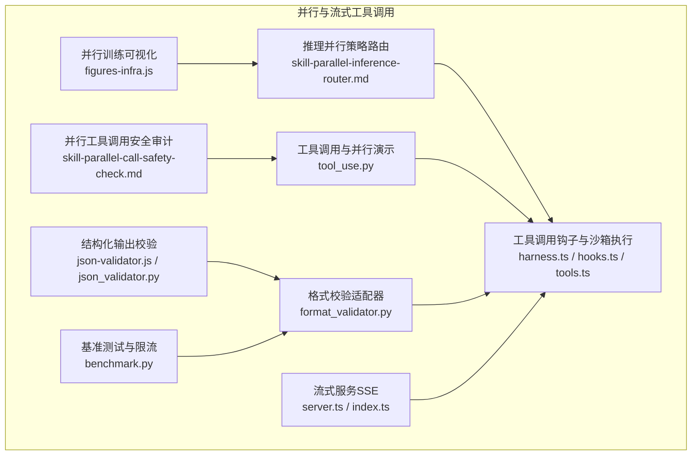
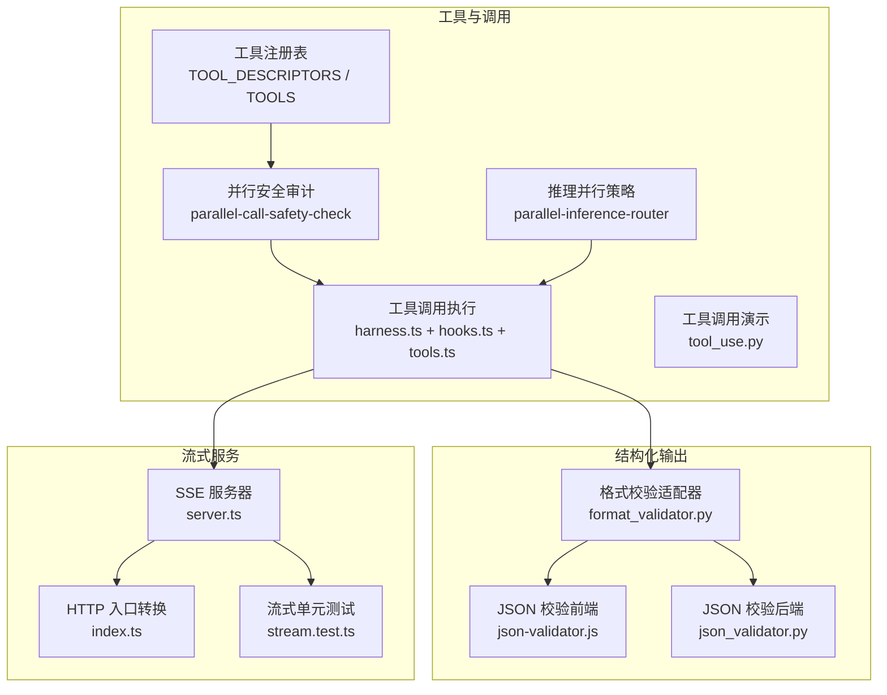
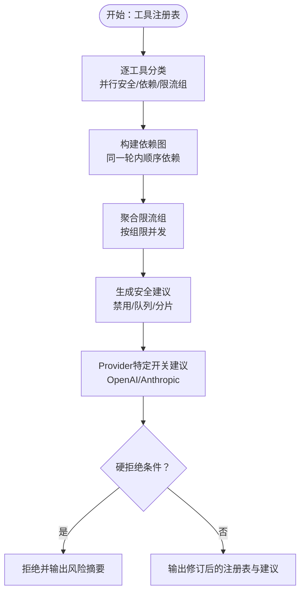
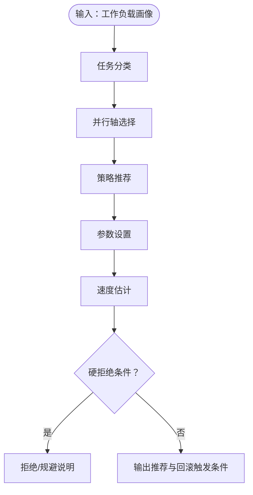
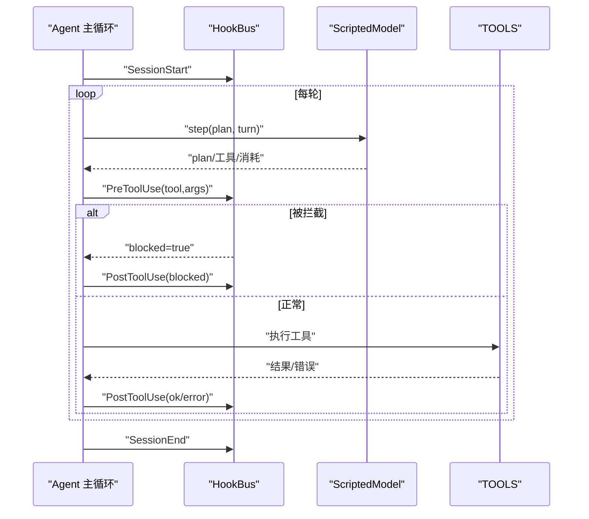
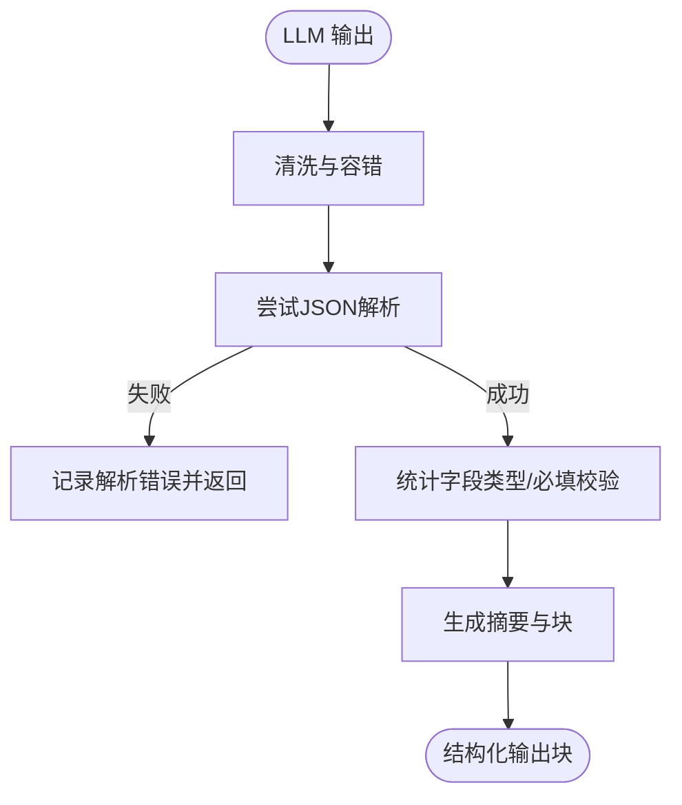
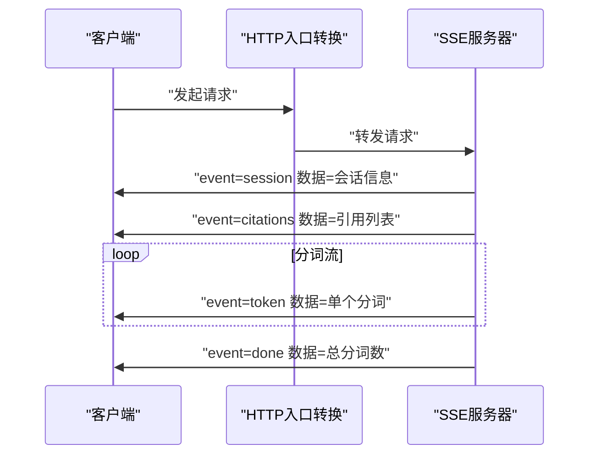
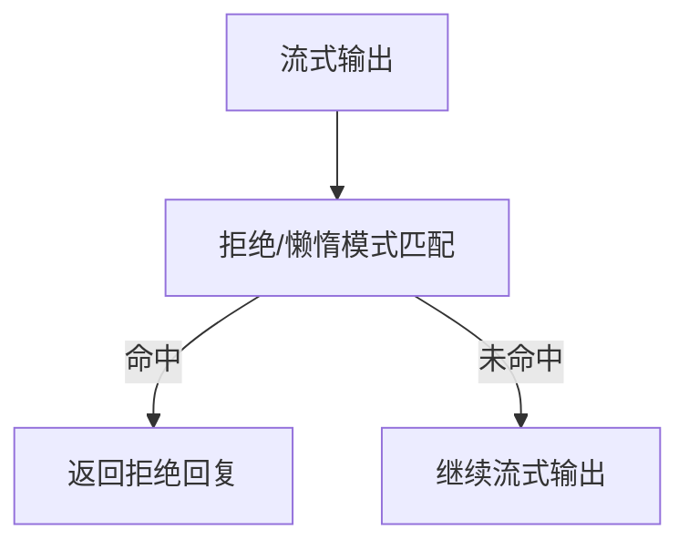
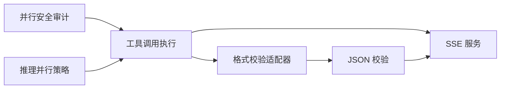

# 并行与流式工具调用

<cite>
**本文引用的文件**
- [skill-parallel-call-safety-check.md](file://phases/13-tools-and-protocols/03-parallel-and-streaming-tool-calls/outputs/skill-parallel-call-safety-check.md)
- [skill-parallel-inference-router.md](file://phases/10-llms-from-scratch/22-async-hogwild-inference/outputs/skill-parallel-inference-router.md)
- [parallel-streaming.svg](file://phases/13-tools-and-protocols/03-parallel-and-streaming-tool-calls/assets/parallel-streaming.svg)
- [tool_use.py](file://guardrails-sandbox/backend/playground/modules/tool_use.py)
- [format_validator.py](file://guardrails-sandbox/backend/adapters/format_validator.py)
- [json-validator.js](file://site/vue-app/summary/src/data/modules/json-validator.js)
- [json_validator.py](file://guardrails-sandbox/backend/playground/modules/json_validator.py)
- [harness.ts](file://phases/19-capstone-projects/01-terminal-native-coding-agent/code/ts/src/harness.ts)
- [hooks.ts](file://phases/19-capstone-projects/01-terminal-native-coding-agent/code/ts/src/hooks.ts)
- [tools.ts](file://phases/19-capstone-projects/01-terminal-native-coding-agent/code/ts/src/tools.ts)
- [server.ts](file://phases/19-capstone-projects/08-production-rag-chatbot/code/ts/src/server.ts)
- [index.ts](file://phases/19-capstone-projects/08-production-rag-chatbot/code/ts/src/index.ts)
- [stream.test.ts](file://phases/19-capstone-projects/08-production-rag-chatbot/code/ts/tests/stream.test.ts)
- [mock_llm_stream.py](file://phases/19-capstone-projects/87-end-to-end-safety-gate/code/mock_llm_stream.py)
- [benchmark.py](file://guardrails-sandbox/backend/benchmark.py)
- [figures-infra.js](file://site/figures-infra.js)
</cite>

## 目录
1. [简介](#简介)
2. [项目结构](#项目结构)
3. [核心组件](#核心组件)
4. [架构总览](#架构总览)
5. [详细组件分析](#详细组件分析)
6. [依赖关系分析](#依赖关系分析)
7. [性能考虑](#性能考虑)
8. [故障排查指南](#故障排查指南)
9. [结论](#结论)
10. [附录](#附录)

## 简介
本文件围绕“并行与流式工具调用”主题，系统梳理仓库中与并行工具调用安全审计、推理阶段并行策略、结构化输出校验以及生产级流式服务（SSE）相关的实现与最佳实践。内容覆盖：
- 并行工具调用的安全性评估与依赖建模
- 推理阶段的并行策略选择与参数配置
- 流式工具调用的数据流设计与实时响应
- 结构化输出的格式校验与约束
- 性能优化策略（异步、缓存、限流、负载均衡）
- 实际场景下的调用模式与故障恢复

## 项目结构
本主题涉及的关键模块分布在以下路径：
- 并行工具调用安全审计与策略：phases/13-tools-and-protocols/03-parallel-and-streaming-tool-calls
- 推理阶段并行路由：phases/10-llms-from-scratch/22-async-hogwild-inference
- 工具调用与并行执行演示：guardrails-sandbox/backend/playground/modules/tool_use.py
- 结构化输出校验（前端/后端）：site/vue-app/summary/src/data/modules/json-validator.js 与 guardrails-sandbox/backend/playground/modules/json_validator.py
- 流式服务（SSE）：phases/19-capstone-projects/08-production-rag-chatbot
- 工具调用钩子与沙箱执行：phases/19-capstone-projects/01-terminal-native-coding-agent
- 安全门控与格式校验适配器：guardrails-sandbox/backend/adapters/format_validator.py
- 基准测试与速率限制：guardrails-sandbox/backend/benchmark.py
- 并行训练可视化：site/figures-infra.js

**图表来源**
- [skill-parallel-call-safety-check.md](file://phases/13-tools-and-protocols/03-parallel-and-streaming-tool-calls/outputs/skill-parallel-call-safety-check.md)
- [skill-parallel-inference-router.md](file://phases/10-llms-from-scratch/22-async-hogwild-inference/outputs/skill-parallel-inference-router.md)
- [tool_use.py](file://guardrails-sandbox/backend/playground/modules/tool_use.py)
- [json-validator.js](file://site/vue-app/summary/src/data/modules/json-validator.js)
- [json_validator.py](file://guardrails-sandbox/backend/playground/modules/json_validator.py)
- [format_validator.py](file://guardrails-sandbox/backend/adapters/format_validator.py)
- [server.ts](file://phases/19-capstone-projects/08-production-rag-chatbot/code/ts/src/server.ts)
- [index.ts](file://phases/19-capstone-projects/08-production-rag-chatbot/code/ts/src/index.ts)
- [harness.ts](file://phases/19-capstone-projects/01-terminal-native-coding-agent/code/ts/src/harness.ts)
- [hooks.ts](file://phases/19-capstone-projects/01-terminal-native-coding-agent/code/ts/src/hooks.ts)
- [tools.ts](file://phases/19-capstone-projects/01-terminal-native-coding-agent/code/ts/src/tools.ts)
- [benchmark.py](file://guardrails-sandbox/backend/benchmark.py)
- [figures-infra.js](file://site/figures-infra.js)

**章节来源**
- [skill-parallel-call-safety-check.md](file://phases/13-tools-and-protocols/03-parallel-and-streaming-tool-calls/outputs/skill-parallel-call-safety-check.md)
- [skill-parallel-inference-router.md](file://phases/10-llms-from-scratch/22-async-hogwild-inference/outputs/skill-parallel-inference-router.md)
- [tool_use.py](file://guardrails-sandbox/backend/playground/modules/tool_use.py)
- [json-validator.js](file://site/vue-app/summary/src/data/modules/json-validator.js)
- [json_validator.py](file://guardrails-sandbox/backend/playground/modules/json_validator.py)
- [format_validator.py](file://guardrails-sandbox/backend/adapters/format_validator.py)
- [server.ts](file://phases/19-capstone-projects/08-production-rag-chatbot/code/ts/src/server.ts)
- [index.ts](file://phases/19-capstone-projects/08-production-rag-chatbot/code/ts/src/index.ts)
- [harness.ts](file://phases/19-capstone-projects/01-terminal-native-coding-agent/code/ts/src/harness.ts)
- [hooks.ts](file://phases/19-capstone-projects/01-terminal-native-coding-agent/code/ts/src/hooks.ts)
- [tools.ts](file://phases/19-capstone-projects/01-terminal-native-coding-agent/code/ts/src/tools.ts)
- [benchmark.py](file://guardrails-sandbox/backend/benchmark.py)
- [figures-infra.js](file://site/figures-infra.js)

## 核心组件
- 并行工具调用安全审计：对工具注册表进行分类标注，识别是否可并行、是否存在顺序依赖、外部速率限制风险，并给出安全建议与provider特定开关。
- 推理阶段并行策略路由：根据工作负载特征（长度、并行度、模型家族、部署目标、延迟预算）推荐或组合策略（推测解码、Hogwild!、树状思考、多智能体、投票集成）。
- 工具调用与并行执行：在沙箱环境中执行工具调用，支持并行回合（互不依赖）、错误结构化回灌、钩子事件（PreToolUse/PostToolUse）。
- 结构化输出校验：前端/后端双端JSON校验，支持解析、字段齐全性与类型匹配检查。
- 格式校验适配器：对LLM输出格式进行拦截校验（JSON/代码/文本），避免下游解析崩溃。
- 流式服务（SSE）：基于Server-Sent Events的实时流式响应，支持会话初始化、引用检索、分词流式输出与结束帧。
- 基准测试与限流：在基准测试中保存/恢复速率限制器状态，确保测试隔离与可重复性。

**章节来源**
- [skill-parallel-call-safety-check.md](file://phases/13-tools-and-protocols/03-parallel-and-streaming-tool-calls/outputs/skill-parallel-call-safety-check.md)
- [skill-parallel-inference-router.md](file://phases/10-llms-from-scratch/22-async-hogwild-inference/outputs/skill-parallel-inference-router.md)
- [tool_use.py](file://guardrails-sandbox/backend/playground/modules/tool_use.py)
- [json-validator.js](file://site/vue-app/summary/src/data/modules/json-validator.js)
- [json_validator.py](file://guardrails-sandbox/backend/playground/modules/json_validator.py)
- [format_validator.py](file://guardrails-sandbox/backend/adapters/format_validator.py)
- [server.ts](file://phases/19-capstone-projects/08-production-rag-chatbot/code/ts/src/server.ts)
- [index.ts](file://phases/19-capstone-projects/08-production-rag-chatbot/code/ts/src/index.ts)
- [harness.ts](file://phases/19-capstone-projects/01-terminal-native-coding-agent/code/ts/src/harness.ts)
- [hooks.ts](file://phases/19-capstone-projects/01-terminal-native-coding-agent/code/ts/src/hooks.ts)
- [tools.ts](file://phases/19-capstone-projects/01-terminal-native-coding-agent/code/ts/src/tools.ts)
- [benchmark.py](file://guardrails-sandbox/backend/benchmark.py)

## 架构总览
下图展示从“工具调用与并行”到“结构化输出校验”再到“流式服务”的整体链路，以及与“推理并行策略”和“安全审计”的关联。

**图表来源**
- [harness.ts](file://phases/19-capstone-projects/01-terminal-native-coding-agent/code/ts/src/harness.ts)
- [hooks.ts](file://phases/19-capstone-projects/01-terminal-native-coding-agent/code/ts/src/hooks.ts)
- [tools.ts](file://phases/19-capstone-projects/01-terminal-native-coding-agent/code/ts/src/tools.ts)
- [tool_use.py](file://guardrails-sandbox/backend/playground/modules/tool_use.py)
- [skill-parallel-call-safety-check.md](file://phases/13-tools-and-protocols/03-parallel-and-streaming-tool-calls/outputs/skill-parallel-call-safety-check.md)
- [skill-parallel-inference-router.md](file://phases/10-llms-from-scratch/22-async-hogwild-inference/outputs/skill-parallel-inference-router.md)
- [json-validator.js](file://site/vue-app/summary/src/data/modules/json-validator.js)
- [json_validator.py](file://guardrails-sandbox/backend/playground/modules/json_validator.py)
- [format_validator.py](file://guardrails-sandbox/backend/adapters/format_validator.py)
- [server.ts](file://phases/19-capstone-projects/08-production-rag-chatbot/code/ts/src/server.ts)
- [index.ts](file://phases/19-capstone-projects/08-production-rag-chatbot/code/ts/src/index.ts)
- [stream.test.ts](file://phases/19-capstone-projects/08-production-rag-chatbot/code/ts/tests/stream.test.ts)

## 详细组件分析

### 组件A：并行工具调用安全审计
- 目标：对工具注册表进行并行化安全审计，标注每个工具的并行安全性、顺序依赖与速率限制组，给出硬性拒绝与规避规则。
- 关键流程：
  - 分类：纯读取/不同资源可并行；写操作/共享资源/外部限流需谨慎。
  - 依赖：同一轮内存在输出→输入的传递即不可并行。
  - 限流：命中相同下游API的工具归为一组，按组限并发。
  - 安全建议：对不安全工具，建议禁用该轮并行、队列化或按资源分片。
  - Provider开关：当存在不安全工具时，建议在OpenAI使用禁用并行开关，在Anthropic使用禁用工具开关。
- 硬拒绝与规避：
  - 无分类即默认拒绝；写路径与并行标记冲突；未标注限流组却命中限流API。
  - 对可能造成竞态的工具组合（如同资源的删除与写入）直接拒绝并引导到沙箱序列化方案。

**图表来源**
- [skill-parallel-call-safety-check.md](file://phases/13-tools-and-protocols/03-parallel-and-streaming-tool-calls/outputs/skill-parallel-call-safety-check.md)

**章节来源**
- [skill-parallel-call-safety-check.md](file://phases/13-tools-and-protocols/03-parallel-and-streaming-tool-calls/outputs/skill-parallel-call-safety-check.md)

### 组件B：推理阶段并行策略路由
- 目标：根据工作负载画像推荐或组合推理并行策略，给出参数设置与速度估计。
- 关键流程：
  - 任务分类：长推理、中链式思维、短对话、分类。
  - 并行轴：序列内（推测解码）与序列间（投票、Hogwild!、多智能体）。
  - 策略推荐：优先序列内策略，必要时组合（如推测+Hogwild!）。
  - 参数设置：如推测解码draft族与N，Hogwild! worker数与协调模板。
  - 速度估计：组合策略的乘积加速估算。
- 硬拒绝与规避：
  - 小规模任务不适合Hogwild!；非推理模型不适合协作；跨节点Hogwild!不推荐；无自然角色分解问题不适合多智能体；无显式分支剪枝的树状思考退化为线性思考。
  - 对实验性工作负载建议以Hogwild!为实验而非生产承诺；对保证性速度的要求需澄清仅推测解码具备强保证。

**图表来源**
- [skill-parallel-inference-router.md](file://phases/10-llms-from-scratch/22-async-hogwild-inference/outputs/skill-parallel-inference-router.md)

**章节来源**
- [skill-parallel-inference-router.md](file://phases/10-llms-from-scratch/22-async-hogwild-inference/outputs/skill-parallel-inference-router.md)

### 组件C：工具调用与并行执行（沙箱）
- 目标：在沙箱环境中执行工具调用，支持并行回合、错误结构化回灌、钩子事件。
- 关键流程：
  - Agent主循环：预算检查、计划推进、工具调用、钩子事件记录。
  - 钩子：PreToolUse用于破坏性命令拦截；PostToolUse记录结果/错误；SessionStart/SessionEnd记录会话生命周期。
  - 工具：读文件、运行shell等，参数schema校验，沙箱路径保护。
- 并行回合：在同一轮内多个工具若无依赖可并行执行，各自独立的tool_use_id用于结果配对。

**图表来源**
- [harness.ts](file://phases/19-capstone-projects/01-terminal-native-coding-agent/code/ts/src/harness.ts)
- [hooks.ts](file://phases/19-capstone-projects/01-terminal-native-coding-agent/code/ts/src/hooks.ts)
- [tools.ts](file://phases/19-capstone-projects/01-terminal-native-coding-agent/code/ts/src/tools.ts)

**章节来源**
- [harness.ts](file://phases/19-capstone-projects/01-terminal-native-coding-agent/code/ts/src/harness.ts)
- [hooks.ts](file://phases/19-capstone-projects/01-terminal-native-coding-agent/code/ts/src/hooks.ts)
- [tools.ts](file://phases/19-capstone-projects/01-terminal-native-coding-agent/code/ts/src/tools.ts)
- [tool_use.py](file://guardrails-sandbox/backend/playground/modules/tool_use.py)

### 组件D：结构化输出校验（JSON Schema与格式）
- 目标：确保LLM输出满足预期格式与字段约束，避免下游解析崩溃。
- 前端校验（json-validator.js）：
  - 清洗markdown围栏、解析JSON、统计字段类型、检查必填字段、输出表格与JSON块。
- 后端校验（json_validator.py）：
  - 与前端一致的逻辑，返回结构化块与延迟指标。
- 格式校验适配器（format_validator.py）：
  - 拦截JSON解析失败、Markdown代码块未闭合、空输出、用户要求JSON但未返回等问题，返回错误/警告明细与置信度。

**图表来源**
- [json-validator.js](file://site/vue-app/summary/src/data/modules/json-validator.js)
- [json_validator.py](file://guardrails-sandbox/backend/playground/modules/json_validator.py)
- [format_validator.py](file://guardrails-sandbox/backend/adapters/format_validator.py)

**章节来源**
- [json-validator.js](file://site/vue-app/summary/src/data/modules/json-validator.js)
- [json_validator.py](file://guardrails-sandbox/backend/playground/modules/json_validator.py)
- [format_validator.py](file://guardrails-sandbox/backend/adapters/format_validator.py)

### 组件E：流式工具调用（SSE）
- 目标：以Server-Sent Events实现实时流式响应，支持会话初始化、引用检索、分词流式输出与结束帧。
- 关键流程：
  - HTTP入口转换：Node原生请求转Web标准Request。
  - SSE流：封装编码帧、写入会话/引用/分词/完成事件。
  - 单元测试：验证帧编码与解析往返一致性，检索结果与上限控制。

**图表来源**
- [index.ts](file://phases/19-capstone-projects/08-production-rag-chatbot/code/ts/src/index.ts)
- [server.ts](file://phases/19-capstone-projects/08-production-rag-chatbot/code/ts/src/server.ts)
- [stream.test.ts](file://phases/19-capstone-projects/08-production-rag-chatbot/code/ts/tests/stream.test.ts)

**章节来源**
- [index.ts](file://phases/19-capstone-projects/08-production-rag-chatbot/code/ts/src/index.ts)
- [server.ts](file://phases/19-capstone-projects/08-production-rag-chatbot/code/ts/src/server.ts)
- [stream.test.ts](file://phases/19-capstone-projects/08-production-rag-chatbot/code/ts/tests/stream.test.ts)

### 组件F：安全门控与格式校验
- 目标：在生成过程中拦截潜在有害或格式错误的输出，保障系统稳定性与合规性。
- mock_llm_stream.py：提供三种脚本化人物的流式模拟，包含拒绝模式与懒惰模式，用于测试期间过滤器的有效性。
- benchmark.py：在基准测试中保存/恢复速率限制器状态，确保测试隔离与可重复性。

**图表来源**
- [mock_llm_stream.py](file://phases/19-capstone-projects/87-end-to-end-safety-gate/code/mock_llm_stream.py)
- [benchmark.py](file://guardrails-sandbox/backend/benchmark.py)

**章节来源**
- [mock_llm_stream.py](file://phases/19-capstone-projects/87-end-to-end-safety-gate/code/mock_llm_stream.py)
- [benchmark.py](file://guardrails-sandbox/backend/benchmark.py)

## 依赖关系分析
- 并行工具调用安全审计依赖工具注册表与外部API限流信息，输出供工具调用执行与Provider开关使用。
- 推理并行策略路由面向推理阶段，与工具调用执行解耦，但可指导工具调用的并发策略选择。
- 工具调用执行依赖钩子与沙箱环境，确保错误结构化回灌与安全拦截。
- 结构化输出校验贯穿工具调用与流式服务，前置拦截格式错误，后置保证解析正确。
- 流式服务依赖工具调用结果与检索模块，提供实时响应能力。

**图表来源**
- [skill-parallel-call-safety-check.md](file://phases/13-tools-and-protocols/03-parallel-and-streaming-tool-calls/outputs/skill-parallel-call-safety-check.md)
- [skill-parallel-inference-router.md](file://phases/10-llms-from-scratch/22-async-hogwild-inference/outputs/skill-parallel-inference-router.md)
- [format_validator.py](file://guardrails-sandbox/backend/adapters/format_validator.py)
- [json-validator.js](file://site/vue-app/summary/src/data/modules/json-validator.js)
- [harness.ts](file://phases/19-capstone-projects/01-terminal-native-coding-agent/code/ts/src/harness.ts)
- [server.ts](file://phases/19-capstone-projects/08-production-rag-chatbot/code/ts/src/server.ts)

**章节来源**
- [skill-parallel-call-safety-check.md](file://phases/13-tools-and-protocols/03-parallel-and-streaming-tool-calls/outputs/skill-parallel-call-safety-check.md)
- [skill-parallel-inference-router.md](file://phases/10-llms-from-scratch/22-async-hogwild-inference/outputs/skill-parallel-inference-router.md)
- [format_validator.py](file://guardrails-sandbox/backend/adapters/format_validator.py)
- [json-validator.js](file://site/vue-app/summary/src/data/modules/json-validator.js)
- [harness.ts](file://phases/19-capstone-projects/01-terminal-native-coding-agent/code/ts/src/harness.ts)
- [server.ts](file://phases/19-capstone-projects/08-production-rag-chatbot/code/ts/src/server.ts)

## 性能考虑
- 异步处理：在工具调用与流式服务中采用异步读取与写入，减少阻塞等待。
- 缓存机制：利用检索结果缓存与会话状态缓存，降低重复计算与网络开销。
- 负载均衡：对外部API调用进行限流分组与队列化，避免单点过载。
- 并行策略：结合“序列内（推测解码）+ 序列间（Hogwild!/多智能体）”的组合策略，最大化吞吐同时保持稳定性。
- 训练并行可视化：通过数据并行、张量并行、流水线并行的可视化帮助理解吞吐与气泡比例的关系。

**章节来源**
- [figures-infra.js](file://site/figures-infra.js)
- [skill-parallel-inference-router.md](file://phases/10-llms-from-scratch/22-async-hogwild-inference/outputs/skill-parallel-inference-router.md)

## 故障排查指南
- 工具调用失败：
  - 缺少必填参数或类型不符：检查工具schema与调用参数，确保结构化错误回灌。
  - 幻觉调用不存在工具：返回描述性错误，不崩溃。
  - 并行回合错配：确认tool_use_id与结果配对，避免依赖冲突。
- 格式校验失败：
  - JSON解析失败：检查引号/逗号/括号配对，常见为漏尾随逗号或多包一层文字。
  - Markdown代码块未闭合：补齐成对出现。
  - 空输出：检查提示词与模型行为，必要时增加约束。
- 流式服务异常：
  - SSE帧编码/解析不一致：参考单元测试用例验证往返。
  - 检索结果不符合预期：调整k值与匹配策略。
- 基准测试干扰：
  - 速率限制器状态影响测试：使用保存/恢复机制确保隔离。

**章节来源**
- [tool_use.py](file://guardrails-sandbox/backend/playground/modules/tool_use.py)
- [json-validator.js](file://site/vue-app/summary/src/data/modules/json-validator.js)
- [json_validator.py](file://guardrails-sandbox/backend/playground/modules/json_validator.py)
- [format_validator.py](file://guardrails-sandbox/backend/adapters/format_validator.py)
- [stream.test.ts](file://phases/19-capstone-projects/08-production-rag-chatbot/code/ts/tests/stream.test.ts)
- [benchmark.py](file://guardrails-sandbox/backend/benchmark.py)

## 结论
本主题通过“并行工具调用安全审计”“推理并行策略路由”“工具调用与沙箱执行”“结构化输出校验”“流式服务（SSE）”等模块，形成从策略到执行再到输出的完整闭环。实践中应：
- 在工具层面进行严格的schema与依赖建模，确保可并行性与安全性；
- 在推理阶段依据工作负载选择合适的并行策略并设定参数；
- 在输出环节前置格式校验，避免下游解析崩溃；
- 在服务端采用SSE实现低延迟实时响应；
- 结合异步、缓存、限流与负载均衡提升整体性能与稳定性。

## 附录
- 参考图示：并行与流式工具调用概念图
  - [parallel-streaming.svg](file://phases/13-tools-and-protocols/03-parallel-and-streaming-tool-calls/assets/parallel-streaming.svg)

**章节来源**
- [parallel-streaming.svg](file://phases/13-tools-and-protocols/03-parallel-and-streaming-tool-calls/assets/parallel-streaming.svg)