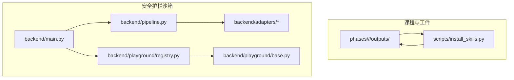
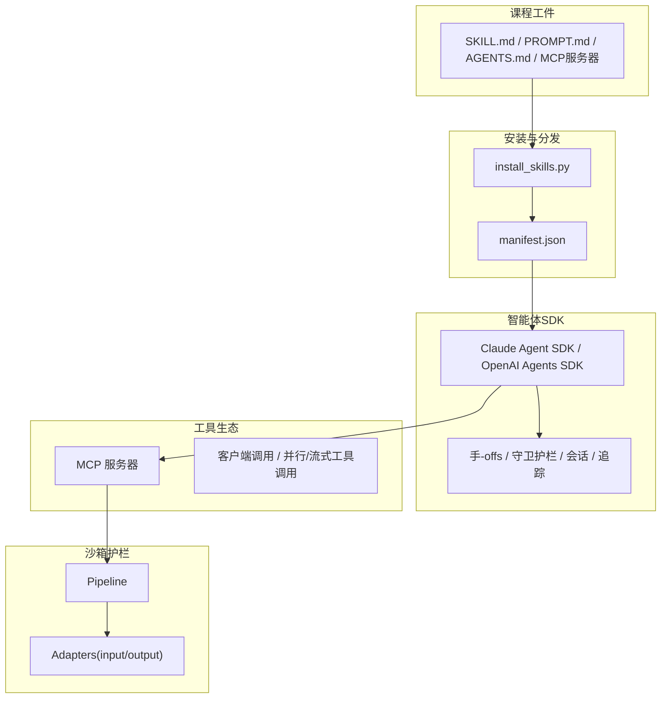
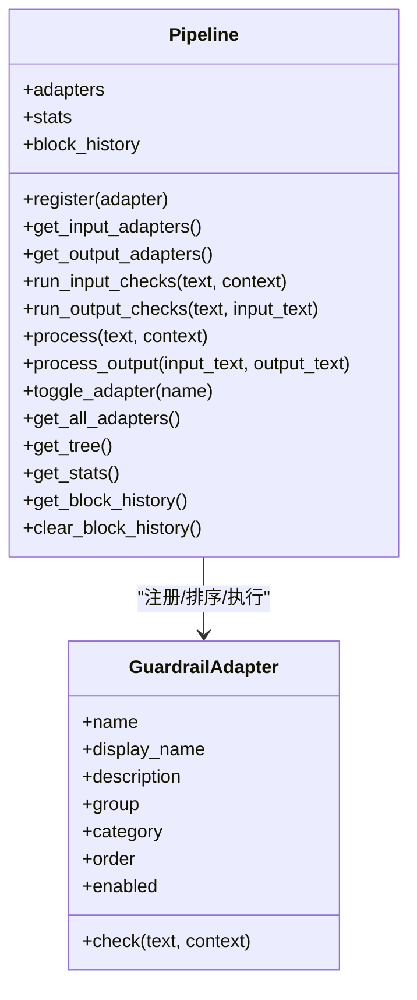
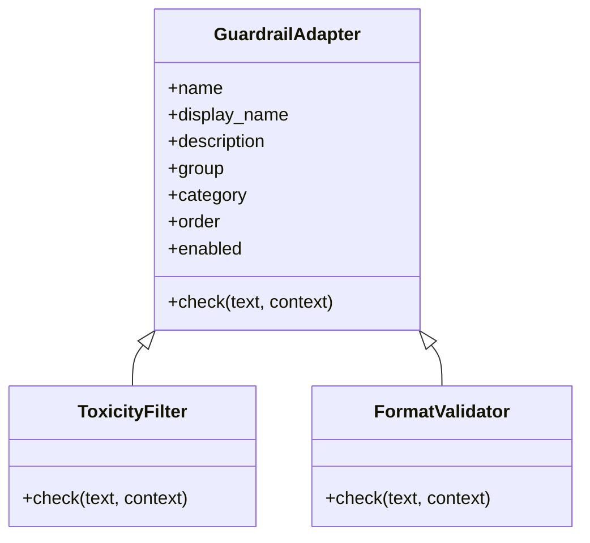
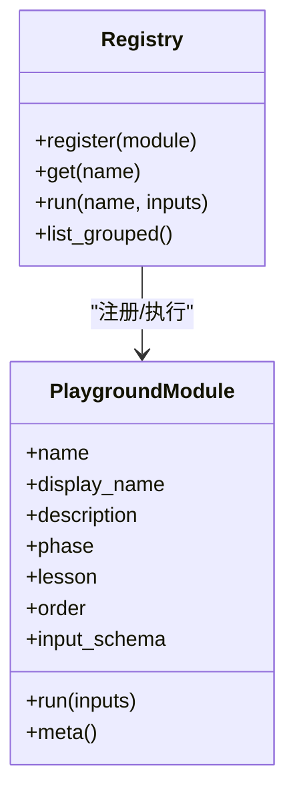
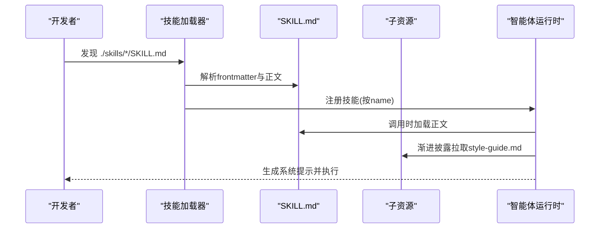
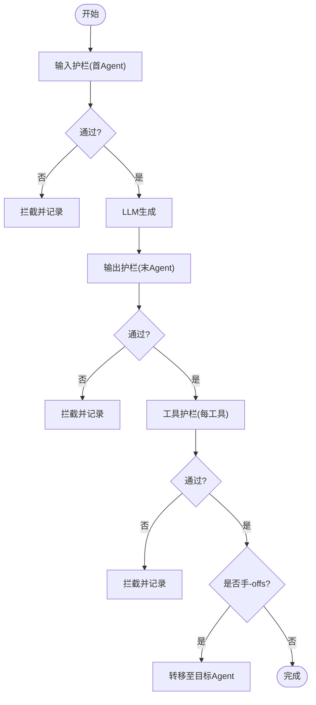
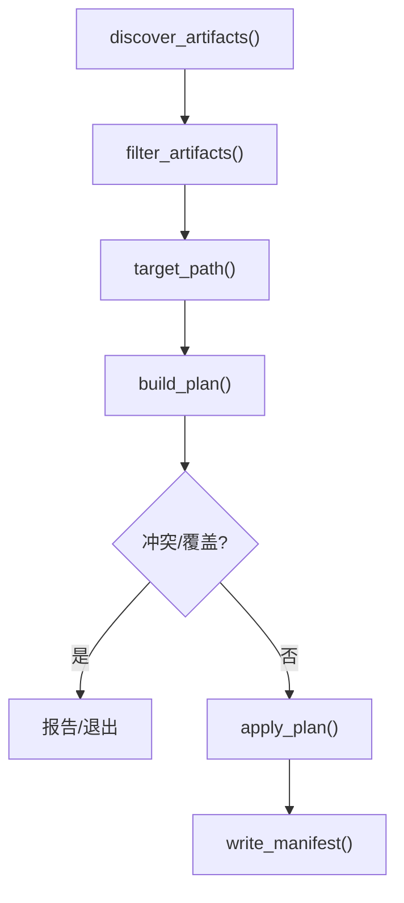
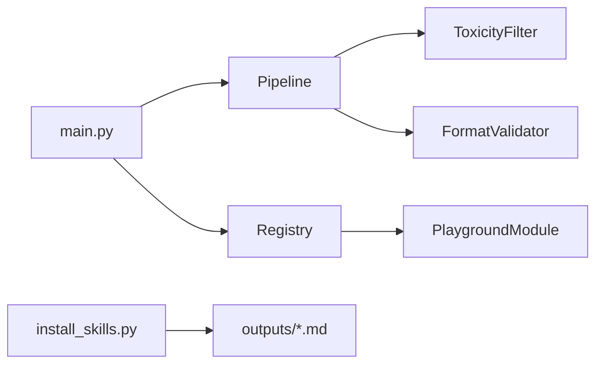

# 智能体SDK与工具

<cite>
**本文引用的文件**
- [README.md](file://README.md)
- [guardrails-sandbox/backend/main.py](file://guardrails-sandbox/backend/main.py)
- [guardrails-sandbox/backend/pipeline.py](file://guardrails-sandbox/backend/pipeline.py)
- [guardrails-sandbox/backend/adapters/base.py](file://guardrails-sandbox/backend/adapters/base.py)
- [guardrails-sandbox/backend/adapters/toxicity.py](file://guardrails-sandbox/backend/adapters/toxicity.py)
- [guardrails-sandbox/backend/adapters/format_validator.py](file://guardrails-sandbox/backend/adapters/format_validator.py)
- [guardrails-sandbox/backend/playground/registry.py](file://guardrails-sandbox/backend/playground/registry.py)
- [guardrails-sandbox/backend/playground/base.py](file://guardrails-sandbox/backend/playground/base.py)
- [scripts/install_skills.py](file://scripts/install_skills.py)
- [phases/13-tools-and-protocols/22-skills-and-agent-sdks/docs/en.md](file://phases/13-tools-and-protocols/22-skills-and-agent-sdks/docs/en.md)
- [phases/13-tools-and-protocols/22-skills-and-agent-sdks/code/main.py](file://phases/13-tools-and-protocols/22-skills-and-agent-sdks/code/main.py)
- [phases/14-agent-engineering/16-openai-agents-sdk/docs/en.md](file://phases/14-agent-engineering/16-openai-agents-sdk/docs/en.md)
</cite>

## 目录
1. [引言](#引言)
2. [项目结构](#项目结构)
3. [核心组件](#核心组件)
4. [架构总览](#架构总览)
5. [详细组件分析](#详细组件分析)
6. [依赖分析](#依赖分析)
7. [性能考虑](#性能考虑)
8. [故障排查指南](#故障排查指南)
9. [结论](#结论)
10. [附录](#附录)

## 引言
本技术文档围绕“智能体SDK与工具生态系统”展开，结合仓库中的课程与实验平台，系统阐述以下主题：
- 技能库设计与实现：技能定义、注册机制、版本管理、依赖处理与跨平台分发。
- 智能体SDK架构与使用：SDK初始化、配置管理、生命周期控制、手-offs、守卫护栏与追踪。
- 工具生态系统：工具分类、搜索与发现、推荐与质量评估、开发与集成最佳实践。
- 运营与管理：工具审核、更新维护、用户反馈闭环。
- 实战案例：基于课程产出的工具与技能在真实项目中的应用与效果评估。

本仓库以“课程 + 实践 + 可复用工件”的方式组织，每个阶段与课程均产出可安装的技能、提示词、智能体或MCP服务器，便于在不同Agent平台间移植与复用。

**章节来源**
- [README.md:1-120](file://README.md#L1-L120)

## 项目结构
该项目采用“阶段-课程-工件”的三层结构：
- phases/<phase>/<lesson>/outputs：产出技能、提示词、智能体、MCP服务器等可复用工件。
- scripts/install_skills.py：统一安装与分发这些工件，支持多种布局与过滤条件。
- guardrails-sandbox：安全护栏沙箱，包含适配器注册、流水线编排、Playground模块注册与API服务。
- phases/13-tools-and-protocols 与 phases/14-agent-engineering：分别覆盖工具协议与智能体SDK相关课程。

**图表来源**
- [guardrails-sandbox/backend/main.py:118-281](file://guardrails-sandbox/backend/main.py#L118-L281)
- [guardrails-sandbox/backend/pipeline.py:12-285](file://guardrails-sandbox/backend/pipeline.py#L12-L285)
- [guardrails-sandbox/backend/adapters/base.py:14-34](file://guardrails-sandbox/backend/adapters/base.py#L14-L34)
- [guardrails-sandbox/backend/playground/registry.py:48-118](file://guardrails-sandbox/backend/playground/registry.py#L48-L118)
- [scripts/install_skills.py:91-137](file://scripts/install_skills.py#L91-L137)

**章节来源**
- [README.md:87-112](file://README.md#L87-L112)
- [scripts/install_skills.py:1-292](file://scripts/install_skills.py#L1-L292)

## 核心组件
- 守卫护栏流水线（Pipeline）：负责注册适配器、按顺序执行输入/输出检查、统计拦截率与历史、支持开关与树形展示。
- 适配器基类（GuardrailAdapter）：统一的检查接口与元信息（分组、类别、顺序、启用状态）。
- Playground模块注册表：集中注册实验模块，按阶段分组，提供输入schema与结果渲染块。
- 技能加载器：标准库解析SKILL.md的frontmatter与正文，支持渐进披露子资源。
- 安装脚本：批量扫描课程工件、解析frontmatter、生成清单、按布局复制到目标目录。

**章节来源**
- [guardrails-sandbox/backend/pipeline.py:12-187](file://guardrails-sandbox/backend/pipeline.py#L12-L187)
- [guardrails-sandbox/backend/adapters/base.py:14-34](file://guardrails-sandbox/backend/adapters/base.py#L14-L34)
- [guardrails-sandbox/backend/playground/registry.py:48-84](file://guardrails-sandbox/backend/playground/registry.py#L48-L84)
- [phases/13-tools-and-protocols/22-skills-and-agent-sdks/code/main.py:85-140](file://phases/13-tools-and-protocols/22-skills-and-agent-sdks/code/main.py#L85-L140)
- [scripts/install_skills.py:47-72](file://scripts/install_skills.py#L47-L72)

## 架构总览
下图展示了“课程工件 → 安装脚本 → 智能体SDK/工具生态”的整体流转，以及沙箱中守卫护栏的执行路径。

**图表来源**
- [scripts/install_skills.py:229-292](file://scripts/install_skills.py#L229-L292)
- [phases/14-agent-engineering/16-openai-agents-sdk/docs/en.md:23-63](file://phases/14-agent-engineering/16-openai-agents-sdk/docs/en.md#L23-L63)
- [guardrails-sandbox/backend/main.py:283-357](file://guardrails-sandbox/backend/main.py#L283-L357)

## 详细组件分析

### 组件A：守卫护栏流水线（Pipeline）
- 注册与排序：按分组、类别、顺序排序，支持动态开关。
- 输入/输出检查：短路策略，遇阻断立即返回；输出阶段可进行脱敏与替换。
- 统计与历史：累计总数、拦截数、按层统计、拦截历史（最多保留50条）。
- API集成：FastAPI路由暴露开关、对比模式、基准测试入口。

**图表来源**
- [guardrails-sandbox/backend/pipeline.py:12-285](file://guardrails-sandbox/backend/pipeline.py#L12-L285)
- [guardrails-sandbox/backend/adapters/base.py:14-34](file://guardrails-sandbox/backend/adapters/base.py#L14-L34)

**章节来源**
- [guardrails-sandbox/backend/pipeline.py:12-187](file://guardrails-sandbox/backend/pipeline.py#L12-L187)
- [guardrails-sandbox/backend/main.py:121-281](file://guardrails-sandbox/backend/main.py#L121-L281)

### 组件B：适配器基类与典型实现
- 基类：统一的元信息与检查接口，派生类仅需实现check()。
- 示例：毒性过滤（输入）、格式校验（输出）等，体现“输入/输出”两类护栏的差异。

**图表来源**
- [guardrails-sandbox/backend/adapters/base.py:14-34](file://guardrails-sandbox/backend/adapters/base.py#L14-L34)
- [guardrails-sandbox/backend/adapters/toxicity.py:22-64](file://guardrails-sandbox/backend/adapters/toxicity.py#L22-L64)
- [guardrails-sandbox/backend/adapters/format_validator.py:13-86](file://guardrails-sandbox/backend/adapters/format_validator.py#L13-L86)

**章节来源**
- [guardrails-sandbox/backend/adapters/toxicity.py:1-64](file://guardrails-sandbox/backend/adapters/toxicity.py#L1-L64)
- [guardrails-sandbox/backend/adapters/format_validator.py:1-86](file://guardrails-sandbox/backend/adapters/format_validator.py#L1-L86)

### 组件C：Playground模块注册与实验台
- 模块注册表：集中注册模块，按阶段分组，提供输入schema与执行结果。
- 模块基类：统一输入字段声明与渲染块类型，前端按schema自动渲染。
- 典型模块：嵌入相似度、成本估算、提示分析、函数调用模拟、LangGraph仿真等。

**图表来源**
- [guardrails-sandbox/backend/playground/registry.py:48-118](file://guardrails-sandbox/backend/playground/registry.py#L48-L118)
- [guardrails-sandbox/backend/playground/base.py:101-129](file://guardrails-sandbox/backend/playground/base.py#L101-L129)

**章节来源**
- [guardrails-sandbox/backend/playground/registry.py:1-118](file://guardrails-sandbox/backend/playground/registry.py#L1-L118)
- [guardrails-sandbox/backend/playground/base.py:1-129](file://guardrails-sandbox/backend/playground/base.py#L1-L129)

### 组件D：技能加载器与三层数栈
- 技能加载：标准库解析frontmatter与正文，按文件夹名注册，支持渐进披露子资源。
- 三层数栈：AGENTS.md（项目级上下文）、SKILL.md（可复用工作流）、MCP（工具）。
- 课程目标：在Claude Code、Cursor、Codex等平台间移植同一技能包。

**图表来源**
- [phases/13-tools-and-protocols/22-skills-and-agent-sdks/code/main.py:111-161](file://phases/13-tools-and-protocols/22-skills-and-agent-sdks/code/main.py#L111-L161)
- [phases/13-tools-and-protocols/22-skills-and-agent-sdks/docs/en.md:52-106](file://phases/13-tools-and-protocols/22-skills-and-agent-sdks/docs/en.md#L52-L106)

**章节来源**
- [phases/13-tools-and-protocols/22-skills-and-agent-sdks/docs/en.md:1-183](file://phases/13-tools-and-protocols/22-skills-and-agent-sdks/docs/en.md#L1-L183)
- [phases/13-tools-and-protocols/22-skills-and-agent-sdks/code/main.py:1-191](file://phases/13-tools-and-protocols/22-skills-and-agent-sdks/code/main.py#L1-L191)

### 组件E：OpenAI Agents SDK（手-offs、守卫护栏、追踪）
- 五项原语：Agent、Handoff、Guardrail、Session、Tracing。
- 手-offs：以命名工具形式触发，携带/折叠上下文，进入目标Agent。
- 守卫护栏：输入/输出/工具三类，支持并行/阻塞两种模式。
- 追踪：默认开启，内置span，可接入外部后端。

**图表来源**
- [phases/14-agent-engineering/16-openai-agents-sdk/docs/en.md:23-63](file://phases/14-agent-engineering/16-openai-agents-sdk/docs/en.md#L23-L63)

**章节来源**
- [phases/14-agent-engineering/16-openai-agents-sdk/docs/en.md:1-125](file://phases/14-agent-engineering/16-openai-agents-sdk/docs/en.md#L1-L125)

### 组件F：安装与分发（install_skills.py）
- 发现：遍历phases/**/outputs，识别skill/prompt/agent工件。
- 解析：提取frontmatter元信息（name、phase、lesson、version、tags）。
- 过滤：按类型、阶段、标签筛选。
- 布局：flat/by-phase/skills三种目标布局。
- 清单：生成manifest.json，记录来源与目标映射。

**图表来源**
- [scripts/install_skills.py:91-137](file://scripts/install_skills.py#L91-L137)
- [scripts/install_skills.py:174-192](file://scripts/install_skills.py#L174-L192)
- [scripts/install_skills.py:200-227](file://scripts/install_skills.py#L200-L227)

**章节来源**
- [scripts/install_skills.py:1-292](file://scripts/install_skills.py#L1-L292)

## 依赖分析
- 组件耦合
  - Pipeline与Adapter：强内聚，Pipeline负责编排，Adapter职责单一。
  - Registry与PlaygroundModule：注册与执行解耦，模块自描述输入schema。
  - install_skills.py与课程工件：通过frontmatter与文件命名约定解耦。
- 外部依赖
  - FastAPI用于沙箱API服务。
  - sentence-transformers用于语义模型（离线加载）。
  - mcp客户端用于调用MCP服务器（示例）。

**图表来源**
- [guardrails-sandbox/backend/main.py:24-58](file://guardrails-sandbox/backend/main.py#L24-L58)
- [guardrails-sandbox/backend/pipeline.py:18-24](file://guardrails-sandbox/backend/pipeline.py#L18-L24)
- [guardrails-sandbox/backend/playground/registry.py:87-118](file://guardrails-sandbox/backend/playground/registry.py#L87-L118)
- [scripts/install_skills.py:91-137](file://scripts/install_skills.py#L91-L137)

**章节来源**
- [guardrails-sandbox/backend/main.py:1-421](file://guardrails-sandbox/backend/main.py#L1-L421)
- [guardrails-sandbox/backend/pipeline.py:1-285](file://guardrails-sandbox/backend/pipeline.py#L1-L285)
- [guardrails-sandbox/backend/playground/registry.py:1-118](file://guardrails-sandbox/backend/playground/registry.py#L1-L118)
- [scripts/install_skills.py:1-292](file://scripts/install_skills.py#L1-L292)

## 性能考虑
- 流水线短路：输入护栏遇阻断立即返回，避免后续开销。
- 适配器顺序：通过order控制执行顺序，将轻量检查前置。
- 异步与线程：沙箱中对协程运行提供兼容封装，避免uvicorn事件循环问题。
- 模型预热：启动时离线加载语义模型，减少首次调用延迟。
- 并行护栏：默认并行模式降低尾延迟，但可能浪费tokens；阻塞模式更节省token。

[本节为通用指导，不直接分析具体文件]

## 故障排查指南
- 拦截历史：通过/block-history与/clear-history接口查看与清理。
- 统计与树形：/guardrails与/adapters/tree返回当前启用状态与分组树。
- 对比模式：/chat/compare对比“无护栏”与“有护栏”输出，快速定位护栏影响。
- 基准测试：/benchmark按类别运行护栏效果评估。
- MCP调用：/api/mcp/call与/tools用于验证工具可用性与参数schema。

**章节来源**
- [guardrails-sandbox/backend/main.py:121-281](file://guardrails-sandbox/backend/main.py#L121-L281)
- [guardrails-sandbox/backend/pipeline.py:237-285](file://guardrails-sandbox/backend/pipeline.py#L237-L285)

## 结论
本仓库以“课程-工件-平台”三位一体的方式，提供了：
- 可移植的技能体系（SKILL.md + AGENTS.md + MCP），可在多Agent平台间复用。
- 可扩展的守卫护栏流水线，支持输入/输出/工具三类护栏与动态开关。
- 丰富的实验模块与安装分发工具，支撑工具生态的构建与运营。
- OpenAI/Claude等SDK的原语与最佳实践，便于在生产环境中落地。

建议在团队内推广“三层数栈 + 护栏流水线 + 安装分发”的标准化流程，持续迭代工具与技能，形成可审计、可观测、可复用的智能体工具生态。

[本节为总结性内容，不直接分析具体文件]

## 附录
- 实际项目中的工具应用案例与效果评估
  - 可参考课程中的“工具接口”“函数调用深度”“并行与流式工具调用”“结构化输出”等课程，结合沙箱护栏与安装脚本，形成从设计到上线的闭环。
  - 使用/install_skills.py批量安装技能，结合Playground模块进行效果评估与可视化。
  - 通过/benchmark与对比模式评估护栏对输出质量与安全性的影响。

**章节来源**
- [README.md:161-184](file://README.md#L161-L184)
- [phases/13-tools-and-protocols/22-skills-and-agent-sdks/docs/en.md:135-148](file://phases/13-tools-and-protocols/22-skills-and-agent-sdks/docs/en.md#L135-L148)
- [guardrails-sandbox/backend/main.py:272-281](file://guardrails-sandbox/backend/main.py#L272-L281)