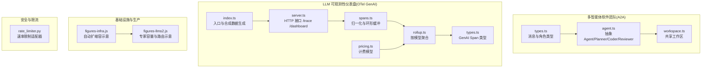
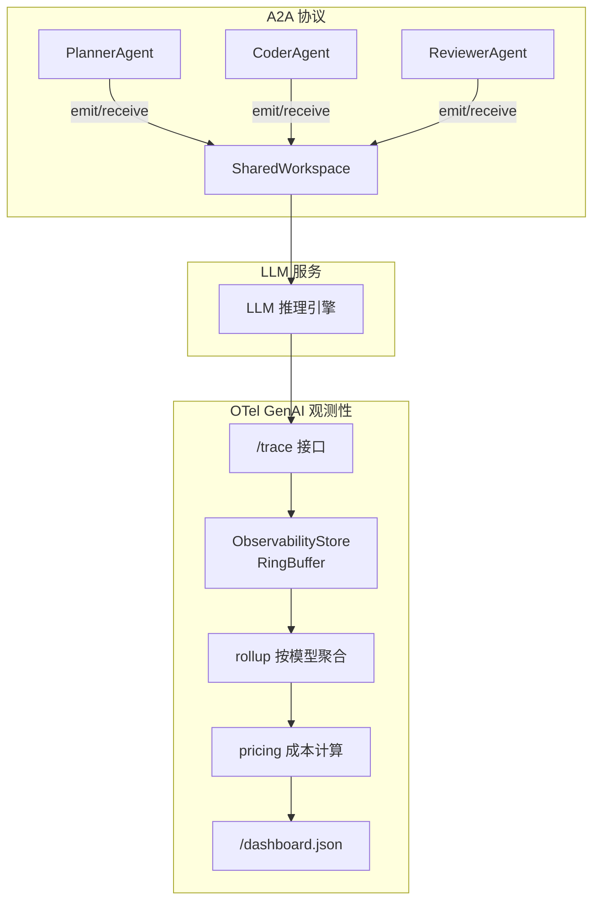
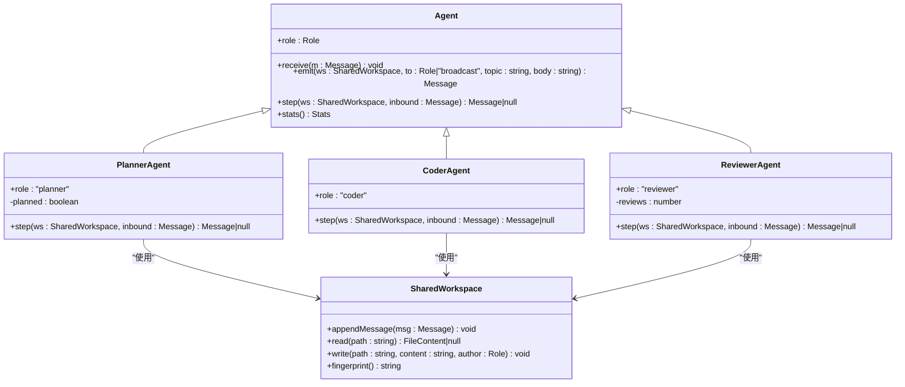
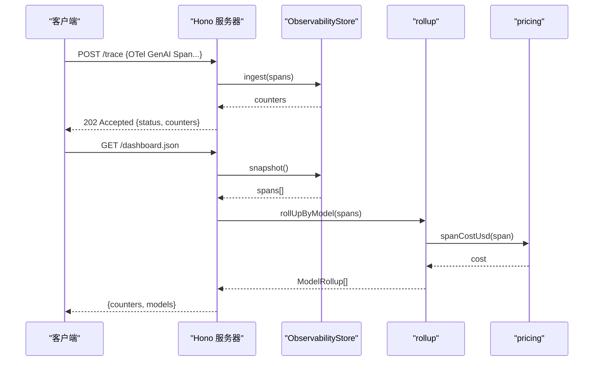
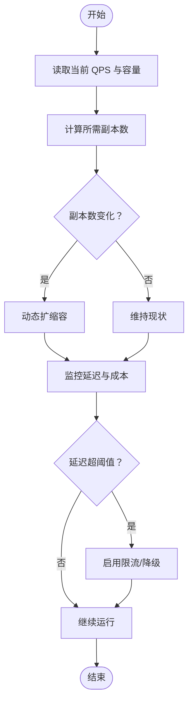
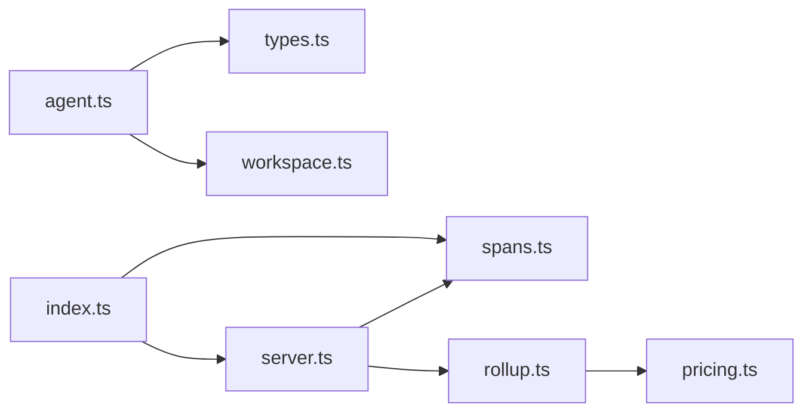

# 行业标准协议

<cite>
**本文引用的文件**
- [phases/19-capstone-projects/10-multi-agent-software-team/code/ts/src/agent.ts](file://phases/19-capstone-projects/10-multi-agent-software-team/code/ts/src/agent.ts)
- [phases/19-capstone-projects/10-multi-agent-software-team/code/ts/src/types.ts](file://phases/19-capstone-projects/10-multi-agent-software-team/code/ts/src/types.ts)
- [phases/19-capstone-projects/10-multi-agent-software-team/code/ts/src/workspace.ts](file://phases/19-capstone-projects/10-multi-agent-software-team/code/ts/src/workspace.ts)
- [phases/19-capstone-projects/11-llm-observability-dashboard/code/ts/src/index.ts](file://phases/19-capstone-projects/11-llm-observability-dashboard/code/ts/src/index.ts)
- [phases/19-capstone-projects/11-llm-observability-dashboard/code/ts/src/server.ts](file://phases/19-capstone-projects/11-llm-observability-dashboard/code/ts/src/server.ts)
- [phases/19-capstone-projects/11-llm-observability-dashboard/code/ts/src/spans.ts](file://phases/19-capstone-projects/11-llm-observability-dashboard/code/ts/src/spans.ts)
- [phases/19-capstone-projects/11-llm-observability-dashboard/code/ts/src/pricing.ts](file://phases/19-capstone-projects/11-llm-observability-dashboard/code/ts/src/pricing.ts)
- [phases/19-capstone-projects/11-llm-observability-dashboard/code/ts/src/rollup.ts](file://phases/19-capstone-projects/11-llm-observability-dashboard/code/ts/src/rollup.ts)
- [phases/19-capstone-projects/11-llm-observability-dashboard/code/ts/src/types.ts](file://phases/19-capstone-projects/11-llm-observability-dashboard/code/ts/src/types.ts)
- [phases/19-capstone-projects/11-llm-observability-dashboard/code/ts/tests/spans.test.ts](file://phases/19-capstone-projects/11-llm-observability-dashboard/code/ts/tests/spans.test.ts)
- [site/figures-llms2.js](file://site/figures-llms2.js)
- [site/figures-infra.js](file://site/figures-infra.js)
- [guardrails-sandbox/backend/adapters/rate_limiter.py](file://guardrails-sandbox/backend/adapters/rate_limiter.py)
</cite>

## 目录
1. 引言
2. 项目结构
3. 核心组件
4. 架构总览
5. 详细组件分析
6. 依赖分析
7. 性能考量
8. 故障排查指南
9. 结论
10. 附录

## 引言
本文件面向“行业标准协议”的权威技术文档，聚焦三大主题：
- A2A（Agent-to-Agent）协议：以多智能体协作与消息传递为核心，阐述消息格式、状态同步、事件驱动与工作区共享机制。
- OpenTelemetry GenAI 观测性标准：基于 OpenTelemetry GenAI 语义约定，实现追踪、指标与日志的统一采集与可视化，覆盖数据归一化、聚合与仪表盘输出。
- LLM 路由层设计：结合容量规划、负载分布与成本控制的思路，提供可扩展的路由与可观测性实践。

文档同时给出与外部系统的兼容性说明、集成步骤与最佳实践，帮助读者在真实项目中落地这些标准协议。

## 项目结构
本仓库包含多个阶段与实战项目，其中与本文主题直接相关的内容主要分布在以下路径：
- 多智能体软件团队（A2A 协议）：phases/19-capstone-projects/10-multi-agent-software-team
- LLM 可观测性仪表盘（OpenTelemetry GenAI）：phases/19-capstone-projects/11-llm-observability-dashboard
- 基础设施与生产（容量与负载）：site/figures-infra.js、site/figures-llms2.js
- 安全与限流（兼容性参考）：guardrails-sandbox/backend/adapters/rate_limiter.py

图表来源
- [phases/19-capstone-projects/10-multi-agent-software-team/code/ts/src/agent.ts:1-124](file://phases/19-capstone-projects/10-multi-agent-software-team/code/ts/src/agent.ts#L1-L124)
- [phases/19-capstone-projects/10-multi-agent-software-team/code/ts/src/types.ts:1-50](file://phases/19-capstone-projects/10-multi-agent-software-team/code/ts/src/types.ts#L1-L50)
- [phases/19-capstone-projects/10-multi-agent-software-team/code/ts/src/workspace.ts:1-200](file://phases/19-capstone-projects/10-multi-agent-software-team/code/ts/src/workspace.ts#L1-L200)
- [phases/19-capstone-projects/11-llm-observability-dashboard/code/ts/src/index.ts:1-122](file://phases/19-capstone-projects/11-llm-observability-dashboard/code/ts/src/index.ts#L1-L122)
- [phases/19-capstone-projects/11-llm-observability-dashboard/code/ts/src/server.ts:1-42](file://phases/19-capstone-projects/11-llm-observability-dashboard/code/ts/src/server.ts#L1-L42)
- [phases/19-capstone-projects/11-llm-observability-dashboard/code/ts/src/spans.ts:1-108](file://phases/19-capstone-projects/11-llm-observability-dashboard/code/ts/src/spans.ts#L1-L108)
- [phases/19-capstone-projects/11-llm-observability-dashboard/code/ts/src/pricing.ts:1-32](file://phases/19-capstone-projects/11-llm-observability-dashboard/code/ts/src/pricing.ts#L1-L32)
- [phases/19-capstone-projects/11-llm-observability-dashboard/code/ts/src/rollup.ts:1-200](file://phases/19-capstone-projects/11-llm-observability-dashboard/code/ts/src/rollup.ts#L1-L200)
- [phases/19-capstone-projects/11-llm-observability-dashboard/code/ts/src/types.ts:1-37](file://phases/19-capstone-projects/11-llm-observability-dashboard/code/ts/src/types.ts#L1-L37)
- [site/figures-infra.js:310-334](file://site/figures-infra.js#L310-L334)
- [site/figures-llms2.js:281-306](file://site/figures-llms2.js#L281-L306)
- [guardrails-sandbox/backend/adapters/rate_limiter.py:33-55](file://guardrails-sandbox/backend/adapters/rate_limiter.py#L33-L55)

章节来源
- [phases/19-capstone-projects/10-multi-agent-software-team/code/ts/src/agent.ts:1-124](file://phases/19-capstone-projects/10-multi-agent-software-team/code/ts/src/agent.ts#L1-L124)
- [phases/19-capstone-projects/11-llm-observability-dashboard/code/ts/src/index.ts:1-122](file://phases/19-capstone-projects/11-llm-observability-dashboard/code/ts/src/index.ts#L1-L122)

## 核心组件
- A2A 协议核心
  - 抽象 Agent 与具体角色：Planner、Coder、Reviewer，均通过共享工作区进行消息传递与状态同步。
  - 共享工作区：提供 appendMessage、read、write 等能力，支撑跨角色协作。
  - 消息格式：包含 from、to、topic、body、ts 等字段，支持广播与定向投递。
- OpenTelemetry GenAI 观测性
  - 归一化：normaliseSpan 将输入标准化为 GenAISpan，校验关键属性与时间戳。
  - 存储：RingBuffer 环形缓冲，容量固定，满载后逐出最旧项。
  - 聚合：rollup 按模型统计次数、错误数、延迟分位数与成本。
  - 计费：按模型单价计算输入/输出 token 成本。
  - 接口：/trace 接收 OTLP GenAI 风格 JSON；/dashboard.json 输出聚合结果。
- LLM 路由层设计思路
  - 容量与负载：专家容量与路由分配示意，体现负载倾斜与过载丢弃。
  - 自动扩缩容：副本数随 QPS 动态调整，维持目标延迟。
  - 限流与安全：速率限制适配器用于请求节流与风险控制。

章节来源
- [phases/19-capstone-projects/10-multi-agent-software-team/code/ts/src/agent.ts:1-124](file://phases/19-capstone-projects/10-multi-agent-software-team/code/ts/src/agent.ts#L1-L124)
- [phases/19-capstone-projects/10-multi-agent-software-team/code/ts/src/types.ts:1-50](file://phases/19-capstone-projects/10-multi-agent-software-team/code/ts/src/types.ts#L1-L50)
- [phases/19-capstone-projects/11-llm-observability-dashboard/code/ts/src/spans.ts:1-108](file://phases/19-capstone-projects/11-llm-observability-dashboard/code/ts/src/spans.ts#L1-L108)
- [phases/19-capstone-projects/11-llm-observability-dashboard/code/ts/src/rollup.ts:1-200](file://phases/19-capstone-projects/11-llm-observability-dashboard/code/ts/src/rollup.ts#L1-L200)
- [phases/19-capstone-projects/11-llm-observability-dashboard/code/ts/src/pricing.ts:1-32](file://phases/19-capstone-projects/11-llm-observability-dashboard/code/ts/src/pricing.ts#L1-L32)
- [site/figures-llms2.js:281-306](file://site/figures-llms2.js#L281-L306)
- [site/figures-infra.js:310-334](file://site/figures-infra.js#L310-L334)
- [guardrails-sandbox/backend/adapters/rate_limiter.py:33-55](file://guardrails-sandbox/backend/adapters/rate_limiter.py#L33-L55)

## 架构总览
下图展示 A2A 协议与 OTel GenAI 观测性的端到端关系：Agent 通过共享工作区交换消息，最终由 LLM 服务产生 OTel GenAI 风格的追踪数据，经由观测性系统进行采集、聚合与可视化。

图表来源
- [phases/19-capstone-projects/10-multi-agent-software-team/code/ts/src/agent.ts:1-124](file://phases/19-capstone-projects/10-multi-agent-software-team/code/ts/src/agent.ts#L1-L124)
- [phases/19-capstone-projects/11-llm-observability-dashboard/code/ts/src/server.ts:1-42](file://phases/19-capstone-projects/11-llm-observability-dashboard/code/ts/src/server.ts#L1-L42)
- [phases/19-capstone-projects/11-llm-observability-dashboard/code/ts/src/spans.ts:1-108](file://phases/19-capstone-projects/11-llm-observability-dashboard/code/ts/src/spans.ts#L1-L108)
- [phases/19-capstone-projects/11-llm-observability-dashboard/code/ts/src/rollup.ts:1-200](file://phases/19-capstone-projects/11-llm-observability-dashboard/code/ts/src/rollup.ts#L1-L200)
- [phases/19-capstone-projects/11-llm-observability-dashboard/code/ts/src/pricing.ts:1-32](file://phases/19-capstone-projects/11-llm-observability-dashboard/code/ts/src/pricing.ts#L1-L32)

## 详细组件分析

### A2A 协议：消息传递、状态同步与事件驱动
- 设计要点
  - 抽象类 Agent 提供 receive、emit 与 step 接口，统一消息生命周期。
  - Planner/Coder/Reviewer 各司其职，围绕 PLAN.md、refunds.py 等工件进行状态流转。
  - 广播与定向：支持 to="broadcast" 的广播消息，便于跨角色通知。
- 关键流程
  - 事件驱动：如 issue.opened 触发计划生成；review.changes_requested 触发重新计划。
  - 状态同步：通过共享工作区读写文件与消息队列，保证一致性。
- 数据模型
  - Message：from、to、topic、body、ts。
  - Role：planner、coder、reviewer。

图表来源
- [phases/19-capstone-projects/10-multi-agent-software-team/code/ts/src/agent.ts:1-124](file://phases/19-capstone-projects/10-multi-agent-software-team/code/ts/src/agent.ts#L1-L124)
- [phases/19-capstone-projects/10-multi-agent-software-team/code/ts/src/types.ts:1-50](file://phases/19-capstone-projects/10-multi-agent-software-team/code/ts/src/types.ts#L1-L50)
- [phases/19-capstone-projects/10-multi-agent-software-team/code/ts/src/workspace.ts:1-200](file://phases/19-capstone-projects/10-multi-agent-software-team/code/ts/src/workspace.ts#L1-L200)

章节来源
- [phases/19-capstone-projects/10-multi-agent-software-team/code/ts/src/agent.ts:1-124](file://phases/19-capstone-projects/10-multi-agent-software-team/code/ts/src/agent.ts#L1-L124)
- [phases/19-capstone-projects/10-multi-agent-software-team/code/ts/src/types.ts:1-50](file://phases/19-capstone-projects/10-multi-agent-software-team/code/ts/src/types.ts#L1-L50)

### OpenTelemetry GenAI 观测性：追踪、指标与日志统一
- 归一化与校验
  - normaliseSpan 对 trace_id/span_id 进行规范化，校验 gen_ai.system、gen_ai.request.model、时间戳与 token 字段。
- 存储与容量
  - ObservabilityStore 内部使用 RingBuffer，容量可配置，满载后逐出最旧项，同时维护 accepted/rejected/held 计数器。
- 聚合与可视化
  - rollup 按模型聚合：计数、错误数、输入/输出 token、延迟分位数与成本。
  - /dashboard.json 返回聚合结果；/healthz 返回健康状态与计数器。
- 计费
  - 按模型单价计算输入/输出 token 成本，支持多模型定价表。

图表来源
- [phases/19-capstone-projects/11-llm-observability-dashboard/code/ts/src/server.ts:1-42](file://phases/19-capstone-projects/11-llm-observability-dashboard/code/ts/src/server.ts#L1-L42)
- [phases/19-capstone-projects/11-llm-observability-dashboard/code/ts/src/spans.ts:1-108](file://phases/19-capstone-projects/11-llm-observability-dashboard/code/ts/src/spans.ts#L1-L108)
- [phases/19-capstone-projects/11-llm-observability-dashboard/code/ts/src/rollup.ts:1-200](file://phases/19-capstone-projects/11-llm-observability-dashboard/code/ts/src/rollup.ts#L1-L200)
- [phases/19-capstone-projects/11-llm-observability-dashboard/code/ts/src/pricing.ts:1-32](file://phases/19-capstone-projects/11-llm-observability-dashboard/code/ts/src/pricing.ts#L1-L32)

章节来源
- [phases/19-capstone-projects/11-llm-observability-dashboard/code/ts/src/index.ts:1-122](file://phases/19-capstone-projects/11-llm-observability-dashboard/code/ts/src/index.ts#L1-L122)
- [phases/19-capstone-projects/11-llm-observability-dashboard/code/ts/src/server.ts:1-42](file://phases/19-capstone-projects/11-llm-observability-dashboard/code/ts/src/server.ts#L1-L42)
- [phases/19-capstone-projects/11-llm-observability-dashboard/code/ts/src/spans.ts:1-108](file://phases/19-capstone-projects/11-llm-observability-dashboard/code/ts/src/spans.ts#L1-L108)
- [phases/19-capstone-projects/11-llm-observability-dashboard/code/ts/src/rollup.ts:1-200](file://phases/19-capstone-projects/11-llm-observability-dashboard/code/ts/src/rollup.ts#L1-L200)
- [phases/19-capstone-projects/11-llm-observability-dashboard/code/ts/src/pricing.ts:1-32](file://phases/19-capstone-projects/11-llm-observability-dashboard/code/ts/src/pricing.ts#L1-L32)
- [phases/19-capstone-projects/11-llm-observability-dashboard/code/ts/src/types.ts:1-37](file://phases/19-capstone-projects/11-llm-observability-dashboard/code/ts/src/types.ts#L1-L37)

### LLM 路由层设计：负载均衡、故障转移与性能监控
- 专家容量与路由
  - figures-llms2.js 展示了专家容量与路由分配，负载按固定份额分配，超过容量则产生丢弃与浪费。
- 自动扩缩容
  - figures-infra.js 展示了副本数随 QPS 动态调整，保持目标延迟。
- 成本与容量控制
  - 结合 pricing.ts 的成本模型，可在路由决策中引入成本权重，实现“性价比优先”的调度策略。

图表来源
- [site/figures-infra.js:310-334](file://site/figures-infra.js#L310-L334)
- [site/figures-llms2.js:281-306](file://site/figures-llms2.js#L281-L306)
- [phases/19-capstone-projects/11-llm-observability-dashboard/code/ts/src/pricing.ts:1-32](file://phases/19-capstone-projects/11-llm-observability-dashboard/code/ts/src/pricing.ts#L1-L32)

章节来源
- [site/figures-llms2.js:281-306](file://site/figures-llms2.js#L281-L306)
- [site/figures-infra.js:310-334](file://site/figures-infra.js#L310-L334)
- [phases/19-capstone-projects/11-llm-observability-dashboard/code/ts/src/pricing.ts:1-32](file://phases/19-capstone-projects/11-llm-observability-dashboard/code/ts/src/pricing.ts#L1-L32)

## 依赖分析
- 组件耦合
  - A2A 协议：Agent 依赖 SharedWorkspace；角色之间通过消息 topic 解耦。
  - OTel GenAI：server.ts 依赖 spans.ts 与 rollup.ts；pricing.ts 作为独立模块被 rollup.ts 使用。
- 外部依赖
  - Hono 用于 HTTP 服务；Node 内置 crypto 用于 ID 规范化；测试框架用于断言。
- 循环依赖
  - 未发现循环导入；模块职责清晰，接口边界明确。

图表来源
- [phases/19-capstone-projects/10-multi-agent-software-team/code/ts/src/agent.ts:1-124](file://phases/19-capstone-projects/10-multi-agent-software-team/code/ts/src/agent.ts#L1-L124)
- [phases/19-capstone-projects/10-multi-agent-software-team/code/ts/src/types.ts:1-50](file://phases/19-capstone-projects/10-multi-agent-software-team/code/ts/src/types.ts#L1-L50)
- [phases/19-capstone-projects/10-multi-agent-software-team/code/ts/src/workspace.ts:1-200](file://phases/19-capstone-projects/10-multi-agent-software-team/code/ts/src/workspace.ts#L1-L200)
- [phases/19-capstone-projects/11-llm-observability-dashboard/code/ts/src/server.ts:1-42](file://phases/19-capstone-projects/11-llm-observability-dashboard/code/ts/src/server.ts#L1-L42)
- [phases/19-capstone-projects/11-llm-observability-dashboard/code/ts/src/spans.ts:1-108](file://phases/19-capstone-projects/11-llm-observability-dashboard/code/ts/src/spans.ts#L1-L108)
- [phases/19-capstone-projects/11-llm-observability-dashboard/code/ts/src/rollup.ts:1-200](file://phases/19-capstone-projects/11-llm-observability-dashboard/code/ts/src/rollup.ts#L1-L200)
- [phases/19-capstone-projects/11-llm-observability-dashboard/code/ts/src/pricing.ts:1-32](file://phases/19-capstone-projects/11-llm-observability-dashboard/code/ts/src/pricing.ts#L1-L32)
- [phases/19-capstone-projects/11-llm-observability-dashboard/code/ts/src/index.ts:1-122](file://phases/19-capstone-projects/11-llm-observability-dashboard/code/ts/src/index.ts#L1-L122)

章节来源
- [phases/19-capstone-projects/11-llm-observability-dashboard/code/ts/src/index.ts:1-122](file://phases/19-capstone-projects/11-llm-observability-dashboard/code/ts/src/index.ts#L1-L122)
- [phases/19-capstone-projects/11-llm-observability-dashboard/code/ts/src/server.ts:1-42](file://phases/19-capstone-projects/11-llm-observability-dashboard/code/ts/src/server.ts#L1-L42)

## 性能考量
- A2A 协议
  - 消息处理复杂度：单步处理为 O(1)，状态同步依赖工作区读写，建议对热点文件采用增量更新策略。
  - 广播开销：广播消息会增加接收方处理负担，应谨慎使用。
- OTel GenAI 观测性
  - 归一化与校验：normaliseSpan 为 O(1) 校验，整体吞吐受限于 JSON 解析与内存分配。
  - 环形缓冲：push/snapshot 为 O(n)（n 为容量），建议在高并发场景下考虑异步写入或批量提交。
  - 聚合成本：rollup 按模型聚合，时间复杂度 O(m·k)（m 为模型数，k 为样本数），可通过缓存中间结果优化。
- 路由层
  - 专家容量与路由：负载倾斜与丢弃策略影响延迟与吞吐，需结合 SLA 调整容量系数与份额。
  - 自动扩缩容：副本数调整存在滞后，应配合告警与自适应参数动态调节。

## 故障排查指南
- OTel GenAI 归一化失败
  - 现象：/trace 返回 400，错误信息提示请求无效。
  - 排查：检查 gen_ai.system、gen_ai.request.model 是否缺失；确认时间戳与 token 字段是否为非负整数。
  - 测试用例参考：[spans.test.ts:35-62](file://phases/19-capstone-projects/11-llm-observability-dashboard/code/ts/tests/spans.test.ts#L35-L62)
- 观测性存储溢出
  - 现象：计数器中 held 增加，dashboard 数据不完整。
  - 排查：增大容量或降低写入频率；检查 /healthz 中 counters。
  - 测试用例参考：[spans.test.ts:64-78](file://phases/19-capstone-projects/11-llm-observability-dashboard/code/ts/tests/spans.test.ts#L64-L78)
- 速率限制触发
  - 现象：限流返回拒绝与原因，latency_ms 显著上升。
  - 排查：检查限流窗口与阈值配置，必要时提升配额或引入分级限流。
  - 参考实现：[rate_limiter.py:33-55](file://guardrails-sandbox/backend/adapters/rate_limiter.py#L33-L55)

章节来源
- [phases/19-capstone-projects/11-llm-observability-dashboard/code/ts/tests/spans.test.ts:35-78](file://phases/19-capstone-projects/11-llm-observability-dashboard/code/ts/tests/spans.test.ts#L35-L78)
- [guardrails-sandbox/backend/adapters/rate_limiter.py:33-55](file://guardrails-sandbox/backend/adapters/rate_limiter.py#L33-L55)

## 结论
本文从代码层面梳理了 A2A 协议的消息传递与状态同步机制、OpenTelemetry GenAI 观测性的数据采集与聚合流程，以及 LLM 路由层的容量与负载管理思路。通过模块化的实现与清晰的接口边界，这些标准协议能够在多智能体协作与 LLM 生产环境中稳定运行，并为后续扩展与集成提供坚实基础。

## 附录
- 集成指南（概要）
  - A2A 协议
    - 在现有 Agent 基类上扩展新角色，遵循 emit/receive/step 约定。
    - 使用 SharedWorkspace 管理工件与消息，避免直接共享可变状态。
  - OTel GenAI 观测性
    - 将 LLM 推理调用包装为 OTel GenAI Span，设置必要的 attributes。
    - 部署 /trace 接口，接入 ObservabilityStore 与 rollup/pricing 模块。
  - LLM 路由层
    - 结合专家容量与自动扩缩容策略，设定容量系数与份额分配。
    - 引入成本模型参与路由决策，平衡延迟与成本。
- 兼容性与互操作性
  - A2A 协议：消息格式与角色模型可映射至其他多智能体框架。
  - OTel GenAI：遵循 OpenTelemetry GenAI 语义约定，可与主流链路平台对接。
  - 限流与安全：参考 rate_limiter.py 的实现，适配不同系统的限流接口。